# Architecture Overview

This repository holds **AiPersimmon DDD** — a set of DDD building blocks published as Maven modules —
together with a reference service that consumes them and the design record behind both.

For *using* the library, start at [aipersimmon-ddd/README.md](aipersimmon-ddd/README.md). This
document is about how the modules are arranged and why, which is what you need before changing them.

## 1. Repository layout

```
.
├── aipersimmon-ddd/                 the library: 47 Maven modules + BOM (see §3)
│   ├── README.md                    quick start
│   ├── CHOOSING-MODULES.md          which dependency for which problem
│   └── CONFIGURATION.md             every aipersimmon.ddd.* property
├── aipersimmon-ddd-scaffold/
│   └── multi-module/                reference service: 3 bounded contexts, 5 layers each
├── docs/                            the design record — analysis, decision, design, plan,
│                                    spec, issue, report, record (internal, id-referenced)
├── AGENTS.md  DEVELOPMENT.md  TESTING.md  CODE_QUALITY.md  DOCUMENT.md  CONTEXT.md
└── ARCHITECTURE.md                  this file
```

`docs/` is a design record, not user documentation: it answers "why was it decided this way", numbered
`decision-00019`, `design-00011` and so on. The three guides under `aipersimmon-ddd/` answer "how do I
use this" and deliberately cite no document ids, so they stay readable to someone who has only the
published jars.

## 2. The four kinds of module

Every module is exactly one of these, and its **name says which**:

| Shape | Role | May depend on a framework | A domain module may depend on it |
| --- | --- | --- | --- |
| `aipersimmon-ddd-<concern>` | **contract** — ports, value objects, state machines | **no** | **yes** |
| `aipersimmon-ddd-<concern>-<backend>` | **adapter** — `jdbc`, `mybatis-plus`, `redis`, `kafka` | yes | no |
| `aipersimmon-ddd-<concern>-engine` | **runtime** — storage-agnostic scheduling, leases, retries | yes | no |
| `aipersimmon-ddd-<concern>-spring-boot-starter` | **wiring** for one concern | yes | no |
| `aipersimmon-ddd-starter[-<stack>]` | **bundle** — aggregates the above | yes | no |

### The invariant

> A module a domain layer may depend on must be framework-free.

That is the point of the whole arrangement: business code compiles without Spring, so it can be
unit-tested without a container and is not held hostage by a framework upgrade. Adapters, runtimes,
wiring and bundles are the pluggable half and may name whatever they need.

`ModuleNamingChecks` in `aipersimmon-ddd-archunit` enforces both halves at build time: a module with
no technology suffix may not declare an `org.springframework` or `com.baomidou` dependency outside
test scope, and no artifactId may end in `-spring` (the abandoned spelling of
`-spring-boot-starter`). Four build-tooling modules are exempt, with the reasons recorded in the class.

### Adapter and wiring are one module, on purpose

A backend adapter ships its own `AutoConfiguration.imports`. Splitting each into
`-<concern>-<backend>` plus `-<concern>-<backend>-spring-boot-starter` would take 47 modules to about
60 and double what a consumer assembles by hand — for no added choice, since there is only ever one
way to wire a given adapter.

## 3. Module map

```mermaid
flowchart TD
    subgraph contract["Contract — framework-free, safe for domain code"]
        core["core"]
        integration["integration"]
        tenancy["tenancy"]
        observability["observability"]
        cqrs["cqrs"]
        application["application"]
        web["web"]
        outbox["outbox"]
        inbox["inbox"]
        pm["process-manager"]
        oplog["operation-log"]
    end

    subgraph runtime["Runtime — storage-agnostic"]
        pmEngine["process-manager-engine"]
        oplogEngine["operation-log-engine"]
    end

    subgraph adapter["Adapter — one technology each"]
        persistenceMp["persistence-mybatis-plus"]
        outboxMp["outbox-mybatis-plus"]
        inboxMp["inbox-mybatis-plus"]
        pmMp["process-manager-mybatis-plus"]
        oplogMp["operation-log-mybatis-plus"]
        tenancyMp["tenancy-mybatis-plus"]
        kafka["messaging-kafka"]
        otel["observability-otel"]
    end

    subgraph wiring["Wiring — one concern each"]
        cqrsS["cqrs-…-starter"]
        eventsS["events-…-starter"]
        webS["web-…-starter"]
        idS["id-…-starter"]
        outboxS["outbox-…-starter"]
        mpS["mybatis-plus-…-starter"]
    end

    subgraph bundle["Bundle — what an application declares"]
        starter["starter"]
        starterMp["starter-mybatis-plus"]
        starterKafka["starter-messaging-kafka"]
    end

    cqrs --> core
    cqrs --> tenancy
    application --> core
    application --> integration
    application --> cqrs
    web --> core
    outbox --> integration
    pm --> core
    oplog --> core

    pmEngine --> pm
    oplogEngine --> oplog
    pmMp --> pmEngine
    oplogMp --> oplogEngine
    outboxMp --> outboxS
    outboxS --> outbox
    inboxMp --> inbox
    kafka --> outboxS
    kafka --> inbox
    tenancyMp --> mpS
    persistenceMp --> mpS
    otel --> observability

    starter --> cqrsS
    starter --> eventsS
    starter --> idS
    starter --> webS
    starterMp --> starter
    starterMp --> persistenceMp
    starterMp --> outboxMp
    starterMp --> inboxMp
    starterMp --> pmMp
    starterMp --> oplogMp
    starterMp --> tenancyMp
    starterKafka --> kafka

    classDef c fill:#eafaf1,stroke:#2f855a,color:#1c4532;
    classDef r fill:#eef2ff,stroke:#4c51bf,color:#2a2f6b;
    classDef a fill:#fff5eb,stroke:#c05621,color:#7b341e;
    classDef w fill:#f7f7f7,stroke:#718096,color:#2d3748;
    classDef b fill:#e8f4ff,stroke:#2b6cb0,color:#1a365d;
    class core,integration,tenancy,observability,cqrs,application,web,outbox,inbox,pm,oplog c;
    class pmEngine,oplogEngine r;
    class persistenceMp,outboxMp,inboxMp,pmMp,oplogMp,tenancyMp,kafka,otel a;
    class cqrsS,eventsS,webS,idS,outboxS,mpS w;
    class starter,starterMp,starterKafka b;
```



The JDBC adapters (`persistence-jdbc`, `outbox-jdbc`, `inbox-jdbc`, `process-manager-jdbc`,
`operation-log-jdbc`, `web-store-jdbc`), `web-store-redis`, and the remaining wiring modules
(`tenancy-…`, `operation-log-cqrs-…`, `flyway-…`, `openapi-…`, `observability-otel-…`) are omitted from
the diagram only to keep it legible; they sit in the same tiers as their MyBatis-Plus counterparts and
are listed in full below.

Edges are `compile` scope and the graph is acyclic. `core` and `integration` are roots with no internal
dependencies; `integration` in particular must **stay** a root, so a service that publishes integration
events and nothing else does not inherit the command bus.

### Responsibilities

**Contract — framework-free**

| Module | Holds |
| --- | --- |
| `core` | Aggregate root base (identity equality, event buffer, optimistic-lock version), `Entity`, `Identifier`, `Association`, `Invariant`, `Specification`, `Transitions`, `ErrorCode`, `IdGenerator` SPI, domain exception base |
| `integration` | `IntegrationEvent` marker, `EventEnvelope` (CloudEvents-shaped), `@EventType`, `@Externalized`, the type catalogue |
| `cqrs` | Command/query buses, handler markers, `CommandInterceptor` SPI, `CommandContext`, `UnitOfWork`, `Page`/`Slice`/`Cursor` |
| `application` | `DomainEvents` / `IntegrationEvents` ports, application exceptions, `InboundEvents` (an inbound event's identity becoming the command's cause) |
| `tenancy` | `TenantId`, the root sentinel, request-scoped `TenantContext` (whose `effective()` is the one place the "nothing bound" case is decided — fail-closed once multi-tenancy is on), `TenantEnforcement`, `TenantResolver` / `MissingTenantPolicy` SPIs |
| `web` | RFC 9457 problem model and registry, idempotency / replay / rate-limit / signature SPIs |
| `outbox` | `OutboxMessage`, `OutboxDispatcher`, `FailureClassifier`, `RetryBackoff`, `DeadLetterStore` |
| `inbox` | The `Inbox` idempotency port, and the table both adapters write to |
| `process-manager` | Process identity and lifecycle, `ProcessDefinition` / `ProcessDecision` / effects, store and query ports, codec SPI |
| `operation-log` | Immutable audit model, definition lifecycle, ports, `FailureClassifier` SPI, `@OperationLog` |
| `observability` | Store-and-forward trace carrier, domain-span tracer, attribute catalogue — no-op by default |

**Runtime**

| Module | Holds |
| --- | --- |
| `process-manager-engine` | Transition runtime, effect relay, deadline worker, lease and retry policy, shared wiring — all over store ports |
| `operation-log-engine` | The `OperationLogs` pipeline, default failure classification, redaction, wiring |

**Adapter**

| Module | Holds |
| --- | --- |
| `persistence-mybatis-plus` / `persistence-jdbc` | Version-checked aggregate repository bases: versioned write, affected-rows check, event draining |
| `outbox-mybatis-plus` / `outbox-jdbc` | Outbox writer plus the ShedLock-guarded relay with per-subject ordering |
| `inbox-mybatis-plus` / `inbox-jdbc` | The `Inbox` implementation and its retention cleanup |
| `process-manager-mybatis-plus` / `-jdbc` | The four-table store, claim strategy (`SKIP LOCKED` on JDBC), dialect selection |
| `operation-log-mybatis-plus` / `-jdbc` | Audit sink with dialect-native duplicate convergence |
| `tenancy-mybatis-plus` | Tenant-line inner interceptor over an opt-in table allow-list |
| `messaging-kafka` | Kafka `OutboxDispatcher`, per-event routing, inbox-guarded consumer bridge, three-tier error handling |
| `web-store-jdbc` / `web-store-redis` | Shared idempotency / nonce / rate-limit stores |
| `observability-otel` | OpenTelemetry implementation of the observability SPIs |

**Wiring**

| Module | Holds |
| --- | --- |
| `cqrs-spring-boot-starter` | `RegistryCommandBus` / `RegistryQueryBus`, the interceptor chain (logging → retry-on-conflict (opt-in) → validation → prechecks → concurrency translation → transaction), unit of work, aggregate collector |
| `events-spring-boot-starter` | The in-process transport for domain and integration events |
| `web-spring-boot-starter` | Problem-detail advice, request-id filter, cursor serialization, i18n titles, the in-memory-store guard |
| `id-spring-boot-starter` | The UUIDv7 `IdGenerator` |
| `tenancy-spring-boot-starter` | Edge resolution filter, and the interceptor binding `TenantContext` from the command |
| `outbox-spring-boot-starter` | Dispatcher selection, bound properties, the in-process dispatcher, the event-type scanner |
| `operation-log-cqrs-spring-boot-starter` | The two capture interceptors, restricted template engine, annotation compiler, resolvers |
| `mybatis-plus-spring-boot-starter` | Owns the **single** `MybatisPlusInterceptor` and composes every `InnerInterceptor` contribution in `@Order` |
| `flyway-spring-boot-starter` | Applies each listed component's migrations on its own history table |
| `openapi-spring-boot-starter` | springdoc, plus documentation of the problem responses actually emitted |
| `observability-otel-spring-boot-starter` | Binds the SPIs to OpenTelemetry and pulls in boundary instrumentation |

**Bundle**

| Module | Aggregates |
| --- | --- |
| `starter` | cqrs + events + id + web |
| `starter-mybatis-plus` | `starter` + every MyBatis-Plus backend + tenancy + Flyway |
| `starter-jdbc` | `starter` + every JDBC backend + tenant propagation + Flyway |
| `starter-messaging-kafka` | The Kafka transport, on top of a storage bundle |

**Tooling**

| Module | Holds |
| --- | --- |
| `bom` | Version alignment for every module |
| `archunit` | The layering and building-block rules, plus the module-naming and package-info checks, as runnable tests |
| `test-support` | Singleton Testcontainers and `@ServiceConnection` configs |
| `quality-config` | Shared PMD ruleset and SpotBugs excludes |

## 4. Runtime shape of a service

```mermaid
flowchart LR
    HTTP["HTTP"] --> Filters["request-id · tenant · idempotency · rate limit"]
    Filters --> Controller
    Controller --> Bus["CommandBus"]
    Bus --> Interceptors["logging → concurrency → validation → transaction"]
    Interceptors --> Handler["CommandHandler"]
    Handler --> Aggregate["Aggregate (invariants, transitions)"]
    Handler --> Repo["Repository"]
    Repo --> DB[("Database")]
    Repo --> Drain["publishAndClear"]
    Drain --> DomainEvents["domain event handlers (same transaction)"]
    DomainEvents --> Outbox["outbox row (same transaction)"]
    Outbox --> Relay["relay (ShedLock, per-subject order)"]
    Relay --> Broker[("Kafka")]
    Broker --> Bridge["consumer bridge + inbox"]
    Bridge --> LocalHandlers["local @EventListener"]
    LocalHandlers --> Process["ProcessManager (durable, at-least-once)"]
    Process --> Bus
```



Four properties this shape exists to guarantee:

1. **One command, one aggregate, one version-checked write.** A stale write matches no row and is
   refused, surfacing as 409 rather than as a lost update.
2. **State change and its events commit together.** The aggregate write, the domain-event handling and
   the outbox row are one transaction; the broker hop happens afterwards, from committed state.
3. **Redelivery is safe.** Publishing is at-least-once, so the consumer side is guarded by an inbox
   keyed on the producer-assigned event id, inside the handling transaction.
4. **A long flow is not a long transaction.** Cross-aggregate coordination lives in the process
   manager as a pure `(state, input) → decision` function over durable state, so an out-of-order or
   repeated fact is a no-op rather than a corruption.

## 5. The reference service

`aipersimmon-ddd-scaffold/multi-module` is a working Spring Boot application with three bounded
contexts (ordering, inventory, payment), each layered `api` / `domain` / `application` /
`infrastructure` / `adapter`, plus a `start` module that assembles them.

It exercises the framework end to end against real infrastructure — PostgreSQL and Kafka via
Testcontainers — covering concurrent aggregate writes, multi-tenant acceptance, the durable seven-step
fulfilment flow with ordered compensation, and the audit log. Treat it as a demonstration, not as
design authority: the record in `docs/` is authoritative.

## 6. Quality gates

`mvn -f aipersimmon-ddd/pom.xml install` runs, per module: Spotless (google-java-format), PMD + CPD,
SpotBugs, JaCoCo, and PIT mutation coverage on the framework-free contract modules. The ArchUnit rules
run as ordinary tests. See [CODE_QUALITY.md](CODE_QUALITY.md) and [TESTING.md](TESTING.md); a failing
gate is fixed, never raised or suppressed.
