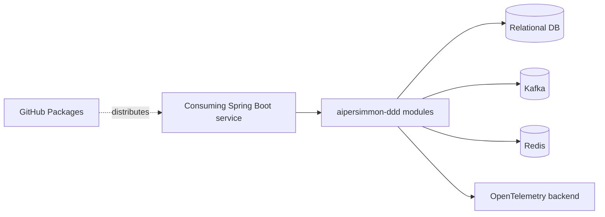

```mermaid
flowchart TD
    subgraph contract["Contract — framework-free, safe for domain code"]
        core["core"]
        integration["integration"]
        tenancy["tenancy"]
        observability["observability"]
        cqrs["cqrs"]
        application["application"]
        web["web"]
        outbox["outbox"]
        inbox["inbox"]
        pm["process-manager"]
        oplog["operation-log"]
    end

    subgraph runtime["Runtime — storage-agnostic"]
        pmEngine["process-manager-engine"]
        oplogEngine["operation-log-engine"]
    end

    subgraph adapter["Adapter — one technology each"]
        persistenceMp["persistence-mybatis-plus"]
        outboxMp["outbox-mybatis-plus"]
        inboxMp["inbox-mybatis-plus"]
        pmMp["process-manager-mybatis-plus"]
        oplogMp["operation-log-mybatis-plus"]
        tenancyMp["tenancy-mybatis-plus"]
        kafka["messaging-kafka"]
        otel["observability-otel"]
    end

    subgraph wiring["Wiring — one concern each"]
        cqrsS["cqrs-…-starter"]
        eventsS["events-…-starter"]
        webS["web-…-starter"]
        idS["id-…-starter"]
        outboxS["outbox-…-starter"]
        mpS["mybatis-plus-…-starter"]
    end

    subgraph bundle["Bundle — what an application declares"]
        starter["starter"]
        starterMp["starter-mybatis-plus"]
        starterKafka["starter-messaging-kafka"]
    end

    cqrs --> core
    cqrs --> tenancy
    application --> core
    application --> integration
    application --> cqrs
    web --> core
    outbox --> integration
    pm --> core
    oplog --> core

    pmEngine --> pm
    oplogEngine --> oplog
    pmMp --> pmEngine
    oplogMp --> oplogEngine
    outboxMp --> outboxS
    outboxS --> outbox
    inboxMp --> inbox
    kafka --> outboxS
    kafka --> inbox
    tenancyMp --> mpS
    persistenceMp --> mpS
    otel --> observability

    starter --> cqrsS
    starter --> eventsS
    starter --> idS
    starter --> webS
    starterMp --> starter
    starterMp --> persistenceMp
    starterMp --> outboxMp
    starterMp --> inboxMp
    starterMp --> pmMp
    starterMp --> oplogMp
    starterMp --> tenancyMp
    starterKafka --> kafka

    classDef c fill:#eafaf1,stroke:#2f855a,color:#1c4532;
    classDef r fill:#eef2ff,stroke:#4c51bf,color:#2a2f6b;
    classDef a fill:#fff5eb,stroke:#c05621,color:#7b341e;
    classDef w fill:#f7f7f7,stroke:#718096,color:#2d3748;
    classDef b fill:#e8f4ff,stroke:#2b6cb0,color:#1a365d;
    class core,integration,tenancy,observability,cqrs,application,web,outbox,inbox,pm,oplog c;
    class pmEngine,oplogEngine r;
    class persistenceMp,outboxMp,inboxMp,pmMp,oplogMp,tenancyMp,kafka,otel a;
    class cqrsS,eventsS,webS,idS,outboxS,mpS w;
    class starter,starterMp,starterKafka b;
```

```mermaid
flowchart LR
    HTTP["HTTP"] --> Filters["request-id · tenant · idempotency · rate limit"]
    Filters --> Controller
    Controller --> Bus["CommandBus"]
    Bus --> Interceptors["logging → concurrency → validation → transaction"]
    Interceptors --> Handler["CommandHandler"]
    Handler --> Aggregate["Aggregate (invariants, transitions)"]
    Handler --> Repo["Repository"]
    Repo --> DB[("Database")]
    Repo --> Drain["publishAndClear"]
    Drain --> DomainEvents["domain event handlers (same transaction)"]
    DomainEvents --> Outbox["outbox row (same transaction)"]
    Outbox --> Relay["relay (ShedLock, per-subject order)"]
    Relay --> Broker[("Kafka")]
    Broker --> Bridge["consumer bridge + inbox"]
    Bridge --> LocalHandlers["local @EventListener"]
    LocalHandlers --> Process["ProcessManager (durable, at-least-once)"]
    Process --> Bus
```

# Architecture Overview

This repository holds **AiPersimmon DDD** — a set of DDD building blocks published as Maven modules —
together with a reference service that consumes them and the design record behind both.

For *using* the library, start at [aipersimmon-ddd/README.md](aipersimmon-ddd/README.md). This
document is about how the modules are arranged and why, which is what you need before changing them.

## 1. Introduction & Goals

Building blocks for Java services practicing tactical DDD, consumed by Spring Boot applications.
Quality goals, ranked:

1. **Framework freedom** — domain code compiles and unit-tests without Spring (§5.2's invariant).
2. **Correctness under concurrency and redelivery** — no lost updates, no duplicate effects (§10).
3. **Piecemeal adoption** — every concern usable alone; bundles are convenience, not lock-in.

System requirements live in `docs/spec/`:
[operation log](docs/spec/spec-00001-operation-log-component.md),
[multi-tenancy](docs/spec/spec-00002-multi-tenancy.md).

## 2. Constraints

| Constraint | Source |
| --- | --- |
| Java 21, Maven | `aipersimmon-ddd/pom.xml` (`maven.compiler.release`) |
| Docs-system skeleton files are owned by template `main`; this branch may not edit them | `.template-sync.json`, `frozen-docs` CI gate |

## 3. Context & Scope



| Neighbor | Direction | Purpose |
| --- | --- | --- |
| Consuming service | in | assembles the BOM, starters, and adapters |
| Relational DB | out | aggregate persistence, outbox/inbox/process/audit tables (MyBatis-Plus adapters) |
| Kafka | out | integration event transport |
| Redis | out | shared web stores: idempotency, nonce, rate limit |
| OpenTelemetry backend | out | traces via `observability-otel` |
| GitHub Packages | out | published library and archetype |

## 4. Solution Strategy

- Five module shapes with a framework-free contract tier (§5.2) —
  [design-00012](docs/design/design-00012-module-naming-and-spring-freedom.md).
- One command, one aggregate, one version-checked write; write contracts as plain interfaces, no
  ambient per-command state —
  [decision-00011](docs/decision/decision-00011-cqrs-write-contracts-as-interfaces-not-annotations.md),
  [decision-00012](docs/decision/decision-00012-no-ambient-per-command-state.md).
- Domain events and integration events are distinct; the outward contract is CloudEvents-shaped, with
  causation carried end-to-end —
  [decision-00013](docs/decision/decision-00013-command-context-and-causation-propagation.md),
  [decision-00014](docs/decision/decision-00014-cloudevents-integration-event-contract.md).
- Reliability by construction: transactional outbox + inbox dedupe + a durable process manager for
  long flows —
  [decision-00016](docs/decision/decision-00016-durable-runtime-staged-message-identity.md),
  [decision-00020](docs/decision/decision-00020-outbox-engine-over-one-store-port.md).
- Cross-cutting capabilities (web, tenancy, audit, observability) are opt-in and SPI-pluggable —
  [decision-00007](docs/decision/decision-00007-web-api-response-envelope.md),
  [decision-00017](docs/decision/decision-00017-operation-log-component-boundaries.md),
  [decision-00018](docs/decision/decision-00018-multi-tenancy-boundaries.md).

## 5. Building Block View

### 5.1. Repository layout

```
.
├── aipersimmon-ddd/                 the library: 47 Maven modules + BOM (see §5.3)
│   ├── README.md                    quick start
│   ├── CHOOSING-MODULES.md          which dependency for which problem
│   └── CONFIGURATION.md             every aipersimmon.ddd.* property
├── aipersimmon-ddd-scaffold/
│   └── multi-module/                reference service: 3 bounded contexts, 5 layers each
├── docs/                            the design record — analysis, decision, design, plan,
│                                    spec, issue, report, record (internal, id-referenced)
├── AGENTS.md  DEVELOPMENT.md  TESTING.md  CODE_QUALITY.md  DOCUMENT.md  CONTEXT.md
└── ARCHITECTURE.md                  this file
```

`docs/` is a design record, not user documentation: it answers "why was it decided this way", numbered
`decision-00019`, `design-00011` and so on. The three guides under `aipersimmon-ddd/` answer "how do I
use this" and deliberately cite no document ids, so they stay readable to someone who has only the
published jars.

### 5.2. The four kinds of module

Every module is exactly one of these, and its **name says which**:

| Shape | Role | May depend on a framework | A domain module may depend on it |
| --- | --- | --- | --- |
| `aipersimmon-ddd-<concern>` | **contract** — ports, value objects, state machines | **no** | **yes** |
| `aipersimmon-ddd-<concern>-<backend>` | **adapter** — `jdbc`, `mybatis-plus`, `redis`, `kafka` | yes | no |
| `aipersimmon-ddd-<concern>-engine` | **runtime** — storage-agnostic scheduling, leases, retries | yes | no |
| `aipersimmon-ddd-<concern>-spring-boot-starter` | **wiring** for one concern | yes | no |
| `aipersimmon-ddd-starter[-<stack>]` | **bundle** — aggregates the above | yes | no |

#### The invariant

> A module a domain layer may depend on must be framework-free.

That is the point of the whole arrangement: business code compiles without Spring, so it can be
unit-tested without a container and is not held hostage by a framework upgrade. Adapters, runtimes,
wiring and bundles are the pluggable half and may name whatever they need.

`ModuleNamingChecks` in `aipersimmon-ddd-archunit` enforces both halves at build time: a module with
no technology suffix may not declare an `org.springframework` or `com.baomidou` dependency outside
test scope, and no artifactId may end in `-spring` (the abandoned spelling of
`-spring-boot-starter`). Four build-tooling modules are exempt, with the reasons recorded in the class.

#### Adapter and wiring are one module, on purpose

A backend adapter ships its own `AutoConfiguration.imports`. Splitting each into
`-<concern>-<backend>` plus `-<concern>-<backend>-spring-boot-starter` would take 47 modules to about
60 and double what a consumer assembles by hand — for no added choice, since there is only ever one
way to wire a given adapter.

### 5.3. Module map



`web-store-mybatis-plus`, `web-store-redis`, and the remaining wiring modules (`tenancy-…`,
`operation-log-cqrs-…`, `flyway-…`, `openapi-…`, `observability-otel-…`) are omitted from the diagram
only to keep it legible; they sit in the same tiers as the backends shown and are listed in full
below.

Edges are `compile` scope and the graph is acyclic. `core` and `integration` are roots with no internal
dependencies; `integration` in particular must **stay** a root, so a service that publishes integration
events and nothing else does not inherit the command bus.

Component internals live in `docs/design/`, starting from
[design-00001](docs/design/design-00001-aipersimmon-ddd-and-scaffold.md).

#### Responsibilities

**Contract — framework-free**

| Module | Holds |
| --- | --- |
| `core` | Aggregate root base (identity equality, event buffer, optimistic-lock version), `Entity`, `Identifier`, `Association`, `Invariant`, `Specification`, `Transitions`, `ErrorCode`, `IdGenerator` SPI, domain exception base |
| `integration` | `IntegrationEvent` marker, `EventEnvelope` (CloudEvents-shaped), `@EventType`, `@Externalized`, the type catalogue |
| `cqrs` | Command/query buses, handler markers, `CommandInterceptor` SPI, `CommandContext`, `UnitOfWork`, `Page`/`Slice`/`Cursor` |
| `application` | `DomainEvents` / `IntegrationEvents` ports, application exceptions, `InboundEvents` (an inbound event's identity becoming the command's cause) |
| `tenancy` | `TenantId`, the root sentinel, request-scoped `TenantContext` (whose `effective()` is the one place the "nothing bound" case is decided — fail-closed once multi-tenancy is on), `TenantEnforcement`, `TenantResolver` / `MissingTenantPolicy` SPIs |
| `web` | RFC 9457 problem model and registry, idempotency / replay / rate-limit / signature SPIs |
| `outbox` | `OutboxMessage`, `OutboxDispatcher`, `FailureClassifier`, `RetryBackoff`, `DeadLetterStore` |
| `inbox` | The `Inbox` idempotency port, and the table both adapters write to |
| `process-manager` | Process identity and lifecycle, `ProcessDefinition` / `ProcessDecision` / effects, store and query ports, codec SPI |
| `operation-log` | Immutable audit model, definition lifecycle, ports, `FailureClassifier` SPI, `@OperationLog` |
| `observability` | Store-and-forward trace carrier, domain-span tracer, attribute catalogue — no-op by default |

**Runtime**

| Module | Holds |
| --- | --- |
| `process-manager-engine` | Transition runtime, effect relay, deadline worker, lease and retry policy, shared wiring — all over store ports |
| `operation-log-engine` | The `OperationLogs` pipeline, default failure classification, redaction, wiring |

**Adapter**

| Module | Holds |
| --- | --- |
| `persistence-mybatis-plus` | Version-checked aggregate repository bases: versioned write, affected-rows check, event draining |
| `outbox-mybatis-plus` | The outbox store and dead-letter store the engine's writer and relay run on |
| `inbox-mybatis-plus` | The `Inbox` implementation and its retention cleanup |
| `process-manager-mybatis-plus` | The four-table store, claim strategy (`SKIP LOCKED` where the engine supports it), dialect selection |
| `operation-log-mybatis-plus` | Audit sink with dialect-native duplicate convergence |
| `tenancy-mybatis-plus` | Tenant-line inner interceptor over an opt-in table allow-list |
| `messaging-kafka` | Kafka `OutboxDispatcher`, per-event routing, inbox-guarded consumer bridge, three-tier error handling |
| `web-store-mybatis-plus` / `web-store-redis` | Shared idempotency / nonce / rate-limit stores |
| `observability-otel` | OpenTelemetry implementation of the observability SPIs |

**Wiring**

| Module | Holds |
| --- | --- |
| `cqrs-spring-boot-starter` | `RegistryCommandBus` / `RegistryQueryBus`, the interceptor chain (logging → retry-on-conflict (opt-in) → validation → prechecks → concurrency translation → transaction), unit of work, aggregate collector |
| `events-spring-boot-starter` | The in-process transport for domain and integration events |
| `web-spring-boot-starter` | Problem-detail advice, request-id filter, cursor serialization, i18n titles, the in-memory-store guard |
| `id-spring-boot-starter` | The UUIDv7 `IdGenerator` |
| `tenancy-spring-boot-starter` | Edge resolution filter, and the interceptor binding `TenantContext` from the command |
| `outbox-spring-boot-starter` | Dispatcher selection, bound properties, the in-process dispatcher, the event-type scanner |
| `operation-log-cqrs-spring-boot-starter` | The two capture interceptors, restricted template engine, annotation compiler, resolvers |
| `mybatis-plus-spring-boot-starter` | Owns the **single** `MybatisPlusInterceptor` and composes every `InnerInterceptor` contribution in `@Order` |
| `flyway-spring-boot-starter` | Applies each listed component's migrations on its own history table |
| `openapi-spring-boot-starter` | springdoc, plus documentation of the problem responses actually emitted |
| `observability-otel-spring-boot-starter` | Binds the SPIs to OpenTelemetry and pulls in boundary instrumentation |

**Bundle**

| Module | Aggregates |
| --- | --- |
| `starter` | cqrs + events + id + web |
| `starter-mybatis-plus` | `starter` + every storage backend + tenancy + Flyway |
| `starter-messaging-kafka` | The Kafka transport, on top of a storage bundle |

**Tooling**

| Module | Holds |
| --- | --- |
| `bom` | Version alignment for every module |
| `archunit` | The layering and building-block rules, plus the module-naming and package-info checks, as runnable tests |
| `test-support` | Singleton Testcontainers and `@ServiceConnection` configs |
| `quality-config` | Shared PMD ruleset and SpotBugs excludes |

### 5.4. The reference service

`aipersimmon-ddd-scaffold/multi-module` is a working Spring Boot application with three bounded
contexts (ordering, inventory, payment), each layered `api` / `domain` / `application` /
`infrastructure` / `adapter`, plus a `start` module that assembles them.

It exercises the framework end to end against real infrastructure — PostgreSQL and Kafka via
Testcontainers — covering concurrent aggregate writes, multi-tenant acceptance, the durable seven-step
fulfilment flow with ordered compensation, and the audit log. Treat it as a demonstration, not as
design authority: the record in `docs/` is authoritative.

## 6. Runtime View



The properties this shape guarantees are §10. Per-scenario sequence detail:

| Scenario | Design |
| --- | --- |
| Web request handling | [design-00002](docs/design/design-00002-web-layer.md) |
| Error propagation | [design-00003](docs/design/design-00003-exception-model.md) |
| Durable process runtime | [design-00004](docs/design/design-00004-durable-process-manager-runtime.md) |
| Integration event routing | [design-00006](docs/design/design-00006-integration-event-routing.md) |
| Operation-log pipeline | [design-00008](docs/design/design-00008-operation-log-component.md) |
| Aggregate persistence | [design-00011](docs/design/design-00011-aggregate-persistence-contract.md) |
| Actor identity and authorization | [design-00013](docs/design/design-00013-actor-identity-and-authorization.md) |

## 7. Deployment View

A library, not a deployed system: modules and the archetype publish to GitHub Packages via the
`publish-library` / `publish-archetype` workflows; `ci.yml` builds every push, `frozen-docs.yml`
guards the docs-system files. Release procedure →
[operation-00001](docs/operation/operation-00001-releasing-the-java-ddd-stack.md). The reference
service runs locally against PostgreSQL and Kafka Testcontainers; it is not deployed.

## 8. Crosscutting Concepts

| Concern | Where |
| --- | --- |
| Exceptions and error codes | [design-00003](docs/design/design-00003-exception-model.md), [decision-00010](docs/decision/decision-00010-exception-model.md) |
| Observability and tracing | [design-00005](docs/design/design-00005-observability-and-distributed-tracing.md) |
| Multi-tenancy | [design-00009](docs/design/design-00009-multi-tenancy-tenant-id.md), [decision-00018](docs/decision/decision-00018-multi-tenancy-boundaries.md) |
| Identifiers (UUIDv7) | [design-00010](docs/design/design-00010-time-ordered-identifiers.md), [decision-00019](docs/decision/decision-00019-time-ordered-uuidv7-identifiers.md) |
| Quality gates | [design-00007](docs/design/design-00007-code-quality-gates.md), [CODE_QUALITY.md](CODE_QUALITY.md), [TESTING.md](TESTING.md) |
| Security | [SECURITY.md](SECURITY.md) |
| Code style | [CODE_STYLE.md](CODE_STYLE.md) |

## 9. Architecture Decisions

Index of `active` decisions; content stays in each doc.

| Decision | Outcome |
| --- | --- |
| [decision-00005](docs/decision/decision-00005-package-per-aggregate.md) | Package per aggregate, aggregate internals package-private |
| [decision-00006](docs/decision/decision-00006-integration-event-transport-selection.md) | 集成事件传输：三种方式、确定性装配、monolith-first 默认 |
| [decision-00007](docs/decision/decision-00007-web-api-response-envelope.md) | Web 层无通用信封 + RFC 9457；横切能力全做但 opt-in、可插拔 |
| [decision-00008](docs/decision/decision-00008-event-subscriber-layer-placement.md) | 领域事件订阅归 application、集成事件归 adapter 并转 command |
| [decision-00009](docs/decision/decision-00009-event-type-markers-and-handler-contracts.md) | 事件类型标记与三种 Handler 的契约形态 |
| [decision-00010](docs/decision/decision-00010-exception-model.md) | 领域贯穿式错误码 + `Invariant` 一等抽象 + 默认 throw |
| [decision-00011](docs/decision/decision-00011-cqrs-write-contracts-as-interfaces-not-annotations.md) | CQRS 写侧契约用接口、查询侧标记用注解；不提供 `@Command` |
| [decision-00012](docs/decision/decision-00012-no-ambient-per-command-state.md) | 禁止 ambient 每命令状态：领域事件在 save 处排空 |
| [decision-00013](docs/decision/decision-00013-command-context-and-causation-propagation.md) | `CommandContext` + 全链路 `EventEnvelope` 因果传播 |
| [decision-00014](docs/decision/decision-00014-cloudevents-integration-event-contract.md) | 集成事件对外契约对齐 CloudEvents |
| [decision-00015](docs/decision/decision-00015-cross-context-sync-query-via-gateway-acl.md) | 跨上下文同步调用：OHS + 消费方 Gateway ACL，只用于读 |
| [decision-00016](docs/decision/decision-00016-durable-runtime-staged-message-identity.md) | durable runtime 铸造 staged effect 消息身份；`CommandBus.sendAs` |
| [decision-00017](docs/decision/decision-00017-operation-log-component-boundaries.md) | 操作日志组件的定位、模块、事务与安全边界 |
| [decision-00018](docs/decision/decision-00018-multi-tenancy-boundaries.md) | 多租户：隔离模型、传播、唯一键与强制隔离边界 |
| [decision-00019](docs/decision/decision-00019-time-ordered-uuidv7-identifiers.md) | 框架生成的 per-row 标识符用时间有序 UUIDv7 |
| [decision-00020](docs/decision/decision-00020-outbox-engine-over-one-store-port.md) | 投递逻辑归 `-outbox-engine`，后端只做 store 端口适配 |
| [decision-00021](docs/decision/decision-00021-command-handler-reuse-and-cross-aggregate-placement.md) | CommandHandler 不依赖 CommandHandler；复用按类型分流分层 |
| [decision-00022](docs/decision/decision-00022-legacy-docs-debt-policy.md) | 存量文档立债不翻新，新档从严、触碰即修 |

## 10. Quality Requirements

Four properties the runtime shape (§6) exists to guarantee:

1. **One command, one aggregate, one version-checked write.** A stale write matches no row and is
   refused, surfacing as 409 rather than as a lost update.
2. **State change and its events commit together.** The aggregate write, the domain-event handling and
   the outbox row are one transaction; the broker hop happens afterwards, from committed state.
3. **Redelivery is safe.** Publishing is at-least-once, so the consumer side is guarded by an inbox
   keyed on the producer-assigned event id, inside the handling transaction.
4. **A long flow is not a long transaction.** Cross-aggregate coordination lives in the process
   manager as a pure `(state, input) → decision` function over durable state, so an out-of-order or
   repeated fact is a no-op rather than a corruption.

Enforced at build time: `mvn -f aipersimmon-ddd/pom.xml install` runs, per module, Spotless
(google-java-format), PMD + CPD, SpotBugs, JaCoCo, and PIT mutation coverage on the framework-free
contract modules; the ArchUnit rules run as ordinary tests. A failing gate is fixed, never raised or
suppressed ([CODE_QUALITY.md](CODE_QUALITY.md), [TESTING.md](TESTING.md)).

## 11. Risks & Technical Debt

Legacy docs written before the current docs system stay as-is under a declared-debt policy — new docs
conform strictly, touched docs are fixed on touch:
[decision-00022](docs/decision/decision-00022-legacy-docs-debt-policy.md); the ledger is
[report-00004](docs/report/report-00004-docs-conformance-audit.md).

## 12. Glossary

See [CONTEXT.md](CONTEXT.md).
