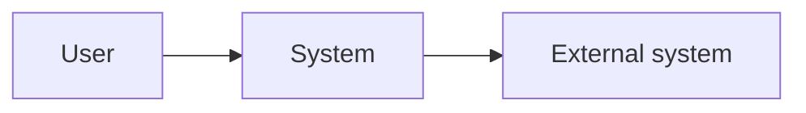
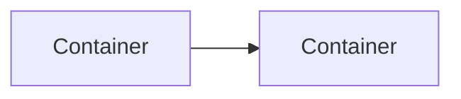

# ARCHITECTURE.md Template

Template for `ARCHITECTURE.md`: an arc42-shaped index. Each section is a short summary plus links; detail lives in the linked docs. C4 depth: L1 in §3, L2 in §5, L3 in `docs/design/`, never L4.

## Usage

- Copy everything below the `---` into `ARCHITECTURE.md`; delete each `>` block as you fill its section.
- Summarize and link; never duplicate linked content. Link only `active` docs — superseding a linked doc includes updating the link here.
- Empty section: keep the heading, write `None.` Delete unused scaffold rows and stubs; leave no placeholders.
- Diagrams in Mermaid.

---

# Architecture Overview

<The system in one paragraph.>

## 1. Introduction & Goals

> What and for whom; top 3 quality goals, ranked. Requirements live in `docs/prd/` / `docs/spec/` — link, don't restate.

## 2. Constraints

> Imposed limits only — technical, organizational, regulatory. Chosen trade-offs belong in §9.

| Constraint | Source |
| --- | --- |

## 3. Context & Scope

> System boundary: C4 L1 context diagram plus neighbor table. Third-party detail → `docs/integration/`.



| Neighbor | Direction | Purpose |
| --- | --- | --- |

## 4. Solution Strategy

> The load-bearing choices — stack, decomposition, key patterns — one line each, citing `docs/decision/`.

## 5. Building Block View

> Annotated directory tree, then C4 L2 container diagram, then the Boundaries table. Component internals (L3) → `docs/design/`.
> Boundaries: one row per dependency-direction, layering, or visibility rule. `Enforced by` is the repo-relative path of the assertion (architecture test or dependency-lint config) that fails the build when the rule is broken; a rule nothing enforces says `Unenforced: <why>`. The table is complete only when no cell is empty (`decision-00002-architecture-assertions`); `scripts/trace-check` verifies every path exists.

```
<root>/
├── <dir>/    # <one line>
└── <dir>/    # <one line>
```



**Boundaries**

| Rule | Enforced by |
| --- | --- |
| `domain/` imports nothing from `infra/` | `tests/arch/test_layers.py` |
| Only `gateway/` calls external HTTP | `Unenforced: no lint for call sites yet; see issue-…` |

## 6. Runtime View

> Key scenarios by name; sequence diagrams live in `docs/design/`.

| Scenario | Design |
| --- | --- |

## 7. Deployment View

> Environments, infrastructure, CI/CD, observability. Procedures and runbooks → `docs/operation/`.

## 8. Crosscutting Concepts

> System-wide rules — link, don't restate: security `SECURITY.md`, style `CODE_STYLE.md`, quality gates `CODE_QUALITY.md`, testing `TESTING.md`; domain patterns → `docs/design/`, business invariants → `docs/rule/`.

## 9. Architecture Decisions

> Index of `active` `docs/decision/` docs, one line each; content stays in the decision.

| Decision | Outcome |
| --- | --- |

## 10. Quality Requirements

> Measurable quality scenarios refining §1's goals. Functional acceptance lives in `spec` ACs, not here.

| Quality | Scenario | Target |
| --- | --- | --- |

## 11. Risks & Technical Debt

> Known risks and debt, with mitigation. Tracked items link `docs/issue/`.

| Item | Impact | Mitigation |
| --- | --- | --- |

## 12. Glossary

See `CONTEXT.md`.
