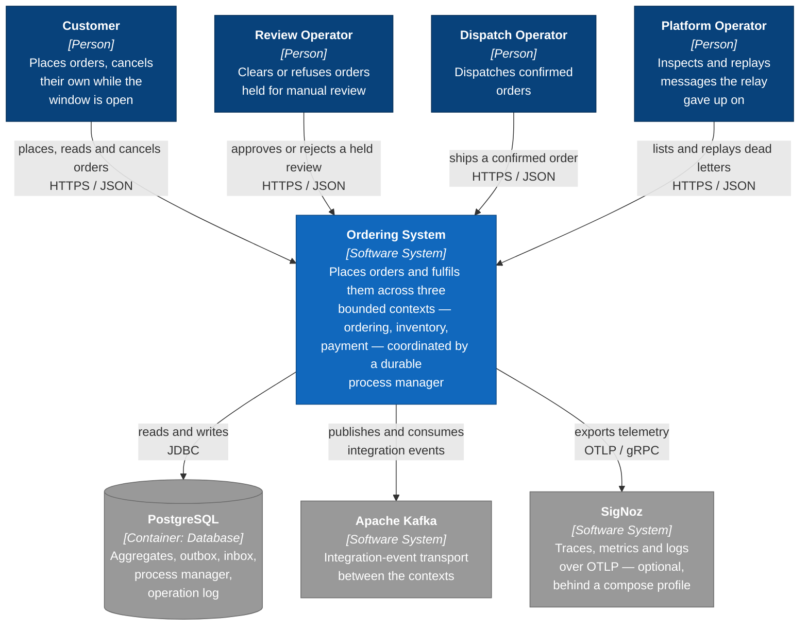
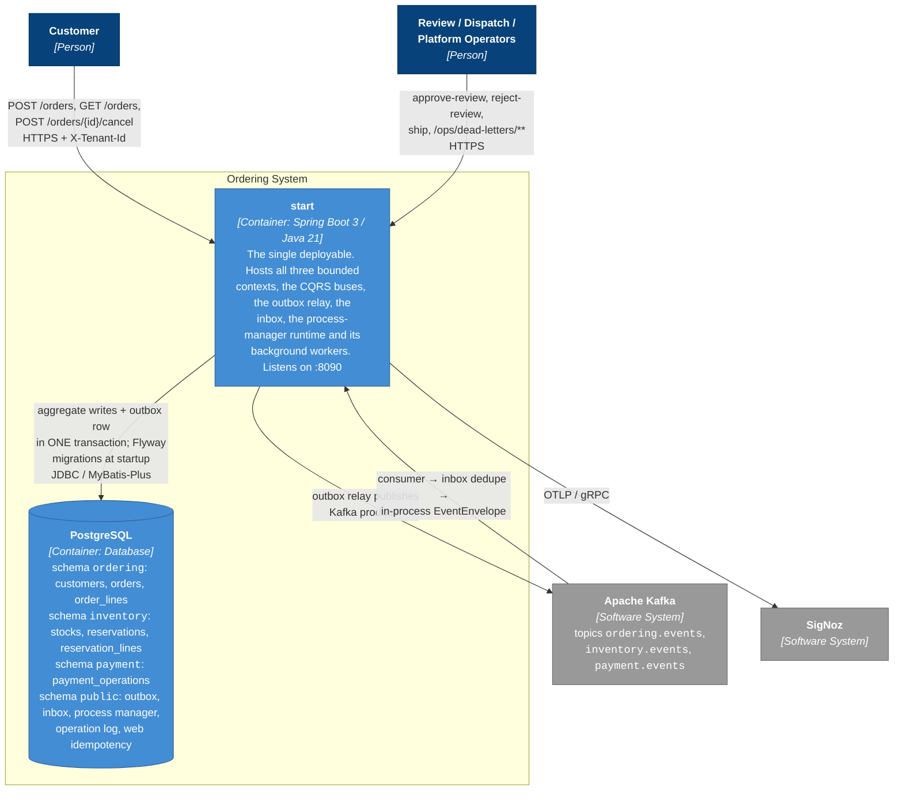
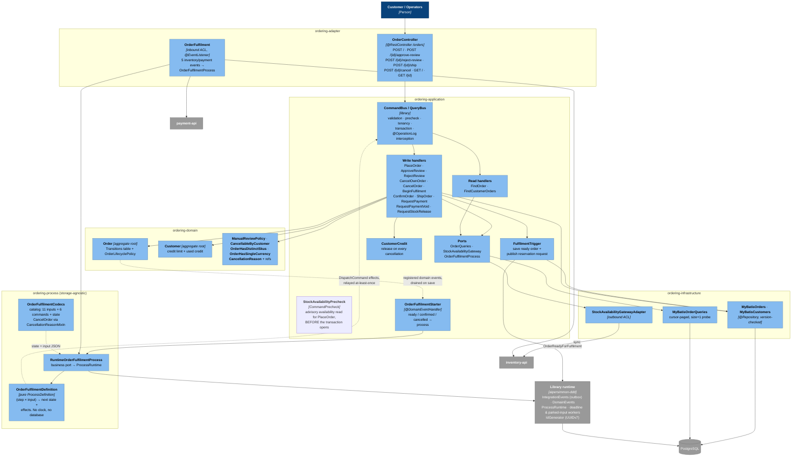
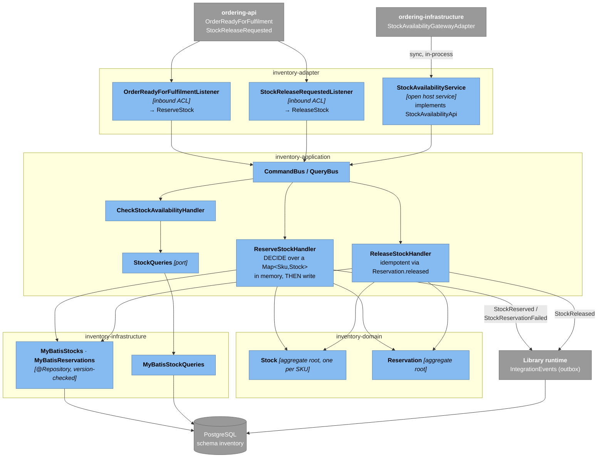
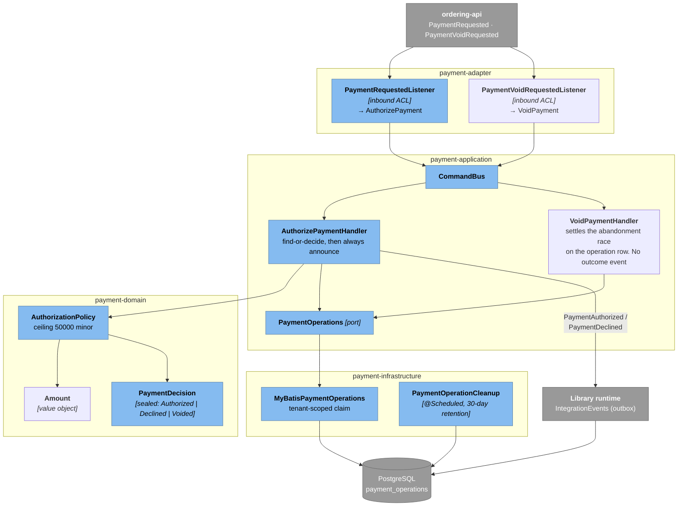

# C4 model — multi-module

Four levels over the same system. Level 1 is who uses it and what it talks to; level 2 is what runs;
level 3 is the modules inside the one running process, one section per bounded context; level 4 is
the two places worth zooming into at code level.

Everything below is read off the code — `pom.xml` dependencies, `@RestController` mappings,
`@Externalized` topics, `@EventListener` subscriptions, Flyway DDL and `application*.yml`. Where the
diagram simplifies, it says so.

> **One process, three contexts.** This is a *modular monolith*: `start` is the single Spring Boot
> application and all three bounded contexts are Maven modules inside it. The contexts still
> integrate as if they were remote — through Kafka topics and their own `*-api` contracts — because
> the point of the reference is the boundary discipline, not the deployment topology. The `README`
> records that a second topology (modulith, microservice) was dropped: the transport story is the
> same one, packaged differently.

---

## Level 1 — System context

**Notes on what is *not* here.** There is no payment provider and no fraud/compliance service, so
the system has **no external business dependency at all**. Both are *ports* with a stand-in default —
`CeilingAuthorizationPolicy` decides in-process against a configured ceiling and
`RestrictedSkuReviewPolicy` against a configured SKU watchlist — so an adopter adds the missing
external system by declaring a bean rather than by editing a handler. Both absences are recorded as
hotspots in the Event Storming model, because a configurable stand-in is still a stand-in.

There is also no identity provider, and that one is not behind a port: the cancel endpoint takes
`customerId` as a query parameter, which `OrderController` itself flags as something a real deployment
must take from the authenticated principal. It remains the largest missing capability.

---

## Level 2 — Containers

**The single-transaction property is the load-bearing one.** All three contexts share one PostgreSQL
database, so an aggregate write and its outbox row commit together — that is what makes
"published" and "happened" the same fact. `OutboxAtomicityTest` pins it.

**Two Flyway owners, in order.** This project's own migrations (`db/migration/`, default history
table) create the business tables first; the library's component migrations
(`aipersimmon.ddd.flyway.components: process-manager, outbox, inbox, operation-log, web-store`) then
own the framework tables in `public`, each under its own history table.

**One migration directory per bounded context**, each owning a version major — `ordering/` is `1.x`,
`inventory/` is `2.x`, `payment/` is `3.x`. Flyway scans a location recursively, so the layout needs
no configuration; what it buys is that "which migrations belong to which context?" is answerable by
`ls`, and that extracting a context later means taking its directory plus the history rows whose
version starts with its major. No foreign key or join crosses a context boundary, so the interleaved
global order is irrelevant — only the order within a major matters.

**Local infrastructure** comes up from `start/compose.yaml` — PostgreSQL and Kafka by default, SigNoz
behind the `observability` profile and kafka-ui behind `tools`.

---

## Level 3 — Components inside `start`

### 3a. The whole process, by Maven module

Sixteen sibling modules plus `start`. The arrows are compile-time dependencies from the `pom.xml`
files; the dashed arrows are runtime message flow, which crosses boundaries the compile-time graph
deliberately does not.

```mermaid
flowchart TB
    subgraph ordering["ordering (core)"]
        direction TB
        oadapter["<b>ordering-adapter</b><br/>OrderController · OrderFulfilment"]
        oprocess["<b>ordering-process</b><br/><i>[storage-agnostic]</i><br/>OrderFulfilmentDefinition · Codecs<br/>RuntimeOrderFulfilmentProcess"]
        oapp["<b>ordering-application</b><br/>13 commands/queries + handlers<br/>FulfilmentTrigger · OrderFulfilmentStarter"]
        oinfra["<b>ordering-infrastructure</b><br/>MyBatisOrders · MyBatisCustomers<br/>MyBatisOrderQueries · StockAvailabilityGatewayAdapter"]
        odomain["<b>ordering-domain</b><br/>Order · Customer · policies · 6 domain events"]
        oapi["<b>ordering-api</b><br/>OrderReadyForFulfilment (v2) + …V1<br/>PaymentRequested · PaymentVoidRequested<br/>StockReleaseRequested"]
    end

    subgraph inventory["inventory (supporting)"]
        direction TB
        iadapter["<b>inventory-adapter</b><br/>OrderReadyForFulfilmentListener + …V1Upcaster<br/>StockReleaseRequestedListener · StockAvailabilityService"]
        iapp["<b>inventory-application</b><br/>ReserveStock · ReleaseStock<br/>CheckStockAvailability"]
        iinfra["<b>inventory-infrastructure</b><br/>MyBatisStocks · MyBatisReservations<br/>MyBatisStockQueries"]
        idomain["<b>inventory-domain</b><br/>Stock · Reservation"]
        iapi["<b>inventory-api</b><br/>StockReserved · StockReservationFailed<br/>StockReleased · StockAvailabilityApi"]
    end

    subgraph payment["payment (generic)"]
        direction TB
        padapter["<b>payment-adapter</b><br/>PaymentRequestedListener<br/>PaymentVoidRequestedListener"]
        papp["<b>payment-application</b><br/>AuthorizePayment · VoidPayment<br/>PaymentOperations"]
        pinfra["<b>payment-infrastructure</b><br/>MyBatisPaymentOperations<br/>PaymentOperationCleanup"]
        pdomain["<b>payment-domain</b><br/>AuthorizationPolicy · PaymentDecision<br/>Amount"]
        papi["<b>payment-api</b><br/>PaymentAuthorized · PaymentDeclined"]
    end

    start["<b>start</b><br/>OrderingApplication · OrderingProblemCatalog<br/>DeadLetterOpsController · OperationLogConfig<br/>Flyway DDL · application*.yml · ArchitectureTest"]

    oadapter --> oapp
    oprocess --> oapp
    oprocess --> odomain
    oapp --> odomain
    oapp --> oapi
    oinfra --> odomain
    oinfra --> oapp
    iadapter --> iapp
    iadapter --> iapi
    iapp --> idomain
    iapp --> iapi
    iinfra --> idomain
    iinfra --> iapp
    padapter --> papp
    papp --> pdomain
    papp --> papi
    pinfra --> papp
    pinfra --> pdomain

    oinfra -.->|"ACL: sync availability<br/>StockAvailabilityApi"| iapi
    oadapter -.->|"consumes"| iapi
    oadapter -.->|"consumes"| papi
    iadapter -.->|"consumes"| oapi
    padapter -.->|"consumes"| oapi

    start --> oadapter
    start --> oprocess
    start --> oinfra
    start --> iadapter
    start --> iinfra
    start --> padapter
    start --> pinfra

    classDef domain fill:#f5d76e,stroke:#b8992f,color:#000
    classDef app fill:#7ed321,stroke:#5a9718,color:#000
    classDef infra fill:#4db6ac,stroke:#357f77,color:#000
    classDef adapter fill:#4a90e2,stroke:#2e5c93,color:#fff
    classDef api fill:#f48fb1,stroke:#b06580,color:#000
    classDef root fill:#b39ddb,stroke:#7d6d99,color:#000
    class odomain,idomain,pdomain domain
    class oapp,iapp,papp,oprocess app
    class oinfra,iinfra,pinfra infra
    class oadapter,iadapter,padapter adapter
    class oapi,iapi,papi api
    class start root
```

**The dependency rules `ArchitectureTest` enforces**, and what each one buys:

| Rule | Consequence visible above |
|---|---|
| `dependOnEachOtherOnlyThroughApi` | every cross-context arrow lands on a `*-api` box, never on another context's domain or application |
| `adapterShouldNotDependOnDomain` | no `*-adapter → *-domain` arrow exists. This is why ordering's domain-event subscriber (`OrderFulfilmentStarter`) lives in the **application** layer: it must touch `OrderReadyForFulfilmentEvent`, which an adapter may not |
| `integrationEventsShouldResideInApi` | all nine `@Externalized` records are in the three `*-api` modules, and nowhere else |
| `implementationsShouldBeSpringRepositories` | every `Orders`/`Customers`/`Stocks`/`Reservations` implementation is a `@Repository` in an `*-infrastructure` module |
| `sku is never a raw String in a domain` | `Sku` is a value object in *both* ordering and inventory — two separate types on purpose, so the published event carries a flat `String` and neither context depends on the other's `Sku` |

**Note the one asymmetry.** `*-domain` modules depend on `aipersimmon-ddd-core` and nothing else — no
sibling, no Spring. That is what makes `mvn -pl ordering/ordering-domain,…/inventory-domain,…/payment-domain test`
safe without `-am`. Every other module needs `-am`.

### 3b. Ordering — request and coordination paths

**Where the coordination actually lives.** `OrderFulfilmentDefinition` is a pure function of
`(state, input, context)`; it never reads a clock, a repository or the process store. The runtime
persists the transition and relays the `DispatchCommand` effects back onto the `CommandBus`
at-least-once. That split is why the whole flow — including all three timeouts — is unit-testable
with no database (`OrderFulfilmentDefinitionTest`).

### 3c. Inventory — no HTTP surface

**Two doors, both narrow.** Inventory has no controller: it is driven by integration events, plus one
synchronous open host service (`StockAvailabilityApi`) that ordering reaches through its own
anticorruption gateway. Everything that arrives is translated into inventory's own command before it
reaches an application handler.

### 3d. Payment — a decision and a claim

**No aggregate, on purpose.** Payment's only persisted state is the `payment_operations` dedupe log,
and that is technical rather than domain state — which is why it sits behind a port in the
*infrastructure* layer even though it is a table of decisions.

---

## Level 4 — Code, where the shape is the point

Two places are worth a code-level view. Both are covered in full by the sibling documents rather than
repeated here.

| Zoom | Why it earns a code-level diagram | Document |
|---|---|---|
| `Order` + `OrderLifecyclePolicy` + `CancellationReason` | the evidence-bearing cancellation is a *type-level* guarantee: `PaymentDeclinedAfterStockReleased` cannot be constructed without a `StockReleaseRef`, so the domain trusts from the type alone that compensation ran | [class-diagram.md](class-diagram.md) |
| `OrderFulfilmentDefinition` + `OrderFulfilmentState.Step` | the whole coordination policy is one `(step × input) → decision` table, and the interesting cases are the ones that *ignore* rather than advance | [state-diagram.md](state-diagram.md) |

---

## Integration topology, in one table

Read off `@Externalized` topic names and the `@EventListener` subscriptions.

| Event | Published by | Topic | Consumed by | Turns into |
|---|---|---|---|---|
| `OrderReadyForFulfilment` | `FulfilmentTrigger` (ordering) | `ordering.events` | `OrderReadyForFulfilmentListener` (inventory) | `ReserveStock` |
| `PaymentRequested` | `RequestPaymentHandler` (ordering) | `ordering.events` | `PaymentRequestedListener` (payment) | `AuthorizePayment` |
| `PaymentVoidRequested` | `RequestPaymentVoidHandler` (ordering) | `ordering.events` | `PaymentVoidRequestedListener` (payment) | `VoidPayment` |
| `StockReleaseRequested` | `RequestStockReleaseHandler` (ordering) | `ordering.events` | `StockReleaseRequestedListener` (inventory) | `ReleaseStock` |
| `StockReserved` | `ReserveStockHandler` (inventory) | `inventory.events` | `OrderFulfilment` (ordering) | `process.stockReserved` |
| `StockReservationFailed` | `ReserveStockHandler` (inventory) | `inventory.events` | `OrderFulfilment` (ordering) | `process.stockReservationFailed` |
| `StockReleased` | `ReleaseStockHandler` (inventory) | `inventory.events` | `OrderFulfilment` (ordering) | `process.stockReleased` |
| `PaymentAuthorized` | `AuthorizePaymentHandler` (payment) | `payment.events` | `OrderFulfilment` (ordering) | `process.paymentAuthorized` |
| `PaymentDeclined` | `AuthorizePaymentHandler` (payment) | `payment.events` | `OrderFulfilment` (ordering) | `process.paymentDeclined` |

Plus one synchronous, in-process call that is **not** an event:
`StockAvailabilityGatewayAdapter` (ordering-infrastructure) → `StockAvailabilityApi`
(inventory-api) → `StockAvailabilityService` (inventory-adapter). It is a fail-fast availability
check at placement time; the authoritative quantity reservation is still the asynchronous path above.

## Cross-cutting concerns, and where they are decided

| Concern | Mechanism | Configured in |
|---|---|---|
| Multi-tenancy | `X-Tenant-Id` header (`trust-header: true` — only defensible behind an edge that rewrites it), `missing-policy: REJECT`, MyBatis-Plus tenant-line interceptor over six business tables; fail-closed below the edge — an unbound thread reaching a tenant-scoped table raises `MissingTenantException` rather than using the `__root__` sentinel | `application.yml` → `aipersimmon.ddd.tenancy` |
| Transactional messaging | outbox relay (ShedLock-leased, 100-row batches) → Kafka → inbox dedupe | `aipersimmon.ddd.outbox` / `.inbox` / `.messaging.kafka` |
| Optimistic locking | `version` column on `orders`, `customers`, `stocks`, `reservations` → `ConcurrencyConflictException` → HTTP 409 | `V3`, `V5` |
| HTTP idempotency | `Idempotency-Key` header, 24h TTL, `-web-store-mybatis-plus` | `aipersimmon.ddd.web.idempotency` |
| Error contract | RFC 9457 problem+json; `OrderingProblemCatalog` overrides `CREDIT_EXCEEDED` → 422 | `start` |
| Audit | `@OperationLog` on all 13 commands; actor/tenant resolvers | `OperationLogConfig` |
| Identity | UUIDv7 via `IdGenerator` for orders and reservations | library `-id` module |
| Observability | Micrometer → OTLP → SigNoz; ECS structured logging | `otel.*`, `logging.structured` |
| Ops surface | `/ops/dead-letters` list / get / replay, excluded from tenancy | `DeadLetterOpsController` |
