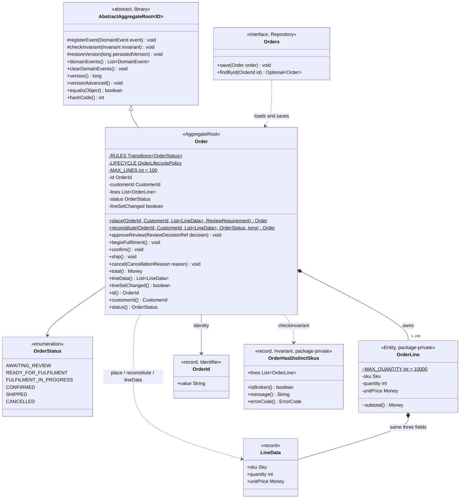
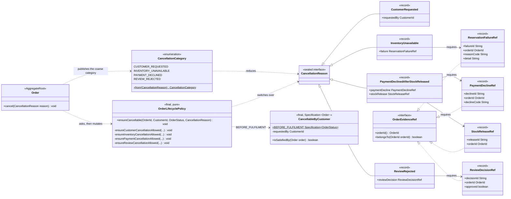
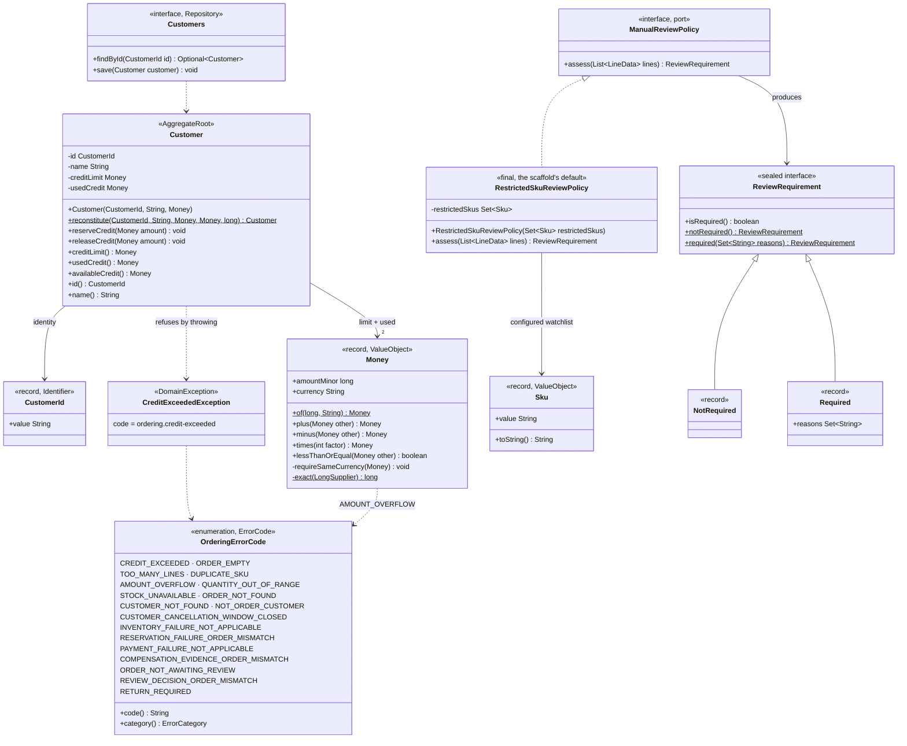
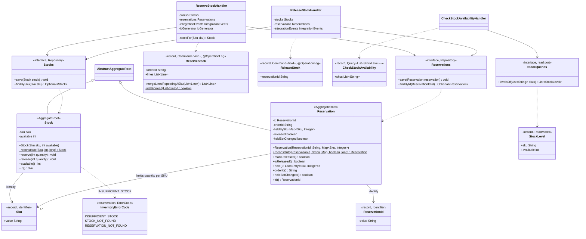
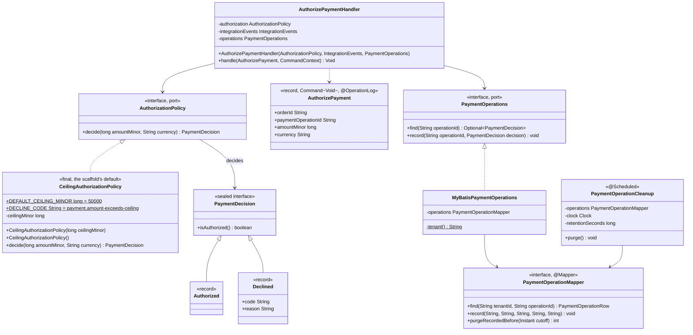
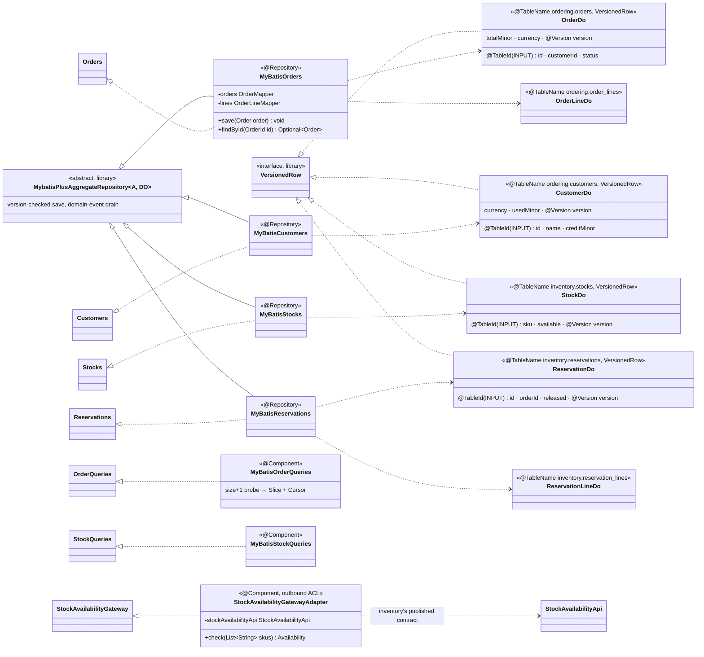

# UML class diagrams — multi-module

One diagram per bounded context, plus the process manager and the cross-context contracts. Each
diagram stops at its own boundary: **no class from one context appears inside another's diagram** —
they meet only through the `*-api` records in the last section, which is the whole point of the
layout.

Visibility is real Java visibility. `OrderLine` and `OrderHasDistinctSkus` are package-private, and
that is shown, because it is what stops anything outside `ordering.domain.order` from holding a line.

---

## 1. Ordering domain — the `Order` aggregate

**Why `LineData` exists at all.** `OrderLine` is package-private, so no caller outside
`ordering.domain.order` can construct or read one. `LineData` is the public carrier of the same three
fields, which lets the application layer hand lines *in* and a persistence adapter read them *out*
without ever holding an entity.

**`lineSetChanged` is transient and load-bearing.** It lets the persistence adapter ask the aggregate
a question only the aggregate can answer — "have my lines changed?" — instead of guessing, which it
previously did by rewriting every line on every save. A `confirm` or a `cancel` touches only
`status`.

## 2. Ordering domain — the cancellation rules

The most interesting shape in the codebase: the reason type makes the evidence **unforgeable at
construction time**, and the policy then checks that the evidence and the current state agree.

Three separations are deliberate here, and each answers a different question:

| Type | Question it answers | Shape |
|---|---|---|
| `CancellableByCustomer` | *may I?* — a question, safe to ask | `Specification`, returns a boolean |
| `OrderLifecyclePolicy` | *why not?* — a refusal, with the rule that said no | throws a coded `DomainException` |
| `CancellationCategory` | *what happened?* — what subscribers are told | evidence-free enum on the event |

The one statement of the window (`BEFORE_FULFILMENT`) is **shared** between the first two, so the
answer a client gets and the refusal it would receive cannot drift apart.

## 3. Ordering domain — placement, review, and money

**`Money` refuses to lose money.** `plus` and `times` go through `Math.addExact`/`multiplyExact` and
translate an overflow into a coded `AMOUNT_OVERFLOW`, `minus` refuses to go negative, and every
binary operation requires the same currency. `amountMinor` is a `long` of minor units, never a
`double`.

**`RestrictedSkuReviewPolicy` holds a `Set<Sku>`, not a `Set<String>`** — so the watchlist cannot be
confused with, or accidentally checked against, any other collection of strings this context holds. It
arrives through the constructor, which is what makes it configuration
(`ordering.review.restricted-skus`) while keeping the domain module framework-free: the strings become
`Sku` objects in `OrderingPolicyConfig` at startup, so a blank entry fails the context rather than
silently never matching a line.

**Both policy interfaces exist because these are the rules most likely to be replaced.** Each was a
final class `new`ed into a `private static final` field of its handler, which made the two most
business-variable rules the two you could not change without editing a use case. `OrderLifecyclePolicy`
is deliberately still concrete and still `new`ed inside `Order` — it is an aggregate invariant, and an
aggregate must not let anyone swap out the arbiter of its own legality.

## 4. Ordering application — use cases and ports

```mermaid
classDiagram
    direction TB

    class Command~R~ {
        <<interface, library>>
    }
    class CommandHandler~C, R~ {
        <<interface, library>>
        +handle(C command, CommandContext context) R
    }
    class Query~R~ {
        <<interface, library>>
    }
    class QueryHandler~Q, R~ {
        <<interface, library>>
        +handle(Q query) R
    }

    class PlaceOrder {
        <<record, Command~String~, @OperationLog>>
        +customerId String
        +lines List~Line~
    }
    class ApproveReview {
        <<record, Command~Void~>>
        +orderId String
    }
    class RejectReview {
        <<record, Command~Void~>>
        +orderId String
    }
    class CancelOwnOrder {
        <<record, Command~Void~>>
        +orderId String
        +customerId String
    }
    class ShipOrder {
        <<record, Command~Void~>>
        +orderId String
    }
    class BeginFulfilment {
        <<record, Command~Void~>>
        +orderId String
    }
    class ConfirmOrder {
        <<record, Command~Void~>>
        +orderId String
    }
    class CancelOrder {
        <<record, Command~Void~>>
        +orderId String
        +reason CancellationReason
    }
    class RequestPayment {
        <<record, Command~Void~>>
        +orderId String
        +paymentOperationId String
    }
    class RequestStockRelease {
        <<record, Command~Void~>>
        +orderId String
        +reservationId String
    }
    class FindOrder {
        <<record, Query~Optional~OrderSnapshot~~>>
        +orderId String
    }
    class FindCustomerOrders {
        <<record, Query~Slice~OrderListItem~~>>
        +customerId String
        +cursor Cursor
        +size int
    }

    class PlaceOrderHandler {
        -orders Orders
        -customers Customers
        -idGenerator IdGenerator
        -stockAvailability StockAvailabilityGateway
        -fulfilmentTrigger FulfilmentTrigger
        -review ManualReviewPolicy
    }
    class FulfilmentTrigger {
        -orders Orders
        -integrationEvents IntegrationEvents
        -clock Clock
        -stockTimeout Duration
        +begin(Order order, CommandContext context) void
    }
    class OrderFulfilmentStarter {
        <<@DomainEventHandler>>
        -process OrderFulfilmentProcess
        +onOrderReadyForFulfilment(OrderReadyForFulfilmentEvent) void
        +onOrderConfirmed(OrderConfirmedEvent) void
        +onOrderCancelled(OrderCancelledEvent) void
    }
    class CustomerCredit {
        -customers Customers
        +releaseFor(Order order) void
    }

    class OrderFulfilmentProcess {
        <<interface, business port>>
        +readyForFulfilment(String orderId) void
        +stockReserved(String, String, CommandContext) void
        +stockReservationFailed(String, String, String, CommandContext) void
        +paymentAuthorized(String, CommandContext) void
        +paymentDeclined(String, String, String, CommandContext) void
        +stockReleased(String, String, CommandContext) void
        +orderConfirmed(String orderId) void
        +orderCancelled(String orderId) void
    }
    class StockAvailabilityGateway {
        <<interface, ACL port>>
        +check(List~String~ skus) Availability
    }
    class Availability {
        <<record>>
        +allAvailable boolean
        +unavailableSkus List~String~
    }
    class OrderQueries {
        <<interface, read port>>
        +byCustomer(String customerId, Cursor after, int size) Slice~OrderListItem~
    }
    class OrderSnapshot {
        <<record, ReadModel>>
        +id String
        +customerId String
        +status OrderStatus
        +totalMinor long
        +currency String
        +cancellableByCustomer boolean
    }
    class OrderListItem {
        <<record, ReadModel>>
        +id String
        +status String
        +totalMinor long
        +currency String
    }

    Command <|.. PlaceOrder
    Command <|.. ApproveReview
    Command <|.. RejectReview
    Command <|.. CancelOwnOrder
    Command <|.. ShipOrder
    Command <|.. BeginFulfilment
    Command <|.. ConfirmOrder
    Command <|.. CancelOrder
    Command <|.. RequestPayment
    Command <|.. RequestStockRelease
    Query <|.. FindOrder
    Query <|.. FindCustomerOrders

    CommandHandler <|.. PlaceOrderHandler
    PlaceOrderHandler ..> PlaceOrder
    PlaceOrderHandler --> FulfilmentTrigger
    PlaceOrderHandler --> StockAvailabilityGateway
    StockAvailabilityGateway --> Availability
    OrderFulfilmentStarter --> OrderFulfilmentProcess
    CustomerCredit ..> Customers
    QueryHandler <|.. FindOrderHandler
    QueryHandler <|.. FindCustomerOrdersHandler
    FindOrderHandler ..> OrderSnapshot
    FindCustomerOrdersHandler --> OrderQueries
    FindCustomerOrdersHandler ..> OrderListItem
    CancelOrder --> CancellationReason : carries evidence
```

Ten write commands, two queries, one handler each. Three of the ten (`BeginFulfilment`,
`ConfirmOrder`, `CancelOrder`) have **no HTTP endpoint at all** — they exist only as
`DispatchCommand` effects from the process manager, because exposing them would let a client bypass
the preconditions the process holds.

The four ports (`OrderFulfilmentProcess`, `StockAvailabilityGateway`, `OrderQueries`, plus the domain
repositories) are all declared here and implemented outside: that is the dependency inversion the
layering rules enforce.

## 5. Ordering process manager

```mermaid
classDiagram
    direction TB

    class ProcessDefinition~S~ {
        <<interface, library>>
        +processType() ProcessType
        +start(ProcessInput, ProcessContext) ProcessDecision~S~
        +react(S state, ProcessInput, ProcessContext) ProcessDecision~S~
    }

    class OrderFulfilmentDefinition {
        <<pure, deterministic>>
        +PROCESS_TYPE ProcessType = ordering.fulfilment $
        ~PAYMENT_DEADLINE DeadlineName $
        ~STOCK_DEADLINE DeadlineName $
        ~STOCK_RELEASE_DEADLINE DeadlineName $
        ~PAYMENT_TIMEOUT_CODE String $
        ~STOCK_TIMEOUT_CODE String $
        -paymentTimeout Duration = PT2M
        -stockTimeout Duration = PT1M
        -stockReleaseTimeout Duration = PT1M
        -onAwaitingStock(...) ProcessDecision
        -onAwaitingStockOrderCancelled(...) ProcessDecision
        -onAwaitingPayment(...) ProcessDecision
        -onAwaitingStockRelease(...) ProcessDecision
        -onAwaitingStockReleaseOrderCancelled(...) ProcessDecision
        -onAwaitingOrderConfirmation(...) ProcessDecision
        -onAwaitingOrderCancellation(...) ProcessDecision
        -cancelForInventory(...) ProcessDecision
        -releaseDeadline(...) ScheduleDeadline
        -ignore(...) ProcessDecision $
    }

    class OrderFulfilmentState {
        <<record>>
        +orderId String
        +step Step
        +reservationId String
        +paymentDeclineCode String
        +paymentDeclineEvidenceId String
        +withStep(Step next) OrderFulfilmentState
        +reserved(String reservationId, Step next) OrderFulfilmentState
        +declined(String code, String evidenceId, Step next) OrderFulfilmentState
    }
    class Step {
        <<enumeration>>
        AWAITING_STOCK
        AWAITING_PAYMENT
        AWAITING_STOCK_RELEASE
        AWAITING_ORDER_CONFIRMATION
        AWAITING_ORDER_CANCELLATION
        AWAITING_STOCK_ORDER_CANCELLED
        AWAITING_STOCK_RELEASE_ORDER_CANCELLED
        CONFIRMED
        CANCELLED
    }

    class OrderFulfilmentInput {
        <<sealed interface, ProcessInput>>
        +orderId() String
    }
    class ReadyForFulfilment {
        <<record, start-only>>
    }
    class StockReserved {
        <<record>>
        +reservationId String
    }
    class StockReservationFailed {
        <<record>>
        +code String
        +reason String
    }
    class StockReservationTimedOut {
        <<record, timer>>
    }
    class PaymentAuthorized {
        <<record>>
    }
    class PaymentDeclined {
        <<record>>
        +code String
        +reason String
    }
    class PaymentTimedOut {
        <<record, timer>>
    }
    class StockReleased {
        <<record>>
        +reservationId String
    }
    class StockReleaseTimedOut {
        <<record, timer>>
    }
    class OrderConfirmed {
        <<record>>
    }
    class OrderCancelled {
        <<record>>
    }

    class ProcessEffect {
        <<interface, library>>
    }
    class DispatchCommand {
        <<record>>
    }
    class ScheduleDeadline {
        <<record>>
        +name DeadlineName
        +dueAt Instant
        +input ProcessInput
    }
    class CancelDeadline {
        <<record>>
        +name DeadlineName
    }

    class RuntimeOrderFulfilmentProcess {
        -runtime ProcessRuntime
        -query DefaultProcessQuery
        -handle(String orderId, ProcessInput, CommandContext) void
        -factContext(String fact, String orderId) CommandContext $
    }
    class OrderFulfilmentCodecs {
        <<@Configuration>>
        catalog: 11 inputs + the state
        + a hand-written codec for CancelOrder
    }

    ProcessDefinition <|.. OrderFulfilmentDefinition
    OrderFulfilmentDefinition --> OrderFulfilmentState : decides over
    OrderFulfilmentDefinition ..> OrderFulfilmentInput : switches on (step, input)
    OrderFulfilmentDefinition ..> ProcessEffect : emits
    OrderFulfilmentState *-- Step
    OrderFulfilmentInput <|-- ReadyForFulfilment
    OrderFulfilmentInput <|-- StockReserved
    OrderFulfilmentInput <|-- StockReservationFailed
    OrderFulfilmentInput <|-- StockReservationTimedOut
    OrderFulfilmentInput <|-- PaymentAuthorized
    OrderFulfilmentInput <|-- PaymentDeclined
    OrderFulfilmentInput <|-- PaymentTimedOut
    OrderFulfilmentInput <|-- StockReleased
    OrderFulfilmentInput <|-- StockReleaseTimedOut
    OrderFulfilmentInput <|-- OrderConfirmed
    OrderFulfilmentInput <|-- OrderCancelled
    ProcessEffect <|.. DispatchCommand
    ProcessEffect <|.. ScheduleDeadline
    ProcessEffect <|.. CancelDeadline
    OrderFulfilmentProcess <|.. RuntimeOrderFulfilmentProcess
    RuntimeOrderFulfilmentProcess ..> OrderFulfilmentInput : builds
    OrderFulfilmentCodecs ..> OrderFulfilmentState : serialises
    OrderFulfilmentCodecs ..> OrderFulfilmentInput : serialises
```

**The eleven inputs are the whole vocabulary**, and three of them are timers. `ReadyForFulfilment` is
start-only: it is the one input `react` *rejects* by throwing, because reaching `react` with it can
only mean a wiring defect — and since it structurally never arrives there, the throw cannot poison a
real redelivery.

**Everything else that does not fit the current step is ignored, never thrown.** The runtime delivers
at-least-once and treats a `react` throw as a poison message it retries forever, so a stale or
out-of-order fact must be absorbed. `ignore` returns the same lifecycle, the same step and no
effects.

**Deadlines are named, not identified.** Rescheduling `STOCK_RELEASE` supersedes the previous
generation and cancelling it cancels only the current one, so a timer that fires just as the answer
arrives cannot resurrect a settled flow.

**Why one payload needs a hand-written codec.** The catalog serialises the eleven inputs and the state
by *logical type and version*, never by Java class name, so a payload survives a class being renamed.
`CancelOrder` is the exception: it carries the sealed `CancellationReason`, and Jackson would need
`@JsonTypeInfo` on that type to know which variant to rebuild — an annotation a framework-free domain
module forbids. So the discriminator is written by hand, using a unit separator (``) rather than a
printable delimiter, because a decline reason is free text that could contain one.

## 6. Inventory domain and application

**`Reservation` references its order by a raw `String`, not an `OrderId`.** That is correct, not
sloppy: `OrderId` is *ordering's* type, and inventory may not depend on it. The context-isolation
rule would fail the build if it did.

**Two `Sku` types exist in this codebase** — `ordering.domain.shared.Sku` and
`inventory.domain.stock.Sku` — and neither imports the other. `OrderReadyForFulfilment` carries a
flat `String`, which each context re-validates into its own value object at the boundary.

**Idempotency lives in `markReleased()`.** It returns `true` only on the first call, so the hand-back
happens once while `StockReleased` is published on every delivery. That asymmetry is what makes the
process manager's wait always resolve without the stock ever double-counting.

## 7. Payment domain and application

**No aggregate root, and no `AbstractAggregateRoot` in sight.** `PaymentDecision` is a value;
`PaymentOperations` is a dedupe log. The whole context is a policy plus a claim.

**The policy is a port, and the ceiling is configuration.** `CeilingAuthorizationPolicy` is a
deterministic stand-in for a payment provider; a real deployment declares its own
`AuthorizationPolicy` bean and `PaymentPolicyConfig`'s default backs off. The port's javadoc carries
two obligations that are easy to miss when substituting one: **do not throw** (a throw publishes
nothing, and silence is indistinguishable from a dead broker, so the order dies of ordering's PAYMENT
deadline for a reason unrelated to the truth — issue-00075 was exactly this shape), and **carry the
operation id as the provider's own idempotency key**.

**`find`-or-`decide`, then always announce.** On a redelivery the *recorded* decision is reused
verbatim rather than re-derived — re-running the policy could reach a different answer if a rule or a
rate changed in between, and one operation must not have two outcomes. Both paths then leave through
the same `switch`, which is exactly the property that makes a lost outcome event recoverable.

## 8. Infrastructure — the persistence adapters

`@Repository` marks an implementation of a *domain* repository port; the two query classes are plain
`@Component`s because a read model is not an aggregate. `ArchitectureTest` enforces exactly that
distinction.

**No `tenantId` field appears on any DO, and that is the design.** Every one of these tables carries a
`tenant_id` column (each context's `*_2__multi_tenancy` migration), but the MyBatis-Plus tenant-line
interceptor supplies it on `INSERT` and
adds the `WHERE tenant_id = ?` predicate on read/update/delete — see
`aipersimmon.ddd.tenancy.mybatis-plus.tenant-tables` in `application.yml`. Mapping the column onto the
DO as well would let application code set it, which is the one thing tenancy must not allow.
`MyBatisPaymentOperations` is the exception that proves it: `payment_operations` is *not* in the
interceptor's table list, so that mapper passes the tenant explicitly.

**`@TableId(type = IdType.INPUT)` on a single column, against a composite primary key.** `customers`
and `stocks` have had `(tenant_id, id)` / `(tenant_id, sku)` keys since each context's
`*_2__multi_tenancy` migration, and `orders` and `reservations` joined them in `*_4__tenant_scoped_keys`
so the child foreign keys could carry the tenant. The DO names only
the business half of the key; the interceptor contributes the other half.

## 9. The cross-context contracts (`*-api`)

The only classes any two contexts share. Everything above this line is private to its context.

```mermaid
classDiagram
    direction TB

    class IntegrationEvent {
        <<interface, library>>
        +subject() String
    }

    class OrderReadyForFulfilment {
        <<record, @EventType v2, @Externalized ordering.events>>
        +orderId String
        +lines List~Line~
        +reservationDeadline Instant
    }
    class Line {
        <<record>>
        +sku String
        +quantity int
    }
    class OrderReadyForFulfilmentV1 {
        <<record, @EventType v1, consume-only>>
        +orderId String
        +lines List~LineV1~
    }
    class LineV1 {
        <<record, deliberately NOT shared with v2>>
        +sku String
        +quantity int
    }
    class PaymentRequested {
        <<record, @EventType v1, @Externalized ordering.events>>
        +orderId String
        +paymentOperationId String
        +amountMinor long
        +currency String
    }
    class StockReleaseRequested {
        <<record, @EventType v1, @Externalized ordering.events>>
        +orderId String
        +reservationId String
    }
    class StockReserved {
        <<record, @EventType v1, @Externalized inventory.events>>
        +orderId String
        +reservationId String
    }
    class StockReservationFailed {
        <<record, @EventType v1, @Externalized inventory.events>>
        +orderId String
        +code String
        +reason String
    }
    class StockReleased {
        <<record, @EventType v1, @Externalized inventory.events>>
        +orderId String
        +reservationId String
    }
    class PaymentAuthorized {
        <<record, @EventType v1, @Externalized payment.events>>
        +orderId String
    }
    class PaymentDeclined {
        <<record, @EventType v1, @Externalized payment.events>>
        +orderId String
        +code String
        +reason String
    }
    class StockAvailabilityApi {
        <<interface, open host service>>
        +check(StockQuery query) StockAvailabilityReport
    }
    class StockQuery {
        <<record>>
        +skus List~String~
    }
    class StockAvailabilityReport {
        <<record>>
        +items List~Item~
    }
    class Item {
        <<record>>
        +sku String
        +available boolean
    }

    IntegrationEvent <|.. OrderReadyForFulfilment
    IntegrationEvent <|.. OrderReadyForFulfilmentV1
    IntegrationEvent <|.. PaymentRequested
    IntegrationEvent <|.. StockReleaseRequested
    IntegrationEvent <|.. StockReserved
    IntegrationEvent <|.. StockReservationFailed
    IntegrationEvent <|.. StockReleased
    IntegrationEvent <|.. PaymentAuthorized
    IntegrationEvent <|.. PaymentDeclined
    OrderReadyForFulfilment *-- Line
    OrderReadyForFulfilmentV1 *-- LineV1
    StockAvailabilityApi ..> StockQuery
    StockAvailabilityApi ..> StockAvailabilityReport
    StockAvailabilityReport *-- Item
```

Three properties hold across all of them:

1. **`subject()` is always the `orderId`.** That is the partition key, so every event about one order
   lands on one partition and stays ordered.
2. **Nothing but `String`, `long`, `int`, `boolean`, `Instant` and nested records.** No `Sku`, no
   `Money`, no `OrderId` — a consumer never has to depend on a producer's value objects to read its
   events.
3. **Every list is defensively copied in the constructor,** so a published event cannot be mutated
   through the caller's reference after the fact.

**Nine classes, eight logical events.** `OrderReadyForFulfilment` is at `version = 2` and
`OrderReadyForFulfilmentV1` is the retired revision, kept because at the moment of a rollout the topic
still holds v1 messages. Both carry the *same* `@EventType(name = …)` and differ only in `version`;
the catalog is keyed by that pair, so they coexist, and two classes claiming the same pair fail
startup rather than silently shadowing each other.

The nested `Line` records are deliberately **not** shared between the two. Sharing would couple the
frozen revision to the live one, so a later change to v2's line shape would silently rewrite what v1
claims to have meant — and the stored messages v1 exists to read would no longer match it.

Where the difference is absorbed: `OrderReadyForFulfilmentListener` in `inventory-adapter`, one
listener per revision funnelling into one internal call. `ReserveStock` and `ReserveStockHandler` are
untouched and do not know a version exists.
