# Sequence diagrams — multi-module

Eight flows, each one traced through the actual call sites and each one pinned by a named test. The
participant list is deliberately literal: where a message crosses the outbox → Kafka → inbox path it
is drawn crossing it, because "published" and "delivered" are different moments and most of the
interesting behaviour lives in the gap.

Colour convention: `ordering` participants are the core, `inventory` and `payment` are the other two
contexts, and the transport is drawn as one participant even though it is a relay, a broker and a
dedupe table.

| # | Flow | Verified by |
|---|---|---|
| [1](#1-happy-path) | Happy path — placed → reserved → authorized → confirmed | `OrderingFlowTest` |
| [2](#2-manual-review-both-answers) | Manual review, both answers | `ReviewFlowTest` |
| [3](#3-reservation-failure--compensation) | Reservation failure → compensation | `OrderingFlowTest` |
| [4](#4-payment-decline--ordered-compensation) | Payment decline → ordered compensation | `PaymentCompensationFlowTest` |
| [5](#5-payment-timeout--the-same-path-as-a-decline) | Payment timeout → same path as a decline | `PaymentTimeoutFlowTest` |
| [6](#6-stock-timeout--cancel-outright) | Stock timeout → cancel outright | `StockReservationTimeoutFlowTest` |
| [7](#7-the-self-cancel-race) | Self-cancel racing the reservation | `SelfCancelDuringReservationTest` |
| [8](#8-ship-and-the-refusal-that-follows) | Ship, and the refusal that follows | `OrderLifecycleTransitionsTest`, `ExceptionContractTest` |

Plus two supporting views: [the outbox path in detail](#the-outbox-path-in-detail) and
[payment idempotency](#payment-idempotency-under-redelivery).

---

## 1. Happy path

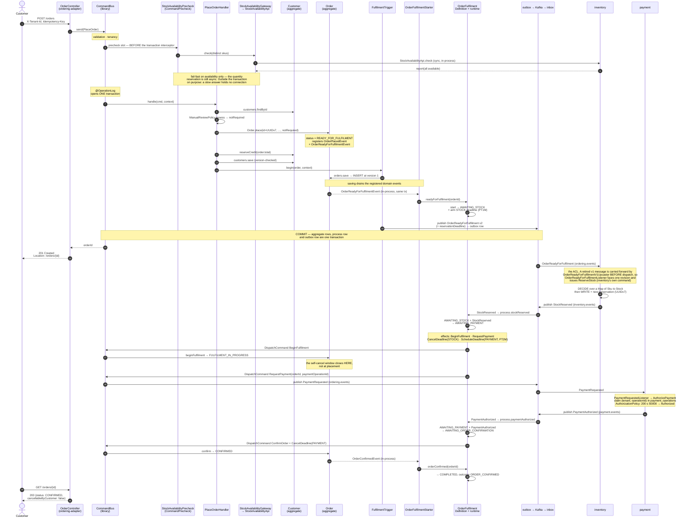

**The one thing to take from this diagram** is where `FULFILMENT_IN_PROGRESS` is set: at step *"begin
fulfilment"*, driven by the process manager once a reservation actually exists — **not** at placement.
`FulfilmentTrigger` deliberately no longer advances the aggregate. Before that change a new order was
`INSERT`ed straight into `FULFILMENT_IN_PROGRESS`, no row ever held `READY_FOR_FULFILMENT`, and since
that is the state the self-cancel window is defined over, the window was unreachable for any order not
held for review.

**Three facts, three rows.** "Placed", "ready for fulfilment" and "fulfilment in progress" are
distinct, and each is a state a row actually holds. Asking for a reservation is not having one.

## 2. Manual review, both answers

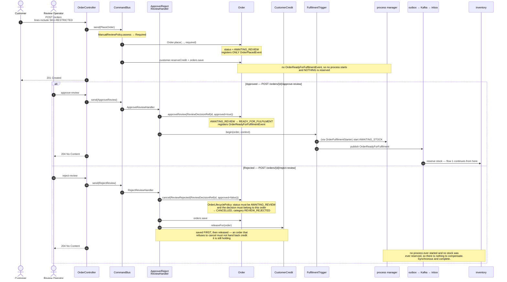

**Rejection is synchronous and needs no compensation**, and that is a consequence of holding the order
*before* reserving anything. The two answers are asymmetric in exactly the way the states are.

## 3. Reservation failure → compensation

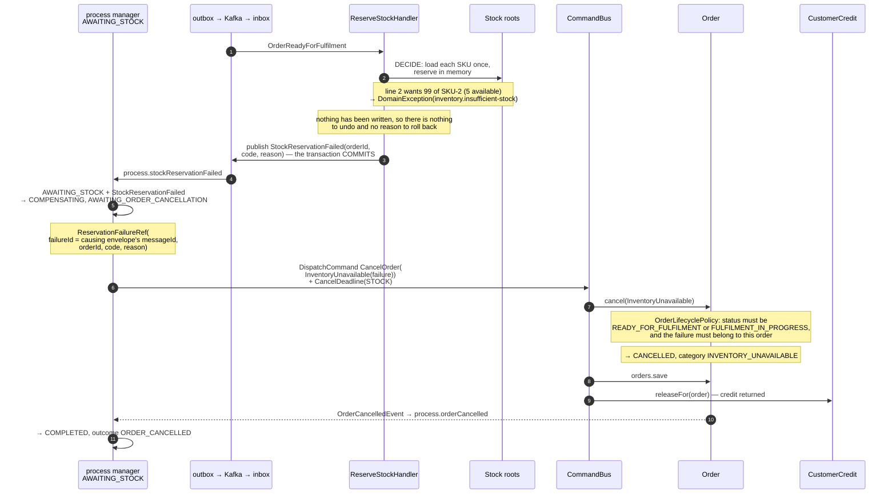

**Decide-then-write is what makes the failure clean.** Every load and every domain decision happens
before the first `save`, so a shortfall on any line throws with nothing written and the transaction
commits carrying only the failure event. A throw from the *write* phase is a different animal — it is
technical, it is deliberately **not** caught, and it rolls the transaction back so the delivery is
retried. Catching it would commit exactly the partial deduction the split prevents.

**And that is why the STOCK deadline exists.** The rolled-back case publishes *nothing*, so from
ordering's side it is indistinguishable from inventory being down. Flow 6 is what happens then.

## 4. Payment decline → ordered compensation

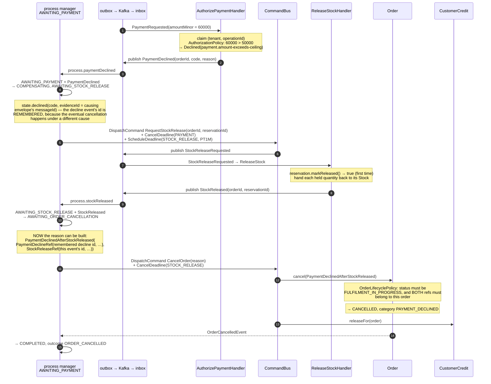

**Compensation is ordered, and the type system is what orders it.**
`PaymentDeclinedAfterStockReleased` cannot be constructed without a `StockReleaseRef`, so the
cancellation is *unreachable* until the release has actually happened. A bare
`PAYMENT_DECLINED` enum would have asserted the outcome with no proof the compensation ran.

**Two distinct evidence ids, and neither is a business key.** The decline ref keeps the remembered
decline-event id; the release ref takes the stock-released event's id. Keying them on
`orderId`/`reservationId` would have made them collide and untraceable.

## 5. Payment timeout → the same path as a decline

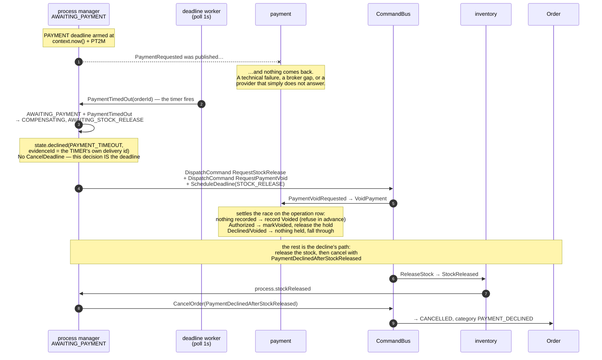

**Silence is an answer, and it is *almost* the same answer.** The customer's position is identical
however the payment failed to happen, so the compensation is the decline's. Only the recorded code
differs — `PAYMENT_TIMEOUT` rather than the payment context's own — which is what lets an operator
afterwards tell "payment said no" from "payment said nothing".

**The one addition a decline does not need is the void.** A decline is payment's own recorded
decision and can never later authorize. A timeout is only silence: the authorization may still
complete after this flow has moved on, and a terminal instance reacts to nothing, so the hold would
be orphaned for good. `RequestPaymentVoid` goes out *eagerly*, in the same decision that abandons
the wait, which makes the abandonment mutual rather than unilateral. Nothing waits on it — there is
no outcome event — because by the time ordering asks, it has already stopped listening.

**The evidence id is the timer's own delivery,** so the cancellation names the firing rather than a
decline that never happened.

## 6. Stock timeout → cancel outright

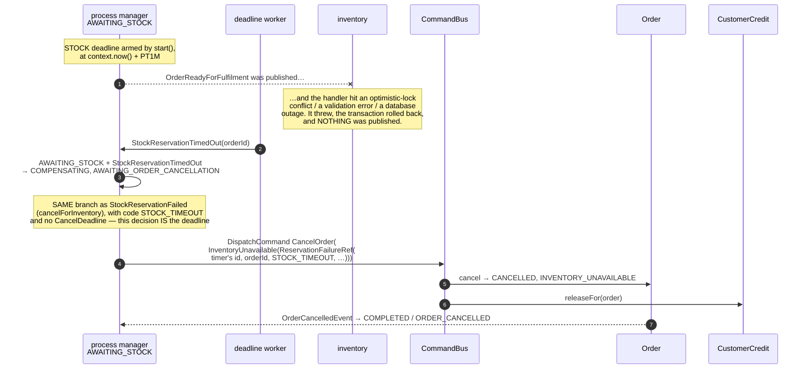

**Nothing was reserved, so there is nothing to release** — the timeout cancels outright, down exactly
the path a refusal takes. Compare with flow 5, where stock *is* held and so a release must come first.

### The one timeout that cannot end its wait

`AWAITING_STOCK_RELEASE` is the interesting case, and it is the only one that behaves differently:

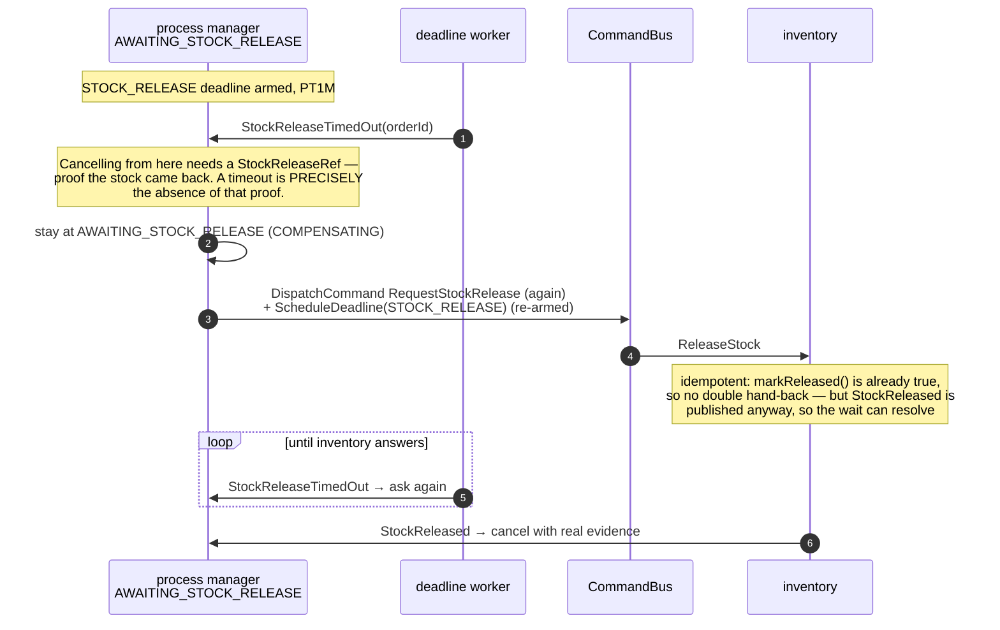

Rescheduling by *name* supersedes the previous generation, so neither the repeated request nor the
timer accumulates anything. It is **deliberately unbounded**: giving up would mean recording that
stock came back when it has not. This is the one design decision the evidence-bearing
`CancellationReason` earns its complexity for — a looser model would have "recovered" here by
declaring released stock that is still held. The exposure is visibility, not correctness, and it is
recorded as an open hotspot.

## 7. The self-cancel race

The customer's window overlaps the reservation, so a cancellation can commit while inventory is still
working. The cancellation wins.

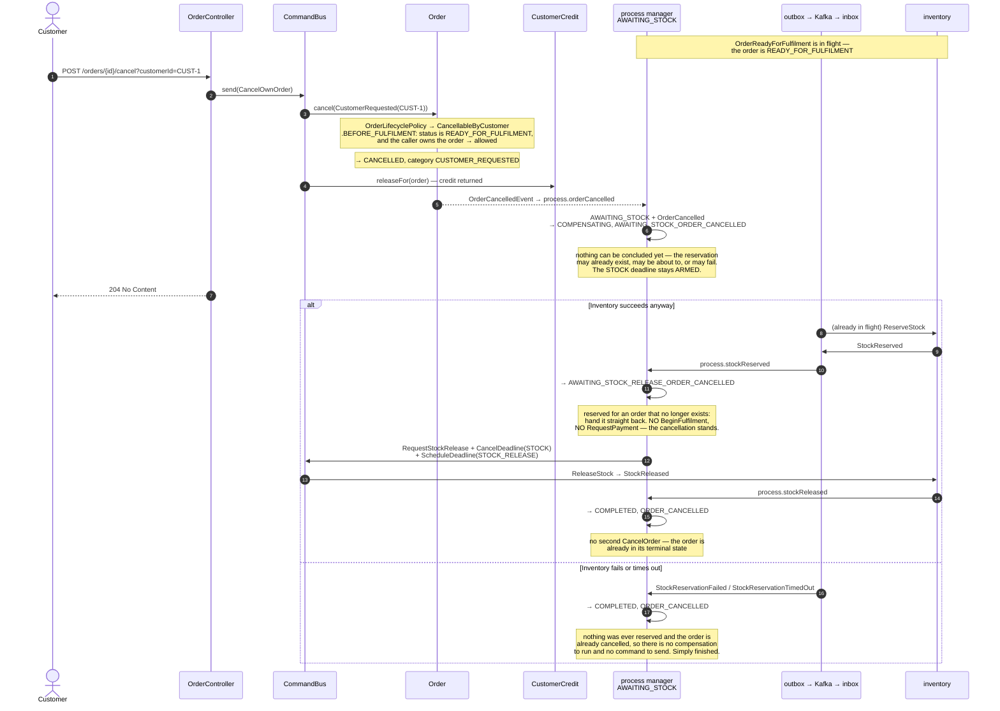

**Two `*_ORDER_CANCELLED` steps exist for exactly this.** They are the "order is already terminal, but
stock might not be" states, and each has precisely two ways out — neither of which touches the order.

**A residual variant.** The same cancellation can commit while the flow is moving from
`AWAITING_STOCK` to `AWAITING_PAYMENT`, in which case `BeginFulfilment` finds a cancelled order and
returns without doing anything (it is idempotent on `FULFILMENT_IN_PROGRESS` and `CANCELLED`). The
`AWAITING_PAYMENT + OrderCancelled` branch then releases the held stock and finishes, again with no
second `CancelOrder`.

That branch has **one effect the `AWAITING_STOCK` one does not: `RequestPaymentVoid`**. By then
`PaymentRequested` is already out, so payment may be about to authorize — or may already have — for
an order that no longer exists. The void goes out in the same decision that abandons the wait,
because once this flow reaches its terminal step it reacts to nothing and a late `PaymentAuthorized`
would leave the hold orphaned. See [§5](#5-payment-timeout--the-same-path-as-a-decline) for how
payment settles the race on its operation row.

## 8. Ship, and the refusal that follows

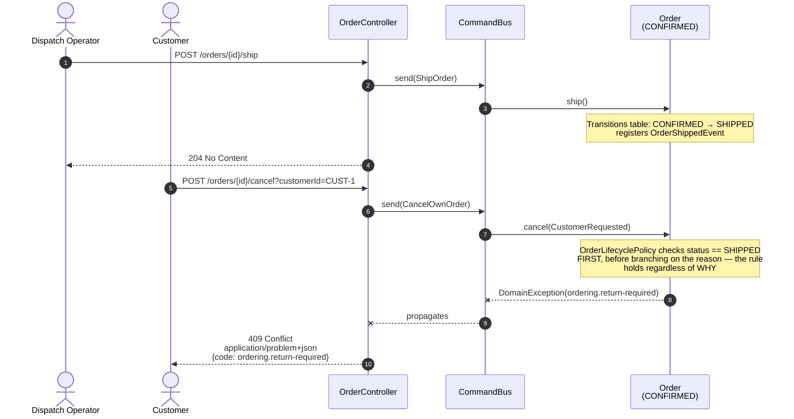

**Undoing a dispatch is a return, not a cancellation.** The refusal is coded and carries its rule,
which is what `ExceptionContractTest` asserts over HTTP. The reverse flow it points at does not exist
yet — recorded as an opportunity in the Event Storming model.

---

## The outbox path in detail

Every `TX` participant above collapses this. It matters because it is where "published" and
"delivered" separate.

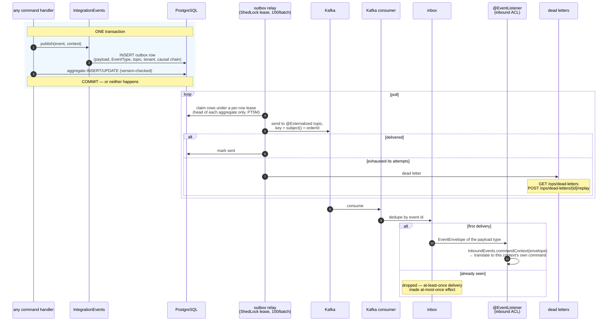

Three properties follow from this shape, and every flow above depends on them:

1. **Atomicity.** The aggregate write and the outbox row commit together, so an event cannot exist
   for a state change that rolled back — nor be lost for one that committed. `OutboxAtomicityTest`.
2. **At-least-once, plus dedupe.** The inbox makes redelivery harmless at the transport level; the
   handlers make it harmless at the business level too (`markReleased`, `payment_operations`, the
   process manager's `ignore` arm). Belt *and* braces, because the two protect against different
   things.
3. **Ordering per order.** `subject()` is always the `orderId`, so it is the partition key and every
   event about one order stays ordered relative to the others.

## Payment idempotency under redelivery

The narrowest and most instructive flow in the codebase.

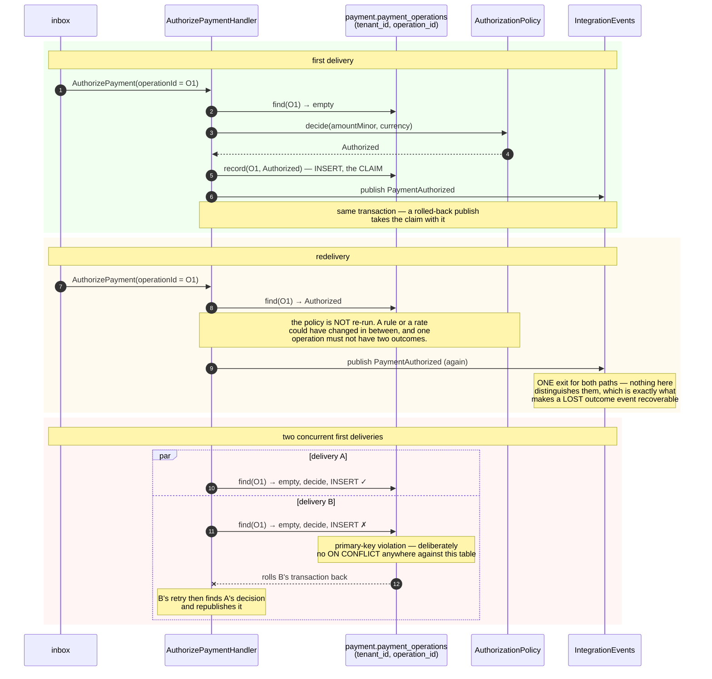

**"Decide once, announce every time"** is the whole rule, and the primary key is what enforces the
first half. It is load-bearing rather than merely tidy: the loser's constraint violation is what rolls
its transaction back so its retry can republish the winner's decision, instead of two deliveries
reaching two different answers.
