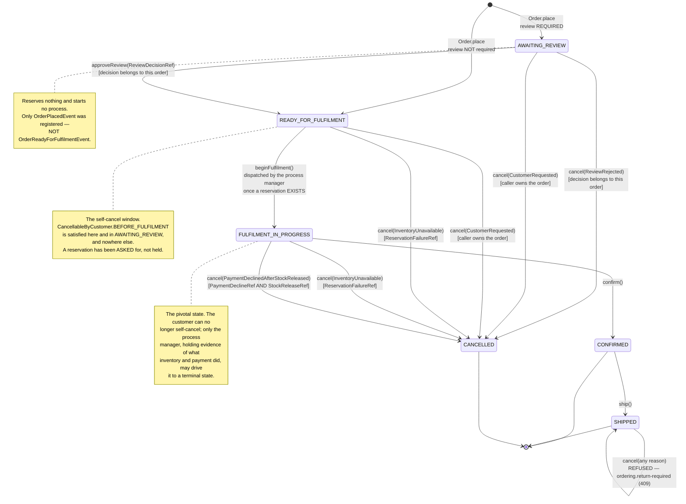
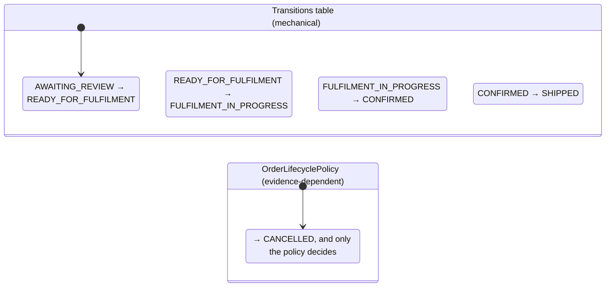
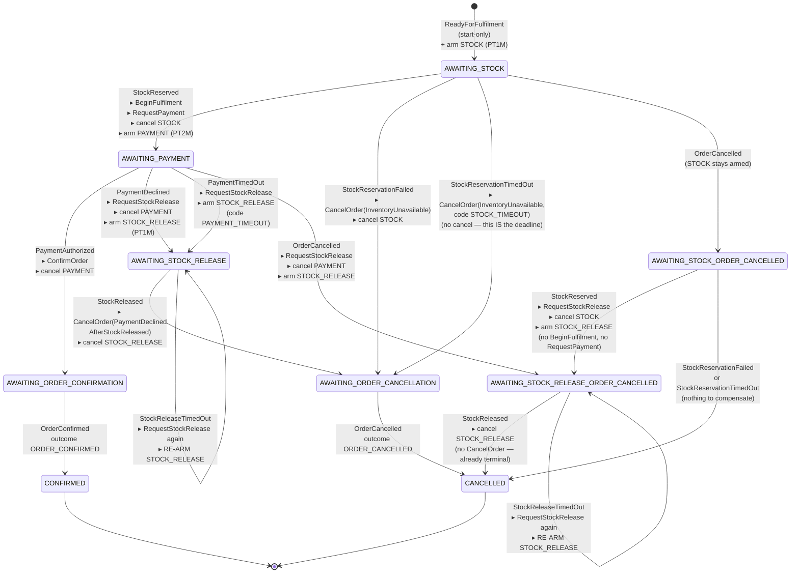
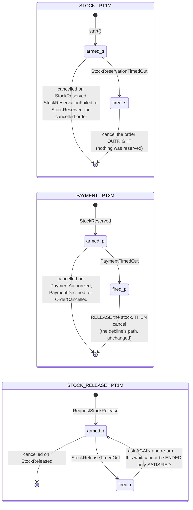
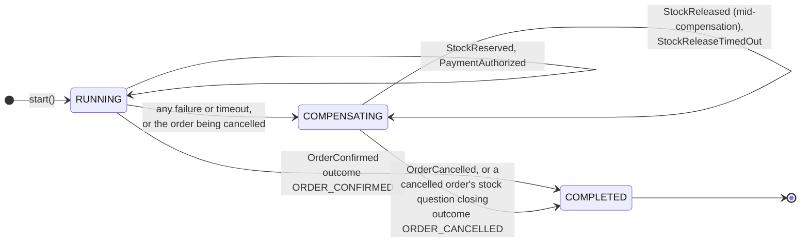
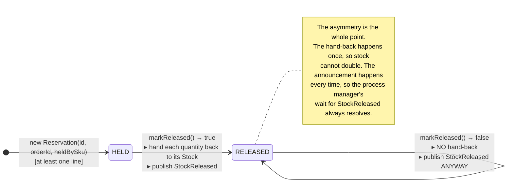
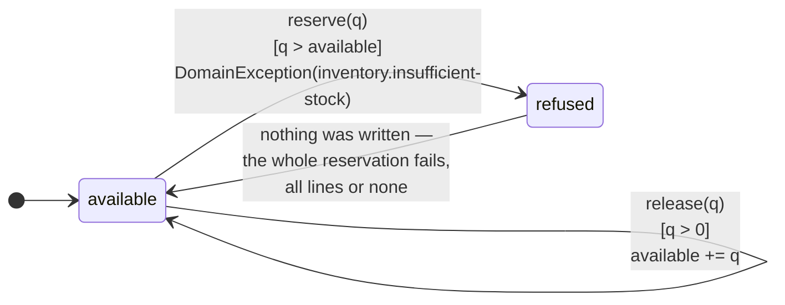
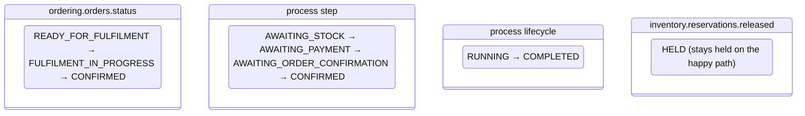

# State diagrams — multi-module

Four state machines live in this codebase, and they are **deliberately separate**:

| Machine | States | Where it lives | Guarded by |
|---|---|---|---|
| [Order lifecycle](#1-order-lifecycle) | `OrderStatus`, 6 | `ordering.orders.status` | `Transitions` table + `OrderLifecyclePolicy` |
| [Fulfilment process](#2-fulfilment-process-manager) | `OrderFulfilmentState.Step`, 9 | process-manager row | `OrderFulfilmentDefinition` |
| [Process lifecycle](#3-process-lifecycle-the-runtimes-own) | `ProcessLifecycle`, 3 used | process-manager row | the library runtime |
| [Reservation](#4-reservation) | `released` flag, 2 | `inventory.reservations.released` | `Reservation.markReleased()` |

Keeping the first two apart is the point. An order's status is *this context's own conclusion about the
order*; a process step is *what the coordination is waiting for*. They advance at different moments and
one is not derivable from the other — which is exactly why `FULFILMENT_IN_PROGRESS` is a persisted
state rather than something a policy infers from the process manager's internal step.

---

## 1. Order lifecycle

### The two guards, and why there are two

`Transitions` covers the moves whose legality depends **only on the current state** — four of them,
all forward, all mechanical. Cancellation is not one of those: its legality depends on *why* and on
*proof*, which a flat table cannot express. So the aggregate asks the policy, the policy decides by
throwing or returning, and the aggregate stays the sole mutator.

### Cancellation, by reason

Only four reasons exist (the `sealed interface` guarantees it), and each is legal from a different set
of states:

| Reason | Legal from | Evidence required | Also checked | Published category |
|---|---|---|---|---|
| `CustomerRequested` | `AWAITING_REVIEW`, `READY_FOR_FULFILMENT` | — (the `CustomerId`) | caller **is** the order's customer | `CUSTOMER_REQUESTED` |
| `InventoryUnavailable` | `READY_FOR_FULFILMENT`, `FULFILMENT_IN_PROGRESS` | `ReservationFailureRef` | ref belongs to this order | `INVENTORY_UNAVAILABLE` |
| `PaymentDeclinedAfterStockReleased` | `FULFILMENT_IN_PROGRESS` | `PaymentDeclineRef` **and** `StockReleaseRef` | **both** refs belong to this order | `PAYMENT_DECLINED` |
| `ReviewRejected` | `AWAITING_REVIEW` | `ReviewDecisionRef` | ref belongs to this order | `REVIEW_REJECTED` |

And one rule that holds for **every** reason, checked before the policy branches at all:
`SHIPPED` refuses with `ordering.return-required`.

**`InventoryUnavailable` accepts `READY_FOR_FULFILMENT`, and that is now the ordinary case.** An
inventory failure means the reservation never succeeded — and since the order only advances to
`FULFILMENT_IN_PROGRESS` once it has, a failed or timed-out reservation finds the order still merely
*ready*. Requiring "under fulfilment" here would refuse the compensation for exactly the outcome
compensation exists for.

### What is never reachable, and why that is correct

- **`AWAITING_REVIEW → FULFILMENT_IN_PROGRESS`** — review must clear first. The table has no such
  entry, and `approveReview` additionally refuses any status but `AWAITING_REVIEW`.
- **`CANCELLED → anything`** — terminal. No transition leaves it.
- **`SHIPPED → CANCELLED`** — refused, not absent: the refusal carries a coded reason (a return flow is
  a different flow, and does not exist yet).
- **`READY_FOR_FULFILMENT → CONFIRMED`** — there is no `confirm` endpoint at all, so a client cannot
  skip fulfilment. `ConfirmOrder` reaches the aggregate only as a process-manager effect, and only from
  `FULFILMENT_IN_PROGRESS`.

---

## 2. Fulfilment process manager

Nine steps. Every transition is `(current step × input) → decision`, and every step also has an
**ignore** arm for facts that are duplicates or out of order.

### The three arms of every cell

`react` gates every fact on the current step, **not** on the input type alone. For each
`(step, input)` pair it does exactly one of three things:

| Arm | Behaviour | When |
|---|---|---|
| **advance / compensate / complete** | new step, new lifecycle, effects emitted | the step's expected fact |
| **ignore** | same lifecycle, same step, **no effects** | a duplicate, or a fact out of order for this step |
| **reject** | throws | only `ReadyForFulfilment`, which is start-only and structurally never reaches `react` |

**Why ignore rather than throw.** The runtime delivers at-least-once and treats a `react` throw as a
poison message it retries forever, so a stale or out-of-order fact *must not* throw. A type-only switch
had three concrete misbehaviours that this closes:

- `PaymentAuthorized` at `AWAITING_STOCK` used to confirm an order with nothing reserved;
- `PaymentDeclined` before a reservation used to release a `null` handle;
- `StockReleased` before a decline used to throw on a `null` decline code and wedge the queue.

`MaxLifetimeExceeded` — the runtime's own backstop input, not an `OrderFulfilmentInput` — is rejected
cleanly with `UnsupportedProcessInputException` so the runtime suspends the instance rather than
crashing on a `ClassCastException`. That backstop is deliberately **not armed** in this scaffold.

### The deadline table

**Every step that waits on another context has a timer.** The test is not "will this context refuse
me?" but "**can this step's answer fail to arrive?**" — and for every `AWAITING_*` step that waits on a
broker, the answer is yes. Inventory *does* answer `StockReservationFailed`, but only for a business
failure; a technical one (an optimistic-lock conflict, a validation error, a database outage) throws out
of its handler and publishes nothing, and that silence is indistinguishable from the payment context's.

**The three are not symmetrical, because what a step can do about silence differs:**

| Step | Is stock held? | What the timeout does |
|---|---|---|
| `AWAITING_STOCK` | no | cancel outright — same branch as a refusal, different code |
| `AWAITING_PAYMENT` | **yes** | release, then cancel — the decline's path, unchanged |
| `AWAITING_STOCK_RELEASE` | **yes** | **cannot end the wait** — re-ask and re-arm |

The third is where the evidence-bearing `CancellationReason` earns its complexity. Cancelling from
there needs a `StockReleaseRef` proving the stock came back, and a timeout is precisely the *absence*
of that proof. A looser design would have "recovered" by declaring released stock that is still held.

**Deadlines are named, not identified.** Rescheduling the same name supersedes the previous generation
and cancelling it cancels only the current one, so a timer that fires just as the answer arrives cannot
resurrect a settled flow. Two branches leave a step *without* cancelling a deadline — the timeout
branches themselves — because that decision **is** the deadline firing.

### Which steps are terminal, and on what

The process reaches a terminal lifecycle only on the **actual outcome** — `OrderConfirmed` or
`OrderCancelled`, fed back in by `OrderFulfilmentStarter` from the aggregate's own domain events —
never when a confirm/cancel command is merely *dispatched*. That distinction is what makes the process
row a truthful record rather than an optimistic one.

Two steps complete without dispatching anything at all: both `*_ORDER_CANCELLED` exits, because the
order reached its terminal state through the customer's own cancellation and only the stock question
remained.

---

## 3. Process lifecycle (the runtime's own)

Orthogonal to the step. Every decision carries both.

| Step | Lifecycle |
|---|---|
| `AWAITING_STOCK`, `AWAITING_PAYMENT`, `AWAITING_ORDER_CONFIRMATION` | `RUNNING` |
| `AWAITING_STOCK_RELEASE`, `AWAITING_ORDER_CANCELLATION`, both `*_ORDER_CANCELLED` | `COMPENSATING` |
| `CONFIRMED`, `CANCELLED` | `COMPLETED` |

An **ignored** input keeps whatever lifecycle the instance currently has — `ignore` reads it from
`context.currentLifecycle()` rather than assuming one, which is what lets a duplicate arrive during
compensation without quietly moving the instance back to `RUNNING`.

A long-lived `COMPENSATING` instance is the visible symptom of the unbounded release retry, and is
what the process backlog metrics are for. `SUSPENDED` exists in the runtime and is reachable here only
by arming `instance.max-lifetime`, which this scaffold does not do.

---

## 4. Reservation

The smallest machine, and the one that makes retries safe.

And `Stock` itself, per SKU — no status column, just a quantity with two guarded operations:

**`Stock` is one aggregate root per SKU**, which is the natural contention boundary: forcing all SKUs
into one aggregate would serialise unrelated stock. Reserving a multi-line order therefore mutates
several roots plus one `Reservation` in a single application transaction — a deliberate multi-aggregate
transaction where "all lines or none" is held by the transaction rather than by an aggregate.

**Why the refusal never leaves a partial deduction.** `ReserveStockHandler` splits *decide* from
*write*: every load and every domain decision happens first, against in-memory `Stock` objects that
have already absorbed this command's earlier lines, and nothing is saved until no decision is left to
make. So a shortfall throws with nothing written, and there is nothing to undo.

---

## The four machines, side by side

One order, one row in each. This is what the separation buys — you can read any one of them without
the others, and no state is inferred:

On the happy path the reservation is never released — the stock is genuinely sold. `released` becomes
`true` only on a compensation branch, which is why it is the flag the compensation's idempotency hangs
off.
