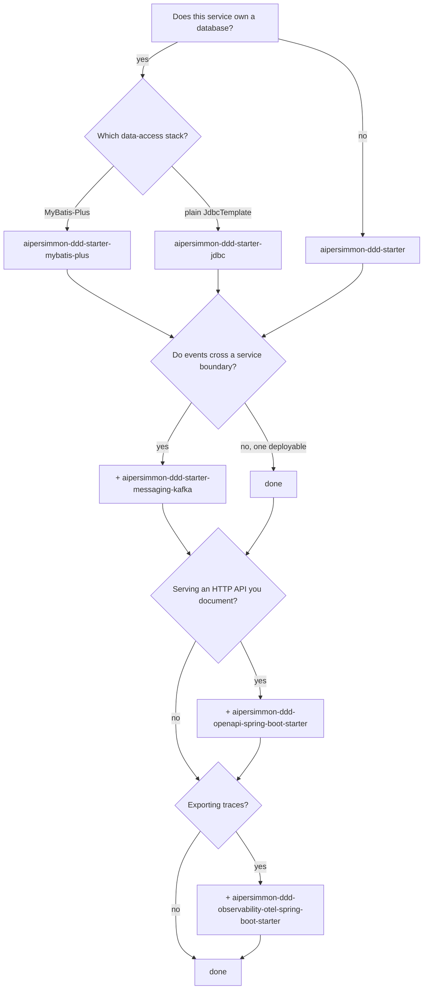

# Choosing modules

Start from a bundle. Only take modules one at a time when a bundle brings something you do not want —
and read [When to pick modules by hand](#when-to-pick-modules-by-hand) before you do, because most
reasons for wanting to turn out to be configuration questions, not dependency questions.

## The short answer

Four dependencies is a normal, complete service. The scaffold uses exactly those four.

## Question by question

### "Does this service own a database?"

If it does not — a pure API gateway, a read-only projection reading someone else's store, a
calculation service — take **`aipersimmon-ddd-starter`**. You get the command and query buses, the
interceptor chain, in-process events, time-ordered ids and the RFC 9457 web contract, and no tables.

Everything below assumes a database, because the outbox, the inbox, the process manager and the
operation log are all "state that survives a restart".

### "MyBatis-Plus or plain JdbcTemplate?"

Pick the one your team already uses for its own tables. It matters that the framework's tables and
your aggregates share **one** `DataSource` and transaction, so that an aggregate write and its outbox
write commit together — that is the whole point of a transactional outbox.

- **`aipersimmon-ddd-starter-mybatis-plus`** — also gives you SQL-level tenant scoping, because tenant
  rewriting is a MyBatis-Plus interceptor capability.
- **`aipersimmon-ddd-starter-jdbc`** — the same components over `JdbcTemplate`. Tenant *resolution and
  propagation* are included (the tenant rides on `CommandContext`, the `EventEnvelope` and every
  durable row); automatic row scoping is not, so you write the tenant predicate in your own SQL.

Mixing the two backends for different components works but buys nothing, and doubles what you have to
reason about. Choose one.

### "Do events cross a service boundary?"

Only add **`aipersimmon-ddd-starter-messaging-kafka`** when another *deployable* must react. Inside one
deployable, integration events are already delivered in process, synchronously, in the publisher's
transaction — no broker, no inbox, no eventual consistency to explain to anyone.

When you do add it, two things change:

- Events annotated `@Externalized("topic")` go to the broker and come back through the consumer bridge
  to the same local `@EventListener` handlers, so handler code does not change. Events without the
  annotation stay in process.
- The transport is built **on** the outbox: a storage bundle is a prerequisite, not an alternative. If
  none is present, startup fails rather than letting `@Externalized` events be published in process
  and silently never leave the JVM.

### The two add-ons

Neither is bundled, because each pulls an opinionated third-party stack that should be a choice:

- **`aipersimmon-ddd-openapi-spring-boot-starter`** — springdoc plus a customizer that documents the
  problem responses the web layer actually emits, so the spec matches the behaviour.
- **`aipersimmon-ddd-observability-otel-spring-boot-starter`** — binds the framework's observability
  SPIs to OpenTelemetry and pulls in boundary auto-instrumentation. Without it those SPIs are present
  and no-op, so the domain spine costs nothing when you are not exporting traces.

### Testing

| | |
| --- | --- |
| `aipersimmon-ddd-archunit` (test) | the layering and building-block rules as runnable tests over *your* code |
| `aipersimmon-ddd-test-support` (test) | singleton Testcontainers + `@ServiceConnection` configs, so integration tests share one container |

## When to pick modules by hand

Bundles aggregate; they never restrict. Every module inside one stays independently usable, and every
bean stays `@ConditionalOnMissingBean`. Reach for individual modules when:

- **You want one component and nothing else.** A service that needs only the command bus and the
  outbox takes `aipersimmon-ddd-cqrs-spring-boot-starter` + `aipersimmon-ddd-outbox-mybatis-plus`.
- **A domain or application module must compile without Spring.** Depend on the contract modules
  (`-core`, `-cqrs`, `-integration`, `-application`, `-tenancy`, `-inbox`, `-outbox`, `-process-manager`,
  `-operation-log`, `-web`). None of them names a framework, and a build-time check keeps it that way,
  so your domain layer can depend on them without inheriting Spring.
- **You are replacing a seam.** Bring the contract module and your own implementation.

Reasons that are **not** module questions:

| You are thinking | The actual lever |
| --- | --- |
| "I don't want tenancy yet" | it is inert until `aipersimmon.ddd.tenancy.enabled=true` |
| "I don't want these tables" | `aipersimmon.ddd.flyway.components` — listing nothing creates nothing |
| "I don't want a background poller" | each has its own `enabled` / `poll-delay` |
| "I don't want the audit log everywhere" | it records only commands carrying `@OperationLog` |

Bundling is not enabling. Adding a bundle costs you jar size and nothing else until you configure
something.

## Reading the names

| Shape | What it is | May depend on a framework | Safe for a domain module |
| --- | --- | --- | --- |
| `aipersimmon-ddd-starter[-<stack>]` | a **bundle**: aggregates other modules | yes | no |
| `aipersimmon-ddd-<concern>` | a **contract**: ports, value objects, state machines | **no** | **yes** |
| `aipersimmon-ddd-<concern>-<backend>` | an **adapter** for `jdbc` / `mybatis-plus` / `redis` / `kafka` | yes | no |
| `aipersimmon-ddd-<concern>-engine` | a **storage-agnostic runtime** shared by backends | yes | no |
| `aipersimmon-ddd-<concern>-spring-boot-starter` | **wiring** for one concern | yes | no |

The distinction that matters is column three: if the name has no technology suffix, the module is
framework-free and your domain layer may name it. That is enforced by a build-time check, not by
convention alone.
