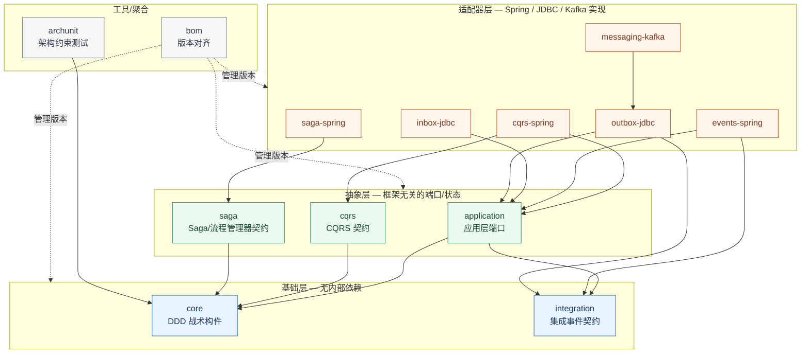

# AiPersimmon DDD 构建块

> `groupId: com.aipersimmon.ddd` · `version: 0.1.0-SNAPSHOT` · Java 21

一组**框架无关**的领域驱动设计(DDD)构建块,按端口—适配器(六边形)架构组织成多个 Maven 模块。纯领域/应用层只提供契约(端口),Spring / JDBC / Kafka 等具体实现放在独立的适配器模块中,可按需引入、按规模替换,而不影响业务代码。

## 模块依赖关系

依赖边指向下层(`A --> B` 表示 A 依赖 B)。所有边均为 `compile` 作用域,整体是一张无环有向图(DAG)。

### 分层与依赖表

| 模块 | 层 | 直接依赖 | 最大依赖深度 |
|---|---|---|---|
| `core` | 基础 | (无) | 0 |
| `integration` | 基础 | (无) | 0 |
| `application` | 抽象 | core, integration | 1 |
| `cqrs` | 抽象 | core | 1 |
| `saga` | 抽象 | core | 1 |
| `cqrs-spring` | 适配器 | cqrs, application | 2 |
| `saga-spring` | 适配器 | saga | 2 |
| `events-spring` | 适配器 | application, integration | 2 |
| `inbox-jdbc` | 适配器 | application | 2 |
| `outbox-jdbc` | 适配器 | application, integration | 2 |
| `messaging-kafka` | 适配器 | outbox-jdbc | 4 |
| `archunit` | 工具 | core | 1 |
| `bom` | 聚合 | 管理全部模块版本 | — |

**设计要点**

- **两个根**:`core`(DDD 战术构件)与 `integration`(集成事件契约)均无内部依赖;只有 `application` 同时依赖二者。
- **两分结构**:纯领域侧(`core`/`integration`/`application`/`cqrs`/`saga`)完全不依赖 Spring;适配器侧(`*-spring`/`*-jdbc`/`messaging-kafka`)才引入具体技术。端口—适配器边界落到了模块级别。
- **`cqrs`/`saga` 只依赖 `core`**:是纯领域层构建块,独立于应用层用例装配。
- **最长链**:`messaging-kafka → outbox-jdbc → application → {core, integration}`,Kafka 发送强制走事务性发件箱,不直接触达 `application`。

---

## 各模块详解

### 基础层

#### `aipersimmon-ddd-core`
DDD 战术构件与结构约定,零依赖。包含:

- **`annotation`** — 标记类型的战术角色(聚合根、实体、值对象、仓储、领域服务、领域事件)的注解,不强制实现任何框架接口;运行时保留,供反射工具与架构测试读取。
- **`architecture`** — 施加在包的 `package-info.java` 上的分层刻板印象注解(domain / application / infrastructure / interface),架构测试据此强制"依赖只能向内"的方向。
- **`model`** — 战术构件的类型接口与基类:`Identifier`、`Entity`、`AggregateRoot`、`Association`、`AbstractAggregateRoot`。
- **`event`** — `DomainEvent` 标记,表示限界上下文内部发生的事实(区别于对外发布的版本化契约)。
- **`state`** — 极简、无依赖的状态转换守卫 `Transitions`,把合法转换集中在一处,让领域对象在自己的意图方法内校验变更,而不引入状态机引擎。
- **`exception`** — `DomainException` 基类,把业务规则违反与技术故障区分开。

#### `aipersimmon-ddd-integration`
集成层构件:`IntegrationEvent`(跨上下文事件标记,属于限界上下文对外发布的语言)与 `EventEnvelope`(承载传输所需元数据的信封)。**集成事件是版本化契约**:发布后须向后兼容演进(只增可选字段,不删/不改语义),破坏性变更需提升 `version`。这与可自由变更的内部领域事件相对。

### 抽象层(框架无关)

#### `aipersimmon-ddd-application`
应用层构建块:`DomainEvents` 端口(用例通过它发布聚合记录的事件)、`ApplicationException` 基类,以及 `Inbox`(**幂等消费**守卫——处理消息前调用,基础设施记录 key 并报告是否已处理过)。全部是端口与标记,由基础设施实现或读取。

> 说明:本模块提供**你的应用层所使用的**构建块,它本身不是一个应用。模块名沿用 `core`/`integration` 的规律,以其所服务的 DDD 层命名。

#### `aipersimmon-ddd-cqrs`
框架无关的 CQRS 契约,分读写两侧:

- **写侧**:`Command` 经 `CommandBus` 派发给唯一的 `CommandHandler`,外围套一条有序的 `CommandInterceptor` 链(通常 日志 → 校验 → 事务)。事务步骤在 `UnitOfWork` 内运行处理器,并排干由 `AggregateCollector` 收集的聚合的领域事件,使状态变更与事件一起提交。
- **读侧**:`Query` 由 `QueryHandler`(可经 `QueryBus` 路由)从 `ReadModel` 作答,读模型由 `Projection` 保持最新,完全绕开聚合。

一切均为可选,仅依赖纯 `core`。

#### `aipersimmon-ddd-saga`
框架无关的 Saga / 流程管理器契约,用于从一处协调跨聚合、多步骤的流程。`@ProcessManager` 标记协调者,其持久化状态继承 `SagaState`(携带路由用的 correlationId 与守卫合法转换的 `SagaStatus`);`SagaStore` 按 correlationId 加载/保存实例(乐观锁);`DeadlineScheduler` 注册/取消 `Deadline`,到期时派发给 `DeadlineHandler`。契约与引擎无关,流程可通过替换实现迁移到 durable-execution 引擎。编舞(choreography)是默认;本模块面向步骤/分支/超时多到需要显式状态机的流程。

### 适配器层(Spring / JDBC / Kafka)

#### `aipersimmon-ddd-cqrs-spring`
CQRS 契约的 Spring 实现。`RegistryCommandBus` / `RegistryQueryBus` 按注册表把命令/查询路由到唯一处理器并施加拦截器链;内置拦截器:`LoggingCommandInterceptor`(最外)、`ValidationCommandInterceptor`(存在 Bean Validation 时)、`TransactionCommandInterceptor`(最内,在 `TransactionTemplateUnitOfWork` 中运行处理器,并在同一事务内排干 `ThreadLocalAggregateCollector` 收集的聚合事件)。`AipersimmonDddCqrsAutoConfiguration` 自动装配,每个 bean 均可被应用覆盖。

#### `aipersimmon-ddd-saga-spring`
Saga 契约的 Spring 实现。`SchedulingDeadlineScheduler` 通过 `TaskScheduler` 触发 saga 超时并派发给应用的 `DeadlineHandler`(进程内,待触发定时器**不跨重启存活**);`JdbcSagaStore` 是抽象 `SagaStore`,拥有 correlationId 查询与版本校验的 upsert(并发推进时抛 `OptimisticLockingFailureException`),仅把行映射留给限界上下文的子类;`AipersimmonDddSagaAutoConfiguration` 在存在 `DeadlineHandler` 时装配调度器。

#### `aipersimmon-ddd-events-spring`
事件发布端口的 Spring 适配器——进程内、同步传输。`SpringDomainEvents` / `SpringIntegrationEvents` 把每个事件交给 Spring 的 `ApplicationEventPublisher`,`AipersimmonDddEventsAutoConfiguration` 自动装配。投递是同步、同线程、同事务的,处理器在调用方事务内内联运行。**集成事件发布器仅在缺少 outbox starter 时提供。**

#### `aipersimmon-ddd-inbox-jdbc`
基于 `JdbcTemplate` 的**幂等消费者**实现。`JdbcInbox` 把已处理消息 key 记入带唯一约束的 inbox 表,重投的消息被检测并跳过。不使用 JPA 实体,不影响消费者的实体扫描。应与处理逻辑同事务,失败时记录一并回滚以便重试。

#### `aipersimmon-ddd-outbox-jdbc`
基于 `JdbcTemplate` 的**事务性发件箱**实现。`OutboxWriter` 在调用方事务内把集成事件写入 outbox 表;`OutboxRelay` 把未发送行经 `OutboxDispatcher` 派发并标记为已发。不使用 JPA 实体,不影响消费者的实体扫描。

#### `aipersimmon-ddd-messaging-kafka`
集成事件的 Kafka 传输,叠加在事务性发件箱之上。`KafkaOutboxDispatcher`(生产侧)是把每条 outbox 行发布到 Kafka 主题的 `OutboxDispatcher`,信封元数据放入 `IntegrationEventHeaders`、JSON 载荷作记录值;由 outbox relay 驱动,broker 确认后才标记已发。`KafkaIntegrationEventListener`(可选消费侧)按事件 id 经 `Inbox` 去重,并在进程内重发重建的事件供本地 `@EventListener` 处理。`AipersimmonDddMessagingKafkaAutoConfiguration` 装配两侧,由 `KafkaMessagingProperties` 配置。

### 工具 / 聚合

#### `aipersimmon-ddd-archunit`
跨项目复用的结构性检查,强制 DDD 分层与构建块约定。`AiPersimmonDddRules` 提供 ArchUnit 规则(针对编译后的类运行);`PackageInfoChecks` 提供源码级检查,确保每个包都声明 `package-info.java`(源码级是因为无注解的 package-info 不产生 class 文件,字节码分析看不到)。

#### `aipersimmon-ddd-bom`
版本对齐用的物料清单(BOM),把上述所有构建块模块的版本统一管理。使用方在自己的 `dependencyManagement` 中导入本 BOM,即可引入各模块而无需逐一指定版本。
</content>
