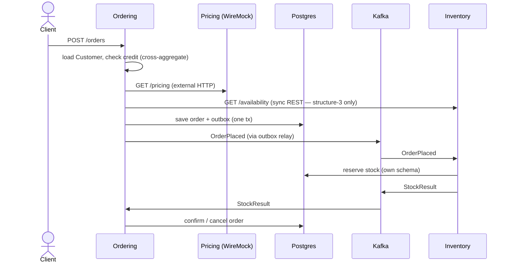

# bc-and-layer-samples

Three runnable Spring Boot projects, one per structure in
[`decision-00004`](../docs/decision/decision-00004-bounded-context-module-structure.md),
all implementing the **same** `Ordering` + `Inventory` domain and the same
"place an order" scenario — so the three structures can be compared directly.
Only the module/deployment structure differs.

| Dir | Structure | Deployables | BC boundary | Layer boundary | Port(s) |
| --- | --- | --- | --- | --- | --- |
| [`structure-1-modulith/`](structure-1-modulith/) | modular monolith, **logical** BCs (Spring Modulith) | 1 | package, `verify()` (test-time) | sub-package, ArchUnit (test-time) | 8081 |
| [`structure-2-multimodule/`](structure-2-multimodule/) | modular monolith, **physical** BCs (multi-module) | 1 | Maven module (compile-time) | Maven module (compile-time) | 8082 |
| [`structure-3-microservices/`](structure-3-microservices/) | **service per BC** (COLA) | 2 | separate service (network) | Maven-in-service / package | 8083 / 8084 |

All three verified end-to-end against live middleware: `POST /orders` →
`PENDING` → `CONFIRMED`, stock `100 → 98`, reservation `RESERVED`.

## The scenario (identical in all three)

`POST /orders` exercises every requested capability:

| Capability | Where to look |
| --- | --- |
| Inbound HTTP | `OrderController` (`adapter`/`web`) |
| **External HTTP** | `PricingClient` → WireMock `:8089/pricing` |
| **DB via MyBatis-Plus** | `*Po` + `*Mapper` + `*Repository` (`infrastructure`) |
| **Cross-aggregate** | `PlaceOrderService` loads `Customer`, checks credit vs `Order` total |
| **Cross-BC** | Ordering ↔ Inventory via Kafka integration events |
| **Sync cross-service** | structure-3 only: ordering → inventory `/availability` (REST) |
| **Message send + consume** | Kafka producer/relay + `@KafkaListener` |
| **Transactional outbox** | s1: Spring Modulith event registry · s2/s3: `outbox` table + `@Scheduled` relay |
| **Idempotency (inbox)** | `reservations` table keyed by order id |
| **Config reading** | s1: `@ConfigurationProperties` · s2/s3: `@Value` on `samples.*` |
| **Boundary enforcement** | s1: `ApplicationModules.verify()` · s2: ArchUnit + Maven graph · s3: separate builds |



## Running

Real middleware (Postgres 18.1, Kafka 3.7.1 KRaft, WireMock) via Docker Compose.
Apps run on the host over localhost. **Run one structure at a time** — each uses
its own DB schemas (`sN_ordering` / `sN_inventory`) and Kafka topic/group prefix
(`sN.`), so they never share state.

```bash
make up                       # start middleware, wait until ready
make s1                       # build + run structure-1 (8081)
make s2                       # build + run structure-2 (8082)
make s3-inventory             # run inventory-service (8084) ...
make s3-ordering              # ... then ordering-service (8083)
make events TOPIC=s1.order-placed   # peek at a Kafka topic
make reset                    # stop middleware + wipe volumes (clean slate)
make help                     # all targets
```

Drive a structure (replace the port):

```bash
curl -X POST localhost:8081/orders -H 'Content-Type: application/json' \
  -d '{"customerId":"C1","lines":[{"sku":"BOOK-1","qty":2}]}'
curl localhost:8081/orders/<orderId>     # poll until CONFIRMED
```

See [`plan-00001`](../docs/plan/plan-00001-bc-and-layer-samples.md) for the full
design and acceptance path.
