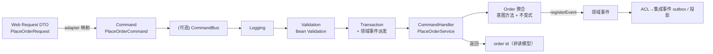
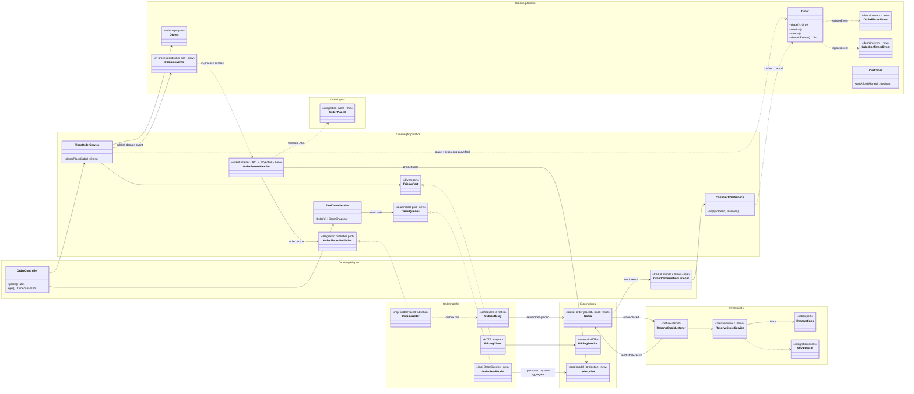
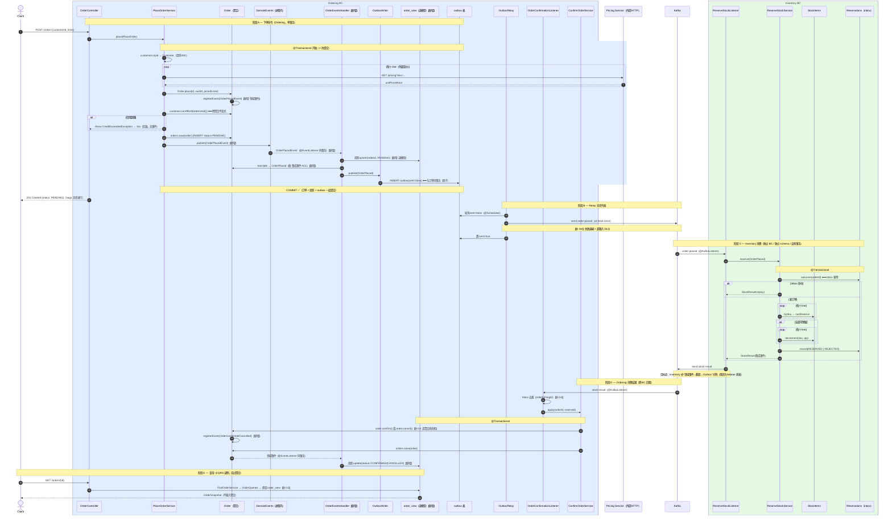

# structure-2 事件驱动蓝图：领域事件 / 集成事件完整链路 + CQRS-lite 读模型（扩充设计）

**范围：只针对 `bc-and-layer-samples/structure-2-multimodule`（下称 s2）。** 本文是对 s2 现状的
一次**标准扩充设计**——后续代码将参照本文实现。它先核验 s2 当前已有/缺失的部分，再补齐四件事：
（1）把领域事件与集成事件**落成两套类型 + 一层翻译（ACL）**；（2）领域事件**完整链路**；
（3）集成事件**完整链路**（Outbox→Broker→Inbox）；（4）**CQRS-lite 读模型**的真正读写分离。
每条主张都在文末 **Sources** 有参考或大厂实践出处。

配套阅读：[[analysis-00001-domain-event-publishing]]（领域事件发布/消费机制、可插拔 publisher）、
[[analysis-00002-domain-vs-integration-events]]（两类事件的判定轴与大厂实践）、
[[analysis-00004-bounded-context-module-structure]]（s2 = 物理多模块 BC 的结构依据）。

## 结论先行

1. **s2 已经有集成事件、Outbox、Inbox、跨 BC/跨聚合/外部调用；缺的是"领域事件层"与"真读模型"。**
   当前 `PlaceOrderService` 直接构造集成事件 `OrderPlaced` 丢进 outbox（`PlaceOrderService.java` 第 46-52 行），
   领域事件与集成事件**塌缩为一层**——这与 [[analysis-00002-domain-vs-integration-events]] 的"概念上永远区分"相悖。
2. **在 s2（模块化单体、一个可部署单元）里，两类事件仍应落成两套类型**：领域事件在 `*-domain`/`*-application` 内、
   由聚合抛出、进程内同事务消费；集成事件在 `*-api`、瘦身（ID+最小数据）、经 Outbox 异步外发。两者之间加一层
   **翻译/防腐（ACL）**。依据：Microsoft eShopOnContainers（`DomainEvent` via MediatR 同事务 vs `IntegrationEvent` via
   event bus + `IntegrationEventLog` = Outbox）、Grzybek modular-monolith-with-ddd（两级事件 + Outbox/Inbox）。
3. **Outbox 的原子性要求"翻译→写 outbox"与聚合状态变更处于同一事务**——因此该翻译必须用**同事务的
   `@EventListener`**，而非 `@TransactionalEventListener(AFTER_COMMIT)`（后者在提交后跑，破坏原子性）。
   依据：[[analysis-00001-domain-event-publishing]] 的三档同步语义表 + eShop 的 IntegrationEventLog 同事务写入。
4. **读侧要真正绕过写模型**：新增读模型端口 + 独立投影视图，查询直接打视图，不再 `Orders.byId` 载入整聚合。
   依据：ddd-by-examples/library 的 `SheetsReadModel`/`PatronProfileReadModel`（读模型直查 DB、绕过聚合）、
   ardalis CleanArchitecture 的 `QueryService`、Grzybek 的 raw-SQL 读侧（Dapper）。
5. **确认路径要走聚合方法**：`ConfirmOrderService` 应调用 `order.confirm()/cancel()`（触发领域事件 + 校验状态机），
   而非 `orders.updateStatus` 直写——现状绕过了 `Order` 已有的不变式（`Order.java` 第 47-55 行 vs `ConfirmOrderService.java`）。
6. **命令侧要与读侧对称**：CQRS 是 Command **和** Query 两侧。读侧已有显式 `OrderQueries` 端口 + DTO，命令侧却把命令内嵌
   （`PlaceOrder`）或缺失（`ConfirmOrderService` 无命令对象）。应把命令做成**一等、任务型**的显式对象 + 薄命令 handler。
   **本模板采纳命令总线 + 装饰器链**（Logging→Validation→Transaction）：总线可完整接管 UnitOfWork（`TransactionTemplate`
   装饰器；因 MyBatis 无 EF 式 ChangeTracker，事件集中 drain 需补一个每请求聚合收集器），handler 变纯、横切统一治理。
   命令总线本身是可选项（YAGNI，domain-driven-hexagon 明说"optional"；ddd-by-examples/library 即无总线形），
   本模板为展示可集中治理的完整命令管道而采纳。依据：modular-monolith-with-ddd（Logging→Validation→UnitOfWork）、
   eShop（pipeline behaviors）、Greg Young / Udi Dahan（task-based command）。详见 §五。

---

## 一、s2 现状核验（逐文件，已读源码）

模块结构：每个 BC 拆 `api / domain / application / infrastructure / adapter` 五个 Maven 模块 + `shared-kernel` + `start`，
BC 与层的隔离**编译期**（Maven classpath）成立，`ArchitectureTests` 做测试期兜底（`ArchitectureTests.java`）。这正是
[[analysis-00004-bounded-context-module-structure]] 的 Structure 2。

### 已具备（✅）

| 能力 | 现状实现 | 文件 |
| --- | --- | --- |
| 集成事件（published language） | `OrderPlaced`、`StockResult` 放在各自 `*-api` | `ordering-api/OrderPlaced.java`、`inventory-api/StockResult.java` |
| 事务性 Outbox | `OutboxWriter` 在下单同事务写 outbox 表；`OutboxRelay` `@Scheduled(fixedDelay=1000)` 轮询发 Kafka 后置 `sent=true` | `ordering-infrastructure/messaging/Outbox*.java` |
| Inbox 幂等（Inventory 侧） | `Reservations` 端口以 orderId 为键查/记结果，命中即 "replay" | `inventory-application/stock/ReserveStockService.java`、`Reservations.java` |
| 跨 BC | Ordering→Kafka(order-placed)→Inventory→Kafka(stock-result)→Ordering | `ReserveStockListener`、`OrderConfirmationListener` |
| 跨聚合（BC 内） | `Order.total()` 与 `Customer.canAfford()` 的信用校验 | `PlaceOrderService.java` 第 44-49 行 |
| 外部调用 | `PricingPort`→`PricingClient` HTTP 取单价 | `ordering-application/PricingPort.java`、`ordering-infrastructure/external/PricingClient.java` |
| 读侧 DTO | `FindOrderService` 返回 `OrderSnapshot`，适配层不碰领域类型 | `FindOrderService.java` |
| schema-per-module | outbox 落在 `s2_ordering` schema | `OutboxPo.java` `@TableName("s2_ordering.outbox")` |

### 缺口清单（❌，本文要补的）

| # | 缺口 | 证据 | 影响 |
| --- | --- | --- | --- |
| G1 | **无领域事件层**：应用服务直接造集成事件写 outbox | `PlaceOrderService.java` 直接 `new OrderPlaced(...)` → `publisher.publish` | 领域/集成塌缩，内部模型即对外契约，违背 [[analysis-00002-domain-vs-integration-events]] |
| G2 | **聚合不发事件**；确认走 `updateStatus` 绕过状态机 | `Order` 无 `registerEvent`；`ConfirmOrderService.apply` 调 `orders.updateStatus`，不调 `order.confirm()/cancel()` | `Order.confirm/cancel` 的不变式形同虚设 |
| G3 | **读模型未分离**：读侧经写仓储载入整聚合再映射 | `FindOrderService.byId` → `orders.byId(id).map(...)` | 是 CQRS 命名不是读写分离；无法独立优化/演化读侧 |
| G4 | **幂等不对称**：Ordering 消费端无 Inbox | `OrderConfirmationListener`/`ConfirmOrderService` 无幂等键 | 结果消息重投会重复 apply（虽多为幂等赋值，但无保护/无审计） |
| G5 | **无投影（projection）** | 无任何"由事件驱动更新的读模型表" | 读模型只能实时查聚合；无物化视图 |
| G6 | **Saga 未显式建模** | 编排式 saga 隐式存在，无超时/补偿 | StockResult 丢失/超时 → 订单永久 PENDING |
| G7 | **集成事件无契约演化约定** | `*-api` 事件无版本/schema 策略 | 未来跨部署演化易破坏下游 |
| G8 | **Outbox relay 无退避/DLQ** | `OutboxRelay.flush` 非事务、失败无重试策略 | at-least-once 成立但故障放大无边界 |

---

## 二、领域事件 vs 集成事件：在 s2 里落成两套 + 一层翻译

判定轴见 [[analysis-00002-domain-vs-integration-events]]：**能否一次编译抓到所有下游**。s2 是一个可部署单元，
但 **Inventory 消费者按"未来可独立部署"设计**（Structure 2 的晋升阶梯，见 analysis-00004 第 3 条），
因此对外仍用**独立集成事件契约**。落地为三层：

```
[Ordering 内部]                             │  边界（ACL / Published Language）  │  [跨 BC]
Order 聚合 ──raise──> OrderPlacedEvent       │                                    │
（领域事件，富类型，进程内、同事务）          │  翻译器 translate()                │
   │                                        │  OrderPlacedEvent → OrderPlaced     │  OrderPlaced（集成事件，瘦：
   └──@EventListener（同事务）──────────────>│  （只留 id + 最小必要数据）─写Outbox─┼─> id + sku/qty/price 最小集）
```

- **领域事件** `OrderPlacedEvent`（新增，放 `ordering-domain`，属通用语言）：由 `Order` 聚合 `registerEvent()` 抛出，
  可携带内部类型，进程内、**同事务**消费。依据：Vernon《Implementing DDD》"Effective Aggregate Design"（聚合发布领域事件）、
  Spring Modulith `AbstractAggregateRoot.registerEvent`、jMolecules `@DomainEventPublisher`（见 `docs/reference/jmolecules/`）。
- **集成事件** `OrderPlaced`（已存在于 `ordering-api`，保持瘦）：对外契约，版本化、向后兼容。
  内容遵循 Fowler：默认 *Event Notification*（ID+最小数据），确需减少回查再升级 *Event-Carried State Transfer*。
- **翻译层（ACL）**（新增）：一个 `ordering-application` 内的 `@EventListener`，把领域事件映射为集成事件并写 Outbox。
  依据：Spring Modulith 事件外化 `EventExternalizationConfiguration.mapping()` + `@Externalized`（见
  `docs/reference/spring-modulith-with-ddd/`）；eShop 的 domain→integration 转换。

> 为什么翻译必须**同事务**而非 AFTER_COMMIT：Outbox 的意义是"状态变更与待发消息原子落库"。若翻译在
> `@TransactionalEventListener(AFTER_COMMIT)` 里跑，outbox 行会在提交**之后**才写，二者不再原子——进程崩溃即丢消息。
> 故翻译用同事务 `@EventListener`（[[analysis-00001-domain-event-publishing]] 三档语义表的第一档）。
> 读模型投影则可同事务（强一致）或 AFTER_COMMIT（读侧最终一致），二选一，见第五节。

---

## 三、完整链路一：领域事件（进程内，BC 内）

**触发点在聚合，消费在同 BC 进程内、默认同事务。** 两个领域事件：

- `OrderPlacedEvent` —— `Order.place(...)` 时 `registerEvent`；消费者：①翻译成集成事件写 Outbox；②（可选）更新本地读模型投影。
- `OrderConfirmedEvent` / `OrderCancelledEvent` —— `Order.confirm()/cancel()` 时 `registerEvent`；消费者：更新订单读模型投影为 CONFIRMED/CANCELLED。

发布机制沿用 [[analysis-00001-domain-event-publishing]]：应用层只依赖 `DomainEvents` 接口（可插拔），
默认 `JustForward`（`ApplicationEventPublisher`，同步/同事务）。Spring 语义三档：

| 想要 | 用什么 | 本蓝图用途 |
| --- | --- | --- |
| 同步、同事务（默认） | `@EventListener` | **翻译→写 Outbox**（必须同事务）、强一致投影 |
| 仅提交后执行 | `@TransactionalEventListener(AFTER_COMMIT)` | 最终一致的读模型投影（可选） |
| 异步脱离事务 | 加 `@Async` | 不用于本链路（一异步即滑向集成事件） |

依据：[[analysis-00001-domain-event-publishing]]；Spring `@TransactionalEventListener` 文档；ardalis CleanArchitecture 的
after-commit 分发（`SaveChangesInterceptor`，见 `docs/reference/clean-architecture/`）。

---

## 四、完整链路二：集成事件（跨 BC，Outbox→Broker→Inbox）

**至少一次投递 + 消费端幂等**。这是 s2 已基本具备、但需两处补齐（G4 Inbox 对称、G8 退避/DLQ）的链路：

1. **写 Outbox（生产侧，同事务）**：翻译器把领域事件转集成事件 → `OrderPlacedPublisher.publish` → `OutboxWriter`
   在下单同事务 `INSERT s2_ordering.outbox`。依据：Chris Richardson *Transactional Outbox*（microservices.io）；Grzybek Outbox。
2. **Relay 轮询发送**：`OutboxRelay.flush()` `@Scheduled` 取 `sent=false` → `kafka.send` → 置 `sent=true`。
   **补 G8**：失败退避（指数退避 + 重试次数上限）+ 超限入 DLQ；可选升级为 Debezium CDC / Spring Modulith event publication registry
   （语义一致、可靠性更高，见 [[analysis-00001-domain-event-publishing]] 第 5 条）。
3. **Broker**：Kafka，topic `order-placed` / `stock-result`，以 `orderId` 为 key 保证同订单分区有序。
4. **消费 + Inbox（消费侧，幂等）**：
   - Inventory：**已有**——`ReserveStockService` 用 `Reservations`（orderId 为键）查重，命中 replay。
   - Ordering：**补 G4**——`OrderConfirmationListener`/`ConfirmOrderService` 增加同样的 Inbox（以 orderId/消息 id 去重）。
   依据：Chris Richardson *Idempotent Consumer*（microservices.io）；Grzybek Inbox。
5. **契约演化（补 G7）**：`*-api` 事件视为版本化契约，采用 Confluent Schema Registry + Avro/Protobuf 向后兼容策略
   （见 [[analysis-00002-domain-vs-integration-events]] 大厂实践）。

> **两条链路的接缝**：领域事件（链路一）→ 翻译（ACL）→ 集成事件写 Outbox（链路二起点）。回程亦对称：
> Inventory 收 `OrderPlaced` → 领域行为 → （目标态）抛领域事件 `StockReserved`/`StockRejected` → 翻译成 `StockResult`
> 写 Inventory 侧 Outbox → 回到 Ordering。**当前 s2 Inventory 侧是应用服务直接造 `StockResult` 并由 listener 直发 Kafka（无 outbox）**，
> 目标态建议对齐生产侧同样走"领域事件→翻译→Outbox"，两个 BC 结构对称。

---

## 五、CQRS：命令侧（写模型）与查询侧（读模型）

CQRS 的本质是把**改状态的意图（命令）**与**取数据的请求（查询）**分成两条独立路径：命令侧经**聚合 + 写仓储 +
领域事件**，查询侧经**投影读模型**，两条路互不穿透（写永不碰 `order_view`，读永不载入聚合）。前一版本文只写了读侧，
命令侧建模不足——本节把命令侧补齐，使两侧对称。**命令总线是可选项**（YAGNI 轴，见 5.1）。

### 5.1 命令侧（Command / 写模型）

**命令是什么。** 一个显式的、**任务型（task-based）而非 CRUD** 的意图对象，以祈使句命名（`PlaceOrderCommand`、
`ConfirmOrderCommand`），只携带执行该意图所需的**最小数据**，**只返回 id / 元数据**（绝不返回读模型）。
依据：Greg Young / Udi Dahan——命令是"要做某件事"的行为意图，不是对数据表的增删改（task-based UI / behavioral commands）；
domain-driven-hexagon——"Command = state-changing intent, returns only id/metadata"（见 `docs/reference/domain-driven-hexagon/`）。

**命令 ≠ 请求 DTO。** 边缘的 Web `PlaceOrderRequest` 与应用层 `PlaceOrderCommand` 分开：两者兼容性/生命周期不同，
适配器负责映射。依据：domain-driven-hexagon（Request DTO 与 Command 分离，便于客户端向后兼容）。

**命令 handler = 薄应用服务。** 一条命令一个 handler；handler 只做**编排**——经仓储端口载入聚合、调用聚合的意图方法、
持久化、发布领域事件；**自身不含领域逻辑，也不调别的应用服务**。依据：domain-driven-hexagon（Application Service = Command
Handler）；ddd-by-examples/library（命令是显式对象 `PlaceOnHoldCommand`/`CheckOutBookCommand`/`CancelHoldCommand`，handler
载入聚合→调领域方法→发事件，见 `docs/reference/ddd-by-examples-library/`）；Vernon《IDDD》应用服务即命令处理。

**写模型 = 聚合。** 命令只经聚合的意图方法改状态，不变式在聚合内（§一 G2 已修：`Order.confirm()/cancel()`）。
这与查询侧（5.2）构成读写分离：命令侧永不碰读模型 `order_view`，查询侧永不载入聚合。

**命令总线 + 装饰器链。** 用一个轻量 `CommandBus` 把调用方与 handler 解耦，并在其上叠**有序装饰器**：
`Logging（关联 id）→ Validation（Bean Validation）→ Transaction`。这与本文 [[analysis-00001-domain-event-publishing]]
里 `DomainEvents` 的"横切=装饰器"是同一手法。依据：modular-monolith-with-ddd（MediatR + **Logging→Validation→UnitOfWork**
装饰器链，见 `docs/reference/modular-monolith-with-ddd/`）；clean-architecture（Mediator/pipeline behaviors，
见 `docs/reference/clean-architecture/`）；Microsoft eShopOnContainers（MediatR pipeline behaviors 做校验/日志）；
axon-framework（`CommandBus` + `@CommandHandler`，"decide vs apply"）。Java 落地：手写 `CommandHandler<C,R>` +
按命令类型分发的 dispatcher，或 Axon `CommandBus`。

**关于 UnitOfWork（措辞更正，避免误读）。** 总线**能完整接管 UnitOfWork**：用 `TransactionTemplate`
（包 `PlatformTransactionManager`）做一个 `Transaction` 装饰器，把事务边界放到总线层，handler 就变成纯 POJO、
不再各自标 `@Transactional`——这正是 MediatR `UnitOfWorkBehavior` / Grzybek UoW 装饰器的等价物。所以**事务边界零障碍**，
不要误以为"Spring 里 `@Transactional` 已占位、总线加不了 UoW"（那只是"当前把边界放在哪"，不是"总线做不做得到"）。
唯一需要额外补的是**领域事件的集中 drain**：.NET/EF 的 UoW 能自动派发事件，是因为 `ChangeTracker` 天然知道本次改了哪些聚合；
我们用 MyBatis-Plus **没有 ChangeTracker**，若要在 UoW 装饰器里集中 drain，需加一个"每请求聚合收集器"（handler 把动过的
聚合登记进去，UoW 收尾统一 `domainEvents.publish(...)`）；否则保持 handler 自行 publish（§三现状）。

**本模板的取舍。** 采纳**命令总线 + 装饰器链**（本文档配套实现的方向）：即便只有两条命令，模板的价值在于展示**可集中治理**的
完整命令管道（统一校验/日志/事务，想漏都漏不掉），并与读侧显式端口对称。事件 drain 采用**每请求聚合收集器**，使
`Transaction` 装饰器同时收尾事务与事件派发，handler 不再手动 publish。YAGNI 轴仍成立、供读者判断：命令极少且无跨切治理需求时，
handler 直接 `@Service` 注入调用（domain-driven-hexagon 明说总线"optional"，ddd-by-examples/library 即此形）也是正当选择。

**命令幂等。** 从消息触发、可重投的命令（如 `ConfirmOrderCommand` 源自 `stock-result`）需去重——本文已用 inbox
（`ProcessedResults`，§一 G4）承接，等价于 eShop 的 *idempotent command identifier*。

**返回与错误。** 命令只返回 id/元数据；预期的领域失败（如信用超限 `CreditExceededException`）用 Result/受控异常表达，
不用异常表达正常控制流。依据：domain-driven-hexagon、clean-architecture（Result-over-exceptions）。

命令侧管道（与读侧对称）：



**s2 命令侧缺口（补充到 §九）：**

| # | 缺口 | 证据 | 改造 |
| --- | --- | --- | --- |
| GC1 | 命令非一等/不对称 | `PlaceOrder` 内嵌于 `PlaceOrderService`；`ConfirmOrderService.apply(orderId, reserved)` 无命令对象 | 抽出顶层 `PlaceOrderCommand` / `ConfirmOrderCommand` |
| GC2 | 无 `Command` 标记/命名约定 | 命令散落、无统一抽象（对照读侧有 `OrderQueries`） | 加 `Command` 标记接口 + 祈使命名 + `CommandHandler<C,R>` |
| GC3 | 横切关注点分散，无总线 | 校验/日志/事务写在各 handler 里 | 轻量 `CommandBus` + Logging→Validation→Transaction 装饰器链 + 每请求聚合收集器（**本模板采纳**） |
| GC4 | 命令幂等未显式表述 | 依赖 inbox 但文档未点明其"命令幂等"角色 | 已由 `ProcessedResults` 承接，文档化 |

> 目标态与读侧对称：命令侧 = `Command` 标记 + `PlaceOrderCommand`/`ConfirmOrderCommand` + `CommandHandler<C,R>`
> （↔ 读侧 `OrderQueries` + `OrderSnapshot`）；`PlaceOrderRequest`→命令的映射放适配层；命令只返回 id。

### 5.2 查询侧（Query / 读模型，CQRS-lite）（补 G3 / G5）

**当前**：`FindOrderService.byId` → `Orders.byId(id)` 载入整个 `Order` 聚合再映射 `OrderSnapshot`。读走写模型，未分离。

**目标**：读写两条独立路径，读侧绕过聚合直查投影视图（library 式 CQRS-lite）。

```
写侧（命令）：Command → 聚合 → 写库 ──raise 领域事件──┐
                                                     ├─(同事务或 AFTER_COMMIT)投影更新
读侧（查询）：Query → OrderQueries（读模型端口）──────┘  写入 s2_ordering.order_view
              → OrderReadModel（MyBatis 直查 order_view）→ OrderSnapshot（不经聚合/不经写仓储）
```

- 新增读模型端口 `OrderQueries`（`ordering-application`）+ 适配 `OrderReadModel`（`ordering-infrastructure`，直查 `order_view`）。
  `FindOrderService` 改为依赖 `OrderQueries`，不再依赖写侧 `Orders`。
- 新增投影表 `s2_ordering.order_view`（orderId, status, totalMinor, currency, updatedAt…），由领域事件驱动更新：
  `OrderPlacedEvent`→插入 PENDING 行；`OrderConfirmedEvent`/`OrderCancelledEvent`→更新 status。
- 一致性选择：同库投影可**同事务**（强一致）或 **AFTER_COMMIT**（读侧最终一致、写事务更短）。默认同事务，量大再放宽。

依据：ddd-by-examples/library `SheetsReadModel` / `PatronProfileReadModel`（读模型直查 DB、绕过聚合，见
`docs/reference/ddd-by-examples-library/` "CQRS / events / outbox"）；ardalis CleanArchitecture `...QueryService`
（读侧 DTO 绕过仓储，见 `docs/reference/clean-architecture/`）；Grzybek raw-SQL 读侧（Dapper 打视图，
见 `docs/reference/modular-monolith-with-ddd/`）；Fowler *CQRS*；Greg Young / Udi Dahan CQRS。

> 提醒（沿用 clean-architecture 笔记）：读模型是**工程便利**，不是领域建模模式——别把投影 DTO 当聚合建模。

---

## 六、目标态 UML 类图（聚焦事件与读写分离）

> 只画与"两类事件 + Outbox/Inbox + 读模型"相关的元素；持久化 mapper/PO 等省略。`«new»` = 本蓝图新增。



---

## 七、目标态时序图（完整流程 · 一图收敛全部要素）

覆盖：跨 BC、BC 内跨聚合、外部调用、**领域事件（进程内）**、**集成事件（跨进程）**、Outbox/Inbox、读模型投影与查询。
`【新增】` 标注本蓝图相对现状要补的步骤。



---

## 八、一致性与 Saga（补 G6）

整条流程是一个**编排式 Saga（choreography）**：`OrderPlaced → 预留 → StockResult → confirm/cancel`，无中心协调者，
靠事件推进。风险:`StockResult` 丢失/超时 → 订单永久停在 `PENDING`。

> **超时补偿 ≠ Outbox**：Outbox（§四）保证"已决定要发的消息"每一跳不丢(at-least-once)，但没有"我在等回复、等多久算超时"的概念；
> 若 Inventory 长时间不消费、或结果消息超出重试彻底丢失，订单仍会永远 PENDING。超时补偿是**整条 Saga 的活性(liveness)兜底**：
> 过了截止时间还没结果，就主动补偿。二者正交、互补。

**已实现（闭环）：**

- **触发（Ordering）**：`PendingOrderTimeoutScanner`（`@Scheduled`）扫 `status=PENDING 且 created_at < now-超时`的订单 →
  经命令总线派发 `CancelStaleOrderCommand` → `CancelStaleOrderService` 在状态仍为 PENDING 时 `order.cancel()`（状态守卫做幂等：
  若迟到的 StockResult 已把订单 confirm/cancel，则 no-op）。超时值 `samples.pending-timeout`（默认 `PT30S`）。
- **补偿传播**：`OrderCancelledEvent` 经 `OrderEventsHandler` 翻译为集成事件 `OrderCancelled`（`ordering-api`）写 outbox → Kafka。
- **释放（Inventory）**：`OrderCancelledListener` 消费 → `ReleaseStockService`：仅当预留仍为 `RESERVED` 时 `stock.increment(...)`
  归还库存并标记 `RELEASED`（幂等，防重投重复释放）。
- **可观测**：Saga 关联 id（orderId）贯穿；outbox、inbox、投影、reservation 四处可审计。

**已知残留边界（如实标注，样例范围内不处理）：**
- reservation 只存首个 sku + 合计 qty，多行订单的释放不按行精确；
- `OrderCancelled` 若抢先于原始 `OrderPlaced` 到达，Inventory 查不到预留、无法预先阻止后续预留（跨主题竞态）——
  生产级需按行释放 + 取消 tombstone，超出本样例。
- 若跨 BC 步骤增多，再考虑升级为**编排/流程管理器（orchestration / process manager）**（Axon Saga 风格），YAGNI。

依据：Chris Richardson *Saga pattern*（microservices.io，补偿事务）；Garcia-Molina & Salem *Sagas*（1987）；
Axon `DeadlineManager`/`EventScheduler`（超时 + 补偿，见 `docs/reference/axon-framework/`）；Vernon《IDDD》过程管理器。

---

## 九、缺口 → 改造清单（供后续代码设计直接对照）

| # | 缺口 | 改造动作 | 落点模块 | 出处 |
| --- | --- | --- | --- | --- |
| G1 | 无领域事件层 | 新增 `OrderPlacedEvent` 等领域事件；应用服务不再直接造集成事件 | ordering-domain | eShop / Grzybek（analysis-00002） |
| G2 | 聚合不发事件、确认绕过状态机 | `Order` 加 `registerEvent`；`ConfirmOrderService` 改调 `confirm()/cancel()` | ordering-domain / application | Vernon；jMolecules |
| G3 | 读模型未分离 | 新增 `OrderQueries` 端口 + `OrderReadModel` 直查视图；`FindOrderService` 改依赖它 | ordering-application / infrastructure | library / clean-arch / Grzybek |
| G4 | Ordering 消费端无幂等 | `OrderConfirmationListener` 加 Inbox 去重 | ordering-adapter | Richardson *Idempotent Consumer* |
| G5 | 无投影 | 新增 `order_view` 表 + 领域事件驱动投影更新 | ordering-infrastructure | library `SheetsReadModel` |
| G6 | Saga 无补偿 | ✅ 已实现：`PendingOrderTimeoutScanner` → `CancelStaleOrderCommand` → `OrderCancelled` 集成事件 → Inventory `ReleaseStockService` 幂等释放 | ordering-* / inventory-* | Richardson *Saga*；Axon DeadlineManager |
| G7 | 契约无版本化 | `*-api` 事件纳入 Schema Registry + 兼容策略 | *-api | Confluent |
| G8 | relay 无退避/DLQ | `OutboxRelay` 加退避+重试上限+DLQ；或换 CDC/Modulith registry | ordering-infrastructure | Richardson *Transactional Outbox*；analysis-00001 |
| GC1 | 命令非一等/不对称 | 抽出顶层 `PlaceOrderCommand` / `ConfirmOrderCommand` | ordering-application | ddh；ddd-by-examples/library（§五） |
| GC2 | 无 `Command` 标记/命名约定 | 加 `Command` 标记接口 + `CommandHandler<C,R>` + 祈使命名 | ordering-application / shared-kernel | Young / Dahan（§五） |
| GC3 | 横切分散、无总线 | 轻量 `CommandBus` + Logging→Validation→Transaction 装饰器链 + 每请求聚合收集器（本模板采纳） | ordering-application / infrastructure | Grzybek；clean-arch；eShop（§五） |
| GC4 | 命令幂等未点明 | 由 `ProcessedResults` inbox 承接，文档化 | ordering-application | eShop *idempotent command*（§五） |
| — | Inventory 生产侧不对称 | Inventory 亦"领域事件→翻译→Outbox"，两 BC 对称 | inventory-* | 本文第四节 |

---

## Sources

内部（本仓库蒸馏笔记 `docs/reference/` 与既有分析）：

- [[analysis-00001-domain-event-publishing]] —— 领域事件发布/消费三档语义、可插拔 `DomainEvents` + Outbox。
- [[analysis-00002-domain-vs-integration-events]] —— 两类事件判定轴、eShop/Grzybek/Confluent/Fowler 立场。
- [[analysis-00004-bounded-context-module-structure]] —— s2 = 物理多模块 BC（Structure 2）与晋升阶梯。
- `docs/reference/ddd-by-examples-library/` —— `SheetsReadModel`/`PatronProfileReadModel` 读模型直查、store-and-forward outbox。
- `docs/reference/modular-monolith-with-ddd/` —— 两级事件 + Outbox/Inbox + raw-SQL 读侧。
- `docs/reference/spring-modulith-with-ddd/` —— 事件外化 `mapping()` + `@Externalized`；event publication registry。
- `docs/reference/clean-architecture/` —— after-commit 分发；`QueryService` 读侧 DTO 绕过仓储。
- `docs/reference/axon-framework/` —— Saga / process manager（仅在流程复杂时参考）。
- `docs/reference/jmolecules/` —— `@DomainEventPublisher` / `DomainEvent` 注解。

外部（大厂 / 权威）：

- Microsoft, *.NET Microservices: Architecture for Containerized .NET Applications* + eShopOnContainers —— domain vs integration event，`IntegrationEventLog`=Outbox。https://learn.microsoft.com/dotnet/architecture/microservices/
- Chris Richardson, microservices.io —— *Transactional Outbox* / *Idempotent Consumer* / *Saga*。https://microservices.io/patterns/data/transactional-outbox.html · /patterns/communication-style/idempotent-consumer.html · /patterns/data/saga.html
- Martin Fowler —— *CQRS*（https://martinfowler.com/bliki/CQRS.html）、*What do you mean by "Event-Driven"?*（Event Notification vs Event-Carried State Transfer，https://martinfowler.com/articles/201701-event-driven.html）。
- Confluent —— Schema Registry + Avro/Protobuf 向后兼容（事件即契约）。https://docs.confluent.io/platform/current/schema-registry/
- Vaughn Vernon, *Implementing Domain-Driven Design* —— 聚合发布领域事件、长流程/过程管理器。
- Greg Young —— CQRS 起源与读写模型分离；命令为**任务型意图**（task-based）。
- Udi Dahan —— *Task-Based UI* / behavioral commands（命令是"要做的事"而非 CRUD）。https://udidahan.com/2007/12/19/table-editing-with-nservicebus/
- Microsoft eShopOnContainers —— 命令侧 MediatR + **pipeline behaviors**（校验/日志装饰器）、*idempotent command identifier*。https://learn.microsoft.com/dotnet/architecture/microservices/microservice-ddd-cqrs-patterns/
- Hector Garcia-Molina & Kenneth Salem, *Sagas*, ACM SIGMOD 1987 —— saga/补偿事务理论源头。
- Spring Framework —— `@TransactionalEventListener`（AFTER_COMMIT）。https://docs.spring.io/spring-framework/reference/data-access/transaction/event.html
- Spring Modulith —— 事件外化与 event publication registry。https://docs.spring.io/spring-modulith/reference/events.html
