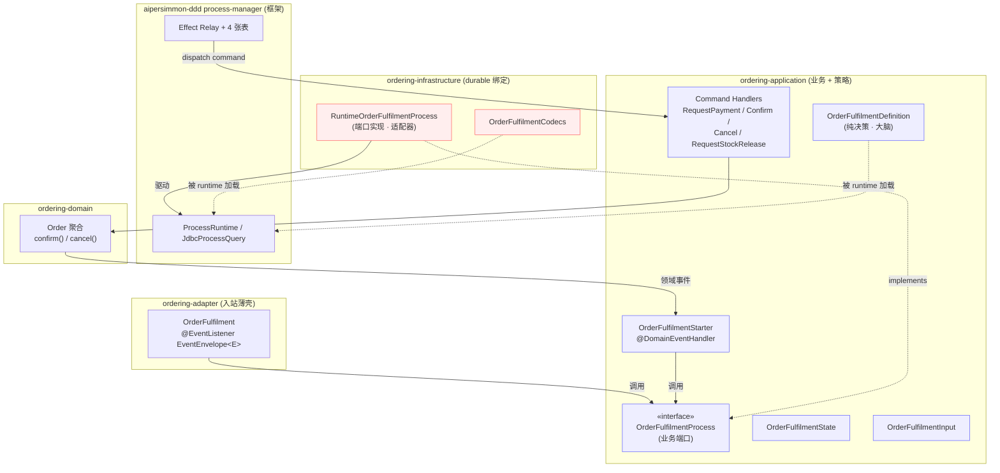
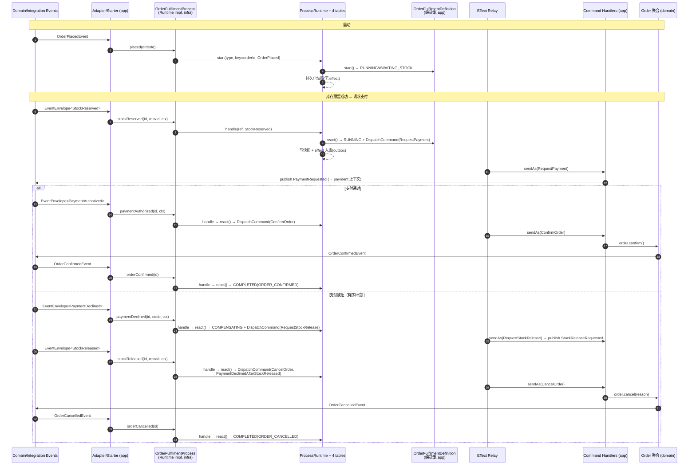
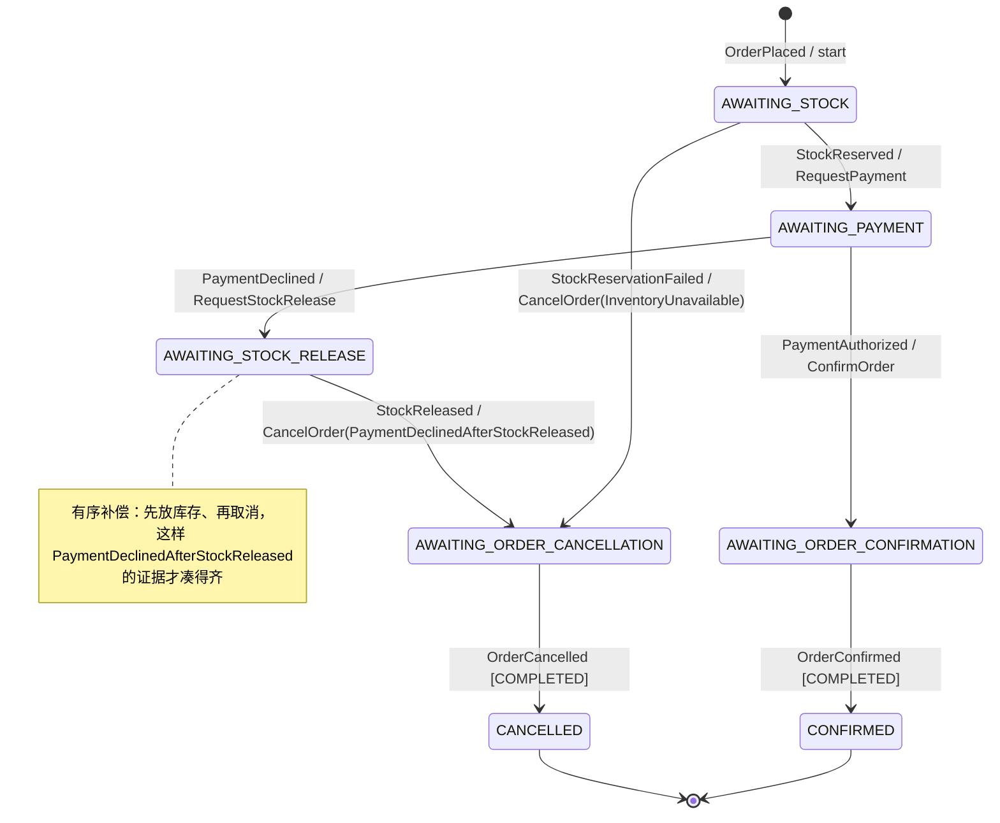

# multi-module 订单履约 Process Manager —— 从入口到闭环的完整梳理

**这是一份"读代码、不改代码"的梳理与 review 文档。** 目标是回答一个直觉上的疑问：

> 用 process manager 重写 multi-module 之后，代码为什么看起来这么"奇怪"？
> 为什么 `OrderFulfilmentProcess` 在 application 层定义、却在 infrastructure 层实现？
> process manager 不是应该待在 application 层吗？

结论先行，然后给出完整的组件清单、静态依赖图、从下单到闭环的时序图、状态机图，
以及和重写前旧 saga、和 `design-00004 §13.1` 的对比。文末列出需要你拍板的开放问题。

涉及的三个重写提交：`dd3214a`（引入制品）、`0861cc2`（迁移逻辑）、`bf051e9`（Postgres 持久化 + 验收绿）。

---

## 1. 结论：它没有"整体挪到 infra"，而是被沿六边形接缝拆开了

> **时态说明（后补）**：§1–§6 是对**三个重写提交**（`dd3214a`/`0861cc2`/`bf051e9`）当时代码的忠实梳理，
> 彼时 `OrderFulfilmentDefinition`/`OrderFulfilmentInput` 位于 `ordering-application`。该落点此后已按 **§7 的决策执行**，
> 迁入独立 provider 模块 `ordering-process-jdbc`（`package com.example.ordering.process.fulfilment`）。
> 因此本节结论与组件表中"Definition 在 application 层"属**历史现状**，当前落点以 §7 为准——
> §1–§6 描述决策落地前的状态，与 §7 并非矛盾（另见文末 §6 结尾 blockquote 的桥接）。

重写前，`OrderFulfilmentProcessManager` 是 application 层里**一个类**，同时干四件事：
持有 saga 状态、决定下一步、通过 `CommandBus` 发命令、通过 `SagaStore` 持久化。

重写后，这一个类被**按职责拆成了两半**，落在两个层：

- **决策大脑（policy）留在 application 层** —— 这恰恰印证了你的直觉。
  真正的"流程编排逻辑"是 `OrderFulfilmentDefinition`，一个**纯函数式、无框架依赖、确定性**的状态机，
  就在 `ordering-application` 里。
- **只有"驱动 + 持久化绑定"下沉到 infra 层** —— `RuntimeOrderFulfilmentProcess`（端口实现）依赖
  `ProcessRuntime` + JDBC，`OrderFulfilmentCodecs`（序列化）是持久化关注点。按端口与适配器（Hexagonal）
  规则，**依赖具体技术的适配器必须待在 infra**，这跟 `Orders` 仓储接口在 domain/application、
  JDBC 实现在 infra 是同一条规则。

所以"奇怪"的来源有两个，都是**风格问题、不是分层错误**：

1. **端口在 application、实现在 infra**（`OrderFulfilmentProcess` / `RuntimeOrderFulfilmentProcess`）
   —— 这是依赖倒置（DIP）的标准形态，和仓储一模一样。
2. **一个概念被拆成了 5~7 个文件**（Process 端口、Definition、State、Input、Starter + Codecs、Runtime 实现）
   —— 旧代码 1~2 个文件就搞定，现在为了"可持久化 / 可替换 provider / at-least-once"付出了文件数的代价。

> 一句话：**process manager 的"脑子"确实在 application 层（`OrderFulfilmentDefinition`）；
> 下沉到 infra 的只是它的"手脚"（跑在 JDBC durable runtime 上的驱动与编解码）。**

---

## 2. 组件清单（按层）

| 组件 | 层 / 模块 | 角色 | 为什么在这层 |
|------|-----------|------|--------------|
| `OrderFulfilmentProcess`（interface） | application | **业务端口**：`placed / stockReserved / paymentAuthorized …` 等意图化方法 | 它的调用方（Starter、入站 adapter）在 application 侧；表达的是业务能力 |
| `OrderFulfilmentDefinition` | application（历史；现已按 §7 迁入 `ordering-process-jdbc`） | **协调策略（纯决策函数）**：`start()/react()` → 返回下一个 state+lifecycle+effects | 无 I/O、无框架、确定性；这就是"saga 的大脑" |
| `OrderFulfilmentState` | application | 流程业务状态（不可变 record，含 `reservationId`、`paymentDeclineCode`） | 业务数据 |
| `OrderFulfilmentInput` | application | sealed 输入集合（下单 + 跨上下文结果事实 + 本上下文终态事实） | 业务输入 |
| `OrderFulfilmentStarter` | application | `@DomainEventHandler`：把**本上下文**领域事件桥接进 Process | 领域事件订阅属于 application，adapter 不应碰本上下文领域类型 |
| `RuntimeOrderFulfilmentProcess` | **infrastructure** | **端口实现**：解析 `ProcessRef`、调 `ProcessRuntime.start/handle` | 依赖 `ProcessRuntime` + `JdbcProcessQuery`（具体技术）→ 适配器归 infra |
| `OrderFulfilmentCodecs` | **infrastructure** | state / input / command-effect 的显式编解码（US 分隔的 UTF-8） | 序列化 = 持久化关注点 |
| `OrderFulfilment`（messaging adapter） | ordering-adapter | 入站薄壳：订阅**其它上下文**集成事件 `EventEnvelope<E>` → 调端口 | 只绑定 Spring 事件传输，不含业务逻辑，不引本上下文领域类型 |

命令处理器（把 effect 落回聚合，闭合回路）：`RequestPaymentHandler`、`ConfirmOrderHandler`、
`CancelOrderHandler`、`RequestStockReleaseHandler`，均在 `ordering-application`。

---

## 3. 静态依赖图：端口在内、适配器在外



关键观察：**箭头方向**。`RuntimeOrderFulfilmentProcess`（infra）`implements` 一个 application 的接口——
依赖方向由外向内，符合分层。`OrderFulfilmentDefinition` 虽在 application，但被框架 runtime 在运行时加载
（Spring 收集 `ProcessDefinition<?>` bean），application 本身**不** import 任何 JDBC/runtime 实现类。

---

## 4. 从入口到闭环：完整路径

### 4.1 三个入口

1. **启动**：`OrderPlacedEvent`（本上下文领域事件）→ `OrderFulfilmentStarter.onOrderPlaced`
   → `process.placed(orderId)` → `runtime.start(TYPE, businessKey=orderId, OrderPlaced, rootContext)`。
2. **跨上下文结果事实**：inventory/payment 的集成事件 `EventEnvelope<E>` → `OrderFulfilment`(adapter)
   → `process.stockReserved/…(…, CommandContext.of(envelope))` → `RuntimeOrderFulfilmentProcess.handle`
   → 用 `query.findRef(TYPE, orderId)` 解析 `ProcessRef` → `runtime.handle(ref, input, cause)`。
3. **本上下文终态事实**：`OrderConfirmedEvent` / `OrderCancelledEvent` → `Starter` →
   `process.orderConfirmed/orderCancelled` → 在**确定性 root context**（`fact:orderId`）下 `handle`。
   注意：**只有这两个事实**才让流程走到终态 lifecycle，而不是"命令刚发出去"那一刻。

### 4.2 每次 `handle` 内部（框架侧，`JdbcProcessRuntime.doHandle`）

1. `instances.findForUpdate` 行锁快照；用 `(instance_id, input_message_id)` 去重（幂等）。
2. 定位钉在该行 `definitionVersion` 的定义，解码当前 state，调**纯函数** `definition.react(state, input, ctx)`。
3. 校验 lifecycle 迁移合法（`canTransitionTo`）；`revision++` 乐观锁写快照（冲突抛 `StaleProcessRevisionException`）。
4. 追加 `transition` 审计行；`stageEffects` 把 `DispatchCommand` 落进 **effect outbox**
   （确定性 `effectId = transitionId + "#" + index`，同实例内 `seq` 严格有序）。
   —— **命令不在本事务内发送**，只入库。

### 4.3 Effect relay（异步、at-least-once）

`JdbcProcessEffectRelay.pollOnce` → 方言 `claimDueEffects`（Postgres/MySQL8 用 `FOR UPDATE SKIP LOCKED`，
且被同实例更早 `seq` 未投递的 effect 阻塞 → 严格串行）→ `deliver`：解码 payload →
`CommandEffectDispatcher` → `commandBus.sendAs(command, context)` → 成功后 `markDelivered`（用 lease token 围栏）。
崩溃/失败 → 租约过期后重投（同一 `effectId`/`messageId`，下游去重）或超限 `markDead` + 挂起实例。

### 4.4 命令落回聚合 → 事实回流（闭环）

- `RequestPayment` → `RequestPaymentHandler` → 发 `PaymentRequested` 集成事件（payment 上下文去消费）。
- `PaymentAuthorized`（集成事件回流）→ adapter → `paymentAuthorized` → `react` → 派发 `ConfirmOrder`。
- `ConfirmOrder` → `ConfirmOrderHandler` → `order.confirm()` → 聚合发 `OrderConfirmedEvent`。
- `OrderConfirmedEvent` → `Starter.onOrderConfirmed` → `process.orderConfirmed` → `react` →
  **lifecycle = COMPLETED(ORDER_CONFIRMED)** —— 闭环。

### 4.5 时序图（成功 + 支付被拒补偿）



### 4.6 决策状态机（`OrderFulfilmentDefinition`）



`RUNNING`（正向）与 `COMPENSATING`（补偿）是 runtime lifecycle，和上面的业务 `Step` 正交，分开存储。

---

## 5. 重写前 vs 重写后（同一逻辑，两种形态）

| 维度 | 旧：`OrderFulfilmentProcessManager` | 新：Definition + Runtime impl |
|------|-------------------------------------|-------------------------------|
| 逻辑落点 | application **一个类** | 策略在 application（Definition），驱动在 infra（Runtime impl） |
| 状态 | `OrderFulfilmentSaga extends SagaState`（可变） | `OrderFulfilmentState`（不可变 record） |
| 决策与副作用 | **混在一起**：`saga.xxx(); sagas.save(); commandBus.send()` | **分离**：`react()` 只返回"下一步 + 要发的命令"，由 runtime 负责发 |
| 持久化 | `SagaStore`（本类直接调） | 框架 4 张表 + outbox（本类不感知） |
| 命令投递 | 同步、in-memory、best-effort | 异步、durable、at-least-once（SKIP LOCKED + 租约 + 去重） |
| 崩溃恢复 | 无（进程挂了流程就丢） | outbox 重投、实例挂起/重驱动 |
| 文件数 | ~2（PM + Saga） | ~7（Process/Definition/State/Input/Starter + Codecs/Runtime impl） |

**代价换来的东西**：可持久化、崩溃可恢复、命令 at-least-once、provider 可替换（native/Temporal/Seata）。
**代价本身**：概念被摊成更多文件、端口/实现跨层、多了一层 codec 样板。这是"看起来奇怪"的真正来源。

---

## 6. ⚠️ 与 design-00004 §13.1 的偏差（需 review）

设计文档 §13.1 的落点方案里，**`OrderFulfilmentDefinition` + 各 codec 被放在一个独立的 provider 模块
`ordering-process-native`**（"JDBC provider，依赖 process-manager 并实现 Definition/codec"），
application 只放 `OrderFulfilmentProcess` / `OrderFulfilmentInput` / view。

而实际 multi-module 实现的落点是：

| 制品 | design-00004 §13.1 计划 | 实际实现 |
|------|-------------------------|----------|
| `OrderFulfilmentProcess`（端口） | application | application ✅ |
| `OrderFulfilmentInput` | application | application ✅ |
| `OrderFulfilmentDefinition` | **ordering-process-native（独立 provider 模块）** | **ordering-application** ⚠️ |
| `OrderFulfilmentState` | ordering-process-native | **ordering-application** ⚠️ |
| state/payload codecs | ordering-process-native | **ordering-infrastructure** ⚠️ |
| view | application | 未见（无 `OrderFulfilmentView`）⚠️ |

也就是说，实现**没有**建独立 provider 模块，而是把 Definition/State 上提到 application、codec 放进 infrastructure。
这有其合理性（Definition 是纯函数、无框架依赖，放 application 不违反分层），但它**偏离了设计文档**，
且造成了一个耐人寻味的现象：**Definition（大脑）和它的 codec（怎么存大脑的输入/输出）被拆到了两个不同的层**——
这可能正是你觉得"奇怪"的一个具体点。

> 这一条已在 §7 定案：Definition 抽到独立模块 `ordering-process-jdbc`，Input 一并迁入，
> application 彻底不再依赖 process-manager 框架。其余章节是对既有代码的忠实描述。

---

## 7. 决策：Definition 落点 —— 抽独立模块 `ordering-process-jdbc`（已定）

### 7.1 先厘清一个前提："process manager 属不属于某个 BC"

"process manager"是两个东西，归属截然不同：

| | 是什么 | 属不属于 BC | 现状 |
|---|---|---|---|
| **① runtime / 框架** | `aipersimmon-ddd-process-manager(-jdbc)`：四表、`ProcessRuntime`、relay | **不属于任何 BC** | 已是独立库 ✅ |
| **② 某条流程 Definition** | `OrderFulfilmentDefinition`：订单履约协调策略 | **属于 ordering BC** | 错放在 application ⚠️ |

`OrderFulfilmentDefinition` 铁证归 ordering：`ProcessType("ordering.fulfilment")`、业务键 orderId、
派发的全是 ordering 命令（`RequestPayment/ConfirmOrder/CancelOrder/RequestStockRelease`）、补偿策略用
`ordering.domain` 的 `CancellationReason`。它**调用** inventory/payment，但那发生在 adapter（ACL）里；
Definition 只对已翻译的 `OrderFulfilmentInput` 反应、只发 ordering 命令，是**纯 ordering 的**。
**因此不能建"BC 中立的共享 process 模块"装 Definition**——那会倒挂依赖、破坏 BC 归属。

### 7.2 决策

**Definition 归 ordering，抽到 ordering 名下的独立 provider 模块 `ordering-process-jdbc`**，与 State、
两个 codec、端口实现 `RuntimeOrderFulfilmentProcess` 同处一模块（design-00004 §六/§13.1 的 A 方案）。

一个实现层面的收获（比设计文档更进一步）：因为实现引入了 `OrderFulfilmentProcess` 端口（方法是**裸参数**
`placed(orderId)` / `stockReserved(orderId, reservationId, ctx)`），`OrderFulfilmentInput` 已**不在**
adapter 面向的契约里——它只被 Definition/Codecs/Runtime 引用（已核实全模块无其他引用点）。所以 **Input 也一并
迁入 provider 模块**，`ordering-application` 由此**彻底不再依赖 `aipersimmon-ddd-process-manager`**。

```
ordering/
├── ordering-application/     业务契约: OrderFulfilmentProcess(port,裸参数)、OrderFulfilmentStarter、命令+handlers
│                             ★ 不再依赖 aipersimmon-ddd-process-manager
├── ordering-infrastructure/  只剩 gateway + 内存仓储; ★ 去掉 process-manager(-jdbc) 依赖
├── ordering-adapter/         OrderFulfilment(入站 ACL)
└── ordering-process-jdbc/    ★ 新模块 = ordering 的关系型 provider:
        OrderFulfilmentDefinition / OrderFulfilmentState / OrderFulfilmentInput /
        OrderFulfilmentCodecs / RuntimeOrderFulfilmentProcess
    包名 com.example.ordering.process.fulfilment（不含受 ArchUnit 约束的层段，天然合规）
    依赖: aipersimmon-ddd-process-manager(-jdbc) + aipersimmon-ddd-cqrs + ordering-application + ordering-domain
```

**为什么是"模块"而非"包"**：multi-module 的立身之本就是**编译期强制边界**。现状 bug——`ordering-application`
悄悄依赖了 `aipersimmon-ddd-process-manager`——正因 Definition 和 application 同模块、**无物可拦**。独立模块后
application 的 classpath 上根本没有那个框架，这类泄漏**编译即不过**。（若回到 modulith，则退化为"独立包 + 一条
ArchUnit 规则"。）现状 C（Definition 在 app、Codec 在 infra）是最尴尬的：既没拿到可替换红利，又付出"框架依赖
漏进 application + 大脑与 codec 分层"两笔代价。

### 7.3 provider 后缀命名：`-native` 语义与为何改用 `-jdbc`（已定）

命名规范 `<bc>-process-<provider>` 的后缀是 **provider（执行引擎）槽**。design-00004 §六给的三兄弟：

| 后缀 | provider | 装什么 |
|---|---|---|
| `-native` | aipersimmon **自带** durable runtime | `ProcessDefinition` |
| `-temporal` | Temporal（外部引擎） | `Workflow.java`（不复用 ProcessDefinition） |
| `-seata-saga` | Seata（外部） | statelang JSON（不复用 ProcessDefinition） |

`native` = "原生/自带"，与外部引擎 Temporal/Seata 对立。**本项目改用 `-jdbc`**，理由：

1. **命名轴改为"持久化家族"**（jdbc / temporal / seata）后，`jdbc` 足够宽，**JdbcTemplate 与后续的 MyBatis-Plus
   都归其下**，扩展不必改名。（注：MyBatis-Plus 不是 Temporal 那种"另一个引擎"，它仍是 JDBC/关系型；其改造主要
   落在框架 `aipersimmon-ddd-process-manager-jdbc`，本 consumer 模块的 Definition/State/codec 是持久化无关的，
   换 MyBatis-Plus 一行不动，唯一沾 JDBC 的是 `RuntimeOrderFulfilmentProcess` 里的 `JdbcProcessQuery`。）
2. **`native` 撞 GraalVM native-image 语义**，Java/Spring 语境下易误读。
3. **`native` 是 Java 保留字**——`package com.example.ordering.process.native;` **根本编译不过**；`jdbc` 无此问题。

## 8. 仍待确认的开放问题

1. **端口是否必要**：`OrderFulfilmentProcess` 把 runtime 寻址（`findRef`/root context）藏在裸参数方法后。
   **倾向保留**（正是它让 Input 变为 provider 内部细节、application 得以甩掉框架依赖），列出仅供确认。
2. **缺失的 view**：§13.1 的 `OrderFulfilmentView`（读侧投影）当前未实现，是否需要补。
3. **codec 与 payload 存储**：codec 手写 US 分隔文本，再经 `Payloads` **base64 存进 TEXT 列**——base64 膨胀
   约 +33% 且 DB 里不可读。是否：(a) 维持（跨库一套 DDL + codec 无关，最省心）；(b) 改**二进制列** bytea/BLOB
   消除膨胀且保 codec 无关（需分方言 DDL + 改 store 层）；(c) 换框架 Jackson codec（可读性不变、体积更大）。
   膨胀主要累积在 append-only 的 `transition` 表；小 payload 场景可先记账暂不优化。

---

## Sources

- 代码：`aipersimmon-ddd-scaffold/multi-module/ordering/{ordering-application,ordering-infrastructure,ordering-adapter}`
- 框架：`aipersimmon-ddd/{process-manager,process-manager-jdbc,process-manager-jdbc-spring-boot-starter}`
- 设计：`docs/design/design-00004-durable-process-manager-runtime.md` §13.1–§13.2
- 提交：`dd3214a`、`0861cc2`、`bf051e9`
- 旧实现（对比）：`git show dd3214a^:…/fulfilment/OrderFulfilmentProcessManager.java`
</content>
</invoke>
