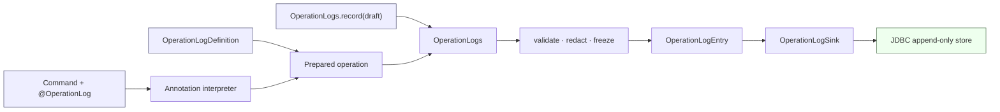

# `aipersimmon-ddd` 通用操作日志组件预研

## 0. 结论先行

建议在 `aipersimmon-ddd` 内 **clean-slate 实现**通用操作日志组件，借鉴参考项目的需求与交互方式，
但不直接依赖、复制或 fork `mzt-biz-log` / `log-record`。

推荐形态是：

1. **显式、类型安全的契约是内核**：与 CQRS 无关的 `OperationLogDefinition<I, R>` 和
   `OperationLogs.record(...)` 是非注解入口。
2. **注解只是 application command 上的元数据**：`@OperationLog` 由现有
   `CommandInterceptor` 解释，最终仍进入同一个 `OperationLogs`、同一个记录模型和同一个存储端口。
3. **业务结果与事务完成态是两个维度**：正常返回的 `SUCCEEDED/REJECTED` 可与业务变更同事务提交；
   因异常而 `ROLLED_BACK/NOT_STARTED` 的 `REJECTED/FAILED` 才在外层用独立事务追加。不能用
   `async=true` 或 `joinTransaction=true` 一类布尔值掩盖这些不同语义。
4. **不提供可变的 `OperationLogContext` / ThreadLocal 变量池**，不开放任意 SpEL、Spring Bean、类型、构造器
   或方法调用。注解只处理安全、有限的属性路径；复杂事实使用类型安全 Definition。
5. **只记录显式允许的业务事实**，同时保存稳定结构化字段与已渲染的文案快照；不默认序列化完整 command、
   result、entity、异常或 before/after 对象。
6. 第一阶段只做三个模块：
   `aipersimmon-ddd-operation-log`、`aipersimmon-ddd-operation-log-cqrs-spring`、
   `aipersimmon-ddd-operation-log-jdbc`。MQ、中心化日志服务、MyBatis-Plus、合规审计能力都不是 MVP。

本报告只研究上述**通用组件**，不依赖任何特定业务示例，也不包含实现代码。方案进入编码前，仍需按仓库流程
补 `CONTEXT.md` 术语、新 ADR、design/spec/plan，并把本报告列出的验收矩阵转成可执行测试。

---

## 1. 目标、假设与非目标

### 1.1 目标

组件需要让使用方以两种方式记录同一种操作日志：

- **注解式**：在 application command 上声明稳定操作码、目标与简单文案模板；
- **非注解式**：用类型安全 Definition 描述复杂的 before/after、业务化变更与 outcome，或在不经过
  `CommandBus` 的 batch、scheduler、CLI 场景直接调用显式 API。

无论入口是哪一种，最终都必须归一到：

```text
OperationLogPlan
  → OperationLogs
  → validate / normalize / redact / freeze
  → OperationLogEntry
  → OperationLogSink
```

### 1.2 前提假设

- 目标运行时是本仓库当前基线：Java 21、Spring Boot 3.5.x、现有 `CommandBus` / `CommandInterceptor`。
- 默认存储是与业务服务同数据源的关系数据库；这使成功日志可以获得本地事务原子性。
- 操作日志主要供产品、客服、运营和业务用户查询，不是聚合状态真相源。
- 允许未来把日志导出到中心平台，但不能因此削弱本地写入的确定性或提前引入消息中间件。
- 注解模板来自编译进应用的代码，不接受用户输入、数据库脚本或配置中心动态脚本。

### 1.3 非目标

- 不做通用技术日志门面，不替代 SLF4J、MDC 或 OpenTelemetry。
- 不把操作日志当领域事件、集成事件或 Process Manager history。
- 不承诺满足安全合规审计、WORM、签名、hash chain、法定留存等要求。
- 不做事件溯源，不允许使用操作日志重建聚合状态。
- 不自动暴露 HTTP 查询接口；鉴权、数据可见性和 API 形态属于消费方 adapter。
- 不在本次预研中修改代码、POM、`CONTEXT.md` 或 accepted decisions。

---

## 2. 先固定术语边界

| 概念 | 本报告定义 | 不等于 |
|---|---|---|
| **Operation Log（操作日志）** | 面向业务阅读者，回答“谁在何时，对哪个业务对象做了什么，结果如何，关键字段怎样变化” | 技术调用日志、领域事件、合规证据 |
| **Audit Log（审计日志）** | 面向安全 / 合规的证据记录，通常需要强身份、追加不可改、访问隔离、防篡改和强制留存 | 普通操作历史表 |
| **Technical Log（技术日志）** | 面向开发与运维的诊断记录，关注调用、异常、性能、SQL 和 trace | 稳定业务语义或完整业务历史 |
| **Domain Event（领域事件）** | 领域中已经发生的事实，可参与业务行为与集成 | 用户可读操作文案；通常缺 actor、失败结果和展示快照 |
| **Operation Outcome（操作结果）** | `SUCCEEDED`、`REJECTED` 或 `FAILED` | 聚合状态、HTTP status、异常类型本身 |
| **Transaction Completion（事务完成态）** | `COMMITTED`、`ROLLED_BACK`、`NOT_STARTED`；说明业务事务是否生效 | Operation Outcome；正常返回也可能是 `REJECTED` |

一条领域事件可以帮助生成操作日志，但不能成为唯一来源：它通常表达“发生了什么”，却不一定知道是谁触发、
用户意图是什么、失败发生在何处、哪些字段允许展示。反过来，操作日志也不得驱动领域行为。

若未来需要合规审计，应建立单独的 Audit Log profile / 组件并另作 ADR，不能通过给普通表加一个
`append-only` 标签就宣称已满足审计要求。

---

## 3. 材料与源码事实

### 3.1 研究快照

| 材料 | 本次使用方式 | 截至 2026-07-23 的事实 |
|---|---|---|
| [美团：如何优雅地记录操作日志](https://tech.meituan.com/2021/09/16/operational-logbook.html) | 原始问题、可读模板、before function、扩展点的设计来源 | 2021 年设计文章，不等于当前代码的生产保证 |
| [阿里云开发者社区文章](https://developer.aliyun.com/article/1747643) | 两个开源实现的二次比较材料 | 2026-07-14 的社区投稿；功能描述必须由源码复核 |
| [掘金文章](https://juejin.cn/post/7473111048968175653) | 场景与设计的二次讲解 | 内容大体沿用美团文章，不是第三套独立实现 |
| 本地 `mzt-biz-log` | 美团方案现存源码样本 | `8d3a02714b52683e49ed83184eb74b9241580cf5`，最近提交 2025-02-28 |
| 本地 `log-record` | 另一套社区实现源码样本 | `19c0a669ee82e005f9b4e564024cdb6a0a552d4a` / v1.7.1，最近提交 2025-07-26 |

`log-record` 的 SCM 指向 `qqxx6661/log-record`，README 也说明其受美团文章启发；它不是阿里巴巴官方组织
维护的仓库。阿里云文章是有价值的二次材料，但“存在重试 / MQ / 事务开关”不能自动推导出 durable、幂等或
原子一致性。

### 3.2 两个实现的真实能力矩阵

| 维度 | `mzt-biz-log` | `log-record` | 对新组件的结论 |
|---|---|---|---|
| 注解入口 | Spring Advisor + `@LogRecord` | Spring AOP + `@OperationLog` | 需求成立，但主入口不应依赖通用方法代理 |
| 非注解入口 | 只能手工构造可变 `LogRecord` 后直调 service；与注解链不对等 | `OperationLogUtil.log(LogRequest)` 静态 API；与注解链不对等 | 两种入口必须在 `OperationLogs` 前归一，而不是只共用末端 sink |
| 框架边界 | annotation、AOP、SpEL、Diff、配置混在 `bizlog-sdk` | 名为 core，实际依赖 Spring Boot AOP、Fastjson、TTL、MQ | framework-free contract 必须重写 |
| 上下文 | `InheritableThreadLocal` 栈 + global map | 一个无嵌套栈的 TTL `StandardEvaluationContext`，另有独立 TTL Diff 列表 | 两者均不符合本仓库“禁 ambient 每命令状态”的 accepted decision |
| 模板 | 完整 SpEL + BeanFactoryResolver + 正则模板 | 完整 SpEL + BeanFactoryResolver；表达式未缓存 | 不开放完整 SpEL；启动期编译受限属性路径 |
| before/after | before function 缓存，但异常后可能退化为 after 重算 | `executeBeforeFunc` 会把整条注解提前求值，无法同时使用旧值和最终结果 | before snapshot 必须是 invocation-local、只执行一次 |
| Diff | `java-object-diff` + 字段注解 | 反射 + Fastjson + TTL 保存原始值 | 结构化、显式 allowlist 的 `OperationChange` 才是事实；自动反射 Diff 只能是可选 adapter |
| operator / tenant | 默认 operator=`111`；tenant 是静态配置且查询未强制过滤 | 只有 operator string，无完整 actor / tenant 语义 | 缺 resolver 时 fail-fast；多租户开启后所有查询必须强制 tenant |
| 事务 | `joinTransaction` 只控制日志异常是否抛出，不创建事务语义 | 默认进程内异步，advisor 顺序与提交点未定义 | 用明确策略和测试定义原子性，不能用一个 boolean |
| 可靠性 | 无内建 durable queue、outbox、DLQ、幂等 | 有线程池、MQ 与内存紧循环重试，但无 durable / 幂等保证 | 默认不使用进程内异步队列；数据库唯一约束收敛重试 |
| 安全 | 原始异常、对象和 Bean 方法可进入模板 | 原始对象、异常、Diff、MQ 日志均缺省无脱敏 | 默认拒绝记录，显式 allowlist + redaction + size limit |
| 查询 | 写 / 查混在 `ILogRecordService`；示例查询无 tenant/limit 保证 | 主要是写入扩展点 | 写端口与读端口分离，cursor pagination |

额外需要校正几个容易从 README / 二次文章误读的点：

- 美团文章使用的是较早的注解名和字段；当前 `mzt-biz-log` 已增加 repeatable annotation、Diff、
  `successCondition`、global context 和 `joinTransaction`。
- 美团文章已经指出 `InheritableThreadLocal` 在线程池中的问题，当前代码仍保留该机制；global map 还要求调用方
  手工清理，`clear()` 只 pop 不 remove，业务抛 `Error` 时会跳过正常清理路径。
- 美团文章把同步 / 异步和事务策略交给 persistence 实现；当前仓库仍没有 durable async。
  `joinTransaction=false` 也不代表独立事务：写入仍可能加入当前 ambient transaction，只是日志异常被吞掉。
- 两个项目的模板主要来自编译期注解，当前远程输入直接注入表达式的攻击面较低；现实风险首先是 Bean / 方法副作用、
  隐藏 I/O 与敏感数据泄漏。如果未来把模板外置到数据库或配置中心，风险才会升级为动态代码执行面。

### 3.3 值得保留的思想

- 文案必须表达业务语义，而不是“某个 Java 方法执行成功”。
- 操作要绑定稳定的 `operationCode` 和业务目标，而不是类名 / 方法名。
- before 与 after 是两个不同捕获阶段。
- operator、模板渲染、存储应有替换点。
- 成功、失败、条件记录、多条业务变化是真实需求。
- 历史文案应保存渲染快照，避免模板升级后历史含义漂移。

### 3.4 必须替换的实现方式

- 通用 Spring method AOP 作为唯一入口；
- `ThreadLocal` / TTL / global map 变量上下文；
- 静态 Spring context lookup 和静态 `OperationLogUtil`；
- unrestricted SpEL、`@bean`、`T(...)`、构造器和任意方法调用；
- mutable DTO、完整对象 `toString()` / JSON、原始异常消息；
- 默认线程池、进程内重试、没有幂等键的 MQ 发送；
- 含糊的 `joinTransaction` / `async` 开关；
- 写入与查询混合在一个 service；
- 把自动反射 Diff 当作核心业务事实。

### 3.5 参考需求到新机制的追踪

| 参考能力 | 它背后的真实需求 | 新组件的承接方式 |
|---|---|---|
| `condition` | 某些结果不值得产生操作日志 | Definition 类型化返回“无记录”；注解 MVP 不开放通用条件表达式 |
| `successCondition` | 正常返回也可能是业务拒绝 | 类型化 outcome classifier；`REJECTED + COMMITTED` 与异常回滚分开 |
| before function | 修改前读取旧状态，且每次调用只读一次 | 成功 interceptor 事务内的 typed before projector + invocation-local frame |
| ID-to-label function | 把 opaque id 翻译成人类可读名称 | Definition 注入 application read port / value projector，并在局部 frame 内 memoize |
| context variable | 让方法体补充模板事实 | Definition 返回 immutable projection；不提供 ambient variable map |
| Diff | 展示经过筛选的前后变化 | 显式 `OperationChange`；反射 Diff 延后为 opt-in adapter |
| repeatable annotation | 一次调用可能想产生多条记录 | v1 每 command 一条主记录；多记录待定义原子 `appendAll` 后再议 |
| `subType` | 同一事实可能面向不同受众 / 视图 | v1 由消费方基于 operation code 做授权投影，不持久化任意 subtype 字符串 |
| operator | 记录可信操作者快照 | trusted actor resolver 或显式 actor；缺失时条件性 fail-fast |
| tenant | 隔离写入、唯一键与查询 | trusted tenant resolver / explicit invocation scope，全链路强制 tenant |
| record/query extension | 可替换写入与读取 | `OperationLogSink` 与 `OperationLogReader` 分离；reader 实现不阻塞 write-path MVP |

多目标关联同样是有效需求，但 v1 明确只支持一个 primary target。不能为了让一条记录出现在多个 target 历史中而
复制 entry；`relatedTargets` 或 `operationGroupId + appendAll` 需要有实际查询场景后另作决策。

---

## 4. DDD 定位与依赖方向

### 4.1 它是 application 横切能力，不是 domain building block

每个 Bounded Context 仍然拥有以下语义：

- 哪个用例值得记录；
- 稳定的 `operationCode`；
- actor 与 target 的业务含义；
- 哪些字段可以展示、需要怎样脱敏；
- 什么叫 `SUCCEEDED` / `REJECTED` / `FAILED`；
- 哪些变更对用户可读。

通用组件只拥有：捕获流程、校验、标准模型、模板、脱敏、幂等、事务协调、持久化和查询端口。
消费方 domain module 不应依赖 operation-log；注解和 Definition 放在 application command / use-case 边界。

### 4.2 与当前 accepted decisions 的关系

| 现有决策 | 对本组件的约束 |
|---|---|
| `decision-00010` | 日志等横切关注点由 `CommandBus + CommandInterceptor` 提供，不在 handler 内重复散落 |
| `decision-00011` | 类型化行为契约继续用接口；`@OperationLog` 只能是叠加属性元数据，不能替代 `Command<R>` |
| `decision-00012` | 禁止自建 ThreadLocal / ambient 每命令状态；invocation state 必须是局部、显式对象 |
| `decision-00013` | 直接读取显式 `CommandContext` 的 `messageId/correlationId/causationId`；不把元数据塞进 command payload |
| `decision-00014` | Operation Log 不是 Integration Event，不偷用 CloudEvents published language |
| `design-00005` | trace 由 OpenTelemetry context 管理；不重新给业务模型增加自造 `traceId` |

### 4.3 推荐模块

```text
aipersimmon-ddd-operation-log                      (framework-free、CQRS-free)
  ├─ immutable model
  ├─ OperationLogDefinition<I, R> lifecycle
  ├─ OperationLogs
  ├─ OperationLogSink / OperationLogReader ports
  └─ @OperationLog metadata

aipersimmon-ddd-operation-log-cqrs-spring          (CQRS + Spring adapter)
  ├─ CommandInterceptor integration
  ├─ CommandContext → OperationLogInvocation mapping
  ├─ annotation metadata compiler
  ├─ restricted template renderer
  ├─ actor / tenant resolvers
  ├─ transaction coordination
  └─ auto-configuration and startup validation

aipersimmon-ddd-operation-log-jdbc            (outbound adapter)
  ├─ append-only JDBC sink
  ├─ query adapter（P3）
  ├─ H2 / MySQL / PostgreSQL migrations
  └─ unique constraints and indexes
```

核心 Definition 不引用 `Command` 或 `CommandContext`；CQRS adapter 将 command 与显式 causality 映射成通用
`OperationLogInvocation`。因此“通用组件”不等于“CQRS-only”，而当前推荐的自动捕获方式仍可以复用现有 command pipeline。

第一阶段不单独拆 starter：`-cqrs-spring` 可以遵循本仓库现有 Spring 模块的装配方式；只有自动装配与运行时代码
产生真实依赖冲突时再拆。MyBatis-Plus、MQ exporter 和 test-support 也在出现第二个实现需求后再增加。



---

## 5. 统一模型与核心端口

### 5.1 `OperationLogEntry`

推荐不可变 entry 至少包含：

| 字段 | 语义 / 约束 |
|---|---|
| `recordId` | 已追加记录的 identity；duplicate 时返回既有 `recordId`，不兼任业务操作 id |
| `source` | 必填、稳定的逻辑 producer / Bounded Context 标识；不使用部署实例名 |
| `idempotencyKey` | 同一个 `resultKind = outcome + completion` 追加的去重键；在同一 tenant/source 内唯一 |
| `operationCode` | 使用方拥有的稳定业务语义码，不使用 Java FQCN / 方法名 |
| `tenantId` | 可选多租户维度；未启用时规范化为固定 `GLOBAL`，数据库不使用 `NULL` 表示全局 |
| `actor` | `actorType/id/displayName` 的当时快照；displayName 必须经过脱敏策略 |
| `target` | `targetType/id/displayName`；一条记录只有一个主目标；敏感自然标识要换稳定 surrogate id |
| `outcome` | `SUCCEEDED` / `REJECTED` / `FAILED` |
| `completion` | `COMMITTED` / `ROLLED_BACK` / `NOT_STARTED` / `UNKNOWN`；与 outcome 正交 |
| `summary` | 已渲染、已清洗、长度受限的人类可读文案快照 |
| `changes` | 有序的 `OperationChange(field, label, before, after)`；值已冻结和脱敏 |
| `details` | 有界的 `OperationDetail(name, value)` 列表；不是任意 metadata map |
| `failure` | 可选的稳定 `failureCode/category/safeSummary`；无 stack trace 和原始异常正文 |
| `occurredAt/recordedAt` | 操作发生时间与组件持久化时间 |
| `causality` | `messageId/correlationId/causationId`；CQRS adapter 从显式 `CommandContext` 映射 |
| `templateKey/version` | 可选；说明文案来自哪个模板版本 |
| `schemaVersion` | entry 结构版本，用于将来迁移 / 导出 |

不把 `requestId`、`traceId` 重新塞进核心模型。同步排障通过当前 OTel span 与结构化技术日志关联；若需要把
`recordId` 写入 span，只写低风险关联值，不把 actor、target、summary、changes 作为 metric label。

### 5.2 核心接口

以下是职责草图，不是已经批准的 API。关键是把生命周期说清，而不是提前锁定方法名：

```java
public interface OperationLogDefinition<I, R> {
  PreparedOperationLog<R> prepare(I input, OperationLogInvocation invocation);
  Optional<OperationLogDraft> failed(
      I input, OperationLogInvocation invocation, ClassifiedFailure failure);
}

public interface PreparedOperationLog<R> {
  Optional<OperationLogDraft> complete(R result); // SUCCEEDED, committed REJECTED, or no log
}

public interface OperationLogs {
  RecordResult record(OperationLogDraft draft);
}

public interface OperationLogSink {
  AppendResult append(OperationLogEntry entry);
}

public interface OperationLogReader {
  OperationLogPage find(OperationLogCriteria criteria, OperationLogCursor cursor);
}
```

职责约束：

- `OperationLogs` 是面向业务代码的显式入口，负责规范化、补充时间 / ID、校验、脱敏和 freeze；
- `OperationLogSink` 只是出站写端口，不是业务 API；
- `prepare(...)` 在业务调用前捕获一次 allowlisted before projection，并返回只属于本次调用的 local prepared object；
  `complete(result)` 在正常返回后形成 `SUCCEEDED` 或正常返回但业务拒绝的 `REJECTED`；
- 异常 / 校验 / commit failure 路径在业务事务外只调用 `failed(...)`。它只能读取 input、显式 invocation 与
  sanitized failure，不能隐式重做复杂 before 查询，也不复用成功 frame；
- 注解编译结果与代码式 Definition 都遵循同一 lifecycle，不能绕过 `OperationLogs` 直写 sink；
- 每个 input type 最多匹配一个 Definition；显式 Definition 与注解同时存在、重复 Definition 或无法确定泛型类型，
  均在启动时 fail-fast，避免双写或隐式优先级；
- v1 一次调用只产生一条 entry；若以后支持多条，sink 必须提供原子 `appendAll`，不能逐条部分成功；
- `RecordResult` 至少区分 `APPENDED(recordId)` 与 `DUPLICATE(existingRecordId)`；
- `OperationLogReader` 与写端口分离；查询 criteria 必须有 tenant 和有界时间 / target 条件；
- `Clock` 和 ID supplier 用构造注入的 JDK 接口即可，不为每个单用途依赖都制造新 port。

`OperationLogInvocation` 是 core 中的 immutable typed value，只包含可信 `source/tenant/actor`、causality 与时间，
不是任意 key-value context。CQRS adapter 从 `CommandContext` 和 resolver 构造它；direct API 由可信调用边界显式构造。

### 5.3 actor 与 tenant

- 核心显式 API 使用由可信边界创建的 `OperationLogInvocation`，其中包含不可变 actor 与 tenant；不能缺省成
  硬编码用户，也不能让普通业务参数伪造其他 tenant。
- CQRS adapter 通过注入的 `OperationActorResolver` / `OperationTenantResolver` 创建 invocation-local snapshot。
  outer failure interceptor 在调用业务前冻结自己的最小 failure snapshot；completed interceptor 独立创建 success
  snapshot。resolver 必须无状态、无 I/O、无副作用；两层不共享 mutable state。仅当发现需要自动解析的注解 /
  Definition 且 resolver 缺失时启动失败；只使用 direct API 的应用不受影响。
- scheduler / batch / message 驱动必须显式使用 `SYSTEM` / `SERVICE` actor type。
- 不在本次方案中给 `CommandContext` 增加 actor 或 tenant，也不添加任意 metadata map。
- 若将来必须跨异步边界传播“原始操作者”，需要单独 ADR 定义有类型、有信任边界的 identity envelope；
  不能靠 ThreadLocal 或复用任意消息 header。
- 多租户开启后，写入、唯一键和所有读取都必须包含可信 tenant；只有明确的非多租户模式才规范化为 `GLOBAL`。
  禁止“写了 tenant、查询忘记过滤”。

---

## 6. 两种入口如何工作

### 6.1 注解式：以 Command 类型为主，不以通用 method AOP 为主

推荐把注解放在 application command record / class 上：

```java
@OperationLog(
    code = "resource.attribute.update",
    targetType = "Resource",
    targetId = "${input.resourceId}",
    success = "将属性修改为「${input.newValue}」")
record UpdateResourceAttribute(String resourceId, String newValue) implements Command<Void> {}
```

这是属性元数据，不替代 `Command<Void>` 的类型化契约，符合 `decision-00011`。现有 `RegistryCommandBus`
保证命令经过有序 interceptor 链，因此比通用 Spring proxy 更适合作为 DDD 组件的标准捕获点：

- self-invocation 不会绕过；
- controller / application service / handler 不会重复记录；
- 所有 command dispatch 共享相同的 causality 与事务次序；
- 测试派发、同步根命令、由上游消息引发的命令走同一条链；
- 注解位置明确属于 application，而不是 controller、domain 或 repository。

注解 MVP 只允许表达：稳定 code、主 target、安全属性路径的 success/failure 文案，以及是否记录失败。
需要 repository 读取、复杂条件、领域化 Diff 或特殊脱敏时，必须使用 Definition。

不建议在 MVP 支持 repeatable annotation。一个 command 只产生一条主操作日志；多记录只有在定义了原子
`appendAll`、group identity 和部分失败语义后才重开。这样避免重复注解的相等去重、声明顺序和批量部分成功。

### 6.2 非注解式标准入口：`OperationLogDefinition<I, R>`

Definition 是复杂 command 的规范入口，可通过普通构造注入使用 application read port，显式完成：

- before projection；
- outcome 归类；
- after projection / result 映射；
- `OperationChange`；
- 业务化文案；
- 字段级 redaction；
- 正常返回时把 result 类型化归类为 `SUCCEEDED` 或 `REJECTED`。

Definition 不能把完整 aggregate 或 mutable entity 交给 `OperationLogs`。它只能返回冻结前仍有边界的 draft /
projection，并由 `OperationLogs` 统一校验、脱敏、freeze。

### 6.3 非 `CommandBus` 场景：`OperationLogs.record(...)`

batch、scheduler、CLI 或运维动作可以直接调用显式 API。调用者必须明确传入：

- actor；
- 可信 tenant / source；
- target 与 operation code；
- outcome；
- 已知的 transaction completion；无法证明时必须标 `UNKNOWN`，不得伪装原子性；
- 若调用会重试，稳定 `idempotencyKey`；
- 安全的 summary / changes。

不提供静态 util，不从 SpringContext 查 bean。使用方正常依赖注入 `OperationLogs`。

direct API 只负责“在这个调用点追加 draft”，不包裹任意业务动作，也不自动捕获异常：

- 当前存在受支持的本地事务时，JDBC sink 加入该事务；调用方在业务事务内记录，才能得到原子性；
- 没有业务事务时，append 只对日志自身提交负责，`completion=UNKNOWN`，不能宣称 fail-closed；
- 需要自动 outcome 捕获和成功 / 失败事务协调的非注解 Command，应注册 Definition 并走两个 interceptor；
- 若未来要给完全非 CQRS 的业务动作提供同等 around 语义，应新增显式 executor adapter，不把魔法藏进 `record()`。

### 6.4 方法注解为何不是 MVP 主入口

通用 `@Around` 方法 AOP 会引入 self-invocation、public/final/private、代理类型、advisor 顺序、异步返回完成态和
重复记录等边界。Spring 官方也明确说明 proxy self-invocation 会绕过 advice。

如果将来出现“不使用本库 CQRS，但仍必须注解 application service 方法”的已验证需求，可以增加独立的
`operation-log-method-spring` adapter，并在名称和文档上显式暴露这些限制；它仍必须调用相同 `OperationLogs`，不能成为
第二套模型。本分析不建议现在为假设用例提前实现。

---

## 7. 调用帧、before/after 与模板安全

### 7.1 不使用 ambient context

成功与异常路径各自只使用普通局部对象，不跨 interceptor 共享 frame：

```text
正常返回路径（事务内）
  compile/locate Definition once
  → resolve actor/tenant once
  → create local prepared operation
  → capture allowlisted before projection once
  → invoke handler
  → complete with result
  → classify SUCCEEDED or committed REJECTED
  → render summary and changes
  → build immutable entry
  → append before commit

异常 / commit failure 路径
  outer interceptor 在调用业务前冻结 minimal failure invocation
  → catch classified failure after rollback or before transaction start
  → reuse only that immutable input/context/actor/tenant snapshot
  → build minimal REJECTED or FAILED entry
  → append in independent transaction
  → rethrow original failure
```

失败路径不读取、复用或重建成功 prepared object，也不隐式执行 before projector。嵌套 command 各自拥有独立
local object，不共享 map，不需要 push/pop，不存在 clear 顺序或线程池传播问题。

### 7.2 模板策略

优先实现小型 property-path template grammar，而不是完整 SpEL：

- 只暴露 `input`、`resultProjection`、`failure`、`actor`、`before`、`after`、`context`；其中 result / before /
  after 都必须是 Definition 或 adapter 构造的 immutable allowlist projection，不能直接暴露任意 handler result / entity；
- 只允许 null-safe 的只读属性路径和极少量纯函数，如 `mask`、`truncate`、`defaultValue`；
- 禁止 bean lookup、`T(...)`、构造器、任意方法、反射、文件 / 网络访问；
- 应用启动时扫描、编译和验证所有注解模板；错误直接阻止启动；
- metadata / template 使用有界 cache，执行期不重复 parse；
- getter 也可能有副作用，所以允许的根对象必须是专用 immutable projection，而不是任意 entity；
- 设置单字段、集合元素数、changes 数量、summary 和总 payload 上限。

若实现成本要求复用 Spring SpEL，最低边界是只读 `SimpleEvaluationContext`，显式移除 method、type、constructor、
bean resolver；仍需启动期验证。不得复制参考仓库的 `StandardEvaluationContext + BeanFactoryResolver`。

### 7.3 Diff 策略

`OperationChange` 是结构化事实，summary 只是其展示快照：

```text
field: "attribute"
label: "属性"
before: "before"
after: "after"
```

默认只接受 Definition 显式列出的字段。反射对象 Diff 不是 MVP；若后续提供 convenience adapter，也必须：

- opt-in 字段 allowlist；
- 先冻结与脱敏，再形成 entry；
- 对集合声明 identity 与排序；
- 有深度、节点数、时间与 payload 预算；
- 任何部分失败都可观测，不能静默生成不完整 Diff。

---

## 8. 事务、失败语义与可靠性

### 8.1 不能被同时满足的三个目标

普通本地事务无法同时保证：

1. 成功日志与业务数据原子提交；
2. 业务回滚后仍保存失败尝试；
3. 任意进程崩溃点下所有尝试零丢失。

因此必须把**业务 outcome** 与**事务 completion** 分开，不能用一个 `joinTransaction` 开关伪装。至少存在：

| 业务 outcome | 事务 completion | 典型含义 |
|---|---|---|
| `SUCCEEDED` | `COMMITTED` | 正常完成并提交 |
| `REJECTED` | `COMMITTED` | 方法正常返回，但业务结果是拒绝，并提交了这个结果 |
| `REJECTED` | `NOT_STARTED` / `ROLLED_BACK` | validation / authorization / 预期规则异常阻止变更 |
| `FAILED` | `ROLLED_BACK` | handler、日志 append 或 commit 的技术失败，业务未提交 |

### 8.2 推荐的 v1 语义

| 路径 | 推荐语义 | 结果 |
|---|---|---|
| 正常返回的 `SUCCEEDED/REJECTED` | JDBC sink 与业务使用同 datasource / transaction；日志在事务内 append | 业务与日志一起提交 / 回滚；日志失败使业务回滚（fail-closed） |
| 异常路径的 `REJECTED/FAILED` | 外层 interceptor 在业务事务结束并回滚后，或 transaction 未开始时，以独立事务追加 | 未提交结果可保留；记录失败不替换原业务异常，但必须 metric + alert |
| 中心化导出 | 本地 durable row 提交后再经专属 exporter / CDC / outbox at-least-once 导出 | 远端按稳定 `recordId` 幂等；不把远端调用放业务事务内 |
| after-commit best effort | 只允许显式弱一致 profile | commit 与 callback 之间崩溃会丢；不得标成可靠操作历史 |

当前 interceptor 链中，order 越小越外层，事务 interceptor 的 order 是 200。一个可落地候选是：

- `FailedOperationLogInterceptor` 放在 validation / transaction 外层，定位 operation metadata，但不执行复杂 before；
  捕获已归类异常后，用 input + explicit invocation + sanitized failure 创建最小 `REJECTED/FAILED`，在独立事务写入，
  随后重新抛原异常；
- `CompletedOperationLogInterceptor` 放在 transaction 内、handler 外层；它独立执行 Definition 的
  `prepare → handler → complete`，正常返回后、事务提交前追加 `SUCCEEDED` 或 committed `REJECTED`；append 失败
  使本次业务事务回滚；
- commit failure 发生在 completed interceptor 返回之后，由外层 failure interceptor 观察并记录
  `FAILED + ROLLED_BACK`；validation rejection 则是 `REJECTED + NOT_STARTED`。

两个 interceptor 可各自创建 immutable actor/tenant snapshot，但只共享可重复读取的 compiled metadata；它们不共享
ThreadLocal frame，也不重复 business projector / repository 查询。`OperationLogSink` 对事务无感，只加入当前事务；
`REQUIRES_NEW` 由 Spring transaction coordinator 负责，不能藏在 sink 或 boolean 参数里。具体 order 数值、
异常分类和异常优先级必须由 ADR + 集成测试拍板。

### 8.3 失败日志也有崩溃窗口

进程可能在业务回滚完成后、独立失败日志提交前崩溃。普通 Operation Log v1 应诚实记录这一限制。

若需求升级为“每一次尝试都不能丢”，需要：先用独立事务落 `PENDING attempt`，再执行业务，最后追加完成结果，
并处理长期悬挂的 `PENDING`。这增加前置 I/O、恢复任务和更强身份语义，属于 Audit Log profile，不应塞进 MVP。

### 8.4 幂等与重试

- 注解 / Definition 路径默认从 `CommandContext.messageId + operationCode + outcome + completion` 推导
  `idempotencyKey`，数据库再以 tenant/source 隔离。同一 result kind 的重投得到相同 append identity。
- outcome 与 completion 都必须进入 append identity：同一 durable command 第一次 `FAILED + ROLLED_BACK`、重投后
  `SUCCEEDED + COMMITTED` 时保留两条真实结果；`REJECTED + NOT_STARTED` 后重投为 `REJECTED + COMMITTED`
  也不会被吞掉。只有完全相同的 result kind 才收敛。
- `recordId` 是已落 entry 的 identity；duplicate 必须返回既有 `recordId`，不要让调用方把 duplicate 当新记录。
- 显式 API 若可能重试，必须由调用者提供稳定 key；不能每次随机生成后声称已幂等。
- 数据库以 `(tenant_id, source, idempotency_key)` unique constraint 收敛竞争；duplicate 视为幂等成功并打指标。
- 新的 root command / 客户端重试通常有新 messageId，组件无法自动判断它是不是同一次用户意图；若需要跨请求去重，
  调用方必须提供可信的业务 request key。
- 组件只消除日志重复，不代替业务命令自身的幂等控制。
- 不承诺跨服务全局总序。`(occurred_at, record_id)` 只保证确定性分页，不等于数据库提交顺序；若真实 UI 用例要求
  本地严格顺序，再增加数据库生成的 monotonic sequence。如未来异步导出，只承诺同 target 分区内顺序。

### 8.5 不默认使用进程内异步

固定线程池、内存队列和紧循环 retry 不是 durable 能力。若未来提供异步 exporter，至少需要：容量、背压、
持久化状态、指数退避与 jitter、lease / fencing、优雅停机、DLT、backlog age 与幂等消费。没有这些能力时，
同步本地 append 更简单也更可靠。

---

## 9. 存储、查询、安全与可观测性

### 9.1 JDBC 存储约束

`operation_log` 概念表应满足：

- 普通业务写路径 append-only；correction 通过新记录表达，但受控 retention、隐私删除 / 匿名化或 crypto-shred
  必须能真正移除旧敏感值，并留下独立治理审计，不能只追加一条 redaction row；
- `record_id` primary key；`(tenant_id, source, idempotency_key)` unique；
- 主查询索引：`(tenant_id, target_type, target_id, occurred_at, record_id)`；
- 辅助索引按真实查询增加：actor、operation code、outcome、correlation id；
- JSON 仅保存有界 `changes/details`，不保存整个 input/result/entity；
- H2 / MySQL / PostgreSQL migration 和约束语义一致；
- cursor pagination，禁止无界 list；
- retention、partition、归档与删除策略由使用方配置；普通操作日志不能以“永不删除”违反隐私要求。

### 9.2 隐私与输入安全

- 默认没有字段可记录，消费方逐项 allowlist；
- password、token、secret、私钥、身份凭据、生物信息永不进入 entry；
- 邮箱、手机号、display name 和业务 target id 视场景掩码；
- summary / label / value 在入库前去除 CR/LF 等日志注入字符；
- 原始异常 message、SQL、stack trace、HTTP body、第三方响应不进入 Operation Log；
- failure 只保存稳定 code、category 与安全摘要；排障信息留在受访问控制的 Technical Log / trace；
- 查询授权和 tenant isolation 由应用 adapter 强制，toolkit 不自动开放 controller。

### 9.3 可观测性

至少提供：

- append attempt / success / failure / duplicate；
- render / redact / append latency；
- independent failure-record loss；
- query latency；
- exporter backlog / retry / dead-letter（仅有 exporter 时）。

metric label 只放低基数 `operationCode`（仍需有基数预算）、outcome 和 sink type；不得放 actor id、target id、
summary 或 change value。技术日志可用 `recordId + correlationId` 关联。trace / span identity 继续由 OpenTelemetry
ambient context 管理，但该 ambient context 只属于 observability，不是组件的业务状态容器。

---

## 10. 方案比较与推荐

| 方案 | 优点 | 关键问题 | 结论 |
|---|---|---|---|
| 直接使用 `mzt-biz-log` | 功能覆盖较广、已有使用样例、沿用文章交互模型 | Spring 2.x 时代耦合、ambient context、开放 SpEL、事务 / tenant / 幂等语义不足 | 不采用 |
| 直接使用 `log-record` | 有静态显式 API、MQ、retry、Boot 3 starter | core 不纯、显式与注解不对等、默认内存异步、无 durable / 原子保证、开放 SpEL | 不采用 |
| fork 后大改 | 初期看似节省 annotation / template 代码 | 需推翻运行模型与模块边界；继承兼容负担，改造量接近重写 | 不采用 |
| 通用 method AOP 新写 | 接近参考项目，非 CQRS 应用也可用 | 与现有 CommandBus 重复，proxy 和事务边界复杂 | 不作为 MVP；未来独立 adapter |
| **CommandInterceptor + framework-free core + JDBC** | 契合现有 DDD/CQRS 决策，显式上下文、事务可测、两入口统一 | 需新写安全模板、模型与 JDBC adapter | **推荐** |

推荐不是“为了不同而重写”，而是因为需要保留的部分主要是需求模型；两个参考实现的运行时核心——AOP、ambient
state、开放表达式、事务和 delivery 语义——恰好都是本项目不能继承的部分。

---

## 11. 分阶段落地

### P0：决策与契约

1. 本 analysis 完成 review 并转 active。
2. 在 `CONTEXT.md` 增加 Operation Log / Audit Log / Operation Outcome 等 glossary。
3. 新 ADR 拍板 §12 的决策项。
4. 形成 active design/spec/plan 后才编码。

完成标准：术语无歧义；模块依赖无环；成功、失败和导出的一致性不再由 boolean 隐含。

### P1：非注解 Command 闭环 + direct API + JDBC

- immutable entry / draft / actor / target / outcome / changes / failure / causality；
- `OperationLogDefinition` lifecycle / registry、`OperationLogs`、sink；
- CQRS/Spring 两个 interceptor、failure classifier、actor / tenant resolver 和事务协调；
- JDBC 三方言 migration、append 与唯一约束；
- 正常返回结果同事务 append、异常结果独立事务 append；
- redaction、尺寸限制、幂等与指标；
- 一个不依赖业务样例的最小 consumer fixture。

完成标准：不使用注解的 Definition command 路径能捕获正常、拒绝、失败并通过事务 / 幂等测试；direct API 的
调用点事务责任有测试和文档，但不冒充自动 outcome capture。

### P2：Command 注解入口

- `@OperationLog` metadata；
- annotation compiler 与受限模板；
- 编译为与代码式 Definition 相同的 lifecycle；
- annotation / Definition 冲突与 resolver 缺失的条件性启动校验；
- ArchUnit：domain 不依赖 operation-log；注解只用于 application `Command`；
- 等价简单用例的注解与 Definition 经过同一 normalize / redact / freeze pipeline。

### P3：有真实需求后再增强

- retention / partition / health；
- `OperationLogReader`、cursor query、查询授权示例与 query metrics；
- method annotation adapter；
- MyBatis-Plus adapter；
- 中心平台 exporter / CDC / dedicated outbox；
- 单独的 Audit Log profile。

---

## 12. 编码前必须通过 ADR 拍板的问题

1. Operation Log 与 Audit Log 的边界，以及 outcome 与 transaction completion 的正交模型。
2. v1 的三个模块和依赖方向；core 保持 CQRS-free。
3. 注解只放 `Command` 类型、由 `CommandInterceptor` 解释；method AOP 不进 MVP。
4. Definition 的 `prepare/complete/failed` 生命周期、成功 / 失败 interceptor 不共享状态，以及注解与 Definition
   冲突时启动失败。
5. direct API 只记录调用点 draft，它的事务责任和自动 outcome capture 明确分离。
6. 是否要求业务 datasource 与 operation-log datasource 相同；不同时采用何种 durable staging。
7. property-path 模板语法、启动期校验、纯函数白名单和尺寸预算。
8. privacy 默认拒绝、failure 清洗、retention / tenant 强制策略。
9. `recordId` / result-kind-aware `idempotencyKey` 生成规则、重投后的结果演进，以及 duplicate 返回既有 id。
10. 正常结果同事务 fail-closed；异常结果独立事务且不覆盖原业务异常；sink 与 Spring transaction coordinator
    的职责边界。
11. actor / tenant resolver 的条件启用、可信来源和异步显式输入；不扩展 `CommandContext`。
12. v1 每调用只写一条；多记录必须先定义 group identity 与原子 `appendAll`。
13. v1 不复用 Integration Event outbox、不提供进程内异步队列、不承诺合规审计。

---

## 13. 实现验收矩阵

| 场景 | 必须证明 |
|---|---|
| 注解成功 | 恰好一条 `SUCCEEDED`；actor/target/code/causality 正确 |
| Definition 成功 | 与等价注解经过同一 normalize/redact/freeze pipeline |
| direct API | 非 CommandBus 场景可显式记录；有 / 无当前事务的 completion 与保证如实表达 |
| 业务提交 | 业务行与成功日志一起存在 |
| 业务回滚 | 不存在虚假的 `SUCCEEDED` |
| 正常返回的业务拒绝 | 业务事务和 `REJECTED + COMMITTED` 一起提交 |
| validation / handler 预期拒绝 | `NOT_STARTED/ROLLED_BACK`；独立 `REJECTED` 存在 |
| handler / commit 技术失败 | 成功日志一起回滚；独立 `FAILED` 存在 |
| success sink 失败 | 业务事务回滚，异常契约稳定 |
| failure sink 失败 | 原业务异常不被替换；failure-loss metric / alert 可见 |
| 同 outcome + completion 重投 | 相同 append identity 不产生第二条记录，并返回既有 recordId |
| 失败后重投成功 | 同一 message 保留一条收敛的 `FAILED` 和一条收敛的 `SUCCEEDED` |
| 并发重复 | unique constraint 收敛，duplicate 被当作幂等成功 |
| nested command | frame 不串，父子 causality 正确，无 ThreadLocal |
| before/after | before 每 invocation 只执行一次，只输出 allowlist 的实际变化 |
| 表达式攻击 | bean、type、constructor、method、未知 root 在启动期失败 |
| 隐私 | secret / token / 原始 exception / stack / 完整对象不落库 |
| 尺寸预算 | 超长 summary、集合、changes、details 按明确策略拒绝或截断并可观测 |
| tenant | 无跨 tenant 查询，唯一键和索引均包含 tenant |
| actor / tenant | 仅启用自动入口时 resolver 缺失才 fail-fast；system actor 明确，tenant 不可伪造 |
| async result | v1 明确拒绝或正确等待完成态，不能把“返回 Future”当成功 |
| 三方言 | H2 / MySQL / PostgreSQL migration、唯一约束、分页排序一致 |
| ArchUnit | domain 不依赖 operation-log；注解只在 application Command |
| 可观测性 | 无高基数 metric；recordId/correlationId 可关联技术日志与 span |
| 质量门 | 按 `TESTING.md` 执行覆盖率、静态分析、mutation 和集成测试门槛 |

---

## 14. 子代理交叉评审与共识

本报告采用三路独立分析：

- 对 `log-record` 做逐调用链、事务、异步、表达式、安全与显式 API 审计；
- 对 `mzt-biz-log` 做逐调用链、上下文、Diff、tenant、持久化与文章差异审计；
- 对当前 `aipersimmon-ddd` 的 CommandBus、accepted decisions、模块依赖和事务落点做独立 DDD review。

第一轮交叉复核发现并修正了：Definition 生命周期不完整、core 隐式绑定 CQRS、正常 `REJECTED` 与回滚失败混淆、
双 interceptor 无状态协作未闭合、direct API 原子性表述过度、tenant/source 不完整、幂等会吞掉失败后的成功、
多记录与受众需求未明确取舍等问题。

第二轮逐项复核后，又统一了通用 template root，并把 append identity 从仅 outcome 修正为
`outcome + completion`。三路最终共识是：

1. 借鉴“业务可读模板 + before/after + 扩展端口”，不复用两个项目的运行时核心；
2. framework-free 显式 API 是唯一内核，注解只能是薄 adapter；
3. 在本项目中以 CommandInterceptor 为注解标准入口，比通用 Spring method AOP 更正确；
4. 禁止 ThreadLocal / TTL 变量上下文和 unrestricted SpEL；
5. 正常结果记录必须有同事务语义，异常结果必须承认独立事务及崩溃窗口；
6. 幂等、隐私、tenant、表达式安全和失败异常优先级都是进入实现前的阻断项；
7. `mzt-biz-log` 与 `log-record` 只能作为需求样本和反例库，不能作为代码基座。

最终复核结论：三个子代理均同意本报告转为 `active`，无遗留阻断分歧。仍需拍板的 trade-off 已集中在 §12，
它们是后续 ADR 的职责，不在 analysis 中伪装成 accepted decision。

---

## 15. Sources

### 外部资料

- 美团技术团队：<https://tech.meituan.com/2021/09/16/operational-logbook.html>
- 阿里云开发者社区：<https://developer.aliyun.com/article/1747643>
- 掘金：<https://juejin.cn/post/7473111048968175653>
- Spring Framework，SpEL EvaluationContext：
  <https://docs.spring.io/spring-framework/reference/core/expressions/evaluation.html>
- Spring Framework，proxying / self invocation：
  <https://docs.spring.io/spring-framework/reference/core/aop/proxying.html>
- Spring Framework，transaction-bound events：
  <https://docs.spring.io/spring-framework/reference/data-access/transaction/event.html>
- OWASP Logging Cheat Sheet：<https://cheatsheetseries.owasp.org/cheatsheets/Logging_Cheat_Sheet.html>
- OWASP Business Logic Security Cheat Sheet：
  <https://cheatsheetseries.owasp.org/cheatsheets/Business_Logic_Security_Cheat_Sheet.html>
- OpenTelemetry Logs：<https://opentelemetry.io/docs/specs/otel/logs/>

### 本地参考源码（本次固定快照）

- `/Users/ryan/GitHubProjects/ryan-alexander-zhang/mzt-biz-log`
  (`8d3a02714b52683e49ed83184eb74b9241580cf5`)
- `/Users/ryan/GitHubProjects/ryan-alexander-zhang/log-record`
  (`19c0a669ee82e005f9b4e564024cdb6a0a552d4a`)
- `mzt-biz-log` 注解主链：
  <https://github.com/mouzt/mzt-biz-log/blob/8d3a02714b52683e49ed83184eb74b9241580cf5/bizlog-sdk/src/main/java/com/mzt/logapi/starter/support/aop/LogRecordInterceptor.java>
- `mzt-biz-log` context：
  <https://github.com/mouzt/mzt-biz-log/blob/8d3a02714b52683e49ed83184eb74b9241580cf5/bizlog-sdk/src/main/java/com/mzt/logapi/context/LogRecordContext.java>
- `mzt-biz-log` template parser：
  <https://github.com/mouzt/mzt-biz-log/blob/8d3a02714b52683e49ed83184eb74b9241580cf5/bizlog-sdk/src/main/java/com/mzt/logapi/starter/support/parse/LogRecordValueParser.java>
- `log-record` release：<https://github.com/qqxx6661/log-record/releases/tag/v1.7.1>
- `log-record` annotation aspect：
  <https://github.com/qqxx6661/log-record/blob/19c0a669ee82e005f9b4e564024cdb6a0a552d4a/log-record-core/src/main/java/cn/monitor4all/logRecord/aop/SystemLogAspect.java>
- `log-record` explicit util：
  <https://github.com/qqxx6661/log-record/blob/19c0a669ee82e005f9b4e564024cdb6a0a552d4a/log-record-core/src/main/java/cn/monitor4all/logRecord/util/OperationLogUtil.java>
- `log-record` handler / retry：
  <https://github.com/qqxx6661/log-record/blob/19c0a669ee82e005f9b4e564024cdb6a0a552d4a/log-record-core/src/main/java/cn/monitor4all/logRecord/handler/OperationLogHandler.java>

### 本仓库约束

- `docs/decision/decision-00010-command-handler-reuse-and-cross-aggregate-placement.md`
- `docs/decision/decision-00011-cqrs-write-contracts-as-interfaces-not-annotations.md`
- `docs/decision/decision-00012-no-ambient-per-command-state.md`
- `docs/decision/decision-00013-command-context-and-causation-propagation.md`
- `docs/decision/decision-00014-cloudevents-integration-event-contract.md`
- `docs/design/design-00005-observability-and-distributed-tracing.md`
- `aipersimmon-ddd/aipersimmon-ddd-cqrs/.../CommandInterceptor.java`
- `aipersimmon-ddd/aipersimmon-ddd-cqrs-spring/.../RegistryCommandBus.java`
- `aipersimmon-ddd/aipersimmon-ddd-cqrs-spring/.../TransactionCommandInterceptor.java`
