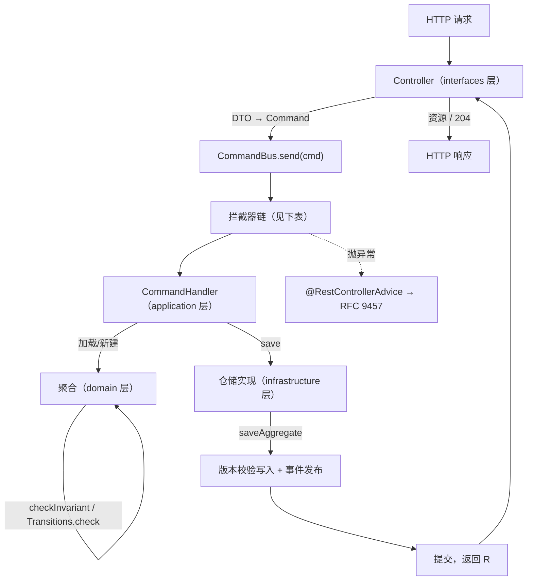

# S1 HTTP 同步接口：命令与查询

对应 sample：`aipersimmon-ddd-samples/s01-http-command-query`。场景清单见
[analysis-00014-ddd-samples-scenario-catalog](analysis-00014-ddd-samples-scenario-catalog.md)。

## 0. 本篇定位

这是 samples 的**模板篇**。除了讲清一条 HTTP 同步请求怎么写，它还要一次性冻结后续所有 sample
继承的东西：目录与包结构、父 POM、端口分段、错误契约、README 结构、测试风格雏形
（S18 会把测试正式化）。**后续场景不再重新裁决这些，只引用本篇。**

刻意的取舍：**本篇用一个尽可能笨的聚合**。为什么这样建模、不变量怎么放、值对象怎么设计属于
S16；聚合怎么落表、`restoreVersion` 的坑属于 S17。本篇只用到"够跑通一条请求"的最小量，遇到
建模问题就前向引用，避免模板本身失控。

前提照 [analysis-00014-ddd-samples-scenario-catalog](analysis-00014-ddd-samples-scenario-catalog.md) §0.1：samples 与 scaffold 无关，唯一
对标物是 `aipersimmon-ddd` 库的真实行为。本篇所有 API 与异常消息都取自库源码，不取自库文档的
概述——两处不一致的地方在 §10 单独列出。

## 1. 场景与验收

**演示什么**：一个订单上下文，两个端点。

| 端点 | 类型 | 成功响应 |
| --- | --- | --- |
| `POST /orders` | 写 | `201 Created` + `Location` + 订单资源 |
| `POST /orders/{id}/confirm` | 写 | `204 No Content` |
| `GET /orders/{id}` | 读 | `200 OK` + 订单资源 |

**读完能做什么**：知道 Controller 里该写什么、命令与 DTO 的边界在哪、业务拒绝/参数非法/系统故障
分别怎么变成 problem 响应、自己领域的新错误怎么加、以及一个最小可跑的服务需要哪三个依赖。

## 2. 流程全景



`CommandBus.send` 内的拦截器链，**order 越小越靠外**，异常向外传播：

| order | 拦截器 | 来自 | 何时在场 |
| --- | --- | --- | --- |
| -100 | `TracingCommandInterceptor` | observability-otel starter | 装了才有 |
| -90 | `TenantContextCommandInterceptor` | tenancy starter | 装了才有 |
| 0 | `LoggingCommandInterceptor` | cqrs starter | 总是 |
| 25 | `FailedOperationLogInterceptor` | operation-log-cqrs starter | 有 `OperationLogs` bean 才有 |
| 75 | `RetryOnConflictCommandInterceptor` | cqrs starter | **opt-in**：`retry-on-conflict.enabled=true` |
| 100 | `ValidationCommandInterceptor` | cqrs starter | 有 Bean Validation 才有 |
| 150 | `PrecheckCommandInterceptor` | cqrs starter | 总是 |
| 175 | `ConcurrencyTranslationCommandInterceptor` | cqrs starter | 总是 |
| 200 | `TransactionCommandInterceptor` | cqrs starter | 有 `UnitOfWork` bean 才有 |
| 250 | `CompletedOperationLogInterceptor` | operation-log-cqrs starter | 有 `OperationLogs` bean 才有 |
| — | handler | | 最内层 |

三处值得记住的位置关系：

- **事务在 200，最靠内**。所以 handler 不写 `@Transactional`——链已经开了事务。
- **并发翻译在 175，在事务之内、重试之外**。`OptimisticLockingFailureException` 要先被翻译成
  `ConcurrencyConflictException`，外层 75 的重试才抓得到；顺序反了重试就是死的。
- **审计的两半分居事务两侧**：250 在事务内（写审计失败会连业务一起回滚），25 在重试之外
  （重试后成功的命令不会留下失败记录）。S14 会讲这个取舍。

**读侧没有链**。`RegistryQueryBus` 支持 `QueryInterceptor`，但**库里一个实现都没有**，
autoconfiguration 也不注册任何一个：读侧没有事务、没有日志、没有 tracing。想要就自己写——这是
留给应用的接缝，不是遗漏。

## 3. 写路径

包结构（ArchUnit 按 `..domain..` / `..application..` / `..infrastructure..` 这些**包段**匹配，
不是按 Maven 模块，所以单模块 + 分层包足够，且更好读）：

```
com.example.samples.s01.ordering
├── domain          Order, OrderId, OrderStatus, Orders(端口), OrderingErrorCode, 不变量
├── application     PlaceOrder/ConfirmOrder + handler, FindOrder + handler, OrderView
├── infrastructure  MyBatisOrders, OrderRow, OrderMapper
└── interfaces      OrderController, 请求/响应 DTO, OrderingProblemCatalog
```

### 3.1 Controller：只做翻译

```java
@RestController
@RequestMapping("/orders")
class OrderController {

  private final CommandBus commandBus;
  private final QueryBus queryBus;

  OrderController(CommandBus commandBus, QueryBus queryBus) {
    this.commandBus = commandBus;
    this.queryBus = queryBus;
  }

  @PostMapping
  ResponseEntity<OrderResponse> place(@Valid @RequestBody PlaceOrderRequest request) {
    String id = commandBus.send(new PlaceOrder(request.customerId(), request.lines()));
    OrderView view = queryBus.ask(new FindOrder(id));
    return ResponseEntity.created(URI.create("/orders/" + id)).body(OrderResponse.of(view));
  }

  @PostMapping("/{id}/confirm")
  @ResponseStatus(HttpStatus.NO_CONTENT)
  void confirm(@PathVariable String id) {
    commandBus.send(new ConfirmOrder(id));
  }

  @GetMapping("/{id}")
  OrderResponse find(@PathVariable String id) {
    return OrderResponse.of(queryBus.ask(new FindOrder(id)));
  }
}
```

Controller 里**不该有**的东西，逐条说明理由：

- **没有 `try`/`catch`，没有 `@ExceptionHandler`**。异常映射是 starter 的
  `@RestControllerAdvice` 的事（§5）。自己捡异常等于把统一契约撕开一个口子。
- **没有 `@Transactional`**。事务在拦截器 200。
- **没有业务判断**。任何 `if` 都属于聚合或 handler。
- **没有成功信封**。库的立场写在 `com.aipersimmon.ddd.web` 的 `package-info.java` 里：
  成功直接返资源 + 正确状态码，失败是 RFC 9457 problem 文档。库里**不存在**
  `ApiResponse`/`Result<T>` 这类包装类型，不要自己造一个——那会让所有 sample 的响应形状不一致，
  也让 OpenAPI 里的 problem 契约对不上。唯一的"信封"是分页壳 `Page`/`Slice`（S20）。
- **DTO 与 command 是两个类型**，即使字段暂时一样。DTO 属于 HTTP 契约（可以有
  `@NotBlank`、可以改字段名兼容旧客户端），command 属于应用契约。让它们合并，改 HTTP 就会
  牵动领域。

`place` 里连着一次 `send` 再一次 `ask`：写完再读一次，是为了让 201 的响应体和 `GET` 完全同形。
代价是读到的是**刚提交后的状态**，在有投影的场景里这一步会读到落后的数据——那是 S12 的
"读自己的写"。本篇单库同源，没有这个问题。

### 3.2 Command：record + 约束

```java
public record PlaceOrder(
    @NotBlank String customerId,
    @NotEmpty @Valid List<Line> lines) implements Command<String> {

  public record Line(@NotBlank String sku, @Positive int quantity) {}
}

public record ConfirmOrder(@NotBlank String orderId) implements Command<Void> {}
```

- `Command<R>` 是纯标记接口，`R` 是 handler 的返回类型。`Command<Void>` 的 handler 返回 `null`。
- 约束写在 command 的组件上，由 order 100 的 `ValidationCommandInterceptor` 执行。**它跑在
  Controller 的 `@Valid` 之后、事务之前**，所以非 HTTP 入口（S5、S11）也享受同一份校验，不需要
  在每个入口重复写。
- `@Valid` 要显式加在嵌套集合上，否则 `Line` 里的约束不会被检查。
- ArchUnit 有一条 opt-in 规则 `commandComponentsShouldDeclareValidationConstraints()`，强制
  command 的每个引用类型组件都带约束或 `@Valid`。建议 sample 打开它。

### 3.3 Handler：在 application 层，不开事务

```java
@Component
class PlaceOrderHandler implements CommandHandler<PlaceOrder, String> {

  private final Orders orders;
  private final IdGenerator idGenerator;

  PlaceOrderHandler(Orders orders, IdGenerator idGenerator) {
    this.orders = orders;
    this.idGenerator = idGenerator;
  }

  @Override
  public String handle(PlaceOrder command, CommandContext context) {
    OrderId id = new OrderId(idGenerator.newId());
    Order order = Order.place(id, command.customerId(), toLines(command.lines()));
    orders.save(order);
    return id.value();
  }
}
```

```java
@Component
class ConfirmOrderHandler implements CommandHandler<ConfirmOrder, Void> {

  private final Orders orders;

  ConfirmOrderHandler(Orders orders) {
    this.orders = orders;
  }

  @Override
  public Void handle(ConfirmOrder command, CommandContext context) {
    OrderId id = new OrderId(command.orderId());
    Order order = orders.findById(id)
        .orElseThrow(() -> new EntityNotFoundException(
            OrderingErrorCode.ORDER_NOT_FOUND, "order " + command.orderId() + " not found"));
    order.confirm();
    orders.save(order);
    return null;
  }
}
```

要点：

- **handler 必须住在 `..application..`**：ArchUnit 的
  `commandAndQueryHandlersShouldResideInApplication()` 强制这一点。
- **handler 是普通 Spring bean**，`@Component` 或 `@Bean` 都行。注册机制是按类型取 bean，然后
  按**命令的精确类**建索引——不是注解扫描、也不做父类型匹配。三个后果：
  - **lambda 当不了 handler**（泛型被擦除，`ResolvableType` 解不出来），必须是具体类；
  - 一个命令注册了两个 handler，**启动就失败**：`Two command handlers registered for …`；
  - handler 声明成接口或抽象类型参数也**启动失败**，消息里点明理由：那样注册的 handler
    "would never receive a dispatch"。
- **`IdGenerator` 是必须的 bean，但框架不会替你铸造聚合 id**：没有任何一处在聚合路径上调它。
  自己在 handler 或领域工厂里 `idGenerator.newId()`。它给的是时间有序的 UUIDv7 字符串，
  这对索引局部性和游标分页有意义（S20）。
- **handler 之间不许互相依赖**：`commandHandlersShouldNotDependOnOtherCommandHandlers()`。要
  复用就抽一个非 handler 的应用协作者。
- **不要用 `sendAs`**：`commandHandlersAndApplicationShouldNotCallSendAs()` 明确禁止 handler 与
  `..application..` 调它。它是给基础设施重投用的（S4）。
- **嵌套 dispatch 会加入外层事务**（`UnitOfWork` 默认 `REQUIRED`）。所以"一个命令一个事务"
  说的是**根 dispatch**；内层失败会把共享事务标成 rollback-only，外层即使吞了异常也会以
  `UnexpectedRollbackException` 收场。本篇不演示嵌套，S8 会讲。

### 3.4 聚合：本篇只要最小量

```java
@AggregateRoot
public final class Order extends AbstractAggregateRoot<OrderId> {

  private static final Transitions<OrderStatus> TRANSITIONS = Transitions.<OrderStatus>of()
      .allow(OrderStatus.PLACED, OrderStatus.CONFIRMED, OrderingErrorCode.ORDER_NOT_CONFIRMABLE);

  private final OrderId id;
  private final String customerId;
  private final List<OrderLine> lines;
  private OrderStatus status;

  private Order(OrderId id, String customerId, List<OrderLine> lines, OrderStatus status) {
    this.id = id;
    this.customerId = customerId;
    this.lines = List.copyOf(lines);
    this.status = status;
  }

  public static Order place(OrderId id, String customerId, List<OrderLine> lines) {
    Order order = new Order(id, customerId, lines, OrderStatus.PLACED);
    order.checkInvariant(new OrderHasLines(lines));
    order.registerEvent(new OrderPlaced(id, customerId));
    return order;
  }

  /** 从存储重建。这里的 restoreVersion 是本篇唯一一处"不这么写就会出事"的地方，见 §3.5。 */
  public static Order reconstitute(
      OrderId id, String customerId, List<OrderLine> lines, OrderStatus status, long version) {
    Order order = new Order(id, customerId, lines, status);
    order.restoreVersion(version);
    return order;
  }

  public void confirm() {
    TRANSITIONS.check(status, OrderStatus.CONFIRMED);
    this.status = OrderStatus.CONFIRMED;
    registerEvent(new OrderConfirmed(id));
  }

  @Override
  public OrderId id() {
    return id;
  }
}
```

```java
@ValueObject
public record OrderId(String value) implements Identifier {}
```

```java
record OrderHasLines(List<OrderLine> lines) implements Invariant {
  @Override public boolean isBroken() { return lines.isEmpty(); }
  @Override public String message() { return "an order must have at least one line"; }
  @Override public ErrorCode errorCode() { return OrderingErrorCode.ORDER_HAS_NO_LINES; }
}
```

只解释本篇必须解释的四点，其余留给 S16：

- `AbstractAggregateRoot<ID extends Identifier>` 的类型参数**必须是 `Identifier`**，不能是
  `String`/`UUID`——身份是值对象。
- **`Invariant` 抛，`Specification` 答**。`Invariant` 带 `ErrorCode`（违反要传到边界），
  `Specification` 不带（不匹配是正常结果）。用错一个，异常就成了控制流；用错另一个，非法状态
  被写进库。
- **不要自己 `new InvariantViolationException(...)`**，只经 `checkInvariant`；同理
  `IllegalStateTransitionException` 只经 `Transitions.check`。两条都有 ArchUnit 规则守着。
- `Transitions` **不是线程安全的**，建完就当冻结的，所以放 `static final`。拒绝用的
  `ErrorCode` 属于**目的状态**，同一个目的状态给两个不同 code 会在声明期就报错。

### 3.5 仓储：端口在领域，实现在基础设施

```java
@Repository                                  // com.aipersimmon.ddd.core.annotation.Repository
public interface Orders {
  Optional<Order> findById(OrderId id);
  void save(Order order);
}
```

库**故意没有**通用的 `AggregateRepository<A, ID>` 端口：那会把 `findAll`/`update` 这类词汇塞进
领域语言。每个聚合自己声明自己的端口，只暴露它真的需要的方法。

```java
@org.springframework.stereotype.Repository
class MyBatisOrders extends MybatisPlusAggregateRepository<Order, OrderRow> implements Orders {

  private final OrderMapper mapper;

  MyBatisOrders(OrderMapper mapper, DomainEvents domainEvents) {
    super(mapper, domainEvents);
    this.mapper = mapper;
  }

  @Override
  public void save(Order order) {
    saveAggregate(order);                    // 版本校验写入 + 子表 + 事件发布，都在这里面
  }

  @Override
  public Optional<Order> findById(OrderId id) {
    OrderRow row = mapper.selectById(id.value());
    return Optional.ofNullable(row).map(this::toAggregate);
  }

  @Override
  protected OrderRow toRow(Order order) { /* 聚合 → 行 */ }

  private Order toAggregate(OrderRow row) {
    return Order.reconstitute(
        new OrderId(row.getId()), row.getCustomerId(), lines(row), row.getStatus(),
        row.getVersion());                   // ← 版本必须带回去
  }
}
```

行类型：

```java
@TableName("s01_order")
class OrderRow implements VersionedRow {
  @TableId private String id;
  private String customerId;
  private String status;
  @Version private Long version;
  // getter/setter 略；getVersion/setVersion 由 VersionedRow 要求
}
```

本篇只需要读者记住三件事，其余（部分更新、子集合策略、值对象扁平化）留给 S17：

1. **写路径共享，读路径不共享**。基类只给 `saveAggregate`，`findById` 完全由你写——因为只有写
   路径承载不变量。
2. **版本决定 insert 还是 update**。`version() == 0` 走 insert，否则走带 `WHERE version = ?` 的
   update。所以重建聚合时忘了 `restoreVersion(...)`，一次更新会变成插入，然后撞主键。库的异常
   消息把这个坑写进去了：

   > aggregate Order[…] already exists. Either two concurrent creates raced on the same identity —
   > a genuine conflict the client should see as 409 — or this aggregate was reconstituted by a
   > factory that forgot to call `restoreVersion(...)`, leaving its version at 0 so save took the
   > insert branch; if this write was meant to be an update, that is the bug to fix.

   注意 `restoreVersion` 是 `protected`：**仓储调不到**，只能由聚合自己的重建工厂调。这不是
   限制，是设计——版本归属聚合。
3. **领域事件由仓储发布，不由 handler 发布**。`saveAggregate` 的最后一步是
   `domainEvents.publishAndClear(aggregate)`，同事务同线程。`DomainEvents` 的 javadoc 直说
   "A command handler must not call it"——因为漏排空没人能检测出来。S3 讲这条链的语义。

表结构（业务表由 sample 自己的 Flyway 管，与框架表无关）：

```sql
CREATE TABLE s01_order (
  id          VARCHAR(36)  PRIMARY KEY,
  customer_id VARCHAR(64)  NOT NULL,
  status      VARCHAR(32)  NOT NULL,
  version     BIGINT       NOT NULL DEFAULT 1
);
```

## 4. 读路径

```java
public record FindOrder(@NotBlank String orderId) implements Query<OrderView> {}

@ReadModel
public record OrderView(String id, String customerId, String status, List<LineView> lines) {
  public record LineView(String sku, int quantity) {}
}

@Component
class FindOrderHandler implements QueryHandler<FindOrder, OrderView> {

  private final OrderViewMapper mapper;      // 直接查表，不加载聚合

  FindOrderHandler(OrderViewMapper mapper) { this.mapper = mapper; }

  @Override
  public OrderView handle(FindOrder query) {
    OrderView view = mapper.findById(query.orderId());
    if (view == null) {
      throw new EntityNotFoundException(
          OrderingErrorCode.ORDER_NOT_FOUND, "order " + query.orderId() + " not found");
    }
    return view;
  }
}
```

读侧与写侧的四处不同，都要在文档里讲明：

- **方法叫 `ask`**，不是 `send`。`QueryBus.ask(Query<R>)`。
- **`QueryHandler.handle` 没有 `CommandContext` 参数**。读侧不需要因果链。
- **读不加载聚合**。查询直接映射成读模型，聚合是为写而存在的。什么时候可以直接查写表、什么时候
  要独立投影，是 S12；分页/排序/过滤契约是 S20。
- **读侧完全没有内置拦截器**：没有事务、没有日志、没有 tracing。要给查询加超时、缓存或审计，
  自己实现 `QueryInterceptor`（order 越小越靠外）。

`@ReadModel` 与 `@Projection` 都是无成员的运行时标注，不影响行为，只表达意图：读模型是为某个
查询定型的返回结构，投影是被异步维护的物化数据。本篇只有前者。

## 5. 错误契约（本篇一次定清）

**这一节是全部 sample 的共同契约。后续场景只引用，不再各自设计错误码或 problem 类型。**

### 5.1 三类失败，三条路径

| 失败种类 | 例子 | 抛什么 | 客户端看到 |
| --- | --- | --- | --- |
| 参数形状非法 | `customerId` 为空 | 不用抛，`@Valid` / order 100 拦截器负责 | 400，`type: about:blank`，带 `errors[]` |
| 业务拒绝 | 订单没有行、状态不允许确认 | `checkInvariant` / `Transitions.check` / `ApiException` | 422（或 409，见下） |
| 找不到 | 订单不存在 | `EntityNotFoundException` | 404 |
| 并发冲突 | 版本被人改了 | 不用抛，175 翻译 | 409 |
| 系统故障 | DB 挂了 | 什么都不用做 | 500，**不带 detail** |

映射由 starter 的三个 `@RestControllerAdvice` 完成：`AipersimmonDddWebExceptionHandler`
（`ApiException`、`DomainException` 家族、Spring MVC 协议错、以及 `Exception` 兜底）、
`ApplicationExceptionAdvice`（`EntityNotFoundException` → 404、`ConcurrencyConflictException` 与
`DuplicateEntityException` → 409、其他 `ApplicationException` → 422）、
`ConstraintViolationAdvice`（`ConstraintViolationException` → 400）。

`IllegalStateTransitionException` 默认落 **409**（状态机拒绝是冲突而非参数错），其他
`DomainException` 落 **422**。

### 5.2 `ErrorCode`：每个上下文一个枚举

```java
public enum OrderingErrorCode implements ErrorCode {
  ORDER_NOT_FOUND("ordering.order-not-found", ErrorCategory.NOT_FOUND),
  ORDER_HAS_NO_LINES("ordering.order-has-no-lines", ErrorCategory.VALIDATION),
  ORDER_NOT_CONFIRMABLE("ordering.order-not-confirmable", ErrorCategory.CONFLICT);

  private final String code;
  private final ErrorCategory category;

  OrderingErrorCode(String code, ErrorCategory category) {
    this.code = code;
    this.category = category;
  }

  @Override public String code() { return code; }
  @Override public ErrorCategory category() { return category; }
}
```

`ErrorCode#code()` 的 javadoc 就是命名约定："e.g. `ordering.credit-exceeded`. Prefix with the
bounded context to avoid collisions. Once published it is part of the outward contract and should
change only under versioning."——**上下文前缀 + 短横线**，一旦发布就是对外契约。类型 javadoc 要求
"Implement it as an enum per bounded context"，ArchUnit 的 `errorCodesShouldBeEnums()` 强制它。

`category()` 默认 `DOMAIN_RULE`。只要指定了 category，就自动得到 `DefaultProblemFamilies` 里的
族默认值，**不需要任何注册**：

| category | type | status |
| --- | --- | --- |
| `DOMAIN_RULE` | `/problems/domain-rule-violation` | 422 |
| `NOT_FOUND` | `/problems/resource-not-found` | 404 |
| `CONFLICT` | `/problems/resource-conflict` | 409 |
| `VALIDATION` | `/problems/validation-failed` | 400 |
| `UNAUTHORIZED` | `/problems/unauthorized` | 401 |
| `FORBIDDEN` | `/problems/forbidden` | 403 |
| `UNEXPECTED` | `about:blank` | 500 |

`UNEXPECTED` 故意映到 `about:blank`：内部故障除了状态码没有业务语义，也不该泄露。

### 5.3 `ProblemCatalog` 只登记"值得自己 type"的少数

```java
@Bean
ProblemCatalog orderingProblemCatalog() {
  return () -> Map.of(
      OrderingErrorCode.ORDER_NOT_CONFIRMABLE,
      new ProblemDescriptor("/problems/order-not-confirmable", 409, "ordering.order-not-confirmable.title"));
}
```

`ProblemCatalog` 的 javadoc 定了取舍标准：只覆盖**客户端契约确实不同**的错误——不同的恢复动作、
不同的扩展字段、或者有自己的公开文档。其余留在族类型上、用 `code` 区分，"so the outward
problem-type catalogue does not grow one-for-one with the domain's error codes"。

多个 `ProblemCatalog` bean 会被全部合并；按 `code` 字符串 keying，**没有重复检测**，后来者
静默覆盖。所以一个上下文一个 catalog bean，别散着放。

一个会让服务起不来的小坑（sample 上撞到过）：承载这个 `@Bean` 的 `@Configuration` 类**不能与
bean 方法同名**。被扫描到的配置类自己就是一个按类名命名的 bean，同名的 `@Bean` 方法会撞上它，
启动时报 `BeanDefinitionOverrideException`。sample 里类叫 `OrderingProblemConfig`、方法叫
`orderingProblemCatalog`。

### 5.4 必须自备 `messages.properties`

`titleKey` 是 message-source 的键，由 `ProblemTitleResolver` 走应用的 `MessageSource` 解析。
**库不带任何 message bundle**——整个库里没有一个 `problem.*.title` 属性。不配的话，响应里的
`title` 就是键字符串本身（`"problem.domain-rule-violation.title"`）。所以每个 sample 必须有：

```properties
# src/main/resources/messages.properties
problem.domain-rule-violation.title=Business rule violated
problem.resource-not-found.title=Resource not found
problem.resource-conflict.title=Conflict
problem.validation-failed.title=Validation failed
problem.internal-error.title=Internal error
ordering.order-not-confirmable.title=Order cannot be confirmed
```

### 5.5 `@Valid` 的不对称（容易误判为 bug）

`/problems/validation-failed` 这个族类型**只有带 `ErrorCode` 且 category 为 `VALIDATION` 的错误
才会走到**。普通的 `@Valid` 失败走另一条路：`type` 是 `about:blank`、`title` 是状态原因短语
`"Bad Request"`、`detail` 是 `"Validation failed"`、没有 `code` 成员，只有 `errors[]`。

三个校验入口的 `errors[].code` 来源也不同：`@RequestBody` 上的 `@Valid` 给的是 Bean Validation
的错误码；`ConstraintViolationException`（命令拦截器那条）给的是**约束注解的简单名**，例如
`NotBlank`。文档要如实写出来，否则读者会以为响应不一致是 bug。

### 5.6 会掉进 500 的库异常

兜底 handler 会把日志打全（ERROR + 堆栈），响应是 `about:blank`/500 且**故意不带 `detail`**。
以下库异常都没有专门的 advice，会走这条路：`MissingTenantException`（tenancy，其 javadoc 明确
说这是调用方的 bug，"must not be mapped to a client error"）、`ProcessException` 全家
（process-manager）、`MalformedIntegrationEventException` / `UnknownIntegrationEventException`
（integration）、`UnreachableDestinationException`（outbox）、`OperationLogException`。

要让它们渲染成 404/409，应用必须自己翻译（例如转成 `EntityNotFoundException`）或加自己的
advice。本篇不涉及，但 S9/S4/S14 会各自处理，**处理方式统一在这里说明**：翻译发生在
adapter/application 边界，不改库。

### 5.7 响应里的关联 id

- `X-Request-Id` 由 `RequestIdFilter` 处理，缺失时生成，同时进 MDC 供日志用；problem 体里
  以 `requestId` 出现。
- `traceId` 只在装了 observability-otel 时才有（MDC 键 `trace_id`）。
- **`instance` 永远不填**：库在所有路径上都传 `null`。需要它就自己写 advice 或 mapper。

### 5.8 OpenAPI 只默认文档化四个状态

`aipersimmon-ddd-openapi-spring-boot-starter` 的 `ProblemResponsesCustomizer` 会给每个操作补上
**400 / 404 / 429 / 500**，并注册 `ProblemDetail` 与 `FieldError` 两个可复用 schema。**409 与
422 不在默认之列**——恰好是业务拒绝最常用的两个。所以能产生它们的端点必须自己声明
`@ApiResponse`，否则文档与行为不一致。这条容易漏，sample 里要有正例。

## 6. 依赖与启动

### 6.1 模板不用 `-starter-mybatis-plus`（重要更正）

[analysis-00014-ddd-samples-scenario-catalog](analysis-00014-ddd-samples-scenario-catalog.md) 里 S1 写的是
`aipersimmon-ddd-starter-mybatis-plus`。**实际验证后要改**：那个 bundle 会一并带进 outbox、
inbox、process-manager、operation-log 四组模块，而它们各自注册一个表结构校验器，默认
`schema-validation=validate` 且只要存在 `SqlSessionFactory` 就生效。于是"bundle 装了但没配
`aipersimmon.ddd.flyway.components`"= **启动直接失败**，报第一张缺失的框架表。

（顺带一说，`CHOOSING-MODULES.md` 那句"Adding a bundle costs you jar size and nothing else until
you configure something"在这一点上不成立；库文档与代码的偏差记在 §10。）

S1 只需要 HTTP → 命令 → 聚合 → 落库，一张框架表都不要，所以取最小组合：

```xml
<dependency>
  <groupId>com.aipersimmon.ddd</groupId>
  <artifactId>aipersimmon-ddd-starter</artifactId>          <!-- cqrs + events + id + web -->
</dependency>
<dependency>
  <groupId>com.aipersimmon.ddd</groupId>
  <artifactId>aipersimmon-ddd-persistence-mybatis-plus</artifactId>
</dependency>
<dependency>
  <groupId>com.aipersimmon.ddd</groupId>
  <artifactId>aipersimmon-ddd-mybatis-plus-spring-boot-starter</artifactId>
</dependency>
<dependency>
  <groupId>com.baomidou</groupId>
  <artifactId>mybatis-plus-spring-boot3-starter</artifactId>
</dependency>
<dependency>
  <groupId>com.aipersimmon.ddd</groupId>
  <artifactId>aipersimmon-ddd-openapi-spring-boot-starter</artifactId>
</dependency>
```

这一组**不注册任何表结构校验器**，是本条流程的最小依赖集。需要框架表的场景（S4 起）再上 bundle
并显式配 `flyway.components`——那正是 S4 要演示的东西。

BOM 顺序有硬要求：`aipersimmon-ddd-bom` 必须在 `spring-boot-dependencies` **之前**导入
（它带着 OpenTelemetry 的 core line），同时 MyBatis-Plus 的版本由使用方自己管。这条写在
samples 父 POM 里，一次到位（§9）。

### 6.2 属性与启动守卫

必需的其实只有数据源，加上一个建议必设的应用名：

```yaml
spring:
  application:
    name: s01-http-command-query          # 多个组件的默认值从它派生
  datasource:
    url: jdbc:postgresql://localhost:18011/s01
    username: s01
    password: s01
```

两个会让服务**起不来**的守卫，要在文档里点名，因为它们是"fail loud"设计的示范：

- **没有 `PlatformTransactionManager`** 且 `aipersimmon.ddd.cqrs.transaction.required=true`
  （默认）→ `MissingTransactionManagerException`，并且有专门的 `FailureAnalyzer` 把它渲染成
  可操作的启动报告。设成 `false` 则每次启动打 WARN。
- **没有 `IdGenerator` bean** → 上下文启动失败。`CommandBus` 把它作为必需构造参数注入。
  `aipersimmon-ddd-starter` 已经带了 id starter，所以正常不会遇到；但手工拼依赖时会。

`aipersimmon.ddd.cqrs.*` 一共只有四个属性：`transaction.required`（`true`）、
`retry-on-conflict.enabled`（`false`）、`retry-on-conflict.max-attempts`（`3`，含首次）、
`retry-on-conflict.initial-backoff`（`50ms`，每次翻倍、无 jitter）。本篇保持重试关闭——什么命令
能重试是 S8 的题目。

## 7. 测试（雏形，S18 正式化）

本篇至少要有四个测试，后续 sample 照抄这四层：

| 层 | 例子 | 用什么 |
| --- | --- | --- |
| 领域单测 | `Order.confirm()` 在 CONFIRMED 上再调一次会拒绝 | 纯 JUnit，无 Spring |
| handler 单测 | `ConfirmOrderHandler` 找不到订单抛 `EntityNotFoundException` | 手写的内存端口替身 |
| 架构规则 | `AiPersimmonDddRules.all()` 跑在 `com.example.samples.s01` 上 | `aipersimmon-ddd-archunit` |
| HTTP 契约 | 三类失败各自的状态码、`type`、`code`、`errors[]` | `@SpringBootTest` + Testcontainers |

`aipersimmon-ddd-test` 的 `RecordingCommandBus` / `RecordingIntegrationEvents` / `InMemoryInbox`
在本篇用不上——这里的 handler 依赖的是端口而不是总线或事件发布器。它们要到 handler 开始依赖那些
东西时才有价值（S3 起），所以 s01 的依赖里没有这个模块，S18 会把"什么时候用哪个替身"讲清。

架构规则的导入必须**排除测试类**（`ImportOption.DoNotIncludeTests`）：测试里那个内存端口替身实现
了 `Orders`，却住在测试包而不是 `..infrastructure..`，不排除就会打红
`implementationsShouldResideInInfrastructure`。

Testcontainers 那条用 `@EnabledIf(DockerAvailable)` 守着，**没有 Docker 时是跳过而不是失败**。
好处是换台机器不假红，代价是绿色构建可能什么都没验证——所以 README 里明写了"先看有没有 skip"。

架构规则一句话就能接上，而且**必须接**——`versionWitnessIsAdvancedOnlyByPersistenceAdapters()`
是唯一阻止业务代码调 `versionAdvanced()` 把乐观锁解除的东西：

```java
@AnalyzeClasses(packages = "com.example.samples.s01")
class ArchitectureTest {
  @ArchTest static final ArchRule ddd = AiPersimmonDddRules.all();
}
```

`all()` 是 26 条规则的复合。四条 opt-in 规则单独采纳，本篇建议再打开两条：
`implementationsShouldBeSpringRepositories()` 与
`commandComponentsShouldDeclareValidationConstraints()`。

## 8. 工程约定（本篇冻结，全部 sample 继承）

**目录与命名**

```
aipersimmon-ddd-samples/
├── pom.xml                       父 POM：聚合全部 sample，管 BOM 顺序与公共插件
├── README.md                     场景索引 → 目录 → 对应文档 id
├── s01-http-command-query/
│   ├── pom.xml
│   ├── README.md                 场景一句话 / 怎么跑 / 哪个测试验证了哪个断言
│   ├── docker-compose.yml
│   └── src/{main,test}/...
└── s04-integration-events-cross-service/
    ├── ordering-service/         双服务场景：一个目录两个服务模块
    ├── inventory-service/
    └── docker-compose.yml
```

- 目录名 `s<两位场景号>-<kebab 场景名>`，与文档 id 一一对应。
- Java 包根 `com.example.samples.s<NN>`，其下 `<context>.{domain,application,infrastructure,interfaces}`。
  单模块 + 分层包即可满足 ArchUnit；把层拆成 Maven 模块留给 S24。
- **父 POM 统管**：一次 `mvn verify` 覆盖全部 sample，CI 每次全构建。独立 reactor 的样例会
  悄悄烂掉，这是明确要避免的形态。

**端口分段**：每个场景占 `18000 + 10×N` 起的 10 个端口，避免两个 sample 同时跑时打架。

| 场景 | 应用 | 第二个服务 | 数据库 | 其他 |
| --- | --- | --- | --- | --- |
| S1 | 18010 | — | 18011 | — |
| S4 | 18040 | 18041 | 18042 | Kafka 18043 |
| S10 | 18100 | 18101 | 18102 / 18103 | seata-server 18104 |

**README 结构**（每个 sample 相同五节）：这个 sample 演示什么（一句话）→ 怎么跑（compose +
一条 `curl`）→ 代码导览（一张"关注点 → 类 → 验证测试"表）→ 刻意不演示什么 → 对应文档链接。

**业务域**：不追求全局统一。订单域被 S1/S2/S3/S8 等复用；需要新域的场景直接用新域，不为统一
而牵强。

## 9. 库文档与代码不一致之处（写文档时以代码为准）

写本篇时撞到四处偏差，记录在此以免后续 sample 被文档带偏：

1. `QueryBus` 的 javadoc 说"there is no transaction or interceptor chain here"，但
   `QueryInterceptor` 存在且 `RegistryQueryBus` 确实折叠了一条链。准确表述是：**链存在，但库
   不提供任何实现**。
2. `cqrs.spring` 的 `package-info.java` 只列了 logging / validation / transaction 三个拦截器，
   实际还有 precheck、并发翻译、opt-in 重试。
3. `aipersimmon.ddd.cqrs.retry-on-conflict.*` 三个属性**在 `CONFIGURATION.md` 里没有**，尽管该
   文件声称列出了全部 `aipersimmon.ddd.*` 属性。以属性类为准。
4. `AipersimmonDddIdAutoConfiguration` 的 javadoc 说缺了 id 模块时各消费方会退回
   `UUID.randomUUID()`——**HEAD 上不成立**，`IdGenerator` 是必需注入，缺了就启动失败。
5. `aipersimmon-ddd-flyway-spring-boot-starter/README.md` 说 `components` "(empty = all)"，
   而代码与 `CONFIGURATION.md` 都是**空 = 什么都不建**。

这些属于库自身的文档债，不在 samples 范围内修；但 samples 的正文不得复述错误说法。

## 10. 本篇不覆盖

- 幂等与重放防护（S2）、分页与游标（S20）、`CommandPrecheck` 的三层校验分工（S19）；
- 聚合建模的理由与取舍（S16）、映射细节与部分更新（S17）；
- 领域事件的语义与易失性（S3）、跨服务（S4 起）；
- 事务边界与并发升级路径（S8）；
- 审计与操作日志，连同它需要的操作者身份（actor）——那是 S14 的题目，本篇一个字都不用定；
- 认证与授权。
