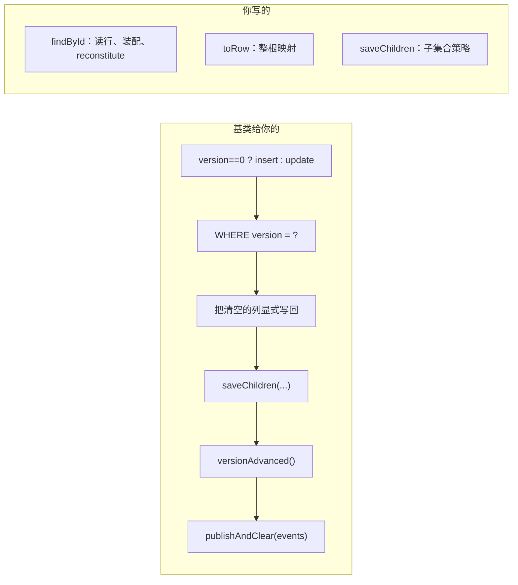

# S17 聚合与数据表的映射

对应 sample：`aipersimmon-ddd-samples/s17-aggregate-persistence-mapping`。场景清单见
[[analysis-00014-ddd-samples-scenario-catalog]]；模型本身怎么建见
[[analysis-00016-samples-tactical-modelling]]。

## 0. 本篇定位

库把写路径给了你，把**映射整个留给你**。这是采用本库的团队实际流血的地方：`saveAggregate` 负责
"insert 还是 update"、版本谓词、把聚合清空的列写回、推进版本、发布事件；**读取、装配、子集合策略
全部是使用方的代码**——理由是只有写路径承载不变量。

本篇讲清这条边界两侧各有什么，以及四个具体决策：版本怎么带回来、被清空的字段怎么真的落库、
子集合怎么写、值对象扁平还是序列化。sample 没有 HTTP 层，按模块手工挑依赖（不用 bundle），
因为一个持久化示例不需要 web 层。

## 1. 分工



三个抽象点只有 `toRow` 是必须实现的；`saveChildren` 默认空实现；读取根本不在基类里。

## 2. 版本：唯一必须记住的那个参数

`AbstractAggregateRoot.restoreVersion(long)` 是 **protected**——仓储调不到，只能由聚合自己的
重建工厂调。javadoc 说明了理由："so a repository cannot inject a version behind the aggregate's
back."

`version() == 0` 意味着"从未持久化"，于是 save 走 insert 分支。所以**重建时忘了带版本 = 更新变
插入 = 撞主键**。库把这两种可能都写进了异常消息：

> aggregate Order[order-4] already exists. Either two concurrent creates raced on the same identity
> — a genuine conflict the client should see as 409 — or this aggregate was reconstituted by a
> factory that forgot to call `restoreVersion(...)`, leaving its version at 0 so save took the insert
> branch; if this write was meant to be an update, that is the bug to fix.

sample 的 `anAggregateAtVersionZeroTakesTheInsertBranchAndCollides` 复现了它：拿一个已存在的 id
新建聚合（等价于忘了 `restoreVersion`），保存，断言 `DuplicateEntityException` 且消息里含
"forgot to call restoreVersion"。

**乐观锁失败长什么样**：`OptimisticLockingFailureException`，消息含 "was modified concurrently
(expected version N)"。注意——**经 `CommandBus` 调用时**，order 175 的拦截器会把它翻译成
`ConcurrencyConflictException`（进而 409）；**直接调仓储时**（sample 的测试就是这样）看到的是
Spring 原始异常。这个差别会让人误判，所以要写清。

还有两个"锁其实没生效"的启动/写入期守卫：

- 更新后行的 version 不等于 `expected + 1` → `IllegalStateException`，消息点名两个原因：行的
  version 字段少了 `@Version`，**或者**使用方自己声明了 `MybatisPlusInterceptor` bean，从而
  **整体替换**了框架的装配、却没把被顶掉的拦截器加回来。
- insert 报告 0 行（`INSERT IGNORE` / `ON CONFLICT DO NOTHING` 会这样）→ `IllegalStateException`，
  因为聚合没保存成功，绝不能继续写子表、推进版本、发布事件。

## 3. 被清空的字段：这个基类存在的首要理由

MyBatis-Plus 的默认字段策略是 `NOT_NULL`：**null 字段不进 `SET` 子句**。对**部分更新**这是对的
（null 意思是"我不对这一列发表意见"）。但保存聚合从来不是部分更新：`toRow` 映射的是整个根，
null 意思是"这个字段现在空了"。

丢掉这个赋值的后果是一连串"看起来全对"：

- 更新语句成功，返回 1 行；
- 版本真的推进了，所以乐观锁校验通过；
- 领域事件真的发布了，下游被告知变更已发生；
- 而数据库里还是旧值，下次加载时它回来了——一个已被接受的命令被部分撤销。

基类的做法是走 `UpdateWrapper`，对每一个"实体自己的 `SET` 会丢掉的列"补一条显式
`column = null`（`ClearedColumns.forceOnto`），同时仍把实体传进去——因为乐观锁拦截器要靠它挂上
version 谓词并回写自增后的版本。

**sample 用一个刻意的反例把差别做成可执行对照**：`NaiveOrderWriter` 用最常见的写法
`mapper.updateById(row)`，与正确实现**只差这一点**（乐观锁仍然生效，因为拦截器是全局的）。两个
测试并排：

| 测试 | 结果 |
| --- | --- |
| `anEmptiedColumnActuallyReachesTheDatabase` | `note` 真的变成 NULL |
| `theNaiveWriterSilentlyKeepsTheOldValue` | 更新返回 1 行、版本从 1 变 2、**而 note 仍是旧值** |

`ClearedColumns` 的排除规则也值得知道，它镜像了 MyBatis-Plus 自己的判断而不是假设默认值：

| 排除项 | 理由 |
| --- | --- |
| `FieldStrategy.ALWAYS` | 实体的 `SET` 已经带了它，再补一次会生成 `SET c = ?, c = null`——**PostgreSQL 直接拒绝**（MySQL 接受） |
| `FieldStrategy.NEVER` | 使用方明确说了别动这一列 |
| version 列 | 由乐观锁拦截器决定写什么 |
| 逻辑删除列 | 保存聚合不是删除行 |
| 原始类型字段 | 不可能为 null |
| `updateFill` 字段 | 自动填充会写 |

## 4. 子集合：策略由模型决定，不由方便决定

基类的 `saveChildren` 默认什么都不做，策略是你的选择。两种常见做法，判据是**子对象有没有身份**：

| | 适用 | 代价 |
| --- | --- | --- |
| 删后重插 | 子对象是**值对象**（S1 的订单行就是） | 每次保存都重写全部子行；有身份的话身份会被重铸 |
| 差异更新 | 子对象是**实体**（S16/S17 的订单行） | 代码更长，需要按身份对齐 |

sample 用差异更新，因为这里的行是实体：读出已存的行按 id 建索引，遍历聚合的行——没见过的插入、
数量变了的更新、**没变的一行都不写**，剩在索引里的删除。`childrenAreDiffedSoUntouchedLinesAreLeftAlone`
断言改过数量的那一行**保住了自己的 id**，被移除的消失，新加的出现。

删后重插在有身份的场合会带来三个真实后果：身份被重铸、指向子行的外键断掉、没变的行也被重写。
反过来，对值对象集合用差异更新是没必要的复杂度。

## 5. 值对象：扁平还是序列化

两种都对，判据是**这个值会不会被查询、排序、聚合**：

| | sample 里的例子 | 存法 |
| --- | --- | --- |
| 会被查/排/汇总 | `Money total` | 扁平成 `total_currency` + `total_amount_cents` 两列 |
| 只整体读写 | `ShippingAddress` | 一个 `jsonb` 列 |

搞反的两种结果：地址被拆成十四列而没人读；金额埋在 JSON 里，于是"按金额排序"和"求和"都要全表
反序列化。

### 5.1 JSONB 的一个真实坑（sample 上撞到的）

MyBatis-Plus 自带的 `JacksonTypeHandler` 序列化成 `String` 并用 `setString` 绑定，PostgreSQL
拒绝把 varchar 赋给 jsonb 列：

```
ERROR: column "shipping_address" is of type jsonb but expression is of type character varying
```

三条出路，sample 选了侵入性最小的第三条：

1. 把列声明成 `text`——代价是失去所有 JSON 运算符和 GIN 索引；
2. 在连接上加 `stringtype=unspecified`——为一列改变**整个应用**所有字符串参数的绑定方式；
3. 写一个十几行的 handler，继承 `JacksonTypeHandler` 只改绑定类型为 `Types.OTHER`，让服务端自己
   推断（sample 的 `JsonbTypeHandler`）。

还有一个容易漏的：`@TableName(value = "...", autoResultMap = true)` **必须加**，否则 type handler
只在写入时生效、读取时被忽略，值对象加载回来是 null。

### 5.2 枚举

sample 存的是 `status.name()` 而不是 ordinal。理由很实际：插入一个新枚举常量会重排 ordinal，
把已存的行全部解释错。

## 6. 读路径：不共享，也不必经过聚合

`findById` 完全由你写：读根行、读子行、调聚合的重建工厂。基类不掺和。

而"读"本身分两种，本篇给出边界：

- **读回聚合**：要执行行为、要保护不变量时（命令处理器就是这条）；
- **读扁平数据**：只是回答一个问题时。`aReadThatDoesNotNeedTheAggregateDoesNotBuildOne` 直接查
  写模型的表拿两列——为了读三个字段而重建一个聚合不买到任何东西。

形状差异大到需要独立存储时才是投影（S12），分页/游标契约是 S20。

## 7. 事务：写入必须在事务里，而且守卫会告诉你

没有活动事务时 `saveAggregate` 直接拒绝，消息把理由和两条出路都写了：

> no active transaction while saving aggregate ...: the root row, its child rows and its domain
> events must commit or roll back together. Send the operation through the CommandBus (its
> transaction interceptor opens one), or annotate the calling application service with
> `@Transactional`.

`savingOutsideATransactionIsRefused` 钉住了它。这条守卫的价值在于：根行、子行、事件三者必须同生
同死，否则会出现"根写了子没写"或"库没写事件发了"。

## 8. 常见错法

| 错法 | 会发生什么 |
| --- | --- |
| 重建工厂忘了 `restoreVersion(...)` | 更新变插入 → `DuplicateEntityException`（消息会点名这个原因） |
| 直接用 `updateById` 保存聚合 | 被清空的字段静默保留旧值，其它一切看起来都成功 |
| 行的 version 字段少了 `@Version` | 写入期 `IllegalStateException`：乐观锁其实没生效 |
| 自己声明 `MybatisPlusInterceptor` bean | **整体替换**框架装配，乐观锁/租户拦截器一起消失 |
| 值对象是实体集合却用删后重插 | 身份被重铸，外键断裂 |
| JSONB 列用默认 `JacksonTypeHandler` | 插入报 "is of type jsonb but expression is of type character varying" |
| 忘了 `autoResultMap = true` | 写进去了，读出来是 null |
| 枚举存 ordinal | 加一个常量就把历史数据解释错 |
| 在事务外调 save | `IllegalStateException`，好在拒绝得很清楚 |
| 期望基类帮你读 | 基类只有写路径，`findById` 一行都不给 |

## 9. 本篇不覆盖

- 为什么这么建模（聚合边界、实体 vs 值对象的判据）——S16；
- 事务边界画在哪层、跨聚合一致性、冲突重试策略——S8；
- 领域事件发布后的语义与易失性——S3；
- 表结构演进与不停机迁移——S23；
- 读侧投影与分页——S12 / S20；
- 软删除与逻辑删除列（`ClearedColumns` 会跳过它，此处只提一句）——S27。
