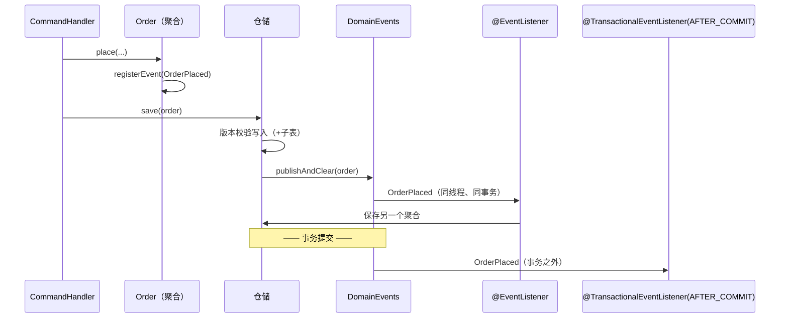

# S3 领域事件的发布与消费（同进程）

对应 sample：`aipersimmon-ddd-samples/s03-domain-events-in-process`。场景清单见
[[analysis-00014-ddd-samples-scenario-catalog]]；测试风格见
[[analysis-00019-samples-testing-strategy]]。

## 0. 本篇定位

一个聚合完成状态变更后，同一个服务里的别的东西需要作出反应，而这个反应不属于该聚合的职责。本篇讲
这条链路的完整生命周期、监听器该放哪一层、**它在事务的哪个阶段执行**，以及最重要的一件事：

> **同进程领域事件是易失的。** 不落库、不重试、进程崩溃即丢；提交后的监听器失败了，没有任何人会补。

"outbox 只在跨服务时才需要"是最常见的误解，本篇用一个通过的测试把它推翻。

## 1. 完整生命周期：谁在什么时候做什么

三个要点，每个都有明确理由：

- **注册在聚合内**：`registerEvent` 是 `protected`，只有聚合自己能记录发生在自己身上的事。
- **排空与发布在仓储里**，不在 handler 里。`DomainEvents` 的 javadoc 把话说死了：
  "A command handler must **not** call it"——因为漏掉这一行**不会有异常、不会有日志、不会有任何
  痕迹**，而损失出现在很远的下游（流程管理器永不推进、投影永不更新）。把唯一调用点收在仓储里，
  这种可能性就不存在了。sample 的 `PlaceOrderHandler` 里刻意一行发布代码都没有。
- **投递是同步的**，跑在调用者的线程和事务上（`SpringDomainEvents` 就是包了一层
  `ApplicationEventPublisher`）。

## 2. 事件该携带什么

**身份 + 反应需要的少量事实，不要携带聚合本身。** sample 的
`OrderPlaced(orderId, customerId, firstOrder, amountCents)` 就是这个形状，`firstOrder` 是给
"首单送券"这个反应用的。

带上聚合引用有两个后果：每个订阅者都被绑在根的形状上；更糟的是订阅者可以回头改那个**已经被持久化
的实例**——那正是下一节那条守卫要拦的事。

## 3. 发布守卫：订阅者不能回头改这个聚合

`publishAndClear` 的顺序是**先排空、再发布**，不是"发布完再清空"。理由是：如果订阅者在发布过程中
往同一个聚合上又记了一个事件，先拷后清会把它静默丢掉。

而这种情况本身是被**拒绝**的，不是被接受的：

> a listener recorded 1 further domain event(s) on Order while its events were being published, but
> the aggregate was already persisted, so the state those events announce was never written. Make the
> change before the aggregate is saved, or handle it as a separate use case.

理由是"发布它就是在描述没有发生过的事，静默丢弃则是领域事件失踪的方式"。sample 用一个**单元测试**
（无 Spring、无数据库）复现它：一个订阅者在收到事件后回头调聚合的方法，`publishAndClear` 抛异常。

## 4. 事务相位：这个选择改变结果，而且改得很安静

Spring 给两种监听器，**选错不会报错，只会让结果不同**：

| | `@EventListener` | `@TransactionalEventListener(AFTER_COMMIT)` |
| --- | --- | --- |
| 何时执行 | 发布时，**事务内**、提交前 | **提交之后**，事务外 |
| 失败的后果 | 整个命令回滚，调用方看到异常 | **业务变更已提交，反应丢失，调用方什么都不知道** |
| 适合 | 必须与写入同生共死的反应 | 不能为未提交的写入发生的外部副作用 |

判断方法：**问"这个反应失败了，那次写入还应该存在吗？"**

- 不应该 → 放进事务（`@EventListener`）。sample 的"首单送券"是这一类：券发不出来，这单就不该存在。
- 应该 → 放到提交之后（`AFTER_COMMIT`）。sample 的"通知客户"是这一类：告诉客户一笔回滚了的订单，
  比什么都不说更糟。

sample 三个测试把三种结局都钉住了：

| 测试 | 断言 |
| --- | --- |
| `anInTransactionSubscriberCommitsWithTheOrder` | 订单与优惠券同时存在；提交发生了，所以通知也发了 |
| `afailingInTransactionSubscriberTakesTheOrderDownWithIt` | 订阅者抛异常 → **订单根本没写**，通知也没发（AFTER_COMMIT 对回滚的事务不触发） |
| `afailingAfterCommitSubscriberLosesTheReactionAndKeepsTheWrite` | 通知方抛异常 → **订单与优惠券都已提交，通知消失**，`commandBus.send` 没有抛任何东西 |

第三个测试是本篇的核心证据：**异常没有传到调用方**（这条是实测出来的，不是推断的），写入照常保留，
反应无声无息地没了。没有重试、没有记录"这件事还欠着"。

## 5. 于是：什么样的反应必须升级成 outbox——即使不跨服务

上一节那个"丢了"的结局，就是判断标准：

**如果反应丢了会造成业务后果，它就不能只靠同进程事件，哪怕收发双方在同一个 JVM 里。**

典型的必须升级的例子：

- 扣款成功后要给用户发凭证（丢了 = 用户没收到应得的东西）；
- 下单后要通知仓库拣货（丢了 = 货永远不发）；
- 任何"对外部系统的调用"（丢了 = 两个系统状态永久不一致）。

典型的可以留在同进程的：

- 更新一个可以随时重算的缓存或计数；
- 写一条纯观测性的日志/指标；
- 与写入同生共死、因此放在事务内的那类反应。

**"跨不跨服务"和"能不能丢"是两个独立的问题。** outbox 解决的是后者：事件行与业务行在同一个事务里
落库，之后由后台投递并重试。跨服务只是它最常见的使用场合，不是它的前提。具体怎么接是 S4。

同理，**进程崩溃**这个场合与订阅者失败等价：提交已经发生、`AFTER_COMMIT` 还没跑完，JVM 挂了——
反应同样永远不会发生。

## 6. 监听器放哪一层

- **领域事件的订阅者属于 application 层**（sample 的两个都在
  `com.example.samples.s03.ordering.application`）。`@DomainEventHandler` 的 javadoc 说明了理由：
  领域事件在自己的上下文内被消费，它的订阅者是编排一个用例的应用层关注点，本身不持有业务规则。
- 必须标注 `@DomainEventHandler`：不是装饰，而是让架构测试**能定位**这些 handler
  （`domainEventListenersShouldBeAnnotatedWithDomainEventHandler`）。
- 与集成事件的对照：集成事件从别的上下文经传输到达，由**入站适配器**接收并翻译成命令，所以集成侧
  没有对应的标记（S4/S5）。

## 7. 订阅者改另一个聚合，算一个事务还是两个

sample 的"首单送券"在同一个事务里写了第二个聚合，这是 `@EventListener` 相位的直接后果。要点：

- **相位决定了它**——不是配置、不是习惯；
- "一个事务一个聚合"这条基线因此被打破了，是否可接受属于 S8 的题目；
- 如果两个聚合应该**最终**一致而不是立即一致，正确做法不是换个监听器，而是让第二个聚合**由它自己
  的用例**处理（收 outbox 事件、或收一个命令），这样它的失败与重试都归它自己。

## 8. 什么反应该写成事件，什么该留在命令处理器里

判断标准是**归属**，不是解耦的美感：

- 这段逻辑**属于这个用例本身**（下单必须扣库存、必须记流水）→ 写在命令处理器里，直白、可读、
  易测；
- 这段逻辑**属于另一个关注点**，只是被这件事触发（营销送券、通知、统计）→ 领域事件。

滥用事件的代价很实际：控制流散落在若干监听器里，读代码的人无法从入口看出"下一单会发生什么"，而
调试要靠全文搜索事件类型。

## 9. 常见错法

| 错法 | 后果 |
| --- | --- |
| 在命令处理器里发布事件 | 漏一行就静默丢一个领域事实，没有任何痕迹 |
| 事件携带聚合实例 | 订阅者能回头改已持久化的实例，撞上发布守卫；且订阅者被绑死在根的形状上 |
| 从订阅者里改收到事件的那个聚合 | `IllegalStateException`（好在拒绝得很明确） |
| 用 `@EventListener` 做外部副作用 | 写入回滚了，通知/短信却已经发出去 |
| 用 `AFTER_COMMIT` 做不能丢的反应 | 失败即丢失，无重试、无痕迹、调用方无感 |
| 以为"同进程所以可靠" | 崩溃或提交后失败都会让反应永远不发生 |
| 以为"outbox 是跨服务才要的东西" | 同进程里同样需要，判据是"能不能丢"而不是"跨不跨进程" |
| 订阅者没标 `@DomainEventHandler` | 架构测试找不到它，规则形同虚设 |
| 把属于用例本身的逻辑拆成事件 | 控制流散落，入口处再也读不出会发生什么 |

## 10. 本篇不覆盖

- outbox 怎么接、跨服务投递与 inbox 幂等（S4）；
- 事务边界该由谁开、跨聚合一致性与冲突重试（S8）；
- 集成事件的契约与多版次共存（S21）；
- 消费外部系统的消息（S5）；
- 异步链路的测试等待方式（S4/S9）——本篇的链路全是同步的。
