# Design: <algorithm>

> One sentence: what this computes, inside which participant.

## 1. Input and Output

| Name | Type | Source |
| --- | --- | --- |
| <input> | <type> | <field of a `contract`, column of a `storage`, or a technical constant written here> |
| <output> | <type> | — |

## 2. Steps

```mermaid
flowchart TD
  A[<input>] --> B{<decision>}
  B -->|yes| C[<step>]
  B -->|no| D[<step>]
  C --> E[<output>]
  D --> E
```

## 3. Definitions

| Step | Definition |
| --- | --- |
| <step> | <the exact format, encoding, or comparison; a business derivation cites its `rule-<n>-BR-<i>`, a technical constant is written> |

## Decisions

Links only; the options, the choice, and what it costs live in the `decision`.
`None.` when this element settles no choice.

- [<decision-id>](../decision/<decision-id>.md) — <the tactic it settles>

## Open Questions

Delete this section once every question is closed.

- <what is unknown, and what would close it>
