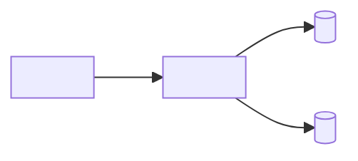

# Design: <environment> deployment

> One sentence: the topology this fixes and for which environment.

## 1. Environment

- Environment: <local · staging · production>
- Operator boundary: <what the operator owns outside this topology — DNS, TLS, backups; procedures live in `operation/`>

## 2. Topology

## 3. Nodes

| Node | Runtime | Ports | Volumes | Depends on |
| --- | --- | --- | --- | --- |
| <name> | <image or runtime and version> | <published : internal, or `—`> | <name, or `—`> | <nodes that must be ready first> |

## 4. Wiring

| Setting | Node | From |
| --- | --- | --- |
| <variable or mount> | <node> | <secret store · build arg · file; the format itself is a `contract`> |

## Decisions

Links only; the options, the choice, and what it costs live in the `decision`.
`None.` when this element settles no choice.

- [<decision-id>](../decision/<decision-id>.md) — <the tactic it settles>

## Open Questions

Delete this section once every question is closed.

- <what is unknown, and what would close it>
