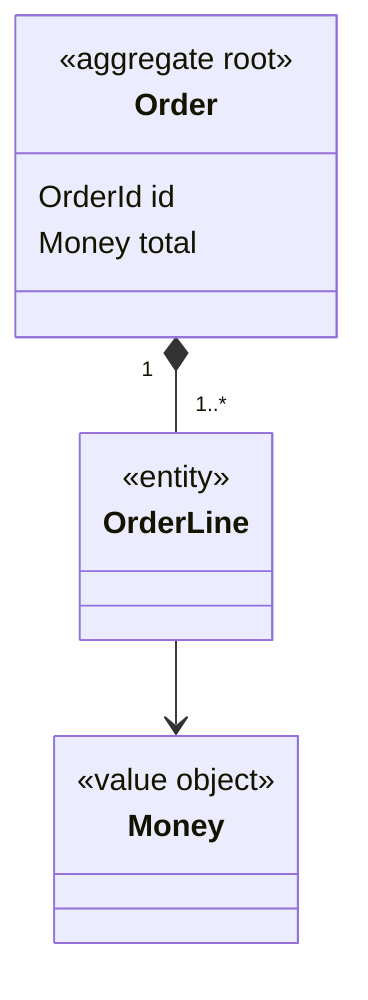

# Design: <bounded context> domain model

> One sentence: the context this model covers and the `CONTEXT.md` terms it fixes in shape.

## 1. Context

- Bounded context: <name, a `CONTEXT.md` term>
- Neighbours: <contexts this one exchanges with> — see `ARCHITECTURE.md` §5

## 2. Model

## 3. Elements

| Element | Stereotype | Term (`CONTEXT.md`) | Stored by (`storage`) | Lifecycle (`lifecycle`) |
| --- | --- | --- | --- | --- |
| <name> | aggregate root · DDD entity · value object · domain event | <term> | [<design-id>](<design-id>.md) or `n/a — not persisted` | [<design-id>](<design-id>.md) or `n/a — stateless` |

## Decisions

Links only; the options, the choice, and what it costs live in the `decision`.
`None.` when this element settles no choice.

- [<decision-id>](../decision/<decision-id>.md) — <the tactic it settles>

## Open Questions

Delete this section once every question is closed.

- <what is unknown, and what would close it>
