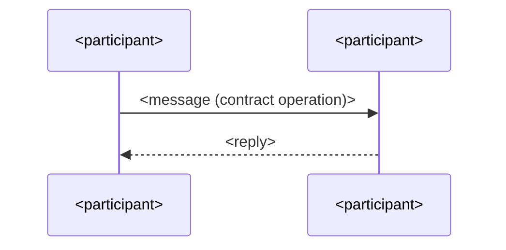

# Design: <exchange>

> One sentence: who exchanges what, from which trigger to which end state.

## 1. Participants

| Participant | Kind | Design |
| --- | --- | --- |
| <name> | module · external system · store · actor | [<module / contract design-id>](<design-id>.md) or `n/a — external` |

## 2. Trigger and End State

- Trigger: <the operation of a `contract`, or a transition of a `lifecycle`>
- End state: <the `lifecycle` state or `storage` rows that hold when the exchange completes>

## 3. Sequence

## 4. Steps

| Step | From → To | Message | Failure mechanism |
| --- | --- | --- | --- |
| 1 | <A → B> | <operation of a `contract`, or an internal call> | [<mechanism design-id>](<mechanism design-id>.md) or `—` |

Failure mechanism is a link only; what the system then does observably is the
consuming spec's Unwanted `FR`.

## Decisions

Links only; the options, the choice, and what it costs live in the `decision`.
`None.` when this element settles no choice.

- [<decision-id>](../decision/<decision-id>.md) — <the tactic it settles>

## Open Questions

Delete this section once every question is closed.

- <what is unknown, and what would close it>
