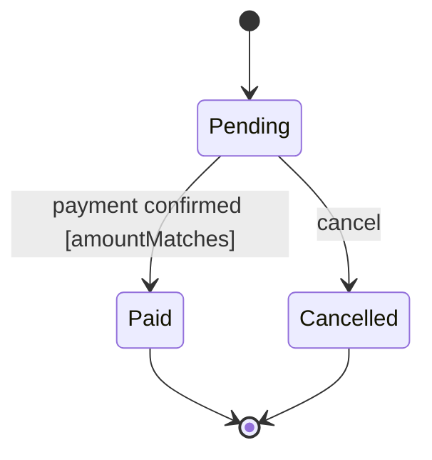

# Design: <subject> lifecycle

> One sentence: the thing whose states this machine holds.

## 1. Subject

- Holder: <term> — column `<table>.<column>` of [<storage design-id>](<storage design-id>.md); a process manager names its state row
- Initial state: <state>

## 2. States

| State | Term (`CONTEXT.md`) | Terminal |
| --- | --- | --- |
| <NAME> | <term> | yes · no |

## 3. Transitions

| From | To | Trigger | Guard | Effect |
| --- | --- | --- | --- | --- |
| <state> | <state> | <command · event · deadline, from a `contract` or `interaction`> | `[<guard name>]` from §4, `[a] and [b]`, or `—` | [<interaction / algorithm design-id>](<design-id>.md) or `—` |

## 4. Guards

UML guard: a boolean predicate named in `[brackets]`, one row per name.

| Guard | Kind | Definition |
| --- | --- | --- |
| `[<name>]` | business | `rule-<n>-BR-<i>` — the id only, never the sentence |
| `[<name>]` | technical | one boolean expression over the holder's columns or the trigger's payload — `attempts < max_attempts`, `event.amount == order.total`; no single expression → [<algorithm design-id>](<algorithm design-id>.md). Never a sentence: a sentence is a business guard |

## 5. Diagram

## Decisions

Links only; the options, the choice, and what it costs live in the `decision`.
`None.` when this element settles no choice.

- [<decision-id>](../decision/<decision-id>.md) — <the tactic it settles>

## Open Questions

Delete this section once every question is closed.

- <what is unknown, and what would close it>
