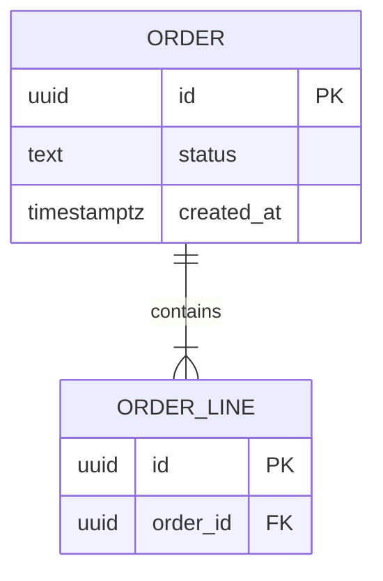

# Design: <aggregate root or read model> storage

> One sentence: the structure these tables persist and for which context.

## 1. Subject

- Root: <term> — element of [<domain design-id>](<domain design-id>.md); or read model: <the events or tables it is recomputed from>
- Owned tables: <one per line>; foreign tables appear in §2 by name only

## 2. ER



## 3. Columns

### <table>

| Column | Type | Null | Default | Meaning |
| --- | --- | --- | --- | --- |
| <name> | <SQL type> | no · yes | <literal or none> | <term>; a derived value cites its `rule-<n>-BR-<i>`; a state column links its `lifecycle` |

## 4. Keys and Indexes

| Name | Columns | Unique | Serves |
| --- | --- | --- | --- |
| <name> | <cols> | yes · no | <the `interaction` / `algorithm` query, or the `quality-<n>-QS-<i>.<k>`> |

## 5. DDL

```sql
CREATE TABLE ...;
```

Or, when inlining would break the 150-line gate: `<path to the migration file>`.

## Decisions

Links only; the options, the choice, and what it costs live in the `decision`.
`None.` when this element settles no choice.

- [<decision-id>](../decision/<decision-id>.md) — <the tactic it settles>

## Open Questions

Delete this section once every question is closed.

- <what is unknown, and what would close it>
