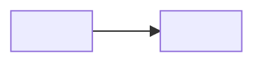

# Design: <subject>

> One sentence: the structure this design settles and for what.

## 1. <Structure the body around the subject>

No fixed structure — domain, database, API, integration, process, deployment.
Prefer Mermaid per the folder README's guideline:

- Domain — class diagram · Lifecycle — state diagram · Database — ER diagram
  plus the SQL schema · Interaction — sequence diagram · Branching process —
  flowchart · API — the contract itself, not a diagram.

## 2. Trade-offs

- <the options considered, the one taken, and what it costs — named as the
  quality scenarios it serves and the ones it costs (`quality-<n>-QS-<i>.<k>`);
  a trade between two attributes is a `decision` with `motivated_by` naming both>

## Open Questions

Delete this section once every question is closed.

- <what is unknown, and what would close it>
