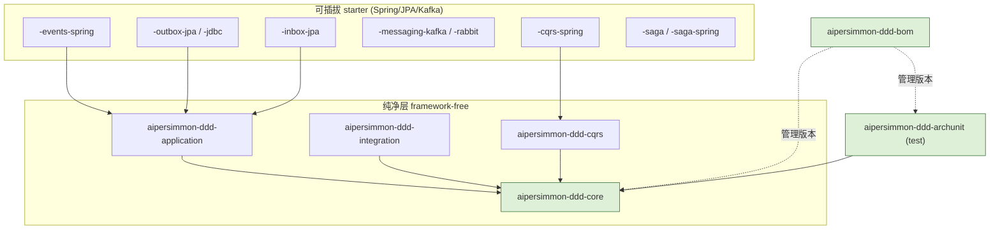
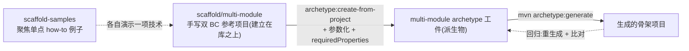

# aipersimmon-ddd 库 + Maven-archetype 脚手架：最终形态与 Phase 1 设计

把分析阶段的结论落成**可构建的设计**。承接 [[analysis-00006-ddd-building-blocks-library]]
（构件库按 Layer × 可插拔性切分、参考不依赖、拓扑无关）、[[analysis-00007-saga-process-manager]]
（saga 分档）、[[analysis-00004-bounded-context-module-structure]]（三种拓扑）、
[[decision-00005-package-per-aggregate]]（domain 包结构)。

分析阶段结束,`bc-and-layer-samples/` 是分析期 demo,**最终删除**——由 archetype + scaffold-samples 取代。

## 一、最终形态：mono-repo,三顶层目录,两个独立 reactor

```
<repo root>
├── aipersimmon-ddd/                 [独立 reactor] 发布型 DDD 库(analysis-00006 模块集)
│   ├── pom.xml                      parent + aggregator(framework-free,NOT spring-boot-parent)
│   ├── aipersimmon-ddd-bom/         消费者 import 的 BOM
│   ├── aipersimmon-ddd-core/        纯净:注解 / marker / 基类 / Transitions
│   └── aipersimmon-ddd-archunit/    可复用 ArchUnit 规则(test)
│                                    (-application / -integration / *-starter 后续阶段)
│
├── aipersimmon-ddd-scaffold/        [独立 reactor] 三个**手写参考项目** → 各自派生一个 archetype
│   ├── multi-module/                ← Phase 1:双 BC、可运行的参考项目,create-from-project 的源
│   │   ├── ordering/                BC(多聚合):ordering-{api,domain,application,infrastructure,adapter}
│   │   ├── inventory/               BC(单聚合):inventory-{api,domain,application,infrastructure,adapter}
│   │   └── start/                   @SpringBootApplication 装配双 BC + 架构测试
│   ├── modulith/                    (后续)
│   └── microservice/                (后续)
│
└── aipersimmon-ddd-scaffold-samples/  一组**聚焦单点 how-to** 的小例子(如"加一个集成事件"
                                        "加 outbox""接一个 saga"),各讲清一件事;不是大而全的应用
```

- **两个 reactor 相互独立**:库与脚手架发布节奏不同,各自 `mvn` 构建;scaffold 通过依赖坐标引用**已发布/已 install** 的库。
- **groupId `com.aipersimmon.ddd`,基础包 `com.aipersimmon.ddd.*`**;生成项目的 groupId/package 由 archetype 属性给(默认 `com.example.app`,创建时可改)。
- **生成的项目"依赖"库 BOM,不拷源码**(analysis-00006 铁律)。
- **CI/CD 发布到 GitHub Packages:后续**,本设计不展开。

## 二、贯穿性设计约束

1. **库 parent 必须 framework-free**:`aipersimmon-ddd/pom.xml` **不继承** `spring-boot-starter-parent`,只设 Java 21 + 插件 + 内部 dependencyManagement。只有后续 `*-spring` starter 才引 Spring。否则 `-core` 不再零依赖,违反 analysis-00006。
2. **版本治理**:`-bom` 管住所有 `aipersimmon-ddd-*` 版本;消费者只 `import` 这一个。
3. **拓扑无关**:同一套库,三种 archetype 复用;差异只在打包与消息传输(analysis-00006 §七)。
4. **Java 21 / Maven 3.9**;编码 UTF-8;`maven.compiler.release=21`。
5. **每个 Java package 必须有 `package-info.java`**:承载包级 Javadoc 与分层 stereotype 注解(`@DomainLayer` 等标注于此),并让"包意图"显式。由 `-archunit` 校验存在性(§5.4)。适用于库、参考项目与生成项目的所有包。

## 三、库 reactor 模块依赖图(analysis-00006 落地)



> 绿色 = **Phase 1 交付**(`-bom` / `-core` / `-archunit`);其余为后续阶段。

## 四、分阶段计划

| 阶段 | 交付 | 说明 |
| --- | --- | --- |
| **Phase 1** | `-bom` → `-core` → `-archunit`(**按此序,一个一个做**)+ `multi-module` archetype + scaffold-samples | 先把"库依赖 + 分层 + arch 校验"跑通;archetype 依赖上述库子集 |
| Phase 2 | `-application` / `-integration` + `-events-spring` / `-outbox` / `-inbox` | 事件与 outbox/inbox 上移进库 |
| Phase 3 | `-cqrs(+spring)` / `-saga(+spring)` | CQRS 与 saga 构件 |
| Phase 4 | `modulith` / `microservice` archetype + CI/CD 发布 GitHub Packages | 补齐另两种拓扑与发布 |

**依赖顺序注意**:archetype 生成的项目要能解析 `aipersimmon-ddd-*`,故库子集必须先 `mvn install` 到本地 `.m2`。Phase 1 内部次序:①库 `bom→core→archunit`;②**手写双 BC 参考项目 `scaffold/multi-module`**(建立在库之上);③从它 `create-from-project` 派生 archetype 并验证生成/回归;④按需补 `scaffold-samples` 的聚焦 how-to 例子。

## 五、库模块详细设计(Phase 1:5.1–5.4;Phase 2:5.5–5.9)

### 5.1 `aipersimmon-ddd/pom.xml`(parent + aggregator)

- `groupId=com.aipersimmon.ddd`、`artifactId=aipersimmon-ddd-parent`、`version=0.1.0-SNAPSHOT`、`packaging=pom`。
- **不继承** spring-boot-parent。`properties`:`maven.compiler.release=21`、`project.build.sourceEncoding=UTF-8`、`archunit.version`。
- `dependencyManagement`:声明 `archunit-junit5`(供 `-archunit` 用),内部模块版本用 `${project.version}`。
- `modules`:随阶段追加。Phase 1 逐步为 `aipersimmon-ddd-bom` → `+core` → `+archunit`。

### 5.2 `aipersimmon-ddd-bom`(第一步)

- `packaging=pom`,parent 指向上面的 parent。
- `dependencyManagement` 列出 Phase-1 构件坐标(`-core`、`-archunit`,版本 `${project.version}`);后续模块随阶段追加。
- 消费者(生成项目)`<dependencyManagement><scope>import</scope>` 引它即可对齐版本。

### 5.3 `aipersimmon-ddd-core`(第二步,零依赖)

包结构(承接 analysis-00006 §三 + §十):

```
com.aipersimmon.ddd.core
├── annotation/    @AggregateRoot @Entity @ValueObject @Repository @Identity @DomainEvent @Service
├── architecture/  @DomainLayer @ApplicationLayer @InfrastructureLayer @InterfaceLayer  (hexagonal 可选)
├── model/         AggregateRoot<ID>  Entity<ID>  Identifier  Association<T,ID>  AbstractAggregateRoot
├── event/         DomainEvent (marker)
├── state/         Transitions<S>  IllegalStateTransitionException   (analysis-00006 §十)
└── exception/     DomainException
```

- `AbstractAggregateRoot`:迁移 repo 现有 `shared-kernel/AggregateRoot`(事件登记/清空)并验证零 framework 依赖。
- `Transitions<S>`:analysis-00006 §十 已给出完整实现与 demo,直接落地。
- **`pom.xml` 无任何 `dependencies`**(除测试 `junit-jupiter`)——这是 `-core` 的验收红线。

### 5.4 `aipersimmon-ddd-archunit`(第三步)

- 依赖 `-core`(识别注解/marker)+ `archunit-junit5`(**compile** 依赖,消费者以 test scope 引 `-archunit` 即可传递获得)。
- 提供可复用 `ArchRule` 常量 + 一个便捷聚合入口(如 `AiPersimmonDddRules.all(basePackage)`),规则集(analysis-00006 §六):
  - domain 不得依赖 application / infrastructure / adapter / 任何 framework;
  - 跨聚合只经 `Association` / `Identifier` 引用聚合根;
  - `IntegrationEvent` 只在 `*-api`;`DomainEvent` 不得泄漏到 adapter。
  - **每个 package 必须有 `package-info.java`**(§二 规约 5)。
- 消费项目写一个 `ArchitectureTest`,按其分层包命名约定套用规则。

---

**Phase 2 起,parent 的 `dependencyManagement` import `spring-boot-dependencies` BOM(3.5.10)**,让 starter 依赖 Spring/JPA/Jackson 时无需自己钉版本;**纯层不受影响**——import BOM 只管版本、不引入依赖,`-core`/`-application`/`-integration` 仍零框架。

### 5.5 `aipersimmon-ddd-application`(纯,→ `-core`)

- `DomainEvents` 发布 port(`publish` / `publishAll`);`@UseCase` 标记;`ApplicationException` 基类。零框架(仅 test junit)。
- `DomainEvents` 与参考项目本地内联的同名 port **签名一致**,便于日后回收。

### 5.6 `aipersimmon-ddd-integration`(纯,零依赖)

- `IntegrationEvent` 标记(区别于 `-core` 的 `DomainEvent`);`EventEnvelope<T extends IntegrationEvent>`(`eventId`/`type`/`version`/`occurredAt`/`traceId`/`payload`),**构造即校验**;版本化契约约定写入 Javadoc。
- **纯数据持有**:不做序列化、不取时钟/随机——由 infra starter 在封装时盖章。

### 5.7 `aipersimmon-ddd-events-spring`(starter,→ `-application` + Spring)

- 提供 `DomainEvents` 的 Spring 实现:`SpringDomainEvents`(委托 `ApplicationEventPublisher`);Boot 自动装配(`AutoConfiguration.imports`),引入即生效。
- **语义(承接 analysis-00001):默认同步、同线程、同事务**——发布在 `@Transactional` 内调用,`@EventListener` 处理器内联执行、与聚合原子提交。**此处不可异步**(否则破坏 outbox 翻译步骤的原子性)。
- 消费者用 `@EventListener` / `@TransactionalEventListener` 注册对某 `DomainEvent` 的处理器。

### 5.8 `aipersimmon-ddd-outbox-jdbc`(starter,→ `-application` + `-integration` + `spring-boot-starter-jdbc` + Jackson)

> **实现阶段发现**:库里放 JPA `@Entity` 有"实体扫描覆盖"陷阱——库的 `@EntityScan` 会让使用者靠默认扫描的自有实体失效。故**先做 `-outbox-jdbc`**(`JdbcTemplate`,无 `@Entity`/`@EntityScan`,零扫描冲突);`-outbox-jpa` 作为后续变体。发布 port `IntegrationEvents` 已加到 `-application`。

- **事务性 outbox**:集成事件与聚合变更**同事务**写入 `aipersimmon_outbox` 表;relay 轮询未发送行,发到 broker,置 `sent`。**at-least-once**(dispatch 后置 sent 前崩溃会重投 → 消费方需幂等)。
- 组件:
  - 表 `aipersimmon_outbox`:`id`/`event_id`(唯一)/`type`/`version`/`payload`(JSON)/`occurred_at`/`trace_id`/`sent`/`sent_at`/`attempts`/`created_at`。建表由消费者(Flyway/Liquibase)负责;主包附**非自动执行**的样例 DDL(`META-INF/aipersimmon-ddd/outbox-schema.sql`),测试用 `schema.sql`(H2)。
  - `OutboxWriter implements IntegrationEvents`:盖章 `EventEnvelope`(eventId=UUID、type=类全名、version=1、occurredAt=now)→ Jackson 序列化 payload → **当前事务** `JdbcTemplate` 插入一行。
  - `OutboxRelay`:`@Scheduled` 轮询未发送行 → 交给 **broker 发布 port `OutboxDispatcher`** → 逐行置 `sent`;失败留待下轮 + `attempts++`。
  - `OutboxDispatcher` port + **默认 `LoggingOutboxDispatcher`**(`@ConditionalOnMissingBean`,开箱即用);真 broker 由后续 `-messaging-kafka` 供给覆盖。
  - `AipersimmonDddOutboxAutoConfiguration`:`@AutoConfiguration(after=JdbcTemplateAutoConfiguration)` + `@EnableScheduling`;各 bean 用 `@ConditionalOnBean(JdbcTemplate)` / `@ConditionalOnMissingBean` 守卫。
- 决策:序列化 = Jackson;relay = `@Scheduled`(可配 `poll-delay-ms`/`batch-size`);broker = port;暂无 DLQ/最大重试(留 `attempts` 观测)。

### 5.9 `aipersimmon-ddd-inbox-jdbc`(starter,→ `-application` + `spring-boot-starter-jdbc`)

> 与 outbox 同理,做成 JDBC(无 `@Entity`/`@EntityScan`,零扫描冲突);`-inbox-jpa` 后续变体。

- **幂等消费**:`aipersimmon_inbox` 表以 `message_key` 为唯一主键记录已处理消息;消费在**同事务**内先调 `Inbox.alreadyProcessed(key)`——首次插入成功(返回 false,继续处理),重投时唯一键冲突(返回 true,跳过)。失败回滚则记录一并回滚,可重试。
- 组件:`Inbox` port(放 `-application`);`JdbcInbox`(靠唯一键 + `DuplicateKeyException` 判重);`AipersimmonDddInboxAutoConfiguration`(`@ConditionalOnBean(JdbcTemplate)`/`@ConditionalOnMissingBean`)。建表由消费者负责,主包附非自动执行样例 DDL。
- 去重键 = 集成事件 `eventId`(来自 `EventEnvelope`)。

> **参考项目采纳(留待决定,倾向)**:`multi-module` base 保持内存 + 进程内(精简、可跑);starter 的用法由 `scaffold-samples` 的聚焦 how-to 演示("迁移到 outbox / events / inbox"),不把 base 参考项目复杂化。

## 六、脚手架设计(`multi-module`)

**约定:archetype 从我们自己手写的参考项目 `aipersimmon-ddd-scaffold/multi-module` 派生,不碰只读的 `bc-and-layer-samples`(后者可读作知识参考,但不作输入、不提炼、不复制)。**



- **参考项目 `multi-module`(archetype 的源,真相源)**:一个**手写、可运行的双 BC** 多模块 DDD 项目,建立在 `aipersimmon-ddd-*`(BOM + core + archunit)之上,遵循 [[decision-00005-package-per-aggregate]] 的包结构。它**先由人手写**(可参考只读的 `bc-and-layer-samples`,但不复制),是 `create-from-project` 的**唯一输入**。
  - **两个 BC,至少一个多聚合**:`ordering`(多聚合:`Order` + `Customer`)、`inventory`(单聚合:`Stock`)。单 BC 不足以表达 BC 边界与跨 BC 协作。
  - **目录嵌套 `<bc>/<bc>-<layer>`**:多 BC 必须按 BC 分目录(`ordering/ordering-adapter`、`inventory/inventory-domain`),BC 目录仅分组、非 Maven 模块;根 pom 以路径列各层模块。**不可**用扁平的 `ordering-adapter`(那是退化的单 BC 写法)。
  - **跨 BC 走进程内集成事件**(模块化单体,一个可部署单元):`ordering` 下单→发 `OrderPlaced`(ordering-api)→`inventory` 进程内预留→发 `StockReserved`(inventory-api)→`ordering` 进程内确认。跨 BC **只经对方 `*-api`**。broker/outbox/幂等/补偿留后续阶段。
- **archetype 工件(派生物)**:`create-from-project` 从 `multi-module` 派生,再参数化 `groupId`/`artifactId`/`package`/`version`,补 `archetype-metadata.xml` 的 `requiredProperties`。**`multi-module` 是真相源,archetype 是派生物**——改动流程是改 `multi-module` 后重新派生。
- **`scaffold-samples`**:一组**聚焦单点 how-to** 的小例子,各只讲清一件事(如"加一个集成事件与进程内处理""加 outbox""接一个 saga""加 CQRS 读模型"),便于查阅与复制,而非再造一个大而全的应用。完整的双 BC 结构表达已由 `multi-module` 承担。

## 七、后果与开放项

- **后果**:分析→设计落地;库与脚手架解耦;生成项目靠 BOM 版本升级;`bc-and-layer-samples` 在 scaffold-samples 就绪后删除。
- **开放项**:
  1. ~~archetype 骨架产出几个 BC~~ **已定:双 BC(ordering 多聚合 + inventory 单聚合),嵌套目录,跨 BC 走进程内集成事件**。单 BC 表达力不足;完整结构由 multi-module 承担,scaffold-samples 转为聚焦单点 how-to。
  2. `-archunit` 的规则如何参数化消费者的分层包命名(约定 vs 显式传参)?Phase 1 落地时定。
  3. GitHub Packages 发布与 CI/CD 的具体形态(Phase 4)。

## Sources

内部:
- [[analysis-00006-ddd-building-blocks-library]] —— 模块切分、参考不依赖、CQRS、§十 `Transitions<S>`。
- [[analysis-00007-saga-process-manager]] —— saga 分档(Phase 3)。
- [[analysis-00004-bounded-context-module-structure]] —— 三种拓扑与 "ship one worked BC"。
- [[decision-00005-package-per-aggregate]] —— domain 包结构(archetype 骨架遵循)。

外部:
- Maven Archetype —— Guide to Creating Archetypes / `archetype:create-from-project`。https://maven.apache.org/guides/mini/guide-creating-archetypes.html
- Maven —— Introduction to the Dependency Mechanism(BOM / `import` scope)。https://maven.apache.org/guides/introduction/introduction-to-dependency-mechanism.html
- GitHub Packages —— Apache Maven registry。https://docs.github.com/packages/working-with-a-github-packages-registry/working-with-the-apache-maven-registry
