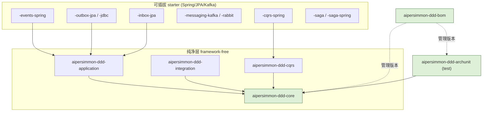
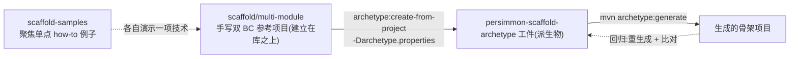

# aipersimmon-ddd 库 + Maven-archetype 脚手架：最终形态与 Phase 1 设计

把分析阶段的结论落成**可构建的设计**。承接 [[analysis-00006-ddd-building-blocks-library]]
（构件库按 Layer × 可插拔性切分、参考不依赖、拓扑无关）、[[analysis-00007-saga-process-manager]]
（saga 分档）、[[analysis-00004-bounded-context-module-structure]]（三种拓扑）、
[[decision-00005-package-per-aggregate]]（domain 包结构)。

分析阶段结束,`bc-and-layer-samples/` 是分析期 demo,**最终删除**——由 archetype + scaffold-samples 取代。

## 一、最终形态：mono-repo,三顶层目录,两个独立 reactor

```
<repo root>
├── aipersimmon-ddd/                 [独立 reactor] 发布型 DDD 库(analysis-00006 模块集)
│   ├── pom.xml                      parent + aggregator(framework-free,NOT spring-boot-parent)
│   ├── aipersimmon-ddd-bom/         消费者 import 的 BOM
│   ├── aipersimmon-ddd-core/        纯净:注解 / marker / 基类 / Transitions
│   └── aipersimmon-ddd-archunit/    可复用 ArchUnit 规则(test)
│                                    (-application / -integration / *-starter 后续阶段)
│
├── aipersimmon-ddd-scaffold/        [独立 reactor] 三个**手写参考项目** → 各自派生一个 archetype
│   ├── multi-module/                ← Phase 1:双 BC、可运行的参考项目,create-from-project 的源
│   │   ├── ordering/                BC(多聚合):ordering-{api,domain,application,infrastructure,adapter}
│   │   ├── inventory/               BC(单聚合):inventory-{api,domain,application,infrastructure,adapter}
│   │   └── start/                   @SpringBootApplication 装配双 BC + 架构测试
│   ├── modulith/                    ← Phase 4:单模块 modular monolith(BC/层=包,边界测试期强制)
│   └── microservice/                ← Phase 4:每 BC 独立部署(contracts + 两服务 + e2e),跨服务走 Kafka
│
└── aipersimmon-ddd-scaffold-samples/  一组**聚焦单点 how-to** 的小例子(如"加一个集成事件"
                                        "加 outbox""接一个 saga"),各讲清一件事;不是大而全的应用
```

- **两个 reactor 相互独立**:库与脚手架发布节奏不同,各自 `mvn` 构建;scaffold 通过依赖坐标引用**已发布/已 install** 的库。
- **groupId `com.aipersimmon.ddd`,基础包 `com.aipersimmon.ddd.*`**;生成项目的 groupId/package 由 archetype 属性给(默认 `com.example.app`,创建时可改)。
- **生成的项目"依赖"库 BOM,不拷源码**(analysis-00006 铁律)。
- **CI/CD 发布到 GitHub Packages:后续**,本设计不展开。

## 二、贯穿性设计约束

1. **库 parent 必须 framework-free**:`aipersimmon-ddd/pom.xml` **不继承** `spring-boot-starter-parent`,只设 Java 21 + 插件 + 内部 dependencyManagement。只有后续 `*-spring` starter 才引 Spring。否则 `-core` 不再零依赖,违反 analysis-00006。
2. **版本治理**:`-bom` 管住所有 `aipersimmon-ddd-*` 版本;消费者只 `import` 这一个。
3. **拓扑无关**:同一套库,三种 archetype 复用;差异只在打包与消息传输(analysis-00006 §七)。
6. **参考项目优先用库能力(不手写替代)**:三套 archetype 源(multi-module / modulith / microservice)是"标准范例",凡库已封装的能力一律采用——domain 词汇(`@AggregateRoot`/`@Entity`/`@ValueObject`/`@Repository`/`@Identity`/`Identifier`/`Transitions`)、分层 stereotype(`@*Layer`)、端口(`DomainEvents`/`IntegrationEvents`)、saga、以及 **CQRS**:写用例经 `CommandBus`(`@UseCase` 具体 `CommandHandler`),读用例经 `QueryBus`(`@ReadModel`)。how-to 反之刻意扁平、聚焦单点,不代表标准结构。
4. **Java 21 / Maven 3.9**;编码 UTF-8;`maven.compiler.release=21`。
5. **每个 Java package 必须有 `package-info.java`**:承载包级 Javadoc 与分层 stereotype 注解(`@DomainLayer` 等标注于此),并让"包意图"显式。由 `-archunit` 校验存在性(§5.4)。适用于库、参考项目与生成项目的所有包。

## 三、库 reactor 模块依赖图(analysis-00006 落地)



> 绿色 = **Phase 1 交付**(`-bom` / `-core` / `-archunit`);其余为后续阶段。

## 四、分阶段计划

| 阶段 | 交付 | 说明 |
| --- | --- | --- |
| **Phase 1** | `-bom` → `-core` → `-archunit`(**按此序,一个一个做**)+ `multi-module` archetype + scaffold-samples | 先把"库依赖 + 分层 + arch 校验"跑通;archetype 依赖上述库子集 |
| Phase 2 | `-application` / `-integration` + `-events-spring` / `-outbox` / `-inbox` | 事件与 outbox/inbox 上移进库 |
| **Phase 3 ✅** | `-cqrs(+spring)` / `-saga(+spring)` | CQRS 与 saga 构件(**已交付**,见 §5.10–5.13) |
| **Phase 4 ✅** | `modulith` / `microservice` / CI+GitHub Packages | 全部交付并验证生成 `com.acme.shop` 全绿:`modulith`(单模块 modular monolith,边界测试期强制);`microservice`(`contracts` 共享契约 + `ordering-service`/`inventory-service` 独立部署 + `e2e-tests`,跨服务走 outbox→Kafka→inbox,EmbeddedKafka 端到端 2/2);CI(`ci.yml` 构建库+三脚手架+样例)+ 发布(`publish-library.yml` + `distributionManagement` → GitHub Packages) |

**依赖顺序注意**:archetype 生成的项目要能解析 `aipersimmon-ddd-*`,故库子集必须先 `mvn install` 到本地 `.m2`。Phase 1 内部次序:①库 `bom→core→archunit`;②**手写双 BC 参考项目 `scaffold/multi-module`**(建立在库之上);③从它 `create-from-project` 派生 archetype 并验证生成/回归;④按需补 `scaffold-samples` 的聚焦 how-to 例子。

## 五、库模块详细设计(Phase 1:5.1–5.4;Phase 2:5.5–5.9;Phase 3:5.10–5.13)

### 5.1 `aipersimmon-ddd/pom.xml`(parent + aggregator)

- `groupId=com.aipersimmon.ddd`、`artifactId=aipersimmon-ddd-parent`、`version=0.1.0-SNAPSHOT`、`packaging=pom`。
- **不继承** spring-boot-parent。`properties`:`maven.compiler.release=21`、`project.build.sourceEncoding=UTF-8`、`archunit.version`。
- `dependencyManagement`:声明 `archunit-junit5`(供 `-archunit` 用),内部模块版本用 `${project.version}`。
- `modules`:随阶段追加。Phase 1 逐步为 `aipersimmon-ddd-bom` → `+core` → `+archunit`。

### 5.2 `aipersimmon-ddd-bom`(第一步)

- `packaging=pom`,parent 指向上面的 parent。
- `dependencyManagement` 列出 Phase-1 构件坐标(`-core`、`-archunit`,版本 `${project.version}`);后续模块随阶段追加。
- 消费者(生成项目)`<dependencyManagement><scope>import</scope>` 引它即可对齐版本。

### 5.3 `aipersimmon-ddd-core`(第二步,零依赖)

包结构(承接 analysis-00006 §三 + §十):

```
com.aipersimmon.ddd.core
├── annotation/    @AggregateRoot @Entity @ValueObject @Repository @Identity @DomainEvent @Service
├── architecture/  @DomainLayer @ApplicationLayer @InfrastructureLayer @InterfaceLayer  (hexagonal 可选)
├── model/         AggregateRoot<ID>  Entity<ID>  Identifier  Association<T,ID>  AbstractAggregateRoot
├── event/         DomainEvent (marker)
├── state/         Transitions<S>  IllegalStateTransitionException   (analysis-00006 §十)
└── exception/     DomainException
```

- `AbstractAggregateRoot`:迁移 repo 现有 `shared-kernel/AggregateRoot`(事件登记/清空)并验证零 framework 依赖。
- `Transitions<S>`:analysis-00006 §十 已给出完整实现与 demo,直接落地。
- **`pom.xml` 无任何 `dependencies`**(除测试 `junit-jupiter`)——这是 `-core` 的验收红线。

### 5.4 `aipersimmon-ddd-archunit`(第三步)

- 依赖 `-core`(识别注解/marker)+ `archunit-junit5`(**compile** 依赖,消费者以 test scope 引 `-archunit` 即可传递获得)。
- 提供可复用 `ArchRule` 常量 + 一个便捷聚合入口(如 `AiPersimmonDddRules.all(basePackage)`),规则集(analysis-00006 §六):
  - domain 不得依赖 application / infrastructure / adapter / 任何 framework;
  - 跨聚合只经 `Association` / `Identifier` 引用聚合根;
  - `IntegrationEvent` 只在 `*-api`;`DomainEvent` 不得泄漏到 adapter。
  - **每个 package 必须有 `package-info.java`**(§二 规约 5)。
- 消费项目写一个 `ArchitectureTest`,按其分层包命名约定套用规则。

---

**Phase 2 起,parent 的 `dependencyManagement` import `spring-boot-dependencies` BOM(3.5.10)**,让 starter 依赖 Spring/JPA/Jackson 时无需自己钉版本;**纯层不受影响**——import BOM 只管版本、不引入依赖,`-core`/`-application`/`-integration` 仍零框架。

### 5.5 `aipersimmon-ddd-application`(纯,→ `-core`)

- `DomainEvents` 发布 port(`publish` / `publishAll`);`@UseCase` 标记;`ApplicationException` 基类。零框架(仅 test junit)。
- `DomainEvents` 与参考项目本地内联的同名 port **签名一致**,便于日后回收。

### 5.6 `aipersimmon-ddd-integration`(纯,零依赖)

- `IntegrationEvent` 标记(区别于 `-core` 的 `DomainEvent`);`EventEnvelope<T extends IntegrationEvent>`(`eventId`/`type`/`version`/`occurredAt`/`traceId`/`payload`),**构造即校验**;版本化契约约定写入 Javadoc。
- **纯数据持有**:不做序列化、不取时钟/随机——由 infra starter 在封装时盖章。

> **事件传输总览(需求)**:**领域事件只有同步进程内**;**集成事件三种方式**,共用 `IntegrationEvents` port,换实现即切换:
> - **方式一 进程内同步** → `SpringIntegrationEvents`(§5.7,`ApplicationEventPublisher`,无 outbox)。
> - **方式二 进程内异步 + outbox/inbox** → `OutboxWriter` + **进程内** `OutboxDispatcher`(§5.8)+ `Inbox`(§5.9)。
> - **方式三 broker + outbox/inbox** → `OutboxWriter` + **broker** `OutboxDispatcher`(`-messaging-kafka`,**已交付**,见 §5.14)+ 消费端 `Inbox`。

### 5.7 `aipersimmon-ddd-events-spring`(starter,→ `-application` + `-integration` + Spring)

- **领域事件**:`SpringDomainEvents`(委托 `ApplicationEventPublisher`);Boot 自动装配(`AutoConfiguration.imports`),引入即生效。
- **集成事件·方式一(进程内同步)**:`SpringIntegrationEvents`(同样委托 `ApplicationEventPublisher`)。自动装配用 `@ConditionalOnMissingBean(IntegrationEvents)` + `@ConditionalOnMissingClass(OutboxWriter)` 守卫——**仅当 outbox 不在 classpath 时兜底**,保证"outbox 在→走 outbox"的确定性,用户始终可自定义 bean 覆盖。
- **语义(承接 analysis-00001):默认同步、同线程、同事务**——发布在 `@Transactional` 内调用,`@EventListener` 处理器内联执行、与聚合原子提交。领域事件**此处不可异步**。
- 消费者用 `@EventListener` / `@TransactionalEventListener` 注册处理器。

### 5.8 `aipersimmon-ddd-outbox-jdbc`(starter,→ `-application` + `-integration` + `spring-boot-starter-jdbc` + Jackson)

> **实现阶段发现**:库里放 JPA `@Entity` 有"实体扫描覆盖"陷阱——库的 `@EntityScan` 会让使用者靠默认扫描的自有实体失效。故**先做 `-outbox-jdbc`**(`JdbcTemplate`,无 `@Entity`/`@EntityScan`,零扫描冲突);`-outbox-jpa` 作为后续变体。发布 port `IntegrationEvents` 已加到 `-application`。

- **事务性 outbox**:集成事件与聚合变更**同事务**写入 `aipersimmon_outbox` 表;relay 轮询未发送行,发到 broker,置 `sent`。**at-least-once**(dispatch 后置 sent 前崩溃会重投 → 消费方需幂等)。
- 组件:
  - 表 `aipersimmon_outbox`:`id`/`event_id`(唯一)/`type`/`version`/`payload`(JSON)/`occurred_at`/`trace_id`/`sent`/`sent_at`/`attempts`/`created_at`。建表由消费者(Flyway/Liquibase)负责;主包附**非自动执行**的样例 DDL(`META-INF/aipersimmon-ddd/outbox-schema.sql`),测试用 `schema.sql`(H2)。
  - `OutboxWriter implements IntegrationEvents`:盖章 `EventEnvelope`(eventId=UUID、type=类全名、version=1、occurredAt=now)→ Jackson 序列化 payload → **当前事务** `JdbcTemplate` 插入一行。
  - `OutboxRelay`:`@Scheduled` 轮询未发送行 → 交给 **broker 发布 port `OutboxDispatcher`** → 逐行置 `sent`;失败留待下轮 + `attempts++`。
  - `OutboxDispatcher` port,三个实现选一(决定方式二/三):
    - **默认 `LoggingOutboxDispatcher`**(`@ConditionalOnMissingBean`,开箱即用,只记日志)。
    - **`InProcessOutboxDispatcher`(方式二)**:属性 `aipersimmon.ddd.outbox.dispatch=in-process` 启用;按 `type` 反序列化 payload 后 `ApplicationEventPublisher.publishEvent`,投递给进程内 `@EventListener`——outbox 变成"进程内异步"传输(生产者只在其事务里写 outbox,relay 异步投递本地消费者;配 `Inbox` 幂等)。
    - **broker dispatcher(方式三)**:由后续 `-messaging-kafka` 提供,覆盖默认。
  - `AipersimmonDddOutboxAutoConfiguration`:`@AutoConfiguration(after=JdbcTemplateAutoConfiguration)` + `@EnableScheduling`;各 bean 用 `@ConditionalOnBean(JdbcTemplate)` / `@ConditionalOnMissingBean` / `@ConditionalOnProperty` 守卫。
- 决策:序列化 = Jackson;relay = `@Scheduled`(可配 `poll-delay-ms`/`batch-size`);broker = port;暂无 DLQ/最大重试(留 `attempts` 观测)。

### 5.9 `aipersimmon-ddd-inbox-jdbc`(starter,→ `-application` + `spring-boot-starter-jdbc`)

> 与 outbox 同理,做成 JDBC(无 `@Entity`/`@EntityScan`,零扫描冲突);`-inbox-jpa` 后续变体。

- **幂等消费**:`aipersimmon_inbox` 表以 `message_key` 为唯一主键记录已处理消息;消费在**同事务**内先调 `Inbox.alreadyProcessed(key)`——首次插入成功(返回 false,继续处理),重投时唯一键冲突(返回 true,跳过)。失败回滚则记录一并回滚,可重试。
- 组件:`Inbox` port(放 `-application`);`JdbcInbox`(靠唯一键 + `DuplicateKeyException` 判重);`AipersimmonDddInboxAutoConfiguration`(`@ConditionalOnBean(JdbcTemplate)`/`@ConditionalOnMissingBean`)。建表由消费者负责,主包附非自动执行样例 DDL。
- 去重键 = 集成事件 `eventId`(来自 `EventEnvelope`)。

> **参考项目采纳(留待决定,倾向)**:`multi-module` base 保持内存 + 进程内(精简、可跑);starter 的用法由 `scaffold-samples` 的聚焦 how-to 演示("迁移到 outbox / events / inbox"),不把 base 参考项目复杂化。

### 5.10 `aipersimmon-ddd-cqrs`(纯,可选,→ `-core`)

承接 [[analysis-00006-ddd-building-blocks-library]] §五(纯/脏分离、CQRS 整体可选)。framework-free,只依赖 `-core`。

- **写侧**:`Command<R>` / `CommandHandler<C,R>`(薄 handler)/ `CommandBus.send`;`CommandInterceptor` 环绕 SPI(`Invocation<R>.proceed()` + `order()`,越小越外层)。
- **读侧**:`Query<R>` / `QueryHandler<Q,R>` / `QueryBus.ask`;`@ReadModel` / `@Projection` stereotype。
- **横切抽象**:`UnitOfWork`(事务边界 port);`AggregateCollector`(收集本次命令触碰的聚合,供集中 drain 事件——补 JDBC/MyBatis 无 ChangeTracker,analysis-00005 §5 的务实点)。
- 测试:契约级(泛型可组合 + 拦截器环绕/排序 + `UnitOfWork` 默认重载),3/3。

### 5.11 `aipersimmon-ddd-cqrs-spring`(starter,可选,→ `-cqrs` + `-application` + Spring)

analysis-00006 §五的实现侧(装饰器链 Logging→Validation→Transaction,`TransactionTemplate` 接管 UnitOfWork,每请求 AggregateCollector)。

- `RegistryCommandBus` / `RegistryQueryBus`:按 handler 泛型签名(`ResolvableType`)索引命令/查询类型;**handler 须是具体类**(lambda 会擦除泛型,无法索引)。
- 内置拦截器:`LoggingCommandInterceptor`(order 0)、`ValidationCommandInterceptor`(order 100,`@ConditionalOnClass/Bean(Validator)`,Bean Validation 存在才装配)、`TransactionCommandInterceptor`(order 200,在事务内跑 handler 并**同事务** drain `AggregateCollector` 收集聚合的领域事件经 `DomainEvents` 发布;无 `DomainEvents` 时只提供事务边界)。
- `ThreadLocalAggregateCollector`(线程域,非 web 也可用)、`TransactionTemplateUnitOfWork`。
- `AipersimmonDddCqrsAutoConfiguration`:`@ConditionalOnMissingBean` 全可覆盖;`@AutoConfiguration(after = {DataSourceTransactionManager/Transaction/ValidationAutoConfiguration})` 以正确评估 `@ConditionalOnBean`。测试:端到端(happy / 失败回滚且不 drain / 校验先于事务拒绝 / 查询侧),4/4。

### 5.12 `aipersimmon-ddd-saga`(纯,可选,→ `-core`)

承接 [[analysis-00007-saga-process-manager]] §六(借 Axon"标记 + 关联路由 + 生命周期 + deadline"四样形态,放弃 ES/Server)。framework-free。

- `@ProcessManager` stereotype;`SagaState`(基类:`correlationId` 关联路由 + `SagaStatus` 生命周期守卫 + 乐观锁 `version`;状态 `RUNNING→COMPENSATING→ABORTED` / `RUNNING→COMPLETED`,非法迁移抛错);`SagaStatus`。
- `Deadline`(correlationId + name + fireAt 的"到点回调");`SagaStore<S>` 按 correlationId 存取(乐观锁语义);`DeadlineScheduler`(登记/取消)+ `DeadlineHandler`(到点回调 SPI)。
- 测试:`SagaState` 关联/生命周期/乐观锁 version,6/6。

### 5.13 `aipersimmon-ddd-saga-spring`(starter,可选,→ `-saga` + `spring-boot-starter-jdbc`)

analysis-00007 §六实现侧(把 s2 的 `PendingOrderTimeoutScanner` 抽象成通用 DeadlineManager;SagaStore 含乐观锁)。

- **DeadlineScheduler 两实现,按 `aipersimmon.ddd.saga.deadline.store` 选**:
  - `SchedulingDeadlineScheduler`(默认 `in-process`):`TaskScheduler` 支撑,到点派发给 `DeadlineHandler`,可按 (correlationId,name) 取消。简单无 broker,但**进程内 = 重启丢定时器**、单节点。
  - `JdbcDeadlineScheduler`(`jdbc`):把 deadline 存表(`aipersimmon_deadline`),`@Scheduled` 轮询到点行→派发→删除,失败留行下轮重试(**at-least-once**,与 outbox 同构)。**重启不丢、可多实例**;触发有轮询延迟、可能多次触发,故 handler 需幂等——saga 生命周期守卫(`isActive`)天然提供。附非自动执行样例 DDL。
- `JdbcSagaStore<S>`(**抽象基类**):自持 correlation 查询 + 版本化 upsert + 乐观锁校验(冲突抛 Spring `OptimisticLockingFailureException`);把**具体聚合↔列的映射**(`mapRow`/`serializeData`)留给 BC 子类**手写**(承接 repo `*Po`/`*Mapper` 显式映射哲学,避免泛型反射序列化的脆弱)。附非自动执行样例 DDL。
- `AipersimmonDddSagaAutoConfiguration`:有 `DeadlineHandler` bean 时装配 scheduler,缺 `TaskScheduler` 时补一个单线程的;`SagaStore` **不自动装配**(BC 子类化后自注册为 bean)。测试:scheduler 触发/取消(2)+ JdbcSagaStore 插入/推进/乐观锁冲突(3),5/5。

> **本阶段落地取舍(诚实记录)**:saga-spring 的 `SagaStore` 实现选**抽象 JDBC 基类 + BC 手写映射**,而非泛型 JSON 自动序列化——因 `SagaState` 子类构造器难被通用反序列化(需 `-parameters`/`@JsonCreator`),泛型全自动 store 脆弱。`DeadlineScheduler` 进程内与 **DB-poll 持久化(`JdbcDeadlineScheduler`,已交付)** 两实现按属性可选。**留待后续**:saga 经 `-cqrs` CommandBus 发命令 + 经 `-outbox` 可靠外发的组合、`-saga-jpa`。

### 5.14 `aipersimmon-ddd-messaging-kafka`(starter,可选,→ `-outbox-jdbc` + spring-kafka)

集成事件**方式三(broker)**的落地(承接 §5.6 传输总览、[[analysis-00002-domain-vs-integration-events]])。**建立在 outbox 之上,不替代它**:

- **生产侧** `KafkaOutboxDispatcher implements OutboxDispatcher`:把 outbox 行发到 Kafka topic(key=eventId,value=payload JSON,信封元数据走 headers `IntegrationEventHeaders`);**阻塞等 broker ack** 才返回,失败抛错 → relay 不标记已发 → 下轮重试(at-least-once)。作为 `OutboxDispatcher` bean **自动顶替**日志默认实现(autoconfig `before` outbox autoconfig + `@ConditionalOnMissingBean`)。
- **消费侧(可选,`consumer.enabled=true`)** `KafkaIntegrationEventListener`:`@KafkaListener` 消费 topic,按 eventId 经 `Inbox` 去重(**同事务**),再用 type header + payload 重建事件、经 `ApplicationEventPublisher` **进程内重投**给本地 `@EventListener`——即"message 的 inbox"半边。无 `Inbox` 时不去重(要求处理器自身幂等)。
- 配置 `KafkaMessagingProperties`(`aipersimmon.ddd.messaging.kafka.topic` / `consumer.enabled`)。测试**不依赖实时 broker**:验证 dispatch 映射与失败传播、消费端重建+幂等去重、autoconfig 装配(7/7)。实时 broker 的端到端集成测试归消费方应用。

## 六、脚手架设计(`multi-module`)

**约定:archetype 从我们自己手写的参考项目 `aipersimmon-ddd-scaffold/multi-module` 派生,不碰只读的 `bc-and-layer-samples`(后者可读作知识参考,但不作输入、不提炼、不复制)。**



- **参考项目 `multi-module`(archetype 的源,真相源)**:一个**手写、可运行的双 BC** 多模块 DDD 项目,建立在 `aipersimmon-ddd-*`(BOM + core + archunit)之上,遵循 [[decision-00005-package-per-aggregate]] 的包结构。它**先由人手写**(可参考只读的 `bc-and-layer-samples`,但不复制),是 `create-from-project` 的**唯一输入**。
  - **两个 BC,至少一个多聚合**:`ordering`(多聚合:`Order` + `Customer`)、`inventory`(单聚合:`Stock`)。单 BC 不足以表达 BC 边界与跨 BC 协作。
  - **目录嵌套 `<bc>/<bc>-<layer>`,且 BC 目录是聚合 pom**:每个 BC 一个目录含一个聚合 `pom.xml`(`packaging=pom`,列出该 BC 的五层模块),根 pom 只列 `ordering` / `inventory` / `start`。**不可**用扁平的 `ordering-adapter`(退化的单 BC 写法)。BC 目录必须是**有 pom 的聚合模块**——否则 `create-from-project` 无法处理"无 pom 的分组目录"(见下)。
  - **内部模块依赖用 `${project.groupId}` / `${project.version}`**(reactor groupId 无关),而非写死 `com.example`——否则派生出的 archetype 生成项目时内部依赖仍指向 `com.example`(见下)。
  - **跨 BC 走进程内集成事件 + orchestration saga**(模块化单体,一个可部署单元):`ordering` 下单→发 `OrderPlaced`(ordering-api)→`inventory` 进程内预留并回报结果事件(`StockReserved` / `StockReservationFailed`,inventory-api)→`ordering` 的 **order-fulfilment 过程管理器**(`OrderFulfilment`,持 `OrderFulfilmentSaga` 中心状态,内存 `SagaStore`)据此**确认**或**补偿(取消订单)**。跨 BC **只经对方 `*-api`**。相较早期的无状态 `StockReservedListener`(choreography),此为**编排**:中心状态 + 显式补偿分支;deadline/超时不在同步进程内演示(见 scaffold-samples `orchestrate-with-saga`)。broker/outbox/幂等留后续阶段。**写/读用例经 CQRS 总线**:控制器与 saga 经 `CommandBus` 发 `PlaceOrder`/`ConfirmOrder`/`CancelOrder`、inventory 监听器发 `ReserveStock`(各 `@UseCase` `CommandHandler`),读经 `QueryBus`(`FindOrder`→`@ReadModel` `OrderSnapshot`)。multi-module 无事务管理器(内存仓储)→ 命令总线仅路由+日志、无事务/嵌套隐患;microservice 有 DataSource → 命令总线含事务拦截器,跨服务异步(Kafka)天然无嵌套。三套拓扑一致。
- **archetype 工件(派生物,已验证)**:`mvn archetype:create-from-project -Darchetype.properties=./archetype.properties` 从 `multi-module` 派生;`archetype.properties` 指定派生工件坐标 `com.ryan.persimmon:persimmon-scaffold-archetype:0.0.1-SNAPSHOT` 与 `excludePatterns`(`**/target/**` 等)。随后 `mvn -f target/generated-sources/archetype/pom.xml install`。**`multi-module` 是真相源,archetype 是派生物**——改流程是改 `multi-module` 后重派生(archetype 产物在 `target/`,不提交)。
  - **两处 create-from-project 落地发现**:①它无法处理"无 pom 的分组目录"→ 把 BC 目录做成聚合 pom(上一条),派生的 `archetype-metadata.xml` 才正确嵌套。②它**不模板化依赖里的 groupId** → 内部依赖改用 `${project.groupId}`(上一条),生成项目才在使用者的 groupId 下解析成功。
  - **端到端验证**:从 archetype 生成 `com.acme.shop`(package `com.acme.shop`)后 `mvn test` 全绿(含 `OrderingFlowTest` 跨 BC 闭环),无 `com.example` 残留。
- **`scaffold-samples`**:一组**聚焦单点 how-to** 的小例子,各只讲清一件事(如"加一个集成事件与进程内处理""加 outbox""接一个 saga""加 CQRS 读模型"),便于查阅与复制,而非再造一个大而全的应用。完整的双 BC 结构表达已由 `multi-module` 承担。

## 七、后果与开放项

- **后果**:分析→设计落地;库与脚手架解耦;生成项目靠 BOM 版本升级;`bc-and-layer-samples` 在 scaffold-samples 就绪后删除。
- **开放项**:
  1. ~~archetype 骨架产出几个 BC~~ **已定:双 BC(ordering 多聚合 + inventory 单聚合),嵌套目录,跨 BC 走进程内集成事件**。单 BC 表达力不足;完整结构由 multi-module 承担,scaffold-samples 转为聚焦单点 how-to。
  2. `-archunit` 的规则如何参数化消费者的分层包命名(约定 vs 显式传参)?Phase 1 落地时定。
  3. ~~GitHub Packages 发布与 CI/CD 的具体形态(Phase 4)~~ **已交付**:`.github/workflows/ci.yml`(装库→建脚手架/样例)、`publish-library.yml`(release/手动触发 → `mvn deploy` 库到 GitHub Packages,`setup-java` 配 `github` server + `GITHUB_TOKEN`)、库 parent `distributionManagement`(repo id `github`)。消费者需在自己的 Maven 配置加同一 GitHub Packages 仓库并鉴权。
  4. ~~**集成事件方式三(broker)**:`-messaging-kafka`~~ **已交付(§5.14)**:Kafka `OutboxDispatcher` + inbox 守卫的进程内消费桥;实时 broker 端到端集成测试归消费方应用,库内为无 broker 的单元/装配测试。
  5. **saga 深化(Phase 3 之后)**:~~持久化 `DeadlineScheduler`(DB-poll)~~ **已交付**(`JdbcDeadlineScheduler`,`store=jdbc` 选,at-least-once 轮询,重启不丢/可多实例);~~saga 经 `-cqrs` CommandBus 发命令 + `-outbox` 可靠外发的组合样例~~ **已交付**(scaffold-samples `saga-commands-and-outbox`:process manager 经 CommandBus 发 `ReserveStock`/`ConfirmOrder`/`CancelOrder`,handler 同事务经 outbox 可靠外发,relay 进程内重投闭环;含"失败回滚不外发"原子性验证)。待做:`-saga-jpa`;JPA 变体 `-outbox-jpa` / `-inbox-jpa`。
  7. **`microservice` 拓扑落地要点(已交付)**:每 BC 独立部署,跨服务**只经 Kafka**(outbox→Kafka→inbox 守卫的消费桥→进程内重投)。选**共享 `contracts` 模块**(两服务同依赖 → 事件类 FQN 一致 → 库的消费桥 `Class.forName` 直接可用,无需库改动)。**落地发现**:e2e 同一 JVM 启两服务时,两服务 jar 的 `application.properties` 在同一 classpath 根**冲突**(后启的服务错读前者配置);修法 = e2e 用各服务专属 `spring.config.name`(`ordering-e2e`/`inventory-e2e`),各服务自身的 `application.properties` 保持不变(独立部署/生成项目仍正确)。单主题 + 各服务独立消费组:每方收到全量、只对自己关心的事件反应。
  6. ~~**scaffold-samples 补 how-to**:"接一个 saga""加 CQRS 读模型""集成事件走 Kafka"~~ **已交付**:`add-cqrs-read-model`(命令管道+读模型)、`orchestrate-with-saga`(process manager + deadline + 补偿)、`integration-events-over-kafka`(outbox→Kafka→inbox→进程内,EmbeddedKafka 端到端)。**落地时修了库两处装配缺陷**:saga-spring 的 `DeadlineScheduler`↔`DeadlineHandler` 构造循环(改 scheduler 惰性 `Supplier<DeadlineHandler>` 解析);messaging-kafka autoconfig 未 `after = KafkaAutoConfiguration`,致 `@ConditionalOnBean(KafkaTemplate)` 早评估、Kafka dispatcher 未顶替日志默认(已修)。**`multi-module` 已改为 orchestration saga**(`OrderFulfilment` 过程管理器 + `OrderFulfilmentSaga` 中心状态 + 内存 `SagaStore`,`StockReserved` 确认 / `StockReservationFailed` 补偿取消);archetype 重新派生并验证生成 `com.acme.shop` 全绿(含补偿分支)。

## Sources

内部:
- [[analysis-00006-ddd-building-blocks-library]] —— 模块切分、参考不依赖、CQRS、§十 `Transitions<S>`。
- [[analysis-00007-saga-process-manager]] —— saga 分档(Phase 3)。
- [[analysis-00004-bounded-context-module-structure]] —— 三种拓扑与 "ship one worked BC"。
- [[decision-00005-package-per-aggregate]] —— domain 包结构(archetype 骨架遵循)。

外部:
- Maven Archetype —— Guide to Creating Archetypes / `archetype:create-from-project`。https://maven.apache.org/guides/mini/guide-creating-archetypes.html
- Maven —— Introduction to the Dependency Mechanism(BOM / `import` scope)。https://maven.apache.org/guides/introduction/introduction-to-dependency-mechanism.html
- GitHub Packages —— Apache Maven registry。https://docs.github.com/packages/working-with-a-github-packages-registry/working-with-the-apache-maven-registry
