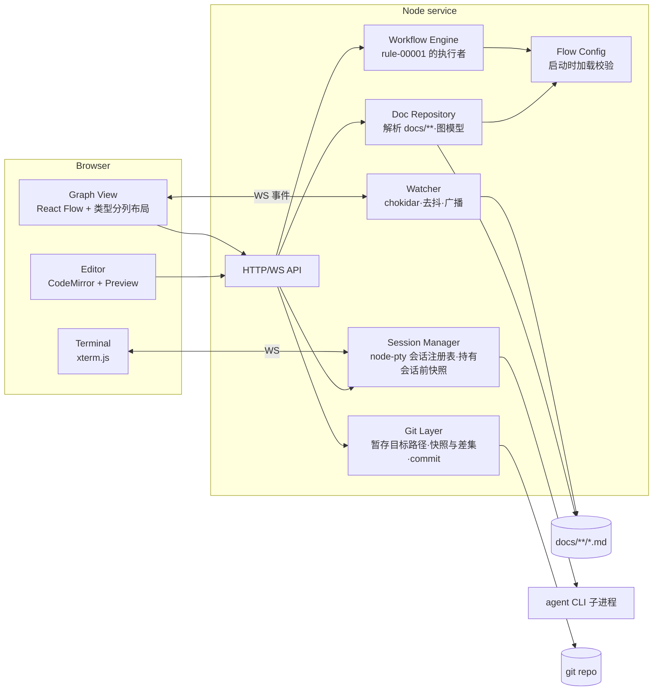
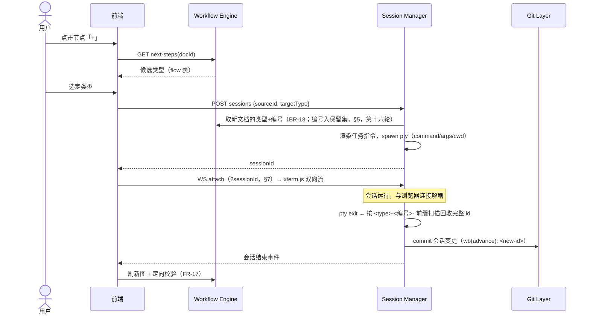
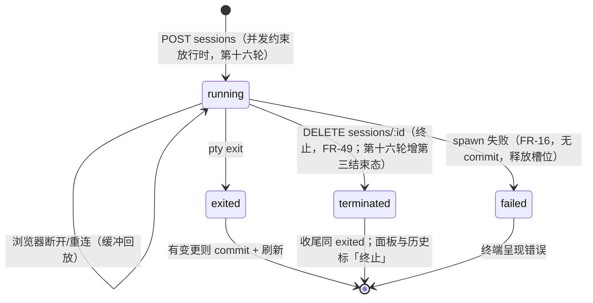

# Design: Docs 白板 MVP

> 一个本地 Node 服务 + 浏览器前端：文件是唯一事实来源，服务端持有解析、裁决、
> 会话与 git 四个能力，前端只做呈现与交互。

## 1. 形态与技术选型

单进程本地服务（Node.js + TypeScript），托管前端静态资源并暴露 HTTP/WebSocket
接口；浏览器访问 `localhost`。选型及理由：

| 关切 | 选型 | 理由 |
| --- | --- | --- |
| 服务端 | Node.js + TypeScript | PTY（node-pty）与前端同栈；单进程即可承载 MVP |
| 前端画布 | React + React Flow | 节点/边/浮窗交互开箱即用 |
| 自动布局 | 自有的类型分列布局（同步纯函数） | 列＝类型、行＝id 序，位置可预期；从关系边推导层次的算法（ELK/dagre）做不到这件事，且会把阶段流画反——取舍见 `decision-00002-whiteboard-layout` |
| 编辑器 | CodeMirror 6（markdown 模式） | 纯文本可靠；编辑的是整文件原文，front matter 可见可改（异常节点靠它修复） |
| 预览渲染 | react-markdown 10 + remark-gfm 4 | remark/rehype 生态的默认 React 渲染器；不启用 `rehype-raw` 时丢弃原始 HTML，承接 FR-24 |
| 图表 | mermaid 11 | 与 `docs/` 里既有的 mermaid 图同源（`docs/design/README.md` 的 Guideline 即 "Prefer Mermaid"），无需第二套语法 |
| 内嵌终端 | xterm.js ↔ WebSocket ↔ node-pty | 事实标准的 PTY 通道 |
| front matter 解析 | gray-matter | 容错好；仅用于读——写回见 §6 |
| git | simple-git | 只需 add/commit/log 的薄封装 |
| 文件监听 | chokidar | 外部修改推送刷新 |

## 2. 模块结构



- **Doc Repository**：扫描 `docs/**/*.md`（排除 `README.md`、`TEMPLATE.md`），
  产出图模型 `{nodes, edges, issues}`；类型集与关系字段集取自流程配置，front
  matter 缺失/非法、断链（无法解析的引用——可解析的细粒度引用不算，见下）进
  `issues` 并在节点/边上打异常标记（spec FR-1/FR-2 的载体）。节点标题取正文
  首个 H1，缺失取文件名。
  **第四轮起它还解析文档正文的需求条目**：spec 的 `FR`、rule 的 `BR` 及各自的
  AC——列表项与决策表行两种声明形态都认，AC 按其标注的「(所验条目 id)」归属；
  并从 record 解析**验收行**（验收清单表格中首列为被验 id、含测试与结果列的
  行），在服务端推导覆盖三态（spec FR-31…FR-33 的载体，口径见
  decision-00004 §5）——前端不自行推导。关系目标的解析随 FR-2 的修订变为两段：
  先按文档 id，再按需求条目/AC id 落到其**所属文档**（边保留所声明的原始 id），
  二者皆不中才是异常。（BR-18 保证「类型+编号」唯一，文档 id 与条目 id 语法上
  也不同形，两段不会同时命中——次序只是防御性规定。）
  **第六轮起（decision-00005）**：正文解析由行级正则升级为 **remark AST** 遍历，
  行为契约不变（既有测试为回归护栏），AST 的位置信息供诊断定位到行；解析同时
  按各文件夹 README 的「机器可读形态」小节校验，产出**解析诊断**（疑似条目而
  不合形态、验收清单的不合式行、无法归属——spec FR-40 的载体），随图与
  `/items` 下发。
- **Workflow Engine**：唯一的裁决点。状态流转候选、接收裁决、澄清与答疑的
  发起裁决（status、可澄清类型、并发约束（同文档互斥 + 总数上限，第十六轮
  由单会话约束改写）——第八轮起澄清是会话不是写回，
  decision-00006）、审计的发起裁决（status 为 `draft` 且类型可审计——第十轮，
  decision-00007）、plan 的 **resolved 门**（第十轮，spec FR-52：按 BR-24 从
  `implements` 解析交付范围，把证据限定为 `parent` 指向该 plan 的 record 后，
  复用 Doc Repository 的**同一**覆盖推导判定每个条目——推导函数以 record 集
  为入参，门只是换了证据集，口径与 `/items` 永不相异）、下一步候选、新文档
  id 中「类型 + 编号」的分配（BR-18；slug 由 agent 自取）全部在服务端计算，
  前端从不自行判断（spec FR-6…FR-10 的载体）。流转表（BR-2…BR-9）、可澄清
  类型集（BR-20）、可审计类型集（BR-23）与 resolved 门（BR-24、BR-25）由
  代码内建，不进配置；配置承载的是类型二分、产品流（BR-1、BR-13…BR-17，
  第十轮起含 `plan → issue/record`）与每个可澄清类型的焦点行（spec FR-48）。
  **治理轮（spec-00002）：状态流转通路上再加两道门**，二者与 resolved 门同处
  一地——`docService.changeStatus` 里 `assertScopeVerified` 所在的那一段：先由
  `applyStatusChange`（workflow.ts，纯函数）按流转表算出新正文，再依次过门，
  全部通过才写盘。放这里而不是放进 `applyStatusChange`，理由是归档门要读**全仓
  的 front matter 声明**，而 `DocService` 是唯一同时持有图与「刚重读的那份原文」
  的地方；三道门写在同一个函数里，`spec-00002-FR-1` 的「不得有一条通路绕过」
  才是读一个函数就能核的事。**以下两条内不带前缀的 `AC-n.m` 一律指
  `spec-00002`。**
  - **促进门**（`spec-00002-FR-1`/`FR-2`，`rule-00001-BR-12`）：来源为 `draft`
    且目标为该种类的促进态（living 的 `active`、work 的 `open`，取
    `statusRules.promotedStatus(kind)`）时，对**刚重读的整文件原文**调用
    `workflow.hasOpenQuestions`——与 `applyAccept` 调用的是同一个函数、同一个
    入参形态（两条通路都从 `readOrConflict` 取 content）。「未决」因此只有一处
    定义，两条通路不可能给出不同结论（`spec-00002-AC-1.7`）；日后改判定只改
    `hasOpenQuestions`，不动任何一道门。条件写成「目标是促进态」而不是「目标非
    draft」，`draft → archived`、work 的 `draft → wontfix` 与 `open → resolved`、
    living 的 `active → draft`（修订轮）因此自然不经此门（`FR-2`）。
  - **归档门**（`spec-00002-FR-3`/`FR-4`，`rule-00001-BR-19`）：目标为
    `archived` 时，在全图中找**另一份**文档的 front matter `supersedes` 列出该
    文档 id。三条判定细节写在设计里而非留给实现：
    1. **读声明，不读健康**——候选不按 `node.ok` 过滤，异常节点的 `supersedes`
       照样算数（`AC-4.6`）。这与 `toEdges` 里 `knownIds` 只收 `ok` 节点是**有意
       的不一致**：边解析问的是「目标是不是一份可用的文档」，配对只问「有没有
       另一份文档声明过替代」。边界一句：front matter **整体不可解析**的文件
       `doc.data` 为空，读不出任何 `supersedes`，故它不配对任何人——这不是本门
       的例外，是「读声明」在没有声明时的自然结果。
    2. **「另一份」按文件路径判，不按 id 判**（`node.path !== candidate.path`）：
       自己的 `supersedes` 不构成对自己的配对（`AC-4.3`），而路径是每份文档唯一
       的键——撞 id 时 id 不是（见下条 Doc Repository）。
    3. 不区分替代文档的类型与 status（`AC-4.1`、`AC-4.2`）；一份文档列出多个
       被替代 id、多份文档同列一个被替代 id 都成立（`AC-4.5`、`AC-4.4`）。
    已知后果，记明不修：`DocNode.relations` 的键取自流程配置的 `relations`，
    配置若不声明 `supersedes`，本门将永远找不到配对、一切归档都到不了。本轮不为
    它加启动校验（`spec-00002-FR-6` 未列该项），留给 plan 轮判断是否补。
- **Editor**：编辑与预览是同一份正文的两个视图——预览渲染的是编辑器**当前
  缓冲区**而非磁盘内容，切换不落盘也不丢改动（spec FR-22）。预览时 CodeMirror
  视图只隐藏、不卸载，光标与滚动位置因此保留（spec FR-25）。渲染前剥掉 front
  matter：编辑器持有整文件（front matter 要可见可改），但 `---` 块作为 Markdown
  会渲染成分隔线加 setext 标题。`mermaid` 代码块由 react-markdown 的
  `components` 钩子截获后交给 `mermaid.render()`，每个图独立渲染，一个图失败
  只坏一个图（spec FR-23）。FR-24 由两件事共同保证：不启用 `rehype-raw`，
  文档中的原始 HTML 被丢弃；mermaid 以 `securityLevel: 'strict'` 初始化，它产出
  并经 innerHTML 注入的 SVG 由它自己消毒——这条通路是 `rehype-raw` 那一半论证
  覆盖不到的。
- **Session Manager**：会话注册表——**多会话，键为会话 id，容量
  `max_sessions`**（第十六轮随 decision-00009 由单例槽位改写；并发约束
  见 §5），生命周期与浏览器连接解耦（spec FR-21）；每会话各自持有 PTY 与
  最近 1 MB 的滚动缓冲，重连与切换时回放——「此前输出」的完整性以该窗口
  为限。**第十一轮起（decision-00008）**：会话
  收尾时把元数据落盘 `.whiteboard/sessions/<会话 id>.json`、纯文本转写落盘
  `<会话 id>.log`（第一读者是人，与 JSON 状态文件的分工互补——
  decision-00008 §2 第 3 条；gitignore 内，落盘失败只提示不阻塞收尾，
  spec FR-54）；发起会话可指定流程配置 `agents` 中任一条，缺省第一条
  （spec FR-55）。
- **Doc Repository（第十一轮补）**：解析结果按变更失效缓存——watcher 事件
  与白板自身的写路径（编辑、状态、新建、会话收尾）都使缓存失效，未失效的
  重复请求不重读整树（spec §7 非功能项）。会话产物的异常标记（FR-17 的
  `lastFinding`）随每次图构建按磁盘当前内容重验，验证通过即清除——不再等
  下一次推进（issue-00014 的修复口径）。
- **Doc Repository（治理轮补，spec-00002）**——三件事，都落在既有的
  `buildGraph` 一遍里。**本条内不带前缀的 `FR-n` / `AC-n.m` 一律指
  `spec-00002`**（低号 FR/AC 在 `spec-00001` 里另有其人，凡指后者处均写全）：

  **撞 id（`FR-8`/`FR-9`）**：`docs.map(toNode)` 之后按 front matter id 分组，
  凡一个 id 落在两份及以上文件上，**每一份**都改以**文件路径**为节点键
  （`node.id = node.path`）、置 `ok = false`、problem 点名其余同 id 文件的路径，
  并新增字段 `duplicateOf` ＝那个撞的 id（节点标签与命令面板检索都要它，
  `AC-8.1`/`AC-8.4`，见 design-00002 §4）。这与无 id 节点的处置是同一处置——路径
  本来就是 `toNode` 的回退键。**下游三件事因此自动成立，不加新判断**：
  1. 撞的那个 id 不再是任何节点的键，`toEdges` 的 `knownIds` 与 `itemOwners`
     都命不中它，指向它的边即判 `ok: false`（`AC-8.6`）；
  2. `itemOwners` 本就跳过 `!node.ok` 的节点，撞 id 文档的条目因此不被任何一处
     认领（`FR-8`）；
  3. 呈现状态按节点键保持，键即路径，刷新后选中仍落在同一份文件上（`AC-8.9`）。

  **要改的有三处，一处都不能少**：

  1. **resolved 门的条目文档集**（`docService.assertScopeVerified` 里
     `declaresItems(type)` 那一步）加 `duplicateOf === undefined`；
  2. **全局覆盖率视图的文档集**同样加 `duplicateOf === undefined`。
     这两处今天不按 `ok` 过滤，因而不被上面第 2 条捎带；**判据取 `duplicateOf`
     而不是 `ok`**，因为两处都必须继续服务「front matter 异常但正文可解析」的
     文档（`FR-10` 明写，resolved 门今天亦然），只有撞 id 才出局。撞的 id 既不在
     条目集、也不在 `docIds` 里，落到它上面的交付范围 id 因此经 `deliveryScope`
     的 `unresolved` 一支计为无法解析的缺口（`AC-8.8`），这一步不加新判断。
  3. **取号必须按「声明的 id」数，不能按节点键数**——这一处是**改键的反作用，
     不修就出新缺陷**：`highestNumber`（`docRepository.ts:277`）拿
     `ID_PATTERN` 去 `exec(node.id)`，而撞 id 节点的键已被改成文件路径，路径不
     匹配该模式，于是那个被撞的编号**从计数里消失**，`allocateNumber` 会把它
     **再发一次**——本来只是两份撞 id，一取号就成了三份，直接违反
     `rule-00001-BR-18`。**实现要求**：本节引入一个统一读法——**声明的 id**
     ＝`node.duplicateOf ?? node.id`——`highestNumber` 按它匹配。
     **`DocService.create` 的存在性校验同样按它判**：现行
     `findNode(graph, id) || existsSync(absolute)` 两条都不够——`findNode` 找的是
     节点键（撞 id 后不含那个 id），而 `existsSync` 只看**规范路径**
     `docs/<type>/<id>.md`，一份放在非规范路径上的同 id 文档它看不见，于是新建
     会再落一份、把两份撞 id 变成三份。校验必须问「有没有任何节点的**声明的
     id** 等于它」，`existsSync` 仅作最后一道防线保留。
  按撞的 id 寻址的写入（`FR-9` a）：`DocService.require` 找不到节点时先看是否有
  节点的 `duplicateOf` 等于该 id——是则抛 `ConflictError`（`409`），消息点名那几份
  文件并要求先修复 id 冲突（`AC-9.2`）。**状态码取 409 而不是 422，本文钉死**：
  `FR-9` a 只说「拒绝」，没指定码；409 的语义（请求与资源的当前状态冲突）正是
  「这个 id 现在指不到唯一一份文档」，且它复用 `require` 既有的 `ConflictError`
  通路，不新增错误类与映射。422 留给「工作流裁定拒绝了这个动作」——两道新门用它
  （§7）。按路径寻址的编辑（`FR-9` b）不需要
  新端点：异常节点的编辑入口本就用节点键，而它现在就是路径；**但节点键含 `/`，
  客户端必须 `encodeURIComponent` 后再拼进 URL**——已实测 Express 5 的 `:id` 会把
  `%2F` 解回斜杠，**路由不必改，改的全在客户端**。
  **范围要说全**：`web/src/api.ts` 里 `/api/docs/:id` 这一族的**七个调用点**
  （`doc`、`items`、`save`、`transitions`、`setStatus`、`accept`、`nextSteps`）
  一律直接字符串拼接、都不编码；只有 `createPrefill` 走查询参数并已编码。所以
  这不是「编辑那一处」的问题——凡以节点键寻址的调用都要一起补，否则异常节点仍会
  在别的入口上失败。这是**先于本轮存在的缺口**（无 id 的异常节点今天同样编辑
  不了），`FR-9` b 的落地依赖它被补上；按仓库约定先开 issue 复现再修，**归宿已
  定**：`issue-00016` 与 `plan-00012` T4，本轮不就地处置。

  **关系矩阵校验（`FR-5`…`FR-7`）**：这是**第一条不来自正文的诊断**——它读
  `doc.data`（front matter 原值），因此产在节点那一遍里，与正文解析、正文缓存
  都无关。两件事各产一条 `relation-field` 诊断：该文档 `type` 在矩阵中不被允许
  的关系字段；以及 `parent` 声明为含**两个及以上** id 的列表（单元素列表按单值
  读，不诊断——`FR-7` 说的是「多值」）。诊断行沿用 `GraphDiagnostic`：
  `kind: 'relation-field'`（`DiagnosticKind` 新增此值）、`docId` ＝节点键、
  `text` ＝字段名与该类型（诊断清单要显示的那一行）；**不带 `line`**——front
  matter 的行号不在其余诊断所用的「正文相对行号」编号里，清单须容忍缺行号（该
  字段本就可选）。矩阵缺失、或某类型不在矩阵中，则该文档不过此校验（`AC-6.4`、
  `AC-5.4`）。诊断不改 `node.ok`、不改边、不改覆盖推导——它与 `graphDiagnostics`
  并列拼进 `graph.diagnostics`，无任何连锁（`AC-7.2`）。
  两条裁定写明，因为它们决定了配置长什么样（二者均已由领域负责人裁定，不是
  本文的读法）：
  - **`supersedes` 在查表前先放行**。`docs/README.md` 把它授予每一种类型（替代
    文档一律带它），它不是任何文件夹 README 的 Relations 约定，故不进矩阵；矩阵
    只回答「某文件夹 README 的关系字段属不属于这个类型」。这正是 `idea` 与
    `prompt` 能保持空集合（`FR-5` 明写「这两型不带任何关系字段」）而它们仍可被
    替代的原因。反面做法——把 `supersedes` 逐类型列 16 遍——被否决：它不携带任何
    信息，且日后新增一个类型忘了带它就会产出假诊断。
  - **`parent` 单值一条是代码，不是配置**——**治理轮已裁定**，`spec-00002-FR-5`
    与 `CONTEXT.md` 的「关系矩阵」条目已同步改写为这一分工。理由是它属于文档
    体系的**结构不变量**，不是逐项目可调的旋钮，故与流转表同类：写死在代码里，
    由矩阵这一遍报出，与矩阵违规共用同一条 `relation-field` 诊断类别。矩阵的形状
    是「类型 → 字段列表」，本就表达不了元数；曾考虑另立 `single: [parent]` 键，
    否决：`docs/` 里没有第二处声明元数，多一套语法换不到任何人要过的可配置性。

  **正文解析缓存下延一层（`spec-00002` §7 非功能项）**：第十一轮的缓存只存
  `DocGraph`（front matter 一层），`/items`、resolved 门与 `graphDiagnostics`
  每次都重新 `readDocBody` 整棵树。全局覆盖率视图一次要读全部 spec/rule 与全部
  record，是现有读取里最重的一处，故缓存**两样东西**：（1）「文件读取 +
  gray-matter 分离」的结果，键为文件路径；（2）以**全部 record** 为证据集的那
  一次 `scanRecords` 与逐文档 `requirementViewFrom` 结果，**按文档缓存**。
  **共用的是缓存与证据集，不是文档集——这三者各选各的文档，不得合一**：
  - `graphDiagnostics` **保留它现有的 `node.ok` 过滤**（`spec-00001-FR-40` 的
    当前行为），front matter 异常的文档不产文法诊断；
  - `/coverage` 选 `declaresItems(type) && duplicateOf === undefined`，
    **不按 `ok` 过滤**——`FR-10` 明写异常但正文可解析的文档在列；
  - `/items` 选被点名的那一份。

  写明是为了防一种「顺手统一」：三处都读同一份缓存，看上去像是可以抽成一个
  「算出全部文档的覆盖」的函数再各自取用——**那会把 `graphDiagnostics` 的
  `ok` 过滤一并抹掉，静默改掉 `spec-00001-FR-40` 的行为**。缓存共用到
  `requirementViewFrom` 的**逐文档结果**为止，选哪些文档是各调用点自己的事。
  resolved 门的证据集是收窄过的
  （`parent` 指向该 plan 的 record），**不复用推导结果**，但复用（1）。
  **失效条件不新增**：与 `DocGraph` 同一个 `DocService.invalidate()`——一个缓存、
  一个失效信号，图与正文因此不可能各自停在不同的磁盘状态上。
- **Git Layer**：每个动作 `git add <涉及路径>` 后 commit，从不 `add -A`
  （spec FR-14 的"只暂存本次动作涉及的文件"）。commit 失败不回滚已写盘内容
  （spec FR-20），失败信息沿 API 返回给前端呈现。**快照与差集的能力归它**
  （取快照、按内容求差，见 §4）；**快照的生命周期归 Session Manager**——它在
  启动会话时取一次并随会话状态保存，结束时交回 Git Layer 求差集。分工的理由：
  git 语义不外泄，会话期状态不进 git 层。
- **Watcher**：chokidar 监听 `docs/**`，去抖后经 WS 向每个已连接的白板广播
  「图已变」信号（spec FR-42/FR-43 的载体，链路见 §6）。它只读文件系统事件，
  不解析文档、不持有图——解析仍归 Doc Repository。

## 3. 流程配置契约

`whiteboard.config.yaml` 位于仓库根部（与 `docs/` 同级、用户直接可编辑），
服务启动时加载并校验；**缺失或非法即拒绝启动**（spec FR-15，无内置默认回退；
开箱即用靠模板仓库自带一份该文件）。

```yaml
types:
  idea:     { kind: living }
  prd:      { kind: living }
  spec:     { kind: living }
  rule:     { kind: living }
  design:   { kind: living }
  decision: { kind: living }
  # …其余 living 类型
  issue:    { kind: work }
  plan:     { kind: work }
  task:     { kind: work }

relations: [parent, implements, informs, motivated_by, constrains, blocks, verifies, supersedes]

flow:                       # rule-00001-BR-13…BR-17
  idea: [{ next: prd, carry: parent }, { next: spec, carry: parent }]
  prd:  [{ next: spec, carry: parent }]
  spec: [{ next: rule, carry: informs }, { next: design, carry: informs }, { next: plan, carry: implements }]
  plan: [{ next: task, carry: parent }, { next: issue, carry: blocks }, { next: record, carry: parent }]
  # 未列出的类型即"无下一步"

entry: [idea, prd]          # rule-00001-BR-26 的流程入口类型（spec FR-53）；缺失或空 = 无新建入口

max_sessions: 3             # 会话并发上限（spec-00003-FR-3，第十六轮）；缺失取缺省 3，非正整数拒绝启动

carries:                    # 治理轮（spec-00002-FR-5）的关系矩阵：类型 → 该类型允许声明的关系字段
  spec:   [parent]
  design: [informs]
  record: [parent, verifies]
  idea:   []                # 空列表 = 不带任何关系字段
  # 未出现在此处的类型不做该校验；supersedes 不列，它对每种类型都允许

agents:
  claude:
    command: claude
    args: []            # 权限相关参数见下方「写权限约束」；接入时逐 CLI 验证
    cwd: docs           # 会话工作目录取 docs/，作为第一层越界屏障
```

- 校验规则（spec FR-15 的"文档类型、关系字段、下一步映射、入口类型列表、
  agent 命令与写权限约束"）：`flow` 中的类型必须在 `types` 中且 `carry` 在
  `relations` 中；`entry` 若有，其中每个名字必须在 `types` 中（FR-53）；
  `agents` 至少一项，`command` 非空字符串、`args` 为字符串数组、`cwd` 若有必须
  是 `docs` 内路径；`max_sessions` 若有必须是正整数（缺失取缺省 3——
  spec-00003-AC-3.4/AC-3.5，第十六轮）。任何违规 → 启动失败并指明条目。
- **写权限约束（spec FR-13）**：机制为 per-CLI 适配——首选「会话工作目录设为
  `docs/` + CLI 自身的权限模式（越界写需显式批准）」，辅以 CLI 的
  allow/deny 权限参数。**本节的具体参数是意向而非已验证事实**：每个接入的
  CLI 必须先以 spec AC-13.2（越界写不落盘）实测通过，才可进入模板自带配置；
  未通过验证的 CLI 不进默认配置。
- 多 agent 并存时可在发起会话时指定其中一条（`POST /sessions*` 的可选
  `agent` 字段），缺省取配置中的**第一项**；未知名字拒绝且不启动（spec
  FR-55，第十一轮取代原「由用户选择 CLI 留后续版本」的搁置）。
- **关系矩阵 `carries`（治理轮，spec-00002-FR-5/FR-6）**。**键名取
  `carries` 的理由**：配置里已有 `flow[].carry`（「这一步带上哪个关系」），
  `carries` 是同一个动词在类型这一层的用法（「这个类型带哪些关系字段」），不引入
  第二套词汇；两者的分工写进配置文件注释——`carry` 是逐步的，`carries` 是逐类型
  的。校验规则（与 `types`/`relations`/`entry` 同一遍，任何违规即拒绝启动）：
  - `carries` 必须是映射；其每个键必须在 `types` 中，否则拒绝启动并**指明该
    类型**（`AC-6.1`）；
  - 每个值必须是**字符串列表**，否则拒绝启动并指明该类型（`AC-6.3`，一个裸
    字符串即此情形）；
  - 列表中每个字段必须在 `relations` 中，否则拒绝启动并**指明该字段**
    （`AC-6.2`）；
  - `carries` 缺失、为 null 或为空映射：**照常启动，不做字段-类型校验**
    （`AC-6.4`）——与 `entry`、`focus` 缺失的读法一致，向后兼容优先。
  - **空列表与「不出现」不同**，这是 `FR-5` 明写的两种语义：空列表＝该类型不许
    带任何关系字段（会产诊断），不出现＝不校验该类型（不产诊断）。校验代码因此
    要分得清「键存在且值为 `[]`」与「键不存在」，不能把二者归一。
- **本轮就把矩阵写进仓库根的 `whiteboard.config.yaml`**，按各文件夹 README 的
  「Relations」小节填满 16 个类型（`idea` 与 `prompt` 为空列表，它们没有该小节）。
  这**不会拦住今天的白板**：现行 `parseFlowConfig`（`tools/whiteboard/src/config.ts`）
  在 `asRecord(raw, 'config root')` 之后只读自己认识的键，没有未知顶层键的拒绝
  分支，故矩阵在实现落地前只是一段被忽略的配置——已实测启动与既有配置用例照常
  通过。因此不采用「注释掉 + 留 TODO」的写法。已按这份矩阵对全仓 front matter
  跑过一遍：**现有文档产出 0 条 `relation-field` 诊断**（含 `parent` 多值一项），
  与 `spec-00002` §1 的读数一致——矩阵落地时不会一上来就亮一片诊断。

## 4. 推进（Advance）交互



- 任务指令模板（作为会话的初始输入经 PTY 写给 CLI——各 CLI 都支持交互式
  stdin，免去命令行转义差异）：目标类型、指定的 `<type>-<编号>-<slug>` id
  格式（编号已定，slug 自取）、按 flow `carry` 应携带的关系与来源 id、对应
  文件夹 `TEMPLATE.md` 与 `README.md` 的路径、「status 保持 draft」约束、
  **来源文档路径**（第十三轮）；
  目标类型有条目文法时（spec/rule/record）另附该类型的「机器可读形态」要求
  （spec FR-41，decision-00005）；目标类型带 Open Questions 语义（可澄清集）
  时另附**上游未决点继承**要求（spec FR-11 第十三轮，与文法段同为条件追加，
  排在无条件指令行之后）。会话结束的产出校验相应扩展到正文文法，
  诊断按 FR-40 呈现、不阻塞 commit。
- **会话结束处理**：按会话记录的期望 `{targetType, 编号, carry, sourceId}`
  定向校验产出文档（id 前缀匹配、carry 关系指向来源）——这就是 FR-17 的
  "会话感知校验"，不合规进 `issues` 标异常。找不到前缀匹配文件时视为无产出，
  commit 信息退化为 `wb(advance): <sourceId>`。
- **会话的暂存范围**（第十六轮起四种会话同一机制，本节以 advance 为例）：
  commit 时暂存 `docs/` 下自会话启动以来的全部变动
  路径。**「相对会话前快照」是实现约束，不是修辞**：会话启动时必须取一次
  `docs/` 的快照，结束时以差集为暂存集——只按前缀过滤当前 `git status` 会把
  会话前就脏的文件一并卷入（`issue-00008` 即此缺陷，由 `AC-14.5`/`AC-14.6`
  守住）。
  **差集按内容算，不按路径集算**（这是唯一能让 FR-14、`AC-14.4`、`AC-14.5`
  同时成立的读法，故写在设计里而非留给实现）：快照记录每个当时已脏的 `docs/`
  路径**及其内容摘要**；结束时对当前脏路径分三种处置——快照里没有的（会话新建
  或新改的）**暂存**；快照里有且摘要不变的（会话没碰）**排除**；快照里有而摘要
  已变的（会话在别人的脏文件上继续改的）**暂存**。若只按路径集求差，第三种会被
  误排除，agent 对一份本来就脏的文档所做的修订将永远提交不进去——而「在既有
  草稿上继续写」正是本仓最常见的推进形态。
  边界声明：会话期间外部对 `docs/` 的改动无法与会话产出区分，单人前提下
  接受；**并行会话在对方快照之后写入的路径，归属按结束顺序**——先结束者
  的差集按上述内容规则计算，故其 commit 允许含对方已写入的内容，同一文件
  与不同文件皆然（内容差集不携带归属，这是机制的固有边界；已知噪音，
  decision-00009 §2 第 9 条及其推广追注），任何变更不丢失；后结束者收尾
  时无残余则不产生 commit（第十六轮 T5 推广）。
  **第十六轮起快照-差集机制推广到四种会话**（`CONTEXT.md`「会话前快照」
  已随之扩义；成员随轮次变——答疑第二十一轮退出（无快照无 commit，
  §10.3），共写第二十二轮入列（内容快照，§11.3）：现四种 = 推进、澄清、
  审计、共写），且白板发起的全部 commit——终端会话的收尾 commit 与用户
  动作 commit（FR-14）——进**同一条串行队列**：逐会话在收尾时刻取当前
  脏路径对自己快照求差、暂存、commit，队列保证互不吞并
  （spec-00003-FR-8）。
- 会话正常退出但 `docs/` 无任何变动时跳过 commit。

## 5. 会话生命周期



退出收尾（commit + 刷新）恰执行一次：`pty.onExit` 只触发一次，终止与自然
退出竞态时先到者定（FR-49）。第十一轮起收尾序列在 commit 之前多一步
**历史落盘**（元数据 `.json` + 转写 `.log`，spec FR-54）：落盘失败不阻塞
后续步骤——commit 与刷新照常，失败仅提示。

**第十六轮（并行会话，spec-00003 / decision-00009）**——生命周期按会话
各自独立，另加五条注册表级规则：

- **槽位记账**：槽位在服务端**受理发起时**占用（互斥与上限的判定与占用在
  同一次受理里串行完成——先到先得由此免费获得，spec-00003-FR-3）；spawn
  失败即释放，failed 会话不计入运行中总数，但照常入会话列表（面板呈现
  「失败」）并发提示条（spec-00003-FR-7）。
- **id 保留**：推进会话受理时分配的目标文档编号进注册表的保留集；取号时
  把保留中的号视同已占用。这是并发下取号的**系统机制**，不修订
  `rule-00001-BR-18` 的业务语义（「现有最大编号加一」）——保留的号正是
  即将落盘的文档的号。会话结束（产出落盘或无产出）即出保留集。无此保留，
  两个并行推进会拿到同一个号（spec-00003-FR-1）。
- **等待输入判定**（spec-00003-FR-6；第十八轮改双通路 + 锁存，
  decision-00011）：每会话维护「最近输出时刻」与一个**锁存位**。
  **静默通路（主判定）**：连续无输出达静默阈值（实现常数，取 10s）且
  进程存活 → 会话状态附 `awaiting: true`；锁存期间该计时照常武装，其
  触发是幂等空操作（无需特判停摆）。**信号通路（锁存）**：`onData` 在
  解除标志与重臂静默计时**之前**先做序列识别——输出中匹配到
  `\x1b]777;notify;`（ESC 1 字节 + 12 字符，共 13 字节；onData 交付
  string，模式全 ASCII、解码不影响切分；只认前缀，标题正文不解析）即
  `awaiting: true` 并置锁存位；跨块识别用逐会话尾缀缓冲：每块扫描前拼
  上上一块留下的尾缀，扫描后留「拼接串的**最长**真前缀后缀」（上界 =
  前缀长度减一 = 12 字节），拆块投递不漏判、缓冲有界；已锁存时再匹配
  为幂等（标志无翻转即无广播，见 §7 事件来源）。**定序**：含信号序列
  的输出块只置位、不解除——同块中序列前后的其余字节亦不触发解除（信号
  识别先于输出解除，spec-00003-FR-6 明文）。**解除**：未锁存时任何新
  输出或退出即清除（现行弱语义）；已锁存时仅两事件解除——**用户输入**
  （终端 WS 文本帧转发的那次 `SessionManager.write`，即任一按键、无需
  提交；服务端自发的写不算：任务指令正文、延迟提交键与共写的手改注记
  前缀（§11.4，第二十二轮增），§7 / issue-00011）
  或会话结束；解除即清锁存位并重臂静默计时。未呈现的会话无终端接入、
  收不到文本帧（design-00002 §12：只有挂载中的 xterm 转发按键），其
  锁存保持到被呈现并输入。进程已退出（收尾中）不置位，两通路皆然。
  判定只改会话载荷（面板与徽标读它），不触发状态机迁移、不触发
  commit——弱语义，允许误报（两条接受的代价见 decision-00011 §4：CLI
  发信号后不经输入自行续跑则标志错误保持；会话输出内容自带真实
  OSC 777 字节则误锁存）。锁存位的状态机：

  ```mermaid
  stateDiagram-v2
    unlatched --> latched: 输出中匹配到 \x1b]777;notify;（进程存活）
    latched --> latched: 再次匹配（幂等）/ 任何输出（不解除）
    latched --> unlatched: 用户输入（write 转发帧）/ 会话结束
    unlatched --> unlatched: 输出照现行弱语义解除标志并重臂静默
  ```
- **刷新合并**：会话收尾的 `/api/events` 广播经一个短去抖窗口（量级
  100ms，与 §6 watcher 推送的去抖同语义）合并——两个「几乎同时」结束的
  会话经串行队列相继收尾，其广播落在同一窗口即只发一次
  （spec-00003-FR-8 / AC-8.3）；提示条逐会话各发一条，不合并
  （spec-00003-FR-7）。
- **关停收尾**：服务端收到正常关停信号时，对注册表中每个 running 会话
  依次执行终止路径（信号升级同 issue-00012），逐会话走既有收尾
  （历史落盘 + commit，经同一串行队列）后再退出进程；异常崩溃不保证
  （spec-00003-FR-9）。重启后注册表为空，面板空态；「本次服务启动以来」
  的已结束会话列表也由注册表内存持有，不做持久化——跨重启回看走
  `.whiteboard/sessions/` 的会话历史（FR-54）。

## 6. 写路径与冲突

- 所有写（编辑保存、状态切换、接收、新建的保存——第十一轮）走同一条服务端
  管道：**读盘校验 → 裁决（Workflow Engine）→ 写盘 → commit**。第十六轮起，
  本管道末端的 commit 与四种会话的收尾 commit 进**同一条串行队列**（§4/§5）：
  用户动作与会话收尾并发时由队列定序、互不吞并（spec-00003-AC-8.4）。新建的
  「读盘校验」是不存在性校验（目标 id 已存在 → 409，FR-53/AC-53.3）。澄清与答疑不走
  写管道——它们发起会话，写由会话内的 agent 完成（第八轮，decision-00006）。
- **第二十二轮追注**：状态切换与接收在进入下述裁决段**之前**另有一道
  会话锁前置判定——目标文档有运行中共写会话即 409 `doc-busy`（§11.4）。
  它不入三门次序：门裁决的是流转合法性，锁拒绝的是资源占用冲突，码也
  不同（409 vs 422）。
- **状态切换这一支的裁决段有固定次序**（治理轮，spec-00002）：
  **流转合法性表（`spec-00001-FR-7`）→ 促进门（`spec-00002-FR-1`）→ 归档门
  （`spec-00002-FR-3`）→ resolved 门（`spec-00001-FR-52`）**，全部通过才写盘。事实上这三道门**两两互斥**
  ——促进门只看「draft → 促进态」，归档门只看「→ archived」，resolved 门只看
  「plan open → resolved」，一次流转至多触发其中一道，故次序不改变任何一次拒绝的
  结论；把它定死是为了两件事：拒绝消息与用例的可预期，以及代价递增（合法性只看
  两个字段，促进门只读一份文件，归档门读全图 front matter，resolved 门要正文
  推导）。**拒绝不留半写**：新正文是 `applyStatusChange` 在内存里算出的字符串，
  门在 `writeFileSync` 之前跑完，任何一道拒绝都发生在唯一那次写盘之前，也就没有
  commit（`spec-00002` §7 第 3 条、`spec-00002-AC-1.1`、`AC-3.1`）；重复请求同样
  被拒且同样不改文件（`AC-1.4`、`AC-3.4`——本条内 `AC-n.m` 均指 `spec-00002`），
  因为门是纯判定、不留状态。

  ```mermaid
  flowchart LR
    RQ[POST /status] --> LG{流转合法性表<br/>spec-00001-FR-7}
    LG -->|不合法| RJ[422 拒绝<br/>不写盘·无 commit]
    LG -->|合法| OQ{促进门<br/>spec-00002-FR-1}
    OQ -->|有未决 Open Questions| RJ
    OQ -->|通过或不适用| AR{归档门<br/>spec-00002-FR-3}
    AR -->|无 supersedes 配对| RJ
    AR -->|通过或不适用| RV{resolved 门<br/>spec-00001-FR-52}
    RV -->|交付范围有缺口| RJ
    RV -->|通过或不适用| WR[写盘 → commit]
  ```

- 冲突检测（spec FR-5）：编辑器打开时记录整文件 hash；保存时 hash 不符或文件
  不存在 → `409`。状态切换/评审按「动作发起时的 status」做 compare-and-swap：
  落盘前重读，status 已变或文件已删 → 拒绝（FR-19）。
- **写回策略**：状态切换只做 front matter `status:` 行的原地替换——不经
  front matter 重新序列化，避免键序重排与注释丢失。编辑保存则整文件覆写
  （内容本来自编辑器全文）。~~澄清在 Open Questions 小节追加列表项~~——
  第八轮起澄清没有服务端写回，收尾写入 Open Questions 由澄清会话的 agent
  完成，小节定位约定（匹配 `Open Questions` 标题、不命中才文末建节）随之
  移入澄清任务指令（spec FR-45）。
- **commit 失败语义（FR-20）**：写盘成功而 commit 失败时，API 返回
  `200 { committed: false, error }`——文件保留，前端据此呈现错误。
- **变更推送**（`spec-00001-FR-42`…`FR-44`，第七轮由 `issue-00007` 落地——
  此前本段只是承诺，服务端从不监听、前端从不订阅）：chokidar 监听 `docs/**`
  → 合并窗口内的连续事件（去抖 ~100ms；上界由 `FR-42` 的「1 秒内可见」约束，
  在其下自由取值）→ 经 WS 广播一个「图已变」信号（**不带载荷**：前端收到即
  重取，避免推送与请求两条路径各自维护一份图）→ 前端按 id 保持呈现状态
  （`FR-44`）。
  **一次刷新重取的范围**：`GET /api/graph`，**以及当前选中或下钻文档的
  `GET /api/docs/:id/items`**——覆盖状态、诊断、展开行与详情目标都活在 items
  载荷里，只重取 graph 则条目侧的变化不可见（`AC-42.2`、`AC-44.1`…`AC-44.7`
  依赖这一半）。无选中且未下钻时只取 graph。
  **治理轮（spec-00002）加第三项，已由领域负责人裁定**：**全局覆盖率视图打开
  期间**，同一次刷新一并重取 `GET /api/coverage`；视图未打开时**不取**——它是
  最重的一次读取，没人在看就不该跑。（第四项——问题列表打开期间重取
  `GET /api/asks/:id`——见 §10.3；**第二十二轮加第五项**：共写目标文档的
  编辑器打开期间重取 `GET /api/docs/:id` 与当前 `baseHash` 比对，缓冲重载的
  判据来源，design-00002 §15；未在共写中不取。）三份载荷共用同一条通路，覆盖率视图因此
  没有自己的刷新机制。后果按 design-00002 §10 的既有规则落位：行随刷新重新推导，计数当场
  更新（`spec-00002-AC-10.4`）；一份已被删除的文档**整行消失**——这就是「就近
  关闭」用在视图行上（并入 `spec-00001-FR-44` 族）；展开态按**文档 id** 保持
  （`spec-00002-AC-11.5`），所指文档没了则该展开态一并消失。`spec-00002-AC-12.5`
  因此守的不是「刷新之后」，而是**推送尚未到达视图、或点击与刷新同刻**的那个
  竞态窗口：点击落到一份磁盘上已不存在的文档时，沿用既有的选中失败通路，以
  提示条拒绝、不改变当前选中。
  连接未建立或中断时白板照常可用、自动重连（间隔递增，起始 1s、上限 30s），
  连接建立或重建即刷新一次补回断连期间的变化（`FR-43`）；不轮询。白板自身动作
  与会话结束后的刷新通路照旧，三者共用同一个「重取 + 保持呈现状态」实现。
  **推送不自激**：白板自身写盘同样会触发监听，但收到信号后只做只读重取，
  不再写盘，故不形成回环；「变化→删除→再建」一类序列由「无载荷 + 全量重取」
  自然收敛到磁盘现状，无需事件排序。
  **零订阅者不是错误**（`AC-42.8`），多个白板各自收到同一信号（`AC-42.9`；
  多人协作仍在 spec §6 范围外——这里只是同机多标签页）。
  **与会话的关系**：会话期间 agent 的写入照常触发推送（`AC-42.7`），FR-12 的
  「会话退出时刷新」因此从「唯一的可见时机」退为「最后一次刷新」——两者不冲突，
  只是前者不再是唯一入口；半成品文档的异常/诊断态是过程态，FR-17 的结束校验
  仍是权威判定（取舍写在 `FR-42` 正文）。
  会话运行期间白板自身的写动作不加锁——由上述 compare-and-swap 兜底。

## 7. API 契约

```
GET  /api/graph                       → {nodes, edges, issues, diagnostics, idOwners}   # diagnostics: 解析诊断（FR-40），行含 {docId, kind, line?, text}；idOwners: 可解析 id → 所属文档 id（第十五轮，FR-57，见下）
GET  /api/docs/:id                    → {content, hash}            # 整文件原文，front matter 可改
PUT  /api/docs/:id                    {content, baseHash}          → 200 {committed, error?} | 409 冲突
GET  /api/docs/:id/transitions        → [status]                   # 合法目标状态（FR-6）
POST /api/docs/:id/status             {to}                         → 200 {committed, error?} | 422 {error, gaps?: [<item-id | unresolved-id>]} 非法流转/resolved 门拒绝（FR-52：plan open→resolved 时按交付范围守门，缺口以 gaps 逐条点名，文件不变；非门拒绝无 gaps 字段）
POST /api/docs/:id/review             {action: accept}             → 200 {committed, error?} | 422   # clarify 分支第八轮移除（decision-00006），非 accept 一律 422
GET  /api/docs/:id/next-steps         → [{type, carry}]
GET  /api/sessions                    → {sessions: [{id, kind, sourceId, agent, status, awaiting, startedAt, endedAt?, exitCode?}]}   # 全部会话：运行中 + 本次服务启动以来已结束——会话面板与重连发现的数据源（FR-21、spec-00003-FR-4/FR-9；第十六轮由 {current|null} 改列表）。sourceId 即目标文档 id（沿 SessionInfo 既有字段名，落地时对齐）。status ∈ running|exited|failed|terminated——terminated 第十六轮新增，承载面板与历史的「终止」态（spec-00003-FR-4）；上限只随 /api/config 下发，不在此重复（FR-56 的单一来源原则）
POST /api/sessions                    {sourceId, targetType, agent?} → {sessionId} | 409 {error, reason: doc-busy|cap-reached|doc-missing} | 422 未知 agent（FR-55）   # 409 的 reason 四个发起端点同形（spec-00003-FR-2/FR-3 的「原因可区分」由它承载）；同文档互斥与上限并存时取 doc-busy（更具体者，spec FR-49 的悬停文案同序）   # 推进会话；任务指令正文单独写入（不带提交字节），提交键为会话首批输出后延迟发出的独立 `\r`（再延迟补发一次；空输入框回车幂等）——同一突发里的 `\r` 会被 cooked 模式的 ICRNL 翻回 LF 或被粘贴检测吞掉（issue-00011）
POST /api/sessions/clarify            {docId, agent?}              → {sessionId} | 409 同文档已有会话/已达上限/文档已删 | 422 非 draft/非可澄清类型/未知 agent   # 澄清会话（FR-9，第八轮；agent 第十一轮；并发 409 第十六轮）
POST /api/sessions/ask                {docId, question, agent?, threadId?, resend?} → {sessionId, threadId} | 409 {error, reason: thread-busy|cap-reached|doc-missing}（thread-busy 优先，同 sessions 行「更具体者先」的约定） | 422 异常文档/未知 agent/agent 未声明 headless/问题为空/threadId 不存在/resend 无可重发（客户端错误而非状态碰撞，故不入 409 三因——T3 据实补记）。resend=true 才就地改写末条未答 exchange；缺省追加——新追问与重发在 API 上显式区分，否则失败线程上的新问题会覆盖旧问的记录（T3 评审补记，「只增不删计的是问」由此机械成立）   # 答疑线程调用（spec-00005-FR-1/FR-2/FR-7，第二十一轮改造；原终端答疑形态 FR-47 退役）。无 threadId = 新线程（headless 首调）；带 threadId = 该线程追问或失败/终止问的重发——形态按 §10.2（有 resumeId 走 resume，无则 first）。**无 doc-busy 分支**——答疑不占文档（spec-00005-FR-6）；agent 缺省 = 声明了 headless 的第一条（FR-55 口径按 spec-00005-FR-2 收窄）
GET  /api/asks/:id                    → {threads}                   # 问题列表（spec-00005-FR-5/FR-9 的数据源）：即 .whiteboard/asks/<docId>.json 的存储原样——running 在开笔时即落盘、收尾回填、启动核销，注册表无可再合成（T3 据实校正，原「与注册表运行态合成」）；exchange 带 runSessionId（§10.3 反查）；无列表时 {threads: []}。id 形态先校验（沿会话历史的文件名守卫口径）再作路径；不挂 /api/docs/:id/ 下——列表脱离文档存续（文档删除后仍可寻址），与 /api/create 避开路由重叠同例
POST /api/sessions/audit              {docId, agent?}              → {sessionId} | 409 同文档已有会话/已达上限/文档已删 | 422 非 draft/非可审计类型/异常文档/未知 agent   # 审计会话（FR-50/FR-51，第十轮）
GET  /api/create?type=<t>             → {idPrefix, template} | 422 非入口类型   # 新建预填：取号 + 模板，不写盘（FR-53；独立路径避开 /api/docs/:id 的路由重叠）
POST /api/docs                        {id, content}                → 201 {committed} | 409 id 已存在 | 422 非入口类型/id 不合分配前缀或 slug 非法   # 新建的保存（FR-53，第十一轮）：保存才建档——写盘 + commit wb(create)，与 FR-4/FR-5 同一条写管道的创建分支；此后修订走既有 PUT
GET  /api/sessions/history            → [{id, kind, docId, agent, startedAt, endedAt, status, exitCode?}]   # 历史会话列表（FR-54，第十一轮），读 .whiteboard/sessions/；status/exitCode 沿用会话状态词汇（exited/failed/terminated——第十六轮增，元数据落盘时记下终止，重启后「退出状态」仍如实呈现）
GET  /api/sessions/history/:id        → {meta, transcript}         # 单条元数据 + 转写全文（FR-54；meta 读 <会话 id>.json，transcript 读 <会话 id>.log）
DELETE /api/sessions/:id              → 200 | 404 该会话不存在或非运行中（已 exited/failed——重复终止同 404，不二次 commit；逐会话判定，spec-00003-FR-5）   # 终止指定会话（FR-49，issue-00010；第十六轮加会话标识，原无标识形态废止）；退出收尾照常、恰一次；信号升级 SIGHUP→宽限→SIGKILL（issue-00012），等待因此有界。ask 会话同端点同语义，升级阶梯为第二 seam 自持的 SIGTERM→宽限→SIGKILL（§10.3，第二十一轮）
WS   /api/terminal?sessionId=<id>     双向。文本帧 = stdin 原样字节；二进制帧 = JSON 控制（现仅 {cols, rows} 尺寸帧：前端 fit 后与面板变化时上报，服务端调 pty.resize；非法控制帧忽略不断连——FR-12/issue-00009）；服务端→前端仍为 stdout 文本帧 + exit 事件。（本行原写作 /api/sessions/:id/term，与实现不符，第七轮据实校正；第十六轮加 sessionId——终端接入指定会话，尺寸帧只随呈现中的会话连接到达，未呈现的会话自然无帧，spec-00003-FR-5）
WS   /api/events                      服务端→前端：无载荷信号，收到即刷新（重取 graph + 当前 items + 会话状态；FR-42/FR-43）。三个来源：docs/ 变更（watcher），会话收尾——**无论有无 commit**（FR-12/issue-00013，触发源由此真正共用一条通路），以及等待标志的翻转（onAwaitingChange → watcher.signal，只在标志真变时广播——重复信号因此不重播，spec-00003-FR-6；第十八轮据实补记，spec-00004-FR-2 的「置位经刷新到达页面」依赖它）。同批多会话收尾只广播一次（spec-00003-FR-8，第十六轮）
GET  /api/config                      → 生效的流程配置（只读）+ 代码内建的可澄清/可审计类型集（FR-56，第十一轮：前端入口呈现的单一来源，不再自持副本）；entry 列表随配置下发（FR-53）；max_sessions 随配置下发（spec-00003-FR-4 的「运行中数/上限」，第十六轮）
GET  /api/docs/:id/items              → {items, diagnostics}        # 需求条目：id、正文、AC（含 GWT 文本）、验收行、覆盖三态（FR-31…FR-33）；diagnostics 吸收原 unattributed（FR-40），子画布同源复用（FR-35），无第二个端点
GET  /api/coverage                    → [{docId, title, verified, failing, uncovered, items: [{id, coverage}]}]   # 全局覆盖率视图（spec-00002-FR-10/FR-11，治理轮）：全仓每份 spec/rule 一行，三态计数 + 逐条目覆盖；不区分文档 status，撞 id 的文档不在列；无可列文档时为 []
```

`/items` 的载荷字段是 T1 与后续任务并行时的共同事实：验收行对象至少含
`{recordId, targetId, test, result, evidence?}`（FR-34 按它找引用条目 AC 的
record，FR-35 的验收行节点由它构造，FR-37 的详情面板读 `evidence`——清单表
无 Evidence 列时缺省）；`diagnostics` 行含 `{kind, recordId?, declaredId?,
line?, text?}`——无法归属（原 `unattributed`，FR-33）与文法诊断（FR-40）
共用此形。

`GET /api/graph` 的 edge 随 FR-2 修订增加 `declaredTargets`——front matter 所
声明的原始 id **列表**；细粒度引用时它们与 `target`（所属文档）不同。同一字段
的多个值落到同一文档时合并为一条边（FR-28 合并规则的延伸，AC-28.5），关系列表
（FR-30）按 `declaredTargets` 逐项展开。

**第十五轮增补（行内 id 跳转，`spec-00001-FR-57`…`FR-59`）**：graph 载荷新增
`idOwners`——「可解析 id → 所属文档 id」一张表，前端可点击判定的唯一依据。
构建：每个 ok 节点的文档 id 自映射（按**节点键**取——撞 id 节点的键是路径，
其 id 因目标歧义不入表，`spec-00002-FR-8`；构建不得经 `declaredId()`，那会
复活撞 id）；ok 且有条目文法的节点，其全部条目与 AC id 映射到所属文档 id
（与 `itemOwners` 同源的构建逻辑——该函数今日是 docRepository 模块私有、
不在任何载荷；异常文档的条目按归属的既有排除不入表）。规模 = 全仓文档、
条目与 AC 的 id 总数——本仓量级下是几百个短字符串，随 graph 一次下发即可，
不另设端点；已有的 `declaredTargets` 只覆盖被 front matter 引用过的 id，
覆盖不了散文引用面，不足以承载。该表只服务呈现层，不参与边与诊断的推导
（`spec-00001-AC-59.1` 的守卫）。

**治理轮（spec-00002）对上述载荷的增补，逐项如下**（以下四段内不带前缀的
`FR-n` / `AC-n.m` 一律指 `spec-00002`）。

`/api/coverage` **把逐条目状态折进同一次调用**，而不是「展开时再取一份」，理由
有三：三态计数本来就是逐条目覆盖数出来的——服务端为了给出计数必须先算出每个
条目的状态，`items` 因此是白拿的，拆成第二个端点等于把同一次推导做两遍；计数
与展开行来自同一次快照，二者不可能对不上（与「门与 `/items` 永不相异」同一
理由）；展开态是纯呈现状态（`FR-11` 按文档 id 跨刷新保持），本就不需要往返。
载荷代价可忽略——每条目只有 id 与三态之一，本仓最大的 spec 也只有几十条。行内
的 `items` 只带 `{id, coverage}`，**不带正文与 AC**：`FR-11` 只要 id 与状态，
读正文走检视面板与子画布的 `/items`。该端点与 `/items`、`graph.diagnostics`
共用 §2 所定的同一份「全部 record 为证据集」的推导与缓存，这也是 `spec-00002`
§7 那条非功能项的落点。

`GET /api/graph` 的两个数组现在各自还是一份**下钻清单**的数据源（`FR-13`、
`FR-14`），只增一个字段：`issues` 行增加 `nodeId`——该条异常所定位到的节点键，
边的异常取**声明方**节点（`FR-13`/`FR-15`、`AC-13.4`、`AC-15.4`）。`path` 始终
呈现（`FR-13` 的「来源」），旁边再显示哪个 id，**分两种情形**——早先写的
「`nodeId !== path` 即有 id」这条单一判据**对撞 id 的节点是错的**（它们的
`nodeId` 恰恰等于 `path`，却明明有一个 id 要给人看），故改为：
- `nodeId !== path`：该文件解析出了可用的文档 id，显示 `nodeId`；
- `nodeId === path` 且节点带 `duplicateOf`：显示 `duplicateOf`——**撞的那个 id
  正是这条异常的内容**，不显示它，清单就只剩两行长得一样的路径（`FR-13` 要
  「来源」可辨，`FR-8` 要那个 id 看得见）；
- `nodeId === path` 且无 `duplicateOf`：该文件根本没有 id，只显示路径。

判据仍然只读已有字段，不需要第三个新字段。
`diagnostics` 行**无需增补**：`docId` 取的就是节点键，`FR-15` 的定位直接可用；
新增的 `relation-field` 只是 `kind` 的一个新值（§2）。节点侧新增
`duplicateOf?`——撞 id 时那个撞的 id，节点标签与命令面板要它（§2、design-00002
§4）；不撞 id 时字段缺席。

**两道新门的拒绝沿用既有的 422 形**：`POST /api/docs/:id/status` 的
`422 {error}`，**不带 `gaps`**——`gaps` 仍是 resolved 门专有的判别标志
（`web/src/api.ts` 靠它区分两种 422）。促进门的 `error` 点名该文档有未决 Open
Questions（`AC-1.3`），归档门的 `error` 说明缺少列出该 id 的 `supersedes` 配对
（`AC-3.2`）。按撞的 id 寻址的写入沿用 `409`（`ConflictError`），消息要求先修复
id 冲突（`FR-9` a、`AC-9.2`）。

白板的 commit 一律带 `--no-verify`（第十一轮，decision-00008 §2 第 6 条）：
pre-commit hook 的受众是人手提交，白板按 spec 提交 draft 产物（FR-17 的推进
半成品、FR-53 的新建）不受其拦截，评审保证由白板自身的门承载。

commit 信息格式：`wb(<action>): <doc-id>`，action ∈
`edit | status | accept | clarify | advance | ask | audit | create | cowrite`（spec FR-14 的"指明
动作与文档 id"——AC-14.x 的中文动作词「澄清/答疑」由这些英文 key 承载，
与既有「接收=accept」同一约定；`clarify` 第八轮起是会话 commit，不再是评审
写回；`audit` 第十轮加入，其 commit 由 spec AC-50.3 承载；`ask` 第二十一轮
起不再产生——答疑无 commit（spec-00005-FR-4，`spec-00001-FR-14` 的答疑
半句属其修订轮移除），动作词保留以读历史）。

前端的呈现与交互（着色、检索与定位、面板、控件）见
[design-00002-whiteboard-ui](design-00002-whiteboard-ui.md)；其中检索与定位由
spec-00001-FR-26、FR-27 承接。

## 8. 代码位置与运行

- 代码放 `tools/whiteboard/`（独立 package.json，不影响模板本体——仓库
  根**没有** package.json）。
- 运行：在 `tools/whiteboard/` 下 `npm run build`（构建 UI 到 dist）后
  `npm start`（默认端口 4173），读取仓库根的 `./docs` 与
  `./whiteboard.config.yaml`。（本节原写作「仓库根部 npm run
  whiteboard」，与现实不符，据实校正——命令表以 tools/whiteboard/README
  为准。）

## 9. 治理轮的两处裁定余项（已裁，非未决）

- **启动校验不要求 `relations` 声明 `supersedes`（治理轮裁定）。** 归档门（§2）
  读的是 `DocNode.relations.supersedes`，该键只在流程配置的 `relations` 列出它
  时才存在；一份漏掉它的配置会让白板照常启动，而**一切归档永远找不到配对**。
  裁定：这是配置层的自担选择——`relations` 本就是项目自定的字段词表，删掉任何
  字段都会关掉依赖它的能力，`supersedes` 不特殊；`spec-00002-FR-6` 的校验集不
  扩。模板自带配置始终列全八个字段，正常项目不会踩到。
- **`graphDiagnostics` 的 `ok` 过滤保持现状（治理轮裁定）。** 本轮出现一处口径
  不齐：`/coverage` 服务「front matter 异常但正文可解析」的文档
  （`spec-00002-FR-10` 明写），而文法诊断对同一批文档不产出
  （`spec-00001-FR-40` 的现行行为，§2 已钉住不得顺手统一）。于是这些文档在
  覆盖率视图里有计数，却拿不到解释计数的诊断。裁定：按现行行为保留——修复
  front matter 是第一动作，诊断随修复自然出现；放宽属 `spec-00001-FR-40` 自己
  的修订轮，本轮不做。

**已有归宿的实现项**：`web/src/api.ts` 那七个未编码的 `/api/docs/:id`
调用点（§2）已归 `issue-00016` 与 `plan-00012` T4；从 `spec-00001` §6 移除被
`spec-00002` 覆盖的两条范围外事项、以及把「id 唯一」写进 `docs/README.md`，
已由 `spec-00002` §1 指给 plan 轮。

## 10. 答疑线程——headless 通路（第二十一轮）

承载 `spec-00005` 的服务端侧；取舍全部在案于 `decision-00012`。答疑不再
起 PTY：一次调用是一个被捕获输出的子进程，一个问题是一条独立会话，
追问 resume 它。界面侧见 design-00002 §14。

### 10.1 headless 声明（流程配置扩展，spec-00005-FR-8）

`agents` 条目新增**可选**键 `headless`，示例（写进模板自带配置前须过
10.2 的实测门）：

```yaml
agents:
  claude:
    command: claude
    args: []
    cwd: docs
    headless:
      first:  [-p, --output-format, json, --permission-mode, plan, "{question}"]
      resume: [-p, --output-format, json, --permission-mode, plan, --resume, "{session}", "{question}"]
      capture: claude-json
```

**上面示例的全部 claude 参数是意向而非已验证事实**（与 §3 写权限约束
同一纪律）。进入模板自带配置前须实测四项，任一不成立即改声明或改
capture 内建：① `-p --output-format json` 的 stdout 是单个 JSON 对象；
② 回答与接续标识的字段名确为 `.result` 与 `.session_id`；③ `--resume`
接受该值并延续上下文；④ 只读成立——指令要求 agent 改一个 `docs/`
文件，调用结束后文件不变（`spec-00005-AC-4.2` 的实测形）。未通过不进
默认配置。

- 校验（并入既有 FR-15 启动校验，违规拒绝启动并点名条目，
  `spec-00005-AC-8.1`）：`first` 与 `resume` 皆为非空字符串数组；
  `{question}` 占位在两者中各恰出现一次；`{session}` 在 `resume` 中恰
  出现一次、在 `first` 中不得出现；`capture` 必须是代码内建集合中的
  名字（与可澄清类型集同一「代码内建、配置引用」模式）。`headless`
  缺失 = 该 agent 不进答疑可选集（不校验其余键）。
- **capture 口径**（接续标识与回答从哪来，spec-00005 §5 委给本节）：
  内建集合现只有 `claude-json`——回答 = `.result`（纯文本，无控制
  序列——`spec-00005-FR-3` 的剥离由 capture 层承担：`claude-json`
  天然满足，将来的文本型 capture 在此层剥离），接续标识 =
  `.session_id`。stdout 解析失败视同失败态（非零退出同型处置）。
- **只读旗标（spec-00005-FR-4/AC-4.2）**：claude 取
  `--permission-mode plan`——预期机制是 print 模式下无人可批准写盘、
  计划模式的写申请无从放行；该预期属上方实测门第 ④ 项，不作既成
  事实引用。
- **`{question}` 携带什么（spec-00005-FR-1/FR-2 的落点）**：**首调**
  替换为「答疑指令 + 问题文本」整段——指令由 `sessionTasks` 的
  `askInstruction` 改写而来：保留目标文档路径与全部关系文档路径的
  上下文行，性质说明改为只读（删去 "Revise documents…" 半句，代之以
  「回答问题，不修改任何文件」），问题文本附于其后；**接续**只替换为
  追问文本（`spec-00005-AC-2.1`）。`SessionPlan.instruction` 对 ask
  的语义随之是「argv 载荷」而非「首笔 PTY 输入」。
- 命令构造：`command` + headless 声明数组逐项做占位替换后 spawn——
  **不拼接条目的 `args`**（那是交互形态的参数集，交互旗标误入 print
  调用逐 CLI 后果不明，headless 声明自持完整旗标）。spawn 走与
  `SpawnPty` 并列的**第二个注入 seam**（`child_process`，非 pty；
  `cwd` 沿用条目的 `cwd`），其 kill 升级自持（§10.3）。整段指令作为
  单个 argv 元素传入，不经 shell——无转义面。

### 10.2 问题列表存储（spec-00005-FR-5）

- 位置：`.whiteboard/asks/<docId>.json`（与 `.whiteboard/sessions/` 的
  会话历史同侧，仓库 `.gitignore` 既有的 `.whiteboard/` 排除覆盖之，
  `spec-00005-AC-5.2`）。
- 形态（一文档一文件；`resumeId` 是 **CLI 的接续标识**——不叫
  `sessionId`，那个词全文属注册表会话）：

  ```json
  {
    "docId": "spec-00005-whiteboard-ask-threads",
    "threads": [
      {
        "id": "t-<取号顺序号>",
        "agent": "claude",
        "resumeId": "<capture 出的接续标识，首答成功后回填>",
        "exchanges": [
          { "question": "…", "askedAt": "<ISO>",
            "answer": "…", "answeredAt": "<ISO>",
            "outcome": "answered",
            "runSessionId": "<该次调用的注册表会话 id>",
            "reason": "<仅失败/终止落：is_error 的 .result，其次 stderr 末行，其次 exit <code>；重发成功即清——T4 评审补记，进程侧 exited/0 保持如实，线程侧自带失败原因>" }
        ]
      }
    ]
  }
  ```

  `outcome ∈ running | answered | failed | terminated`，exchange 的
  生命周期：

  ```mermaid
  stateDiagram-v2
    [*] --> running: 受理通过，先落盘再 spawn
    running --> answered: 零退出且 capture 出回答
    running --> failed: 非零退出 / stdout 解析失败 / 启动核销
    running --> terminated: 面板终止 / 服务正常关停
    failed --> running: 重发（就地改写该条）
    terminated --> running: 重发（就地改写该条）
  ```

- **写序（受理先于落盘，落盘先于 spawn）**：受理链 = 文档校验 → 线程
  串行判定（该 threadId 有 `running` exchange 即拒） → 上限记账；
  **全部通过后**才以 `running` 追加（或就地改写）exchange，随后
  spawn——受理拒绝不碰文件（`spec-00005-AC-6.4`），而落盘先于 spawn
  是启动核销的前提：崩溃时内存里的记录没有意义。`runSessionId` 在开笔
  时即写入——调用运行中面板与通知就要反查线程（§10.3；T3 据实校正，原
  列于回填集）；结束时回填 `answer/answeredAt/outcome`；`resumeId`
  由**每次已答调用刷新为最新值**（latest-wins；T3 据实校正，原写「首答
  回填」）——fork 型 CLI 的每次 resume 打印会发新 session id，锁死首个
  会把追问接回追问之前的对话。
- **写串行**：同 docId 的一切读-改-写（提交追加、收尾回填、启动核销）
  与 threadId 取号走**逐 docId 一条串行队列**（与 §4 的 commit 串行
  队列同型、彼此独立——commit 队列本轮明文不管答疑，§10.3）；写盘经
  临时文件 + rename 原子替换。无此队列，同文档并行线程（
  `spec-00005-AC-6.3` 明文要求）的两次收尾会互相吞写。
- **只增不删计的是「问」**（`spec-00005-FR-3`）：失败/终止问的重发
  **就地改写同一条 exchange** 的字段，不新增不删除——失败问无回答
  可丢，`spec-00005-AC-7.5` 的「既有问答完好」指其余各条。就地改写
  只发生在**显式 `resend`** 上（§7）；不带该标志的提交一律追加——
  末条未答时的新追问不吞旧问（T3 评审补记）。
- **重发的形态分两种**：线程尚无 `resumeId`（首问失败/终止）→ first
  形态、新会话；线程已有 `resumeId` 的追问重发 → resume 形态，接续
  保留（一律开 first 会切断线程上下文，违 `spec-00005-FR-2`）。
  **CLI 拒绝既有 `resumeId` 时（域主裁定，2026-08-26，原 Open
  Questions 一节——现 §12——的 OQ-1 取 (b)）**：该追问记失败态、可重发（`spec-00005-FR-7` 照旧
  ——重发仍以该 `resumeId` 走 resume 再试，**不静默换新会话**），
  线程同时标注「接续已失效」（存储字段 `resumeInvalid`）；失效线程禁
  的是**新追问**（界面侧引导另开新问，design-00002 §14），一次重发
  成功即清除标注。标注的判据是「resume 形态的调用以失败结束」——CLI
  的拒绝无从与其他失败机械区分，而两者的处置（失败态、原形态可重发）
  相同，差别只在这个界面提示（T3 据实补记）。
- **启动核销（spec-00005-AC-5.3）**：服务启动扫一遍 `asks/` 目录，
  `running` 的 exchange 一律改写为 `failed`——注册表空态起步
  （`spec-00003-FR-9`），磁盘上不许有幽灵进行中。
- **正常关停（spec-00005-AC-5.4）**：既有关停路径（§5 关停收尾）对
  ask 会话同样逐个终止，exchange 记 `terminated`；历史照落，无 commit。
- 文档删除或改 id：文件保留、不回收；graph 上无该 id 时前端自然无处
  呈现（`spec-00005-FR-5`，回收属范围外）。追问与重发按 threadId
  寻址文件内的线程。

### 10.3 注册表第二形态（spec-00005-FR-6/FR-7）

kind=ask 的会话进同一注册表，差异逐条：

- **受理**：跳过「目标文档无运行中会话」检查，且**非 ask 的受理在数
  该文档运行中会话时忽略 ask 会话**（两个方向都不占，
  `spec-00005-AC-6.1`/`AC-6.2`）；总上限照记账（`spec-00003-FR-3`）；
  线程内串行由存储层判定（该 threadId 有 `running` exchange 即 409）。
  受理通过、落盘之后若再有抛出（第二 seam 之前的任何一步），回滚
  要做两件事：注册表侧核销该会话（failed、还槽），存储侧把刚落的
  exchange 落成 `failed` 带原因（`resumed` 记 false——没有 CLI 拒绝
  过任何接续标识，不得标失效）——只核销会话会把 `running` 留在盘上
  堵死该线程直到重启（T4 评审补记）。
- **等待判定**：两通路均不武装（不设静默计时、不做 OSC 777 识别）——
  `awaiting` 恒缺席（`spec-00005-AC-6.5`）。
- **终端**：无缓冲、无 attach——`WS /api/terminal?sessionId=<ask>` 拒绝
  连接（`spec-00005-AC-7.7` 的接入/输入/尺寸三拒此一处全断：输入与
  尺寸帧只在该 WS 上存在）。
- **终止**：`DELETE /api/sessions/:id` 照常——对第二 seam 的子进程走
  自持的信号升级（SIGTERM→宽限→SIGKILL，issue-00012 的机制平移；无
  SIGHUP 语义——那是 pty seam 的阶梯），exchange 记 `terminated`
  （`spec-00005-AC-7.6`）。
- **收尾**（exit/终止/失败，恰一次——§5 的「`pty.onExit` 只触发一次」
  对 ask 读作第二 seam 的结束回调，保证同型；结束事件取 `close` 而非
  `exit`——exit 时管道未排空，大回答会被截断误判失败；`close` 之外另
  设自 `exit` 起的有界排空窗（量级 1s）兜底：CLI 把 stdout 留给自己的
  子进程时 `close` 永不到来，终止与关停不得因此悬死。启动失败——命令
  不存在等——读作退出码 1 的普通失败调用，原因落 stderr，不设第四种
  终局。均 T3 据实补记）：capture 解析 → 存储
  回填 → 历史落盘（`.json` 元数据照旧；`.log` 转写 = 捕获的回答文本，
  无可解析回答时 = 捕获的 stdout/stderr 原文，`spec-00005-AC-5.5`）→
  **无快照、无 commit、不进 commit 串行队列**（`spec-00005-FR-4`）→
  `/api/events` 广播照常。
- **刷新重取扩一项**（§6 与 design-00002 §10 的重取清单）：问题列表
  视图打开期间，前端刷新一并重取 `GET /api/asks/:id`；未打开不取——
  与覆盖率视图同一口径。无此项，`running → answered` 的翻转永远到不了
  页面（`spec-00005-AC-3.3` 依赖它）。
- **会话与线程的反查**：`/api/sessions` 载荷不加字段（kind=ask 即
  headless 形态，终端答疑已退役）；面板行与通知只持注册表会话 id，
  前端由 `sourceId` 取 `GET /api/asks/:id`、按 exchange 的
  `runSessionId` 反查线程——design-00002 §14 的定位由此可实现。

## 11. 共写通路（第二十二轮）

承载 `spec-00006` 的服务端侧；取舍全部在案于 `decision-00015`。共写是
**第五种会话种类、第四种交互式终端形态**：与推进/澄清/审计同走 PTY seam、
同一注册表与并发正则、同一等待判定与终止阶梯、同一历史落盘；差别只在
受理裁决、任务指令、与收束的**域过滤**。界面侧见 design-00002 §15。

### 11.1 受理与任务指令

- **受理裁决**（Workflow Engine）：状态合法性按 `rule-00001-BR-29`——
  `draft` 文档、或 `open` 的 work item；非法即 422 并说明原因
  （`spec-00006-FR-9`；入口不按 status 条件化，拒绝在受理处）。异常节点
  422（前端本就不提供入口，服务端兜底）；文档已删 409 `doc-missing`
  （`spec-00001-FR-19` 的拒绝枚举增共写发起，`spec-00006` §1 交接）；
  同文档互斥与上限照 `spec-00003-FR-1`…`FR-3`（其种类枚举增共写，
  `spec-00006` §1 交接；409 `doc-busy` / `cap-reached`，更具体者先的
  既有约定）。
- **启动形态即只读约束的第一半**（`spec-00006-FR-7` 的落点）：共写以
  条目的**交互式** `command`/`args`/`cwd` 原样 spawn，**不追加任何
  权限旁路旗标**（与 §10.1 headless 显式声明只读旗标互为对照——共写
  恰恰要保留 CLI 自身的权限询问）；权限询问与拒绝是普通 PTY 输出，
  服务端不识别、不代答、不压掉；一次拒绝后会话照常存续（无任何服务端
  处置挂在它上面）。
- **任务指令**（首笔 PTY 输入，机制同 §4——延迟提交键、issue-00011 的
  口径沿用）：目标文档路径与类型、该类型文件夹 `README.md` 路径、目标
  类型的条目文法段（有文法的类型，`spec-00001-FR-41` 复用）、**写域
  约束声明**（只许写目标文档与新建 `docs/reference/` 文档，目标文档
  front matter 的 `id`/`status` 不得动——声明是第一道约束，收束过滤是
  执行层）、**reference 新建要件**（`docs/reference/TEMPLATE.md` 与
  `README.md` 路径、`reference-<五位数>-<slug>` 取号规则与当前空闲
  起始号、初始 `status: draft`、落规范路径 `docs/reference/<id>.md`
  ——不给这些，收束过滤会把不合式的产出删掉，`rule-00001-BR-30`）、
  **材料段**（见下）、**蒸馏要求**（外部材料中支撑结论的内容写进正文
  或落成 `reference`，`rule-00001-BR-28`）。
- **材料段**（`spec-00006-FR-3`）：发起载荷的可选 `materials`
  ——`{text?, docIds?, paths?, urls?}`——逐项拼进任务指令：粘贴文本
  原样成段；仓内文档 id 换算为仓内路径行；仓外绝对路径与 URL 原样列出
  并注明「读取须经你的权限机制向用户申请」。materials 缺省即无材料段。
  会话运行中的补充材料就是终端输入，无专门机制。

### 11.2 API 契约增补

```
POST /api/sessions/cowrite   {docId, agent?, materials?}
POST /api/sessions/cowrite   {create: {type, slug}, agent?, materials?}
  → {sessionId, docId, error?} | 409 {error, reason: doc-busy|cap-reached|doc-missing|id 已存在} | 422 状态不合法（BR-29）/异常文档/非入口类型/slug 非法/未知 agent
  # error? 是 create 形建档 commit 失败的呈现通道（spec-00001-FR-20：文件保留、
  # 会话照常接续）——T3 据实校正，本行原无该字段。
```

- **一个端点两个形态**（`docId` 与 `create` 互斥，二者皆无或皆有即
  422）：既有形对一份在盘文档发起；create 形是 `spec-00006-FR-2` 的
  落点。不另立 `/api/create-cowrite`——create 家族的既有分立
  （`GET /api/create` + `POST /api/docs`）各有路由重叠的理由（§7），
  此处没有，发起共写就是 `sessions/cowrite` 的事。
- **create 形的受理次序（先占槽再建档，域主裁定）**：一次受理里串行
  完成——`spec-00001-FR-53` 的三项拒绝（id 已存在、slug 不合式、类型
  不在 `entry`）、agent 校验、并发上限记账（占槽），**全部通过后**才
  按该类型 `TEMPLATE.md` 写盘（front matter 的 id/type/status 预填，
  同 `GET /api/create` 的预填逻辑）、commit `wb(create): <id>`、spawn
  会话。任何一步拒绝即整体拒绝、不建档、释放已占槽位——无孤儿文档，
  契约保持全有或全无。既有 `GET /api/create` 与 `POST /api/docs`
  （空白模式）原样不动。
- 会话载荷、`/api/sessions`、历史、终止、终端 WS 全部沿用既有形——
  kind 词汇加 `cowrite`。

### 11.3 收束过滤（`spec-00006-FR-6`，`rule-00001-BR-30` 的执行层）

- **快照扩为内容快照（仅共写）**：既有会话前快照记「脏路径 + 内容
  摘要」（§4），滤除要**复原**，摘要不够——共写会话启动时对 `docs/`
  当时已脏的每个路径另存**全文**（内存持有；上界 = 会话启动时刻的脏
  文件数 × 文本体量 × 并行共写数，不随会话增长，收尾或失败即释放；
  `CONTEXT.md`「会话前快照」词条的扩义随 `spec-00006` §1 变更集
  登记）。干净路径不用存：HEAD 即复原依据。
- **过滤在串行队列的临界区内**：快照差集、过滤、暂存、commit 是队列
  里的**一个原子回合**（§4 的同一条队列）——排在前面的用户动作 commit
  先完成，其写入因此在过滤时已是干净路径，不会被误复原。
- **收尾序列**（历史落盘 → 过滤 → commit）：对快照差集里的每个路径
  分类处置——

  ```mermaid
  flowchart TB
    P[快照差集中的路径] --> T{是目标文档?}
    T -->|是| G{id/status 行<br/>与会话前一致?}
    G -->|是| ST[暂存]
    G -->|否| RG[改回会话前值<br/>正文保留 → 暂存]
    T -->|否| R{docs/reference/ 下<br/>的新建文件?}
    R -->|是| W{合式?}
    W -->|是| ST
    W -->|否| DEL[删除（复原）]
    R -->|否| EX{豁免?<br/>其他运行中会话的<br/>快照后差集路径 /<br/>白板写管道的<br/>未竟提交}
    EX -->|是| SKIP[不动·不暂存]
    EX -->|否| RV[复原：快照全文 /<br/>git checkout /<br/>新文件删除]
  ```

  1. **目标文档**：暂存；先做 front matter 守卫——新内容的 `id` 或
     `status` 行与会话前不一致时，原地改回会话前值再暂存（正文改动
     保留，`spec-00006-AC-6.4`）。**收束时目标文件已不在盘上**：删除
     **不暂存**（删除不是 BR-30 授权的落地写入）、工作区保持现状，
     该情形记为发现、由既有异常与诊断体系承接
     （`spec-00001-FR-17`/`spec-00001-FR-40` 口径）。
  2. **`docs/reference/` 下的新建文件**：过**合式**判定——front
     matter 可解析、`type: reference`、`status: draft`、文件在规范
     路径 `docs/reference/<id>.md` 且文件名与 id 一致、id 形态合法。
     **取号按集合判，不逐文件判**（`rule-00001-BR-18` 是「现有最大
     编号加一」，逐文件读则第二份永远不合式）：本会话的全部新建
     reference 的编号，须两两不同、且自「收束时点既有 reference 的
     最大编号 + 1」起连续——「既有」不含本会话自己的新建，含注册表
     保留集中的号（保留集今日只装推进目标号、`reference` 不是任何
     flow 的 next，故该款常空，留给把 `reference` 列进 flow 的配置）。
     撞 id 判定的三个读法（§2 的既有陷阱，此处逐条点名）：候选文件
     自身除外；按**声明的 id**（`duplicateOf ?? id`）比对而非节点键；
     对照**收束时点的新读盘**而非 ~100ms 去抖缓存。合式→暂存同
     commit（多份合式即多份同落，`spec-00006-AC-8.4`）；不合式→删除
     （会话前不存在，删除即复原）。**并行共写同号相撞**：收束经同一
     串行队列定序，先收束者落盘成既有文档，后收束者的同号文件过不了
     撞 id 判定、被滤除——顺序即裁决，无需新机制。
  3. **其余路径，先过豁免再复原（域主裁定，两类豁免）**：
     （a）**其他运行中会话的产出**——路径在任一其他 running 会话的
     「快照后差集」里（注册表持有全部活快照，可判定）即不动、不暂存，
     留给那个会话自己的收尾——§4「任何变更不丢失」的不变量因此保持，
     并行会话的产出不因共写收束被毁（`spec-00003-FR-1`）；
     （b）**白板写管道的未竟提交**——`DocService` 维护「写盘成功而
     commit 失败」的路径集（成功即清，`spec-00001-FR-20` 的文件保留
     语义），在集内的路径不动、不暂存。
     两类都不中的才复原：快照里有全文的写回全文；快照里没有（会话前
     干净）的 `git checkout` 恢复 HEAD；HEAD 也没有（会话新建的域外
     文件）的删除。复原不进 commit。
- 过滤后无可暂存变更 → 不产生 commit（`spec-00006-AC-8.2`）。commit
  信息 `wb(cowrite): <docId>`，终止与自然结束不区分
  （`spec-00001-FR-49` 口径）。产出校验（front matter 与文法，
  `spec-00001-FR-17` 口径）对目标文档与暂存的 reference 运行，诊断照
  `spec-00001-FR-40` 呈现、不阻塞 commit。
- **三条边界声明**：过滤不可逆且先于 commit——收束 commit 失败时
  （`spec-00001-FR-20`：文件保留、不回滚）域内变更留在工作区、域外
  证据已被复原清除，失败经既有会话结束提示与 `/api/events` 到达用户；
  服务端异常崩溃时内存快照消亡、过滤不再运行，`rule-00001-BR-30` 的
  保证以进程存活为界（§5「异常崩溃不保证」的同一边界，明写不藏）。
- **与 `spec-00001-FR-13` 的关系**：`cwd: docs` + CLI 权限机制仍是
  第一层屏障（域外写入多数到不了盘）；收束过滤是共写专属的第二层，
  也是 `FR-13`「不做 git 回滚兜底」半句对共写的改写（其修订轮登记）。
  过滤只作用于 `docs/`（快照的既有范围）；`docs/` 之外的写入仍由
  第一层屏障与 `spec-00001-AC-13.2` 的接入验证承担。

### 11.4 会话期状态锁、编辑器旁路与手改注记

- **状态锁**（`spec-00006-FR-10`）：`docService.changeStatus` 与
  `applyAccept` 在裁决段之前查注册表——目标文档有运行中 `cowrite`
  会话即 **409 `doc-busy`** 拒绝并说明原因（**取 409 不取 422**，
  按 §7 钉死的词汇：这是「资源当前状态的冲突」，与同因的发起拒绝
  同码同 reason；§6 的裁决段次序图前因此多一道会话锁前置判定，见
  §6 追注）；澄清/审计的发起本就被同文档互斥拒绝
  （`spec-00003-FR-2`，其种类枚举增共写后覆盖共写目标），无需新判。
  会话结束后照常。
- **编辑器旁路封堵（域主裁定）**：`PUT /api/docs/:id` 是整文件覆写、
  能绕过状态锁改 front matter——目标文档有运行中 `cowrite` 会话且新
  内容的 front matter `id` 或 `status` 与盘上不一致时，PUT 以 409
  拒绝（消息点名会话）；正文手改照常（那正是轮流持笔）。异常节点
  不可共写，front matter 修复通路不受影响。**会话中的手改保存照常
  走写管道、一动作一 commit（`wb(edit)`）**——`spec-00006-AC-5.2`
  的「手改落地」由该 commit 承载，收束 commit 只含收束时仍脏的
  残余；一轮里因此可以有多个 commit，`spec-00006-AC-8.1` 的「一次
  commit」说的是**收束这一步**。
- **手改注记**（`spec-00006-FR-5`）：`PUT` 保存成功时，若该文档有
  运行中 `cowrite` 会话，则在该会话上置「用户已手改」标记；此后
  **首个可打印字符帧**到达时，服务端先向 PTY 写入注记前缀
  （「[用户已手改目标文档，动笔前须重读] 」）再转发该帧，随后清
  标记。**只认可打印字符帧**——控制字节、CSI/OSC 序列、裸 `\r`
  到达时注记**顺延**（不注入、不消耗标记）：在斜杠命令、Esc、方向键
  或空回车前注入正是 `issue-00011` 修掉的拼接缺陷，不得重演；用户
  整轮未再输入可打印字符即结束会话的，标记随会话消亡（手改已由
  `wb(edit)` commit 落地，无信息损失）。锁存解除的键位在 **WS 帧
  处理器**而非 `SessionManager.write` 内——注记写入因此天然不解除
  锁存（`decision-00011` 的服务端自发写排除清单增此一项，§5 追注），
  解除仍由用户帧本身触发。

### 11.5 新 agent 的接入验证（流程配置纪律扩展）

`whiteboard.config.yaml` 注释的接入验证先例（`spec-00001-AC-13.2`）对
共写扩展：新增 agent 或改动启动形态进模板配置前，须实测其在共写形态下
（`cwd: docs`、交互式权限机制）的两件事——域外写入不落地、仓外读取会
在终端产生权限询问且拒绝后会话可续（`spec-00006-FR-7`）。未实测不进
默认配置（与 §3、§10.1 同一纪律）。

## 12. Open Questions

- 本文档当前无未决项（第二十一轮的取舍全部由 decision-00012 在案；
  接续失效的出路已由域主裁定取「诚实标注」并回写 §10.2，2026-08-26；
  claude headless 声明的参数按 §10.1 的实测门落地；第二十二轮的取舍
  全部由 decision-00015 在案，共写的接入验证按 §11.5 的实测门落地）。
