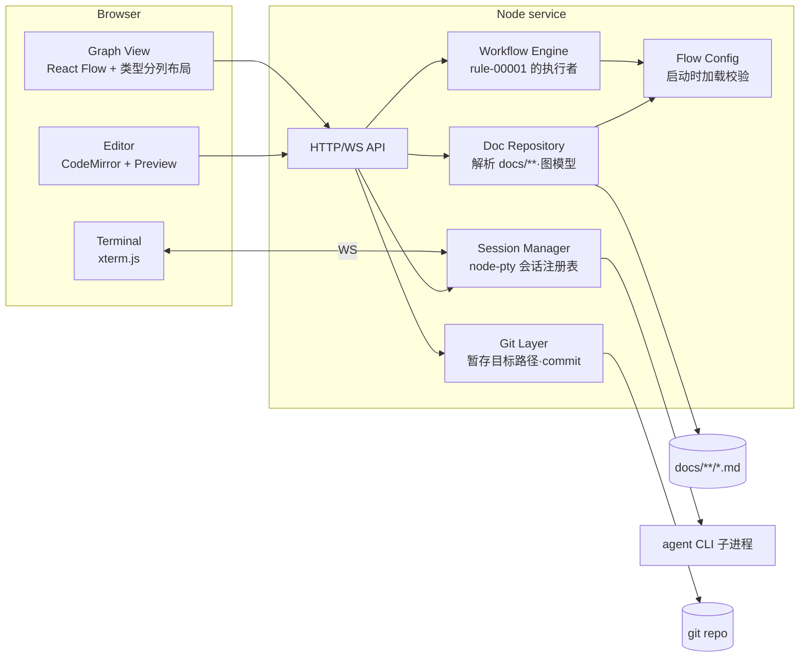
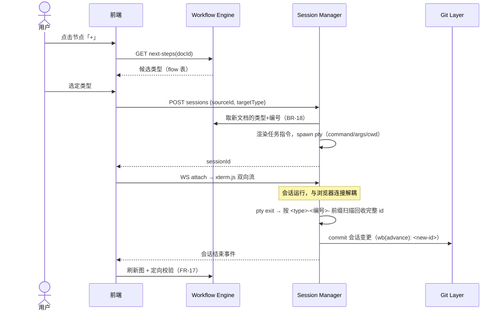
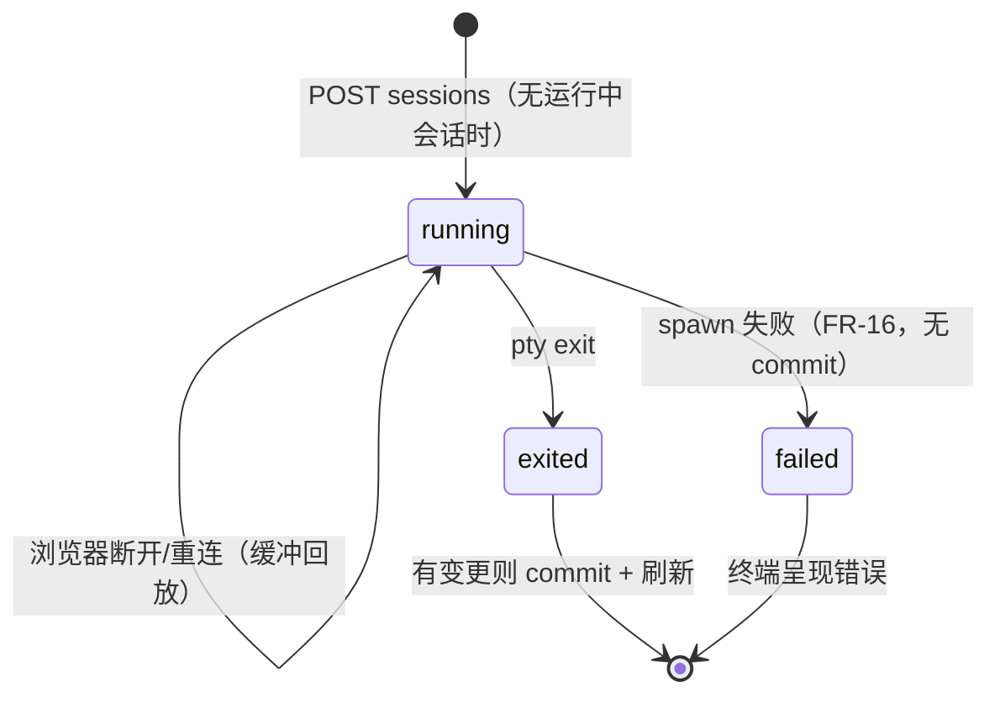

# Design: Docs 白板 MVP

> 一个本地 Node 服务 + 浏览器前端：文件是唯一事实来源，服务端持有解析、裁决、
> 会话与 git 四个能力，前端只做呈现与交互。

## 1. 形态与技术选型

单进程本地服务（Node.js + TypeScript），托管前端静态资源并暴露 HTTP/WebSocket
接口；浏览器访问 `localhost`。选型及理由：

| 关切 | 选型 | 理由 |
| --- | --- | --- |
| 服务端 | Node.js + TypeScript | PTY（node-pty）与前端同栈；单进程即可承载 MVP |
| 前端画布 | React + React Flow | 节点/边/浮窗交互开箱即用 |
| 自动布局 | 自有的类型分列布局（同步纯函数） | 列＝类型、行＝id 序，位置可预期；从关系边推导层次的算法（ELK/dagre）做不到这件事，且会把阶段流画反——取舍见 `decision-00002-whiteboard-layout` |
| 编辑器 | CodeMirror 6（markdown 模式） | 纯文本可靠；编辑的是整文件原文，front matter 可见可改（异常节点靠它修复） |
| 预览渲染 | react-markdown 10 + remark-gfm 4 | remark/rehype 生态的默认 React 渲染器；不启用 `rehype-raw` 时丢弃原始 HTML，承接 FR-24 |
| 图表 | mermaid 11 | 与 `docs/` 里既有的 mermaid 图同源（`docs/design/README.md` 的 Guideline 即 "Prefer Mermaid"），无需第二套语法 |
| 内嵌终端 | xterm.js ↔ WebSocket ↔ node-pty | 事实标准的 PTY 通道 |
| front matter 解析 | gray-matter | 容错好；仅用于读——写回见 §6 |
| git | simple-git | 只需 add/commit/log 的薄封装 |
| 文件监听 | chokidar | 外部修改推送刷新 |

## 2. 模块结构



- **Doc Repository**：扫描 `docs/**/*.md`（排除 `README.md`、`TEMPLATE.md`），
  产出图模型 `{nodes, edges, issues}`；类型集与关系字段集取自流程配置，front
  matter 缺失/非法、断链（无法解析的引用——可解析的细粒度引用不算，见下）进
  `issues` 并在节点/边上打异常标记（spec FR-1/FR-2 的载体）。节点标题取正文
  首个 H1，缺失取文件名。
  **第四轮起它还解析文档正文的需求条目**：spec 的 `FR`、rule 的 `BR` 及各自的
  AC——列表项与决策表行两种声明形态都认，AC 按其标注的「(所验条目 id)」归属；
  并从 record 解析**验收行**（验收清单表格中首列为被验 id、含测试与结果列的
  行），在服务端推导覆盖三态（spec FR-31…FR-33 的载体，口径见
  decision-00004 §5）——前端不自行推导。关系目标的解析随 FR-2 的修订变为两段：
  先按文档 id，再按需求条目/AC id 落到其**所属文档**（边保留所声明的原始 id），
  二者皆不中才是异常。（BR-18 保证「类型+编号」唯一，文档 id 与条目 id 语法上
  也不同形，两段不会同时命中——次序只是防御性规定。）
- **Workflow Engine**：唯一的裁决点。状态流转候选、接收/澄清裁决、下一步
  候选、新文档 id 中「类型 + 编号」的分配（BR-18；slug 由 agent 自取）全部在
  服务端计算，前端从不自行判断（spec FR-6…FR-10 的载体）。流转表
  （BR-2…BR-9）由 `kind` 内建推导，不进配置；配置承载的是类型二分与产品流
  （BR-1、BR-13…BR-17）。
- **Editor**：编辑与预览是同一份正文的两个视图——预览渲染的是编辑器**当前
  缓冲区**而非磁盘内容，切换不落盘也不丢改动（spec FR-22）。预览时 CodeMirror
  视图只隐藏、不卸载，光标与滚动位置因此保留（spec FR-25）。渲染前剥掉 front
  matter：编辑器持有整文件（front matter 要可见可改），但 `---` 块作为 Markdown
  会渲染成分隔线加 setext 标题。`mermaid` 代码块由 react-markdown 的
  `components` 钩子截获后交给 `mermaid.render()`，每个图独立渲染，一个图失败
  只坏一个图（spec FR-23）。FR-24 由两件事共同保证：不启用 `rehype-raw`，
  文档中的原始 HTML 被丢弃；mermaid 以 `securityLevel: 'strict'` 初始化，它产出
  并经 innerHTML 注入的 SVG 由它自己消毒——这条通路是 `rehype-raw` 那一半论证
  覆盖不到的。
- **Session Manager**：会话注册表（单例槽位，spec FR-18），生命周期与浏览器
  连接解耦（spec FR-21）；PTY 输出保留最近 1 MB 的滚动缓冲，重连时回放——
  「此前输出」的完整性以该窗口为限。
- **Git Layer**：每个动作 `git add <涉及路径>` 后 commit，从不 `add -A`
  （spec FR-14 的"只暂存本次动作涉及的文件"）。commit 失败不回滚已写盘内容
  （spec FR-20），失败信息沿 API 返回给前端呈现。

## 3. 流程配置契约

`whiteboard.config.yaml` 位于仓库根部（与 `docs/` 同级、用户直接可编辑），
服务启动时加载并校验；**缺失或非法即拒绝启动**（spec FR-15，无内置默认回退；
开箱即用靠模板仓库自带一份该文件）。

```yaml
types:
  idea:     { kind: living }
  prd:      { kind: living }
  spec:     { kind: living }
  rule:     { kind: living }
  design:   { kind: living }
  decision: { kind: living }
  # …其余 living 类型
  issue:    { kind: work }
  plan:     { kind: work }
  task:     { kind: work }

relations: [parent, implements, informs, motivated_by, constrains, blocks, verifies, supersedes]

flow:                       # rule-00001-BR-13…BR-17
  idea: [{ next: prd, carry: parent }, { next: spec, carry: parent }]
  prd:  [{ next: spec, carry: parent }]
  spec: [{ next: rule, carry: informs }, { next: design, carry: informs }, { next: plan, carry: implements }]
  plan: [{ next: task, carry: parent }]
  # 未列出的类型即"无下一步"

agents:
  claude:
    command: claude
    args: []            # 权限相关参数见下方「写权限约束」；接入时逐 CLI 验证
    cwd: docs           # 会话工作目录取 docs/，作为第一层越界屏障
```

- 校验规则（spec FR-15 的"文档类型、关系字段、下一步映射、agent 命令与写权限
  约束"）：`flow` 中的类型必须在 `types` 中且 `carry` 在 `relations` 中；
  `agents` 至少一项，`command` 非空字符串、`args` 为字符串数组、`cwd` 若有必须
  是 `docs` 内路径。任何违规 → 启动失败并指明条目。
- **写权限约束（spec FR-13）**：机制为 per-CLI 适配——首选「会话工作目录设为
  `docs/` + CLI 自身的权限模式（越界写需显式批准）」，辅以 CLI 的
  allow/deny 权限参数。**本节的具体参数是意向而非已验证事实**：每个接入的
  CLI 必须先以 spec AC-13.2（越界写不落盘）实测通过，才可进入模板自带配置；
  未通过验证的 CLI 不进默认配置。
- 多 agent 并存时 MVP 取配置中的**第一项**发起会话（`POST /sessions` 不带
  agent 字段）；由用户选择 CLI 留后续版本。

## 4. 推进（Advance）交互



- 任务指令模板（作为会话的初始输入经 PTY 写给 CLI——各 CLI 都支持交互式
  stdin，免去命令行转义差异）：目标类型、指定的 `<type>-<编号>-<slug>` id
  格式（编号已定，slug 自取）、按 flow `carry` 应携带的关系与来源 id、对应
  文件夹 `TEMPLATE.md` 与 `README.md` 的路径、「status 保持 draft」约束。
- **会话结束处理**：按会话记录的期望 `{targetType, 编号, carry, sourceId}`
  定向校验产出文档（id 前缀匹配、carry 关系指向来源）——这就是 FR-17 的
  "会话感知校验"，不合规进 `issues` 标异常。找不到前缀匹配文件时视为无产出，
  commit 信息退化为 `wb(advance): <sourceId>`。
- **advance 的暂存范围**：commit 时暂存 `docs/` 下自会话启动以来的全部变动
  路径（`git status -- docs/` 相对会话前快照）。边界声明：会话期间外部对
  `docs/` 的改动无法与会话产出区分，单人单会话前提下接受；会话启动**之前**
  已存在的脏文件不会被暂存（spec AC-14.2 由此成立）。
- 会话正常退出但 `docs/` 无任何变动时跳过 commit。

## 5. 会话生命周期



## 6. 写路径与冲突

- 所有写（编辑保存、状态切换、评审）走同一条服务端管道：
  **读盘校验 → 裁决（Workflow Engine）→ 写盘 → commit**。
- 冲突检测（spec FR-5）：编辑器打开时记录整文件 hash；保存时 hash 不符或文件
  不存在 → `409`。状态切换/评审按「动作发起时的 status」做 compare-and-swap：
  落盘前重读，status 已变或文件已删 → 拒绝（FR-19）。
- **写回策略**：状态切换只做 front matter `status:` 行的原地替换；澄清只在
  Open Questions 小节追加列表项——都不经 front matter 重新序列化，避免键序
  重排与注释丢失。编辑保存则整文件覆写（内容本来自编辑器全文）。
- 澄清写入的小节定位：匹配 `Open Questions` 标题（不区分大小写，允许
  `## Open Questions` 与 `## <n>. Open Questions` 两种形态）；命中即追加，
  不命中才在文末创建，不会重复建节。
- **commit 失败语义（FR-20）**：写盘成功而 commit 失败时，API 返回
  `200 { committed: false, error }`——文件保留，前端据此呈现错误。
- chokidar 监听 `docs/**` → WS 推送前端刷新（NF「外部修改刷新可见」）。
  会话运行期间白板自身的写动作不加锁——由上述 compare-and-swap 兜底。

## 7. API 契约

```
GET  /api/graph                       → {nodes, edges, issues}
GET  /api/docs/:id                    → {content, hash}            # 整文件原文，front matter 可改
PUT  /api/docs/:id                    {content, baseHash}          → 200 {committed, error?} | 409 冲突
GET  /api/docs/:id/transitions        → [status]                   # 合法目标状态（FR-6）
POST /api/docs/:id/status             {to}                         → 200 {committed, error?} | 422 非法流转
POST /api/docs/:id/review             {action: accept|clarify, questions?} → 200 {committed, error?} | 422
GET  /api/docs/:id/next-steps         → [{type, carry}]
GET  /api/sessions                    → {current: {id, status} | null}   # 重连发现（FR-21）
POST /api/sessions                    {sourceId, targetType}       → {sessionId} | 409 已有会话
WS   /api/sessions/:id/term           双向：stdin/stdout 帧 + exit 事件
GET  /api/config                      → 生效的流程配置（只读）
GET  /api/docs/:id/items              → {items, unattributed}       # 需求条目：id、正文、AC（含 GWT 文本）、验收行、覆盖三态（FR-31…FR-33）；子画布同源复用（FR-35），无第二个端点
```

`/items` 的载荷字段是 T1 与后续任务并行时的共同事实：验收行对象至少含
`{recordId, targetId, test, result, evidence?}`（FR-34 按它找引用条目 AC 的
record，FR-35 的验收行节点由它构造，FR-37 的详情面板读 `evidence`——清单表
无 Evidence 列时缺省）；`unattributed` 行含 `{recordId, declaredId}`
（FR-33 的「无法归属」区）。

`GET /api/graph` 的 edge 随 FR-2 修订增加 `declaredTargets`——front matter 所
声明的原始 id **列表**；细粒度引用时它们与 `target`（所属文档）不同。同一字段
的多个值落到同一文档时合并为一条边（FR-28 合并规则的延伸，AC-28.5），关系列表
（FR-30）按 `declaredTargets` 逐项展开。

commit 信息格式：`wb(<action>): <doc-id>`，action ∈
`edit | status | accept | clarify | advance`（spec FR-14 的"指明动作与文档 id"）。

前端的呈现与交互（着色、检索与定位、面板、控件）见
[design-00002-whiteboard-ui](design-00002-whiteboard-ui.md)；其中检索与定位由
spec-00001-FR-26、FR-27 承接。

## 8. 代码位置与运行

- 代码放 `tools/whiteboard/`（独立 package.json，不影响模板本体）。
- 运行：仓库根部 `npm run whiteboard`（根 package.json 脚本代理到
  `npm start --prefix tools/whiteboard`），读取 `./docs` 与
  `./whiteboard.config.yaml`。
