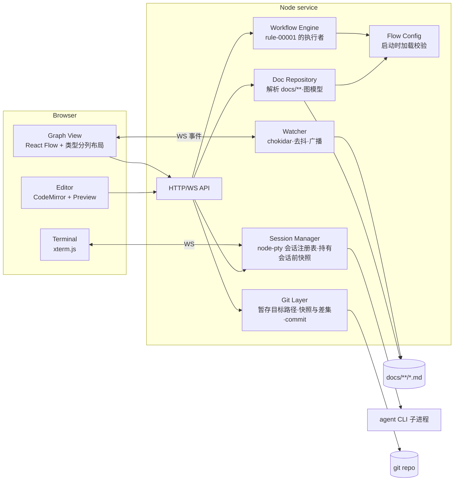
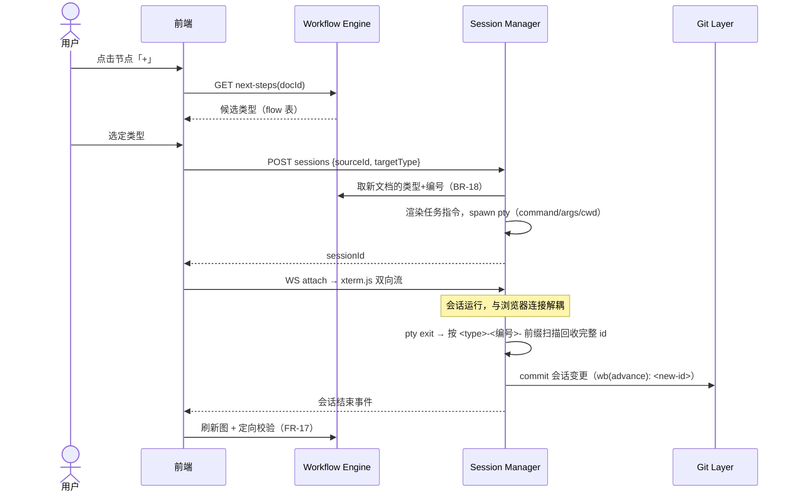
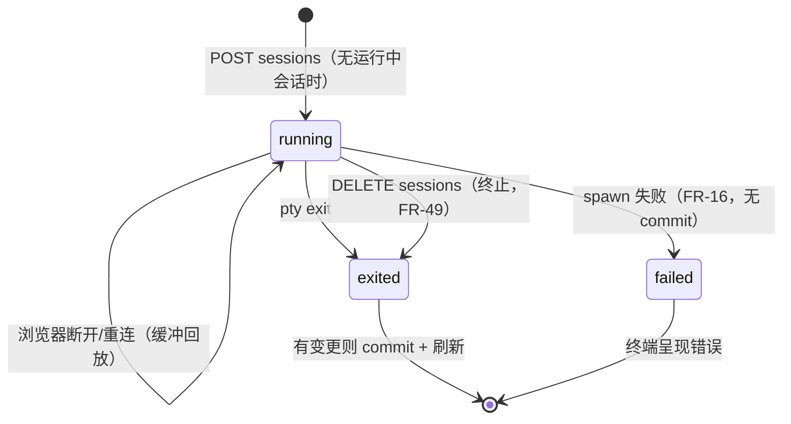

# Design: Docs 白板 MVP

> 一个本地 Node 服务 + 浏览器前端：文件是唯一事实来源，服务端持有解析、裁决、
> 会话与 git 四个能力，前端只做呈现与交互。

## 1. 形态与技术选型

单进程本地服务（Node.js + TypeScript），托管前端静态资源并暴露 HTTP/WebSocket
接口；浏览器访问 `localhost`。选型及理由：

| 关切 | 选型 | 理由 |
| --- | --- | --- |
| 服务端 | Node.js + TypeScript | PTY（node-pty）与前端同栈；单进程即可承载 MVP |
| 前端画布 | React + React Flow | 节点/边/浮窗交互开箱即用 |
| 自动布局 | 自有的类型分列布局（同步纯函数） | 列＝类型、行＝id 序，位置可预期；从关系边推导层次的算法（ELK/dagre）做不到这件事，且会把阶段流画反——取舍见 `decision-00002-whiteboard-layout` |
| 编辑器 | CodeMirror 6（markdown 模式） | 纯文本可靠；编辑的是整文件原文，front matter 可见可改（异常节点靠它修复） |
| 预览渲染 | react-markdown 10 + remark-gfm 4 | remark/rehype 生态的默认 React 渲染器；不启用 `rehype-raw` 时丢弃原始 HTML，承接 FR-24 |
| 图表 | mermaid 11 | 与 `docs/` 里既有的 mermaid 图同源（`docs/design/README.md` 的 Guideline 即 "Prefer Mermaid"），无需第二套语法 |
| 内嵌终端 | xterm.js ↔ WebSocket ↔ node-pty | 事实标准的 PTY 通道 |
| front matter 解析 | gray-matter | 容错好；仅用于读——写回见 §6 |
| git | simple-git | 只需 add/commit/log 的薄封装 |
| 文件监听 | chokidar | 外部修改推送刷新 |

## 2. 模块结构



- **Doc Repository**：扫描 `docs/**/*.md`（排除 `README.md`、`TEMPLATE.md`），
  产出图模型 `{nodes, edges, issues}`；类型集与关系字段集取自流程配置，front
  matter 缺失/非法、断链（无法解析的引用——可解析的细粒度引用不算，见下）进
  `issues` 并在节点/边上打异常标记（spec FR-1/FR-2 的载体）。节点标题取正文
  首个 H1，缺失取文件名。
  **第四轮起它还解析文档正文的需求条目**：spec 的 `FR`、rule 的 `BR` 及各自的
  AC——列表项与决策表行两种声明形态都认，AC 按其标注的「(所验条目 id)」归属；
  并从 record 解析**验收行**（验收清单表格中首列为被验 id、含测试与结果列的
  行），在服务端推导覆盖三态（spec FR-31…FR-33 的载体，口径见
  decision-00004 §5）——前端不自行推导。关系目标的解析随 FR-2 的修订变为两段：
  先按文档 id，再按需求条目/AC id 落到其**所属文档**（边保留所声明的原始 id），
  二者皆不中才是异常。（BR-18 保证「类型+编号」唯一，文档 id 与条目 id 语法上
  也不同形，两段不会同时命中——次序只是防御性规定。）
  **第六轮起（decision-00005）**：正文解析由行级正则升级为 **remark AST** 遍历，
  行为契约不变（既有测试为回归护栏），AST 的位置信息供诊断定位到行；解析同时
  按各文件夹 README 的「机器可读形态」小节校验，产出**解析诊断**（疑似条目而
  不合形态、验收清单的不合式行、无法归属——spec FR-40 的载体），随图与
  `/items` 下发。
- **Workflow Engine**：唯一的裁决点。状态流转候选、接收裁决、澄清与答疑的
  发起裁决（status、可澄清类型、单会话约束——第八轮起澄清是会话不是写回，
  decision-00006）、审计的发起裁决（status 为 `draft` 且类型可审计——第十轮，
  decision-00007）、plan 的 **resolved 门**（第十轮，spec FR-52：按 BR-24 从
  `implements` 解析交付范围，把证据限定为 `parent` 指向该 plan 的 record 后，
  复用 Doc Repository 的**同一**覆盖推导判定每个条目——推导函数以 record 集
  为入参，门只是换了证据集，口径与 `/items` 永不相异）、下一步候选、新文档
  id 中「类型 + 编号」的分配（BR-18；slug 由 agent 自取）全部在服务端计算，
  前端从不自行判断（spec FR-6…FR-10 的载体）。流转表（BR-2…BR-9）、可澄清
  类型集（BR-20）、可审计类型集（BR-23）与 resolved 门（BR-24、BR-25）由
  代码内建，不进配置；配置承载的是类型二分、产品流（BR-1、BR-13…BR-17，
  第十轮起含 `plan → issue/record`）与每个可澄清类型的焦点行（spec FR-48）。
- **Editor**：编辑与预览是同一份正文的两个视图——预览渲染的是编辑器**当前
  缓冲区**而非磁盘内容，切换不落盘也不丢改动（spec FR-22）。预览时 CodeMirror
  视图只隐藏、不卸载，光标与滚动位置因此保留（spec FR-25）。渲染前剥掉 front
  matter：编辑器持有整文件（front matter 要可见可改），但 `---` 块作为 Markdown
  会渲染成分隔线加 setext 标题。`mermaid` 代码块由 react-markdown 的
  `components` 钩子截获后交给 `mermaid.render()`，每个图独立渲染，一个图失败
  只坏一个图（spec FR-23）。FR-24 由两件事共同保证：不启用 `rehype-raw`，
  文档中的原始 HTML 被丢弃；mermaid 以 `securityLevel: 'strict'` 初始化，它产出
  并经 innerHTML 注入的 SVG 由它自己消毒——这条通路是 `rehype-raw` 那一半论证
  覆盖不到的。
- **Session Manager**：会话注册表（单例槽位，spec FR-18），生命周期与浏览器
  连接解耦（spec FR-21）；PTY 输出保留最近 1 MB 的滚动缓冲，重连时回放——
  「此前输出」的完整性以该窗口为限。**第十一轮起（decision-00008）**：会话
  收尾时把元数据落盘 `.whiteboard/sessions/<会话 id>.json`、纯文本转写落盘
  `<会话 id>.log`（第一读者是人，与 JSON 状态文件的分工互补——
  decision-00008 §2 第 3 条；gitignore 内，落盘失败只提示不阻塞收尾，
  spec FR-54）；发起会话可指定流程配置 `agents` 中任一条，缺省第一条
  （spec FR-55）。
- **Doc Repository（第十一轮补）**：解析结果按变更失效缓存——watcher 事件
  与白板自身的写路径（编辑、状态、新建、会话收尾）都使缓存失效，未失效的
  重复请求不重读整树（spec §7 非功能项）。会话产物的异常标记（FR-17 的
  `lastFinding`）随每次图构建按磁盘当前内容重验，验证通过即清除——不再等
  下一次推进（issue-00014 的修复口径）。
- **Git Layer**：每个动作 `git add <涉及路径>` 后 commit，从不 `add -A`
  （spec FR-14 的"只暂存本次动作涉及的文件"）。commit 失败不回滚已写盘内容
  （spec FR-20），失败信息沿 API 返回给前端呈现。**快照与差集的能力归它**
  （取快照、按内容求差，见 §4）；**快照的生命周期归 Session Manager**——它在
  启动会话时取一次并随会话状态保存，结束时交回 Git Layer 求差集。分工的理由：
  git 语义不外泄，会话期状态不进 git 层。
- **Watcher**：chokidar 监听 `docs/**`，去抖后经 WS 向每个已连接的白板广播
  「图已变」信号（spec FR-42/FR-43 的载体，链路见 §6）。它只读文件系统事件，
  不解析文档、不持有图——解析仍归 Doc Repository。

## 3. 流程配置契约

`whiteboard.config.yaml` 位于仓库根部（与 `docs/` 同级、用户直接可编辑），
服务启动时加载并校验；**缺失或非法即拒绝启动**（spec FR-15，无内置默认回退；
开箱即用靠模板仓库自带一份该文件）。

```yaml
types:
  idea:     { kind: living }
  prd:      { kind: living }
  spec:     { kind: living }
  rule:     { kind: living }
  design:   { kind: living }
  decision: { kind: living }
  # …其余 living 类型
  issue:    { kind: work }
  plan:     { kind: work }
  task:     { kind: work }

relations: [parent, implements, informs, motivated_by, constrains, blocks, verifies, supersedes]

flow:                       # rule-00001-BR-13…BR-17
  idea: [{ next: prd, carry: parent }, { next: spec, carry: parent }]
  prd:  [{ next: spec, carry: parent }]
  spec: [{ next: rule, carry: informs }, { next: design, carry: informs }, { next: plan, carry: implements }]
  plan: [{ next: task, carry: parent }, { next: issue, carry: blocks }, { next: record, carry: parent }]
  # 未列出的类型即"无下一步"

entry: [idea, prd]          # rule-00001-BR-26 的流程入口类型（spec FR-53）；缺失或空 = 无新建入口

agents:
  claude:
    command: claude
    args: []            # 权限相关参数见下方「写权限约束」；接入时逐 CLI 验证
    cwd: docs           # 会话工作目录取 docs/，作为第一层越界屏障
```

- 校验规则（spec FR-15 的"文档类型、关系字段、下一步映射、入口类型列表、
  agent 命令与写权限约束"）：`flow` 中的类型必须在 `types` 中且 `carry` 在
  `relations` 中；`entry` 若有，其中每个名字必须在 `types` 中（FR-53）；
  `agents` 至少一项，`command` 非空字符串、`args` 为字符串数组、`cwd` 若有必须
  是 `docs` 内路径。任何违规 → 启动失败并指明条目。
- **写权限约束（spec FR-13）**：机制为 per-CLI 适配——首选「会话工作目录设为
  `docs/` + CLI 自身的权限模式（越界写需显式批准）」，辅以 CLI 的
  allow/deny 权限参数。**本节的具体参数是意向而非已验证事实**：每个接入的
  CLI 必须先以 spec AC-13.2（越界写不落盘）实测通过，才可进入模板自带配置；
  未通过验证的 CLI 不进默认配置。
- 多 agent 并存时可在发起会话时指定其中一条（`POST /sessions*` 的可选
  `agent` 字段），缺省取配置中的**第一项**；未知名字拒绝且不启动（spec
  FR-55，第十一轮取代原「由用户选择 CLI 留后续版本」的搁置）。

## 4. 推进（Advance）交互



- 任务指令模板（作为会话的初始输入经 PTY 写给 CLI——各 CLI 都支持交互式
  stdin，免去命令行转义差异）：目标类型、指定的 `<type>-<编号>-<slug>` id
  格式（编号已定，slug 自取）、按 flow `carry` 应携带的关系与来源 id、对应
  文件夹 `TEMPLATE.md` 与 `README.md` 的路径、「status 保持 draft」约束；
  目标类型有条目文法时（spec/rule/record）另附该类型的「机器可读形态」要求
  （spec FR-41，decision-00005）。会话结束的产出校验相应扩展到正文文法，
  诊断按 FR-40 呈现、不阻塞 commit。
- **会话结束处理**：按会话记录的期望 `{targetType, 编号, carry, sourceId}`
  定向校验产出文档（id 前缀匹配、carry 关系指向来源）——这就是 FR-17 的
  "会话感知校验"，不合规进 `issues` 标异常。找不到前缀匹配文件时视为无产出，
  commit 信息退化为 `wb(advance): <sourceId>`。
- **advance 的暂存范围**：commit 时暂存 `docs/` 下自会话启动以来的全部变动
  路径。**「相对会话前快照」是实现约束，不是修辞**：会话启动时必须取一次
  `docs/` 的快照，结束时以差集为暂存集——只按前缀过滤当前 `git status` 会把
  会话前就脏的文件一并卷入（`issue-00008` 即此缺陷，由 `AC-14.5`/`AC-14.6`
  守住）。
  **差集按内容算，不按路径集算**（这是唯一能让 FR-14、`AC-14.4`、`AC-14.5`
  同时成立的读法，故写在设计里而非留给实现）：快照记录每个当时已脏的 `docs/`
  路径**及其内容摘要**；结束时对当前脏路径分三种处置——快照里没有的（会话新建
  或新改的）**暂存**；快照里有且摘要不变的（会话没碰）**排除**；快照里有而摘要
  已变的（会话在别人的脏文件上继续改的）**暂存**。若只按路径集求差，第三种会被
  误排除，agent 对一份本来就脏的文档所做的修订将永远提交不进去——而「在既有
  草稿上继续写」正是本仓最常见的推进形态。
  边界声明：会话期间外部对 `docs/` 的改动无法与会话产出区分，单人单会话前提
  下接受。
- 会话正常退出但 `docs/` 无任何变动时跳过 commit。

## 5. 会话生命周期



退出收尾（commit + 刷新）恰执行一次：`pty.onExit` 只触发一次，终止与自然
退出竞态时先到者定（FR-49）。第十一轮起收尾序列在 commit 之前多一步
**历史落盘**（元数据 `.json` + 转写 `.log`，spec FR-54）：落盘失败不阻塞
后续步骤——commit 与刷新照常，失败仅提示。

## 6. 写路径与冲突

- 所有写（编辑保存、状态切换、接收、新建的保存——第十一轮）走同一条服务端
  管道：**读盘校验 → 裁决（Workflow Engine）→ 写盘 → commit**。新建的
  「读盘校验」是不存在性校验（目标 id 已存在 → 409，FR-53/AC-53.3）。澄清与答疑不走
  写管道——它们发起会话，写由会话内的 agent 完成（第八轮，decision-00006）。
- 冲突检测（spec FR-5）：编辑器打开时记录整文件 hash；保存时 hash 不符或文件
  不存在 → `409`。状态切换/评审按「动作发起时的 status」做 compare-and-swap：
  落盘前重读，status 已变或文件已删 → 拒绝（FR-19）。
- **写回策略**：状态切换只做 front matter `status:` 行的原地替换——不经
  front matter 重新序列化，避免键序重排与注释丢失。编辑保存则整文件覆写
  （内容本来自编辑器全文）。~~澄清在 Open Questions 小节追加列表项~~——
  第八轮起澄清没有服务端写回，收尾写入 Open Questions 由澄清会话的 agent
  完成，小节定位约定（匹配 `Open Questions` 标题、不命中才文末建节）随之
  移入澄清任务指令（spec FR-45）。
- **commit 失败语义（FR-20）**：写盘成功而 commit 失败时，API 返回
  `200 { committed: false, error }`——文件保留，前端据此呈现错误。
- **变更推送**（`spec-00001-FR-42`…`FR-44`，第七轮由 `issue-00007` 落地——
  此前本段只是承诺，服务端从不监听、前端从不订阅）：chokidar 监听 `docs/**`
  → 合并窗口内的连续事件（去抖 ~100ms；上界由 `FR-42` 的「1 秒内可见」约束，
  在其下自由取值）→ 经 WS 广播一个「图已变」信号（**不带载荷**：前端收到即
  重取，避免推送与请求两条路径各自维护一份图）→ 前端按 id 保持呈现状态
  （`FR-44`）。
  **一次刷新重取的范围**：`GET /api/graph`，**以及当前选中或下钻文档的
  `GET /api/docs/:id/items`**——覆盖状态、诊断、展开行与详情目标都活在 items
  载荷里，只重取 graph 则条目侧的变化不可见（`AC-42.2`、`AC-44.1`…`AC-44.7`
  依赖这一半）。无选中且未下钻时只取 graph。
  连接未建立或中断时白板照常可用、自动重连（间隔递增，起始 1s、上限 30s），
  连接建立或重建即刷新一次补回断连期间的变化（`FR-43`）；不轮询。白板自身动作
  与会话结束后的刷新通路照旧，三者共用同一个「重取 + 保持呈现状态」实现。
  **推送不自激**：白板自身写盘同样会触发监听，但收到信号后只做只读重取，
  不再写盘，故不形成回环；「变化→删除→再建」一类序列由「无载荷 + 全量重取」
  自然收敛到磁盘现状，无需事件排序。
  **零订阅者不是错误**（`AC-42.8`），多个白板各自收到同一信号（`AC-42.9`；
  多人协作仍在 spec §6 范围外——这里只是同机多标签页）。
  **与会话的关系**：会话期间 agent 的写入照常触发推送（`AC-42.7`），FR-12 的
  「会话退出时刷新」因此从「唯一的可见时机」退为「最后一次刷新」——两者不冲突，
  只是前者不再是唯一入口；半成品文档的异常/诊断态是过程态，FR-17 的结束校验
  仍是权威判定（取舍写在 `FR-42` 正文）。
  会话运行期间白板自身的写动作不加锁——由上述 compare-and-swap 兜底。

## 7. API 契约

```
GET  /api/graph                       → {nodes, edges, issues, diagnostics}   # diagnostics: 解析诊断（FR-40），行含 {docId, kind, line?, text}
GET  /api/docs/:id                    → {content, hash}            # 整文件原文，front matter 可改
PUT  /api/docs/:id                    {content, baseHash}          → 200 {committed, error?} | 409 冲突
GET  /api/docs/:id/transitions        → [status]                   # 合法目标状态（FR-6）
POST /api/docs/:id/status             {to}                         → 200 {committed, error?} | 422 {error, gaps?: [<item-id | unresolved-id>]} 非法流转/resolved 门拒绝（FR-52：plan open→resolved 时按交付范围守门，缺口以 gaps 逐条点名，文件不变；非门拒绝无 gaps 字段）
POST /api/docs/:id/review             {action: accept}             → 200 {committed, error?} | 422   # clarify 分支第八轮移除（decision-00006），非 accept 一律 422
GET  /api/docs/:id/next-steps         → [{type, carry}]
GET  /api/sessions                    → {current: {id, status} | null}   # 重连发现（FR-21）
POST /api/sessions                    {sourceId, targetType, agent?} → {sessionId} | 409 已有会话 | 422 未知 agent（FR-55）   # 推进会话；任务指令正文单独写入（不带提交字节），提交键为会话首批输出后延迟发出的独立 `\r`（再延迟补发一次；空输入框回车幂等）——同一突发里的 `\r` 会被 cooked 模式的 ICRNL 翻回 LF 或被粘贴检测吞掉（issue-00011）
POST /api/sessions/clarify            {docId, agent?}              → {sessionId} | 409 已有会话/文档已删 | 422 非 draft/非可澄清类型/未知 agent   # 澄清会话（FR-9，第八轮；agent 第十一轮）
POST /api/sessions/ask                {docId, agent?}              → {sessionId} | 409 已有会话/文档已删 | 422 异常文档/未知 agent   # 答疑会话（FR-47，第八轮）
POST /api/sessions/audit              {docId, agent?}              → {sessionId} | 409 已有会话/文档已删 | 422 非 draft/非可审计类型/异常文档/未知 agent   # 审计会话（FR-50/FR-51，第十轮）
GET  /api/create?type=<t>             → {idPrefix, template} | 422 非入口类型   # 新建预填：取号 + 模板，不写盘（FR-53；独立路径避开 /api/docs/:id 的路由重叠）
POST /api/docs                        {id, content}                → 201 {committed} | 409 id 已存在 | 422 非入口类型/id 不合分配前缀或 slug 非法   # 新建的保存（FR-53，第十一轮）：保存才建档——写盘 + commit wb(create)，与 FR-4/FR-5 同一条写管道的创建分支；此后修订走既有 PUT
GET  /api/sessions/history            → [{id, kind, docId, agent, startedAt, endedAt, status, exitCode?}]   # 历史会话列表（FR-54，第十一轮），读 .whiteboard/sessions/；status/exitCode 沿用会话状态词汇（exited/failed）
GET  /api/sessions/history/:id        → {meta, transcript}         # 单条元数据 + 转写全文（FR-54；meta 读 <会话 id>.json，transcript 读 <会话 id>.log）
DELETE /api/sessions                  → 200 | 404 无运行中会话（从未有，或已 exited/failed——重复终止同 404，不二次 commit）   # 终止会话（FR-49，issue-00010）；退出收尾照常、恰一次；信号升级 SIGHUP→宽限→SIGKILL（issue-00012），等待因此有界
WS   /api/terminal                    双向。文本帧 = stdin 原样字节；二进制帧 = JSON 控制（现仅 {cols, rows} 尺寸帧：前端 fit 后与面板变化时上报，服务端调 pty.resize；非法控制帧忽略不断连——FR-12/issue-00009）；服务端→前端仍为 stdout 文本帧 + exit 事件。（本行原写作 /api/sessions/:id/term，与实现不符，第七轮据实校正）
WS   /api/events                      服务端→前端：无载荷信号，收到即刷新（重取 graph + 当前 items + 会话状态；FR-42/FR-43）。两个来源：docs/ 变更（watcher），以及会话收尾——**无论有无 commit**（FR-12/issue-00013，三触发源由此真正共用一条通路）
GET  /api/config                      → 生效的流程配置（只读）+ 代码内建的可澄清/可审计类型集（FR-56，第十一轮：前端入口呈现的单一来源，不再自持副本）；entry 列表随配置下发（FR-53）
GET  /api/docs/:id/items              → {items, diagnostics}        # 需求条目：id、正文、AC（含 GWT 文本）、验收行、覆盖三态（FR-31…FR-33）；diagnostics 吸收原 unattributed（FR-40），子画布同源复用（FR-35），无第二个端点
```

`/items` 的载荷字段是 T1 与后续任务并行时的共同事实：验收行对象至少含
`{recordId, targetId, test, result, evidence?}`（FR-34 按它找引用条目 AC 的
record，FR-35 的验收行节点由它构造，FR-37 的详情面板读 `evidence`——清单表
无 Evidence 列时缺省）；`diagnostics` 行含 `{kind, recordId?, declaredId?,
line?, text?}`——无法归属（原 `unattributed`，FR-33）与文法诊断（FR-40）
共用此形。

`GET /api/graph` 的 edge 随 FR-2 修订增加 `declaredTargets`——front matter 所
声明的原始 id **列表**；细粒度引用时它们与 `target`（所属文档）不同。同一字段
的多个值落到同一文档时合并为一条边（FR-28 合并规则的延伸，AC-28.5），关系列表
（FR-30）按 `declaredTargets` 逐项展开。

白板的 commit 一律带 `--no-verify`（第十一轮，decision-00008 §2 第 6 条）：
pre-commit hook 的受众是人手提交，白板按 spec 提交 draft 产物（FR-17 的推进
半成品、FR-53 的新建）不受其拦截，评审保证由白板自身的门承载。

commit 信息格式：`wb(<action>): <doc-id>`，action ∈
`edit | status | accept | clarify | advance | ask | audit | create`（spec FR-14 的"指明
动作与文档 id"——AC-14.x 的中文动作词「澄清/答疑」由这些英文 key 承载，
与既有「接收=accept」同一约定；`clarify` 第八轮起是会话 commit，不再是评审
写回；`audit` 第十轮加入，其 commit 由 spec AC-50.3 承载）。

前端的呈现与交互（着色、检索与定位、面板、控件）见
[design-00002-whiteboard-ui](design-00002-whiteboard-ui.md)；其中检索与定位由
spec-00001-FR-26、FR-27 承接。

## 8. 代码位置与运行

- 代码放 `tools/whiteboard/`（独立 package.json，不影响模板本体）。
- 运行：仓库根部 `npm run whiteboard`（根 package.json 脚本代理到
  `npm start --prefix tools/whiteboard`），读取 `./docs` 与
  `./whiteboard.config.yaml`。
