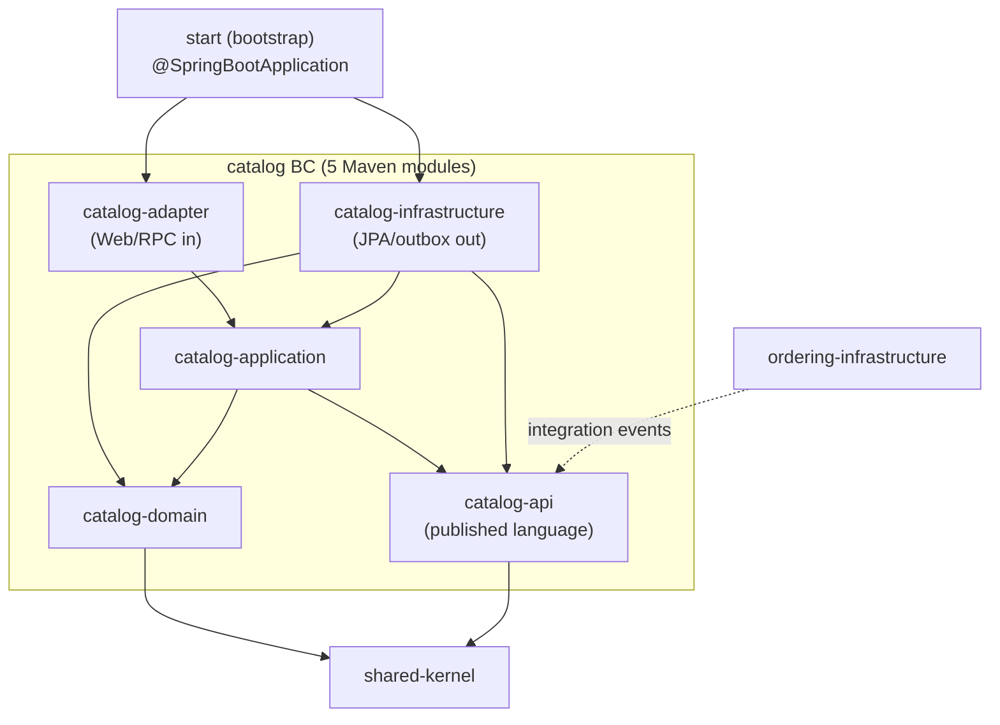
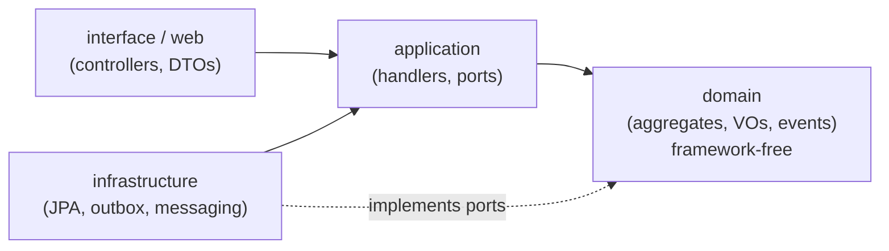
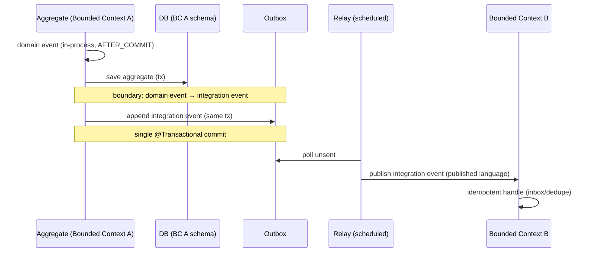

# Java DDD template — target architecture

**Status: draft for review.** Converges the patterns that recur across the seven
DDD references distilled under [`docs/reference/`](../reference/) into the target
architecture for the `lang/java/ddd` template. Where the references disagree,
the choice and its rationale are called out. Open questions for the reviewer are
collected at the end.

## Context

This branch produces a scaffold for **Java Spring Boot + DDD modular-monolith**
projects. The architecture below is derived from the reference notes, not
invented: each decision cites the sources that back it. The goal is a template
that is correct-by-construction (illegal dependencies fail the build), pragmatic
(no ceremony where CRUD suffices), and evolvable (a module can later be extracted
to its own service without rework).

Reference basis:
[library](../reference/ddd-by-examples-library/20260708161438-ddd-notes.md),
[factory](../reference/ddd-by-examples-factory/20260708161438-ddd-notes.md),
[jmolecules](../reference/jmolecules/20260708161438-ddd-notes.md),
[spring-modulith-with-ddd](../reference/spring-modulith-with-ddd/20260708161438-ddd-notes.md),
[axon-framework](../reference/axon-framework/20260708161438-ddd-notes.md),
[modular-monolith-with-ddd](../reference/modular-monolith-with-ddd/20260708161438-ddd-notes.md),
[domain-driven-hexagon](../reference/domain-driven-hexagon/20260708161438-ddd-notes.md).

## Convergent decisions

The five patterns present in nearly every reference, adopted as the template's
backbone:

1. **Framework-free domain.** Domain layer has zero Spring/JPA imports; behavior
   and invariants live in aggregates/VOs. (all references; explicit in library,
   factory, hexagon)
2. **Strong boundaries via jMolecules + ArchUnit + Spring Modulith.** Building
   blocks are annotated, boundaries are verified in CI, module structure is the
   package structure. (jmolecules, spring-modulith-with-ddd; library/factory use
   ArchUnit or package-private + Gradle modules as the pre-jMolecules equivalent)
3. **Transactional Outbox for integration events.** Cross-module/cross-context
   events are written in the same transaction as state changes and relayed
   asynchronously. (modular-monolith Outbox/Inbox; spring-modulith JPA event
   publication registry; library store-and-forward publisher)
4. **CQRS-lite, not event sourcing.** Write side goes through aggregates; read
   side uses dedicated read models/projections that may bypass aggregates and
   query the DB directly. Full ES is explicitly **out of scope** for the default
   template. (library read models, factory "three lanes", hexagon query shortcut;
   Axon ES kept as reference-only per its adoption caveats)
5. **Value Objects over primitives.** Typed IDs and domain primitives (Money,
   Email, date ranges) as immutable records; no primitive obsession.
   (all references; "domain primitives" in hexagon, `Association<T,ID>` in
   jmolecules)

Supporting decisions that recur:

- **Maven module per bounded context *and* per layer** (kgrzybek/COLA style;
  factory is the 2-module-per-context precedent). Context `*-api` module as the
  only cross-context entry point (modular-monolith). See the layout section (Q8
  resolved to B2).
- **Thin application services / command handlers**: load aggregate → invoke one
  domain method → save; no business logic in the application layer (library,
  factory, hexagon).
- **Explicit business rules**: a `checkRule(BusinessRule)` helper on the aggregate
  base, each rule a small testable class (modular-monolith) — preferred over
  scattered `if/throw`.
- **Typed-result error handling**: expected domain failures as a `Result`/sealed
  error type mapped to HTTP status; throw only for unrecoverable faults (hexagon,
  library `Either`).
- **Match architecture to complexity**: don't force the hexagon on simple CRUD
  sub-modules (library Catalogue, factory Spring Data REST lane).

## Terminology

Three terms are used at distinct levels; this design keeps them separate:

- **Bounded Context** (strategic) — a language/model boundary. The unit that
  publishes and consumes **integration events**. Conceptual diagrams use this.
- **Aggregate** (tactical) — a consistency boundary *inside* a bounded context.
  The unit that raises **domain events**. Aggregates never exchange integration
  events directly.
- **Module** (physical) — how contexts and layers are realized in code: a
  **Maven module** (a build unit / jar). Per the Q8 decision, each bounded context
  *and* each layer within it is a Maven module (see the layout section). "Module"
  in this doc means Maven module unless stated otherwise.

Mapping: one Bounded Context → one aggregator Maven module → five layer Maven
modules (`*-api`/`*-domain`/`*-application`/`*-infrastructure`/`*-adapter`). (Note:
"Module" is also a tactical DDD pattern in Evans — a named model grouping ≈
package; here we take it all the way to a build unit for compile-time isolation.
A Spring Modulith "application module" is a *package*-level concept and is **not**
our module mechanism — see Enforcement / Q1.)

## Module & package layout

Decomposition is on two orthogonal axes — **by bounded context** (vertical) and
**by layer** (horizontal) — and, per Q8, **both are Maven modules**, so both
boundaries are **compile-time** guarantees: an illegal reference is simply not on
the classpath and does not compile. (B2 / Alibaba-COLA-style layering.)

Per bounded context, **five** Maven modules:

| Module | Role (hexagonal) | Contains | Depends on |
| --- | --- | --- | --- |
| `*-api` | published language | integration-event types, public DTOs / facade contract | shared-kernel (minimal) |
| `*-domain` | core | aggregates, VOs, domain events, domain services, repository **ports** | shared-kernel only — **no Spring/JPA** |
| `*-application` | use cases | command/query handlers, application services | domain, api |
| `*-infrastructure` | driven (outbound) adapters | JPA repos, outbox, external gateways, MQ producers | application, domain, api |
| `*-adapter` | driving (inbound) adapters | Web/REST, RPC, MQ consumers, scheduled jobs | application, api |

Plus two shared modules:

- **`shared-kernel`** — minimal shared base types (`AggregateRoot`, `DomainEvent`,
  `BusinessRule`, `Result`, general VOs). Kept small; it is the one module everyone
  depends on, so anything added here couples all contexts.
- **`start`** — the single composition root: the only `@SpringBootApplication`,
  `main()`, and full bean wiring; depends on every context's `adapter` +
  `infrastructure`. One deployable.

`*-adapter` and `*-infrastructure` are **siblings** (inbound vs outbound) and never
depend on each other — they meet only in `start`. **Cross-context references are
allowed only to another context's `*-api`** (published language), never into its
`domain`/`application`.

```text
app/                              aggregator POM (parent, no business code)
├── pom.xml                       <modules> + dependencyManagement
├── shared-kernel/                minimal shared base
├── catalog/                      aggregator for the catalog Bounded Context
│   ├── catalog-api/              integration events + public contract
│   ├── catalog-domain/           framework-free core
│   ├── catalog-application/      use cases (command/query handlers)
│   ├── catalog-infrastructure/   JPA, outbox, gateways (outbound)
│   └── catalog-adapter/          Web / RPC / MQ-in (inbound)
├── ordering/                     aggregator for the ordering Bounded Context
│   └── ordering-{api,domain,application,infrastructure,adapter}
└── start/                        single @SpringBootApplication → all contexts
```



Enforcement by axis — both structural axes are now compile-time; jMolecules /
ArchUnit shift from *boundary* enforcement to *tactical-DDD* enforcement:

| Boundary | Enforced by | When |
| --- | --- | --- |
| Bounded context ↔ bounded context | Maven deps: a context depends only on others' `*-api` | compile time |
| Layer (domain ← application ← infra/adapter) | Maven deps: each layer a module; wrong-direction types off the classpath | compile time |
| `*-domain` stays framework-free | Maven: `*-domain` POM has no Spring/JPA | compile time |
| Tactical DDD rules (refs by id, VO immutability, naming) | jMolecules + ArchUnit | test time (CI) |
| Dependency versions | parent POM `dependencyManagement` | build time |

Module count ≈ **5N + 2** (N contexts + `shared-kernel` + `start`); e.g. 3
contexts ≈ 17 modules — the accepted cost of full compile-time isolation on both
axes.

Cross-context communication is only: `catalog.events.*` (published language) →
outbox → `ordering` `@ApplicationModuleListener`; never a direct reference into
another context's `domain`.

Reviewer note: the two example bounded contexts (`catalog`, `ordering`) are
placeholders — the scaffold ships one worked context plus a skeleton context.
See open question Q3.

## Dependency rule

Dependencies point inward; the domain depends on nothing framework-specific.
Enforced by ArchUnit + jMolecules, not convention.



## Tactical building blocks

Annotated with jMolecules so intent is explicit and machine-checkable:

| Block | jMolecules | Notes |
| --- | --- | --- |
| Aggregate root | `@AggregateRoot` / `AggregateRoot<T,ID>` | consistency boundary; state private; mutated only via intention-revealing methods |
| Entity | `@Entity` | identity + lifecycle within an aggregate |
| Value Object | `@ValueObject` (record) | immutable, structural equality, validated on construction |
| Identifier | `@Identity` + `Identifier` (record) | typed IDs, no bare `UUID`/`Long` |
| Cross-aggregate ref | `Association<T,ID>` | reference by identity, never object graph |
| Domain event | `@DomainEvent` (record) | raised from the root, dispatched on commit |
| Repository port | `@Repository` interface in domain | adapter in infrastructure |

Write path: `Controller → Command → CommandHandler → load aggregate via
repository port → aggregate method (checkRule + registerEvent) → save → outbox`.

Read path: `Controller → Query → QueryHandler → read model / projection (may hit
DB directly) → Response DTO`.

## Inter-context communication: domain vs integration events

Two event kinds, deliberately kept separate (backed by kgrzybek, Spring Modulith,
jMolecules):

| | Domain event | Integration event |
| --- | --- | --- |
| Scope | inside one bounded context, raised by an **aggregate** | across bounded contexts (**published language**) |
| Transport | in-process, after commit (`@TransactionalEventListener(AFTER_COMMIT)`) | async via transactional **Outbox** → registry/broker |
| Contract | domain types, fine-grained, free to change | serialized, **versioned, stable** contract |
| Consistency | same transaction / strong | eventual |
| Purpose | decouple aggregates within a context; trigger side effects | notify other contexts that a fact occurred |

A bounded context never calls another's internals. Inside a context, aggregates
raise **domain events** handled in-process. At the boundary, a selected domain
event is **translated into an integration event** (published language /
anti-corruption) and appended to the **Outbox** in the same transaction as the
state change; a relay publishes it asynchronously and the consumer dedupes
(**Inbox**) for idempotency. The translation mechanism is Q7.



Default relay: Spring Modulith JPA event publication registry (no external broker).
Debezium CDC and a message broker are documented as scale-up options, not defaults.

## Enforcement (correct-by-construction)

- **Maven module dependencies** — the *primary* boundary mechanism. Context
  isolation, layer direction, and the framework-free domain are all compile-time
  (a disallowed type is off the classpath and won't compile).
- **jMolecules ArchUnit rules** (`JMoleculesDddRules`) — *tactical-DDD* invariants
  *inside* a module: aggregates reference others only by `Association`/id,
  identifiers are typed, value objects immutable.
- **Custom ArchUnit rules** — residual conventions Maven can't express (naming,
  no field injection, etc.).
- **Spring Modulith** — **not** the boundary verifier here (Maven modules already
  enforce boundaries); retained only for its **event publication registry** (the
  transactional outbox) and, optionally, `Documenter`. See Q1.
- ArchUnit/jMolecules run as ordinary CI tests.

## Proposed default stack

Spring Boot 3.x/4.x, Spring Modulith, jMolecules (ddd + archunit + bytebuddy +
spring + jackson), Spring Data JPA, PostgreSQL (schema-per-module), Bean
Validation, MapStruct (entity↔persistence), ArchUnit, Testcontainers. Kept as a
proposal pending Q1/Q2.

## Open questions for review

- **Q1 — Boot baseline & Spring Modulith scope**: pin Spring Boot 4 / Spring
  Modulith 2 (matches spring-modulith-with-ddd) or Boot 3.x LTS for broader
  adoption? Decided direction (restated for the record): Spring Modulith is
  included **only for its event publication registry (transactional outbox)** and
  optional `Documenter`, **not** as the module-boundary verifier — Maven modules
  enforce boundaries.
- **Q2 — jMolecules ByteBuddy**: adopt the build-time plugin (generate JPA/Spring
  boilerplate from domain annotations) or keep an explicit persistence model +
  MapStruct mapper (hexagon style)? Trade-off: less boilerplate vs. more magic.
- **Q3 — Scaffold scope**: ship one fully worked bounded context (with outbox,
  read model, tests) + one skeleton module, or just skeletons?
- **Q4 — Command/query bus**: hand-rolled dispatcher over typed handler beans, or
  direct injection of handlers (no bus)? References split on this.
- **Q5 — Result vs exceptions**: standardize on a `Result`/`Either` type
  (library/hexagon) or a sealed domain-exception hierarchy + `@ControllerAdvice`?
- **Q6 — Persistence**: Spring Data JPA (matches most refs) vs Spring Data JDBC
  (library) for the default — JDBC keeps the model simpler and closer to DDD.
- **Q7 — Integration-event mechanism**: an explicit integration-event type
  translated at the boundary (kgrzybek — strongest decoupling, independently
  versionable, more boilerplate) or `@Externalized` on selected domain events
  (Spring Modulith / jMolecules — less boilerplate, but the external contract is
  coupled to the internal domain-event shape)?
- **Q8 — RESOLVED (B2)**: layers are per-context Maven modules
  (`*-api` / `*-domain` / `*-application` / `*-infrastructure` / `*-adapter`), so
  layer isolation is compile-time (kgrzybek / COLA style). Recorded here; the
  `decision/` doc will formalize it. Trade-off accepted: ~5N+2 modules and Spring
  Modulith relegated to its outbox role (Q1).

## Consequences (once accepted)

- A `decision/` record will pin the accepted answers to Q1–Q8.
- `ARCHITECTURE.md`, `CODE_STYLE.md`, and the module skeleton on this branch will
  be written to match; the docs-system skeleton stays owned by main (see
  main's decision on docs ownership).
