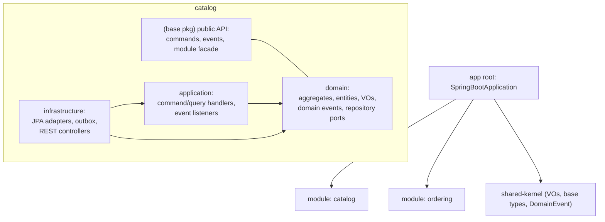
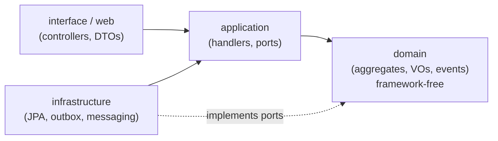
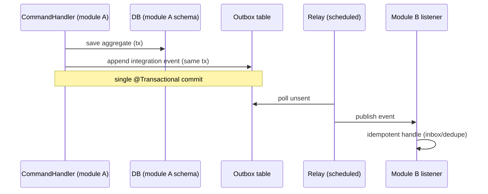

# Java DDD template — target architecture

**Status: draft for review.** Converges the patterns that recur across the seven
DDD references distilled under [`docs/reference/`](../reference/) into the target
architecture for the `lang/java/ddd` template. Where the references disagree,
the choice and its rationale are called out. Open questions for the reviewer are
collected at the end.

## Context

This branch produces a scaffold for **Java Spring Boot + DDD modular-monolith**
projects. The architecture below is derived from the reference notes, not
invented: each decision cites the sources that back it. The goal is a template
that is correct-by-construction (illegal dependencies fail the build), pragmatic
(no ceremony where CRUD suffices), and evolvable (a module can later be extracted
to its own service without rework).

Reference basis:
[library](../reference/ddd-by-examples-library/20260708161438-ddd-notes.md),
[factory](../reference/ddd-by-examples-factory/20260708161438-ddd-notes.md),
[jmolecules](../reference/jmolecules/20260708161438-ddd-notes.md),
[spring-modulith-with-ddd](../reference/spring-modulith-with-ddd/20260708161438-ddd-notes.md),
[axon-framework](../reference/axon-framework/20260708161438-ddd-notes.md),
[modular-monolith-with-ddd](../reference/modular-monolith-with-ddd/20260708161438-ddd-notes.md),
[domain-driven-hexagon](../reference/domain-driven-hexagon/20260708161438-ddd-notes.md).

## Convergent decisions

The five patterns present in nearly every reference, adopted as the template's
backbone:

1. **Framework-free domain.** Domain layer has zero Spring/JPA imports; behavior
   and invariants live in aggregates/VOs. (all references; explicit in library,
   factory, hexagon)
2. **Strong boundaries via jMolecules + ArchUnit + Spring Modulith.** Building
   blocks are annotated, boundaries are verified in CI, module structure is the
   package structure. (jmolecules, spring-modulith-with-ddd; library/factory use
   ArchUnit or package-private + Gradle modules as the pre-jMolecules equivalent)
3. **Transactional Outbox for integration events.** Cross-module/cross-context
   events are written in the same transaction as state changes and relayed
   asynchronously. (modular-monolith Outbox/Inbox; spring-modulith JPA event
   publication registry; library store-and-forward publisher)
4. **CQRS-lite, not event sourcing.** Write side goes through aggregates; read
   side uses dedicated read models/projections that may bypass aggregates and
   query the DB directly. Full ES is explicitly **out of scope** for the default
   template. (library read models, factory "three lanes", hexagon query shortcut;
   Axon ES kept as reference-only per its adoption caveats)
5. **Value Objects over primitives.** Typed IDs and domain primitives (Money,
   Email, date ranges) as immutable records; no primitive obsession.
   (all references; "domain primitives" in hexagon, `Association<T,ID>` in
   jmolecules)

Supporting decisions that recur:

- **Package-by-bounded-context, then by layer inside** (library, factory,
  spring-modulith). Module facade as the only inbound entry point (modular-monolith).
- **Thin application services / command handlers**: load aggregate → invoke one
  domain method → save; no business logic in the application layer (library,
  factory, hexagon).
- **Explicit business rules**: a `checkRule(BusinessRule)` helper on the aggregate
  base, each rule a small testable class (modular-monolith) — preferred over
  scattered `if/throw`.
- **Typed-result error handling**: expected domain failures as a `Result`/sealed
  error type mapped to HTTP status; throw only for unrecoverable faults (hexagon,
  library `Either`).
- **Match architecture to complexity**: don't force the hexagon on simple CRUD
  sub-modules (library Catalogue, factory Spring Data REST lane).

## Module & package layout

Package-per-bounded-context under the app base package; layers are sub-packages.
Cross-module types live in the module's **base package** (the public API);
`domain` / `application` / `infrastructure` are internal.

Reviewer note: the two example modules (`catalog`, `ordering`) are placeholders —
the scaffold ships one worked module plus a template module. See open question Q3.

## Dependency rule

Dependencies point inward; the domain depends on nothing framework-specific.
Enforced by ArchUnit + jMolecules, not convention.

## Tactical building blocks

Annotated with jMolecules so intent is explicit and machine-checkable:

| Block | jMolecules | Notes |
| --- | --- | --- |
| Aggregate root | `@AggregateRoot` / `AggregateRoot<T,ID>` | consistency boundary; state private; mutated only via intention-revealing methods |
| Entity | `@Entity` | identity + lifecycle within an aggregate |
| Value Object | `@ValueObject` (record) | immutable, structural equality, validated on construction |
| Identifier | `@Identity` + `Identifier` (record) | typed IDs, no bare `UUID`/`Long` |
| Cross-aggregate ref | `Association<T,ID>` | reference by identity, never object graph |
| Domain event | `@DomainEvent` (record) | raised from the root, dispatched on commit |
| Repository port | `@Repository` interface in domain | adapter in infrastructure |

Write path: `Controller → Command → CommandHandler → load aggregate via
repository port → aggregate method (checkRule + registerEvent) → save → outbox`.

Read path: `Controller → Query → QueryHandler → read model / projection (may hit
DB directly) → Response DTO`.

## Inter-module communication & Outbox

Modules never call each other's internals. Within a context, domain events fire
in-process on transaction commit (Spring `ApplicationEventPublisher` /
`@ApplicationModuleListener`). Across contexts, integration events go through a
transactional **Outbox** for at-least-once, eventually-consistent delivery; the
consumer side dedupes (Inbox) for idempotency.

Default relay: Spring Modulith JPA event publication registry (no external broker).
Debezium CDC and a message broker are documented as scale-up options, not defaults.

## Enforcement (correct-by-construction)

- **jMolecules ArchUnit rules** (`JMoleculesDddRules`, `ensureHexagonal`) — DDD
  structural invariants.
- **Custom ArchUnit rules** — domain must not depend on Spring/JPA/infrastructure;
  no module references another module's internal packages.
- **Spring Modulith** `ApplicationModules.verify()` — module boundaries + no cycles;
  `Documenter` generates C4/PlantUML module docs from code.
- All three run as ordinary tests in CI, so boundaries can't erode.

## Proposed default stack

Spring Boot 3.x/4.x, Spring Modulith, jMolecules (ddd + archunit + bytebuddy +
spring + jackson), Spring Data JPA, PostgreSQL (schema-per-module), Bean
Validation, MapStruct (entity↔persistence), ArchUnit, Testcontainers. Kept as a
proposal pending Q1/Q2.

## Open questions for review

- **Q1 — Boot/Modulith baseline**: pin Spring Boot 4 / Spring Modulith 2 (matches
  spring-modulith-with-ddd) or stay on Boot 3.x LTS for broader adoption?
- **Q2 — jMolecules ByteBuddy**: adopt the build-time plugin (generate JPA/Spring
  boilerplate from domain annotations) or keep an explicit persistence model +
  MapStruct mapper (hexagon style)? Trade-off: less boilerplate vs. more magic.
- **Q3 — Scaffold scope**: ship one fully worked bounded context (with outbox,
  read model, tests) + one skeleton module, or just skeletons?
- **Q4 — Command/query bus**: hand-rolled dispatcher over typed handler beans, or
  direct injection of handlers (no bus)? References split on this.
- **Q5 — Result vs exceptions**: standardize on a `Result`/`Either` type
  (library/hexagon) or a sealed domain-exception hierarchy + `@ControllerAdvice`?
- **Q6 — Persistence**: Spring Data JPA (matches most refs) vs Spring Data JDBC
  (library) for the default — JDBC keeps the model simpler and closer to DDD.

## Consequences (once accepted)

- A `decision/` record will pin the accepted answers to Q1–Q6.
- `ARCHITECTURE.md`, `CODE_STYLE.md`, and the module skeleton on this branch will
  be written to match; the docs-system skeleton stays owned by main (see
  main's decision on docs ownership).
