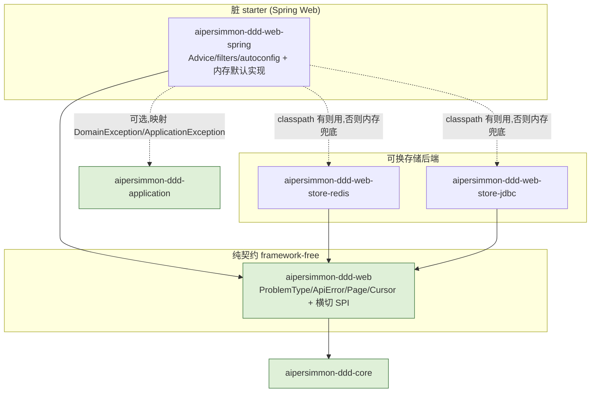

# aipersimmon-ddd Web 层构件族设计:`-web` / `-web-spring` / `-web-store-{redis,jdbc}`

把 [[decision-00007-web-api-response-envelope]] 定的策略落成**可实现的模块设计**。决策(做什么/为什么)与
证据(15+ 大厂 + IETF 标准,见 [[analysis-00008-web-api-response-envelope]])不在此重复;本文给**怎么做**:
模块划分、依赖图、SPI 签名、包结构、config 属性、装配条件、线上契约与测试策略。

严守 [[analysis-00006-ddd-building-blocks-library]] 的纯/脏分离,并**照搬 outbox 的"契约 + 可换存储 +
确定性装配"骨架**(见 [[design-00001-aipersimmon-ddd-and-scaffold]] §5.8)。本设计是 design-00001 §5 之外的
新增量,design-00001 §三依赖图与 §5 清单应加一处指针引用本文。

## 一、范围:v1 做什么、什么留后

| 分类 | 条目 |
| --- | --- |
| **v1 纳入** | ①响应/错误线上契约(无信封 + RFC 9457 ProblemDetail);②`@RestControllerAdvice` 异常映射(400/404/409/422/429);③traceId;④分页值对象 + 序列化;⑤i18n;⑥幂等键(opt-in);⑦防重放(opt-in);⑧限流 429(opt-in);⑨可换存储 redis/jdbc |
| **未来项**(该做,非反最佳实践) | CORS(用 Spring 原生 / 网关,构件不封装);401/403→ProblemDetail(需 Spring Security,`@ConditionalOnClass` 条件化增量,见 [[decision-00007-web-api-response-envelope]] §六) |
| **明确不做**(反最佳实践) | 通用 `{code,message,data}` 成功信封;恒返 200;通用 `ApiRequest` 外壳 |

## 二、贯穿性设计约束

1. **`-web` 必须 framework-free**:只依赖 `-core`,不引 Spring/Jackson。RFC 9457 语义用**自有** `ApiError`
   值模型表达(不绑 `org.springframework.http.ProblemDetail`),Spring 的 `ProblemDetail` 只在 `-web-spring` 出现。
2. **需要状态的三能力(幂等/nonce/限流计数)共用一套存储抽象**:本质都是"带 TTL 的短时键值状态",
   故 SPI 定义在 `-web`,实现在 `-web-store-*`,**与 outbox 的 core+存储后端同构**。
3. **装配确定性(照搬 outbox)**:store 后端在 classpath → 用它;否则**内存兜底**(`@ConditionalOnMissingBean`)。
   内存实现仅单机/开发;多实例生产须显式引入恰好一个 `-web-store-*`。
4. **每能力独立开关**,零风险项(ProblemDetail/traceId/分页/i18n)默认开,有成本/副作用项(幂等/防重放/限流)默认关。
5. **命名默认 camelCase**(顺 Jackson);全局经 `@JsonNaming` 一处可切(决策问题 1)。**版本走 URL 路径 `/v{major}/`**(决策问题 2)。
6. 每个 package 有 `package-info.java`(承 design-00001 §二规约 5,受 `-archunit` 校验)。

## 三、模块依赖图



> 依赖箭头一律指向内/下。`-web` 零框架(绿色);`-web-spring` 是唯一引 Spring Web 的模块;
> 两个 `-web-store-*` 只依赖 `-web`(+ Redis/JDBC),彼此独立、同 SPI 可互换。

## 四、`aipersimmon-ddd-web`(纯契约,→ `-core`)

`packaging=jar`,parent = 库 parent;**无 Spring/Jackson 依赖**(仅 test junit)——这是验收红线。

包结构:

```
com.aipersimmon.ddd.web
├── error/      ProblemType(接口) ApiError FieldError ApiException(基类,可选)
├── page/       Page<T>  Slice<T>  Cursor
└── spi/        IdempotencyStore  ReplayGuard  RateLimiter  RequestSignatureVerifier
```

### 4.1 错误契约 `error/`

- **`ProblemType`(接口)**:错误码目录的抽象。每个 BC 用**枚举**实现它(决策问题 5):

  ```java
  public interface ProblemType {
      String code();          // 机器码,如 "ordering.credit-exceeded"(BC 前缀防冲突)
      String typeUri();       // 相对 URI,如 "/problems/credit-exceeded"(标识符,不要求可解析)
      int status();           // 默认 HTTP 状态,如 409
      String titleKey();      // i18n 消息 key(title 稳定、跨发生不变)
  }
  ```

- **`ApiError`**:RFC 9457 的**框架无关**值模型(对齐 `{type,title,status,detail,instance}` + 扩展成员),
  由 `-web-spring` 翻译成 Spring `ProblemDetail`。字段:`type`/`title`/`status`/`detail`/`instance` +
  扩展 `code`/`traceId`/`errors`(`List<FieldError>`)。不可变,构造即校验。
- **`FieldError`**:字段级校验明细元素 `{field, code, message}`(对齐 PayPal/GitHub/JSON:API 的 `details`)。
- **`ApiException`(可选基类)**:携带 `ProblemType` + 参数的运行时异常,便于 handler 直接抛;
  与 `-core` `DomainException` / `-application` `ApplicationException` 的映射由 starter 兜底(见 §5.1)。

### 4.2 分页契约 `page/`

- **`Cursor`**:不透明游标值对象(封装 base64 编码的位置;客户端不得构造/解析,承 Zalando #160)。
- **`Slice<T>`**:`items` + `nextCursor`(可空)——**cursor 为主**,不查总数,契合大厂新接口。
- **`Page<T>`**:`Slice<T>` + `totalElements`/`totalPages`(offset 兼容档,需要总数时用)。
- 线上序列化形态见 §八;序列化本身在 starter(纯层不绑 Jackson)。

### 4.3 横切 SPI `spi/`（实现在 `-web-store-*` / starter 内存默认）

```java
// 幂等:存首次响应并回放(键=Idempotency-Key)
interface IdempotencyStore {
    Optional<StoredResponse> find(String key);
    boolean saveIfAbsent(String key, StoredResponse response, Duration ttl); // 原子占位
}
// 防重放:nonce 单次去重(时间窗校验在 filter,这里只管 nonce 唯一性)
interface ReplayGuard {
    boolean seenBefore(String nonce, Duration ttl);   // 首见=false 并记下;再见=true
}
// 限流:取一个令牌,返回决策(是否放行 + 剩余 + 重置时刻)
interface RateLimiter {
    Decision tryAcquire(String key, RateLimitPolicy policy);
}
// 签名校验(防重放的签名部分;webhook/签名请求共用)
interface RequestSignatureVerifier {
    boolean verify(SignedRequest request);            // 校验 HMAC 等
}
```

> `RateLimitPolicy`(窗口/配额/算法)、`Decision`(allowed/remaining/resetAt/retryAfter)、`StoredResponse`
> (status/body/headers)、`SignedRequest` 均为 `-web` 内的小值对象。

## 五、`aipersimmon-ddd-web-spring`(脏 starter,→ `-web` + Spring Web,可选 `-application`)

引 `spring-boot-starter-web`;`-application` 为 `optional`(仅当需映射 `ApplicationException`)。
Boot 自动装配(`AutoConfiguration.imports`)。

### 5.1 异常 → ProblemDetail 映射(默认开)

- **`AipersimmonDddWebExceptionHandler`(`@RestControllerAdvice`)**:集中映射,产出 Spring `ProblemDetail`
  (媒体类型 `application/problem+json`),扩展成员写入 `code`/`traceId`/`errors`。映射表:

  | 异常 | HTTP | 说明 |
  | --- | --- | --- |
  | `ApiException`(带 `ProblemType`) | `ProblemType.status()` | 首选路径:type/code/title 全来自目录 |
  | `-core` `DomainException` | 409(可按子类细分) | 语义冲突默认 Conflict |
  | `-application` `ApplicationException` | 422/409 | 用例级失败 |
  | Bean Validation(`MethodArgumentNotValidException` 等) | 400 | 填 `errors[]`(field/code/message) |
  | `NoSuchElementException` / 自定义 NotFound | 404 | |
  | `RateLimitExceededException`(§5.5) | 429 | 带 `Retry-After` + `RateLimit-*` |
  | 兜底 `Exception` | 500 | 不泄漏堆栈(承 Zalando #177) |

- **不依赖** `spring.mvc.problemdetails.enabled`——本 advice 显式接管,保证扩展成员与 i18n 一致。

### 5.2 traceId(默认开)

- **`TraceIdFilter`**(高优先级):读取 `X-Trace-Id`(可配),缺失则生成 UUID;写入 **MDC**(日志关联)、
  **响应头**回显、并供 advice 写入 ProblemDetail 扩展成员。属性 `trace.header`/`trace.generate-if-absent`。

### 5.3 分页序列化(默认开,用到才生效)

- 提供 `Slice<T>`/`Page<T>` 的 Jackson 序列化(camelCase:`items`/`nextCursor`/`totalElements`…);
  `Cursor` 编解码工具。控制器直接返 `Slice`/`Page`,无通用信封。

### 5.4 i18n(默认开,缺省英文)

- `MessageSource` 按 `ProblemType.titleKey()` / 校验 code 取文案;`Accept-Language` 决定 locale;
  缺省 bundle 英文。属性 `i18n.basename` 等。

### 5.5 幂等键(opt-in,`idempotency.enabled`)

- **`IdempotencyFilter`**:对写方法读取 `Idempotency-Key` 头(可配);经 `IdempotencyStore.saveIfAbsent`
  原子占位——首次放行并在完成后存 `StoredResponse`;重放命中则**回放首次响应**(status/body/headers)。
  TTL 默认 24h(对齐 Stripe)。键缺失时按 `require-key` 策略选择放行或 400。

### 5.6 防重放(opt-in,`replay.enabled`)

- **`ReplayProtectionFilter`**:①用 `RequestSignatureVerifier` 校验签名;②校验时间戳容差(默认 **5 分钟**,
  可配;基础设施签名场景可调 15 分钟);③若 `replay.nonce.enabled`,再经 `ReplayGuard.seenBefore` 做**单次 nonce 去重**。
  任一不过 → 401/400(problem+json)。签名/时间戳/nonce 的头名可配(适配 Slack/Stripe/自定义 webhook)。
- 默认仅时间窗(窗内可重放);开 nonce 才是单次语义,需 `-web-store-*`(承 decision §五)。

### 5.7 限流(opt-in,`rate-limit.enabled`)

- **`RateLimitFilter`**:按可配的**键提取**(IP/用户/API key)+ `RateLimitPolicy` 调 `RateLimiter.tryAcquire`;
  拒绝时抛 `RateLimitExceededException` → advice 出 **`429`** + **`Retry-After`**(秒)+ 响应头
  **`RateLimit` / `RateLimit-Policy`**(IETF 草案结构化字段;`headers` 可配为 `ietf`/`legacy X-RateLimit-*`/`both`)+
  ProblemDetail 体(`type=/problems/rate-limited`)。

### 5.8 装配

- **`AipersimmonDddWebAutoConfiguration`**:注册 advice、traceId filter、分页序列化、i18n——默认开,`@ConditionalOnMissingBean` 可覆盖。
- **`AipersimmonDddWebSecurityAutoConfiguration`**(名义,内含幂等/防重放/限流 filter):各 filter 由对应
  `@ConditionalOnProperty(...enabled=true)` 守卫;**默认内存 SPI 实现**(`InMemoryIdempotencyStore` 等)用
  `@ConditionalOnMissingBean` 兜底——存储后端在 classpath 时被顶替。

## 六、存储后端 `-web-store-redis` / `-web-store-jdbc`(→ `-web` + Redis/JDBC)

同 §二约束 2/3,提供三个 SPI 的实现,**同 SPI 可互换**;消费者按需引恰好一个(多实例生产必须引)。

### 6.1 `-web-store-redis`(→ `-web` + `spring-boot-starter-data-redis`)

| SPI | Redis 实现 |
| --- | --- |
| `IdempotencyStore` | `SET key payload EX ttl NX` 占位 + `GET` 回放 |
| `ReplayGuard` | `SET nonce 1 EX ttl NX`(存在即已见) |
| `RateLimiter` | 令牌桶/滑窗 **Lua 原子脚本**(`INCR`+`EXPIRE` 或 token bucket) |

- `AipersimmonDddWebStoreRedisAutoConfiguration`:`@ConditionalOnClass(RedisTemplate)` + `@ConditionalOnBean(RedisConnectionFactory)`,各 bean `@ConditionalOnMissingBean`。

### 6.2 `-web-store-jdbc`(→ `-web` + `spring-boot-starter-jdbc`)

- 表(建表由消费者负责,主包附**非自动执行**样例 DDL `META-INF/aipersimmon-ddd/web-store-schema.sql`,承 outbox 惯例):
  - `aipersimmon_web_idempotency`:`idempotency_key`(PK)/`response_status`/`response_body`/`response_headers`/`created_at`/`expires_at`
  - `aipersimmon_web_nonce`:`nonce`(PK)/`created_at`/`expires_at`
  - `aipersimmon_web_rate_limit`:`bucket_key`+`window_start`(PK)/`count`(固定窗口计数)
- 过期清理:`@Scheduled` 删过期行(与 outbox relay 同风格)。
- **诚实记录**:JDBC 做限流是"够用但非最优"——高并发下固定窗口有边界突刺、行锁竞争;**生产限流首选
  `-web-store-redis`**。JDBC 主要覆盖幂等/nonce 与"已有关系库、不想引 Redis"的场景。
- `AipersimmonDddWebStoreJdbcAutoConfiguration`:`@ConditionalOnBean(JdbcTemplate)` + `@ConditionalOnMissingBean`。

## 七、配置属性总表(`aipersimmon.ddd.web.*`)

| 属性 | 默认 | 含义 |
| --- | --- | --- |
| `problem-details.enabled` | `true` | 异常→ProblemDetail 映射 |
| `trace.enabled` / `trace.header` / `trace.generate-if-absent` | `true` / `X-Trace-Id` / `true` | traceId |
| `i18n.basename` | (缺省英文 bundle) | 错误文案 i18n |
| `idempotency.enabled` / `.header` / `.ttl` / `.require-key` | `false` / `Idempotency-Key` / `24h` / `false` | 幂等键 |
| `replay.enabled` / `.tolerance` / `.timestamp-header` / `.signature-header` | `false` / `5m` / — / — | 防重放(时间窗 + 签名) |
| `replay.nonce.enabled` / `.nonce-header` | `false` / — | nonce 单次去重(需 store) |
| `rate-limit.enabled` / `.policies` / `.key` / `.headers` | `false` / — / `ip` / `ietf` | 限流 |
| `store` | `in-memory`(或按 classpath 自动) | 幂等/nonce/限流的存储后端 |

> 命名默认 camelCase 属 Jackson 全局配置(`@JsonNaming` 可切),不在此属性树内。

## 八、线上契约(wire examples)

**成功·单资源**(无信封,真实状态码):

```
HTTP/1.1 201 Created
Content-Type: application/json
{ "id": "ord_123", "status": "PLACED", "totalMinor": 5000, "currency": "USD" }
```

**成功·集合**(分页壳,非成功信封):

```json
{ "items": [ { "id": "ord_123" } ], "nextCursor": "b3JkXzEyMw==" }
```

**失败**(RFC 9457 + 扩展成员):

```
HTTP/1.1 409 Conflict
Content-Type: application/problem+json
{
  "type": "/problems/credit-exceeded",
  "title": "Credit limit exceeded",
  "status": 409,
  "detail": "Order total 5000 exceeds remaining credit 3000",
  "instance": "/v1/orders",
  "code": "ordering.credit-exceeded",
  "traceId": "b1f2...",
  "errors": []
}
```

**限流**:

```
HTTP/1.1 429 Too Many Requests
Retry-After: 30
RateLimit: "default";r=0;t=30
RateLimit-Policy: "default";q=100;w=60
Content-Type: application/problem+json
{ "type": "/problems/rate-limited", "title": "Too Many Requests", "status": 429, "traceId": "..." }
```

## 九、落地顺序与测试

**顺序**(每步可独立验收,承 design-00001 "一个一个做"):

1. `-web`(纯契约 + SPI + 值对象);单测:`ApiError`/`Page`/`Cursor` 构造校验、`ProblemType` 枚举样例。
2. `-web-spring` 核心(advice + traceId + 分页 + i18n);切片测试 `@WebMvcTest`:异常→problem+json、扩展成员、traceId 回显。
3. `-web-spring` opt-in 三能力(幂等/防重放/限流)+ 内存默认实现;filter 级测试 + 开关矩阵。
4. `-web-store-redis` / `-web-store-jdbc`;各自 SPI 契约测试(Testcontainers Redis / H2),验证与内存实现同语义 + 装配顶替。
5. `-bom` 追加 4 个坐标;`-archunit`(可选)加一条"controller/adapter 不得依赖 domain 内部"规则。

**测试不依赖实时外部件**:Redis 用 Testcontainers,JDBC 用 H2,limiter 用固定时钟注入。

## 十、后果与开放项

**正向**:纯/脏/存储三层与 outbox 完全同构,认知与装配零新范式;能力全 opt-in、存储可换,既不绑 Redis 也不逼单机装 Redis;错误/分页/追踪线上契约标准化、可互操作。

**负向 / 注意**:
- 内存 SPI 不可用于多实例生产(与 outbox 存储选择同理),须显式引一个 `-web-store-*`。
- JDBC 限流非最优(§6.2),生产限流首选 Redis。
- 错误格式在 auth 边界暂不统一(401/403 未来项);限流与网关限流勿混算配额。
- 新增 4 个构件,`-bom` 与 CI/发布(design-00001 §4 Phase 4 的 `publish-library.yml`)需纳入。

**开放项**:①CORS/401-403 未来项的条件化增量(`@ConditionalOnClass(spring-security)`);②`-web-store-mybatis-plus`
是否补齐(与 outbox/inbox 对齐);③限流算法(固定窗/滑窗/令牌桶)默认选型;④签名校验的内置算法族(HMAC-SHA256 等)与 webhook 预设(Slack/Stripe 风格)是否内置。

## Sources

内部:

- [[decision-00007-web-api-response-envelope]] —— 本设计的决策来源(策略、六个遗留问题、opt-in+可插拔原则、未来项)。
- [[analysis-00008-web-api-response-envelope]] —— 15+ 大厂 + IETF 标准证据底座(响应/错误/分页/命名/版本/幂等/防重放/限流)。
- [[analysis-00006-ddd-building-blocks-library]] —— 纯/脏分离硬约束、模块清单。
- [[design-00001-aipersimmon-ddd-and-scaffold]] —— 库总设计;§5.8 outbox 的"契约+可换存储+确定性装配"骨架为本设计蓝本(§三依赖图与 §5 清单需加指针引用本文)。

外部(一手):

- RFC 9457 Problem Details。https://www.rfc-editor.org/rfc/rfc9457
- `Retry-After`(RFC 9110 §10.2.3)/ `429`(RFC 6585 §4)。https://www.rfc-editor.org/rfc/rfc9110.html#section-10.2.3 、 https://datatracker.ietf.org/doc/html/rfc6585
- IETF RateLimit 头草案(`RateLimit`/`RateLimit-Policy`)。https://datatracker.ietf.org/doc/draft-ietf-httpapi-ratelimit-headers/
- Stripe 幂等键。https://docs.stripe.com/api/idempotent_requests ;Stripe webhook 签名(5 分钟)。https://docs.stripe.com/webhooks/signature
- Zalando 指南(problem JSON / cursor / 不泄漏堆栈)。https://opensource.zalando.com/restful-api-guidelines/
