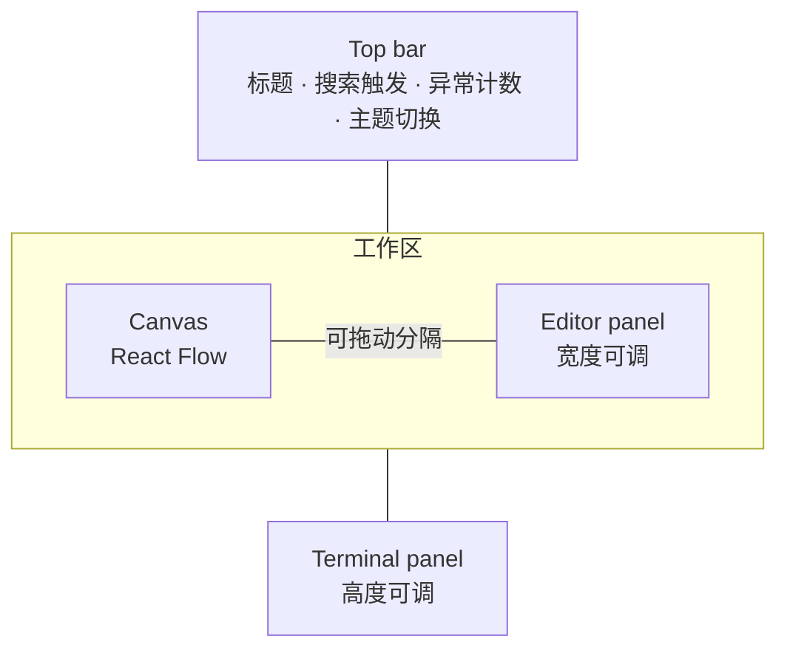
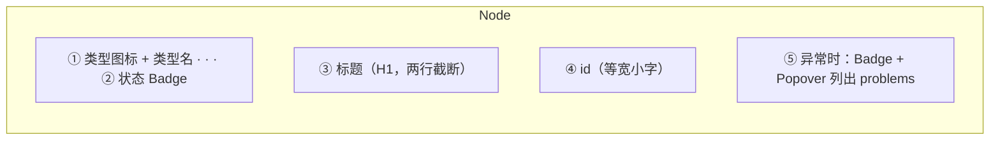

# Design: Docs 白板界面

> 白板界面的结构：设计令牌、布局、控件清单与图标语言。技术基座由
> [decision-00001-whiteboard-ui-stack](../decision/decision-00001-whiteboard-ui-stack.md)
> 定下（Tailwind 4 + shadcn/ui + Lucide）。

本文只管界面。数据模型、API、会话与 git 由
[design-00001-docs-whiteboard](design-00001-docs-whiteboard.md) 持有。两处触及
它：节点种类的下发方式（§4），以及画布布局——布局选型属 design-00001 §1，其
规则由 [decision-00002-whiteboard-layout](../decision/decision-00002-whiteboard-layout.md)
持有，本文 §2 只画出它的样子、§4 只定锚点与边的呈现。

**本文取代 design-00001 §7 末段的「前端 Graph View 职责补充」**（着色与搜索/
定位）——那一段与本文 §2、§4 是同一主题，两份活文档不能同时持有；其中的搜索/
定位已由 `spec-00001-FR-26`、`FR-27` 承接，不再是非功能项。本文进入 `active`
时，design-00001 该段替换为指向本文的一行指针，`spec-00001` §5 的 Technical
Design 表与 Links 同时补上本文。除 §8 裁定引入的 FR-26/FR-27 及其 AC 与 §7
非功能项外，在此之前不改动那两份 `active` 文档。

## 1. 设计令牌

单一来源是 `web/src/style.css`（Tailwind 4 的 CSS-first 配置；若按 Tailwind 约定
更名为 `index.css`，`main.tsx` 的导入同步更新）。`:root` 与 `.dark` 各一套变量，
shadcn/ui 的组件读的就是这套，因此改主题只改一处。

除 shadcn 的基础语义色（`--background`、`--foreground`、`--primary`、
`--destructive`、`--muted`、`--border`、`--ring`）外，白板另立两组领域令牌：

| 令牌组 | 成员 | 用途 |
| --- | --- | --- |
| `--status-*` | `draft` `active` `open` `resolved` `wontfix` `archived` | 文档状态，每个状态一组前景/背景对 |
| `--kind-*` | `living` `work` | 文档种类，用于节点的类型标记 |
| `--coverage-*` | `verified` `failing` `uncovered` | 需求条目的覆盖状态（§9），每态一组前景/背景对；不复用 `--status-*`——覆盖与文档状态是两套词汇 |

异常态不进 `--status-*`：它不是一个状态值，取 `--destructive`。`status.ts` 现有的
硬编码十六进制（6 个状态色 + `ANOMALY_COLOUR`）随之退场，`statusColour()` 改为
返回令牌引用（`var(--status-*)`）而非字面色值——它喂进 inline style，因此仍是
色值位置上的表达式，只是随主题变；`statusLabel()` 不变。

**主题三态的机制**（浅色 / 深色 / 跟随系统）：

- Tailwind 4 的 `dark:` 变体默认走 `prefers-color-scheme`，而本设计需要 class
  策略，因此显式声明 `@custom-variant dark (&:where(.dark, .dark *))`。
- localStorage 存三态之一；`light`/`dark` 直接决定 `.dark` 类的有无。
- `system` 态下监听 `matchMedia('(prefers-color-scheme: dark)')` 的变化事件增删
  `.dark`，页面加载时先同步一次。
- 主题偏好是纯呈现状态，不进 `docs/`，也不构成对「文件是唯一事实来源」的例外。

## 2. 布局

常驻区域（自上而下、自左而右）：



浮于其上的三者不占布局：**浮窗工具栏**贴选中节点悬浮于画布；**命令面板**是
覆盖全屏的对话框；**提示条**堆叠在画布一角。（澄清对话框第八轮废弃——澄清
改为发起会话，见 decision-00006。）

与当前实现的结构差异，以及每项的代价：

- **编辑器面板到右侧、终端面板留在底部**，两者各自可调、互不占位。依据是内容
  形状不同：文档是竖排长文，编辑与预览在窄而高的区域里更可读；终端输出是宽行
  （框线、表格、diff、长路径），在右侧面板里会折行到不可读，而底部放得下。
  （量级估算：1400px 视窗、12px 等宽字号下，右侧面板约 480px ≈ 55 列，底部
  约 180 列。默认宽度与字号落地时定，此处只作定性依据。）
  代价有两处：两种面板形态都要实现，而不是共用一个容器；**面板状态模型也要改**
  ——现实现的 `Panel` 是 `none | editor | terminal` 三选一，编辑器与终端不能同时
  在场，而本设计要求两者并存，须改为两个独立轴：**右槽**（无 / 编辑器 / 检视
  面板，三值——检视面板系第四轮引入，占用规则见 §9）与**终端**（开 / 关）。
  （本段初版写的是「两个独立开关」，§9 引入检视面板后右槽变为三值，已随之修订。）
  两者的尺寸都由 `react-resizable-panels` 持有。落地实测的结果与原设想不同：
  v4 **没有** `autoSaveId`，持久化走 `useDefaultLayout({ id, panelIds })`——它
  返回喂给 `Group` 的 `defaultLayout` 与 `onLayoutChanged`，默认落 localStorage。
- 动作被拒与失败的信息从画布下方的红条改为**提示条（toast）**：它是对某次动作
  的反馈，不该占据布局、压缩画布。
- 「找文档」从顶栏常驻输入框改为**命令面板**（⌘K / Ctrl-K），承载 spec-00001
  FR-26 与 FR-27 的检索与跳转。**代价是可发现性净损失**：搜索入口从常驻输入框
  退为一次点击或一个快捷键；补偿是顶栏保留触发按钮，让快捷键可被看见。

**画布内部**是一张类型分列的网格。**规则本身由
`decision-00002-whiteboard-layout` §2 持有**，此处不复述，只画出它的样子——
下面是本设计落地时本仓文档的一次快照（17 份、用到 9 个类型），不是活的清单：

```
        idea         prd          spec         rule       decision       design        plan        issue       record
row0   idea-00001  prd-00001   spec-00001  rule-00001  decision-00001  design-00001  plan-00001  issue-00001  record-00001
row1                                                   decision-00002  design-00002  plan-00002  issue-00002  record-00002
row2                                                                                 plan-00003  issue-00003
row3                                                                                             issue-00004
```

读法：横向是阶段，纵向是同一类型内的序号。图宽等于**实际用到的类型数**（此处 9）
而非配置里声明的 16——没有文档的类型不占列。

这套规则是同步纯函数，不需要布局引擎；它换掉的 ELK 与所接受的代价（无交叉
最小化、纵向无界、列序由 YAML 声明顺序承载）见 decision-00002 §4。

**布局与配置的到位次序**：列序来自 `GET /api/config`，而当前 `useBoard` 是
把它与 `GET /api/graph` 各自独立地取的（`web/src/useBoard.ts:63-66`），首屏
因此可能没有列序。本设计要求**两者都到位后才落位**，而不是先按无序布局画一遍
再重排——后者会让节点在首屏跳一次，直接违背 decision-00002「位置可预期」的立论。

## 3. 控件映射

| 界面位置 | 现在 | 改为 | 图标（Lucide） |
| --- | --- | --- | --- |
| 顶栏标题 | 纯文本 | 文本 + 图标 | `LayoutDashboard` |
| 找文档 | 裸 `<input>` | `Command` + `Dialog`（⌘K），顶栏留触发按钮 | `Search` |
| 异常计数 | 纯文本 | `Badge`；为 0 时保持现有的 `no issues` 文案，>0 时 destructive 变体 | `TriangleAlert` |
| 主题切换 | 无 | `DropdownMenu`（浅色/深色/跟随系统） | `Sun` `Moon` `Monitor` |
| 节点 | 手写 div | shadcn `Card` 承载 + `Badge` | 见 §4 |
| 浮窗工具栏 | 浮动 div + 原生控件 | `Card` 容器 + `Tooltip` 包裹的 `Button` | 见下 |
| 状态切换 | `<select>` | `DropdownMenu`，逐项列出合法目标状态 | `GitBranch` |
| 接收 | `<button>` | `Button`（default 变体） | `Check` |
| 澄清 | 工具栏内联 textarea | `Button`，点击即发起澄清会话（终端内逐题提问；第八轮由 decision-00006 改写，原 `Dialog` + `Textarea` 废弃）；仅可澄清类型的节点呈现 | `MessageCircleQuestionMark` |
| 答疑 | 无 | `Button`（ghost 变体），点击即发起答疑会话（终端内多轮讨论，`spec-00001-FR-47`） | `CircleHelp` |
| 终止会话 | 无 | 终端面板头部 `Button`（destructive 变体），仅会话 running 时可用，点击即终止（`spec-00001-FR-49`，issue-00010） | `Square` |
| 发起入口禁用说明 | 无 | 推进/澄清/答疑因会话运行禁用期间，悬停/聚焦呈现 `Tooltip`「session running」；与「no next step」并存时后者优先（它不随会话结束消失，`AC-49.5`） | — |
| 顶栏会话入口 | 无 | 会话 running 且终端面板已收起时，顶栏呈现会话状态 `Badge`/`Button`，点击重开终端面板——终止因此始终可达（`AC-49.8`） | `Terminal` |
| 推进 | `<select>` | `DropdownMenu`，逐项列出下一步类型；**无候选时按钮 disabled，并在 `Tooltip` 与菜单内呈现「no next step」**（spec-00001-AC-10.3） | `Plus` |
| 编辑 | `<button>` | `Button`（ghost 变体） | `Pencil` |
| 关系列表 | 无 | `Popover` + 按关系字段分组的列表，每项一行「字段名 · 方向 · 对端 id」，点击即定位并选中对端（`spec-00001-FR-30`）；无关系时呈现「no relations」 | `Waypoints` |
| 编辑/预览切换 | 两态按钮 | `Tabs`（Source / Preview） | `Code` `Eye` |
| 保存 | `<button>` | `Button`，保存中为 disabled + spinner | `Save` `Loader` |
| 关闭面板 | `<button>` | `Button`（ghost, icon） | `X` |
| 动作被拒 / 冲突 | 面板内纯文本 / 画布下红条 | `Sonner` 提示条，错误态（`toast.error`） | `TriangleAlert` |
| 编辑器面板 | 底部固定 45vh | 右侧 `ResizablePanel`，宽度可调并持久化 | — |
| 终端面板 | 底部固定 45vh | 底部 `ResizablePanel` + `Card` 头 + 会话状态 `Badge`（running/exited/failed），高度可调 | `Terminal` |
| 空画布 | 空白 | 空状态：图标 + 一句说明 | `FileQuestionMark` |
| 检视面板 | 无 | 右侧 `ResizablePanel`，选中 spec/rule 节点时可见，与编辑器互斥占用右槽（§9）；条目行含 id、正文、AC 计数与覆盖图标（`spec-00001-FR-31`…`FR-33`） | `PanelRight` `CircleCheck` `CircleX` `CircleDashed` |
| 子画布面包屑 | 无 | shadcn `Breadcrumb`，仅子画布中出现，「Board」项可点返回（`spec-00001-FR-35`/`FR-36`） | `ChevronRight` |

**异常节点的工具栏只保留「编辑」与「关系列表」两项**（spec-00001-AC-2.4，本轮
随 FR-30 修订）：前者用于修复 front matter，后者用于读出断链指向了谁——两者都不
改动任何文档。状态切换、评审、推进仍不渲染。上表描述的是正常节点的完整形态。

**用下拉菜单而不是 `<select>`**：状态切换与推进都是「执行一个动作」，不是「选定
一个值」——现有实现要把 `<select>` 的 value 强行复位成空串才能重复触发同一动作，
这是语义错配的症状。`DropdownMenu` 的每一项是一个动作项，语义对上了。

## 4. 节点

一个节点承载四件事，按信息层级排布（以 shadcn `Card` 组件作为实现载体）：



- **类型图标**：每个文档类型一个 Lucide 图标 —— `idea: Lightbulb`、
  `prd: Target`、`spec: FileText`、`rule: Scale`、`design: DraftingCompass`、
  `decision: Gavel`、`plan: ListChecks`、`task: SquareCheck`、`issue: Bug`、
  `record: ClipboardCheck`、`analysis: ChartLine`、`integration: Plug`、
  `reference: BookMarked`、`operation: Wrench`、`prompt: MessageSquare`、
  `report: FileChartColumn`。配置里出现而此处未列的类型回落到 `File`。
  （以上标识符已对 lucide 上游逐个核实；落地时按所装 `lucide-react` 版本复验。）
- **种类描边**：living 与 work 用 `--kind-*` 区分。**种类当前不经 API 下发**——
  `DocNode` 没有 `kind` 字段，它只存在于流程配置。两条路径二选一：给 `DocNode`
  增加 `kind`（则 design-00001 §7 的 `GET /api/graph` 契约需同步修订），或前端读
  `GET /api/config` 自行由 `type` 映射。**已裁定取后者**并落地：`useBoard` 拉
  `GET /api/config` 得到 `types`，节点按 `type` 查其 kind；`GET /api/graph` 的
  契约不变。
- **状态 Badge**：保持现有的「颜色 + 状态词」（`statusLabel()` 已渲染状态词），
  令牌化后颜色可随主题变，不靠颜色单独传达。
- **异常节点**：描边转 `--destructive`，节点面只留一个 `TriangleAlert` Badge，
  problems 列表进 `Popover`（不是 `Tooltip`：tooltip 内容对键盘与触摸用户不可达，
  而可访问性正是采用本基座的理由）。现在的实现把 problems 直接铺在节点上，长
  文本会撑破布局。
- **选中态**：`--ring` 描边，与 React Flow 自身的选中样式统一。

**边有三个呈现态**，各有一个类名——`spec-00001-AC-28.x`/`AC-29.x` 的断言落在
类名上，不落在「更淡」这种无法观察的比较级上（承载 `spec-00001-FR-28`/`FR-29`，
取舍见 `decision-00003-whiteboard-edge-emphasis`）：

| 态 | 类名 | 何时 | 样式 |
| --- | --- | --- | --- |
| 弱化 | `edge--dim` | 未选中任何节点时的全部边 | `--muted-foreground`，`opacity: .28`，1px，**无标签**，位于节点之下 |
| 强调 | `edge--emphasis` | 与当前选中节点相连的边 | `--foreground`，`opacity: 1`，2px，**显示关系字段名**，`zIndex` 抬到节点之上 |
| 压弱 | `edge--suppressed` | 选中某节点时，与它无关的边 | 同弱化色，`opacity: .08`，仍无标签 |

节点同样有一个压弱态 `node--suppressed`（`opacity: .4`）：选中时与选中项无关的
节点用它。**这三个不透明度是起点，不是承诺**——落地后按真实图看一眼再定，改动
不需要回到本文档以外的任何地方。

`zIndex` 能把边抬到节点之上，已实测确认：`@xyflow/react/dist/style.css` 中
`.react-flow__edges svg` 是 `position: absolute`，故其 `z-index` 对节点层有效。

`ok: false` 的边在三态下都保持 destructive 虚线——异常不因为没被选中而消失；
异常与强调可以叠加（`spec-00001-AC-29.8`）。

边沿用 React Flow 的默认边型。另有三条规则：

- **箭头指向被引用的那份文档**。边的方向就是 front matter 的声明方向——`prd`
  写 `parent: idea`，箭头就落在 `idea` 一端。不做任何反推：`docs/README.md`
  规定每条边只在依赖方声明一次，画成别的方向就是在图上改写声明。已由产品负责人
  裁定采用此方向。
  **一条边在图上朝左还是朝右，取决于两端类型的列位，而不取决于关系字段名**：
  同一个字段两次出现可以指向相反的方向（`rule informs spec` 朝左，
  `design informs plan` 朝右）。因此不存在「某几个字段一律朝左」的规律，图上
  两个方向都会出现。**落地实测**（本仓 17 份文档、34 条边）：26 条朝左、8 条
  朝右、0 条同列。朝左占多数，但那是这批文档的类型分布所致，不是字段名的规律。
- **节点必须自带锚点**：四个方位（上/下/左/右）各一对 source/target，共 8 个。
  自定义节点接管渲染就接管了连接契约，缺锚点的节点会让 React Flow 丢弃它的
  每一条边——这正是 `issue-00002` 的根因。取 8 个而不是 4 个是为了不依赖
  `connectionMode="loose"` 的回退语义（Loose 只让 target 侧回退到 source 锚点，
  source 侧仍要求 `type="source"`），从而避免为此改动 `<ReactFlow>` 的全局 prop。
- **锚点不可见，但必须仍被布局与测量**。`display: none` 会让 React Flow 量不到
  锚点位置，等于重新制造 `issue-00002`；隐藏只能用不影响盒模型的方式
  （如 `opacity: 0`）。
- **手工连线必须显式关闭，且要关在锚点上**。React Flow 的 `nodesConnectable`
  默认为 `true`，所以锚点一旦落地，每个节点就多出四处可拖拽连线的交互——而白板
  的边只能来自 front matter。本条的写法被落地实测**推翻了两次**，两次都记在
  这里，因为它们是同一类错的两个层次：
  1. 只在 `<ReactFlow nodesConnectable={false}>` 上设不够——该 prop 只把
     `isConnectable` 传给**节点组件**，自定义节点不转发就等于没关。
  2. 每个 `<Handle>` 加 `isConnectable={false}` 仍然不够——`Handle` 的
     `isConnectableStart` / `isConnectableEnd` 是**各自独立**默认为 `true` 的，
     而 pointer-down 的守卫读的是 `isConnectableStart`。只设 `isConnectable`
     等于只摘掉了 CSS 类，拖拽通路照旧武装着。
  故三个标志全设。由 `spec-00001-AC-1.14` 守着，且该 AC 的断言必须落在
  `connectablestart` 上——只断言 `connectable` 类，等于断言那个不起作用的属性。
- **锚点按几何选**：两端不同列时走左右侧（起点出靠向对端的那一侧，终点从其对侧
  入）；同列时走上下（上方节点的下锚点 ↔ 下方节点的上锚点）；两端为同一节点时
  （文档引用了自己，`docRepository` 视其为正常边）走该节点的上下锚点成自环。
  同列的边是竖线；跨列的边只有在两端同行时才是横线，行不同即为斜线——本仓多数
  跨列边正是斜线。

## 5. 面板

`Tabs` 承载 Source / Preview 两个视图，与 spec-00001-FR-22 的互斥切换一致。
CodeMirror 在预览时仍只隐藏不卸载（FR-25 依赖它保住光标）。

- CodeMirror 主题跟随 `--background`/`--foreground`，与页面同一套令牌。
- xterm 的 `theme` 同样由令牌喂入，暗色切换时一并变。
- Preview 的 Markdown 排版用 Tailwind 的风格类手写一层（不引入
  `@tailwindcss/typography`，避免为一处排版再加一个插件），mermaid 图容器保持
  可横向滚动。

## 6. 可访问性

以下是 **Radix 承诺的行为**，不是本项目从零实现的：

- 对话框（命令面板）有焦点陷阱，Esc 关闭，关闭后焦点回到触发元素。
- 下拉菜单支持方向键、Home/End、首字母跳转；菜单项是 `menuitem` 角色。

以下是**本设计自己的约定**：

- 所有图标按钮带 `aria-label`（现有测试按可访问名查询控件，这一约定必须保持）。
- 焦点样式统一走 `--ring`，不依赖浏览器默认。
- 状态与异常不只用颜色传达，同时有文字或图标。

落地时每一条都须有对应用例实测；**未实测的行为不得写进 spec 的 AC**——库承诺
与我们的验收是两回事。

## 7. 对现有测试的影响

覆盖率范围的处置见 decision-00001 §4，此处只讲设计后果。

现有测试按可访问名（role + name）查询的部分——`Accept` / `Clarify` / `Save` /
`Close` 按钮、工具栏的可访问名——预期继续成立。以下五类断言**必然需要改写，且
不构成可访问性回归**，实施者不应把它们当真实回归去追：

1. **`<select>` 专属 API**：`toolbar.test.tsx` 的 `getByLabelText(...).options`
   与 `userEvent.selectOptions(...)`，以及 `canvas.test.tsx` 中同类调用。
   `DropdownMenu` 上没有 `HTMLSelectElement.options`。
2. **`Preview` / `Edit` 两态按钮改 `Tabs`**：两个 tab 的可访问名为 `Source` 与
   `Preview`，role 从 `button` 变 `tab`；`preview.test.tsx` 中相关断言全部受影响。
3. **顶栏 `Find a document` 输入框的两处用例**（`canvas.test.tsx`）：该控件由
   命令面板取代，须按 FR-26/FR-27 的新 AC 重写。
4. **动作被拒的观察点**（`board.test.tsx` 对 `result.current.message` 的断言）：
   改走 `toast.error` 后，hook 的 message 通路随之改变。
5. **非零异常计数的文案**（`canvas.test.tsx` 的 `1 issues`）：Badge 化后可能变化。
   为零时的 `no issues` 按 §3 保持不变，那两处断言应当继续通过。

落地时另有四处改写超出上述五类，均有据可依，一并记明以免日后被误读为回归：
异常 problems 移入 `Popover` 后，节点面上查不到其文本（§4 所定）；面板状态从
三选一拆为两个独立开关（§2 所定）；编辑器自身的保存/冲突提示也改走提示条（§3
所定，§7 原先只点名了 `board.test` 的通路）；「再次点击 Clarify 收起」这一行为
随对话框化消失，未保留替代覆盖。

**第二轮（布局与边）另有三处必然失败，同样不是回归**（§2、§4 与
decision-00002 所致）：

6. **`board.test.tsx::places every node without overlapping`**：它的取样是
   `prd-00001-x` 与 `idea-00001-x`——两个**不同类型**，新布局下二者在同一行
   的两列，`expect(placed[0]!.y).not.toBe(placed[1]!.y)` 因此必失败。它同时是
   `record-00001` 中 `spec-00001-AC-1.2` 的唯一证据行，须一并换掉。
7. **`canvas.test.tsx::carries the relation as the edge label`**：整对象相等
   断言，`toFlowEdges()` 增加 `sourceHandle`/`targetHandle`/`markerEnd` 后必失败。
8. **两个函数的签名要加参数**：`layoutGraph(graph)` 与 `toFlowEdges(graph)` 现为
   单参（`web/src/layout.ts:19`、`web/src/canvasModel.ts:20`），前者需要列序、
   后者需要两端位置。受影响的调用点：`board.test.tsx:94,102,107`、
   `canvas.test.tsx:39,49,53,59,66`、`web/src/useBoard.ts:26`、
   `web/src/Board.tsx:49`。

**第三轮（边的强弱与关系列表）**又有两处必然失败，同样不是回归：

9. **`canvas.test.tsx::carries the relation as the edge label`**：它断言
   `label: 'parent'`，而 FR-28 规定弱化态不带标签。按 design §4 的三态改写观察点。
   （§7 第 7 项曾点名过同一条用例，但那是为了 `sourceHandle`/`markerEnd` 的整
   对象相等——那次已改为 `toMatchObject` 并通过，该项的理由到此为止。）
10. **`toFlowEdges()` 再加一个参数**（当前选中项），§7 第 8 项列出的调用点随之
    再动一次：`canvas.test.tsx:39,49,53,59,66`、`useBoard.ts:26`、`Board.tsx:50`。

**不受影响、不要去「修」它**：`canvas.test.tsx` 里断言
`aria-label === 'Edge from prd-00001-x to idea-00001-x'` 的那条——该属性由 React
Flow 从两端 id 生成，与标签无关，弱化态下照样成立。

以上三轮之外查询不到的控件、或断言不成立的行为，才按真实回归处理。

**jsdom 需要补的桩**（本段两次落地后的实际清单）：`web/test/setup.ts` 目前有
`matchMedia`、空实现的 `ResizeObserver`、`localStorage`、三个 pointer-capture
方法与 `scrollIntoView`、`Range.getClientRects`、三个 SVG 度量方法。画布要画出
边还缺两个：**会上报尺寸的 `ResizeObserver`**（React Flow 只在两端节点被测量后
才画边；entry 必须带 `borderBoxSize`，否则 `react-resizable-panels` 会读到
undefined）与 **`DOMMatrixReadOnly`**。下一段是首次落地时写下的判断，其中对现有
桩清单的描述已被上面这份取代：

Radix 的
`DropdownMenu` / `Dialog` / `Popover` 在 jsdom 下通常还需
`Element.prototype.hasPointerCapture`、`releasePointerCapture`、`scrollIntoView`
与 `PointerEvent`。现有 `matchMedia` 桩恒返回 `matches: false`，须改为可按用例
配置——理由是主题相关组件在 jsdom 下需要一个可控的系统偏好才能渲染两种形态，
不是为了给「跟随系统」写 GWT（§8 已裁定它不写）。

实施完成后须更新 `record-00001`：既有验收行中被改名的用例名要同步，且本次新增的
FR-26/FR-27 及其 AC 需要新的验收行。

## 8. 验收归属

新增的用户可见行为按以下方式归属，已由产品负责人裁定：

| 行为 | 归属 |
| --- | --- |
| 命令面板的检索与跳转 | `spec-00001-FR-26`、`FR-27` 及其 AC |
| 动作被拒与错误的提示条 | 不新增 FR——凡承诺拒绝或错误呈现的 FR（FR-5、FR-7…FR-9、FR-16、FR-18…FR-20）本已承诺该行为，改的只是呈现载体，其 AC 的观察点随之更新 |
| 主题三态、面板布局与尺寸记忆、保存中态、空状态、异常计数呈现 | `spec-00001` §7 非功能项，不写 GWT |
| 边的三个呈现态与选中时的节点压弱 | `spec-00001-FR-28`、`FR-29` 及其 AC；断言落在 §4 的类名上，不落在不透明度的具体数值上——那三个数是可调的起点 |
| 工具栏的关系列表 | `spec-00001-FR-30` 及其 AC |
| 检视面板的条目列表、覆盖状态与「无法归属」区 | `spec-00001-FR-31`…`FR-33` 及其 AC（右槽的编辑器优先规则由 AC-31.8/31.9 承载） |
| 面板条目与画布边的悬停联动 | `spec-00001-FR-34` 及其 AC；强调复用 §4 的 `edge--emphasis` 类，断言落在类名与标签内容上 |
| 子画布与面包屑返回 | `spec-00001-FR-35`、`FR-36` 及其 AC |
| 子画布详情面板与面板行内展开 | `spec-00001-FR-37`、`FR-38` 及其 AC |
| 行内 Markdown 渲染 | `spec-00001-FR-39` 及其 AC |
| 悬停标签密度阈值 | `spec-00001-FR-34` 修订（`AC-34.7`/`34.8`） |
| 工具栏避让右槽 | 实测验收，不写 GWT（§9 视口修正） |
| 解析诊断区与顶栏诊断计数 | `spec-00001-FR-40` 及其 AC |
| 终端尺寸随面板同步 | `spec-00001-FR-12` 修订（`AC-12.5`…`AC-12.7`） |
| 终止会话按钮、禁用原因 tooltip、顶栏会话入口 | `spec-00001-FR-49` 及其 AC |
| 推进指令的文法段与产出校验 | `spec-00001-FR-41` 及其 AC |
| 磁盘变更自动刷新与断连时的沉默 | `spec-00001-FR-42`、`FR-43` 及其 AC |
| 刷新后呈现状态按 id 保持与就近关闭 | `spec-00001-FR-44` 及其 AC |
| 面板宽度记忆、覆盖图标的具体样式 | §7 非功能项路线，不写 GWT |

不写 GWT 的项没有回归保护，这是明知的取舍。两处例外：空画布「无错误」由 AC-1.4
保证（§7 只涉及它长什么样），异常计数为零时的 `no issues` 文案有现存断言守着。

## 9. 检视面板与子画布（第四轮）

承载 `spec-00001-FR-31`…`FR-36`，取舍由
[decision-00004-whiteboard-requirement-panel](../decision/decision-00004-whiteboard-requirement-panel.md)
持有。数据侧（条目与验收行的解析、API 契约）归 design-00001，落地的 plan 一并
修订它；本节只管界面。

**停靠与互斥**：检视面板是右侧的 `ResizablePanel`，与编辑器互斥占用同一槽位，
规则是**编辑器优先**（`spec-00001-FR-31`，AC-31.8/31.9 守着）：面板随选中
spec/rule 节点出现，但编辑器打开期间不夺槽——编辑是显式动作，不该被一次点选
打断；编辑器关闭时，若选中仍是 spec/rule，面板随即呈现。两者的宽度各自持久化
（沿用 §2 的 `useDefaultLayout`，不同 `id`）。代价在 decision-00004 §4 明写：
无法边看条目边改正文；先付互斥的代价，真实使用证明需要并排再拆双槽。面板自身
滚动，30 条条目是设计目标规模（本仓 spec-00001 的实测值）。

**条目行的构造**（自上而下即视觉主次）：

1. 覆盖图标 + 条目 id（等宽字）+ AC 计数徽标；
2. 条目正文，两行截断，完整正文进 `Tooltip` 不可取（键盘/触摸不可达，§4 已有
   先例）——读全文走行内展开（`FR-38`）与子画布的详情面板（`FR-37`）。

覆盖三态的呈现，图标与令牌成对，不只靠颜色（`spec-00001-AC-32.6`）：

| 态 | 图标（Lucide） | 令牌 |
| --- | --- | --- |
| 已验证 | `CircleCheck` | `--coverage-verified` |
| 未通过 | `CircleX` | `--coverage-failing` |
| 未覆盖 | `CircleDashed` | `--coverage-uncovered` |

「解析诊断」区（`FR-33`/`FR-40`，第六轮由「无法归属」扩名）固定在条目列表之
后，每行「来源 id · 类别 · 原文行（截断）」，取 `--destructive` 前景——它是
数据断裂，不是覆盖状态。顶栏在 FR-2 异常 Badge 旁另立一个诊断计数 Badge
（`FileWarning` 图标，outline 变体以区分严重级），为零时不渲染
（`spec-00001-AC-40.5`）。

**悬停联动**（`FR-34`）：面板行的 hover 与键盘 focus 走同一通路（`FR-34` 对二者
同权），强调复用 §4 的 `edge--emphasis` 类、压弱复用 `edge--suppressed`——不新增
边呈现态，唯一的差别是标签内容换成被引用的 AC id 列表。测试断言因此落在既有
类名与标签文本上。

**文本呈现（第五轮）**：条目、AC 与验收行的文本在一切呈现处过**行内 Markdown**
渲染（`spec-00001-FR-39`）——复用 Preview 的 react-markdown 管线，`components`
只映射行内元素（code/strong/em）；块级元素映射为纯文本段；链接与图片降级为
纯文本（不产出可导航元素与外部请求，`AC-39.6`）；不启用 `rehype-raw`，FR-24
论证中 rehype-raw 的一半原样适用（mermaid 一半在行内呈现不涉及——块级已降级）。
截断用 `line-clamp` 作用在渲染结果上，原始标记因此不可见。

**详情面板与行内展开（第五轮）**：**卡片管辨认，详情管阅读**——与
decision-00004「画布紧凑、细节进面板」的分工同构。子画布中单击节点，右槽
（下钻时本就空闲）打开只读详情面板（`FR-37`）：AC 给完整 GWT，条目给全文加
AC **清单**（不是全文——子画布里 AC 自身是节点，单击即得全文；检视面板没有
AC 节点，故 `FR-38` 的展开态才给 AC 全文），验收行给测试/结果/Evidence 加跳回
record 的入口；宽度独立持久化（新增一个 `useDefaultLayout` id）。顶层检视面板
的条目行单击就地展开全文（`FR-38`，手风琴、单开，键盘 Enter 同权）——列表内
展开保留上下文，不需要新区域；hover 归联动、click 归阅读，两个手势不打架。
子画布打开期间的图刷新与文档被删的处置由 plan-00006 U2 裁定并实测覆盖。

**悬停标签的密度阈值**（`FR-34` 修订，即 decision-00003 §5 预留的阈值）：被引
AC ≤3 条逐项并列，>3 条折叠为「首个 id +N」——标签管指路，清单去面板或详情
里读。plan-00005 实测记录的 900px 长条遮挡由此消除。

**两处视口修正**（plan-00005 实测观察项 3/4）：进入子画布时 fit 全部节点
（`AC-35.7`）；返回顶层后浮窗工具栏不得被检视面板裁边——工具栏与面板同时在场
时，NodeToolbar 的定位需避让右槽（实现手段自定，无 GWT，验收走实测）。

**子画布**（`FR-35`/`FR-36`）：同一个 React Flow 实例切换数据集，不是路由页——
顶层图的实例状态（缩放习惯、交互配置）原样保留。布局沿用 decision-00002 的
列网格思路，列即层级：条目 | AC | 验收行，行按条目编号升序，AC 与验收行各自
对齐到其条目行。节点形态：条目节点复用 `Card` 的缩小版（覆盖图标 + id + 正文
两行截断）；AC 节点更小（id + GWT 首行）；验收行节点含 record id、测试名与
结果 `Badge`。面包屑用 shadcn `Breadcrumb` 放在顶栏原标题位置，「Board」可点
（`FR-36`），当前文档 id 为不可点的尾项；顶层白板不渲染面包屑
（`spec-00001-AC-35.6`）。

## 10. 刷新与呈现状态（第七轮）

承载 `spec-00001-FR-42`…`FR-44` 的界面侧；链路与快照见 design-00001 §6，
缺陷出处见 `issue-00007`。

**一条通路**：刷新有三个触发来源——推送、白板自身动作、会话结束——三者共用
同一条「重取（graph + 当前 items）→ 按 id 重建呈现状态」的实现。呈现状态因此
不在任何一条通路上单独处理；`AC-44.3` 就是钉住这个等价性的那条。

**断连是常态，不是错误**：不弹提示条、不遮挡画布、不禁用控件（`FR-43`）。
代价明写：用户无从知道自己看的图可能是旧的。给连接状态一个静默的顶栏指示器
是自然的下一步，本轮不做——它属状态指示，不属动作反馈，因此不会走 `Sonner`。

**就近关闭**：所指对象在刷新后的数据里消失时，只关掉依赖它的那一级——详情 →
关详情，下钻 → 退顶层，展开 → 收起，选中 → 取消。多级同时失效则各自生效
（删掉正在下钻的文档会同时退顶层与取消选中，二者都是「就近」的结果，不是
连锁清空）。

**保持的粒度是 id，不是索引**：条目行的展开、详情的目标、下钻的文档全部按 id
比对——按位置保持会在文档新增或重排后指向别的东西。
