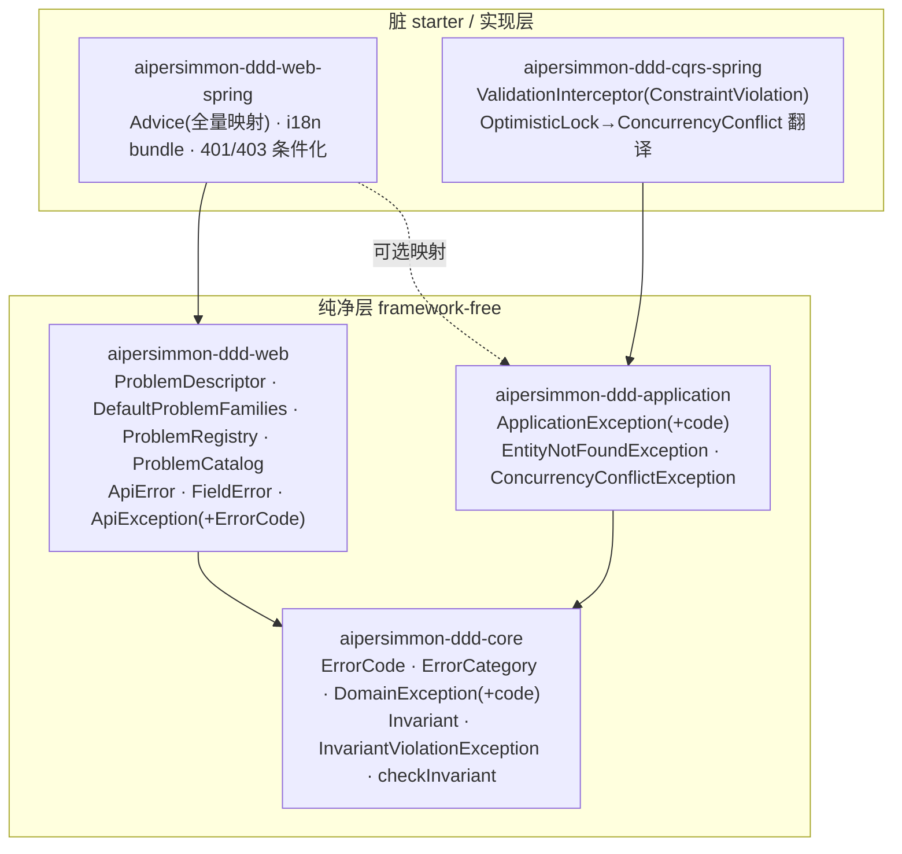
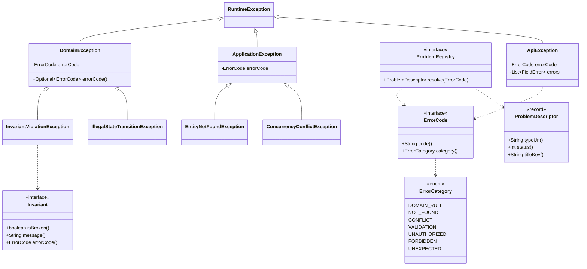
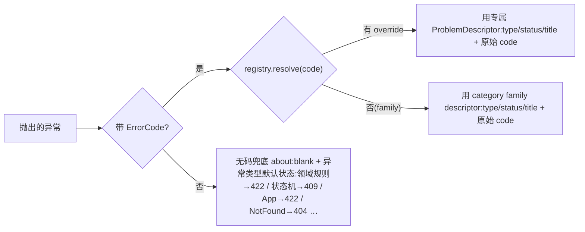

# aipersimmon-ddd 异常/错误体系:完整设计

把 [[decision-00010-exception-model]] 拍板的策略、以及 [[analysis-00010-exception-model]] 列出的缺口,
落成**可实现的、贯穿领域→应用→接口→基础设施四层的错误体系设计**。传输层线上契约(无信封 + RFC 9457)沿用 [[decision-00007-web-api-response-envelope]] /
[[design-00002-web-layer]],**本文不改线上格式**;本文补的是缺口的另一半——**错误在进程内如何被建模、
如何携带稳定机器码、如何从领域一路贯通到边界**。(异步**消息投递可靠性**——重试/退避/死信——不属本设计,独立追踪见 [[issue-00003-messaging-delivery-reliability]]。)

严守 [[analysis-00006-ddd-building-blocks-library]] 的两条铁律:**依赖一律指向内/下**、**纯净层
framework-free**。本设计是 [[design-00001-aipersimmon-ddd-and-scaffold]] §5 与 [[design-00002-web-layer]]
的增量,不替代它们。

> 前提:仓内代码是**开发中的脚手架,不是 truth**。下文"现状"仅作对比;"设计"即目标,该改的照改。

## 一、范围

| 分类 | 条目 |
| --- | --- |
| **纳入** | ①`-core` 贯穿式错误码抽象 `ErrorCode`;②`DomainException`/`ApplicationException` 携带错误码 + 语义子类;③`Invariant` 一等抽象 + `AbstractAggregateRoot.checkInvariant`;④错误码→`ProblemDescriptor`(category family + per-code override)→ProblemDetail 的贯通桥接(§4.7);⑤完整异常→HTTP 映射(含 `ConstraintViolationException`);⑥i18n bundle 交付 + filter 路径接入;⑦Guard-vs-Validate 分工成文;⑧401/403 条件化补齐 |
| **不属本设计** | 异步**消息投递可靠性**(重试上限/退避/死信 DLQ)——投递面而非错误建模面,见 [[issue-00003-messaging-delivery-reliability]] |
| **不做**(见 §十一) | 在 `-core` 引入 `Result`/`Either` 或 Vavr 依赖;通用异常基类大而全的字段(错误上下文 map 等);把 HTTP 状态码泄漏进 `-core` |
| **沿用不改** | RFC 9457 线上格式、扩展成员 `code`/`traceId`/`errors`、per-BC 错误码目录思路(传输映射形态改为 §4.7 的 family + override 组合)、filter 层 429/401 出口(均来自 [[design-00002-web-layer]]) |

## 二、贯穿性设计约束

1. **错误码是"从内到外"的一等契约**。业务逻辑**抛出的那一刻**就带上稳定机器码(`ordering.credit-exceeded`),
   原样透传到 ProblemDetail 的 `code` 扩展成员。这是解 [[analysis-00010-exception-model]] §五"断裂"的核心。
2. **HTTP 语义绝不进 `-core`/`-application`**。纯层只认 `ErrorCode`(一个字符串码 + 可选语义类别),
   **状态码由 `-web`/`-web-spring` 决定**。方向永远是 `-web → -core`,绝不反向。
3. **异常用于"异常/不变量违反";边缘输入用非异常校验**(Guard vs Validate,§八)。
4. **默认 throw-based**,不强推函数式(§十一);但错误必须**结构化**(带码),不能只是裸 message。
5. **每个新增 package 有 `package-info.java`**(承 design-00001 §二规约 5,受 `-archunit` 校验)。

## 三、模块依赖图(增量)



关键:`-web` 依赖 `-core`(而 `-core` 永不认识 `-web`),`ProblemRegistry` 在边界把领域抛出的 `ErrorCode`
**解析**成 `ProblemDescriptor`(传输定义:type/status/title)。身份(`ErrorCode`)与传输(`ProblemDescriptor`)是
**组合而非继承**——两者不再是同一个类型,断裂在边界接通。**为何不用 `ProblemType extends ErrorCode`**:那会把
HTTP 传输焊进错误身份(六个参考项目无一如此),且逼每个领域码 1:1 对应一个公开 type URI、内部重构泄漏成外部契约变更;
组合让"多码共享一个 family type"成为常态,契约不随领域码膨胀。详见 §4.7。

## 四、类型层级(核心)



注意:`ProblemDescriptor` **不再** `extends ErrorCode`——身份与传输是组合关系,由 `ProblemRegistry` 在边界连接。

### 4.1 `-core`(零依赖)

```java
// com.aipersimmon.ddd.core.error
public interface ErrorCode {
    String code();                                  // 稳定、BC 前缀、点分:"ordering.credit-exceeded"
    default ErrorCategory category() { return ErrorCategory.DOMAIN_RULE; }  // 决定该码的 family(status/type/title 默认)
}

public enum ErrorCategory { DOMAIN_RULE, NOT_FOUND, CONFLICT, VALIDATION, UNAUTHORIZED, FORBIDDEN, UNEXPECTED; }
```

```java
// com.aipersimmon.ddd.core.exception
public class DomainException extends RuntimeException {
    private final transient ErrorCode errorCode;    // 可空:老式 message-only 仍合法
    public DomainException(String message) { this(null, message, null); }
    public DomainException(ErrorCode code, String message) { this(code, message, null); }
    public DomainException(ErrorCode code, String message, Throwable cause) { super(message, cause); this.errorCode = code; }
    public Optional<ErrorCode> errorCode() { return Optional.ofNullable(errorCode); }
}
```

```java
// com.aipersimmon.ddd.core.rule
public interface Invariant {
    boolean isBroken();
    String message();
    default ErrorCode errorCode() { return null; }
}
public final class InvariantViolationException extends DomainException {
    public InvariantViolationException(Invariant rule) { super(rule.errorCode(), rule.message()); }
}
```

```java
// AbstractAggregateRoot 增补
protected final void checkInvariant(Invariant rule) {
    if (rule.isBroken()) throw new InvariantViolationException(rule);
}
```

- `errorCode` 用 `transient`,与 `AbstractAggregateRoot` 现有 `transient` 事件表约定一致,避免误序列化。
- **`-core` 仍零依赖**(仅 test junit)——这是 [[analysis-00006-ddd-building-blocks-library]] 的验收红线,本设计不破坏。
- `IllegalStateTransitionException` 保留,新增可选 `ErrorCode` 构造。

### 4.2 `-application`(→ `-core`)

```java
// com.aipersimmon.ddd.application.exception
public class ApplicationException extends RuntimeException {           // 携带可空 ErrorCode,同 DomainException 形态
    public Optional<ErrorCode> errorCode();
}
public class EntityNotFoundException extends ApplicationException {}    // 缺失聚合/资源;映射 404
public class ConcurrencyConflictException extends ApplicationException {} // 乐观锁冲突;映射 409
```

- **`EntityNotFoundException` 取代脚手架先前"抛 `NoSuchElementException` 换 404"的临时手法**:语义一等、可带码、
  应用层仍零 web 依赖。JDK `NoSuchElementException` 的 404 映射保留作兜底,但业务代码优先用它。
- `ConcurrencyConflictException`:由 `-cqrs-spring` 把 Spring `OptimisticLockingFailureException` 在应用边界翻译进来,
  让并发冲突有稳定语义(409),不再是裸框架异常。

### 4.3 `-web`(纯契约,→ `-core`)

```java
// com.aipersimmon.ddd.web.error
public record ProblemDescriptor(         // 纯传输定义,不 extends ErrorCode
    String typeUri,                      // 相对 URI:"/problems/domain-rule-violation"(标识符,不要求可解析)
    int status,                          // 默认 HTTP 状态
    String titleKey) {}                  // i18n key
public interface ProblemCatalog {        // 各 BC 只登记"够格专属 type"的少数码(其余走 family)
    Map<ErrorCode, ProblemDescriptor> overrides();
}
public interface ProblemRegistry {       // 对任意带码错误总能解析出 descriptor
    ProblemDescriptor resolve(ErrorCode code);   // override 优先,否则 category 的 family 默认
}
// DefaultProblemFamilies.DEFAULTS: Map<ErrorCategory, ProblemDescriptor> —— 库自带,每个 category 一个 family type
```

- **接通点是 `ProblemRegistry.resolve(ErrorCode)`**(组合,非继承):领域随手抛的 `ErrorCode`,先看有无 per-code
  override,否则用其 `category()` 的 family 默认。**带码错误因此永不落 `about:blank`**,客户端总能按有意义的 `type`
  判别 Problem Family,再按 `code` 扩展位细分具体业务原因。只有真正无码的异常(裸 `DomainException`、字段校验、404
  兜底、`UNEXPECTED`)才用 `about:blank`——那才是 RFC 9457 里 `about:blank` 的本义("除 status 外无额外语义")。
- **为何这样分**:`ErrorCode`(身份)与 `ProblemDescriptor`(传输)拆成两个类型、`ErrorCategory` 提供 family 默认、
  个别码 override 专属 type——对齐参考项目的边界映射(Ardalis.Result category→HTTP、hexagon `@ControllerAdvice`)与
  大厂 code-first(Google `reason`、Stripe `code`),同时保住 RFC 9457 的 `type` 语义。详见 §4.7。
- `ApiException` 改为携带 `ErrorCode`(与带码 `DomainException` 同路解析);`ApiError`/`FieldError` 形态不变(见 [[design-00002-web-layer]] §5)。

### 4.4 基数与 fail-fast

- **一个聚合 N 条规则、一个 BC 的 `ErrorCode` 枚举 N 个值**。`Invariant` 是"一条不变量 = 一个对象",聚合在方法里 `checkInvariant(...)` 多次;`ErrorCode` 实现为 per-BC 枚举,天然多值(`CREDIT_EXCEEDED`/`ORDER_EMPTY`/`ORDER_ALREADY_CONFIRMED`/…)。**不存在"一个聚合一条规则、一个码"**。
- **fail-fast**:`checkInvariant` 命中第一条被违反的规则即抛,不累积——领域不变量间常有前后依赖,且与"边缘输入校验**累积**报 `errors[]`"(§八)刻意分工。
- 若某场景确需一次报多条领域规则(如批量导入),可加 `checkInvariants(Invariant...)` 变体,让 `InvariantViolationException` 携带多条明细。**本期不做**,留作 opt-in 增量。

### 4.5 校验落在哪一层:VO 自校验 vs 聚合 `Invariant` vs 应用层跨聚合

`checkInvariant` 不是"所有校验的统一入口"。**判断标准是这条约束需要多大范围的状态才能判定**——范围决定归属:

| 约束范围 | 落点 | 机制 | 违反 | 脚手架实例(ordering) |
| --- | --- | --- | --- | --- |
| 单个值/单个实体自身 | 值对象 / 实体**构造器**(Always-Valid) | 构造即校验,直接 `throw` | `DomainException` → 422 | `OrderLine`:`sku required` / `quantity > 0`;`Money`:`amount >= 0` |
| **一个聚合内、跨其成员** | 聚合根 | **默认** coded `throw`;**够格时**才 `checkInvariant(Invariant)` | `DomainException` / `InvariantViolationException` → 422 | `Order`:空/超上限用 coded `throw`(`ORDER_EMPTY`/`TOO_MANY_LINES`);无重复 SKU 用 `Invariant`(`OrderHasDistinctSkus`) |
| **跨多个聚合 / 需外部状态** | **应用层**用例(handler) | 取齐依赖后显式 `throw`(或抛领域异常) | `DomainException`/`ApplicationException` → 按码 | `PlaceOrderHandler`:信用超限(需 `Customer` + `Order`)→ `CreditExceededException` |

原则:**不变量能自足判定就往里放**(VO < 聚合 < 应用层),越靠内越好。反面——把跨聚合校验硬塞进 `Order.checkInvariant` 会迫使 `Order` 依赖 `Customer`,破坏聚合边界;把单值校验拔高到聚合层则丢了"值对象永远合法"的保证。

**`Invariant` 不是默认,是升级项。** 聚合内不变量**默认用 coded `throw`**;只有当它满足下列**至少一条**时,才值得升级成 `Invariant`:

- **非平凡**:多条件 / 有值得命名的领域概念(如"无重复 SKU"),而非 `isEmpty()`/`size()>N` 这种一行守卫;
- **可复用**:同一规则被多个方法或多个聚合共用;
- **需清点或组合**:要把一组规则当数据遍历、按开关启停、或一次累积多个违反(见 §4.4 的 `checkInvariants` 增量)。

都不满足就用 coded `throw` —— 一行条件套个类只是仪式,反而稀释了"规则"这个词的信号。`Invariant` 与 coded `throw` 走同一条错误码/映射通道(前者的 `InvariantViolationException` 就是 `DomainException` 子类),所以升级/降级**不影响线上契约**,可随领域演进自由调整。

**可沉淀为 ArchUnit 的部分**(已并入 `AiPersimmonDddRules.all()`,配 good/bad fixture 双向自测):①`Invariant` 实现须在 `..domain..`;②`InvariantViolationException` 只能经 `checkInvariant` 抛出(禁止直接 `new`);③`Invariant` 不得是 Spring bean。**不可沉淀、留给 review 的**:"这条约束是否真的跨聚合""这个 `if/throw` 该不该升级成规则"——纯语义判断;唯一的结构代理(规则引用了外部 `@AggregateRoot`)是启发式、有假阳性,**刻意不并入 `all()`**。

### 4.6 `Invariant` vs `Policy`/`Specification`:同一思想的两个流派

§4.5 回答的是"校验落在**哪一层**";本节回答的是"聚合内那条规则该用**哪种形态**"。`Invariant` 常被和参考项目里的 `Policy`/`Specification` 混为一谈——二者其实是"**规则 = 一等命名对象**(而非散落的 `if…throw`)"这一战术思想的两个流派。先厘清 "Policy" 的三种含义,能对上 `Invariant` 的只有第一种:

| "Policy" 的含义 | 与 `Invariant` 的关系 |
| --- | --- |
| ①**决策型 Policy / Specification**（ddd-by-examples 的 `PlacingOnHoldPolicy`） | **同一层的兄弟**——本节重点比这个 |
| ②**注入型 Policy**（ddd-by-examples-factory 的 `ReviewPolicy` 注入进聚合方法） | `Invariant` 的扩展方向：规则需可变策略/配置时的形态 |
| ③**反应型 Policy / Saga**（"每当发生事件 X 就触发命令 Y"） | **无关**——属应用 / 流程层编排,不是聚合内不变量 |

`Invariant`(断言流派)与决策型 `Policy`(函数式流派)的核心差异:

| 维度 | `Invariant`（本仓默认） | 决策型 `Policy`（函数式） |
| --- | --- | --- |
| **本质** | **断言 / 卫兵**:"这条不变量被违反了吗?" | **决策**:"这个动作允许吗?允许则产出什么?" |
| **提问方向** | 负向——`isBroken()`,默认合法、标出违反 | 正向——判定 allow / reject 并**产出结果** |
| **结果模型** | `boolean` → 聚合 **throw** 异常(二元通过/违反) | 返回 `Either<Rejection, Allowance>`(**值**,可携带理由/数据) |
| **控制流** | 异常驱动,契合 `@Transactional` rollback-on-exception | 值驱动,需处处显式传播 / 组合 |
| **外部状态** | §4.5 限定:聚合内、跨成员、**无外部状态**、自足判定 | 常可**注入**可变策略 / 配置(见含义②) |
| **组合** | 逐条 `checkInvariant(...)`,**fail-fast** 短路(§4.4) | 列表清点、可一次累积多条 rejection |
| **谱系** | 参考 `modular-monolith-with-ddd`(Grzybek;上溯微软 eShopOnContainers) | 参考 `ddd-by-examples-library`(Vavr `Either`) |

**本仓取舍**:默认口径是 `Invariant`;决策型 `Policy`(`Either`)是 **§十 允许的局部逃生舱**——团队可在纯领域策略/规格边界自行引 Vavr,但**不得进 `-core` 公共 API**。二者不是并存的两套机制,而是"默认 + opt-in 逃生舱"。理由(零依赖红线、事务语义契合)见 §十。

**选型指引**:

- 约束是**硬不变量**(必须永真,违反 = 异常)且**聚合内可自足判定** → `Invariant`;
- 需要**返回丰富结果**(不只 pass/fail,还要带 allowance 数据或一次收集多条拒绝原因),或规则**随可注入策略/配置变化** → 决策型 / 注入型 `Policy`(边界局部用 `Either`,或把策略对象注入聚合方法);
- "**事件 → 命令**"的跨聚合编排 → Saga / Process(含义③),两者都不是,不塞进聚合(见 [[analysis-00005-structure-2-event-flow-and-cqrs]])。

### 4.7 错误身份 vs 传输映射:为何组合(`ErrorCode → ProblemDescriptor`)而非继承

早先设计让 `-web` 的 `ProblemType extends ErrorCode`——一个类型身兼两职(领域失败身份 + HTTP 传输)。**已废弃**,改成组合。三条理由:

- **参考项目无一如此**。六个 reference(Axon / clean-architecture / domain-driven-hexagon / ddd-by-examples / modular-monolith / jMolecules)里没有"ProblemType extends ErrorCode"这种把传输焊进身份的建模;它们都在**边界**翻译(Ardalis.Result 的 `ResultStatus` 类别 → HTTP、hexagon 的 `@ControllerAdvice`),Axon 干脆不碰 HTTP、只在消息边界转结构化失败。组合把翻译放回边界(`ProblemRegistry`),与它们一致。
- **大厂 code-first**。Google(`ErrorInfo.reason`)、Stripe(`code`)、Microsoft(`innererror.code`)都用稳定字符串 `code` 作机器判别,而非"每个业务错误一个可解析 URI"。本仓一直出 `code`,组合让 `code` 担细粒度判别、`type` 担粗粒度 Problem Family,两者解耦。
- **契约不随领域码膨胀**。继承逼每个 `ErrorCode` 1:1 对应一个公开 type URI;内部细化错误码(诊断/日志)会直接扩张对外 Problem Type 契约,registry 也变成全量维护热点、漏登记还静默降级。组合下,**多个码共享一个 family type**是常态,只有具备独立客户端处理 / 独立扩展 schema / 独立文档的码才 override 专属 type。

**四层契约**:`status`(HTTP 大类)· `type`(Problem Family,客户端识别处理契约)· `code`(精确业务身份)· `detail`/扩展(本次上下文)。**两条硬约束**:①外部 `code` 用**显式字符串**固定(非 Java 枚举名派生),它是对外契约、不是实现细节;②**带码业务错误禁止落 `about:blank`**——至少走 category family;`about:blank` 只留给"status 已足够描述"的无码/内部错误。因 `registry.resolve` 对任意码总返回非空 descriptor,这条**由构造保证**,并由契约测试兜底(`WebLayerTest` 断言无 override 的带码错误 `type == "/problems/domain-rule-violation"`、无码错误才 `about:blank`)。

**放置红线**:category → (status, family type, title) 的映射表(`DefaultProblemFamilies`)住在 `-web`(纯 `int` status、相对 URI),**绝不进 `-core`**——`ErrorCategory` 留在 `-core` 只做纯语义标签,否则 HTTP/URI 又渗回零依赖核心。

## 五、错误码→ProblemDetail 的贯通(解 §五断裂)

`-web-spring` 的 `@RestControllerAdvice` 处理任一领域/应用异常时,按下述**解析顺序**产出 `code`/`type`/`status`/`title`:



带码路径**总能解析出 descriptor**(override 优先,否则 family),故带码错误的 `type` 永远有意义、绝不 `about:blank`。
于是 [[design-00002-web-layer]] §八 的旗舰示例**可复现**:领域抛
`new CreditExceededException(OrderingErrorCode.CREDIT_EXCEEDED, "...")`(纯 `ErrorCode`,`DOMAIN_RULE`)→ advice
`registry.resolve` 命中 `OrderingProblemCatalog` 的 override → 输出带 `code:"ordering.credit-exceeded"`、
`type:"/problems/insufficient-credit"` 的 422;未 override 的码(如 `ordering.duplicate-sku`)则输出 family
`type:"/problems/domain-rule-violation"` + 各自的 `code`。

## 六、完整异常 → HTTP 映射(修订版)

| 异常 | HTTP | 说明 | 相对现状 |
| --- | --- | --- | --- |
| `ApiException`(带 `ErrorCode`) | `registry.resolve(code).status()` | 首选路径:override 或 family | 改携 `ErrorCode` |
| `InvariantViolationException` / `DomainException`(带码) | `registry.resolve` 的 descriptor status(override 或 family,后者按 category:`DOMAIN_RULE`→422) | `code` + 有意义的 `type`(绝非 about:blank)贯通 | **新增贯通** |
| `DomainException`(无码) | **422** + `about:blank` | 无业务码:status 已足够描述 | **改默认 409→422** |
| `IllegalStateTransitionException` | **409** | 状态机非法迁移 = 与当前状态冲突 | **改默认 409(明确)** |
| `ApplicationException`(无码) | 422 | 用例级失败 | 不变 |
| `EntityNotFoundException` | **404** | 缺失聚合/资源 | **新增语义类型** |
| `ConcurrencyConflictException` | **409** | 乐观锁 / 并发冲突 | **新增语义类型** |
| `MethodArgumentNotValidException` / `BindException` | 400 | 填 `errors[]` | 不变 |
| **`jakarta.validation.ConstraintViolationException`** | **400** | 命令总线 JSR-380;与上一行**共享** `FieldError` 映射 | **修复缺口 #3/#8** |
| `NoSuchElementException` | 404 | JDK 兜底(业务优先用 `EntityNotFoundException`) | 不变 |
| 认证 `AuthenticationException` | 401 | 仅当 classpath 有 spring-security(§十) | **新增,条件化** |
| 授权 `AccessDeniedException` | 403 | 同上 | **新增,条件化** |
| 限流 `RateLimitExceededException` | 429 | filter 层,带 `Retry-After`/`RateLimit-*` | 不变 |
| 兜底 `Exception` | 500 | 不回显 message | 不变 |

**`ConstraintViolationException` 处理器**把每个 `ConstraintViolation` 映射为 `FieldError(propertyPath, code, message)`,
与 `MethodArgumentNotValidException` 走同一个 `FieldError` 构造路径 —— 统一两处 Bean Validation 的线上结构(#8)。

### 6.1 为什么领域规则默认 422、409 收窄给冲突

映射的**权威由 `registry.resolve(code)` 的 descriptor status 决定**(per-code override,否则 category family;family 的 status 见下);无码时才回落异常类型的基类兜底。取舍依据 RFC 9110 语义:

- **422 Unprocessable Content**(§15.5.21):服务器**理解**报文的类型与语法、但**因语义无法处理**——这精确对应"业务不变量违反"(信用超限、金额不合规、超配额)。故 `DomainException`/`InvariantViolationException` 默认 422。对齐 GitHub、Rails/Laravel、Spring 社区的既有习惯。
- **409 Conflict**(§15.5.10):请求**与目标资源的当前状态冲突**——**收窄**给:乐观锁/并发(gRPC `ABORTED`)、重复创建(`ALREADY_EXISTS`)、状态机非法迁移(`IllegalStateTransitionException`)。**不**用作一般业务规则的默认。
- **400 Bad Request**:仅报文畸形/类型错 + 字段级校验(`errors[]`)。Google AIP/gRPC 把 `FAILED_PRECONDITION` 也归 400——本模板既已选 RFC 9457 + `errors[]`,取 **422 派**更精确。
- 心智模型(gRPC 最干净):`INVALID_ARGUMENT`→400、`FAILED_PRECONDITION`→422(本模板)、`ABORTED`/`ALREADY_EXISTS`→409、`NOT_FOUND`→404。
- 决策见 [[decision-00010-exception-model]] §四。

## 七、i18n(交付 bundle,解 #4)

- `-web-spring` 交付**默认英文 bundle** `messages/aipersimmon-web-errors.properties`(键 = family/override 的 `ProblemDescriptor.titleKey()`,如 `problem.domain-rule-violation.title` +
  校验 code),`i18n.basename` 可覆盖/追加;消费者按 BC 加自己的 bundle。
- `ProblemHttpResponseWriter`(filter 路径)**也接入 `MessageSource`**,不再只用 status reason phrase —— 与 advice 路径一致。
- `Accept-Language` 决定 locale,缺省英文(承 [[design-00002-web-layer]] §5.4)。

## 八、Guard vs Validate 分工(成文)

采纳 domain-driven-hexagon 的"Bad input isn't a bug; a broken invariant is",落成四层职责:

| 层 | 拦什么 | 机制 | 是否异常 | HTTP |
| --- | --- | --- | --- | --- |
| 入站 adapter / DTO | 不可信外部输入(格式/必填/范围) | Bean Validation `@Valid` | 非异常校验 | 400 |
| 应用 / 命令总线 | 命令前置条件 | `ValidationCommandInterceptor`(JSR-380) | 抛 `ConstraintViolationException` | 400 |
| 应用用例 | 缺失聚合 / 用例冲突 | `EntityNotFoundException` / `ConcurrencyConflictException` / `ApplicationException` | 抛 | 404 / 409 / 422 |
| 领域聚合 / VO | 业务不变量 | `checkInvariant(Invariant)` / VO 构造自校验 → `DomainException` | 抛 | 422(状态机冲突则 409;或按码) |
| 基础设施 | 技术故障 | 未捕获 | 抛 | 500 |

原则:**边缘输入错误是"预期的",走非异常校验;不变量违反是"异常的",走 throw**。二者错误结构统一为 RFC 9457 + `errors[]`。

> 本表按"层"分职责;最后一行"领域聚合 / VO"内部还需再分——VO 自校验 vs 聚合 `Invariant` vs 应用层跨聚合校验的落点判断,见 §4.5。

## 九、401 / 403 条件化补齐(解 #9)

- `-web-spring` 增一个 `@ConditionalOnClass(name = "org.springframework.security...")` 的配置:提供
  `AuthenticationEntryPoint` / `AccessDeniedHandler`,把 401/403 也写成 `application/problem+json`
  (`/problems/unauthorized`、`/problems/forbidden`)。
- 不引入 spring-security 硬依赖(承 [[decision-00007-web-api-response-envelope]] §六:"仅当 classpath 有 spring-security 时激活")。

## 十、明确取舍:为什么默认不上 `Result`/`Either`

参考项目里 ddd-by-examples-library(Vavr `Either`)、clean-architecture(`Ardalis.Result`)、
domain-driven-hexagon 都倾向函数式错误值;本仓 [[analysis-00005-structure-2-event-flow-and-cqrs]] 也提过 Result。
本设计的取舍(类比 [[decision-00007-web-api-response-envelope]] 的"明确不做"):

**先厘清一个常见的混淆**:"不上 Result" ≠ "因为 `-core` 要零依赖"。`Result` 并不等于 Vavr——完全可以零依赖地写成一个
`sealed interface Result<T> permits Success, Failure`。所以零依赖红线只否决 **Vavr 这个依赖**,并不能单独否决 **Result 这个模式**。
把两者混为一谈是不诚实的论证。默认 throw 的真正理由是下面三条,零依赖只是其中一条的附带结果:

- **① 人机工程 / 易漏用**(主因):`throw` 无法被调用方"忘记"——不处理就沿栈上抛、被顶层 advice 兜住;而 `Result` 是一个
  **返回值**,调用方可以静默丢弃(尤其无 `@CheckReturnValue`/linter 时),一处漏检就把一次业务失败吞成"成功"。异常在"必须被处理"这点上默认更安全。
- **② 生态一致**:近邻 jMolecules / spring-modulith-with-ddd 都不函数式;默认 throw 与它们、以及与 `@Transactional`
  的既有心智模型一致,团队只需一套错误处理范式。
- **③ 事务语义(有限成立)**:`throw` 与 `@Transactional` rollback-on-exception 天然契合。**但要诚实**:预期内的业务拒绝
  通常发生在**任何状态变更/发事件之前**(如信用超限先于 `save`),此时没有需要回滚的写入,Result 也不会"漏回滚"。真正必须靠异常回滚的是
  **执行到一半的技术故障/未知错误**。所以这条支持的是"默认 throw 更省心",而非"Result 不安全"。
- 附带结果:既然默认不用 Result,也就**不在 `-core` 引入 Vavr**,零依赖红线顺带保住——这是**结论的副产品,不是前提**。

- **允许局部采用**:团队可在**纯领域策略/规格**边界自行引 Vavr 返回 `Either<Rejection, T>`(如 ddd-by-examples 的
  `Policy`),或零依赖地自定义 `Result`,只要**不进 `-core` 公共 API**。库不阻止,也不内建。`Policy`(函数式)与 `Invariant`(断言)的形态差异与选型见 **§4.6**。
- **分布式消息边界的例外**(参考不依赖):若未来接入 Axon 一类分布式 command/query 总线,异常跨进程会被泛化成
  `CommandExecutionException`、丢失类型信息;此时应在**边界**把领域异常转成**结构化失败结果**(稳定 code + 参数),聚合内部仍可 coded throw。
  本仓当前不依赖 Axon(见 [[analysis-00007-saga-process-manager]] "参考不依赖"),故仅作为接入时的边界指引,不改默认口径。
- 这不是"反最佳实践",是**成本/一致性权衡**;若未来重估(例如团队愿意用零依赖 `Result` + linter 强制处理),应走独立 decision。

## 十一、脚手架落地改动(code 不是 truth,照改)

| 模块 | 改动 |
| --- | --- |
| `-core` | 新增 `error/ErrorCode`、`error/ErrorCategory`、`rule/Invariant`、`rule/InvariantViolationException`;`DomainException` 加带码构造;`AbstractAggregateRoot.checkInvariant` |
| `-application` | `ApplicationException` 加带码构造;新增 `EntityNotFoundException`、`ConcurrencyConflictException` |
| `-web` | `ProblemDescriptor`(record,不 extends ErrorCode)+ `DefaultProblemFamilies`(category→family)+ `ProblemCatalog`(override)+ `ProblemRegistry.resolve(ErrorCode)`;`ApiException` 改携 `ErrorCode`(§4.7) |
| `-web-spring` | advice 全量映射(含 `ConstraintViolationException`、registry 贯通、`EntityNotFoundException`/`ConcurrencyConflictException`);交付 i18n bundle;filter 路径接入 `MessageSource`;401/403 条件化配置 |
| `-cqrs-spring` | 把 `OptimisticLockingFailureException` 翻译为 `ConcurrencyConflictException` |
| **scaffold(ordering)** | `OrderingProblemCatalog`(implements `ProblemCatalog`)**只 override** `CREDIT_EXCEEDED`→`/problems/insufficient-credit`,其余码走 category family;`CreditExceededException` 携 `CREDIT_EXCEEDED`;聚合内**够格**不变量(无重复 SKU)用 `checkInvariant(OrderHasDistinctSkus)`,**琐碎守卫**(空/超上限)用 coded `throw`(§4.5);"unknown order/customer" 改抛 `EntityNotFoundException`(取代 `NoSuchElementException` 临时手法) |

**验收锚点**:改完后,对一个信用超限的下单请求,脚手架应原样产出 [[design-00002-web-layer]] §八 的 **422** ProblemDetail
(带 `code:"ordering.credit-exceeded"` + `type`)。当前产不出来即为未完成。

## 十二、后果

- **正向**:错误码从领域一路贯通到边界,`code`/`type` 对领域异常首次可达;规则成一等对象,可测可组合;
  校验/并发/未找到有稳定语义与状态码;i18n 真正可用。纯/脏与依赖向内不变,无新范式。
- **负向 / 治理**:`ErrorCode` 的 `code` 与 `ProblemDescriptor` 的 `typeUri` **一旦发布即成对外契约**,变更须走版本
  (承 [[decision-00007-web-api-response-envelope]] §Consequences);错误码枚举跨 BC 增长需命名前缀治理;
  `-application` 新增两个语义子类,消费者需知晓其映射。
- **迁移**:所有新增构造都是**加法**(旧 message-only 构造保留),存量代码不强制一次性改;但脚手架作为示范应改齐。

## 关联

- [[decision-00010-exception-model]] —— 本设计落地的决策来源(策略、取舍、被拒选项)。
- [[analysis-00010-exception-model]] —— 本设计的缺口来源与验收清单。
- [[analysis-00008-web-api-response-envelope]] —— 线上错误契约的大厂/标准对照(本文沿用其结论,不改格式)。
- [[analysis-00006-ddd-building-blocks-library]] —— 纯/脏分离与依赖向内铁律,约束 `ErrorCode` 只能落 `-core`。
- [[analysis-00005-structure-2-event-flow-and-cqrs]] —— Result/受控异常意图出处(本文对 Result 给出取舍)。
- [[decision-00007-web-api-response-envelope]] —— `code`/`type`/i18n/401-403 推迟等决策来源。
- [[design-00001-aipersimmon-ddd-and-scaffold]] / [[design-00002-web-layer]] —— 被本文增量扩展的既有设计。
