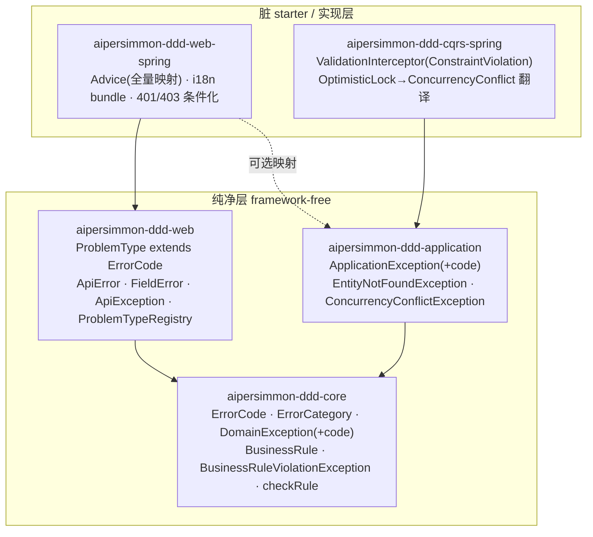
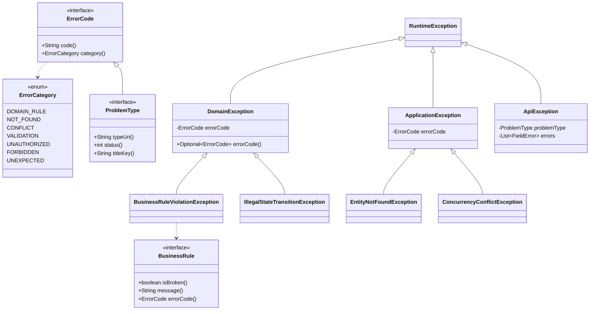
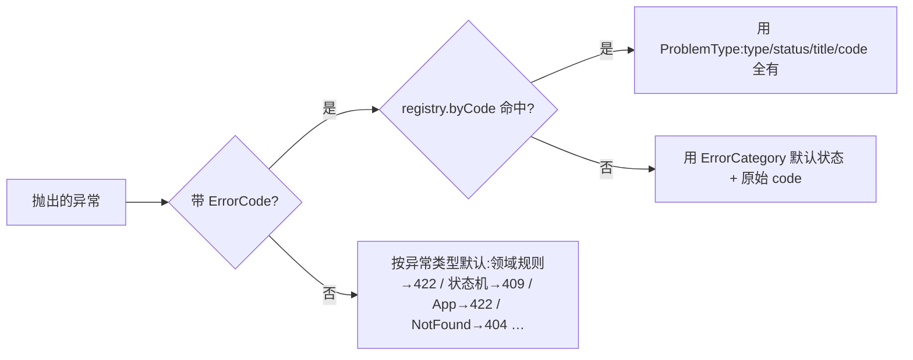

# aipersimmon-ddd 异常/错误体系:完整设计

把 [[decision-00010-exception-model]] 拍板的策略、以及 [[analysis-00010-exception-model]] 列出的缺口,
落成**可实现的、贯穿领域→应用→接口→基础设施四层的错误体系设计**。传输层线上契约(无信封 + RFC 9457)沿用 [[decision-00007-web-api-response-envelope]] /
[[design-00002-web-layer]],**本文不改线上格式**;本文补的是缺口的另一半——**错误在进程内如何被建模、
如何携带稳定机器码、如何从领域一路贯通到边界**。(异步**消息投递可靠性**——重试/退避/死信——不属本设计,独立追踪见 [[issue-00003-messaging-delivery-reliability]]。)

严守 [[analysis-00006-ddd-building-blocks-library]] 的两条铁律:**依赖一律指向内/下**、**纯净层
framework-free**。本设计是 [[design-00001-aipersimmon-ddd-and-scaffold]] §5 与 [[design-00002-web-layer]]
的增量,不替代它们。

> 前提:仓内代码是**开发中的脚手架,不是 truth**。下文"现状"仅作对比;"设计"即目标,该改的照改。

## 一、范围

| 分类 | 条目 |
| --- | --- |
| **纳入** | ①`-core` 贯穿式错误码抽象 `ErrorCode`;②`DomainException`/`ApplicationException` 携带错误码 + 语义子类;③`BusinessRule` 一等抽象 + `AbstractAggregateRoot.checkRule`;④错误码→`ProblemType`→ProblemDetail 的贯通桥接;⑤完整异常→HTTP 映射(含 `ConstraintViolationException`);⑥i18n bundle 交付 + filter 路径接入;⑦Guard-vs-Validate 分工成文;⑧401/403 条件化补齐 |
| **不属本设计** | 异步**消息投递可靠性**(重试上限/退避/死信 DLQ)——投递面而非错误建模面,见 [[issue-00003-messaging-delivery-reliability]] |
| **不做**(见 §十一) | 在 `-core` 引入 `Result`/`Either` 或 Vavr 依赖;通用异常基类大而全的字段(错误上下文 map 等);把 HTTP 状态码泄漏进 `-core` |
| **沿用不改** | RFC 9457 线上格式、扩展成员 `code`/`traceId`/`errors`、per-BC `ProblemType` 枚举思路、filter 层 429/401 出口(均来自 [[design-00002-web-layer]]) |

## 二、贯穿性设计约束

1. **错误码是"从内到外"的一等契约**。业务逻辑**抛出的那一刻**就带上稳定机器码(`ordering.credit-exceeded`),
   原样透传到 ProblemDetail 的 `code` 扩展成员。这是解 [[analysis-00010-exception-model]] §五"断裂"的核心。
2. **HTTP 语义绝不进 `-core`/`-application`**。纯层只认 `ErrorCode`(一个字符串码 + 可选语义类别),
   **状态码由 `-web`/`-web-spring` 决定**。方向永远是 `-web → -core`,绝不反向。
3. **异常用于"异常/不变量违反";边缘输入用非异常校验**(Guard vs Validate,§八)。
4. **默认 throw-based**,不强推函数式(§十一);但错误必须**结构化**(带码),不能只是裸 message。
5. **每个新增 package 有 `package-info.java`**(承 design-00001 §二规约 5,受 `-archunit` 校验)。

## 三、模块依赖图(增量)



关键:`ProblemType extends ErrorCode`,`-web` 依赖 `-core` —— 于是**领域抛出的 `ErrorCode` 能被 `-web` 认识**,
而 `-core` 永远不认识 `-web`。断裂由此接通。

## 四、类型层级(核心)



### 4.1 `-core`(零依赖)

```java
// com.aipersimmon.ddd.core.error
public interface ErrorCode {
    String code();                                  // 稳定、BC 前缀、点分:"ordering.credit-exceeded"
    default ErrorCategory category() { return ErrorCategory.DOMAIN_RULE; }  // 无 ProblemType 时的默认状态映射依据
}

public enum ErrorCategory { DOMAIN_RULE, NOT_FOUND, CONFLICT, VALIDATION, UNAUTHORIZED, FORBIDDEN, UNEXPECTED; }
```

```java
// com.aipersimmon.ddd.core.exception
public class DomainException extends RuntimeException {
    private final transient ErrorCode errorCode;    // 可空:老式 message-only 仍合法
    public DomainException(String message) { this(null, message, null); }
    public DomainException(ErrorCode code, String message) { this(code, message, null); }
    public DomainException(ErrorCode code, String message, Throwable cause) { super(message, cause); this.errorCode = code; }
    public Optional<ErrorCode> errorCode() { return Optional.ofNullable(errorCode); }
}
```

```java
// com.aipersimmon.ddd.core.rule
public interface BusinessRule {
    boolean isBroken();
    String message();
    default ErrorCode errorCode() { return null; }
}
public final class BusinessRuleViolationException extends DomainException {
    public BusinessRuleViolationException(BusinessRule rule) { super(rule.errorCode(), rule.message()); }
}
```

```java
// AbstractAggregateRoot 增补
protected final void checkRule(BusinessRule rule) {
    if (rule.isBroken()) throw new BusinessRuleViolationException(rule);
}
```

- `errorCode` 用 `transient`,与 `AbstractAggregateRoot` 现有 `transient` 事件表约定一致,避免误序列化。
- **`-core` 仍零依赖**(仅 test junit)——这是 [[analysis-00006-ddd-building-blocks-library]] 的验收红线,本设计不破坏。
- `IllegalStateTransitionException` 保留,新增可选 `ErrorCode` 构造。

### 4.2 `-application`(→ `-core`)

```java
// com.aipersimmon.ddd.application.exception
public class ApplicationException extends RuntimeException {           // 携带可空 ErrorCode,同 DomainException 形态
    public Optional<ErrorCode> errorCode();
}
public class EntityNotFoundException extends ApplicationException {}    // 缺失聚合/资源;映射 404
public class ConcurrencyConflictException extends ApplicationException {} // 乐观锁冲突;映射 409
```

- **`EntityNotFoundException` 取代脚手架先前"抛 `NoSuchElementException` 换 404"的临时手法**:语义一等、可带码、
  应用层仍零 web 依赖。JDK `NoSuchElementException` 的 404 映射保留作兜底,但业务代码优先用它。
- `ConcurrencyConflictException`:由 `-cqrs-spring` 把 Spring `OptimisticLockingFailureException` 在应用边界翻译进来,
  让并发冲突有稳定语义(409),不再是裸框架异常。

### 4.3 `-web`(纯契约,→ `-core`)

```java
// com.aipersimmon.ddd.web.error
public interface ProblemType extends ErrorCode {   // ProblemType 本身就是一个 ErrorCode
    String typeUri();          // 相对 URI:"/problems/credit-exceeded"(标识符,不要求可解析)
    int status();              // 默认 HTTP 状态
    String titleKey();         // i18n key
    // 继承 code() / category()
}
public interface ProblemTypeRegistry {             // code -> ProblemType 查找;消费者注册各 BC 的枚举
    Optional<ProblemType> byCode(String code);
}
```

- `ProblemType extends ErrorCode` 是**接通点**:领域随手抛的 `ErrorCode`,只要其 `code()` 在 registry 里能查到对应
  `ProblemType`,advice 就能补齐 `type`/`status`/`title`;查不到也能靠 `category()` 给出合理默认。
- `ApiException`/`ApiError`/`FieldError` 形态不变(见 [[design-00002-web-layer]] §5)。

### 4.4 基数与 fail-fast

- **一个聚合 N 条规则、一个 BC 的 `ErrorCode` 枚举 N 个值**。`BusinessRule` 是"一条不变量 = 一个对象",聚合在方法里 `checkRule(...)` 多次;`ErrorCode` 实现为 per-BC 枚举,天然多值(`CREDIT_EXCEEDED`/`ORDER_EMPTY`/`ORDER_ALREADY_CONFIRMED`/…)。**不存在"一个聚合一条规则、一个码"**。
- **fail-fast**:`checkRule` 命中第一条被违反的规则即抛,不累积——领域不变量间常有前后依赖,且与"边缘输入校验**累积**报 `errors[]`"(§八)刻意分工。
- 若某场景确需一次报多条领域规则(如批量导入),可加 `checkRules(BusinessRule...)` 变体,让 `BusinessRuleViolationException` 携带多条明细。**本期不做**,留作 opt-in 增量。

### 4.5 校验落在哪一层:VO 自校验 vs 聚合 `BusinessRule` vs 应用层跨聚合

`checkRule` 不是"所有校验的统一入口"。**判断标准是这条约束需要多大范围的状态才能判定**——范围决定归属:

| 约束范围 | 落点 | 机制 | 违反 | 脚手架实例(ordering) |
| --- | --- | --- | --- | --- |
| 单个值/单个实体自身 | 值对象 / 实体**构造器**(Always-Valid) | 构造即校验,直接 `throw` | `DomainException` → 422 | `OrderLine`:`sku required` / `quantity > 0`;`Money`:`amount >= 0` |
| **一个聚合内、跨其成员** | 聚合根 | **默认** coded `throw`;**够格时**才 `checkRule(BusinessRule)` | `DomainException` / `BusinessRuleViolationException` → 422 | `Order`:空/超上限用 coded `throw`(`ORDER_EMPTY`/`TOO_MANY_LINES`);无重复 SKU 用 `BusinessRule`(`OrderHasDistinctSkus`) |
| **跨多个聚合 / 需外部状态** | **应用层**用例(handler) | 取齐依赖后显式 `throw`(或抛领域异常) | `DomainException`/`ApplicationException` → 按码 | `PlaceOrderHandler`:信用超限(需 `Customer` + `Order`)→ `CreditExceededException` |

原则:**不变量能自足判定就往里放**(VO < 聚合 < 应用层),越靠内越好。反面——把跨聚合校验硬塞进 `Order.checkRule` 会迫使 `Order` 依赖 `Customer`,破坏聚合边界;把单值校验拔高到聚合层则丢了"值对象永远合法"的保证。

**`BusinessRule` 不是默认,是升级项。** 聚合内不变量**默认用 coded `throw`**;只有当它满足下列**至少一条**时,才值得升级成 `BusinessRule`:

- **非平凡**:多条件 / 有值得命名的领域概念(如"无重复 SKU"),而非 `isEmpty()`/`size()>N` 这种一行守卫;
- **可复用**:同一规则被多个方法或多个聚合共用;
- **需清点或组合**:要把一组规则当数据遍历、按开关启停、或一次累积多个违反(见 §4.4 的 `checkRules` 增量)。

都不满足就用 coded `throw` —— 一行条件套个类只是仪式,反而稀释了"规则"这个词的信号。`BusinessRule` 与 coded `throw` 走同一条错误码/映射通道(前者的 `BusinessRuleViolationException` 就是 `DomainException` 子类),所以升级/降级**不影响线上契约**,可随领域演进自由调整。

## 五、错误码→ProblemDetail 的贯通(解 §五断裂)

`-web-spring` 的 `@RestControllerAdvice` 处理任一领域/应用异常时,按下述**解析顺序**产出 `code`/`type`/`status`/`title`:



于是 [[design-00002-web-layer]] §八 的旗舰示例**可复现**:领域抛
`new CreditExceededException(OrderingProblemType.CREDIT_EXCEEDED, "...")`(该枚举实现 `ProblemType`,
既是领域可见的 `ErrorCode`,又携带 `/problems/credit-exceeded` + 422 + titleKey)→ advice 命中 registry →
输出带 `code:"ordering.credit-exceeded"`、`type:"/problems/credit-exceeded"` 的 422。

## 六、完整异常 → HTTP 映射(修订版)

| 异常 | HTTP | 说明 | 相对现状 |
| --- | --- | --- | --- |
| `ApiException`(带 `ProblemType`) | `ProblemType.status()` | 首选路径 | 不变 |
| `BusinessRuleViolationException` / `DomainException`(带码) | 命中 registry 则用其 status,否则 **422** | `code`/`type` 从 `ErrorCode` 贯通 | **新增贯通** |
| `DomainException`(无码) | **422** | 业务规则:报文合法但语义不可处理 | **改默认 409→422** |
| `IllegalStateTransitionException` | **409** | 状态机非法迁移 = 与当前状态冲突 | **改默认 409(明确)** |
| `ApplicationException`(无码) | 422 | 用例级失败 | 不变 |
| `EntityNotFoundException` | **404** | 缺失聚合/资源 | **新增语义类型** |
| `ConcurrencyConflictException` | **409** | 乐观锁 / 并发冲突 | **新增语义类型** |
| `MethodArgumentNotValidException` / `BindException` | 400 | 填 `errors[]` | 不变 |
| **`jakarta.validation.ConstraintViolationException`** | **400** | 命令总线 JSR-380;与上一行**共享** `FieldError` 映射 | **修复缺口 #3/#8** |
| `NoSuchElementException` | 404 | JDK 兜底(业务优先用 `EntityNotFoundException`) | 不变 |
| 认证 `AuthenticationException` | 401 | 仅当 classpath 有 spring-security(§十) | **新增,条件化** |
| 授权 `AccessDeniedException` | 403 | 同上 | **新增,条件化** |
| 限流 `RateLimitExceededException` | 429 | filter 层,带 `Retry-After`/`RateLimit-*` | 不变 |
| 兜底 `Exception` | 500 | 不回显 message | 不变 |

**`ConstraintViolationException` 处理器**把每个 `ConstraintViolation` 映射为 `FieldError(propertyPath, code, message)`,
与 `MethodArgumentNotValidException` 走同一个 `FieldError` 构造路径 —— 统一两处 Bean Validation 的线上结构(#8)。

### 6.1 为什么领域规则默认 422、409 收窄给冲突

映射的**权威由每个 `ProblemType.status()` 逐码决定**;下述只是"未注册 ProblemType 时"的基类兜底,取舍依据 RFC 9110 语义:

- **422 Unprocessable Content**(§15.5.21):服务器**理解**报文的类型与语法、但**因语义无法处理**——这精确对应"业务不变量违反"(信用超限、金额不合规、超配额)。故 `DomainException`/`BusinessRuleViolationException` 默认 422。对齐 GitHub、Rails/Laravel、Spring 社区的既有习惯。
- **409 Conflict**(§15.5.10):请求**与目标资源的当前状态冲突**——**收窄**给:乐观锁/并发(gRPC `ABORTED`)、重复创建(`ALREADY_EXISTS`)、状态机非法迁移(`IllegalStateTransitionException`)。**不**用作一般业务规则的默认。
- **400 Bad Request**:仅报文畸形/类型错 + 字段级校验(`errors[]`)。Google AIP/gRPC 把 `FAILED_PRECONDITION` 也归 400——本模板既已选 RFC 9457 + `errors[]`,取 **422 派**更精确。
- 心智模型(gRPC 最干净):`INVALID_ARGUMENT`→400、`FAILED_PRECONDITION`→422(本模板)、`ABORTED`/`ALREADY_EXISTS`→409、`NOT_FOUND`→404。
- 决策见 [[decision-00010-exception-model]] §四。

## 七、i18n(交付 bundle,解 #4)

- `-web-spring` 交付**默认英文 bundle** `messages/aipersimmon-web-errors.properties`(键 = 通用 `ProblemType.titleKey()` +
  校验 code),`i18n.basename` 可覆盖/追加;消费者按 BC 加自己的 bundle。
- `ProblemHttpResponseWriter`(filter 路径)**也接入 `MessageSource`**,不再只用 status reason phrase —— 与 advice 路径一致。
- `Accept-Language` 决定 locale,缺省英文(承 [[design-00002-web-layer]] §5.4)。

## 八、Guard vs Validate 分工(成文)

采纳 domain-driven-hexagon 的"Bad input isn't a bug; a broken invariant is",落成四层职责:

| 层 | 拦什么 | 机制 | 是否异常 | HTTP |
| --- | --- | --- | --- | --- |
| 入站 adapter / DTO | 不可信外部输入(格式/必填/范围) | Bean Validation `@Valid` | 非异常校验 | 400 |
| 应用 / 命令总线 | 命令前置条件 | `ValidationCommandInterceptor`(JSR-380) | 抛 `ConstraintViolationException` | 400 |
| 应用用例 | 缺失聚合 / 用例冲突 | `EntityNotFoundException` / `ConcurrencyConflictException` / `ApplicationException` | 抛 | 404 / 409 / 422 |
| 领域聚合 / VO | 业务不变量 | `checkRule(BusinessRule)` / VO 构造自校验 → `DomainException` | 抛 | 422(状态机冲突则 409;或按码) |
| 基础设施 | 技术故障 | 未捕获 | 抛 | 500 |

原则:**边缘输入错误是"预期的",走非异常校验;不变量违反是"异常的",走 throw**。二者错误结构统一为 RFC 9457 + `errors[]`。

> 本表按"层"分职责;最后一行"领域聚合 / VO"内部还需再分——VO 自校验 vs 聚合 `BusinessRule` vs 应用层跨聚合校验的落点判断,见 §4.5。

## 九、401 / 403 条件化补齐(解 #9)

- `-web-spring` 增一个 `@ConditionalOnClass(name = "org.springframework.security...")` 的配置:提供
  `AuthenticationEntryPoint` / `AccessDeniedHandler`,把 401/403 也写成 `application/problem+json`
  (`/problems/unauthorized`、`/problems/forbidden`)。
- 不引入 spring-security 硬依赖(承 [[decision-00007-web-api-response-envelope]] §六:"仅当 classpath 有 spring-security 时激活")。

## 十、明确取舍:为什么默认不上 `Result`/`Either`

参考项目里 ddd-by-examples-library(Vavr `Either`)、clean-architecture(`Ardalis.Result`)、
domain-driven-hexagon 都倾向函数式错误值;本仓 [[analysis-00005-structure-2-event-flow-and-cqrs]] 也提过 Result。
本设计的取舍(类比 [[decision-00007-web-api-response-envelope]] 的"明确不做"):

- **默认 throw + 结构化错误码**,不在 `-core` 引入 `Result`/`Either` 或 Vavr。理由:①保持 `-core` 零依赖红线;
  ②与 Spring/MyBatis 的事务回滚、`@Transactional` rollback-on-exception 语义天然契合(Result 需处处手工传播);
  ③与生态近邻 jMolecules / spring-modulith-with-ddd 一致(它们也不函数式)。
- **允许局部采用**:团队可在**纯领域策略/规格**边界自行引 Vavr 返回 `Either<Rejection, T>`(如 ddd-by-examples 的
  `Policy`),只要**不进 `-core` 公共 API**。库不阻止,也不内建。
- 这不是"反最佳实践",是**成本/一致性权衡**;若未来重估,应走独立 decision。

## 十一、脚手架落地改动(code 不是 truth,照改)

| 模块 | 改动 |
| --- | --- |
| `-core` | 新增 `error/ErrorCode`、`error/ErrorCategory`、`rule/BusinessRule`、`rule/BusinessRuleViolationException`;`DomainException` 加带码构造;`AbstractAggregateRoot.checkRule` |
| `-application` | `ApplicationException` 加带码构造;新增 `EntityNotFoundException`、`ConcurrencyConflictException` |
| `-web` | `ProblemType extends ErrorCode`;新增 `ProblemTypeRegistry` |
| `-web-spring` | advice 全量映射(含 `ConstraintViolationException`、registry 贯通、`EntityNotFoundException`/`ConcurrencyConflictException`);交付 i18n bundle;filter 路径接入 `MessageSource`;401/403 条件化配置 |
| `-cqrs-spring` | 把 `OptimisticLockingFailureException` 翻译为 `ConcurrencyConflictException` |
| **scaffold(ordering)** | 定义 `OrderingProblemType`(enum implements `ProblemType`);`CreditExceededException` 携 `CREDIT_EXCEEDED`;聚合内**够格**不变量(无重复 SKU)用 `checkRule(OrderHasDistinctSkus)`,**琐碎守卫**(空/超上限)用 coded `throw`(§4.5);"unknown order/customer" 改抛 `EntityNotFoundException`(取代 `NoSuchElementException` 临时手法) |

**验收锚点**:改完后,对一个信用超限的下单请求,脚手架应原样产出 [[design-00002-web-layer]] §八 的 **422** ProblemDetail
(带 `code:"ordering.credit-exceeded"` + `type`)。当前产不出来即为未完成。

## 十二、后果

- **正向**:错误码从领域一路贯通到边界,`code`/`type` 对领域异常首次可达;规则成一等对象,可测可组合;
  校验/并发/未找到有稳定语义与状态码;i18n 真正可用。纯/脏与依赖向内不变,无新范式。
- **负向 / 治理**:`ErrorCode`/`ProblemType` 的 `code` 与 `typeUri` **一旦发布即成对外契约**,变更须走版本
  (承 [[decision-00007-web-api-response-envelope]] §Consequences);错误码枚举跨 BC 增长需命名前缀治理;
  `-application` 新增两个语义子类,消费者需知晓其映射。
- **迁移**:所有新增构造都是**加法**(旧 message-only 构造保留),存量代码不强制一次性改;但脚手架作为示范应改齐。

## 关联

- [[decision-00010-exception-model]] —— 本设计落地的决策来源(策略、取舍、被拒选项)。
- [[analysis-00010-exception-model]] —— 本设计的缺口来源与验收清单。
- [[analysis-00008-web-api-response-envelope]] —— 线上错误契约的大厂/标准对照(本文沿用其结论,不改格式)。
- [[analysis-00006-ddd-building-blocks-library]] —— 纯/脏分离与依赖向内铁律,约束 `ErrorCode` 只能落 `-core`。
- [[analysis-00005-structure-2-event-flow-and-cqrs]] —— Result/受控异常意图出处(本文对 Result 给出取舍)。
- [[decision-00007-web-api-response-envelope]] —— `code`/`type`/i18n/401-403 推迟等决策来源。
- [[design-00001-aipersimmon-ddd-and-scaffold]] / [[design-00002-web-layer]] —— 被本文增量扩展的既有设计。
