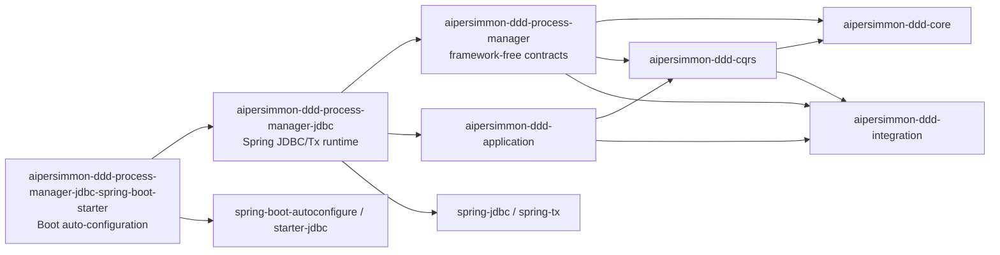
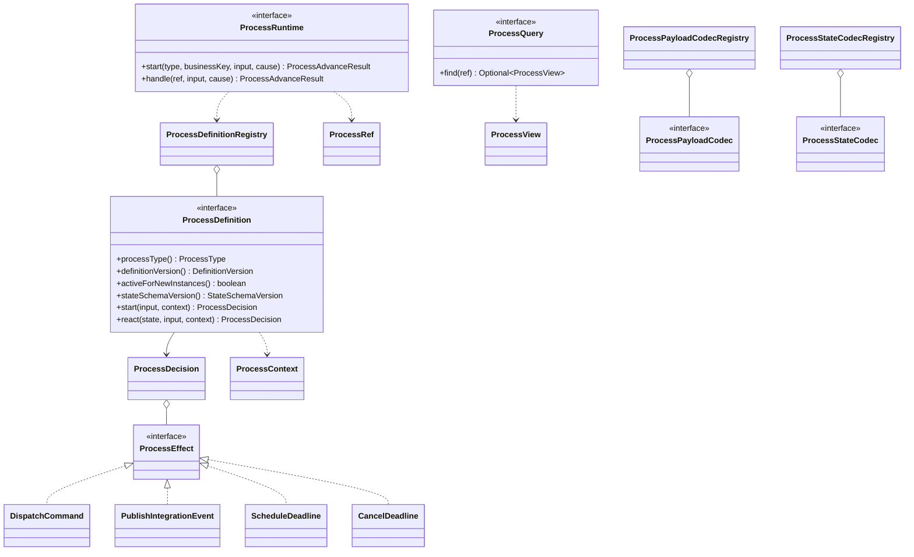
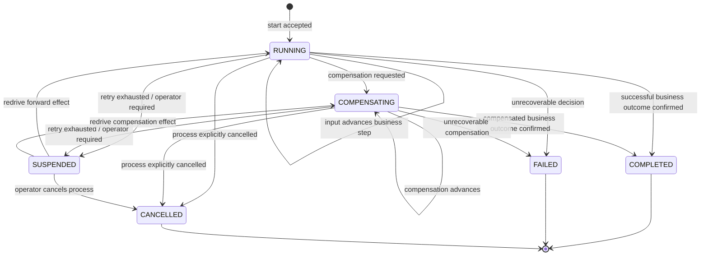
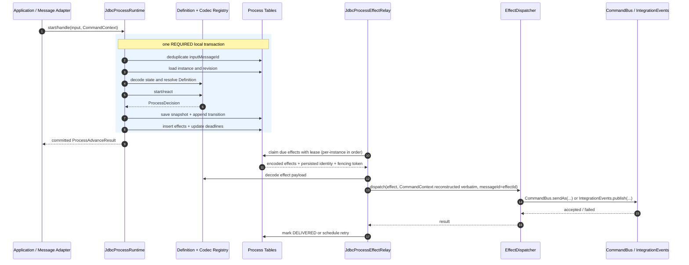
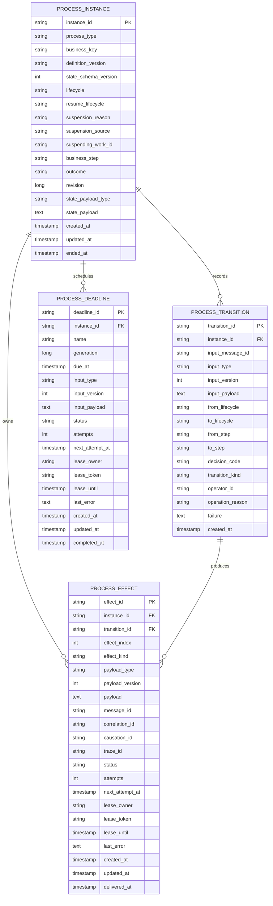
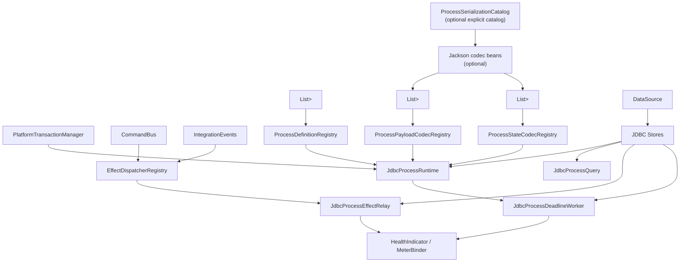
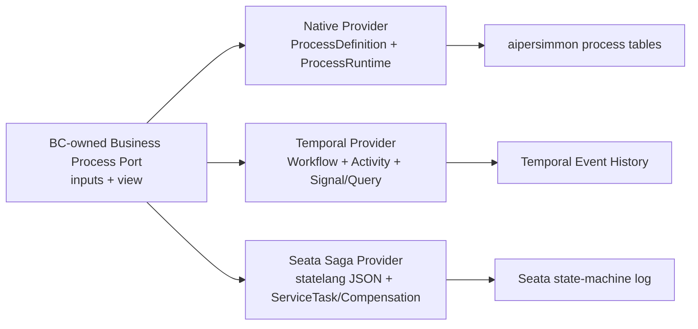
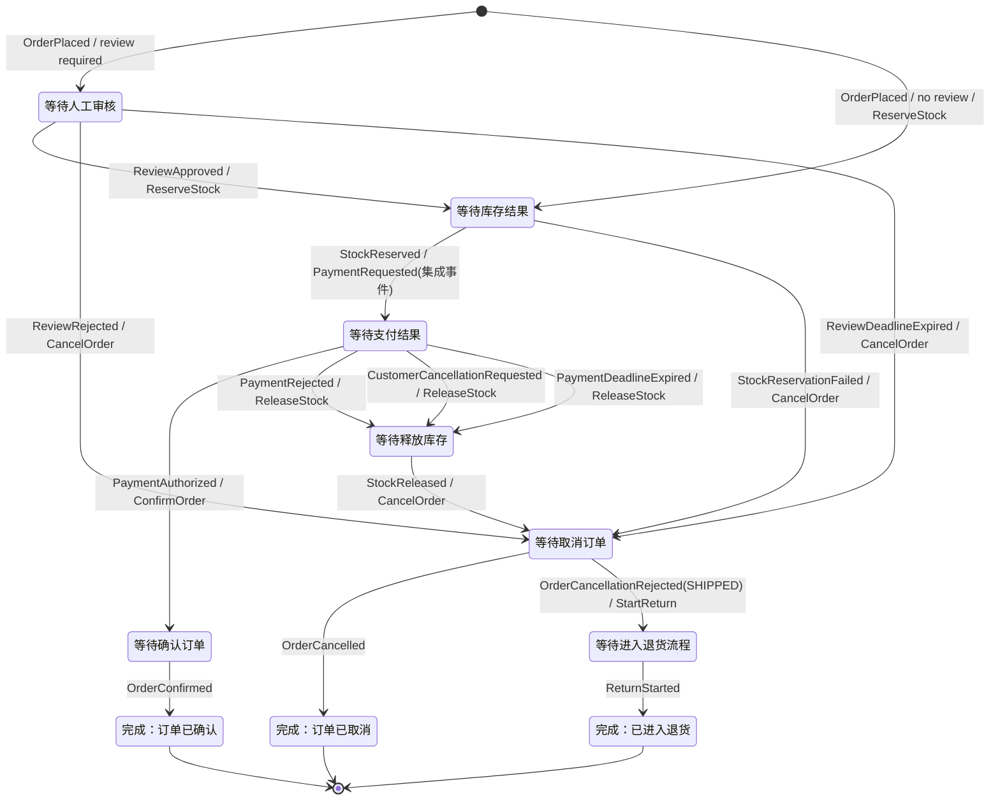
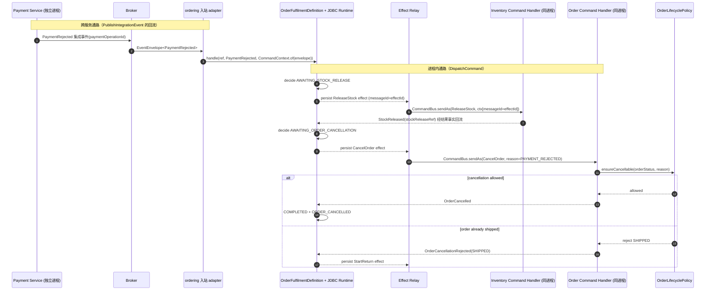

# Durable Process Manager：通用构件、JDBC Runtime 与 Spring Boot Starter

本文定义三个**与具体业务无关**的生产级 Process Manager 构件：

- `aipersimmon-ddd-process-manager`；
- `aipersimmon-ddd-process-manager-jdbc`；
- `aipersimmon-ddd-process-manager-jdbc-spring-boot-starter`。

业务流程名称、业务状态和领域规则不属于这些模块。具体 bounded context 只是消费者，在自己的 application/provider
模块中定义流程输入、状态和协调策略。正文不使用 Order、Inventory、Payment 等业务类型定义框架契约；这些类型只在
§十三的非规范性 Sample 中展示消费方法。

本文承接 [[analysis-00007-saga-process-manager]] 与 [[analysis-00009-saga-implementation-deep-dive]]，并取代
[[design-00001-aipersimmon-ddd-and-scaffold]] 中 `aipersimmon-ddd-saga`、`aipersimmon-ddd-saga-spring`、
`SagaState`、`SagaStore` 和独立 `DeadlineScheduler` 的目标形态。

## 一、结论

采用 **clean-slate rewrite**，不兼容旧 `saga` / `saga-spring` API。

三个模块的职责边界如下：

| 模块 | 核心职责 | 明确不负责 |
| --- | --- | --- |
| `aipersimmon-ddd-process-manager` | framework-free 的流程身份、生命周期、Definition、Decision、Effect、Runtime Port 和 codec SPI | JDBC、Spring、线程、轮询、业务流程 |
| `aipersimmon-ddd-process-manager-jdbc` | 基于 Spring JDBC/Tx 的生产级原生 runtime、四表存储、原子推进、effect relay、deadline worker、查询与运维 SPI | Spring Boot 自动装配、业务 Definition、自动建表 |
| `aipersimmon-ddd-process-manager-jdbc-spring-boot-starter` | Boot 自动装配、配置属性、worker 生命周期、可观测性、启动期校验 | 业务逻辑、隐藏式 classpath 猜测、自动执行 DDL |

这里的 `ProcessRuntime` 是**本地 durable Process Manager runtime** 的契约，不是 Temporal、Seata Saga 必须实现的
统一引擎接口。Temporal 和 Seata 的集成边界见 §七。

## 二、模块依赖总图



依赖规则：

- `process-manager` 没有 Spring、JDBC、Jackson、调度器或日志实现依赖。
- `process-manager-jdbc` 可以依赖 Spring JDBC/Tx，但不能依赖 Spring Boot。
- `process-manager-jdbc-spring-boot-starter` 只做装配，不承载运行时算法。
- 三个模块都不得依赖任何 scaffold 或 bounded-context 模块。

## 三、`aipersimmon-ddd-process-manager`

### 3.1 模块定位

该模块提供“业务流程定义如何被 durable runtime 执行”的最小公共语言。它不是聚合基类，不要求业务状态继承任何父类，
也不提供通用 DSL/BPMN。

### 3.2 包结构

```text
com.aipersimmon.ddd.processmanager
├── model/
│   ├── ProcessType.java
│   ├── ProcessBusinessKey.java
│   ├── ProcessInstanceId.java
│   ├── ProcessRef.java
│   ├── ProcessRevision.java
│   ├── DefinitionVersion.java
│   ├── StateSchemaVersion.java
│   ├── ProcessLifecycle.java
│   ├── ProcessStep.java
│   ├── ProcessOutcome.java
│   ├── DecisionCode.java
│   └── DeadlineName.java
├── definition/
│   ├── ProcessInput.java
│   ├── ProcessDefinition.java
│   ├── ProcessDefinitionRegistry.java
│   ├── ProcessContext.java
│   └── ProcessDecision.java
├── effect/
│   ├── ProcessEffect.java
│   ├── ProcessEffectKind.java
│   ├── DispatchCommand.java
│   ├── PublishIntegrationEvent.java
│   ├── ScheduleDeadline.java
│   └── CancelDeadline.java
├── runtime/
│   ├── ProcessRuntime.java
│   ├── ProcessAdvanceResult.java
│   ├── ProcessView.java
│   └── ProcessQuery.java
├── codec/
│   ├── EncodedPayload.java
│   ├── PayloadType.java
│   ├── ProcessPayloadCodec.java
│   ├── ProcessPayloadCodecRegistry.java
│   ├── ProcessStateCodec.java
│   └── ProcessStateCodecRegistry.java
└── exception/
    ├── ProcessAlreadyExistsException.java
    ├── ProcessNotFoundException.java
    ├── UnknownProcessDefinitionException.java
    ├── UnsupportedProcessInputException.java
    ├── ProcessSuspendedException.java
    ├── StaleProcessRevisionException.java
    └── ProcessSerializationException.java
```

每个 package 按 [[design-00001-aipersimmon-ddd-and-scaffold]] 约定提供 `package-info.java`。

### 3.3 身份与状态元数据

运行时元数据与业务状态分离：

```java
public record ProcessRef(
        ProcessInstanceId instanceId,
        ProcessType processType,
        ProcessBusinessKey businessKey) {
}

public enum ProcessLifecycle {
    RUNNING,
    COMPENSATING,
    SUSPENDED,
    COMPLETED,
    FAILED,
    CANCELLED
}
```

约束：

- `ProcessType` 是稳定 logical name，不使用 Java 类名。
- `ProcessBusinessKey` 是业务侧提供的关联键；runtime 不解释其内容。
- `ProcessInstanceId` 由 runtime 创建。
- `ProcessRevision` 只表达乐观并发版本，不进入业务状态对象。
- `ProcessStep` 和 `ProcessOutcome` 是稳定字符串值对象；具体值由消费方定义。
- `ProcessLifecycle` 表达 runtime 生命周期，不等于任何聚合状态。
- `SUSPENDED` 是 runtime 因投递/定时任务重试耗尽而设置的运维态，不是 Definition 可任意返回的业务结果；人工审核等业务等待
  仍是 `RUNNING + businessStep`。

### 3.4 Definition 与 Decision

消费方为每种本地 Process Manager 实现一个 `ProcessDefinition<S>`：

```java
public interface ProcessDefinition<S> {

    ProcessType processType();

    DefinitionVersion definitionVersion();

    boolean activeForNewInstances();

    StateSchemaVersion stateSchemaVersion();

    ProcessDecision<S> start(ProcessInput input, ProcessContext context);

    ProcessDecision<S> react(S currentState, ProcessInput input, ProcessContext context);
}
```

`ProcessDefinition` 必须是无 I/O 的确定性决策对象。它不能调用 repository、HTTP、`CommandBus`、
`IntegrationEvents`、系统时钟、随机数、Spring Bean 或第三方 SDK。

```java
public record ProcessContext(
        ProcessRef processRef,
        ProcessRevision currentRevision,
        DefinitionVersion definitionVersion,
        Optional<ProcessLifecycle> currentLifecycle,
        Optional<ProcessStep> currentStep,
        Instant now,
        CommandContext cause) {
}

public record ProcessDecision<S>(
        S state,
        ProcessLifecycle lifecycle,
        ProcessStep step,
        Optional<ProcessOutcome> outcome,
        DecisionCode decisionCode,
        List<ProcessEffect> effects) {
}
```

- `now`、process id 和输入 `CommandContext` 由 runtime 提供，使决策可重复测试。
- effect id 不由 Definition 创建；runtime 按 `transitionId + effectIndex` 确定性生成。
- `effects` 的顺序稳定，重试同一输入不得产生不同顺序。
- Definition 不修改传入 state；返回新的 state/decision。
- `start` 只处理新实例；`react` 只处理已存在实例。
- 同一 `ProcessType` 可以同时注册多个 DefinitionVersion，但必须且只能有一个 `activeForNewInstances=true`；旧版本设为
  `false` 后继续服务存量实例，不能因不再接收新实例而被删除。
- `start` 收到的 context 中 current lifecycle/step 为空；`react` 中二者必须存在。runtime 校验 lifecycle 合法迁移、
  Definition 不得返回 `SUSPENDED`、终态必须有 outcome，以及同一 Decision 中 deadline 操作不存在歧义。

### 3.5 Effect 模型

```java
public sealed interface ProcessEffect
        permits DispatchCommand,
                PublishIntegrationEvent,
                ScheduleDeadline,
                CancelDeadline {
}

public record DispatchCommand(Command<?> command) implements ProcessEffect {
}

public record PublishIntegrationEvent(IntegrationEvent event) implements ProcessEffect {
}

public record ScheduleDeadline(
        DeadlineName name,
        Instant dueAt,
        ProcessInput input) implements ProcessEffect {
}

public record CancelDeadline(DeadlineName name) implements ProcessEffect {
}
```

Effect 只携带业务 payload，不携带 messageId/correlationId/causationId/traceId。

**派发身份契约（消息身份属于「创建」而非「发送」）。** 一条消息的身份属于它被**创建**的时刻，不属于它被**发送**的
时刻；at-least-once 下同一条消息只创建一次却可能发送多次，故身份必须在创建点铸造、在每次发送时**原样携带**。同步命令
里「创建 == 发送」，所以现有 `CommandBus` 在 `send(...)` 时铸 id 是对的。但 Process Manager 的 effect 打破了这个前提：
effect 在**推进事务内、决策时刻**被创建并持久化（§4.3 第 5–9 步），却在**之后由 relay 在独立事务里、可能多次**发送
（§4.4）。因此 effect 的身份必须由 **durable runtime 在推进事务内确定性铸造并持久化**：

- effectId 由 runtime 按 `transitionId + effectIndex` 确定性生成（`UNIQUE(transition_id, effect_index)` 兜底事务重试）；
- 同一事务内一并铸造并写入 `PROCESS_EFFECT` 行的 `message_id = effectId`、`correlation_id`（继承输入）、
  `causation_id`（= 输入 messageId）、`trace_id`；
- relay 发送时从该行**重建完整 `CommandContext` 并逐字使用**，既不自铸新 id、也不 `deriveChild`——这是同一 effect 的
  多次重投落在**同一个 messageId** 下、从而可被下游去重的前提。

这需要写侧派发契约新增第三种入口（现有两种是「根派发自铸 id」与「以 cause 派生子命令另铸 id」，都无法逐字复用一个
已持久化身份）：

```java
// aipersimmon-ddd-cqrs：CommandBus 新增
// 派发一条已由上游 durable 存储（Process Manager effect relay 或 outbox）赋予身份的命令，逐字使用 messageContext，
// bus 不铸不派生。仅供基础设施（relay/dispatcher）调用；ArchUnit 守卫 handler/application 不得调用。
<R> R sendAs(Command<R> command, CommandContext messageContext);
```

`PublishIntegrationEvent` 类 effect 天然满足本契约：outbox 早已在**写行时**铸 eventId 并在重投时原样复用，effect relay
的命令侧只是补齐这个「发送一条已被赋予身份的消息」的对等入口。据此 [[decision-00013-command-context-and-causation-propagation]]
需增补：**消息 id 的合法铸造权威由「仅 bus」扩展为「bus（同步根/子命令）+ durable runtime（staged effect）」两个**，
业务代码与 payload 仍绝不自造 id——本文只是新增第二个基础设施铸造权威，不放开业务侧。

> **传输身份 ≠ 业务幂等键（互补，非二选一）。** effectId 作为传输 messageId 让 relay 的重投对**每种 effect** 统一、
> 廉价地可去重；而不可逆业务动作（扣款、扣库存）仍必须由聚合持有的**业务操作 id**（如 `paymentOperationId`，§13.2 已
> 建模）自行幂等——即便该操作经另一路径触达也不重复。本文的身份契约只解决传输层，不取消业务操作 id 的要求。

**Command effect 与 IntegrationEvent effect 的部署边界。** `DispatchCommand` 走进程内 `CommandBus`，同步派发到**同进程**
的本地 handler；因此它只在协调方与目标 BC **同进程（模块化单体）** 时可用。目标 BC 一旦是独立微服务，Process Manager
**不能**用 `DispatchCommand` 触达它，必须改用 `PublishIntegrationEvent`（经 outbox → broker），由对端入站 adapter（ACL）
把集成事件翻译成本地 command。两者在 relay 侧统一走「重建持久化身份 → 逐字派发」的同一路径，只是目标端口不同。§13
的 sample 同时演示这两条通路。

Command、deadline input 和 IntegrationEvent body 都必须通过显式 `ProcessPayloadCodec` 编解码；禁止用 Java 类全名作为
持久化契约。IntegrationEvent codec 的 logical type/version 必须与既有 `@EventType` 一致，Starter 启动时交叉校验；
`@EventType` 负责事件身份，不替代 payload serializer。

Command、deadline input 和 IntegrationEvent body 都必须通过显式 `ProcessPayloadCodec` 编解码；禁止用 Java 类全名作为
持久化契约。IntegrationEvent codec 的 logical type/version 必须与既有 `@EventType` 一致，Starter 启动时交叉校验；
`@EventType` 负责事件身份，不替代 payload serializer。

### 3.6 Runtime 与 Query Port

```java
public interface ProcessRuntime {

    ProcessAdvanceResult start(
            ProcessType processType,
            ProcessBusinessKey businessKey,
            ProcessInput input,
            CommandContext cause);

    ProcessAdvanceResult handle(
            ProcessRef processRef,
            ProcessInput input,
            CommandContext cause);
}

public interface ProcessQuery {

    Optional<ProcessView> find(ProcessRef processRef);
}
```

`ProcessRuntime` 是 command-side port；`ProcessQuery` 是只读 port。两者不提供 `setState`、`forceStep` 等通用修改 API。
运维 redrive 只重新派发既有 effect 或重新提交已记录 input，不能绕过 Definition 任意改状态。

`start` 的幂等语义如下：相同 `(processType, businessKey, inputMessageId)` 返回原 transition 的 duplicate 结果。相同
`(processType, businessKey)` 但**不同** `inputMessageId` 的处理受 `start.duplicate-business-key` 策略约束：

- `reject`（默认）：抛 `ProcessAlreadyExistsException`——适用于上游 inbound messageId 稳定、重复到达一定是同一条 start 的场景。
- `fold`：折叠为既有实例的 duplicate 结果（no-op）——适用于传输可能以**新** messageId 重投同一 business key 的场景，
  避免 start 因 id 不稳定而永久失败。

无论哪种策略，`UNIQUE(process_type, business_key)` 都保证一个业务键只有一个逻辑实例。`handle` 必须通过完整 `ProcessRef`
定位既有实例，不按 business key 猜测目标实例。

`ProcessAdvanceResult` 至少返回：

- `ProcessRef`；
- 新 `ProcessRevision`；
- lifecycle 和 step；
- `duplicate` 标记；
- 本次 transitionId。

### 3.7 Codec SPI

```java
public interface ProcessPayloadCodec<T> {

    PayloadType payloadType();

    Class<T> javaType();

    EncodedPayload encode(T value);

    T decode(EncodedPayload payload);
}

public interface ProcessStateCodec<S> {

    ProcessType processType();

    StateSchemaVersion schemaVersion();

    EncodedPayload encode(S state);

    S decode(EncodedPayload payload);
}
```

- Codec 由消费方注册，runtime 不反射扫描业务类。
- `ProcessPayloadCodecRegistry` 按 `(logicalType, version)` 和 Java type 双向唯一索引；冲突时启动失败。
- `ProcessStateCodecRegistry` 按 `(processType, stateSchemaVersion)` 唯一索引；冲突时启动失败。
- codec 可以用 JSON、Avro、Protobuf 等实现；公共契约不依赖 Jackson。

### 3.8 核心类 UML



### 3.9 通用生命周期状态机



`SUSPENDED` 只改变 lifecycle，必须保存 `resumeLifecycle` 并保留原 business step；redrive 后从原 step 继续。
`COMPLETED`、`FAILED`、`CANCELLED` 是终态，普通业务输入只能成为幂等 no-op，不能重新打开实例。

## 四、`aipersimmon-ddd-process-manager-jdbc`

### 4.1 模块定位与依赖

该模块是上述 contract 的默认生产实现：

- 依赖 `aipersimmon-ddd-process-manager`；
- 依赖 `aipersimmon-ddd-application`，用于 `IntegrationEvents`；
- 依赖 `spring-jdbc`、`spring-tx` 和 SLF4J API；
- 不依赖 Spring Boot、Actuator、Micrometer 或具体数据库驱动；
- 不包含任何业务 Definition 或 codec。

选择 Spring JDBC/Tx 而不是手写裸 `java.sql.Connection`，是为了让 runtime 的 REQUIRED 事务能够与现有 Inbox、
Command handler 和应用事务明确组合；Boot 装配仍留在第三个模块。

### 4.2 包结构

```text
com.aipersimmon.ddd.processmanager.jdbc
├── runtime/
│   ├── JdbcProcessRuntime.java
│   ├── JdbcProcessQuery.java
│   └── JdbcProcessUnitOfWork.java
├── store/
│   ├── JdbcProcessInstanceStore.java
│   ├── JdbcProcessTransitionStore.java
│   ├── JdbcProcessEffectStore.java
│   └── JdbcProcessDeadlineStore.java
├── relay/
│   ├── JdbcProcessEffectRelay.java
│   ├── ProcessEffectDispatcher.java
│   ├── EffectDispatcherRegistry.java
│   ├── DecodedProcessEffect.java
│   ├── CommandEffectDispatcher.java
│   └── IntegrationEventEffectDispatcher.java
├── deadline/
│   └── JdbcProcessDeadlineWorker.java
├── operation/
│   └── JdbcProcessOperations.java
├── lease/
│   ├── Lease.java
│   ├── WorkerId.java
│   └── JdbcProcessDialect.java
├── retry/
│   ├── ProcessRetryPolicy.java
│   └── ExponentialBackoffPolicy.java
└── schema/
    └── ProcessSchemaValidator.java
```

`store` 中的 DAO/row 类型是 runtime 内部实现，不作为业务扩展点。业务方不能 subclass store 改表结构。

### 4.3 原子推进算法

`JdbcProcessRuntime.start/handle` 使用 `TransactionTemplate` 和 `PROPAGATION_REQUIRED`：已有外层事务时加入，
没有时创建本地事务。

```text
start/handle
  1. start 解析 active Definition；handle 按实例记录的 definitionVersion 解析
  2. 用 input messageId 做 process-level 去重
  3. load/lock process_instance，校验 revision/lifecycle
  4. decode state
  5. 执行 Definition.start/react
  6. 校验 Decision 合法性
  7. update process_instance revision
  8. append process_transition
  9. encode 并 insert command/event effects
 10. upsert/cancel deadlines
 11. commit
```

第 1–10 步必须在同一个本地数据库事务中完成。Definition 抛异常、codec 失败、唯一约束冲突或任一 SQL 失败时全部回滚。

### 4.4 原子推进与 Effect Relay 时序



`CommandBus.sendAs/send` 和 `IntegrationEvents.publish` 永远不在流程推进事务中调用。这样宕机只会造成 effect 重投，不会造成
“状态已提交但下一步永久丢失”。

### 4.5 四表数据模型

固定逻辑表名：

- `aipersimmon_process_instance`；
- `aipersimmon_process_transition`；
- `aipersimmon_process_effect`；
- `aipersimmon_process_deadline`。



必须具备的约束/索引：

- `UNIQUE(process_type, business_key)`：默认一个业务键只有一个逻辑实例；允许重复执行时，run/cycle 必须成为业务键的一部分。
- `UNIQUE(instance_id, input_message_id)`：同一输入不能推进两次。
- `UNIQUE(transition_id, effect_index)`：事务重试不能生成重复 effect。
- `UNIQUE(instance_id, name, generation)`：旧 deadline generation 迟到时只能 no-op。
- `INDEX(effect.status, effect.next_attempt_at)`：relay 查找待处理 effect；支持 partial index 的 dialect 应建为
  `WHERE status IN ('PENDING','IN_FLIGHT')` 的部分索引，避免随 `DELIVERED` 行增长而退化。
- `INDEX(effect.instance_id, effect.effect_index)`：per-instance 顺序派发（§4.6）按实例定位待发 effect。
- `INDEX(deadline.status, deadline.next_attempt_at, deadline.due_at)`：deadline worker 查找到期任务（同样建议部分索引）。
- `INDEX(instance.process_type, instance.lifecycle, instance.business_step)`：运维查询。
- `INDEX(instance.process_type, instance.definition_version)`（限 live lifecycle）：支撑启动期「旧 DefinitionVersion 是否
  仍有运行实例」的校验（§5.6），避免大表全扫。
- `INDEX(instance.lifecycle, instance.updated_at)`：支撑卡死实例扫描（§4.7 兜底 TTL）。

Transition 是 append-only 审计记录；Instance 是当前快照。不能为了节省空间覆盖历史 transition。**四表都无自动保留/清理**
（§5.4）：`process_transition` 与 `DELIVERED` 的 `process_effect` 会持续增长，故**生产部署必须把分区/归档/retention 作为
本模块的必需配套**（不是可选优化），否则 claim 与运维查询会随数据量退化。

### 4.6 Effect 派发

Effect 状态：

```text
PENDING -> IN_FLIGHT -> DELIVERED
                    -> PENDING     # bounded retry/backoff
                    -> DEAD        # attempts exhausted
```

规则：

- claim 使用数据库原子更新或 `FOR UPDATE SKIP LOCKED`，由 `JdbcProcessDialect` 封装数据库差异。**每个 dialect 的
  claim/lease 在 crash window 下不双投**是硬性验收 gate（§10），非普通用例。
- claim 写入 `leaseOwner + leaseToken + leaseUntil`；完成更新必须带 leaseToken，过期 worker 不能覆盖新 owner。
- 派发成功但 `DELIVERED` 更新前宕机会重投，因此 Command handler 和外部副作用必须幂等。
- relay 不自铸派发身份：从 `PROCESS_EFFECT` 行**重建完整 `CommandContext`**（`messageId = effectId`、correlationId 继承
  输入、causationId 指向输入 messageId、trace 继承），command effect 经 `CommandBus.sendAs(cmd, ctx)` 逐字派发、event
  effect 经 `IntegrationEvents.publish(event, ctx)` 派发（见 §3.5 派发身份契约）。
- **per-instance 顺序保证**：relay 对**同一 `instance_id`** 的 effect 严格按 `effect_index` 串行派发——上一条未
  `DELIVERED` 前不派发同实例的下一条；不同实例之间仍并发。避免同实例的 command 在下游乱序到达（编排式流程对此敏感）。
- 重试采用有上限的指数退避 + jitter；禁止无限热重试。
- 达到 max attempts 后 effect 进入 `DEAD`；同一事务把 Instance lifecycle 置为 `SUSPENDED`，并记录
  `resumeLifecycle`、`suspensionReason`、`suspensionSource=EFFECT` 与 `suspendingWorkId`，但不修改 business step。
- redrive 只把原 `DEAD` effect 放回 `PENDING`，复用 effectId，不创建新的业务操作身份；确认该实例不存在其他
  `DEAD` effect 后，才恢复到 `resumeLifecycle` 并清空 suspension metadata。
- Instance 挂起期间，普通 `handle` **不向消息层无界回弹**：到达的输入以 `transition_kind = PARKED` 幂等地 append 进
  `process_transition`（复用现有 `input_message_id`/`input_payload` 列与 `UNIQUE(instance_id, input_message_id)` 去重，
  不新增表），且**不推进** state/step，并向调用方返回 parked 结果；实例恢复后按 `created_at` 顺序重放这些 PARKED 输入。
  既不静默丢消息，也不让传输层对一个卡住的实例持续重投形成 backpressure。已经提交的 PENDING/IN_FLIGHT effect 仍可完成。

`ProcessEffectDispatcher` 是 JDBC 模块的受控扩展点：

```java
public interface ProcessEffectDispatcher {

    ProcessEffectKind kind();

    void dispatch(DecodedProcessEffect effect, CommandContext context);
}
```

内置：

- `CommandEffectDispatcher` → `CommandBus.sendAs(...)`：**进程内**同步派发到本地 handler，仅适用于协调方与目标 BC 同进程。
- `IntegrationEventEffectDispatcher` → `IntegrationEvents.publish(...)`：经 outbox → broker 派发，用于目标 BC 是**独立微服务**
  的跨进程协调；对端入站 adapter（ACL）把集成事件翻译成本地 command（[[decision-00013-command-context-and-causation-propagation]]）。

同一种 `ProcessEffectKind` 只能有一个 dispatcher；缺失或重复时启动失败。消费方按目标 BC 的部署形态（同进程 / 微服务）
在 Definition 里选择产出 `DispatchCommand` 还是 `PublishIntegrationEvent`——见 §3.5 部署边界与 §13 sample 的两条通路。

### 4.7 Deadline Worker

Deadline 不是独立 callback：到期时被转换为普通 `ProcessInput`，再次进入 `JdbcProcessRuntime.handle`。

```text
PENDING -> IN_FLIGHT -> FIRED
                    -> PENDING     # bounded retry/backoff
                    -> DEAD        # attempts exhausted
PENDING -> CANCELLED
```

```text
schedule decision
  -> 同事务 upsert deadline(name, generation, dueAt, encodedInput)

deadline worker
  -> claim due row with lease
  -> handle(processRef, decodedInput, deadline CommandContext)
  -> 同一事务记录 transition 并把 deadline 标记 FIRED
```

- reschedule 必须增加 generation。
- cancel 只取消当前 generation。
- deadline messageId 由 `deadlineId + generation` 确定性生成。
- deadline transition 与 `FIRED` 状态必须原子提交；宕机后允许安全重试。
- 已终态实例、已取消或旧 generation 的 deadline 是可审计 no-op。
- deadline 处理也使用有上限的退避；达到 max attempts 后 deadline 进入 `DEAD`，以
  `suspensionSource=DEADLINE` 和 deadline identity 按与 effect 相同的规则挂起实例。
- Deadline worker 不 claim `SUSPENDED` 实例的新 deadline；实例恢复后，已过期 deadline 立即重新进入到期候选集。
- **整体实例兜底 TTL**：deadline 只保证「被 schedule 的等待」有超时，无法覆盖「等一个永不到来的外部事实、且当初没
  schedule deadline」的卡死。故当 `instance.max-lifetime` 配置为非 `none` 时，runtime 在 `start` 时挂一个兜底 deadline
  （可被业务 deadline 复位/延长）；到期即转成一个 `ProcessInput` 交给 Definition 决策（补偿 / 失败 / 延长），而非由
  runtime 擅自终止。生产强烈建议启用，保证任何 RUNNING 实例都有一个终将到来的推进点，不会静默悬挂；未启用时靠 §4.10
  卡死实例扫描兜底。

### 4.8 并发与输入幂等

- `revision` 乐观锁保证同一实例每次只有一个 transition 提交。
- revision 冲突时，runtime 回滚、重新加载并重新执行 Definition；重试次数有小上限，超过后交还消息层重投。
- `input_message_id` 唯一约束是 process-level 幂等。
- 现有 `Inbox` 是 transport-level 幂等。两者同时使用时，外层 listener 事务与 runtime 的 REQUIRED 事务必须是同一个
  `PlatformTransactionManager`，不能先提交 Inbox 再推进 Process。
- 乱序输入由 Definition 根据 lifecycle/step 决定：推进、忽略、补偿或拒绝；JDBC store 不包含业务顺序规则。

### 4.9 序列化与版本演进

JDBC runtime 同时版本化：

- `definition_version`；
- `state_schema_version`；
- input/effect 的 `payload_type + payload_version`。

规则：

- 新实例使用 Registry 中该 ProcessType 的 active DefinitionVersion。
- 已运行实例固定使用其持久化的 DefinitionVersion。
- Registry 必须保留仍有运行实例使用的旧 Definition；删除时启动校验失败或运维检查失败。
- `ProcessStateCodec` 负责读取相应 schema version；升级通过显式 upcaster/migrator，不允许反序列化失败后重开实例。
- payload logical type/version 由 codec catalog 提供，不允许 class-name fallback。
- state/input/effect payload 应最小化；敏感字段由 codec 加密，运维查询默认脱敏。

### 4.10 Query 与运维能力

`JdbcProcessQuery` 只读提供：

- 按 `ProcessRef` 查询当前 `ProcessView`；
- 按 type/businessKey/lifecycle/step/definitionVersion 分页查询；
- 查询 transition timeline；
- 查询 pending/dead effects 和 pending deadlines；
- 查询卡死候选：`lifecycle=RUNNING/COMPENSATING`、无 pending effect/deadline 且 `updated_at` 超阈值的实例（运维发现
  遗漏 deadline 的流程，与 §4.7 兜底 TTL 互补）。

运维命令独立于业务 `ProcessRuntime`：

- `JdbcProcessOperations.redriveEffect(effectId, operator, reason)`；
- `JdbcProcessOperations.redriveDeadline(deadlineId, generation, operator, reason)`；
- `JdbcProcessOperations.cancelProcess(processRef, expectedRevision, operator, reason)`；
- 暂停/恢复 worker 属于 worker control/部署运维，不修改 process state；
- 不提供任意改 step/state payload 的 API。

每个运维动作都必须在 transition/timeline 中留下 operator、reason、时间与旧/新状态。`cancelProcess` 只终止协调器并取消
尚未派发的 effect/deadline，不代表任何业务聚合已经被取消，也不会暗中发送补偿命令；业务取消仍必须作为
`ProcessInput` 交给 Definition 决策。

## 五、`aipersimmon-ddd-process-manager-jdbc-spring-boot-starter`

### 5.1 模块定位

Starter 只把已有 JDBC runtime 组装成 Spring Boot 应用能力。所有 bean 都允许消费者显式覆盖；Starter 不扫描业务包，
只收集容器中显式注册的 Definition、Codec、Serialization Catalog 和 Dispatcher。

### 5.2 包结构

```text
com.aipersimmon.ddd.processmanager.jdbc.autoconfigure
├── AipersimmonDddProcessManagerJdbcAutoConfiguration.java
├── ProcessManagerJdbcProperties.java
├── ProcessManagerJdbcWorkerConfiguration.java
├── codec/
│   ├── JacksonProcessCodecConfiguration.java
│   └── ProcessSerializationCatalog.java
├── ProcessManagerJdbcObservabilityConfiguration.java
├── ProcessManagerJdbcHealthIndicator.java
└── ProcessManagerJdbcMeterBinder.java

META-INF/spring/
└── org.springframework.boot.autoconfigure.AutoConfiguration.imports

aipersimmon/db/migration/process-manager/{postgresql,mysql,h2}/
└── V1__aipersimmon_process_manager.sql
```

DDL 以分方言 Flyway migration 为单一来源。可选的共享 `aipersimmon-ddd-flyway` starter
在启动时用独立历史表 `flyway_schema_history_aipersimmon_process_manager` 自动建表(排在
`@DependsOnDatabaseInitialization` 的 `ProcessSchemaValidator` 之前,校验器仍保留作双保险);
不启用该 starter 的生产应用仍须自行通过 Flyway/Liquibase 管理这份 migration。

Jackson 支持只位于 Starter 的条件装配层：仅当存在 `ObjectMapper` 和消费方显式声明的
`ProcessSerializationCatalog` 时，才按 catalog 生成 codec bean。Catalog 必须逐项给出 logical type/version、Java type，
state 还必须给出 process type/schema version；禁止扫描 classpath 或回退到类全名。需要加密、upcast、Avro/Protobuf 的
应用直接提供自己的 `ProcessPayloadCodec` / `ProcessStateCodec` bean 覆盖该便利装配。

### 5.3 自动装配 Bean 图



主要 bean：

| Bean | 条件与作用 |
| --- | --- |
| `ProcessDefinitionRegistry` | 收集全部 Definition；校验 `(processType, definitionVersion)` 唯一及 active version 唯一 |
| `ProcessPayloadCodecRegistry` | 收集 payload codecs；校验 logical type/version 与 Java type 双向唯一 |
| `ProcessStateCodecRegistry` | 收集 state codecs；校验 `(processType, stateSchemaVersion)` 唯一 |
| `JdbcProcessDialect` | 根据配置或 DatabaseMetaData 选择 PostgreSQL/MySQL；未知数据库 fail-fast |
| 四个 JDBC Store | `@ConditionalOnMissingBean`；只依赖 DataSource/JdbcTemplate |
| `JdbcProcessRuntime` | 依赖 registry、codec、stores、Clock、TransactionTemplate |
| `JdbcProcessQuery` | 只读查询与 timeline |
| `CommandEffectDispatcher` | 存在 `CommandBus` 时装配 |
| `IntegrationEventEffectDispatcher` | 存在 `IntegrationEvents` 时装配 |
| `JdbcProcessEffectRelay` | relay enabled 时装配；使用独立 scheduler |
| `JdbcProcessDeadlineWorker` | deadline worker enabled 时装配；使用独立 scheduler |
| Health/Metrics | Actuator/Micrometer 在 classpath 时条件装配；导出下列最小 SLI（见 §5.5） |

生产可用要求 `ProcessManagerJdbcMeterBinder` 至少导出这组 SLI，缺一不可视为「production-usable」：

- `oldest_pending_effect_age` / `oldest_pending_deadline_age`：最老待派发/到期任务的滞留时长（relay/worker 健康度）。
- `dead_effects` / `dead_deadlines`：DEAD 计数（需人工 redrive 的积压）。
- `suspended_instances`：`SUSPENDED` 实例数（按 `suspensionSource` 打标签）。
- `stuck_instances`：§4.10 卡死候选数。
- `claim_latency` / `dispatch_latency`：claim 与派发耗时分布。
- `advance_conflict_retries`：revision 冲突重试次数（热实例竞争信号）。

### 5.4 配置属性

统一前缀：`aipersimmon.ddd.process-manager.jdbc`。

| 属性 | 默认值 | 含义 |
| --- | --- | --- |
| `enabled` | `true` | 启用 JDBC runtime 自动装配 |
| `dialect` | `auto` | `auto/postgresql/mysql/h2`；H2 仅测试/示例 |
| `concurrency.max-retries` | `3` | revision 冲突的事务级重试上限 |
| `start.duplicate-business-key` | `reject` | `reject/fold`；同 business key 不同 inputMessageId 的 start 处理（§3.6） |
| `instance.max-lifetime` | `none` | 整体实例兜底 TTL（§4.7）；`none` 表示不挂兜底 deadline，值如 `30d` 表示到期转 input 交 Definition |
| `effect-relay.enabled` | `true` | 启用 effect relay |
| `effect-relay.poll-delay` | `500ms` | 空轮询间隔 |
| `effect-relay.batch-size` | `100` | 每批 claim 数量 |
| `effect-relay.lease-duration` | `30s` | effect lease 时长 |
| `effect-relay.max-attempts` | `12` | 进入 DEAD 前最大尝试次数 |
| `effect-relay.backoff.initial` | `1s` | 初始退避 |
| `effect-relay.backoff.max` | `5m` | 最大退避 |
| `effect-relay.backoff.multiplier` | `2.0` | 指数倍数 |
| `effect-relay.backoff.jitter` | `0.2` | 防止惊群 |
| `deadline-worker.enabled` | `true` | 启用 deadline worker |
| `deadline-worker.poll-delay` | `500ms` | deadline 轮询间隔 |
| `deadline-worker.batch-size` | `100` | 每批 claim 数量 |
| `deadline-worker.lease-duration` | `30s` | deadline lease 时长 |
| `deadline-worker.max-attempts` | `12` | 进入 DEAD 前最大处理次数 |
| `deadline-worker.backoff.initial` | `1s` | 初始退避 |
| `deadline-worker.backoff.max` | `5m` | 最大退避 |
| `deadline-worker.backoff.multiplier` | `2.0` | 指数倍数 |
| `deadline-worker.backoff.jitter` | `0.2` | 防止惊群 |
| `worker-id` | 自动生成 | 显式节点租约身份；不是业务身份 |
| `shutdown-timeout` | `30s` | 停止 claim 后等待在途任务的最长时间 |
| `schema-validation` | `validate` | `validate/none`；从不自动建表 |
| `payload.max-bytes` | `1048576` | 单个 state/input/effect payload 上限 |

属性对象必须在构造时校验：正数、合理 lease/poll 关系、jitter 范围和 payload 上限。非法配置启动失败。

Starter 不提供默认历史删除任务。Transition 是审计事实，保留周期受业务、法务与数据分级约束；生产应用应通过数据库分区、
归档作业和项目自己的 migration/retention policy 管理容量，不能由通用 starter 按一个默认天数静默删除。

### 5.5 Worker 生命周期

- Relay 与 Deadline 使用独立线程池，不能复用一个单线程 `TaskScheduler`。
- 应用关闭时停止 claim 新任务，等待当前 lease 内任务完成到 configurable graceful timeout。
- 多实例部署默认安全；节点 identity 使用显式 instance id，未配置时生成进程级随机 WorkerId，仅用于租约而非业务身份。
- 数据库暂时不可用时 worker 退避并报告 DOWN/DEGRADED，不在紧循环中刷日志。
- 业务 Definition 或 codec 异常不能杀死 scheduler 线程。

### 5.6 启动期 fail-fast

Starter 在 application ready 前验证：

- process tables 存在且关键列/索引版本兼容；
- Definition key 不冲突，每个 ProcessType 恰有一个 active version；
- 运行中实例引用的 DefinitionVersion 与 StateSchemaVersion 均有可用实现；
- codec logical type/version 无冲突；
- Serialization Catalog 中每项注册完整且与显式 codec 不冲突；
- 配置启用的 effect kind 有且只有一个 dispatcher；
- 数据库 dialect 支持 claim/lease SQL；
- relay/deadline 配置合法。

`schema-validation=none` 只能关闭表结构验证，不能关闭 Definition/codec/dispatcher 一致性校验。

## 六、消费方如何使用三个通用模块

业务代码不进入构件库。推荐的 provider 隔离形态：

```text
<bc>-application/
└── process/<process-name>/
    ├── <Name>Process.java          # 业务入口 port
    ├── <Name>Input.java            # 业务输入 sealed hierarchy
    └── <Name>View.java             # 业务查询视图

<bc>-process-native/
└── <Name>ProcessDefinition.java    # 依赖 aipersimmon-ddd-process-manager

<bc>-process-temporal/
└── <Name>Workflow.java             # 依赖 Temporal SDK，不复用 ProcessDefinition

<bc>-process-seata-saga/
└── statelang/<name>-vN.json        # 依赖 Seata Saga，不复用 ProcessDefinition
```

应用装配层选择且只选择一个 provider。`<Name>Process` 业务 port、业务 input/view 和验收场景可以稳定；执行代码不承诺
跨 JDBC、Temporal、Seata 直接复用。

## 七、Temporal / Seata 的后续集成边界



### 7.1 Temporal

- Temporal provider 直接使用 Workflow、Activity、Signal/Update、Query 和 durable Timer。
- Workflow 代码必须确定且无副作用；CommandBus、repository、HTTP 和第三方调用放入 Activity。
- Activity 使用稳定 operation id 幂等。
- Event History 是执行事实来源，不双写 `aipersimmon_process_*` 四表。
- Workflow 版本演进使用 Temporal Worker Versioning/Patching 和 replay test。
- `aipersimmon-ddd-process-manager-jdbc` 不作为 Temporal adapter 的底座。

### 7.2 Seata

- Seata Saga provider 使用 `Name/Version/StartState/States` JSON definition 和 state instance log。
- ServiceTask 调用 application service/port；补偿节点由业务显式实现。
- 正向与补偿服务必须幂等，并支持空补偿、防悬挂。
- Seata state-machine log 是执行事实来源，不双写 `aipersimmon_process_*` 四表。
- Seata AT/TCC/XA 只用于短时同步资源协调或某个 Activity/Command 内部，不替代长流程 Process Manager。

### 7.3 为什么不提供通用 `SagaEngine`

三种 runtime 的核心语义不同：

| 能力 | JDBC Process Runtime | Temporal | Seata Saga |
| --- | --- | --- | --- |
| 流程表达 | Java Definition/Decision | deterministic Workflow code | JSON state machine |
| 执行事实 | snapshot + transition/effect/deadline | Event History | state-machine/state-instance log |
| 外部动作 | effect relay | Activity | ServiceTask |
| 等待 | deadline row | durable Timer/await | state-machine 节点/恢复 |
| 演进 | definition + state codec version | replay + Worker Versioning/Patching | state-machine definition version |
| 补偿 | Definition 显式决策 | Workflow/Activity 编排 | CompensateState + engine recovery |

把这些压成一个 start/signal/timer/compensate/replay 接口，只会丢失各引擎的正确语义。可替换边界必须在 BC-owned
Business Process Port，而不是 runtime 内核。

## 八、与聚合和领域策略的关系

- AggregateRoot 不依赖这三个模块。
- 聚合状态机/`TransitionPolicy` 维护单聚合不变量；ProcessDefinition 只协调跨聚合事实和请求。
- ProcessDefinition 不读取其他 bounded context 的 repository。
- Process lifecycle、business step、聚合 status 和 Temporal/Seata 执行 status 是不同状态，不做 1:1 共表。
- Runtime 只能保证消息、状态和 effect 的可靠推进，不能替业务定义补偿语义。

## 九、生产故障语义

| 故障点 | 必须结果 |
| --- | --- |
| Decision 或持久化过程中宕机 | 整个 REQUIRED 事务回滚，输入可重投 |
| instance/transition/effect 已提交，派发前宕机 | relay 重启后继续派发，不丢 effect |
| 外部副作用成功，DELIVERED 前宕机 | effect 以**同一 effectId（= 派发 messageId）** 重投；下游按 effectId 幂等 |
| 同实例多个 effect | relay 按 `effect_index` 串行派发，上一条未 DELIVERED 前不发下一条（§4.6 per-instance 顺序） |
| 相同输入重复到达 | `(instanceId,inputMessageId)` 唯一约束使第二次成为 duplicate/no-op |
| 两个输入并发推进 | revision 只允许一个提交，另一个重新加载决策 |
| 两个 worker 同时看到 effect/deadline | leaseToken/fencing 只允许当前 owner 完成确认 |
| Deadline 重设后旧 worker 迟到 | generation 校验使旧 deadline no-op |
| Effect 持续失败 | bounded retry 后 DEAD，instance SUSPENDED，可审计 redrive |
| 挂起实例又收到输入 | 输入 append 为 `PARKED` transition，不回弹消息层；恢复后按序重放（§4.6） |
| 实例等一个永不到来的事实 | `max-lifetime` 兜底 deadline 到期转 input，交 Definition 决策（§4.7） |
| Definition/state schema 升级 | 旧实例仍可解码并使用原 definition version |
| 数据库短时不可用 | worker 退避，恢复后继续，scheduler 线程不退出 |

系统只承诺 at-least-once delivery；通过 effectId、inputMessageId 和下游幂等实现 exactly-once-in-effect。

## 十、测试与验收边界

三个模块达到“生产可用”至少要有以下自动化验证：

- `process-manager`：Definition/Decision 不变量、lifecycle 合法迁移、codec registry 冲突、effect context 派生。
- `process-manager-jdbc`：四表原子提交、rollback 不留残行、revision 冲突、重复 input、effect 确定性 id。
- **派发身份契约**：同一 effect 多次重投时 `CommandBus.sendAs(cmd, ctx)` 收到的 `messageId` 恒等于 effectId、
  correlation/causation 稳定（不 `deriveChild` 出新 id）；ArchUnit 守卫 handler/application 不调用 `sendAs(...)`。
- **per-instance 顺序**：同实例 effect 严格按 index 串行、上一条未 DELIVERED 不发下一条；不同实例并发不受阻。
- **挂起期 parking**：SUSPENDED 实例的输入 append 为 `PARKED` 且不推进 state；恢复后按序重放；不向消息层回弹。
- **start 幂等策略**：`reject` 抛 `ProcessAlreadyExistsException`、`fold` 折叠为 duplicate（同 business key 不同 msgId）。
- **兜底 TTL**：`max-lifetime` 到期转成 input 交 Definition，而非 runtime 擅自终止。
- relay：dispatch-success-before-ack crash、lease 过期、stale token、bounded retry、DEAD/redrive。
- deadline：schedule/reschedule/cancel、旧 generation、fire-before-ack crash、多实例竞争。
- schema/codec：旧 state schema upcast、缺 DefinitionVersion fail-fast、payload size/加密 codec。
- starter：条件装配、用户 bean 覆盖、非法配置 fail-fast、无 DataSource/TxManager 的清晰启动错误、最小 SLI 指标导出。
- PostgreSQL/MySQL Testcontainers 多实例测试；H2 只做快速单元/契约测试。
- **硬性 gate**：每个 dialect 的 claim/lease 必须有故障注入测试证明 crash window 下**不双投**——这是能否声称
  「生产可用」的准入条件，非普通用例。故障注入必须覆盖每一个「事务提交前/后」与「外部副作用前/后」的 crash window。

## 十一、明确不做

- 不提供 `SagaState` 或要求业务状态继承框架基类。
- 不提供 `save(process); commandBus.send(...)` 两段式 API。
- 不默认内存 DeadlineScheduler。
- 不无限重试，不把异常吞掉留待下一轮热循环。
- 不让挂起实例的输入向消息层无界回弹（改为 `PARKED` 落库、恢复重放）。
- 不用 `DispatchCommand` 跨进程触达独立微服务（跨服务用 `PublishIntegrationEvent`）。
- 不使用 Java 类名作为持久化 type。
- 不自动扫描业务 package，不反射推断 Definition/codec。
- 不自动执行建表 DDL。
- 不在 query/operation API 中提供任意修改 state/step 的后门。
- 不把 Temporal/Seata 包在 `ProcessRuntime` 后假装可以无损替换。
- 不让 Process Manager 替代聚合领域规则或跨 BC 读取数据库。

## 十二、与现有文档的关系

以下决策继续有效：

- [[decision-00006-integration-event-transport-selection]]：outbox + at-least-once + inbox 幂等。
- [[decision-00008-event-subscriber-layer-placement]]：Integration Event listener 在 adapter，流程协调在 application/provider。
- [[decision-00009-event-type-markers-and-handler-contracts]]：不新增通用 Integration Event handler marker。
- [[decision-00011-cqrs-write-contracts-as-interfaces-not-annotations]]：Command/Handler/Bus 保持显式接口。
- [[decision-00014-cloudevents-integration-event-contract]]：Integration Event logical type/version 继续有效。

本文触发的决策增补（已落地）：

- [[decision-00016-durable-runtime-staged-message-identity]]（patch of
  [[decision-00013-command-context-and-causation-propagation]]）：id 的合法**铸造权威**由「仅 `CommandBus`」扩展为
  「`CommandBus`（同步根/子命令）+ durable runtime（staged effect，身份在推进事务内确定性铸造并持久化）」；`CommandBus`
  新增 `sendAs(cmd, messageContext)` 逐字派发入口（§3.5），仅供基础设施调用，ArchUnit 守卫。decision-00013 核心命题
  （元数据显式传播、不污染 payload、业务代码不自造 id、禁 ambient）不变。

[[design-00001-aipersimmon-ddd-and-scaffold]] 的 §5.12–5.13 与生产化开放项已经改为指向本文；其中仍出现的
`-saga/-saga-spring` 只记录已交付脚手架基线，不再代表目标 API。

## 十三、Sample：订单履约 Process Manager

本章是**非规范性消费示例**，用于说明 multi-module 业务如何使用三个通用构件。这里出现的 Order、Inventory、
Payment、Review 和 Return 类型都属于 sample bounded context，不进入任何 `aipersimmon-ddd-process-manager*` 模块。

**本 sample 刻意混合两种部署形态，以演示 §3.5 的两条 effect 通路：**

- **Order、Inventory、Review、Return 与 Process Manager 同进程（模块化单体）** → 用 `DispatchCommand`，effect relay 经
  `CommandBus.sendAs(...)` 同步派发到本地 handler。
- **Payment 已经拆成独立微服务** → 用 `PublishIntegrationEvent`，effect relay 经 outbox → broker 发出
  `PaymentRequested`；Payment 服务在自己进程里消费、执行、再发回 `PaymentAuthorized/PaymentRejected` 集成事件；
  ordering 的入站 adapter（ACL）把这些事件翻译成 `OrderFulfilmentInput` 再 `ProcessRuntime.handle`。

### 13.1 Sample 模块落点

```text
ordering-application/
└── fulfilment/
    ├── OrderFulfilmentProcess.java
    ├── OrderFulfilmentInput.java
    └── OrderFulfilmentView.java

ordering-process-native/
└── fulfilment/
    ├── OrderFulfilmentDefinition.java
    ├── OrderFulfilmentState.java
    ├── OrderFulfilmentStateCodec.java
    └── OrderFulfilmentPayloadCodecs.java

ordering-adapter/                        # 入站 ACL：把 Payment 微服务的集成事件翻成 ProcessInput
└── fulfilment/
    └── PaymentIntegrationEventAdapter.java   # @EventListener EventEnvelope<PaymentAuthorized/Rejected> → handle(...)

ordering-domain/
└── order/
    ├── Order.java
    └── OrderLifecyclePolicy.java

payment-service/                         # 独立部署单元，另一个进程/仓库
└── ...                                  # 消费 PaymentRequested，执行支付，发回 PaymentAuthorized/PaymentRejected
```

- `ordering-application` 定义稳定的业务入口、输入和 view。
- `ordering-process-native` 是 JDBC provider，依赖 `aipersimmon-ddd-process-manager` 并实现 Definition/codec。
- `ordering-adapter` 承载入站反腐层：把 Payment 服务发回的集成事件（`EventEnvelope<E>`）经
  `CommandContext.of(envelope)` 翻成 `OrderFulfilmentInput`，调用 `ProcessRuntime.handle`（遵守
  [[decision-00013-command-context-and-causation-propagation]]）。
- `ordering-domain` 不依赖 Process Manager；`OrderLifecyclePolicy` 仍由 `Order` 聚合调用。
- 若 Inventory 日后也拆成微服务，只需把 `ReserveStock/ReleaseStock` 从 `DispatchCommand` 改成
  `PublishIntegrationEvent`、并加一个入站 adapter——Definition 的业务决策与 `OrderFulfilmentInput` 不变。
- 若换 Temporal/Seata，只替换 `ordering-process-native`，不把 provider SDK 引入 domain/application port。

### 13.2 Sample 输入、状态与 Effect

`OrderFulfilmentInput` 是 sample 自己的 sealed hierarchy：

```text
OrderPlaced
ReviewApproved | ReviewRejected
StockReserved | StockReservationFailed
PaymentAuthorized | PaymentRejected
StockReleased
OrderConfirmed | OrderCancelled | OrderCancellationRejected
ReturnStarted
ReviewDeadlineExpired | PaymentDeadlineExpired
CustomerCancellationRequested
```

`OrderFulfilmentState` 至少保存：

- orderId；
- 当前业务 step；
- reviewRequirement/reviewDecisionRef；
- reservationId/reservationFailureRef；
- paymentOperationId/paymentDeclineRef；
- stockReleaseRef；
- 当前已发出但尚未得到结果的 operation ids；
- 最终 outcome。

Definition 产生的 sample effects：

| 输入/条件 | 下一 step | Effect | 目标 BC 形态 |
| --- | --- | --- | --- |
| `OrderPlaced` 且需审核 | `AWAITING_REVIEW` | `ScheduleDeadline(REVIEW)` | 本地定时 |
| 审核通过或无需审核 | `AWAITING_STOCK` | `DispatchCommand(ReserveStock)` | Inventory：同进程 |
| `StockReserved` | `AWAITING_PAYMENT` | `PublishIntegrationEvent(PaymentRequested)` | **Payment：微服务** |
| `StockReservationFailed` | `AWAITING_ORDER_CANCELLATION` | `DispatchCommand(CancelOrder)` | Order：同进程 |
| `PaymentAuthorized` | `AWAITING_ORDER_CONFIRMATION` | `DispatchCommand(ConfirmOrder)` | Order：同进程 |
| `PaymentRejected` | `AWAITING_STOCK_RELEASE` | `DispatchCommand(ReleaseStock)` | Inventory：同进程 |
| `StockReleased` | `AWAITING_ORDER_CANCELLATION` | `DispatchCommand(CancelOrder)` | Order：同进程 |
| `OrderCancellationRejected(SHIPPED)` | `AWAITING_RETURN` | `DispatchCommand(StartReturn)` | Return：同进程 |
| `OrderConfirmed/OrderCancelled/ReturnStarted` | 终态业务 outcome | 无后续 Effect | — |

两条通路的关键差异：

- **Payment（微服务）**：Definition 产出 `PublishIntegrationEvent(PaymentRequested)`；relay 经 outbox → broker 发出。
  Payment 服务消费后，其结果 `PaymentAuthorized/PaymentRejected` 作为**集成事件发回**，由 ordering 入站 adapter
  翻成 `OrderFulfilmentInput` 再 `handle`。`paymentOperationId` 作为**业务幂等键**放进事件 payload，Payment 服务据此
  幂等（与传输层 effectId 互补，见 §3.5）。
- **Inventory/Order（同进程）**：Definition 产出 `DispatchCommand`；relay 经 `CommandBus.sendAs(...)` 同步派发到本地
  handler。命令的结果事实（`StockReserved` 等）由 handler 经进程内事件/outbox 回流为 `OrderFulfilmentInput`。

Sample codec 为 Command、ProcessInput 与 PaymentRequested 事件注册稳定 logical type/version，例如
`ordering.fulfilment.reserve-stock/v1`、`ordering.payment.payment-requested/v1`，不能依赖 Java 类名；后者的 type/version
还须与 `@EventType` 一致（§3.5、§5.6 启动交叉校验）。

### 13.3 Sample 业务状态机



这里的 step 是 `OrderFulfilmentState` 的业务进度，不属于通用 `ProcessLifecycle`。effect 重试耗尽时 runtime 将
lifecycle 置为 `SUSPENDED`，但仍保留上述业务 step。

### 13.4 支付拒绝后的补偿时序

此图刻意跨越两条通路：Payment 结果经**集成事件（跨服务）** 回流，ReleaseStock/CancelOrder 经**进程内 command** 派发。



Sample 中必须保持：

- 支付拒绝后先收到 `StockReleased` 事实，再请求取消订单。
- Process Manager 只请求取消；`OrderLifecyclePolicy` 决定订单能否取消。
- 已发货订单不被强制改成 `CANCELLED`，而是由 Process Manager 启动退货流程。
- 每个 effect 都携带稳定身份并被 relay 逐字重投：command effect 的 `messageId = effectId`、event effect 的 eventId
  稳定；Inventory/Ordering handler 与 Payment 服务都必须幂等。
- Payment 是独立微服务，其请求/结果**只能经集成事件**跨进程流动，Process Manager 不用 `DispatchCommand` 直接触达它。
- 只有收到结果事实（本地命令回流或跨服务事件回流）后才能进入相应业务终态，不能在发出 effect 时提前完成。

## Sources

内部：

- [[analysis-00007-saga-process-manager]]。
- [[analysis-00009-saga-implementation-deep-dive]]。
- [[design-00001-aipersimmon-ddd-and-scaffold]]。
- `docs/reference/axon-framework/20260708161438-ddd-notes.md`。
- `docs/reference/domain-driven-hexagon/20260708161438-ddd-notes.md`。
- `aipersimmon-ddd/aipersimmon-ddd-cqrs/`。
- `aipersimmon-ddd/aipersimmon-ddd-application/`。
- `aipersimmon-ddd/aipersimmon-ddd-integration/`。
- `aipersimmon-ddd/aipersimmon-ddd-saga/` 与
  `aipersimmon-ddd/aipersimmon-ddd-saga-spring/` 当前实现。

外部：

- Temporal, *Workflow Execution*：https://docs.temporal.io/workflow-execution
- Temporal, *Java Workflow Message Passing*：https://docs.temporal.io/develop/java/workflows/message-passing
- Temporal, *Java Workflow Versioning*：https://docs.temporal.io/develop/java/workflows/versioning
- Temporal, *Architecture*：https://github.com/temporalio/temporal/blob/main/docs/architecture/README.md
- Apache Seata, *Saga Mode*：https://seata.apache.org/docs/user/mode/saga/
- Apache Seata, *TCC Mode*：https://seata.apache.org/docs/user/mode/tcc/
