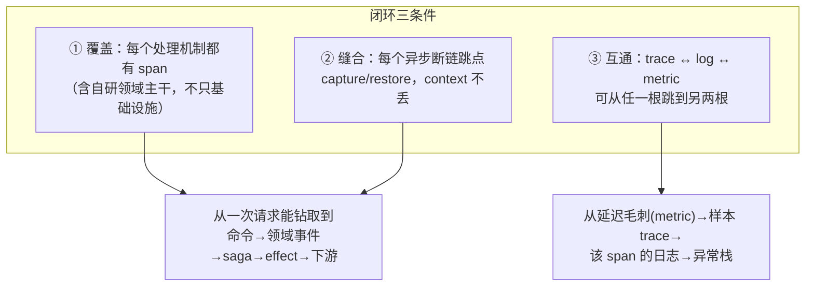
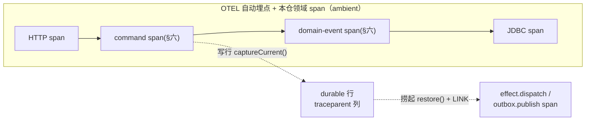
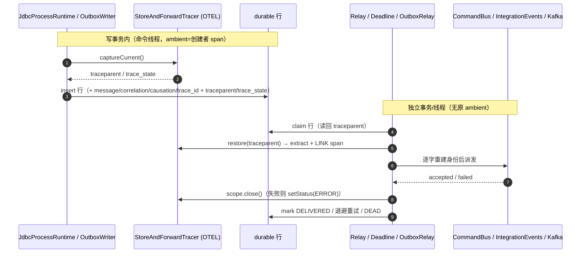
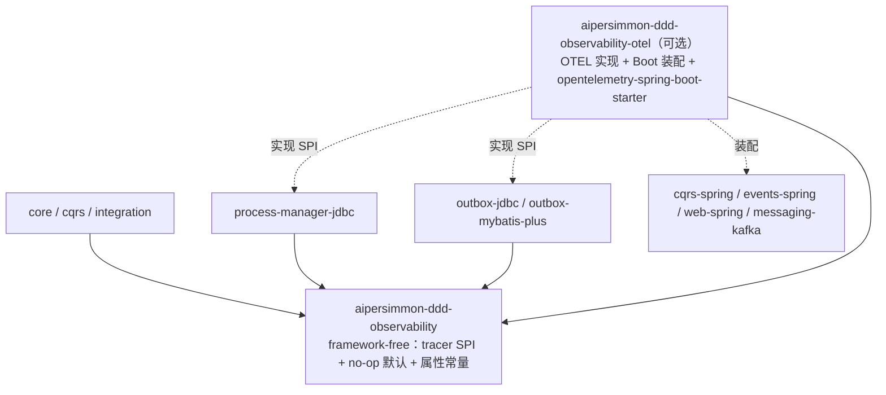

# 可观测性与分布式追踪：Trace / Log / Metric 全链路闭环

本文为 `aipersimmon-ddd` 脚手架定义一套**完整**的可观测性设计：不仅解决"trace 上下文能否跨异步边界复原"，还回答"整条链路是否闭环"——即在**领域主干可见（不只基础设施）**、**每个异步断链跳点被缝合**、**trace / log / metric 三根柱子互相可跳转**这三件事上都做到位。

引子问题是："当前全链路只持久化一个自制 `traceId`，引入 OTEL 后够不够？"结论是远远不够，且缺口不止一处。本文把缺口逐项列清、给出闭环设计，并明确"脚手架自带 / 消费方自接"的边界。

本文承接 [[decision-00013-command-context-and-causation-propagation]]（`CommandContext` / `EventEnvelope` 显式因果传播）、[[design-00004-durable-process-manager-runtime]]（Process Manager 的异步 relay/deadline 与 SLI 指标）、[[design-00003-exception-model]]（异常模型，本文的 span 错误语义与之对齐），并回收 [[issue-00025-correlation-propagation-and-scrape-batching]]（deadline/replay 处的链路断裂）为其 trace 投影。

## 一、结论

1. **只存 `traceId` 无法复原一条 OTEL trace。** 可续接的最小单元是 `SpanContext`（`trace-id + span-id + trace-flags`，+ `tracestate`）；只留 trace-id 会丢父 span 身份与采样决策。**存 W3C 标准序列化 `traceparent`**（+ `tracestate`），用 `TextMapPropagator` 读写，禁止手工拼接。附带纠正：当前 `traceId` 是 `UUID`，并非合法 OTEL trace-id，引入 OTEL 后只能降级为日志锚点。

2. **同步链路的 trace 传播交给 OTEL ambient `Context` + 自动埋点，不手工搬运。** `CommandContext` / `EventEnvelope` **不新增** `traceparent` 字段。

3. **全库异步断链跳点已被穷举——只有两处：Outbox relay 与 Process Manager relay/deadline。** 全库无 `@Async`、无 ExecutorService/CompletableFuture/裸线程；Inbox 是同事务幂等守卫、领域事件/命令/查询/投影全同线程同事务。这两处 durable store-and-forward 用**双向 tracer SPI**（写行 `captureCurrent()`、捞起 `restore()` 起 **Span Link**）缝合，`traceparent` 只显式存在这些 durable 行上。

4. **领域主干必须由脚手架自带 span——这是"完整可追踪"的核心，也是本轮最大补漏。** 自动埋点只认识 HTTP / JDBC / Kafka；`CommandBus`、`QueryBus`、`DomainEvents`、入站 ACL、`ProcessRuntime.start/handle` 决策推进都是自研代码，默认在 trace 里是空洞。脚手架在可选 OTEL 模块里为它们创建 span（挂在既有 `CommandInterceptor` 等 SPI 上）。

5. **闭环 = 三柱互通**：trace ↔ log（每条日志带 `trace_id`/`span_id`，一等而非可选）、trace ↔ metric（[[design-00004-durable-process-manager-runtime]] §5.3 的 SLI 加 **exemplar**）、以及一份 **span 属性目录**（`process.type` / `business_key` / `effect.kind` / `message.id` …）让 trace 可按业务维度查询。

6. **失败必须在 trace 里可见**：handler 异常、codec 失败、effect/deadline 进 `DEAD` → 实例 `SUSPENDED`、revision 冲突重试，都 `setStatus(ERROR)` + `recordException`，与 [[design-00003-exception-model]] 对齐。

7. **层次边界不破坏**：framework-free 契约模块 `aipersimmon-ddd-observability` 只定义 no-op 的 tracer SPI 与属性常量；所有 OTEL 实现（propagator、span 创建、拦截器、MDC、exemplar、`opentelemetry-spring-boot-starter` 装配）集中在可选模块 `aipersimmon-ddd-observability-otel`。`core` / `cqrs` / `process-manager` / `outbox` 均**不依赖 OTEL**；未装配可观测性模块时全链路 no-op、行为与今天完全一致。

## 二、闭环的定义

"可观测性闭环"不是"接了 OTEL"，而是同时满足三个正交条件：



只做到 ② 是"链路连得起来但看不见领域"；只做到 ①② 是"trace 完整但成了孤岛"。三者齐备才叫闭环。§三 用一张矩阵逐格核对本仓现状。

## 三、覆盖面矩阵

下表基于对库代码的实测（sync/async 判定见每行"处理模型"），把每个机制在三条件上的现状与目标列清。**红格即缺口**，对应后续章节。

| 机制 | 处理模型 | context 传播 | span 现状 → 目标 | span 提供方 |
| --- | --- | --- | --- | --- |
| HTTP 入站/出站 | 同步 | ✅ 自动 | 有 → 有 | `opentelemetry-spring-boot-starter` 自动 |
| JDBC | 同步 | ✅ 自动 | 有 → 有 | 自动 |
| Kafka producer/consumer **直发** | 同步（consumer 线程） | ✅ 自动（标准 header extract） | 有 → 有 | 自动 |
| `CommandBus.send` → handler | 同步（`RegistryCommandBus` 内联） | ✅ ambient | ❌ 无 → **✅ 有** | **本仓**：`TracingCommandInterceptor`（§六） |
| `QueryBus.ask` → handler | 同步（**无拦截器链**） | ✅ ambient | ❌ 无 → **✅ 有** | **本仓**：QueryBus 装饰器（§六） |
| `DomainEvents.publish` → handler/`Projection` | 同步、pre-commit、`@EventListener` | ✅ ambient | ❌ 无 → **✅ 有** | **本仓**：`DomainEvents` 装饰（§六） |
| 入站 ACL（`@EventListener EventEnvelope`） | 同步（Kafka 线程内） | ✅ ambient（consumer extract 后） | ❌ 无 → **✅ 有** | **本仓**：ACL span（§六） |
| Inbox（幂等守卫） | 同步、同事务 | ✅ ambient | n/a（无独立步骤） | — |
| `ProcessRuntime.start/handle` 决策推进 | 同步（REQUIRED 事务内） | ✅ ambient | ❌ 无 → **✅ 有** | **本仓**：runtime advance span（§六） |
| **Outbox relay → 发送** | **异步 `@Scheduled`** | ❌ **断链** → capture/restore | ❌ 无 → **✅ link span** | **本仓**：SPI（§五/§七） |
| **PM effect relay / deadline worker** | **异步 `@Scheduled`** | ❌ **断链** → capture/restore | ❌ 无 → **✅ link span** | **本仓**：SPI（§五/§七） |
| Projection（经 outbox 集成事件驱动） | 异步（继承 outbox 跳） | 随 outbox 缝合 | 随 outbox | 同上 |
| trace ↔ log | — | — | ❌ 仅 `traceId`/`correlationId`、无 span-id、无 logback 配置 → **✅ MDC 注入**（§十） | 本仓 |
| trace ↔ metric | — | — | ❌ SLI 无 exemplar → **✅ exemplar**（§十） | 本仓 |
| span 属性目录 | — | — | ❌ 无 → **✅ 目录**（§十） | 本仓 |
| 失败可见性 | — | — | ❌ 无 error 语义 → **✅**（§十一） | 本仓 |

关键读法：**基础设施边界靠自动埋点白拿；自研领域主干（命令/查询/领域事件/ACL/推进）和三柱互通全部是缺口，须由脚手架补齐**。异步缝合只有 outbox + PM 两处，已穷举。

## 四、为什么只存 `traceId` 不够

W3C Trace Context 中可续接的上下文是 `SpanContext`：

| 字段 | 长度 | 作用 | 现状 |
| --- | --- | --- | --- |
| `trace-id` | 16 字节 / 32 hex | 整条链路 ID | 有（但 UUID，格式非法） |
| `span-id` | 8 字节 / 16 hex | **父 span 身份**，续接挂载点 | 缺 |
| `trace-flags` | 1 字节 / 2 hex | 采样位，**决定是否导出** | 缺 |
| `tracestate` | 变长（建议 ≤512 字符） | 跨厂商采样上下文 | 缺 |

`traceparent` 是它的标准 55 字符序列化：

```text
00-4bf92f3577b34da6a3ce929d0e0e4736-00f067aa0ba902b7-01
版本-  trace-id (32 hex)             -span-id (16 hex) -flags(2 hex)
```

存一列 `traceparent` 即补齐三处缺失。缺 `span-id` → 异步重建 span 挂不上父/关联；缺 `trace-flags`（最隐蔽）→ 丢采样位后复原段大概率不导出、链路空洞；缺 `tracestate` → 头部采样跨边界失真。`traceId`（UUID）保留为日志锚点，与 `traceparent` 并存。

## 五、传播模型：同步 ambient，durable 跳手动缝合

**同步链路完全交给 OTEL ambient `Context`**（`io.opentelemetry.context.Context.current()` / `Span.current()`）+ 库级自动埋点。HTTP → 命令 → 领域事件 → 投影 → JDBC → Kafka 直发，当前活跃 span 沿调用栈天然可见。手工把 `traceparent` 塞进 `CommandContext` 会与 ambient 重复，且违背 [[decision-00012-no-ambient-per-command-state]]（此处 ambient 的是 OTEL 基础设施 context，非注入业务上下文的 per-command 状态）。

**durable store-and-forward 是 ambient 唯一穿不过的一跳**：effect/deadline/outbox 行在事务 A（命令线程，ambient 活跃）写入，稍后由 relay/worker 轮询线程在事务 B 捞起——原 context 已消失，且没有任何自动埋点认识你自建的 `process_effect` / `aipersimmon_outbox` 表。这是 OTEL messaging 约定与"outbox 丢 trace 上下文"的标准场景，标准解法：**写行时把 ambient context 序列化进行，捞起时 extract 复原**。全库这样的跳点**只有两处**（outbox relay、PM relay/deadline，§三已穷举）。

为不让 `outbox` / `process-manager-jdbc` 依赖 OTEL，用 framework-free 的**双向** tracer SPI（默认 no-op，OTEL 实现在可选模块）：

```java
// aipersimmon-ddd-observability（framework-free 契约，no-op 默认实现随之提供）
public interface StoreAndForwardTracer {

    // 写侧：在写 durable 行的线程里捕获当前 ambient context（OTEL 实现：inject(Context.current())）
    Captured captureCurrent();
    record Captured(String traceparent, String traceState) {}

    // 读侧：捞起后以存的 traceparent 起一个 LINK 回创建者 span 的作用域，派发期间活跃、结束时关闭
    Scope restore(String traceparent, String traceState, String workItemId);
    interface Scope extends AutoCloseable { @Override void close(); }
}
```

- **写侧**：`JdbcProcessRuntime` 写 effect/deadline/transition 前、`OutboxWriter`（jdbc 与 **mybatis-plus** 两个实现）写 outbox 行前调用 `captureCurrent()`，把不透明串存进新列——**不经 `CommandContext`**，直接读命令线程 ambient。
- **读侧**：PM relay/deadline worker、`OutboxRelay`（两实现）捞起后 `restore(...)` 起 link span 再派发。
- 两侧都只搬运不透明字符串；未装配 OTEL 时 no-op。



## 六、领域主干埋点（脚手架自带）

自动埋点看不见自研主干；脚手架在可选 OTEL 模块里为它们创建 span，全部挂在**既有 SPI**上、对着原生 OTEL API 写（§十四 选型保证 Span 一等）：

| 主干 | 挂载点 | span 名（示意） | 关键属性 |
| --- | --- | --- | --- |
| 命令 | 新增 `TracingCommandInterceptor`（`CommandInterceptor`，置于链最外层，`LoggingCommandInterceptor` 之侧） | `command <CommandType>` | `command.type`、`message.id`、`correlation.id`、`causation.id` |
| 查询 | `QueryBus` 装饰器（QueryBus **无拦截器链**，须单独包一层） | `query <QueryType>` | `query.type` |
| 领域事件 | `DomainEvents` 装饰 + 每 handler 一 span | `domain-event <EventType>` → `handler <Handler>` | `event.type`、`projection`（若是读模型） |
| 入站 ACL | 入站 `@EventListener EventEnvelope` 包一层 | `acl <EventType>` | `messaging.system`、`event.type`、`correlation.id` |
| 推进 | `JdbcProcessRuntime.start/handle` 内经抽象 `Tracer` SPI（保持 jdbc 模块 OTEL-free） | `process.advance <ProcessType>` | `process.type`、`business_key`、`definition_version`、`decision_code`、`from/to.step` |

要点：`TracingCommandInterceptor` 等实现位于 OTEL 模块、可直接用 OTEL API；只有必须保持 OTEL-free 的 `process-manager-jdbc`（推进 span）与 `outbox`（§五）经抽象 SPI。装饰/拦截均在 ambient 上开子 span，天然串进 §五 的同步链路。

## 七、异步复原语义：Span Link 优先于 parent-child

outbox / PM 的复原跳属于"**大时间间隔 + 可能扇出**"（一次决策产出多 effect），OTEL 语义约定推荐 **Span Link** 而非 parent-child：parent-child 会把创建者 span 拉长到覆盖稍后的派发、污染时延统计且扇出时层级失真；link 保留因果、各 span 独立可统计。



一并回收 [[issue-00025-correlation-propagation-and-scrape-batching]] 第 1 条：deadline 触发 / parked 重放处，`correlation_id`（业务）与 `traceparent`（可观测）同批贯穿到 deadline/transition 行。

## 八、载体传播

| 载体 | 谁负责 | 说明 |
| --- | --- | --- |
| HTTP 入站/出站 | **OTEL 自动** | server/client span、`traceparent` header 自动 extract/inject；`TraceIdFilter` 退居纯 `X-Trace-Id`/MDC 供人类关联 |
| Kafka 直发 | **OTEL 自动** | 自动注入/抽取标准 `traceparent`，取代自制 `ce_traceid`（保留一版灰度） |
| **Outbox → Kafka** | **手动 capture/restore** | producer 自动埋点会注入 dispatcher 线程 context（错误 span）；须写行存 `traceparent`、发送前 `restore()` |
| **PM effect/deadline** | **手动 capture/restore** | 同上（§五/§七） |

HTTP/Kafka 直发零代码；手动只在两处 durable 跳。

## 九、Schema 改造

durable 载体（PM 三表 + 两套 outbox 表）新增两列，与既有 `trace_id` 并列：

```sql
traceparent VARCHAR(55)    -- 固定长度，可空
trace_state VARCHAR(512)   -- 可选，可空
```

| 表 | 现有 | 新增 |
| --- | --- | --- |
| `aipersimmon_process_transition` / `_effect` / `_deadline` | `trace_id VARCHAR(128)` | `traceparent VARCHAR(55)`, `trace_state VARCHAR(512)` |
| `aipersimmon_outbox` / `aipersimmon_dead_letter`（jdbc **与** mybatis-plus 两套） | `trace_id VARCHAR(128)` | 同上 |

`process_instance` 不加列（快照，非因果边界）；这些列无索引（不参与 claim 谓词）。

> **DDL 同步警示**：PM 四表 DDL 跨 7 文件重复（生产 `{h2,mysql,postgresql}` + 测试副本 + scaffold 消费方副本，见 [[process-manager-schema-copies]]），**加上** `outbox-jdbc` 与 `outbox-mybatis-plus` 各自的 schema——所有副本须一并改；MySQL 内联 `KEY` vs PG/H2 `CREATE INDEX`；相关模块在同一 reactor 里构建验证。

## 十、三柱闭环

### 10.1 trace ↔ log（当前完全缺失）

全库**无 logback 配置**，MDC 仅 `traceId`（UUID，`TraceIdFilter` 写）与 `correlationId`（`LoggingCommandInterceptor` 写）；`RegistryCommandBus`/`ProblemDetailFactory` 只读 `traceId`。**没有 `span_id`**。闭环要求每条日志可跳 trace：

- **由 starter 交付**：`opentelemetry-spring-boot-starter` 传递依赖已带 `opentelemetry-logback-mdc-1.0`，span 活跃时自动把 `trace_id`/`span_id`/`trace_flags`（32/16 hex 真值，非 UUID）注入日志事件的 MDC——无需库代码；
- 与既有 `correlationId` 并存（业务关联仍有用）；`traceId`（UUID）作为兼容锚点保留、可后续以 `trace_id` 收敛；
- 库不强加 logback 配置文件，消费方在自己的 logback pattern 里引用 `%mdc{trace_id}`/`%mdc{span_id}` 即可。

### 10.2 trace ↔ metric（exemplar）

[[design-00004-durable-process-manager-runtime]] §5.3 已定 SLI（`oldest_pending_effect_age`、`dead_effects`、`suspended_instances`、`claim_latency`、`dispatch_latency`、`advance_conflict_retries` …）。闭环缺的是 **exemplar**——把 `trace_id` 附到指标数据点，从延迟毛刺一键跳到样本 trace。**由 starter 交付**：`opentelemetry-spring-boot-starter` 传递依赖带 `opentelemetry-micrometer-1.5`，把 Micrometer 指标桥接到 OTLP；只要指标在 span 内记录（如 `dispatch_latency` 在 `effect.dispatch` span 内），exemplar 自动附上 `trace_id`。消费方选支持 exemplar 的后端（OTLP → Prometheus/Tempo）即可。

### 10.3 span 属性目录（语义约定）

无属性目录 → trace 存在但按业务维度查不动。定义一份稳定目录（常量置于 `aipersimmon-ddd-observability`），并对齐 OTEL `messaging.*`：

| 维度 | 属性键 |
| --- | --- |
| 消息身份 | `message.id`、`correlation.id`、`causation.id` |
| 命令/查询 | `command.type`、`query.type` |
| 流程 | `process.type`、`process.business_key`、`process.definition_version`、`process.instance_id`、`decision_code`、`lifecycle`、`step` |
| effect/deadline | `effect.kind`、`effect.index`、`deadline.name`、`retry.attempt`、`retry.max` |
| 消息传输 | `messaging.system`、`messaging.destination`、`messaging.operation` |

业务 payload **绝不**进属性（承接 [[decision-00013-command-context-and-causation-propagation]] 元数据在 payload 之外，及敏感字段脱敏）。

## 十一、失败与错误可见性

对齐 [[design-00003-exception-model]]，失败必须落在 span 上：

- 命令 handler 抛异常 / 校验失败 → 命令 span `setStatus(ERROR)` + `recordException`；`ConcurrencyTranslationCommandInterceptor` 翻译后的并发冲突亦然。
- codec 编解码失败 → 推进 / 派发 span 记录异常。
- effect/deadline 达 max-attempts 进 `DEAD` → 实例 `SUSPENDED`：派发 span `ERROR`，并在实例上打 span event `process.suspended`（带 `suspensionSource`、`suspendingWorkId`）。
- revision 冲突重试 → 推进 span 记 `retry.attempt` 计数（对应 SLI `advance_conflict_retries`）。
- 运维 `redrive`/`cancel`（`JdbcProcessOperations`）→ 独立 span，带 `operator`、`reason`，link 回原 effect/deadline span。

## 十二、采样策略

- **头部采样决策必须跨异步保住**：`traceparent` 已携带 `sampled` 位（§四），复原端 `restore()` 尊重之——已覆盖。
- **重试放大**：单 effect 最多 12 次退避尝试（[[design-00004-durable-process-manager-runtime]] §5.4）会放大 span 量；建议 collector 侧 **tail-based sampling**：全留 error/`DEAD`/`SUSPENDED` trace，对成功重试降采样。
- 采样率/尾采样规则属于部署配置，脚手架给默认建议与 collector 配置示例，不硬编码。

## 十三、Baggage（可选增强）

把 `process.business_key` / 租户等作为 OTEL **baggage** 传播，使跨服务下游 span/log 无需重读即可携带业务维度。属锦上添花，默认关闭；开启时注意 baggage 会进所有下游 header，勿放敏感/大字段。

## 十四、SDK 选型

前提：**自动埋点优先**（边界零代码）+ §六/§七 需 **Span Link 一等**。据此：

| 方案 | 边界自动埋点 | Span Link | 与本仓 ethos |
| --- | --- | --- | --- |
| **`opentelemetry-spring-boot-starter`**（推荐） | ✅ MVC/WebFlux/RestClient/JDBC/Kafka | ✅ 原生 API 一等 | ✅ 无字节码 agent、显式装配 |
| Micrometer Tracing 桥接 | ✅ 经 Boot Observation | ⚠️ 需下钻底层 OTEL 才能 `addLink` | ⚠️ 多一层隐式装配 |
| OTEL Java agent | ✅ 最广 | ✅ | ❌ 字节码 magic，本仓回避 |

**推荐 `opentelemetry-spring-boot-starter`**：Spring 自动埋点（非 agent）+ 原生 OTEL API（`addLink` 一等）两全，正中"不为可恢复牺牲自动埋点"。仅当全司已统一 Observation 生态时改走 Micrometer 桥接（relay 处下钻加 link）。

## 十五、模块与装配边界



- **`aipersimmon-ddd-observability`**（framework-free 契约）：`StoreAndForwardTracer`、领域 span 用的抽象 `Tracer`/`SpanScope`、属性键常量。全部有 no-op 默认，不依赖 OTEL/Spring。
- **`aipersimmon-ddd-observability-otel`**（可选）：以 `opentelemetry-spring-boot-starter` 为基，提供 SPI 的 OTEL 实现、`TracingCommandInterceptor`、`DomainEvents`/`QueryBus`/ACL 装饰、MDC bridge、exemplar 装配、propagator 配置；全部 `@ConditionalOn...`，消费方可覆盖。
- `core` / `cqrs` / `process-manager` / `outbox` 只依赖 framework-free 契约模块，**绝不依赖 OTEL**。
- **未装配 `observability-otel` 时**：SPI 走 no-op、无 span、无 MDC 注入、无 exemplar，行为与今天逐字一致——可观测性是纯增量、可整体开关的能力。

## 十六、分阶段落地

1. **契约模块 + 列（无行为变化）**：建 `aipersimmon-ddd-observability`（SPI + no-op + 属性常量）；PM 三表 + 两套 outbox 表加 `traceparent`/`trace_state` 列（DDL 全副本，§九）。**不动 `CommandContext`/`EventEnvelope`**。全绿即合入，行为不变。
2. **边界自动埋点 + 领域主干 span**：建 `aipersimmon-ddd-observability-otel`，接 `opentelemetry-spring-boot-starter`（边界白拿）；上 `TracingCommandInterceptor` 及 Query/DomainEvent/ACL/推进 span（§六）。此时同步全链路可见。
3. **durable 跳缝合**：outbox（两实现）+ PM 写行 `captureCurrent()`、捞起 `restore()` link（§五/§七）；回收 [[issue-00025-correlation-propagation-and-scrape-batching]] correlation 断裂。
4. **三柱闭环**：MDC 注入 `trace_id`/`span_id`（§10.1）、SLI 加 exemplar（§10.2）、落实属性目录（§10.3）、错误语义（§十一）。
5. **收敛（可选）**：日志/错误体以真 `trace_id` 逐步替换 UUID `traceId`；按需开 baggage、配 tail sampling。

各阶段增量、可独立回滚；OTEL 未装配时全程 no-op。

## 十七、非目标与边界

- 不改 `process_instance` 增 trace 列；不把 trace/traceparent 用于任何 claim/去重谓词（`message_id` 幂等、`correlation_id` 业务关联职责不变）。
- 不把 `traceparent` 或业务 payload 写进 span 属性以外的地方；元数据不进 payload（[[decision-00013-command-context-and-causation-propagation]]）。
- 不在 `core`/`cqrs`/`process-manager`/`outbox` 引入 OTEL 硬依赖；OTEL 只落可选模块。
- 不强加 logback 配置文件 / 采样率 / collector 部署——这些是消费方部署配置，脚手架给约定、默认建议与示例。
- 不替代业务指标看板设计；SLI 清单以 [[design-00004-durable-process-manager-runtime]] §5.3 为准，本文只补 exemplar 这条 trace↔metric 边。

## Sources

内部：

- [[decision-00013-command-context-and-causation-propagation]] —— `CommandContext`/`EventEnvelope`/`OutboxMessage` 因果传播；元数据在 payload 之外。
- [[design-00004-durable-process-manager-runtime]] §3.5 / §4.4 / §4.6 / §4.7 / §5.3 —— 异步 relay/deadline、身份重建、SLI 指标。
- [[design-00003-exception-model]] —— span 错误语义对齐的异常模型。
- [[decision-00012-no-ambient-per-command-state]] —— 禁 ambient 业务状态（区别于 OTEL 基础设施 context）。
- [[issue-00025-correlation-propagation-and-scrape-batching]] —— deadline/replay 处的链路断裂（本文覆盖其 trace 投影）。
- [[process-manager-schema-copies]] —— DDL 多副本同步约束。
- 代码：`aipersimmon-ddd-cqrs`（`CommandContext`、`CommandBus`、`QueryBus`、`CommandInterceptor`）、`aipersimmon-ddd-cqrs-spring`（`RegistryCommandBus`、`LoggingCommandInterceptor` 等）、`aipersimmon-ddd-application`（`Inbox`、`DomainEvents`）、`aipersimmon-ddd-events-spring`（`SpringDomainEvents`）、`aipersimmon-ddd-web-spring`（`TraceIdFilter`、`ProblemDetailFactory`）、`aipersimmon-ddd-messaging-kafka`（`KafkaIntegrationEventListener`、`IntegrationEventHeaders`）、`aipersimmon-ddd-outbox-jdbc` / `-mybatis-plus`（`OutboxRelay`、`OutboxWriter`）、`aipersimmon-ddd-process-manager-jdbc`（`JdbcProcessRuntime`、store/relay/deadline/operations）。

外部：

- W3C Trace Context —— `traceparent` / `tracestate`。https://www.w3.org/TR/trace-context/
- OpenTelemetry —— `SpanContext`、`TextMapPropagator`、Span Links、Messaging semantic conventions、Baggage、Exemplars、Sampling。https://opentelemetry.io/docs/
- OpenTelemetry Java —— `opentelemetry-spring-boot-starter`（zero-code Spring 自动埋点，非 Java agent）。https://opentelemetry.io/docs/zero-code/java/spring-boot-starter/
