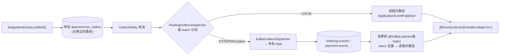

# 集成事件路由：进程内默认 + 逐事件选择性外发到命名 topic

把集成事件的传输从"应用级全局单选"细化到"**逐事件**"：默认走进程内 outbox+inbox，只有**显式标注**要外发的事件才
路由到**命名 Kafka topic**；未外发的事件永不碰 broker。承接并修正 [[decision-00006-integration-event-transport-selection]]
（三传输、单 dispatcher 全局），由 [[issue-00028-broker-transport-on-single-deployable-monolith]] 与
[[issue-00030-single-topic-fanout-all-consumers-see-all-events]] 驱动。

## 一、结论先行

> **默认进程内（方式二 outbox+inbox）；用 `@Externalized`-式的逐事件 opt-in 把特定事件外发到命名 topic
> （外发严格 opt-in，未标注者只在进程内，无静默全外发）；二者在同一应用内并存，由一个
> `RoutingOutboxDispatcher` 按事件分流；inbox 统一去重。业务代码只调 `IntegrationEvents.publish()`，全程不感知。**

推论：
- 单体里跨 BC 事件默认**不进 broker**（与所有参考实现一致，见 §三）。
- 对接一个外部微服务时，**只把那几个跨进程的事件**标注为外发，其余留进程内——不再"全有或全无"。
- 拆分就绪靠**数据/契约隔离**（每 BC 独立 schema、只依赖对方事件契约），**不是**预先把所有事件铺上 Kafka。

## 二、问题（现状）

`decision-00006` 的三传输由**单个全局 `OutboxDispatcher` bean** 决定（`@ConditionalOnMissingBean`，三选一互斥）。
后果（现网已核实）：

- 一旦引入 `messaging-kafka`，`KafkaOutboxDispatcher` 成为唯一 dispatcher → **每一条**集成事件都上 Kafka，
  含纯本地跨 BC 的（`issue-00028`）。
- 只有**一条 topic** `aipersimmon.integration-events`，统一发送、统一订阅、消费桥全量进程内重投 → 每个消费者
  收到所有类型；外部方连上即见全部内部事件（`issue-00030`）。
- 想混合只能自写 composite dispatcher，且入站桥要配合避免双投——非开箱。作为**脚手架**，这把"从全本地 →
  部分外发"的升级路径堵死了。

## 三、现有实践佐证（docs/reference）

| 参考 | 跨 BC 默认 | broker | 选择性外发 |
| --- | --- | --- | --- |
| modular-monolith-with-ddd（Grzybek） | 进程内 outbox+inbox | 无 | 拆分靠每模块独立 schema + 窄门面 |
| spring-modulith-with-ddd（最贴目标栈） | 进程内事件登记表（JPA，outbox 式） | 无（默认） | **`@Externalized` 逐事件**外发到命名 target |
| Axon | 按消息类型寻址，location transparency | 可选 Axon Server | 平台负责，不硬编码 |
| ddd-by-examples/library | 进程内 store-and-forward publisher（可换） | 无 | publisher 可插拔 |

**共识**：进程内默认 + 选择性逐事件外发 + 拆分靠数据/契约隔离。aipersimmon 现状（全局单传输 + 单 topic 火龙）
是这批里的异类。本设计据此对齐 Spring Modulith 的成熟形态。

## 四、设计

### 4.1 路由模型

每个 `IntegrationEvent` 有一个 **reach**：
- **LOCAL**（默认）：仅进程内投递。
- **EXTERNAL(topic)**（opt-in）：外发到指定命名 topic；本地消费者（若有）经消费桥读回。

reach 由**事件上的注解**声明（Spring Modulith `@Externalized` 先例），topic 名可 `${property}` 解析：

```java
@EventType(name = "com.example.ordering.OrderPlaced", version = 1)
@Externalized("ordering.events")     // 缺省该注解 = LOCAL
public record OrderPlaced(...) implements IntegrationEvent { ... }
```

保持 `@EventType` 为**纯逻辑契约**（decision-00014 的克制），外发是**独立**注解——传输/部署关注点不污染契约身份。

### 4.2 出站：单 outbox + `RoutingOutboxDispatcher`

关键机制改动：relay 仍只注入**一个** `OutboxDispatcher`，但它是 `RoutingOutboxDispatcher`——内部同时持有
进程内腿与 Kafka 腿，按 reach 分流：



- **单张 outbox 表**：原子性/顺序不变（前提是聚合与 outbox 同库同事务，见 §八与 [[issue-00027-outbox-atomicity-broken-by-in-memory-aggregate]]）。
- 分区 key 仍 = 聚合 `subject`（per-aggregate 保序，decision-00014 不变）。

### 4.3 入站：避免双投

- 消费桥**只订阅被外发的 topic**（按声明集合），inbox 去重后进程内重投。
- **双投规避（核心不变量）**：LOCAL 事件**永不进 broker**；EXTERNAL 事件的本地投递**只经消费桥这一条**（router 的
  EXTERNAL 腿不再额外进程内直投）。于是每个事件对本地 `@EventListener` **恰好一条**投递路径，inbox 只需守桥这一路。
- "既有本地又有远程消费者"的事件坍缩为 EXTERNAL：本地也从 broker 读回，一致的一次投递。

### 4.4 多 topic

EXTERNAL 事件按 `@Externalized` 的 target 映射到**每类/每上下文命名 topic**；外部方按需订阅；DLT 为 `<topic>.DLT`。
替代今天的单 topic 火龙。

## 五、兼容与 monolith-first 默认

| 装配 | 行为 |
| --- | --- |
| 无 `messaging-kafka` | 全 LOCAL（方式二 outbox+inbox）——参考实现的默认 |
| 有 `messaging-kafka` + 有 `@Externalized` 标注 | 混合：标注者外发到其 topic，其余 LOCAL |
| 有 `messaging-kafka` + 无任何标注 | **全 LOCAL**（外发严格 opt-in）：Kafka 装配存在但闲置，直到有事件被标注。若检测到"装了 kafka 却零外发事件"，启动打一条 WARN（多半是漏标），但**不**静默全外发、也不 fail 启动 |

**决策（D3=显式）**：不再有"装了 kafka 就默默全上 broker"的旧行为——任何事件进 broker 都必须显式 `@Externalized`。

**迁移后果**：现有 `multi-module`（[[plan-00006-middleware-integration]]）目前靠"单 topic 全外发"跑 Kafka;本设计实现后,
其真正需要跨进程的跨 BC 事件须补 `@Externalized`,否则退回全进程内。记为 plan-00006 之后的一次性小迁移(见 §八实现顺序)。

升级路径：把某事件从 LOCAL 提升为 EXTERNAL = **加一个 `@Externalized` 注解 + 配 topic 名**，业务代码与 handler 不动——
正是 decision-00006 "换传输不改代码"红利，从应用级细化到事件级。

## 六、落地层次（可分步）

- **Level 1（低风险）**：多 topic，但仍 broker-for-all（不引入 LOCAL 腿）。解决暴露面/选择性订阅；本地事件仍绕
  broker（不解 issue-00028 的往返）。无双投风险，改动集中在出站 topic 路由 + 入站多 topic 订阅。
- **Level 2（完整）**：本设计全貌（LOCAL vs EXTERNAL）。另解本地零往返 + 内部事件不出进程。

**决策（D2=Level 2）**：脚手架目标 **Level 2**（进程内默认 + opt-in 外发，对齐参考实现）。Level 1 仅作为"要更快落一版"时的可选过渡，不是终态。

## 七、非目标

- 不改 `IntegrationEvents` port API；不引入事件溯源。
- 不做比 topic 更细的 per-consumer 路由。
- Process Manager / saga 与本设计**正交**（编排在传输之上，decision-00006 末段）——不受影响。

## 八、前置依赖与实现顺序

**决策（D4=认）**：outbox（LOCAL 或 EXTERNAL 皆然）的"同事务原子"以**聚合与 outbox 同库同事务**为**硬前提**。当前多模块
聚合在内存（[[issue-00027-outbox-atomicity-broken-by-in-memory-aggregate]]），故：

- 路由**机制**（`@Externalized`、`RoutingOutboxDispatcher`、多 topic、入站选择性）可先独立实现；
- 但本设计的**可靠性论述**（同事务原子的 outbox）在 **plan-00007（聚合落 PG）** 落地前不成立，届时之前不对外宣称 outbox 可靠性；
- 实现次序建议：plan-00007（聚合落 PG）→ 本设计的路由机制 → 给 `multi-module` 跨进程事件补 `@Externalized`（§五迁移后果）。

## 九、已定决策

四项决策已定（2026-07-20）：

- **D1 = 注解**：外发身份用事件上的 `@Externalized`-式注解声明（Spring Modulith 先例、少 stringly-typed 漂移、与 `@EventType` 同层）；
  **topic 名**用 `${property}` 解析,把部署细节留在配置。即"要不要外发"是契约级事实、"发去哪"是部署细节。
- **D2 = Level 2**：脚手架终态为"进程内默认 + opt-in 外发";Level 1 仅可选过渡。
- **D3 = 显式**：外发严格 opt-in;装了 kafka 但无标注 → 全 LOCAL（Kafka 闲置 + WARN），无静默全外发;现有 `multi-module` 须补 `@Externalized`（一次性迁移）。
- **D4 = 认**：plan-00007（聚合落 PG）为本设计可靠性的硬前提,见 §八实现顺序。

## Sources

内部：
- [[plan-00008-integration-event-routing-implementation]]（本设计的落地：库机制 + multi-module 全绿；microservice/样例迁移因既有 decision-00013/00014 债 revert，另立后续）
- [[decision-00006-integration-event-transport-selection]]（三传输、单 dispatcher；本设计细化其粒度）
- [[decision-00014-cloudevents-integration-event-contract]]（`@EventType`、subject=key、ce_ 头；§7 topic 路由留作扩展点）
- [[issue-00028-broker-transport-on-single-deployable-monolith]]、[[issue-00030-single-topic-fanout-all-consumers-see-all-events]]（驱动）
- [[issue-00027-outbox-atomicity-broken-by-in-memory-aggregate]]（前置）、[[plan-00006-middleware-integration]]（现场）
- reference：`modular-monolith-with-ddd`、`spring-modulith-with-ddd`、`axon-framework`、`ddd-by-examples-library`

外部：
- Spring Modulith — Externalizing events（`@Externalized("target::key")`，选择性外发到 Kafka/AMQP/JMS）。https://docs.spring.io/spring-modulith/reference/events.html
- CloudEvents v1.0 Kafka Protocol Binding（binary content mode、partitionkey→消息 key）。https://github.com/cloudevents/spec/blob/v1.0.2/cloudevents/bindings/kafka-protocol-binding.md
- microservices.io — Transactional outbox / Idempotent consumer。https://microservices.io/patterns/data/transactional-outbox.html
