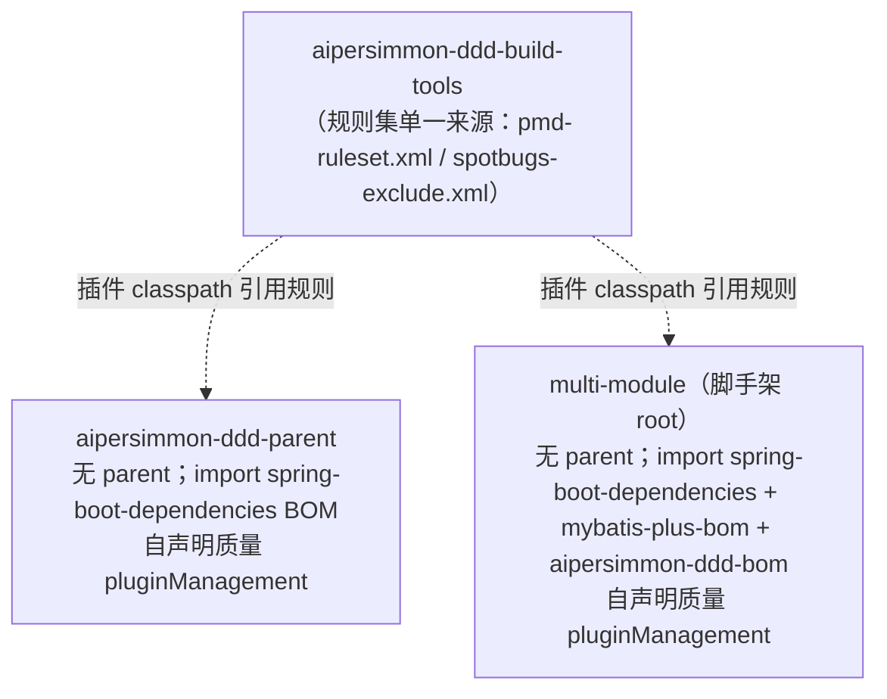

# 代码质量管控：domain 层强制 90% 单元覆盖 + 90% 变异门禁，无 opinionated parent（纯 BOM + 各项目自声明）

把质量门禁从"文档声明、无人执行"变成"构建强制"。核心目标：**任何从本脚手架生成的项目，其 domain 层都强制满足
单元测试覆盖率 ≥90% 且变异测试（PIT）≥90%**；其余工具（格式、架构、静态分析）按各自合适的作用域接入。承接
[[TESTING.md]] 已声明但未执行的 90% 覆盖率 DoD 与 [[DEVELOPMENT.md]] 尚为占位符的 `Lint` 命令。

## 一、结论先行

> **domain 层双门禁（行/分支/方法覆盖 ≥90% via JaCoCo + 变异 ≥90% via PIT），只作用于领域层**：库 pure tier
> （core/application/integration/cqrs）已落地；脚手架 `*-domain` 由 archetype 默认烘焙 opt-in + CI 强制。
> **全仓库不继承任何 opinionated parent（尤其 `spring-boot-starter-parent`）——版本一律 BOM 导入
> （`spring-boot-dependencies` + `aipersimmon-ddd-bom`）。** 质量插件的 `pluginManagement` 无法经 BOM 共享，故由
> **每个可构建项目各自声明**（库 `aipersimmon-ddd-parent` 已声明；脚手架 root 各自声明），共享的只有
> `aipersimmon-ddd-build-tools` 里的规则集。
> **格式门禁 Spotless(google-java-format) 全仓库；ArchUnit 保留；PMD/CPD + SpotBugs 先 report 后 gate。不引入
> SonarQube、不引入 Checkstyle。** 另建 test-support（Testcontainers 单例复用）testkit 模块。

> **纠正记录（2026-07-21）**：本设计初版曾引入一个 provider parent `aipersimmon-ddd-build`（且 `extends
> spring-boot-starter-parent`）来"沿父链下发门禁"。该做法违背仓库"框架无关、绝不继承 opinionated parent、版本靠
> BOM"的立身原则，已**废弃并删除**该模块。取而代之：无任何 provider/父级下发，pluginManagement 各项目自声明。见 §四、§十 D1。

作用域一览：

| 门禁 | 作用域 | 阶段 | 强制点 |
| --- | --- | --- | --- |
| 单元覆盖 90%（行/分支/方法） | **仅 domain 层** | JaCoCo `check` @ `verify` | 各项目 root 自声明 + archetype 默认 + CI |
| 变异 90% | **仅 domain 层** | PIT `mutationCoverage` @ `verify` | 同上 |
| 代码格式（Google Style） | 全仓库所有模块 | Spotless `check` @ `verify` | 各 reactor root 自声明 |
| 架构分层/边界 | 有分层的模块 | ArchUnit `@ArchTest` @ `test` | 已有 `aipersimmon-ddd-archunit`（不动） |
| 复杂度 + 重复 | 全仓库 | PMD/CPD `check` @ `verify` | 先 report-only → ratchet |
| 字节码缺陷 | 全仓库 | SpotBugs `check` @ `verify` | 先 report-only → gate |

## 二、目标与非目标

**目标**
- domain 层的单元覆盖与变异门禁对**所有脚手架生成项目**默认生效、可强制、单一来源（改阈值/版本只动一处）。
- 全仓库统一 Google Java Style 格式门禁。
- 复杂度、重复、字节码缺陷有可版本化、无需服务器的检查。
- 测试基建可复用：Testcontainers 单例容器 + reuse，收敛现有重复。

**非目标**
- 不引入 **SonarQube**（需要服务器，违背模板"自包含/离线可跑"）。真需要趋势/PR 看板时再上，届时仍靠 JaCoCo 出报告导入。
- 不引入 **Checkstyle**：`CODE_STYLE.md` 刻意轻量，格式一致性交给 Spotless 的确定性格式化，避免规则唠叨与 Spotless 打架。
- 不对 starter/adapter/infrastructure/wiring 层强制 90% 覆盖或变异——见 §三理由。
- 不改任何业务/领域代码行为；本设计只加构建期门禁与一个测试支撑模块。

## 三、为什么覆盖率与变异只强制 domain 层

**变异测试（PIT）在纯领域逻辑上才划算，在框架层是负收益。**

- PIT 通过修改字节码（取反条件、改边界、删语句等）再跑测试，看测试是否"杀死"变异体。它要求被测代码
  **快、确定、无外部依赖**——正是 domain 层的天然属性（`ordering-domain` 仅依赖框架无关的
  `aipersimmon-ddd-core`，见 [[design-00001-aipersimmon-ddd-and-scaffold]] 的分层约束）。
- 在 adapter/infrastructure/starter/auto-configuration 层跑 PIT：需拉起 Spring 上下文/Testcontainers，单次变异
  重跑成本极高、结果易受环境抖动影响，信噪比差。这些层的价值在 ArchUnit（结构正确）与集成测试（真实边界正确），
  不在变异分数。
- 同理，**90% 行/分支/方法覆盖**强制在 domain 才有意义：wiring 层的分支（`@ConditionalOnMissingBean` 组合等）
  难以也不值得逐条覆盖。库内多个 auto-configuration 模块若被强制 90% 分支，会立刻炸构建。

一句话：**domain 层是业务逻辑与不变量所在，值得最高、最贵的质量投入；框架接线层用架构测试 + 集成测试守正确性。**

## 四、交付机制：无 provider parent，pluginManagement 各项目自声明

### 4.1 原则：不继承 opinionated parent，版本一律 BOM

仓库立身之本：**任何可构建工程都不 `<parent>` 到 `spring-boot-starter-parent`（或任何 opinionated parent），版本管理
一律靠 BOM `import`。** 库 `aipersimmon-ddd-parent` 一直如此（刻意不继承 spring-boot-parent，只 import
`spring-boot-dependencies`）；脚手架 `multi-module` 也**去掉 parent**，改为 import
`spring-boot-dependencies` + `mybatis-plus-bom` + `aipersimmon-ddd-bom`，并显式补齐 Spring Boot parent 原本提供的少数
构建设置（`maven.compiler.release`、`-parameters`、UTF-8、`spring-boot-maven-plugin` 的 `repackage` 绑定）。

> 子模块仍以各自 **reactor root** 为 `<parent>`（库模块 → `aipersimmon-ddd-parent`；脚手架模块 → `multi-module`）。
> 这是 reactor 聚合/继承，不是 opinionated parent，保留不动。

### 4.2 约束与取舍：pluginManagement 只能各项目自声明

- **BOM 只共享 `dependencyManagement`（依赖版本），共享不了 `build/pluginManagement`（插件配置）。** 插件配置的复用
  只能靠 parent 继承。
- 但在"不继承任何 opinionated parent"的原则下，不能为了共享插件配置去引一个 parent：那个 parent 要么继承
  spring-boot-parent（违背原则），要么成为脚手架唯一的 opinionated parent（同样被否）。
- **结论**：不做任何 provider/父级下发。质量插件的版本+配置由**每个可构建工程各自声明**——库 `aipersimmon-ddd-parent`
  的 `pluginManagement` 一份；每个脚手架 root 一份。接受这点"块级重复"，换取"零 opinionated parent 继承"。



- **抗漂移**：真正易漂的"规则集"（PMD/SpotBugs XML）集中在 `aipersimmon-ddd-build-tools` 一份（§六）；插件版本用属性；
  各 root 的 pluginManagement 块保持一致，由模板 + review 保证。这比"配置散落且无单一规则来源"已大幅收敛。

### 4.3 domain 层如何"只在 domain 生效"且强制

本项目 root（库 → `aipersimmon-ddd-parent`；脚手架 → `multi-module`）的 `pluginManagement` 只提供"版本 + 配置"，不激活。
领域模块用**最小 opt-in（约 5 行）**激活门禁，完整配置与阈值继承自**本 reactor root 的 pluginManagement**：

```xml
<!-- 仅出现在 domain 模块（库 pure tier / 脚手架 *-domain）。JaCoCo/PIT 的完整配置继承自本 reactor root。 -->
<build>
  <plugins>
    <plugin><groupId>org.jacoco</groupId><artifactId>jacoco-maven-plugin</artifactId>
      <!-- check execution + 90% rules 在此声明（库侧已落地，见 aipersimmon-ddd-core 等） --></plugin>
    <plugin><groupId>org.pitest</groupId><artifactId>pitest-maven</artifactId>
      <!-- mutationCoverage@verify --></plugin>
  </plugins>
</build>
```

- 脚手架侧这段由 **archetype 默认烘焙进每个 `*-domain` 模块** → 所有生成项目自带门禁，无需使用者手工加。
- "所有项目都被强制"的真正保证 = **archetype 默认 + CI 跑 `verify`**，不是 Maven 魔法。任何删掉这段的改动会在 CI 暴露。
- **D2 已定：采用上面的显式 opt-in**（最直白、最可靠、archetype 好烘焙）。曾考虑的 marker 文件激活 profile
  （`<activation><file><exists>${basedir}/.ddd-domain</exists></file></activation>`）不采用——显式 5 行更透明、diff 里一眼可见，
  也不依赖 profile 激活的版本行为。

### 4.4 库自身（`aipersimmon-ddd/*`）的处理

库没有单一 domain 模块，其"领域层"是框架无关的 pure tier（core/application/integration/cqrs）。库的 pure-tier 门禁在
`aipersimmon-ddd-parent` 的 `pluginManagement` 里直接定义、由 pure-tier 模块 opt-in 激活（与脚手架同一套机制，只是各自
声明）。规则集**引用同一份 config-artifact（§六）**。**D4 已定：库 pure tier（core/application/integration/cqrs）同步上
90% 覆盖 + 90% 变异**——它是框架无关的领域内核，与脚手架 domain 层同一质量标准，且是"零依赖领域逻辑"最理想的 PIT 目标。
**（已落地，见 P5/P6。）**

## 五、工具矩阵（逐项定位）

| 工具 | 定位 | 版本（提案） | 作用域 | 门禁时机 |
| --- | --- | --- | --- | --- |
| **Spotless** + google-java-format | 确定性格式化（Google Style：2 空格 / 100 列 / Google import 序） | spotless `3.6.0`，gjf `1.35.0` | 全仓库所有模块 | `check` @ `verify`；修复 `mvn spotless:apply` |
| **ArchUnit** | 分层/边界/循环依赖 | 已有 `1.4.0` | 有分层的模块 | 已有 `aipersimmon-ddd-archunit`，**不动**（@ `test`） |
| **PMD** | 认知/圈复杂度、NPath、方法体量、坏味道 | maven-pmd-plugin 最新 | 全仓库 | `check` @ `verify`，先 report-only |
| **CPD** | 复制粘贴/重复块 | 同 PMD 插件 | 全仓库 | `cpd-check` @ `verify`，先 report-only |
| **SpotBugs** | 字节码级潜在缺陷（NPE、资源泄漏、并发、误用 API） | spotbugs-maven-plugin 最新 | 全仓库 | `check` @ `verify`，先 report-only |
| **JaCoCo** | 行/分支/方法覆盖 | jacoco-maven-plugin 最新 | **仅 domain** | `prepare-agent`@`test` + `report`+`check` @ `verify` |
| **PIT** | 变异测试（测试有效性） | pitest-maven + `pitest-junit5-plugin` | **仅 domain** | `mutationCoverage` @ `verify` |

关键门禁配置（写进各 reactor root 的 `pluginManagement`）：

- **JaCoCo `check`**：三条 rule，`LINE` / `BRANCH` / `METHOD` 各 `minimum 0.90`（对应 [[TESTING.md]] 的行/分支/函数三项）。
- **PIT（D3 已定：从严）**：三个阈值同时 ≥90——`<mutationThreshold>90`（变异体被杀比例）、`<testStrengthThreshold>90`
  （测试强度 = 杀死 /（杀死 + 存活），剔除无覆盖变异体，是更能反映"测试真有效"的指标）、`<coverageThreshold>90`（PIT 自测行覆盖）。
  `targetClasses` 默认取模块包名（domain 纯净，PIT 跑得快而稳）。三档齐上，堵住"高覆盖但弱断言"的盲区。

## 六、配置单一来源：config-artifact

PMD ruleset、SpotBugs exclude filter 这类 XML 不能靠 POM 继承在独立 reactor 间共享。沿用 ArchUnit"规则即代码发布模块"
的范式，新增一个极小资源模块 **`aipersimmon-ddd-build-tools`**（只含资源，无 Java）：

```
aipersimmon-ddd-build-tools/src/main/resources/com/aipersimmon/ddd/quality/
├── pmd-ruleset.xml
└── spotbugs-exclude.xml
```

各插件把它挂进**插件自身的 `<dependency>` classpath**，用 classpath 路径引用规则。库与脚手架都指向同一份 XML →
一套规则，两处（库/生成项目）通用。这是 Spring/Apache/Google 的通行做法。Spotless 的 google-java-format 规则由
gjf 内置，无需 config-artifact。

## 七、测试基建：test-support（Testcontainers 单例复用）

现状：Testcontainers 已在 3 个模块（process-manager-jdbc 的 PG、其 starter 的 MySQL、web-store-redis）各写各的
`@Testcontainers`/`@Container`，样板重复、容器每类重启。新增 **`aipersimmon-ddd-test-support`** testkit 模块，与
`aipersimmon-ddd-archunit` 对称——消费者 **test scope** 引入，**绝不进 pure tier 的 main classpath**：

- 单例容器 + `withReuse(true)`（MySQL / Postgres / Kafka / Redis）的 Base 类 / JUnit5 Extension，避免逐类重启，压 CI 时间。
- `@DynamicPropertySource` / `ContextInitializer` 帮手，统一把 datasource/kafka 属性接进 Spring。
- 测试 schema 引导：把当前跨 7 文件重复的 process-manager 四表 DDL（见 [[process-manager-schema-copies]]）在 testkit 集中一份。

克制原则：Testcontainers 官方 `@Testcontainers` + 单例已很地道；testkit 只增值三点——**单例 reuse 提速、属性接线一致、
schema 预置**。薄基类值得，重框架不做。该模块依赖 JUnit/Spring/Testcontainers 是可以的，因为它是可选 test-scope
artifact，不污染框架无关约束。

## 八、CI 与命令接线

- `ci.yml` 库那步 `install` → `verify`（触发 Spotless/PMD/CPD/SpotBugs/JaCoCo/PIT `check`）；脚手架那步 `test` → `verify`。
- 填掉 [[DEVELOPMENT.md]] 的占位 `Lint`：`mvn -B verify`（或分解 `mvn spotless:check pmd:check spotbugs:check`）。
- **Spotless 使用坑（写进 DEVELOPMENT.md）**：提交 Java 前跑**完整** `mvn spotless:apply`，**不要**用 `-DspotlessFiles`
  做范围限定检查——`verify` 阶段的 Spotless 比 `-DspotlessFiles` 的 CLI 检查更严，后者会"假通过"，导致违规代码提交后炸构建。

## 九、分阶段落地（避免一次性炸构建）

已知风险：部分下游脚手架/样例在 HEAD 已是 RED（见 [[downstream-scaffolds-migration-debt]]），且门禁一上会暴露真实覆盖缺口。
故分批：

1. `aipersimmon-ddd-build-tools`（规则集 config-artifact）+ 库 `aipersimmon-ddd-parent` 自声明质量 pluginManagement + Spotless 骨架。
2. **Spotless** 全仓库 `apply` 一次 + 接 `check`（填掉 Lint 占位符）。风险最低、信息量最大，宜作首个 PR。
3. **JaCoCo report-only** 只在 domain 模块跑，拿真实基线。
4. **PMD + CPD** report-only → 阈值调到当前能过 → 逐步收紧。
5. **SpotBugs** report-only → 稳定后 `failOnError`。
6. domain 层 **JaCoCo `check` ratchet 到 90%**（行/分支/方法）并进 CI 门禁。
7. domain 层 **PIT ratchet 到 90%** 并进 CI 门禁。
8. `aipersimmon-ddd-test-support` testkit，把现有 3 处 Testcontainers 重复收敛进去。

## 十、已定决策

四项决策已定（2026-07-21）：

- **D1（修订 2026-07-21）= 无 provider parent，纯 BOM + 各项目自声明**：初版的 provider parent `aipersimmon-ddd-build`
  （`extends spring-boot-starter-parent`）已**废弃删除**——它违背"绝不继承 opinionated parent、版本靠 BOM"的原则。
  改为：全仓库不继承 opinionated parent；版本靠 BOM 导入；质量 `pluginManagement` 由库 `aipersimmon-ddd-parent` 与每个
  脚手架 root 各自声明（块级重复换取零 opinionated 继承），规则集共享自 `aipersimmon-ddd-build-tools`。
- **D2 = 显式 opt-in**：domain 模块用最小 5 行 `<build><plugins>` 激活 JaCoCo+PIT（配置继承自**本 reactor root**），脚手架侧由
  archetype 烘焙；不用 marker 文件激活 profile——显式更透明、diff 可见、不依赖 profile 激活的版本行为。
- **D3 = PIT 从严**：domain 需要非常严格的测试保障质量，PIT 三阈值同时 ≥90——`mutationThreshold` +
  `testStrengthThreshold` + `coverageThreshold`，堵住"高覆盖但弱断言"。
- **D4 = pure tier 同标准**：库 pure tier（core/application/integration/cqrs）与脚手架 domain 层同上 90% 覆盖 + 90% 变异，
  同一质量标准、同一 config-artifact。

## Sources

内部：
- [[TESTING.md]]（已声明 90% 行/分支/函数 DoD，本设计执行之）、[[DEVELOPMENT.md]]（`Lint` 占位符）、[[CODE_STYLE.md]]（Google Style 一致性）
- [[design-00001-aipersimmon-ddd-and-scaffold]]（分层与框架无关约束，domain 仅依赖 core）
- `aipersimmon-ddd-archunit`（"规则即代码发布模块"范式，被本设计的 config-artifact / testkit 复用）
- [[downstream-scaffolds-migration-debt]]、[[process-manager-schema-copies]]（落地风险与去重目标）

外部：
- PIT (pitest) — Maven quickstart / `mutationThreshold`。https://pitest.org/quickstart/maven/
- Maven PMD Plugin（含 CPD check）。https://maven.apache.org/plugins/maven-pmd-plugin/
- SpotBugs Maven Plugin。https://spotbugs.readthedocs.io/en/stable/maven.html
- JaCoCo Maven Plugin（check goal / COUNTER LINE·BRANCH·METHOD）。https://www.jacoco.org/jacoco/trunk/doc/maven.html
- Spotless（google-java-format，GOOGLE 风格默认）。https://github.com/diffplug/spotless/tree/main/plugin-maven
