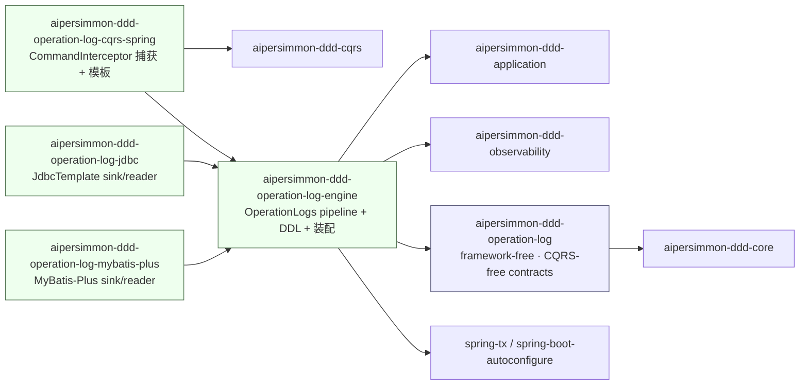
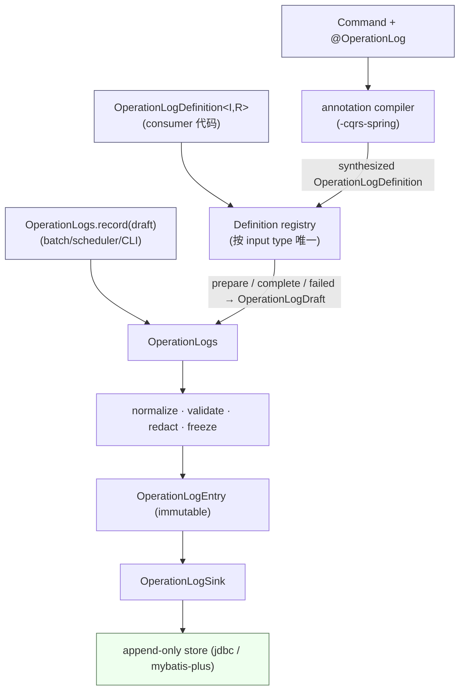

# 通用操作日志组件：framework-free 内核、CQRS/Spring 捕获与 JDBC 存储

本文把 [[analysis-00013-operation-log-component]] 的预研结论落成**可实施的结构设计**：一套面向业务阅读者的
通用操作日志（Operation Log）构件，以 **clean-slate** 方式在 `aipersimmon-ddd` 内实现，借鉴 `mzt-biz-log` /
`log-record` 的需求模型，但不依赖、不 fork、不复制其运行时内核。

本文只定义**与具体业务无关**的构件。哪个用例值得记录、稳定 `operationCode`、actor/target 语义、脱敏策略、
`SUCCEEDED/REJECTED/FAILED` 的判定，全部属于消费方 bounded context；本组件只拥有捕获流程、统一模型、模板、
脱敏、幂等、事务协调、持久化与查询端口。

本文承接并受约束于：[[decision-00010-command-handler-reuse-and-cross-aggregate-placement]]、
[[decision-00011-cqrs-write-contracts-as-interfaces-not-annotations]]、[[decision-00012-no-ambient-per-command-state]]、
[[decision-00013-command-context-and-causation-propagation]]、[[decision-00014-cloudevents-integration-event-contract]]、
[[design-00005-observability-and-distributed-tracing]]、[[design-00004-durable-process-manager-runtime]]。

本文是结构设计，不是 accepted decision。§十四列出的取舍必须先经 ADR 拍板、再产出 spec/plan，最后编码。

---

## 一、结论

采用 **CommandInterceptor + framework-free core + storage-agnostic engine + 多存储后端** 方案（analysis-00013 §10
的推荐项）。**由于 MyBatis-Plus 后端已确定要做**，从第一天就采用与 process-manager 一致的
“core / engine / 后端×N”四段式，再加一个 CQRS 捕获 adapter，共五个模块：

| 模块 | 核心职责 | 明确不负责 |
| --- | --- | --- |
| `aipersimmon-ddd-operation-log` | framework-free、CQRS-free 的不可变模型、`OperationLogDefinition` 生命周期、`OperationLogs`/`OperationLogSink`/`OperationLogReader` **端口**、`FailureClassifier` SPI、`@OperationLog` 元数据 | Spring、JDBC、CQRS、模板求值、线程、MQ、DDL |
| `aipersimmon-ddd-operation-log-engine` | storage-agnostic、Spring-aware：`OperationLogs` **默认实现**（normalize/validate/redact/freeze pipeline）、sink/reader 装配、**共享三方言 DDL**、启动期尺寸/隐私预算。direct-API（batch/scheduler/CLI，无 CQRS）消费者依赖此模块 | 存储实现、CQRS、模板、业务语义 |
| `aipersimmon-ddd-operation-log-cqrs-spring` | 两个 `CommandInterceptor`、annotation compiler、受限模板 renderer、actor/tenant resolver、事务协调、捕获侧自动装配与启动期校验 | 存储实现、业务语义、通用 method AOP |
| `aipersimmon-ddd-operation-log-jdbc` | 基于 `JdbcTemplate` 的 append-only `OperationLogSink`（及 `OperationLogReader`，P3）；实现 engine 的存储端口 | DDL 自动执行以外的业务；不携带 DDL |
| `aipersimmon-ddd-operation-log-mybatis-plus` | 基于 MyBatis-Plus 的同一组存储端口实现 | 同上；与 `-jdbc` 二选一 |

消费方**恰好选一个存储后端**（`-jdbc` 或 `-mybatis-plus`），与 process-manager “include exactly one backend” 一致。

八条不可回退的设计承诺：

1. **显式类型安全契约是唯一内核**：`OperationLogDefinition<I, R>` 与 `OperationLogs.record(...)` 是与 CQRS 无关的
   非注解入口。注解只是 application `Command` 上的薄 adapter，最终归一到同一 `OperationLogs`、同一模型、同一 sink。
2. **业务 outcome 与事务 completion 是正交两维**（§八）。正常返回的 `SUCCEEDED/REJECTED` 与业务变更同事务提交；
   异常导致的 `REJECTED/FAILED` 在外层独立事务追加。禁止用 `async` / `joinTransaction` 一类 boolean 掩盖语义。
3. **不提供 ambient context**：无 ThreadLocal / TTL / global map / 静态 util / SpringContext 查 bean。每次调用只用
   局部、显式、不可变对象（对齐 [[decision-00012-no-ambient-per-command-state]]）。
4. **只记录显式 allowlist 的业务事实**：默认无字段可记录；同时保存稳定结构化字段与已渲染文案快照；不默认序列化
   完整 command/result/entity/异常/before-after 对象。
5. **注解只放 `Command` 类型、由 `CommandInterceptor` 解释**，不做通用 method AOP（对齐
   [[decision-00011-cqrs-write-contracts-as-interfaces-not-annotations]] 与 [[decision-00010-command-handler-reuse-and-cross-aggregate-placement]]）。
6. **受限模板，不开放完整 SpEL**：只暴露有限 immutable projection 的只读属性路径 + 极少纯函数；启动期编译校验。
7. **默认不使用进程内异步队列**：同步本地 append + 数据库唯一约束收敛重试；中心化导出、MQ、异步 exporter 都不是 MVP。
8. **写读端口分离**：`OperationLogSink`（write）与 `OperationLogReader`（read）分开；reader 不阻塞 write-path MVP。

与 analysis-00013 的差异（本设计的取舍）：

- analysis-00013 §4.3 提议 MVP 只做三个模块、把 MyBatis-Plus 推到 P3。**由于 MyBatis-Plus 已确认要做**，本设计
  直接引入 `-engine` storage-agnostic seam（DDL + `OperationLogs` 默认实现的家），让 `-jdbc` 与 `-mybatis-plus`
  从一开始就只实现存储端口、共享同一份 DDL——这与 process-manager 现状（core/engine/jdbc/mybatis-plus）完全一致，
  避免了“先放 `-jdbc`、后再提升”的一次性返工。
- 引入 `-engine` 的第二个理由：direct-API 消费者（batch/scheduler/CLI，不经过 CommandBus）应能只依赖
  `core + engine + 一个后端`，而**不**被迫拉入 CQRS 捕获 adapter。`OperationLogs` 的装配因此属于 engine，不属于 `-cqrs-spring`。
- §十四 已把 analysis 里的 13 条“待拍板问题”落成**推荐决策**（含 DDD / 大厂实践 / 生产可用性理由），作为 ADR 草案输入。

---

## 二、模块依赖总图



依赖规则：

- `operation-log` 没有 Spring、JDBC、CQRS、Jackson、调度器依赖；只依赖 `aipersimmon-ddd-core`。它的核心 Definition
  不引用 `Command` 或 `CommandContext`（见 §五 `OperationLogInvocation`）。
- `operation-log-engine` 依赖 `operation-log` + `application`（read port 注入约定）+ `observability`（metric/span 属性
  常量的 no-op SPI）+ `spring-tx` / `spring-boot-autoconfigure`；携带 DDL 与 `OperationLogs` 默认实现；**不**依赖 CQRS
  与任何存储后端。这是 direct-API 消费者的最小依赖单元。
- `operation-log-cqrs-spring` 依赖 `engine` + `cqrs`（interceptor 契约）；只做捕获与模板，不含存储与 `OperationLogs` 装配。
- `operation-log-jdbc` / `operation-log-mybatis-plus` 各依赖 `engine`，只实现 `OperationLogSink`/`OperationLogReader`；
  互不依赖、二选一；不依赖 `-cqrs-spring`。
- 五个模块都不得依赖任何 scaffold 或 bounded-context 模块。消费方 domain 模块**不得**依赖 operation-log（ArchUnit 强制，§十一）。

工程接线（对齐 §一的仓库惯例）：groupId `com.aipersimmon.ddd`、version `0.1.0-SNAPSHOT`、parent `aipersimmon-ddd-parent`；
**五个模块**逐一加入根 `aipersimmon-ddd/pom.xml` 的 `<modules>` 与 `aipersimmon-ddd-bom`；config 命名空间统一为
`aipersimmon.ddd.operation-log.*`（连字符）；Java 包前缀 `com.aipersimmon.ddd.operationlog`（无分隔）。

---

## 三、DDD 定位与 accepted decisions 约束

操作日志是 **application 横切能力**，不是 domain building block。每个 bounded context 保留“哪个用例值得记录、
稳定 code、actor/target 含义、可展示字段与脱敏、outcome 判定、可读变更”的语义；通用组件只提供机制。

| 现有决策 | 对本组件的约束 |
| --- | --- |
| [[decision-00010-command-handler-reuse-and-cross-aggregate-placement]] | 日志属横切关注点，由 `CommandBus + CommandInterceptor` 统一提供，不在 handler 内散落；注解不诱导 handler 互调 |
| [[decision-00011-cqrs-write-contracts-as-interfaces-not-annotations]] | `@OperationLog` 只能叠加属性元数据，不替代 `Command<R>` 类型化契约；`<R>` 仍是 load-bearing |
| [[decision-00012-no-ambient-per-command-state]] | 禁止自建 ThreadLocal / ambient 每命令状态；invocation state 必须是局部显式对象；成功/失败两路不共享 mutable frame |
| [[decision-00013-command-context-and-causation-propagation]] | 直接读显式 `CommandContext` 的 `messageId/correlationId/causationId`；**不**给 `CommandContext` 加 actor/tenant/metadata map |
| [[decision-00014-cloudevents-integration-event-contract]] | Operation Log 不是 Integration Event，不偷用 CloudEvents published language、不复用 outbox |
| [[design-00005-observability-and-distributed-tracing]] | trace 由 OTel ambient context 管理；模型不自造 `traceId`；span 只写低风险关联值 |

---

## 四、统一捕获管线

无论入口是注解、Definition 还是 direct API，都必须在 `OperationLogs` 前归一，而不是只共用末端 sink：



- **归一到单一类型 `OperationLogDefinition<I,R>`**：注解不是第二套模型——annotation compiler 把 `@OperationLog`
  **编译成一个 synthesized `OperationLogDefinition`**（模板驱动的 `prepare/complete/failed`），与消费方手写的 Definition
  进同一 registry。一个 input type 最多匹配一个 Definition（注解+Definition 双绑、重复、泛型不可判定 → 启动期 fail-fast）。
- 无 Definition 的 direct-API 调用方自己构造 `OperationLogDraft` 直接 `record(...)`；它同样经过下面的 pipeline。
- `OperationLogs` 是面向业务代码的唯一显式入口，负责补时间/ID、校验、脱敏、freeze，产出不可变 `OperationLogEntry`。
- `OperationLogSink` 只是出站写端口，不是业务 API；任何入口都不得绕过 `OperationLogs` 直写 sink。

---

## 五、`aipersimmon-ddd-operation-log`（framework-free 内核）

### 5.1 包结构

```text
com.aipersimmon.ddd.operationlog
├── model        OperationLogEntry / OperationLogDraft / Actor / Target /
│                OperationChange / OperationDetail / ClassifiedFailure /
│                Outcome / Completion / Causality (immutable value types + enums)
├── definition   OperationLogDefinition / PreparedOperationLog / OperationLogInvocation
├── port         OperationLogs / OperationLogSink / OperationLogReader /
│                RecordResult / AppendResult / OperationLogPage / OperationLogCriteria / OperationLogCursor
├── spi          FailureClassifier (异常 → outcome/completion/ClassifiedFailure，可插拔；默认实现在 engine)
├── annotation   @OperationLog (元数据；不含求值逻辑)
└── exception    OperationLogException 层级

`OperationLogs`/`OperationLogSink`/`OperationLogReader`/`FailureClassifier` 在 core 是**接口**；`OperationLogs` 的默认
实现（normalize/validate/redact/freeze pipeline）与默认 `FailureClassifier` 落在 `-engine`，sink/reader 实现落在存储后端。
```

### 5.2 `OperationLogEntry`（不可变；持久化真相）

| 字段 | 语义 / 约束 |
| --- | --- |
| `recordId` | 已追加记录的 identity；时间有序 id（UUIDv7/ULID，见 §8.4）；duplicate 时返回既有 `recordId`；不兼任业务操作 id |
| `source` | 必填、稳定的逻辑 producer / BC 标识；由配置 `aipersimmon.ddd.operation-log.source` 解析（默认 `spring.application.name`）；不用部署实例名 |
| `idempotencyKey` | 去重键 `SHA-256_hex(messageId｜operationCode｜outcome｜completion)`（完整公式见 §8.4）；在 `(tenantId, source)` 内唯一 |
| `operationCode` | 使用方拥有的稳定业务码；不用 Java FQCN / 方法名 |
| `tenantId` | 未启用多租户时规范化为 `GLOBAL`；DB 不用 `NULL` 表示全局 |
| `actor` | `Actor(type, id, displayName)` 当时快照；`displayName` 经脱敏 |
| `target` | `Target(type, id, displayName)`；v1 只有一个主目标；敏感自然标识换稳定 surrogate |
| `outcome` | `SUCCEEDED` / `REJECTED` / `FAILED` |
| `completion` | `COMMITTED` / `ROLLED_BACK` / `NOT_STARTED` / `UNKNOWN`；与 `outcome` 正交 |
| `summary` | 已渲染、已清洗、长度受限的人类可读文案快照 |
| `changes` | 有序 `OperationChange(field, label, before, after)`；值已冻结脱敏 |
| `details` | 有界 `OperationDetail(name, value)` 列表；不是任意 metadata map |
| `failure` | 可选 `ClassifiedFailure(code, category, safeSummary)`；无 stack trace / 原始异常正文 |
| `occurredAt` / `recordedAt` | 操作发生时间 / 组件持久化时间 |
| `causality` | `Causality(messageId, correlationId, causationId)`；由 CQRS adapter 从显式 `CommandContext` 映射 |
| `templateKey` / `templateVersion` | 可选；文案来自哪个模板版本 |
| `schemaVersion` | entry 结构版本，从 `1` 起递增，供将来迁移 / 导出 |

不把 `requestId`、`traceId` 塞进核心模型（对齐 [[design-00005-observability-and-distributed-tracing]]）；排障靠当前 OTel span
与技术日志关联，最多把 `recordId` 写进 span 属性。

### 5.3 核心端口与生命周期

以下是**职责与生命周期草图**，方法名待 spec 固化；关键是把生命周期说清、把成功/失败两路彻底分开：

```java
// framework-free：不引用 Command / CommandContext
public interface OperationLogDefinition<I, R> {
  // 业务调用前，在成功路径事务内捕获一次 allowlisted before projection，返回 invocation-local 对象
  PreparedOperationLog<R> prepare(I input, OperationLogInvocation invocation);

  // 异常 / 校验 / commit failure 路径：只读 input + 显式 invocation + sanitized failure，
  // 不重做 before 查询，不复用成功 frame
  Optional<OperationLogDraft> failed(I input, OperationLogInvocation invocation, ClassifiedFailure failure);
}

public interface PreparedOperationLog<R> {
  // 正常返回后：SUCCEEDED、committed REJECTED，或返回 empty 表示“不记录”
  Optional<OperationLogDraft> complete(R result);
}

public interface OperationLogs {                 // 面向业务代码的唯一显式入口
  RecordResult record(OperationLogDraft draft);  // normalize / validate / redact / freeze / append
}

public interface OperationLogSink {              // 出站写端口
  AppendResult append(OperationLogEntry entry);
}

public interface OperationLogReader {            // 读端口（P3）
  OperationLogPage find(OperationLogCriteria criteria, OperationLogCursor cursor);
}

// SPI：把（已归类的）异常映射为 outcome/completion + 稳定 ClassifiedFailure；默认实现在 engine，消费方可覆盖
public interface FailureClassifier {
  ClassifiedOutcome classify(Throwable failure, OperationLogInvocation invocation);
  // ClassifiedOutcome = (Outcome outcome, Completion completion, ClassifiedFailure failure)
}
```

生命周期约束：

- 每个 input type 最多匹配一个 Definition（annotation compiler 产出的 synthesized Definition 与手写 Definition 同池）；
  双绑、重复、泛型不可判定均在**启动期 fail-fast**。
- v1 一次调用只产生一条 entry；未来支持多条时 sink 必须提供原子 `appendAll`，禁止逐条部分成功。
- `RecordResult` 是**封闭枚举** `{APPENDED(recordId), DUPLICATE(existingRecordId), SKIPPED}`：`SKIPPED` 对应
  `PreparedOperationLog.complete(...)`/`failed(...)` 返回 empty（“判定为不记录”）。`AppendResult` 同构（`APPENDED`/`DUPLICATE`）。
- `Clock` 与 ID supplier 用构造注入的 JDK 接口（`java.time.Clock` + `Supplier<String>`），不为每个单用途依赖造新 port。

### 5.4 `OperationLogInvocation`（core 内的可信上下文）

```java
public record OperationLogInvocation(
    String source, String tenantId, Actor actor, Causality causality, Instant occurredAt) {}
```

它是 core 中的 immutable typed value，只含**可信** source/tenant/actor、causality 与时间，**不是**任意 key-value context。
CQRS adapter 从 `CommandContext` + resolver 构造它；direct API 由可信调用边界显式构造。core 因此保持 CQRS-free：
“通用组件” ≠ “CQRS-only”，而当前推荐的自动捕获仍复用现有 command pipeline。

### 5.5 `@OperationLog`（仅元数据）

```java
@Retention(RetentionPolicy.RUNTIME)
@Target(ElementType.TYPE)   // 只允许标注在 application Command 类型上（ArchUnit 强制）
public @interface OperationLog {
  String code();            // 稳定业务码
  String targetType();
  String targetId();        // 受限属性路径，如 ${input.resourceId}
  String success();         // 受限模板
  String failure() default "";
  boolean recordFailure() default true;
  String rejectedWhen() default ""; // 可选：受限 property-path 布尔谓词；为真则正常返回归类为 REJECTED
}
```

注解 MVP 只能表达：稳定 code、主 target、安全属性路径的 success/failure 文案、是否记录失败。需要 repository 读取、
复杂条件、领域化 Diff 或特殊脱敏时，必须改用 Definition。**不支持 repeatable annotation**（一个 command 一条主记录）。

**注解路径的 outcome 归类（补齐 §8.1 的 `REJECTED+COMMITTED`）**：注解本身无法像 Definition 的 `complete(result)`
那样任意判定业务结果。默认下，注解路径的正常返回一律归类 `SUCCEEDED+COMMITTED`，异常才走 `REJECTED/FAILED`。
若某注解命令的"正常返回但业务拒绝"也需记录为 `REJECTED+COMMITTED`，用**可选的** `rejectedWhen` 受限布尔谓词
（与 §6.3 同一属性路径语法、启动期编译、无副作用）对 `resultProjection` 求值；谓词为真即归类 `REJECTED`。
更复杂的判定仍必须用 Definition。annotation compiler 把 `success/failure/rejectedWhen` 编译进 synthesized Definition
的 `complete/failed`，因此注解与 Definition 在归类上走同一 lifecycle。

---

## 六、`aipersimmon-ddd-operation-log-cqrs-spring`（捕获与装配）

### 6.1 两个 interceptor 与 order

现有内建链的 order（越小越外层，见 `RegistryCommandBus` 与各 `*.ORDER`）：
`LoggingCommandInterceptor=0` → `ConcurrencyTranslationCommandInterceptor=50` → `ValidationCommandInterceptor=100` →
`TransactionCommandInterceptor=200` → handler。

本组件插入两个 interceptor，**候选** order（最终值由 ADR + 集成测试拍板）：

```text
order   interceptor                          位置语义
  0     LoggingCommandInterceptor            最外层
 25  ▶  FailedOperationLogInterceptor        (新) 包住并发翻译 + validation + transaction
 50     ConcurrencyTranslationCommandInterceptor  把原始并发异常翻译为领域异常
100     ValidationCommandInterceptor         validation 在事务外
200     TransactionCommandInterceptor        事务边界 (unitOfWork.execute)
250  ▶  CompletedOperationLogInterceptor     (新) 事务内、handler 外层
        handler                              最内层
```

- **`FailedOperationLogInterceptor`（order 25）**：定位 operation metadata，但**不执行复杂 before**。它必须包住
  **并发翻译（50）+ validation（100）+ transaction（200）**——即 order **< 50**——这样才能观察到：并发冲突经
  `ConcurrencyTranslationCommandInterceptor` 翻译成的**领域异常 `ConcurrencyConflictException`**（若置于并发翻译内层
  只能看到未翻译的 `OptimisticLockingFailureException`，与 `FailureClassifier` 期望的稳定领域词汇不符——这是评审修正点）、
  validation/authorization 拒绝（事务未开始 → `REJECTED + NOT_STARTED`）、handler 或 commit 技术失败（事务回滚 →
  `FAILED + ROLLED_BACK`）。捕获后交 `FailureClassifier` 归类，用 `input + 显式 invocation + sanitized failure` 构造最小
  draft，在**独立事务**追加，随后**重新抛出原异常**。
- **`CompletedOperationLogInterceptor`（order 250）**：位于事务内、handler 外层。它独立执行（synthesized 或手写）Definition 的
  `prepare → proceed(handler) → complete(result)`：`prepare` 在事务内捕获一次 before projection，`complete` 在正常返回后
  分类为 `SUCCEEDED` 或 committed `REJECTED`，并在**同一业务事务内、提交前**追加。append 失败使本次业务事务回滚（fail-closed）。

> order 数值（25 / 250）由集成测试锁定，但**包裹关系是硬约束**：`Failed < 50`（外于并发翻译）、
> `200 < Completed`（内于事务）。这两条不满足则语义即错，不是可调参数。

两个 interceptor **不共享 ThreadLocal frame**，各自创建 immutable actor/tenant snapshot；只共享可重复读取的
compiled metadata（有界 cache）（对齐 [[decision-00012-no-ambient-per-command-state]]）。

**嵌套 command 的事务语义（评审补充）**：`CommandBus` 对每次 dispatch 重跑整条链，`TransactionCommandInterceptor` 用
默认 `REQUIRED` 传播，故子命令**加入父事务**（同一物理事务）。据此明确：

- 子命令的成功 append（Completed）加入父事务，**与父一起提交或回滚**；不因子成功而独立提交。
- 子命令抛异常会把共享事务标为 rollback-only：即使父 handler 吞掉子异常，父在 200 处提交也会 `UnexpectedRollbackException`。
  这是 Spring 既有行为，consumer 不应在事务内吞子命令异常——与 [[decision-00010-command-handler-reuse-and-cross-aggregate-placement]]
  “handler 不互调、命令是总线入口”一致（嵌套 dispatch 本就应罕见）。
- **失败记录只由最外层（root）的 `Failed` 写**：`Failed(25)` 检测到当前仍有活动外层事务（即自己处于嵌套子链）时**不**开新事务，
  直接重抛，交由 root 的 `Failed` 在整条链回滚完成、无活动事务后统一写 `FAILED`。这样避免“父事务仍开着就 `REQUIRES_NEW`”
  导致的连接占用叠加与连接池耗尽死锁。root `Failed` 处已无活动事务，其独立写用普通新事务（`TransactionTemplate`）即可。

> 关键不变式：commit failure 时，`Completed` 的 append 随事务回滚消失，只有 root `Failed` 在新事务写入的 `FAILED` 存活 →
> 一条命令不产生重复 entry。两条 entry 只在“失败后重投成功”时出现，且因 `resultKind` 不同而各自幂等（§八）。

### 6.2 actor / tenant resolver

- CQRS adapter 通过注入的 `OperationActorResolver` / `OperationTenantResolver` 创建 invocation-local snapshot。resolver
  必须**无状态、无 I/O、无副作用**；外层 failure interceptor 与内层 completed interceptor 各自独立冻结自己的 snapshot。
- 仅当发现需要自动解析的注解 / Definition 且 resolver 缺失时**启动失败**；只用 direct API 的应用不受影响。
- scheduler/batch/message 驱动必须显式使用 `SYSTEM` / `SERVICE` actor type。
- 不给 `CommandContext` 增加 actor/tenant，也不加 metadata map。跨异步边界传播“原始操作者”需另立 ADR 定义有类型的
  identity envelope，不靠 ThreadLocal 或复用消息 header。
- 多租户开启后，写入、唯一键与**所有读取**都必须包含可信 tenant；只有明确非多租户模式才规范化为 `GLOBAL`。

### 6.3 受限模板语法

优先实现小型 property-path template grammar，而非完整 SpEL：

- 根对象只暴露 `input`、`resultProjection`、`failure`、`actor`、`before`、`after`、`context`；其中 result/before/after
  必须是 Definition / adapter 构造的 immutable allowlist projection，不能直接暴露任意 handler result / entity。
- 只允许 null-safe 只读属性路径 + 极少纯函数：`mask`、`truncate`、`defaultValue`。
- **禁止** bean lookup、`T(...)`、构造器、任意方法、反射、文件/网络访问。
- 应用启动时扫描、编译、验证所有注解模板；错误直接阻止启动。metadata/template 用有界 cache，执行期不重复 parse。
- 若必须复用 Spring SpEL，最低边界是只读 `SimpleEvaluationContext`，显式移除 method/type/constructor/bean resolver；
  仍需启动期验证。**不得**复制参考仓库的 `StandardEvaluationContext + BeanFactoryResolver`。

### 6.4 自动装配

沿用仓库 adapter 惯例：`META-INF/spring/org.springframework.boot.autoconfigure.AutoConfiguration.imports` 列出
`@AutoConfiguration` 类；每个 bean 用 `@ConditionalOnBean/OnMissingBean/OnClass/OnProperty` 守护；name-scoped
`Clock` bean（`@ConditionalOnMissingBean(name="operationLogClock")`）；配置属性用 `@EnableConfigurationProperties` +
`aipersimmon.ddd.operation-log.*`。

装配分层（与模块划分一致）：

- **engine** 装配 `OperationLogs` 默认实现（`@ConditionalOnMissingBean(OperationLogs.class)`，注入 `OperationLogSink`
  + `Clock` + ID supplier + 尺寸/隐私预算）。存储后端（`-jdbc`/`-mybatis-plus`）用 `@AutoConfiguration(before=engine)`
  提供 `@ConditionalOnMissingBean(OperationLogSink.class)` 的 sink，使后端先于 engine 兜底装配。
- **cqrs-spring** 只装配捕获侧 bean（两个 interceptor、annotation compiler、模板 renderer、resolver）；启动期校验
  （模板编译、Definition/注解冲突、resolver 缺失）在装配后一次性执行。direct-API 消费者不引入该模块即不触发这些校验。

---

## 七、存储：`-engine`（DDL）+ `-jdbc` / `-mybatis-plus`（后端）

### 7.1 存储约束

- 普通业务写路径 **append-only**；correction 用新记录表达。retention、隐私删除/匿名化、crypto-shred 必须能真正移除
  旧敏感值并留独立治理审计，不能只追加一条 redaction row。
- `record_id` primary key；`(tenant_id, source, idempotency_key)` unique 收敛并发重复。
- 主查询索引 `(tenant_id, target_type, target_id, occurred_at, record_id)`；辅助索引按真实查询增加。
- JSON 仅存有界 `changes/details`，不存整个 input/result/entity。
- cursor pagination，禁止无界 list；`(occurred_at, record_id)` 只保证确定性分页，不等于提交顺序。
- `-jdbc` 实现风格对齐 `outbox-jdbc`：plain `JdbcTemplate` + `private static final String` SQL 常量 + `RowMapper`，
  无 JPA 实体（避免影响消费方 entity scan）。`-mybatis-plus` 用 `BaseMapper` + 显式 entity/`@TableName`，行为与 `-jdbc`
  等价。两个后端都**不携带、不自动执行 DDL**——DDL 只在 `-engine`，由 `aipersimmon-ddd-flyway` 运行。

### 7.2 Schema（下为 PostgreSQL；H2/MySQL 语义等价但**方言不同**，见方言差异）

DDL 放在 **`aipersimmon-ddd-operation-log-engine`**`/src/main/resources/aipersimmon/db/migration/operation-log/{h2,mysql,postgresql}/V1__aipersimmon_operation_log.sql`，
由 `AipersimmonFlywayMigrator` 从 `classpath*:aipersimmon/db/migration/*/{vendor}/*.sql` 发现并跑进独立 history 表。
`-jdbc` 与 `-mybatis-plus` 共享这一份 DDL。

```sql
CREATE TABLE IF NOT EXISTS aipersimmon_operation_log (
    record_id         VARCHAR(64)  NOT NULL PRIMARY KEY, -- 时间有序 id（UUIDv7/ULID）
    source            VARCHAR(128) NOT NULL,
    tenant_id         VARCHAR(64)  NOT NULL,           -- 非多租户规范化为 'GLOBAL'，禁 NULL
    idempotency_key   CHAR(64)     NOT NULL,           -- SHA-256 hex（见 §8.4）；ASCII，定宽
    operation_code    VARCHAR(128) NOT NULL,
    actor_type        VARCHAR(32)  NOT NULL,
    actor_id          VARCHAR(128),
    actor_display     VARCHAR(256),                    -- 已脱敏
    target_type       VARCHAR(128) NOT NULL,
    target_id         VARCHAR(128) NOT NULL,
    target_display    VARCHAR(256),
    outcome           VARCHAR(16)  NOT NULL,           -- SUCCEEDED / REJECTED / FAILED
    completion        VARCHAR(16)  NOT NULL,           -- COMMITTED / ROLLED_BACK / NOT_STARTED / UNKNOWN
    summary           VARCHAR(1024),                   -- 已渲染、已清洗、长度受限
    changes           TEXT,                            -- 有界 JSON：[{field,label,before,after}]
    details           TEXT,                            -- 有界 JSON：[{name,value}]
    failure_code      VARCHAR(128),
    failure_category  VARCHAR(64),
    failure_summary   VARCHAR(512),                    -- 无 stack trace / 原始异常正文
    message_id        VARCHAR(96),                     -- 下三者同宽：causationId = 父 messageId（decision-00016）
    correlation_id    VARCHAR(96),
    causation_id      VARCHAR(96),
    template_key      VARCHAR(128),
    template_version  VARCHAR(32),
    schema_version    INT          NOT NULL,
    occurred_at       TIMESTAMP(6) WITH TIME ZONE NOT NULL, -- 存 UTC Instant；见方言差异
    recorded_at       TIMESTAMP(6) WITH TIME ZONE NOT NULL,
    CONSTRAINT uq_operation_log_idempotency UNIQUE (tenant_id, source, idempotency_key)
);

CREATE INDEX IF NOT EXISTS idx_operation_log_target
    ON aipersimmon_operation_log (tenant_id, target_type, target_id, occurred_at, record_id);
CREATE INDEX IF NOT EXISTS idx_operation_log_actor
    ON aipersimmon_operation_log (tenant_id, actor_type, actor_id, occurred_at);
CREATE INDEX IF NOT EXISTS idx_operation_log_code
    ON aipersimmon_operation_log (tenant_id, operation_code, occurred_at);
CREATE INDEX IF NOT EXISTS idx_operation_log_correlation
    ON aipersimmon_operation_log (correlation_id);
```

方言差异（均由评审提出，必须逐条落到各方言 SQL 并由集成测试校验，不能只写"同义"）：

- **时间列**：`occurred_at/recorded_at` 存 UTC `Instant`。PostgreSQL 用 `timestamptz`、H2 用 `TIMESTAMP WITH TIME ZONE`；
  **MySQL 用 `DATETIME(6)`**（不用 `TIMESTAMP`——它会按 session 时区转换且有 2038 上限），并强制连接
  `time_zone='+00:00'`。否则同一 `Instant` 跨方言落成不同 wall-clock，`(occurred_at, record_id)` cursor 的跨方言一致性
  （§7.3）会破。
- **索引/唯一键 DDL**：MySQL 用表内 inline `KEY`/`UNIQUE KEY`（不支持 `CREATE INDEX IF NOT EXISTS`），H2/PostgreSQL 用
  独立 `CREATE INDEX`。
- **字符集与键长**：`record_id`/`idempotency_key`/`*_id`/`outcome`/`completion` 是 ASCII 形，MySQL 下用
  `CHARACTER SET ascii`（或 `CHAR/BINARY`），并要求 InnoDB `ROW_FORMAT=DYNAMIC`，使复合唯一键与 `idx_operation_log_target`
  远低于键长上限（避免老版本 767B 限制）。
- 三方言 migration、唯一约束语义、cursor 排序必须一致，由"后端 × 方言"集成测试跨 H2/MySQL/PostgreSQL 校验（§7.3）。

### 7.3 两个后端的一致性契约

`-jdbc` 与 `-mybatis-plus` 是同一 `OperationLogSink`/`OperationLogReader` 端口的可互换实现，必须行为等价：

- **同一份 DDL、同一套约束**：主键、`(tenant_id, source, idempotency_key)` 唯一约束、四个索引在两个后端下语义一致。
- **duplicate 收敛必须区分两条路径（评审阻断项修正）**：
  - **成功路径（in-transaction append）**：**不能**靠 catch `DuplicateKeyException` 收敛。PostgreSQL 在事务内任一语句
    报错即把整个事务置为 aborted，Java 侧 catch 不能治愈连接，随后 `TransactionCommandInterceptor` 提交会被转成
    回滚——业务变更在重投时被静默丢失，并误写一条 `FAILED`。因此成功路径必须用**方言原生、不 abort 事务**的收敛：
    PostgreSQL `INSERT ... ON CONFLICT (tenant_id, source, idempotency_key) DO NOTHING`（配合 `RETURNING`/补一次
    `SELECT` 取既有 `recordId`）、MySQL `INSERT ... ON DUPLICATE KEY UPDATE`（no-op）/ `INSERT IGNORE`；或对该 append
    包一层 `SAVEPOINT` + 冲突时 `ROLLBACK TO SAVEPOINT`。收敛结果同样映射为 `RecordResult.DUPLICATE(existingRecordId)`。
  - **失败路径（隔离的独立事务 append）**：该事务内只有这一条 insert，catch `DuplicateKeyException` → `DUPLICATE`
    是安全的（无其他语句受连累）。
- **事务语义一致**：append 都加入当前事务（成功路径 fail-closed），root `Failed` 的独立事务由 §六/§八 的 interceptor 负责，
  后端本身对事务无感。**genuine（非重复键）append 错误**在成功路径必须如实抛出以触发 fail-closed 回滚，只有冲突被收敛。
- **分页排序一致**：`OperationLogReader` 的 cursor 语义（`(occurred_at, record_id)` 复合游标）在两个后端下结果一致。
- **同一套集成测试**：验收矩阵（§十三）的存储相关项以“后端 × 方言”参数化，对 `-jdbc`/`-mybatis-plus` × H2/MySQL/PostgreSQL
  各跑一遍；这是保证“二选一可互换”的唯一手段。

---

## 八、事务、outcome × completion、幂等

### 8.1 两维正交模型

普通本地事务无法同时保证：①成功日志与业务原子提交；②回滚后仍保存失败尝试；③任意崩溃点零丢失。因此必须把
**业务 outcome** 与**事务 completion** 分开：

| outcome | completion | 含义 | 写入路径 |
| --- | --- | --- | --- |
| `SUCCEEDED` | `COMMITTED` | 正常完成并提交 | Completed，业务事务内 |
| `REJECTED` | `COMMITTED` | 正常返回但业务拒绝，且已提交该结果 | Completed，业务事务内 |
| `REJECTED` | `NOT_STARTED` / `ROLLED_BACK` | validation/authorization/预期规则阻止变更 | Failed，独立事务 |
| `FAILED` | `ROLLED_BACK` | handler / append / commit 技术失败 | Failed，独立事务 |

### 8.2 v1 语义

- 正常返回的 `SUCCEEDED/REJECTED`：sink 与业务同 datasource/事务，在事务内 append → 一起提交/回滚；append
  失败（genuine error）使业务回滚（**fail-closed**）；重投的重复键用方言原生 `ON CONFLICT DO NOTHING` 收敛而**不 abort 事务**（§7.3）。
- 异常路径的 `REJECTED/FAILED`：root `Failed` interceptor 在业务事务回滚后（或事务未开始时）用**独立事务**追加；记录
  失败**不替换**原业务异常，但必须打 metric + alert。嵌套子链的 `Failed` 不开独立事务、上交 root（§6.1）。
- `OperationLogSink` 对事务无感，只加入当前事务；独立事务由 interceptor 层（`TransactionTemplate`）负责，不藏进 sink 或 boolean 参数。
- **已决定（§十四 D6 / [[decision-00017-operation-log-component-boundaries]] item 10）**：v1 要求业务与 operation-log
  同 `DataSource` / 同 `PlatformTransactionManager`；异源的 durable staging 另立 ADR。

### 8.3 失败日志的崩溃窗口（诚实声明）

进程可能在业务回滚完成后、独立失败日志提交前崩溃 → 该失败尝试丢失。普通 Operation Log v1 **明确承认**这一限制，
不冒充零丢失。若需求升级为“每次尝试不可丢”，需先独立事务落 `PENDING attempt` 再执行业务、最后追加完成结果并处理
悬挂 `PENDING` —— 这属于单独的 Audit Log profile，不塞进 MVP。

### 8.4 幂等与重试

- 注解/Definition 路径默认 `idempotencyKey = SHA-256_hex(messageId + '|' + operationCode + '|' + outcome + '|' + completion)`
  （定宽 64 字符，抗碰撞；分隔符避免字段边界歧义）；DB 再以 `(tenant_id, source)` 隔离。**outcome 与 completion 都进入
  append identity**：同一 durable command 第一次 `FAILED + ROLLED_BACK`、重投后 `SUCCEEDED + COMMITTED`，两条真实结果
  都保留；只有完全相同的 `resultKind` 才收敛。
- `recordId` 是已落 entry 的 identity；duplicate 返回既有 `recordId`，不让调用方当新记录。
- direct API 若会重试，调用者必须提供稳定 `idempotencyKey`；不能每次随机后声称幂等。
- 并发/重投重复由 `(tenant_id, source, idempotency_key)` unique constraint 收敛：成功路径用方言原生 `ON CONFLICT DO NOTHING`、
  失败路径用隔离事务 catch（§7.3）；duplicate 视为幂等成功并打指标。`messageId` 跨重投稳定由
  [[decision-00016-durable-runtime-staged-message-identity]] 的 `sendAs` 保证。
- 组件只消除**日志重复**，不代替业务命令自身的幂等控制；不承诺跨服务全局总序。

### 8.5 不默认进程内异步

固定线程池、内存队列、紧循环 retry 不是 durable 能力。同步本地 append 更简单可靠。未来若提供异步 exporter，至少需要
容量/背压/持久化状态/指数退避+jitter/lease-fencing/优雅停机/DLT/backlog age/幂等消费，届时另立 ADR。

---

## 九、模板安全、before/after、隐私

### 9.1 调用帧与 before/after

成功与异常路径各用普通局部对象，不跨 interceptor 共享 frame（详见 §6.1）。`prepare` 在成功路径事务内**只执行一次**
before projection；`failed` 路径不读取、不复用、不重建成功 prepared object，也不隐式执行 before projector。

### 9.2 `OperationChange` 与 Diff

`OperationChange(field, label, before, after)` 是结构化事实，`summary` 只是其展示快照。默认只接受 Definition 显式列出的
字段。反射对象 Diff **不是 MVP**；若后续提供 convenience adapter，必须：opt-in 字段 allowlist、先冻结脱敏再成 entry、
对集合声明 identity 与排序、有深度/节点/时间/payload 预算、部分失败可观测（不静默生成不完整 Diff）。

### 9.3 隐私与输入安全（默认拒绝）

- 默认无字段可记录，消费方逐项 allowlist；password/token/secret/私钥/凭据/生物信息**永不**入库。
- 邮箱/手机号/display name/target id 按场景掩码；summary/label/value 入库前去除 CR/LF 等日志注入字符。
- 原始异常 message/SQL/stack trace/HTTP body/第三方响应不进 Operation Log；failure 只存稳定 code/category/安全摘要。
- 查询授权与 tenant isolation 由应用 adapter 强制，组件不自动开放 controller；设置单字段、集合元素数、changes 数、
  summary 与总 payload 上限，超限按明确策略拒绝或截断并可观测。

---

## 十、可观测性

至少提供 metric：append attempt/success/failure/duplicate、render/redact/append latency、independent failure-record loss、
query latency（有 reader 时）。metric label 只放低基数 `operationCode`（仍需基数预算）、`outcome`、`sinkType`；**不得**放
actor id / target id / summary / change value。技术日志用 `recordId + correlationId` 关联；trace/span identity 继续由
OTel ambient context 管理（对齐 [[design-00005-observability-and-distributed-tracing]]），最多把 `recordId` 写进 span 属性。

---

## 十一、ArchUnit 与质量门

- domain 模块不得依赖 operation-log（新增 ArchUnit 规则，纳入 `aipersimmon-ddd-archunit`）。
- `@OperationLog` 只能标注在 application `Command` 类型上。
- core（`aipersimmon-ddd-operation-log`）不得依赖 Spring / JDBC / CQRS。
- 每个包有 `package-info.java`（`PackageInfoChecks`）。
- 继承根 pom 的 Spotless(google-java-format) / PMD+CPD / SpotBugs 强制门；本组件模块在自身 `<build>` 开启 JaCoCo + PIT
  （行/分支/函数与 mutation 阈值 90/90/90，见 [[design-00007-code-quality-gates]] 与 `TESTING.md`）。

---

## 十二、分阶段落地

**P0 决策与契约**：本 design review → active；`CONTEXT.md` 增补 Operation Log / Audit Log / Operation Outcome /
Transaction Completion glossary；新 ADR 拍板 §十四；产出 spec/plan 后再编码。完成标准：术语无歧义、模块依赖无环、
成功/失败/导出一致性不再由 boolean 隐含。

**P1 非注解 Command 闭环 + direct API + engine + JDBC**：immutable 模型；`OperationLogDefinition` lifecycle/registry、
`OperationLogs` 默认实现（engine）、`OperationLogSink`；两个 interceptor + `FailureClassifier` + actor/tenant resolver +
事务协调；engine 携带三方言 migration，`-jdbc` 实现 append/唯一约束；正常结果同事务 append、异常结果独立事务 append；
redaction/尺寸限制/幂等/指标；一个不依赖业务样例的最小 consumer fixture。

**P1b MyBatis-Plus 后端**：`-mybatis-plus` 实现同一组存储端口；把 §十三 存储相关验收项参数化为“后端 × 方言”矩阵，
证明 `-jdbc`/`-mybatis-plus` 行为等价、可互换（§7.3）。与 P1 可并行，但共享同一份 DDL 与集成测试。

**P2 Command 注解入口**：`@OperationLog` metadata；annotation compiler + 受限模板；编译为与代码式 Definition 相同的
lifecycle；注解/Definition 冲突与 resolver 缺失的条件性启动校验；ArchUnit 规则；等价用例的注解与 Definition 走同一
normalize/redact/freeze pipeline。

**P3 有真实需求后**：retention/partition/health；`OperationLogReader` + cursor query + 查询授权示例 + query metrics；
method annotation adapter；中心平台 exporter/CDC；单独 Audit Log profile。

---

## 十三、验收矩阵

| 场景 | 必须证明 |
| --- | --- |
| 注解成功 | 恰好一条 `SUCCEEDED`；actor/target/code/causality 正确 |
| Definition 成功 | 与等价注解经过同一 normalize/redact/freeze pipeline |
| direct API | 非 CommandBus 场景可显式记录；有/无当前事务的 completion 如实表达 |
| 业务提交 / 回滚 | 提交时业务行与成功日志并存；回滚时不存在虚假 `SUCCEEDED` |
| 正常返回业务拒绝 | 业务事务与 `REJECTED + COMMITTED` 一起提交（Definition `complete` 判定，或注解 `rejectedWhen` 谓词；纯注解无谓词时正常返回恒为 `SUCCEEDED`） |
| validation/预期拒绝 | `NOT_STARTED/ROLLED_BACK`；独立 `REJECTED` 存在 |
| handler/commit 技术失败 | 成功日志一起回滚；独立 `FAILED` 存在 |
| success sink 失败 | 业务事务回滚，异常契约稳定 |
| failure sink 失败 | 原业务异常不被替换；failure-loss metric/alert 可见 |
| 同 outcome+completion 重投 | 相同 append identity 不产生第二条，并返回既有 recordId |
| 失败后重投成功 | 同一 message 保留一条收敛 `FAILED` 与一条收敛 `SUCCEEDED` |
| 并发重复 | unique constraint 收敛，duplicate 当幂等成功 |
| nested command | frame 不串、父子 causality 正确、无 ThreadLocal |
| before/after | before 每 invocation 只执行一次，只输出 allowlist 的实际变化 |
| 表达式攻击 | bean/type/constructor/method/未知 root 在启动期失败 |
| 隐私 / 尺寸预算 | secret/token/原始异常/stack/完整对象不落库；超长按策略拒绝或截断且可观测 |
| tenant / actor | 无跨 tenant 查询，唯一键与索引含 tenant；仅自动入口 resolver 缺失才 fail-fast；system actor 明确、tenant 不可伪造 |
| async result | v1 明确拒绝或正确等待完成态，不把“返回 Future”当成功 |
| 三方言 | H2/MySQL/PostgreSQL migration、唯一约束、分页排序一致 |
| ArchUnit / 可观测性 | domain 不依赖 operation-log；注解只在 application Command；无高基数 metric；recordId/correlationId 可关联 |
| 质量门 | 按 `TESTING.md` / [[design-00007-code-quality-gates]] 执行覆盖率、静态分析、mutation、集成测试门槛 |

---

## 十四、ADR 推荐决策

以下把 analysis-00013 §12 的 13 条待拍板问题落成**推荐决策**。这些决策已固化进
[[decision-00017-operation-log-component-boundaries]]（`draft`，ADR 正式载体）；本节保留为设计视角的展开与索引
（Dn ↔ ADR 决策项对应）。每条给出结论、理由（DDD 规范 / 大厂实践 / 生产可用性）、以及需要注意的边界。

**D1 — Operation Log ≠ Audit Log；outcome 与 completion 正交。**
推荐：本组件只做**业务可读操作日志**，默认 append-only 但不承诺 WORM/签名/hash-chain/法定留存；合规审计另立
Audit Log profile + ADR。持久化模型采用 `outcome ∈ {SUCCEEDED, REJECTED, FAILED}` 与
`completion ∈ {COMMITTED, ROLLED_BACK, NOT_STARTED, UNKNOWN}` **两个正交、均非空**的枚举列。
*理由*：`mzt-biz-log`/`log-record` 只有单一 success 布尔，无法表达“正常返回但业务拒绝（`REJECTED+COMMITTED`）”与
“回滚后仍要留痕（`FAILED+ROLLED_BACK`）”这两个真实生产场景；把两维压成一维是这类组件最常见的语义债。DDD 上
outcome 属 ubiquitous language 的业务概念、completion 属技术事务事实，二者不能混用（对齐 [[decision-00013-command-context-and-causation-propagation]]）。

**D2 — 五模块、依赖单向；core 保持 framework-free & CQRS-free。**
推荐：`operation-log`(纯契约) → `operation-log-engine`(pipeline+DDL+装配) → `operation-log-cqrs-spring`(捕获) /
`operation-log-jdbc` / `operation-log-mybatis-plus`(后端二选一)，依赖方向见 §二。DDL 与 `OperationLogs` 默认实现在
engine；后端只实现存储端口、共享同一份 DDL。
*理由*：MyBatis-Plus 已确定要做，直接对齐 process-manager 的 core/engine/jdbc/mybatis-plus 现状，避免“先放 jdbc、
后提升”的返工；engine 让 direct-API 消费者无需拉入 CQRS。符合仓库“framework-free 内核 + 技术后缀 adapter”惯例。

**D3 — 注解只放 `Command` 类型、由 `CommandInterceptor` 解释；不做通用 method AOP。**
推荐：`@OperationLog` 仅标注 application `Command`，捕获点唯一为 `CommandBus` 拦截链；不提供 `@Around` method AOP。
*理由*：[[decision-00011-cqrs-write-contracts-as-interfaces-not-annotations]] 已确立“注解只是叠加元数据、不是契约”；
`CommandBus` 是全仓库唯一命令入口，天然规避 Spring proxy self-invocation、public/final、advisor 顺序、异步完成态等坑
（美团方案正是踩在这些坑上）。将来若确有“非 CQRS 但需注解 service 方法”的验证需求，再加独立 `-method-spring`
adapter，且必须调用同一 `OperationLogs`（[[decision-00010-command-handler-reuse-and-cross-aggregate-placement]] 精神）。

**D4 — `prepare/complete/failed` 生命周期；两 interceptor 无 mutable 共享；冲突启动失败。**
推荐：采用 §5.3 的三方法生命周期；成功与失败两路各持 invocation-local 不可变对象，**只共享可重复读取的 compiled
metadata**，绝不共享 ThreadLocal/可变 frame。一个 input type 出现“注解+Definition 双绑、重复 Definition、泛型不可判定”
时**启动期 fail-fast**。
*理由*：[[decision-00012-no-ambient-per-command-state]] 禁 ambient 每命令状态；启动即失败而非运行期双写，是生产可用性
的基本要求（fail-fast > fail-silent）。

**D5 — interceptor order = Failed 25 / Completed 250；分类走可插拔 `FailureClassifier`。**
推荐：`FailedOperationLogInterceptor.ORDER=25`（**外于**并发翻译 50、validation 100、transaction 200——即 order < 50），
`CompletedOperationLogInterceptor.ORDER=250`（事务内、handler 外层）。**修正（评审）**：Failed 必须外于并发翻译，才能
看到已翻译的领域异常 `ConcurrencyConflictException`；若像初稿放在 75（并发翻译内层）只能看到未翻译的
`OptimisticLockingFailureException`，与 classifier 期望的稳定领域词汇不符。异常分类由 core 的 `FailureClassifier` SPI 决定，
默认映射：预期业务/校验/授权异常（对齐 [[design-00003-exception-model]] 的异常模型）→ `REJECTED`；`ConcurrencyConflictException`
→ `FAILED` + `failureCategory=CONCURRENCY`（可重投）；其余技术异常 → `FAILED`。优先级：先判"可预期拒绝"，再判并发，
最后兜底技术失败。消费方可覆盖默认 classifier。
*理由*：大厂运维看板普遍区分"用户/业务拒绝"与"系统失败"以驱动告警与 SLO；把分类做成 SPI 而非硬编码，既有合理默认
又给 BC 留出映射自有异常的口子。order 具体数值以集成测试锁定，但**包裹关系（Failed<50、200<Completed）是硬约束**（§6.1）。

**D6 — MVP 要求 operation-log 与业务写模型同 datasource / 同事务管理器。**
推荐：v1 sink 必须使用与业务写模型相同的 `DataSource` 与 `PlatformTransactionManager`（单库单事务），这是成功日志获得
原子性的前提，也是默认唯一模式。存在多个事务管理器时，用配置显式指定 operation-log 使用哪个。异库/跨库的 durable
staging（outbox/CDC 式）不在 v1，另立 ADR。
*理由*：绝大多数服务只有一个主关系库，同库同事务是取得“业务与成功日志原子提交”的最简且最可靠方式；异库必然引入
最终一致与补偿，属于更重的能力，不应默认承担（对齐 §8.2、[[decision-00014-cloudevents-integration-event-contract]] 不复用 outbox）。

**D7 — 受限 property-path 模板 + 启动期编译校验 + 纯函数白名单 + 尺寸预算。**
推荐：实现小型 property-path 语法（非完整 SpEL），根对象限 §6.3 列表，纯函数白名单 = `{mask, truncate, defaultValue}`，
禁 bean/`T(...)`/构造器/任意方法/反射/IO；启动期全量编译校验、有界 cache；尺寸预算示例：summary ≤ 1024 字符、
changes ≤ 20 条、details ≤ 20 条、单值 ≤ 512 字符、总 payload ≤ 16 KB，超限按策略拒绝或截断且可观测。若成本迫使复用
SpEL，最低边界为只读 `SimpleEvaluationContext`（移除 method/type/constructor/bean resolver）。
*理由*：`mzt-biz-log`/`log-record` 用 `StandardEvaluationContext + BeanFactoryResolver` = 副作用/隐藏 IO/（模板外置后）
RCE 面（OWASP）。启动期编译 + 尺寸预算是生产环境防“慢模板/超大 payload 拖垮写路径”的护栏。

**D8 — 隐私默认拒绝；failure 清洗；retention/tenant 强制。**
推荐：默认无字段可记录，消费方逐项 allowlist；secret/token/密钥/凭据/生物信息永不入库；PII 掩码；入库前去除 CR/LF；
failure 只存 `code/category/safeSummary`，绝不落 stack/SQL/HTTP body/原始异常正文。retention/purge 端口 + 每租户 TTL、
以及隐私删除/crypto-shred（必须真正移除旧值并留治理审计）**在 P3 定义**（§12），本 ADR 只确立"必须可真正删除、不得永不删除"
的原则，不承诺 v1 交付该端口。多租户开启后，写入、唯一键与**所有读取**强制带可信 tenant（`OperationLogCriteria` 强制要求 tenant）。
*理由*：即便不做合规审计，GDPR/个保法对“可读操作日志里的 PII”仍适用；default-deny + 脱敏 + 可删除是大厂日志治理底线
（OWASP Logging）。“写了 tenant、查询忘过滤”是多租户最典型的越权泄漏，必须由 reader API 形状强制。

**D9 — 时间有序 `recordId` + result-kind 感知的 `idempotencyKey`；duplicate 返回既有 id。**
推荐：`recordId` 用时间有序标识（UUIDv7 / ULID，经注入的 `Supplier<String>` 生成，`VARCHAR(64)` 容纳）。CQRS 路径
`idempotencyKey = SHA-256_hex(messageId|operationCode|outcome|completion)`（定宽 64、抗碰撞、含分隔符），DB 唯一键
`(tenant_id, source, idempotency_key)`。收敛路径分两种：成功路径用方言原生 `ON CONFLICT DO NOTHING`（不 abort 事务），
失败路径用隔离事务 catch（§7.3，评审阻断项修正）；均 → `RecordResult.DUPLICATE(existingRecordId)`。重投演进：先
`FAILED+ROLLED_BACK` 后 `SUCCEEDED+COMMITTED` 产生两行（resultKind 不同各自幂等）。direct-API 若可重试，调用者必须传稳定 key。
*理由*：durable 命令运行时是 at-least-once（[[decision-00016-durable-runtime-staged-message-identity]]），幂等键必须含
outcome+completion 才能既去重又不吞掉“失败后成功”的真实演进；时间有序 id 保持主键/索引的 B-tree 插入局部性，避免随机
UUID 的页分裂（大厂 DB 主键实践）。

**D10 — 成功路径同事务 fail-closed；失败路径独立事务不覆盖原异常；sink 对事务无感。**
推荐：成功 append 加入当前业务事务、提交前写入，append 失败 → 业务回滚（fail-closed）。失败 append 由外层 interceptor
以 `REQUIRES_NEW`（专用 `TransactionTemplate`/coordinator）在内层回滚后写入，随后**重新抛出原业务异常**；失败日志自身
写失败只吞并打 metric+alert，绝不替换原异常。`OperationLogSink` 不含任何事务传播注解，传播语义只在 interceptor 层表达。
*理由*：职责单一、可测（§十三专列“success/failure sink 失败”场景）；“记录失败改写业务异常”会掩盖真实故障，是生产事故
放大器，必须禁止。

**D11 — actor/tenant 用无状态 resolver；可信来源；不扩展 `CommandContext`。**
推荐：`OperationActorResolver`/`OperationTenantResolver` 为无状态、无 IO、无副作用 bean；仅当存在自动捕获的注解/Definition
且 resolver 缺失时启动失败（纯 direct-API 应用不受影响）。可信来源为安全上下文（如 Security principal）或显式 invocation
scope，**绝不**从 command payload 字段取；batch/scheduler 显式用 `SYSTEM`/`SERVICE` actor。不给 `CommandContext` 加
actor/tenant/metadata map；跨异步边界传播“原始操作者”另立 ADR 定义有类型的 identity envelope。
*理由*：[[decision-00013-command-context-and-causation-propagation]] 明确 `CommandContext` 只承载因果三元组；从 payload
推断操作者可被业务参数伪造（越权/抵赖风险）。actor 作为“当时快照 VO”是 DDD 记录事实的正确建模。

**D12 — v1 每次调用只写一条 entry；多记录延后。**
推荐：一个命令一条主操作日志；不支持 repeatable annotation。多记录（multi-target/一调用多条）待定义 group identity +
原子 `appendAll` + 部分失败语义后，另开 ADR。
*理由*：多记录会引入去重相等性、声明顺序、批量部分成功等复杂度；在无真实多目标查询场景前属 YAGNI，先保证单条路径
的原子与幂等更重要（生产可用性优先于表达力）。

**D13 — v1 同步本地 append；不复用 outbox、无进程内异步队列、不承诺合规审计。**
推荐：v1 仅同步本地 append + 唯一约束收敛重试；不复用 Integration Event outbox、不引入固定线程池/内存队列/紧循环
retry；诚实声明失败日志的崩溃窗口（§8.3）。未来异步 exporter / Audit profile 各自另立 ADR，并满足容量/背压/持久化/
退避+jitter/lease-fencing/优雅停机/DLT/backlog age/幂等消费的完整清单。
*理由*：`mzt-biz-log`/`log-record` 的“内存异步 + 紧循环 retry”不是 durable，反而在崩溃/背压下静默丢数据；生产上宁可
同步简单可靠，也不要“看起来异步、实则不可靠”的假能力（[[decision-00014-cloudevents-integration-event-contract]] 不偷用集成事件通道）。

---

## 十五、使用方 Demo（非规范性）

以下用一个虚构的多租户**订单管理 BC**（`com.example.orders`）演示"代码写完后"消费方的**全部使用方式**。这是
**非规范性**示例：方法名/建造器形态按 §五 草图给出，spec 阶段可能微调；业务类型（`Order` 等）只用于演示，不进任何框架契约。

**消费方要做的只有四件事**：① 选一个存储后端依赖；② 在 `Command` 上加注解 *或* 写 `OperationLogDefinition`；
③ 提供 actor/tenant resolver（用到自动捕获时）；④ 可选：自定义 `FailureClassifier`。两个 interceptor、模板引擎、pipeline、
sink 全部由 auto-config 装好，**消费方不接触 interceptor**。

### 15.1 依赖与配置

```xml
<!-- 捕获侧（注解 + Definition 自动捕获） -->
<dependency>
  <groupId>com.aipersimmon.ddd</groupId>
  <artifactId>aipersimmon-ddd-operation-log-cqrs-spring</artifactId>
</dependency>
<!-- 存储后端：二选一 -->
<dependency>
  <groupId>com.aipersimmon.ddd</groupId>
  <artifactId>aipersimmon-ddd-operation-log-jdbc</artifactId>        <!-- 或 -operation-log-mybatis-plus -->
</dependency>
```

```yaml
aipersimmon:
  ddd:
    operation-log:
      source: orders-service          # entry.source；默认取 spring.application.name
      tenant:
        enabled: true                 # 多租户：写入/唯一键/所有查询强制带 tenant
      limits:                         # §6.3/§9.3 尺寸预算；超限按策略拒绝或截断且可观测
        summary-max-chars: 1024
        max-changes: 20
        max-details: 20
        max-value-chars: 512
        max-payload-bytes: 16384
```

### 15.2 方式一 · 注解式（最简：SUCCEEDED）

只加元数据；正常返回 → 一条 `SUCCEEDED+COMMITTED`，与业务同事务提交。

```java
@OperationLog(
    code = "order.remark.update",
    targetType = "Order",
    targetId = "${input.orderId}",
    success = "备注改为「${truncate(input.remark, 50)}」")   // 受限模板 + 纯函数 truncate
public record UpdateOrderRemark(String orderId, String remark) implements Command<Void> {}

// handler 照常写，完全不感知操作日志：
@Component
class UpdateOrderRemarkHandler implements CommandHandler<UpdateOrderRemark, Void> {
  public Void handle(UpdateOrderRemark cmd, CommandContext ctx) { orders.updateRemark(cmd.orderId(), cmd.remark()); return null; }
}
```

### 15.3 注解式进阶 · `mask` 脱敏 / `rejectedWhen` / 失败文案

```java
// 脱敏：PII 走 mask 纯函数
@OperationLog(code = "order.contact.update", targetType = "Order", targetId = "${input.orderId}",
    success = "联系电话更新为 ${mask(input.phone)}")
public record UpdateOrderContact(String orderId, String phone) implements Command<Void> {}

// 正常返回但业务拒绝 → REJECTED+COMMITTED（用可选 rejectedWhen 布尔谓词）；异常 → 记 failure
@OperationLog(
    code = "order.cancel",
    targetType = "Order",
    targetId = "${input.orderId}",
    success = "取消订单，原因：${defaultValue(input.reason, '未填写')}",
    failure = "取消订单失败",
    recordFailure = true,
    rejectedWhen = "${resultProjection.rejected}")   // 谓词为真 → 该次正常返回归类 REJECTED
public record CancelOrder(String orderId, String reason) implements Command<CancelResult> {}
```

### 15.4 方式二 · Definition 式（before/after · diff · id→label · 跳过 · 脱敏 · 失败）

复杂事实用类型安全 Definition。普通 `@Component`、构造注入 application read port；同一 input type 只能有一个 Definition（与注解冲突则启动失败）。

```java
@Component
class ChangeShippingAddressLog implements OperationLogDefinition<ChangeShippingAddress, OrderView> {

  private final OrderReadPort orders;                       // application 读端口，普通注入
  ChangeShippingAddressLog(OrderReadPort orders) { this.orders = orders; }

  @Override  // 成功路径事务内、handler 前：只捕获一次 before + id→label
  public PreparedOperationLog<OrderView> prepare(ChangeShippingAddress in, OperationLogInvocation ctx) {
    Address before = orders.addressOf(in.orderId());               // before projection（旧值）
    String warehouse = orders.warehouseName(in.warehouseId());     // opaque id → 人类可读名，帧内 memoize
    return result -> {                                             // == PreparedOperationLog.complete(result)
      if (result.address().equals(before)) return Optional.empty(); // 无变化 → 不记录（RecordResult.SKIPPED）
      var draft = OperationLogDraft.from(ctx)
          .operation("order.shipping-address.change")
          .target("Order", in.orderId(), orders.displayNo(in.orderId()))
          .outcome(result.rejected() ? Outcome.REJECTED : Outcome.SUCCEEDED)  // 可 committed-REJECTED
          .summary("收货地址改为「%s」（%s 仓）".formatted(Redact.mask(result.address().line()), warehouse))
          .change("address", "收货地址", Redact.mask(before.line()), Redact.mask(result.address().line()))
          .detail("warehouse", warehouse)
          .build();                                                // OperationLogs 仍会统一 validate/redact/freeze
      return Optional.of(draft);
    };
  }

  @Override  // 异常/校验/回滚路径：只读 input + ctx + 已清洗 failure，不重做 before
  public Optional<OperationLogDraft> failed(ChangeShippingAddress in, OperationLogInvocation ctx, ClassifiedFailure f) {
    return Optional.of(OperationLogDraft.from(ctx)
        .operation("order.shipping-address.change")
        .target("Order", in.orderId(), null)
        .failed(f)                                                 // outcome/completion 由 classifier 决定
        .summary("修改收货地址失败：" + f.safeSummary())
        .build());
  }
}
```

### 15.5 方式三 · Direct API（batch / scheduler / CLI，不经 CommandBus）

无 CommandBus 的场景直接注入 `OperationLogs`，显式给全 actor/tenant/outcome/completion/idempotencyKey。

```java
@Component
class StaleOrderCloser {
  private final OperationLogs opLogs;
  private final OrderRepository repo;
  private final Clock clock;
  // ctor 略

  @Scheduled(cron = "0 0 3 * * *")
  @Transactional                                    // 与业务同 datasource → completion 可如实标 COMMITTED
  void closeStale(String businessDay) {
    for (Order o : repo.findStaleUnpaid()) {
      repo.close(o.id());
      var ctx = OperationLogInvocation.builder()
          .source("orders-service")
          .tenant(o.tenantId())                     // 可信来源（批处理已知租户），非来自用户输入
          .actor(Actor.system("stale-order-closer"))// 系统 actor
          .occurredAt(clock.instant())
          .build();
      RecordResult r = opLogs.record(OperationLogDraft.from(ctx)
          .operation("order.close.stale")
          .target("Order", o.id(), o.no())
          .succeeded().completion(Completion.COMMITTED)
          .idempotencyKey("close-stale:" + o.id() + ":" + businessDay)  // 稳定键 → 重跑幂等
          .summary("系统自动关闭超时未支付订单")
          .build());
      switch (r) {                                  // RecordResult 是封闭枚举
        case RecordResult.Appended a  -> log.debug("recorded {}", a.recordId());
        case RecordResult.Duplicate d -> log.debug("already recorded {}", d.existingRecordId());
        case RecordResult.Skipped s   -> { /* 判定不记录 */ }
      }
    }
  }
}
```

无事务的一次性运维动作：completion 必须如实标 `UNKNOWN`，不伪装原子性。

```java
// CLI / ops：没有业务事务，只对日志自身提交负责
opLogs.record(OperationLogDraft.from(ctx)
    .operation("order.force-refund")
    .target("Order", orderId, null)
    .actorOverride(Actor.service("ops-cli"))
    .succeeded().completion(Completion.UNKNOWN)     // 诚实：无法证明业务事务完成态
    .idempotencyKey("force-refund:" + ticketId)     // 运维工单号做稳定键
    .summary("人工强制退款（工单 " + ticketId + "）")
    .build());
```

### 15.6 可信上下文 · actor / tenant resolver

自动捕获（注解/Definition）时组件需要 resolver 把当前操作者/租户变成快照。resolver 必须无状态、无 I/O、无副作用；
可信来源是安全上下文或显式租户 scope，**绝不**读 command payload。缺失且存在自动入口时启动失败。

```java
@Component
class SecurityActorResolver implements OperationActorResolver {
  public Actor resolve() {
    var auth = SecurityContextHolder.getContext().getAuthentication();
    return (auth == null || !auth.isAuthenticated())
        ? Actor.system("anonymous")
        : Actor.user(auth.getName(), displayNameOf(auth));   // displayName 会再经组件脱敏
  }
}

@Component
class ScopeTenantResolver implements OperationTenantResolver {
  private final TenantScope scope;                          // 请求边界注入的可信租户
  ScopeTenantResolver(TenantScope scope) { this.scope = scope; }
  public String resolve() { return scope.currentTenantId(); }
}
```

### 15.7 自定义 `FailureClassifier`（把领域异常映射到 outcome）

默认分类对齐 [[design-00003-exception-model]]。消费方可覆盖，把自己的领域异常判成 `REJECTED`（业务拒绝）而非 `FAILED`（系统故障）。

```java
@Component
@Primary
class OrderFailureClassifier implements FailureClassifier {
  private final FailureClassifier defaults;                 // 注入组件默认实现，兜底
  OrderFailureClassifier(FailureClassifier defaults) { this.defaults = defaults; }

  public ClassifiedOutcome classify(Throwable t, OperationLogInvocation ctx) {
    if (t instanceof OrderClosedException)                  // 预期业务拒绝
      return ClassifiedOutcome.rejected("order.closed", "ORDER_STATE", "订单已关闭，无法操作");
    return defaults.classify(t, ctx);                       // 其余交默认（并发→FAILED+CONCURRENCY，技术异常→FAILED）
  }
}
```

### 15.8 查询 · `OperationLogReader`（P3）

读端口与写分离；查询授权与数据可见性是消费方 adapter 的职责。多租户开启后 criteria **必须**带 tenant。

```java
@RestController
class OrderOperationHistory {
  private final OperationLogReader reader;
  private final TenantScope scope;

  @GetMapping("/orders/{id}/operations")               // 鉴权、字段裁剪由本 adapter 负责
  ApiPage<OperationLogView> list(@PathVariable String id, @RequestParam(required = false) String cursor) {
    var criteria = OperationLogCriteria.builder()
        .tenant(scope.currentTenantId())               // 强制 tenant，杜绝跨租户
        .target("Order", id)
        .occurredWithin(Duration.ofDays(90))           // 有界时间窗
        .build();
    OperationLogPage page = reader.find(criteria, OperationLogCursor.of(cursor)); // cursor 分页，无无界 list
    return toApi(page);
  }
}
```

### 15.9 各场景落库结果一览

| 触发 | 入口 | outcome / completion | 由谁写 | 行数 |
| --- | --- | --- | --- | --- |
| `UpdateOrderRemark` 正常返回 | 注解 | `SUCCEEDED / COMMITTED` | Completed（事务内） | 1 |
| `CancelOrder` 正常返回且 `rejectedWhen` 为真 | 注解 | `REJECTED / COMMITTED` | Completed | 1 |
| `ChangeShippingAddress` 无变化 | Definition | —（`complete` 返回 empty） | — | 0（SKIPPED） |
| validation / authorization 拒绝 | 注解/Definition | `REJECTED / NOT_STARTED` | Failed（独立事务） | 1 |
| handler 抛领域异常（`OrderClosedException`） | 自定义 classifier | `REJECTED / ROLLED_BACK` | Failed | 1 |
| handler 抛技术异常 / commit 失败 | 任意自动入口 | `FAILED / ROLLED_BACK` | Failed | 1 |
| 成功但 sink genuine 写失败 | 任意 | 业务回滚（fail-closed） | — | 0（业务与日志一起回滚） |
| 同 `messageId` 重投、同 result kind | durable command | 幂等收敛（`ON CONFLICT`/隔离 catch） | — | 仍 1，返回既有 recordId |
| 同 command 先 `FAILED` 后重投 `SUCCEEDED` | durable command | 两个不同 result kind | Failed + Completed | 2 |
| batch `@Transactional` | direct API | `SUCCEEDED / COMMITTED` | 调用点 | 1（重跑幂等） |
| CLI 无事务 | direct API | `SUCCEEDED / UNKNOWN` | 调用点 | 1 |

> 注：嵌套 command（父 handler 内经 `CommandBus` 派发子命令）时，子命令成功日志加入父事务、与父一起提交/回滚；
> 失败日志只由 root `Failed` 在整条链回滚后统一写（§6.1），消费方无需为嵌套写任何额外代码。

---

## 十六、Sources

内部：

- [[analysis-00013-operation-log-component]]（本设计的预研来源）
- [[decision-00017-operation-log-component-boundaries]]（本设计固化的 ADR；§十四 Dn ↔ ADR 决策项）
- [[spec-00001-operation-log-component]]（本设计承载的 feature spec）、[[plan-00010-operation-log-implementation]]（落地计划）
- [[decision-00010-command-handler-reuse-and-cross-aggregate-placement]]
- [[decision-00011-cqrs-write-contracts-as-interfaces-not-annotations]]
- [[decision-00012-no-ambient-per-command-state]]
- [[decision-00013-command-context-and-causation-propagation]]
- [[decision-00014-cloudevents-integration-event-contract]]
- [[decision-00016-durable-runtime-staged-message-identity]]（at-least-once 与幂等键设计的依据）
- [[design-00003-exception-model]]（`FailureClassifier` 默认分类对齐的异常模型）
- [[design-00004-durable-process-manager-runtime]]（framework-free 内核 + 存储后端的分层思路来源；注意其文本仍描述早期
  三模块形态，core/engine/jdbc/mybatis-plus 的"engine seam + 双后端"是**代码现状**，见记忆 `process-manager-engine`，非该 design 原文）
- [[design-00005-observability-and-distributed-tracing]]
- [[design-00007-code-quality-gates]]
- 代码：`aipersimmon-ddd/aipersimmon-ddd-cqrs/.../CommandInterceptor.java`、`.../Command.java`、`.../CommandContext.java`
- 代码：`aipersimmon-ddd/aipersimmon-ddd-cqrs-spring/.../RegistryCommandBus.java`、`.../TransactionCommandInterceptor.java`
- 代码：`aipersimmon-ddd/aipersimmon-ddd-outbox-jdbc/...`（JDBC sink 风格）、`aipersimmon-ddd/aipersimmon-ddd-flyway/...`（migration 发现）

外部：

- 美团：如何优雅地记录操作日志 — <https://tech.meituan.com/2021/09/16/operational-logbook.html>
- Spring Framework，SpEL EvaluationContext — <https://docs.spring.io/spring-framework/reference/core/expressions/evaluation.html>
- Spring Framework，proxying / self-invocation — <https://docs.spring.io/spring-framework/reference/core/aop/proxying.html>
- Spring Framework，transaction-bound events — <https://docs.spring.io/spring-framework/reference/data-access/transaction/event.html>
- OWASP Logging Cheat Sheet — <https://cheatsheetseries.owasp.org/cheatsheets/Logging_Cheat_Sheet.html>
- OpenTelemetry Logs — <https://opentelemetry.io/docs/specs/otel/logs/>
