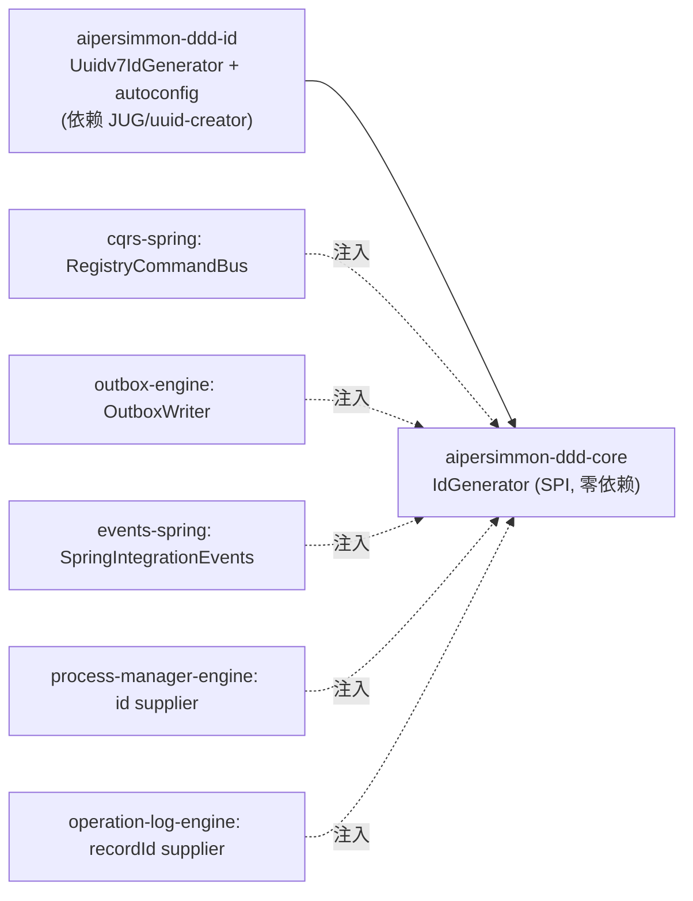

# 时间有序标识符设计：`IdGenerator` SPI + UUIDv7 默认实现 + 铸造点收口

把 [[decision-00019-time-ordered-uuidv7-identifiers]] 落成可实施结构：一个 framework-free 的 `IdGenerator` SPI、
一个库支撑的 UUIDv7 默认实现（独立 impl 模块 + autoconfig）、以及把现有各处 `UUID.randomUUID()` 铸造点统一收口。

## 一、结论

沿用 observability 的拆法：**SPI 在 framework-free 模块、实现在带依赖的 impl 模块、经 autoconfig 装配**。
所有框架铸造点注入同一个 `IdGenerator`（多数已是可注入 supplier）；无 impl 时回退 `UUID.randomUUID()`，不强加硬依赖。

## 二、模块与依赖



- 新增模块 `aipersimmon-ddd-id`（携带 UUIDv7 库；进 reactor + BOM + 标准 starter 依赖，使 v7 默认开启）。
- `IdGenerator` 接口放 `aipersimmon-ddd-core`，保持 core 零第三方依赖（ArchUnit/enforcer 守护不变）。

## 三、SPI

```java
// aipersimmon-ddd-core
@FunctionalInterface
public interface IdGenerator {
  /** A globally-unique, time-ordered identifier string (default: UUIDv7). */
  String newId();
}
```

- 纯接口、无参、返回不透明 String（与现有 id 全为 String、无 `UUID.fromString` 解析的现状一致）。
- 可作 `Supplier<String>` 适配（`idGenerator::newId`），无缝接入现有 supplier 注入点。

## 四、默认实现

```java
// aipersimmon-ddd-id
public final class Uuidv7IdGenerator implements IdGenerator {
  // 首选 JUG：Generators.timeBasedEpochGenerator()（UUIDv7，同毫秒单调变体）
  // 备选 uuid-creator：UuidCreator.getTimeOrderedEpoch()（v7，含 monotonic 变体）
  private final TimeBasedEpochGenerator gen = Generators.timeBasedEpochGenerator();
  @Override public String newId() { return gen.generate().toString(); }
}
```

- 选用**同毫秒单调**变体，避免突发插入时同一毫秒内 id 乱序而丢失局部性。
- autoconfig `@ConditionalOnMissingBean(IdGenerator.class)` 装 `Uuidv7IdGenerator`；库版本在 plan 阶段 pin（JUG ≥ 支持 v7 的版本）。

## 五、铸造点收口

| 模块 / 类 | 现状 | 改为 |
|---|---|---|
| `cqrs-spring` `RegistryCommandBus` | `idGenerator` 默认 `() -> UUID.randomUUID().toString()` | 默认注入 `IdGenerator::newId` |
| `outbox-engine` `OutboxWriter`（当时在 `outbox-jdbc` / `outbox-mybatis-plus` 各一份） | 内联 `UUID.randomUUID().toString()` | 注入 `IdGenerator` |
| `events-spring` `SpringIntegrationEvents` | 内联 `UUID.randomUUID().toString()` | 注入 `IdGenerator` |
| `process-manager-engine` autoconfig id supplier | `() -> UUID.randomUUID().toString()` | 默认 `IdGenerator::newId` |
| `operation-log-engine` autoconfig `recordId` supplier | 默认 `UUID.randomUUID()`（DDL 注释已声明 v7） | 默认 `IdGenerator::newId` |

- `correlationId`（= 根 messageId）、`causationId`（= 上游 messageId）**自动继承** v7，无改动。
- **不改**：`RequestIdFilter` 的 `requestId`（web 边缘、非持久化键）、`WorkerId`（lease owner、非高频 PK）——保留现状，避免无谓扰动。

## 六、回退与兼容

- **回退**：各消费 autoconfig 用 `ObjectProvider<IdGenerator>`，present → 用之；absent（未引 `-id` 模块）→ 保留现有
  `UUID.randomUUID()` 默认。保证 framework-free / 极简装配不被强加依赖，行为等价现状。
- **兼容**：不改任何 DDL；v4 老行与 v7 新行合法共存、各自唯一；id 皆不透明 String，无格式假设被破坏。

## 七、测试

- **单测**：`Uuidv7IdGenerator` 产出可被 `UUID.fromString` 解析、version==7、同毫秒内单调递增、并发唯一。
- **装配测**：`ApplicationContextRunner` 验证默认装 `Uuidv7IdGenerator`、消费方 `@Primary` 可覆盖、缺 impl 时回退。
- **收口回归**：现有各铸造点测试（messageId/event_id/recordId/process id）在切换后仍绿（ids 不透明，断言不依赖 v4 随机性）。
- **（可选）局部性基准**：非门禁的说明性基准，对比 v4/v7 在 process 表大批量插入下的索引页分裂/写放大。

## 八、非目标

`tenant_id`（见 decision-00018 命题四）、客户端 web key、requestId、WorkerId、消费方聚合业务键；跨库序列；存量 id 迁移。
