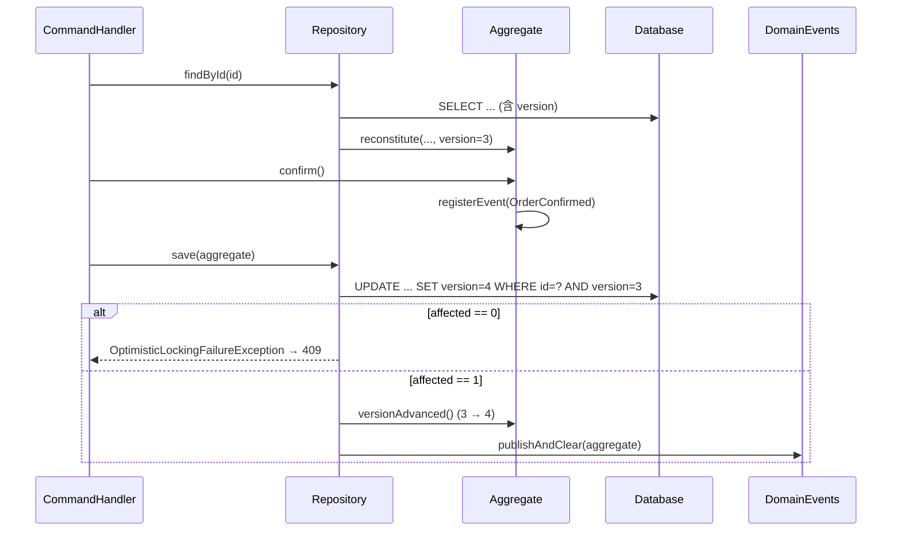
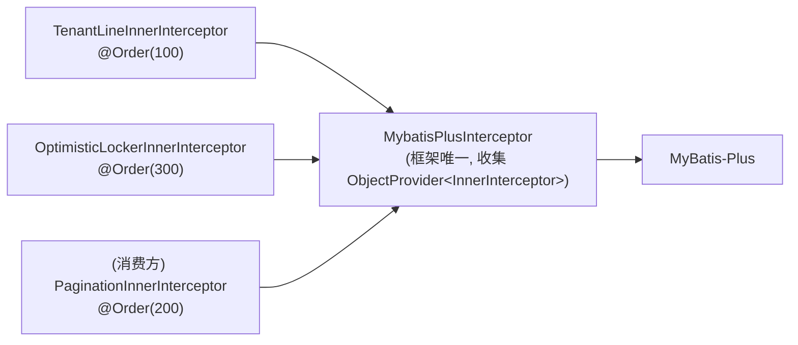

# 聚合持久化契约：版本化写入、事件发布收口，与 MyBatis-Plus 拦截器组合

聚合是**一个事务一致性单元**。要让这句话成立，写回时必须校验「读取时的快照仍然有效」，并且聚合记录的事实必须
与状态变更同生共死。本设计定义三层：core 的**版本契约**、后端的**版本化仓储基类**、以及使二者在 MyBatis-Plus
下真正生效所必需的**拦截器组合模型**。

「同生共死」不是注释里的期望而是**两个仓储基类的前置条件**：`saveAggregate` 在无活动事务时拒绝写入
（[[issue-00107-silent-degradations-become-loud-failures]]）。否则行与事件各自提交，中途失败就留下
「写了行没有事件」或「发了事件而库里没有那个状态」，且没有任何东西可回滚——而这种失败在一切正常的日子里完全不可见。

背景缺陷：[[issue-00051-aggregates-have-no-optimistic-locking]]、
[[issue-00052-domain-events-lost-when-publish-and-clear-forgotten]]。

## 一、core：聚合版本契约

`AbstractAggregateRoot` 增加一个 `long version`，语义为**加载时的版本**（`0` = 尚未持久化）。

```java
public abstract class AbstractAggregateRoot<ID> implements AggregateRoot<ID> {
  private final transient List<DomainEvent> domainEvents = new ArrayList<>();
  private long version;                       // 0 = 未持久化

  protected final void restoreVersion(long persisted)   // 子类 rehydrate 工厂调用
  public final long version()                           // 仓储读取，用于 WHERE 谓词
  public final void versionAdvanced()                    // 仓储在写入成功后调用，version++
}
```

三个成员的可见性是刻意的：

- `restoreVersion` **protected** —— 只有聚合自己的 rehydrate 工厂（`Order.reconstitute`）能设置版本，仓储无法
  绕过聚合直接注入版本。
- `version()` **public** —— 仓储在另一个包，必须能读。
- `versionAdvanced()` **public** —— 同上；与既有的 `clearDomainEvents()` 可见性一致（同类需求、同类妥协）。

**`version` 不参与 `equals`/`hashCode`**：版本是并发控制元数据，不是身份。同一订单的 v3 与 v5 仍是同一订单
（见 [[issue-00055-aggregate-root-missing-identity-equality]]）。`transient` 只加在 `domainEvents` 上；`version`
是需要持久化的状态，不标 `transient`。



## 二、后端：版本化仓储基类（模板方法）

**不引入通用 CRUD 端口。** 领域仓储端口（`Orders`）仍由消费方在 domain 层自行定义——一个框架强加的
`AggregateRepository<A, ID>` 会把 `findAll`/`update` 之类的通用操作带进领域语言，这正是 DDD 要避免的。
框架只提供**基类**，不提供端口。

因此**不需要** `aipersimmon-ddd-persistence` 契约模块。实施后共三个新模块：

| 模块 | 内容 |
|---|---|
| `aipersimmon-ddd-persistence-mybatis-plus` | `MybatisPlusAggregateRepository` + `VersionedRow` + 乐观锁 `InnerInterceptor` 贡献 |
| `aipersimmon-ddd-persistence-jdbc` | `JdbcAggregateRepository` |
| `aipersimmon-ddd-mybatis-plus` | **实施中新增**：持有唯一 `MybatisPlusInterceptor` 并组合所有 `InnerInterceptor` 贡献（见 §3） |

前两者依赖 `-core`（`AbstractAggregateRoot`）+ `-application`（`DomainEvents`）。

> **实施偏差：为什么多出第三个模块。** §3 的组合器既不能放在 `-tenancy-mybatis-plus` 也不能放在
> `-persistence-mybatis-plus`——两者互相独立可选，任一方持有组合器时另一方单独启用就没人组合。本设计原稿没有
> 指出这个归属问题，实施时才暴露，故新增一个只含一个类的共享基座模块。它同时是 `-tenancy-mybatis-plus`
> 与 `-persistence-mybatis-plus` 的依赖。

### MyBatis-Plus 基类

```java
public abstract class MybatisPlusAggregateRepository<
        A extends AbstractAggregateRoot<?>, D extends VersionedRow> {

  private final BaseMapper<D> mapper;
  private final DomainEvents domainEvents;

  /** 版本化写入 + 子表写入 + 事件发布，一次调用。实现中命名为 saveAggregate，避免与消费方端口的 save 混淆。 */
  protected final void saveAggregate(A aggregate) {
    D row = toRow(aggregate);
    row.setVersion(aggregate.version());          // @Version 读它构造 WHERE 谓词
    int affected = aggregate.version() == 0 ? mapper.insert(row) : mapper.updateById(row);
    if (affected == 0) {
      throw new OptimisticLockingFailureException(...);
    }
    saveChildren(aggregate);
    aggregate.versionAdvanced();
    domainEvents.publishAndClear(aggregate);       // 收口：消费方不再手工调用
  }

  protected abstract D toRow(A aggregate);
  protected void saveChildren(A aggregate) {}      // 默认无子表
}
```

`VersionedRow` 是一个两方法接口（`getVersion` / `setVersion`），让基类无需反射即可搬运版本，并把「DO 忘了加
`@Version` 字段」变成**编译期**错误而非运行期静默失效。

消费方由此只写 `toRow` + `saveChildren` + `findById`——`MyBatisOrders.save()` 整个消失，`selectById + insert`
的 TOCTOU 也随之消失（新建/更新由 `version() == 0` 判定，不再先查一次）。

### JDBC 基类

JDBC 无声明式版本谓词，故把 SQL 留给消费方，但**把期望版本作为参数递给它**——未使用的参数会被 PMD 抓到，
比一句文档更难忽略：

```java
protected final void save(A aggregate) {
  int affected = aggregate.version() == 0
      ? insert(aggregate)
      : update(aggregate, aggregate.version());
  if (affected == 0) throw new OptimisticLockingFailureException(...);
  aggregate.versionAdvanced();
  domainEvents.publishAndClear(aggregate);
}
protected abstract int insert(A aggregate);
protected abstract int update(A aggregate, long expectedVersion);   // SQL 必须含 WHERE version = ?
```

## 三、MyBatis-Plus 拦截器组合模型（必须先修，否则 §2 静默失效）

**这是本设计中风险最高的一节。** MyBatis-Plus 只认**一个** `MybatisPlusInterceptor` bean，而
`AipersimmonDddTenancyMybatisPlusAutoConfiguration:35-45` 已经用
`@ConditionalOnMissingBean(MybatisPlusInterceptor.class)` 注册了自己那一个。

若按直觉再加一个「注册 `OptimisticLockerInnerInterceptor` 的 autoconfig」并同样标
`@ConditionalOnMissingBean(MybatisPlusInterceptor.class)`，则**开启多租户时它会静默退让**：tenancy 的 bean 先在，
乐观锁拦截器永不注册，`@Version` 不产生 `WHERE version = ?`，于是 `updateById` 恒返回 1，
[[issue-00051-aggregates-have-no-optimistic-locking]] **看起来修了但实际没修**。这与该 issue 的根因同类
（能力静默缺席），不可接受。

**改为 `InnerInterceptor` 贡献模型**：框架持有唯一一个 `MybatisPlusInterceptor`，按 `@Order` 收集所有
`InnerInterceptor` bean。



顺序遵循 MyBatis-Plus 官方建议：**多租户 → 分页 → 乐观锁**。故 `@Order` 取 100 / 200 / 300。

代价与迁移：`tenancy-mybatis-plus` 从「注册 `MybatisPlusInterceptor`」改为「注册 `TenantLineInnerInterceptor`」，
是一个**破坏性但内部**的改动（无外部使用者）。消费方若已自定义 `MybatisPlusInterceptor`，仍以
`@ConditionalOnMissingBean` 整体退让——这个逃生舱保留不变。

**批次 A 不做本节**：批次 A 让**样例自己**组合一个 `MybatisPlusInterceptor`（tenancy 按既有文档退让），
以最小改动拿到正确的版本谓词；本节的框架侧收口留给批次 B，届时样例的那段组合代码删除。

**已实施（批次 B）**：组合器为 `aipersimmon-ddd-mybatis-plus` 的
`AipersimmonDddMybatisPlusAutoConfiguration`，按 `ObjectProvider<InnerInterceptor>.orderedStream()` 装配并在
启动时 `log.info` 列出实际安装的拦截器（让「装了什么」可见，而非只能靠推断）。tenancy 贡献
`TenantLineInnerInterceptor`（`@Order(100)`），persistence 贡献 `OptimisticLockerInnerInterceptor`
（`@Order(300)`），200 留给消费方分页。样例的 `MybatisPlusConfig` 已删除，其
`MybatisPlusInterceptorCompositionTest`**一行未改**仍绿——即框架组合装出的结果与手写配置等价。

**逃生舱的代价已在测试中钉住**：消费方自定义 `MybatisPlusInterceptor` 时框架**整体**退让，不会把贡献合并进去。
这是有意的（否则「自定义」名不副实），但意味着自定义者必须自己装齐框架的 inner interceptor；
`InnerInterceptorCompositionTest.aConsumerOwnedInterceptorWinsWholesale` 断言了这一语义，Javadoc 也写明。

**但「钉住代价」不等于「拦住后果」**（[[issue-00107-silent-degradations-become-loud-failures]]）：上面那段推理的结论是
「乐观锁静默消失」，而当时唯一的补救是启动日志——**而那行日志恰好印在会退让的那个 bean 里**，所以真正发生时它也不打印。
于是写路径改为**自证**：`MybatisPlusAggregateRepository.saveAggregate` 在 `updateById` 之后检查
`row.getVersion() == expected + 1`。这个断言可行是因为拦截器留下了目击者——它在改写语句之后会把自增后的版本
**写回实体**（`OptimisticLockerInnerInterceptor` 内 `versionField.set(et, updatedVersionVal)`）。
版本没动，就说明没有 `WHERE version = ?`，那次 update 是无条件匹配的，受影响行数检查**恰恰因为谓词缺失而通过**。
同一断言也顺带覆盖第二条路径：行对象的版本字段漏标 `@Version`（拦截器据此识别，漏标即找不到可改写的东西）。
错误信息把两条路径都点出来。

## 四、边界（本设计不涵盖）

- **不涵盖悲观锁**（`SELECT ... FOR UPDATE`）。乐观锁是默认，写冲突罕见时它更省资源；高冲突聚合可由消费方在
  自己的仓储里自行加锁，框架不提供开关（避免一个不该由框架决定的性能选择）。
- **不涵盖跨聚合事务**。一个命令写多个聚合时，各自独立版本校验；框架不引入聚合间的一致性协调（那是流程管理器
  的职责，见 [[design-00004-durable-process-manager-runtime]]）。
- **不涵盖 `version` 的溢出/回绕**。`BIGINT` 单调递增，实践中不可达。
- **不涵盖读模型**。投影表无聚合语义，不参与版本化。
- **不改 `DomainEvents` 接口**。`publishAndClear` 保持原样，只是调用点收口到基类。

## 关联

- [[issue-00051-aggregates-have-no-optimistic-locking]]（本设计要解决的主缺陷）
- [[issue-00052-domain-events-lost-when-publish-and-clear-forgotten]]（事件发布收口）
- [[issue-00055-aggregate-root-missing-identity-equality]]（`version` 不参与相等）
- [[plan-00013-phase-one-correctness-remediation]]（落地计划，批次 A / B）
- [[design-00009-multi-tenancy-tenant-id]]（tenancy 的 MyBatis-Plus 拦截器现状，§3 要改的对象）
- [[design-00001-aipersimmon-ddd-and-scaffold]]（模块分层与「端口在 domain、实现在 infrastructure」的既有约定）
