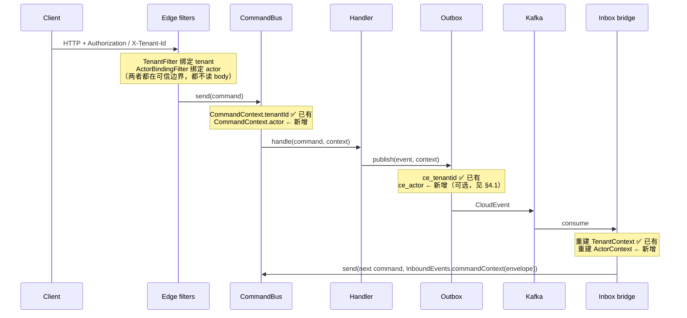

# 操作者身份与授权：把 actor 接进 tenant 已经铺好的那条骨架

本设计回答 [[report-00002-scaffold-ddd-review]] 的 B3：`aipersimmon-ddd-scaffold` 全程没有认证与授权。
它同时是一份框架侧的 seam 设计——`actor` 与 `tenant` 是同一类"旁路元数据"，
框架已经为后者建了完整的传播骨架（[[design-00009-multi-tenancy-tenant-id]]），
前者却只有一个孤零零的 `OperationActorResolver`。本设计的主张是：**不要为 actor 另起一套。**

## 一、结论

1. **actor 与 tenant 同构，复用同一条骨架**：可信边界绑定 → `CommandContext` 携带 →
   出站事件标注 → 入站重建 → 耐久列。tenant 已经走通全程，actor 只走通了最后一段（审计行）。
2. **授权分三层，各归各位**，不允许互相代劳：

   | 层 | 判断的问题 | 归属 | 现状 |
   |---|---|---|---|
   | 边缘 | 你是谁？你有没有这个角色？ | Spring Security filter chain | **完全缺失** |
   | 用例 | 这条命令的 actor 是谁？ | `CommandContext.actor()`，由边界注入 | **缺失**（`CancelOwnOrder` 从 request param 取） |
   | 领域 | 这单是不是你的？这个窗口关了吗？ | `OrderLifecyclePolicy` / `CancellableByCustomer` | **已正确实现** |

   第三层不上移。"只有订单本人可取消"是业务规则，不是 URL 权限——
   `OrderingErrorCode.NOT_ORDER_CUSTOMER`（`ErrorCategory.FORBIDDEN`）已经是对的建模。
3. **actor 永不来自 payload**。这条规则 tenancy 侧已经写死了
   （`OperationLogConfig` 的注释："It reads from `TenantContext`, never the command payload,
   exactly because the payload is untrusted"）。同一句话对 actor 成立，
   而当前 `CancelOwnOrder(orderId, customerId)` 恰恰违反它。
4. **`/ops/**` 由角色保护，不由租户保护**。它被刻意排除在租户校验之外
   （死信属于部署，不属于租户），因此它当前是**唯一一个既无租户约束又无角色约束的面**。
5. scaffold 采用**最小可信边界**：Spring Security + JWT resource server（或本地 HTTP Basic），
   不引入授权服务器。目标是演示 seam，不是演示 IAM。

## 二、为什么这是设计问题而不是缺陷

单看"加个 `@PreAuthorize`"，这是一行代码。真正需要设计的是三件事：

- **actor 从哪里进入领域侧的调用链**。若每个 handler 自己从 `SecurityContextHolder` 取，
  领域/应用层就绑上了 Spring Security——这与 `domainShouldBeFrameworkFree` 及
  `applicationShouldNotDependOnInfrastructureOrInterface` 冲突。
- **actor 与 tenant 的关系**。两者都在同一个边界解析、都要跨 outbox/Kafka 传播、
  都要落到审计行。分别实现会得到两套语义相近但细节不同的机制。
- **哪些判断留在领域**。把"是不是本人的订单"挪进 Security 表达式，会把领域规则
  搬到一个领域测试触及不到的地方，并让 `CancellableByCustomer` 与
  `OrderLifecyclePolicy` 那套精心分离的 Specification/Invariant 设计失去意义。

## 三、原语：`Actor` 与 `ActorContext`

框架已有 `com.aipersimmon.ddd.operationlog.model.Actor`，但它**住在 operation-log 组件里**——
一个横切身份原语被关在审计组件内部，其它组件要用就得依赖审计。

**提升 `Actor` 到一个 framework-free 的租户级同构组件**，与
`aipersimmon-ddd-tenancy` 完全对称：

```
aipersimmon-ddd-identity            (framework-free)
  Actor            —— sealed: Actor.user(id, ...) | Actor.system(id) | Actor.anonymous()
  ActorId
  ActorContext     —— ThreadLocal 绑定 + runAs(actor, supplier)，形同 TenantContext
  Actors.SYSTEM    —— 哨兵，对照 Tenants.ROOT

aipersimmon-ddd-identity-spring-boot-starter
  ActorResolver SPI（默认从 SecurityContext 解析；无 Security 时回落 Actors.SYSTEM）
  ActorBindingFilter（边缘绑定，order 与 TenantFilter 相邻）
```

`operation-log` 改为依赖它，`OperationActorResolver` 退化为
`() -> ActorContext.current().orElse(Actors.SYSTEM)`——即今天 `OperationTenantResolver`
对 tenant 已经在做的事（`OperationLogConfig` 的第二个 bean 就是这个形状）。

## 四、传播：与 tenant 同一条路径



### 4.1 actor 是否要过 broker？——要，但语义不同于 tenant

- **tenant 是授权范围**：下游必须在同一租户下执行，否则写错库。它是**执行上下文**。
- **actor 是因果归属**：下游命令由系统代表某人执行。它是**审计事实**，
  下游**不得**用它做授权判断（跨服务信任一个消息头里的身份是经典漏洞）。

因此：`ce_actor` 只用于把审计链路接起来（"这笔自动确认最初由谁触发"），
消费侧重建的 `ActorContext` 必须标记为 `derived`——
`Actor.onBehalfOf(originalActorId)`，与边缘直接认证得到的 `Actor.user(...)` 类型上可区分。
授权只认后者。

## 五、边缘：scaffold 的最小可信边界

```java
@Bean
SecurityFilterChain api(HttpSecurity http) throws Exception {
  return http
      .authorizeHttpRequests(auth -> auth
          .requestMatchers("/actuator/health/**").permitAll()
          .requestMatchers("/ops/**").hasRole("OPERATOR")          // 死信：运维角色
          .requestMatchers(POST, "/orders/*/approve-review").hasRole("OPERATOR")
          .anyRequest().authenticated())
      .oauth2ResourceServer(oauth -> oauth.jwt(Customizer.withDefaults()))
      .csrf(CsrfConfigurer::disable)                                // 纯 API，无浏览器会话
      .sessionManagement(s -> s.sessionCreationPolicy(STATELESS))
      .build();
}
```

三条与现状的具体差异：

1. `/ops/**` 从**完全开放**变成 `ROLE_OPERATOR`。这是当前最大的暴露面：
   它同时被排除在租户校验之外，所以现在任何人都能读到**全部租户**的死信内容。
2. `approve-review` 是运维动作（`OrderController` 的 javadoc 自己这么定位），
   给它一个运维角色即可；下单/查询/取消是终端用户动作。
3. `CancelOwnOrder` 的 `customerId` **从 request param 中删除**：

```java
// before —— 谁都能声称自己是任何人
public ResponseEntity<Void> cancel(@PathVariable String id, @RequestParam String customerId)

// after —— 身份来自 principal，命令里不再有这个字段
public ResponseEntity<Void> cancel(@PathVariable String id) {
  commandBus.send(new CancelOwnOrder(id));      // actor 随 CommandContext 传播
}
```

   handler 改为从 `context.actor()` 取 `CustomerId`。
   领域侧 `OrderLifecyclePolicy.ensureCustomerCancellationAllowed` **一行不改**——
   它接收的仍是"谁在请求"，只是这个值的来源从不可信变成了可信。
   这正是第 §1.2 表格里三层分工的价值：换掉边缘，领域不动。

## 六、强制（防漏）

与 tenancy 的 `missing-policy: REJECT` 同构，缺省应当是**拒绝**而不是回落：

| 检查 | 手段 | 失败时机 |
|---|---|---|
| 未认证请求打到业务端点 | `anyRequest().authenticated()` | 运行时 401 |
| handler 从 payload 取身份 | ArchUnit：application 层的 `Command` record 不得有名为 `actorId`/`userId`/`operatorId`/`customerId`（除非标注 `@NotAnIdentity`） | 构建期 |
| 领域/应用层依赖 Spring Security | ArchUnit：`..domain..`/`..application..` 不得依赖 `org.springframework.security..` | 构建期 |
| actor 解析器缺失 | 启动期 fail-fast（照抄 operation-log 对 resolver 缺失的既有做法） | 启动期 |
| 新端点忘记授权规则 | 测试：枚举所有 `@RequestMapping`，断言每条路径命中一条显式规则 | 构建期 |

最后一条最值得做——它防的是"以后加的端点"，而不是今天这几个。

## 七、对现有设计的影响

| 文档/组件 | 影响 |
|---|---|
| [[design-00009-multi-tenancy-tenant-id]] | 无冲突。actor 复用同一条传播骨架；两个 filter 的相对顺序需固定（tenant 先，actor 后，因为 actor 可能来自租户内的用户目录） |
| [[design-00008-operation-log-component]] | `Actor` 从 operation-log 迁出到 identity 组件；operation-log 反向依赖它。审计行的语义不变，但 `actor_id` 终于会是真人而非常量 |
| [[design-00003-exception-model]] | 401/403 需并入 RFC 9457 家族。`ErrorCategory.FORBIDDEN` 已存在且已被 `NOT_ORDER_CUSTOMER` 使用——领域侧的 403 与边缘侧的 403 要能在 problem document 上区分（前者带 `code`，后者不带，与 409 的既有分裂同理） |
| [[decision-00013-command-context-and-causation-propagation]] | `CommandContext` 增加 `actor` 字段，需要一条 ADR |
| [[decision-00012-no-ambient-per-command-state]] | **需要核对**：该决策反对"环境态"。`ActorContext` 是 ThreadLocal，形式上是环境态——但 `TenantContext` 已经是同样的形状且被接受，理由是它在**可信边界**绑定、并显式复制进 `CommandContext`。actor 必须援引同一条豁免，否则两个决策会打架 |

## 八、非目标

- 不实现 RBAC/ABAC 引擎、不引入授权服务器、不做 API key 管理。
- 不做行级/字段级数据权限（那是租户隔离已经覆盖的正交问题）。
- 不改动领域侧既有的授权规则——`OrderLifecyclePolicy` 那部分是本次评审里被判定为**正确**的部分。
- 不为 `/actuator/**` 设计精细策略；健康探针放行，其余按 `ROLE_OPERATOR` 一刀切。

## 九、验收矩阵

| 断言 | 位置 |
|---|---|
| 未认证的 `POST /orders` → 401 | `SecurityContractTest`（新） |
| 非 OPERATOR 的 `GET /ops/dead-letters` → 403 | 同上 |
| A 客户持自己的 token 取消 B 的订单 → 403 + `ordering.not-order-customer` | 同上（领域规则仍然是给出理由的那一层） |
| 审计行的 `actor_id` 是真实 principal，不是 `ordering-scaffold` | 改造 `TwoTenantAcceptanceTest.theBoundTenantIsStampedOnTheAuditRow` 为 actor+tenant 双断言 |
| 跨 broker 后的 `ConfirmOrder` 审计行标记为 `on-behalf-of` 原始 actor | `OperationLogRecordingTest` 扩展 |
| 领域/应用层零 Spring Security 依赖 | `ArchitectureTest` |
| 每个端点都命中一条显式授权规则 | `SecurityContractTest` |

## 十、落地顺序

1. 抽出 `aipersimmon-ddd-identity`（`Actor` / `ActorContext` / `Actors`），
   operation-log 改依赖它——**此步不改任何行为**，纯搬迁，可独立验证。
2. `CommandContext` 加 `actor`；命令总线在边界 seed（照抄 tenant 的既有实现）。
3. scaffold 加 `SecurityConfig` + `ActorResolver`；改 `CancelOwnOrder` 去掉 `customerId` 字段。
4. 补 ArchUnit 规则与 `SecurityContractTest`。
5. `ce_actor` 与消费侧 `on-behalf-of` 重建（可延后，它只影响审计完整性，不影响安全）。

第 1、2 步是框架侧改动，第 3、4 步才是 scaffold 侧。若只想先关掉暴露面，
**可以只做第 3 步的 `SecurityFilterChain` 部分**——`/ops/**` 与 `approve-review`
立刻有了角色约束，其余按本设计逐步推进。

## 关联

- [[report-00002-scaffold-ddd-review]]（B3 的来源）
- [[design-00009-multi-tenancy-tenant-id]]（本设计复用的骨架）
- [[design-00008-operation-log-component]]（`Actor` 的当前住处）
- [[design-00003-exception-model]]（401/403 的 problem 呈现）
- [[decision-00012-no-ambient-per-command-state]]、[[decision-00013-command-context-and-causation-propagation]]（需要核对/新增 ADR）
