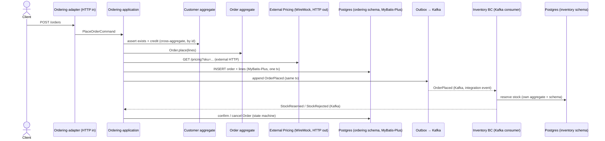

# Plan: `bc-and-layer-samples` — three runnable structures from analysis-00004

Build `bc-and-layer-samples/` at the repo root containing **three** runnable
Spring Boot projects, one per structure in
`docs/analysis/analysis-00004-bounded-context-module-structure.md`:

1. `structure-1-modulith/` — modular monolith, **logical** BCs (Spring Modulith).
2. `structure-2-multimodule/` — modular monolith, **physical** BCs (multi-module / B2).
3. `structure-3-microservices/` — **service per BC** (COLA-layered).

All three implement the **same** domain and scenarios, so they are directly
comparable; only the module structure differs. Real middleware (Postgres, Kafka)
via one Docker Compose; a `Makefile` starts/stops it and each app, and wipes
volumes to prevent dirty data. Every project must `mvn verify` (compile) and run
the acceptance path.

## Assumptions to confirm before build (please review)

- **Domain = two BCs: `Ordering` and `Inventory`.** Classic, exercises every
  required scenario without inventing a complex domain.
- **Stack:** Java 21, **Spring Boot 3.5.10**, Maven, **MyBatis-Plus 3.5.15**
  (`mybatis-plus-spring-boot3-starter`), Spring for Apache Kafka, **Flyway** for
  schema (MyBatis-Plus does not migrate), Spring Modulith (structure-1 only).
- **Middleware (trimmed from your compose):** Postgres 18.1, Kafka 3.7.1 (KRaft),
  plus **WireMock** as the real external HTTP dependency. kafka-ui and the SigNoz
  / ClickHouse / ZooKeeper / OTel-collector stack are **excluded** as out of
  scope; topic inspection is via a `make` Kafka-console target. I can add OTel
  tracing later if you want it.
- **External HTTP call** = a driven adapter calling a WireMock "pricing/tax"
  service (a real HTTP hop).
- **Run one structure at a time** (distinct ports; per-structure DB schemas +
  Kafka consumer groups). `make reset` wipes volumes.
- `bc-and-layer-samples/` is **added to `template.json` `exclude`** so it is not
  copied into scaffolded projects (it is reference material for this repo).

## Scenario (identical across all three)

"Place an order" exercises every required capability:



Capability coverage: inbound HTTP (adapter), **external HTTP** (WireMock driven
adapter), **DB via MyBatis-Plus**, **cross-aggregate** (Order↔Customer by id),
**cross-BC** (Ordering↔Inventory via Kafka integration events; plus one
**synchronous cross-service REST** availability check in structure-3),
**message send + consume** (Kafka + transactional Outbox), **config reading**
(`application.yml` + `@ConfigurationProperties` for datasource, Kafka, external
URL, outbox poll).

## Design

### Aggregates & data (same in all three; schema name is per-structure-prefixed)

| BC | Aggregates | Key tables (Flyway) |
| --- | --- | --- |
| Ordering | `Order` (root) + `OrderLine`; `Customer` (root) | `orders`, `order_lines`, `customers`, `outbox` |
| Inventory | `StockItem` (root) | `stock_items`, `inbox`, `outbox` |

- Typed IDs / value objects as records (`OrderId`, `Sku`, `Money`).
- **Outbox** table written in the same tx as state change; a `@Scheduled` relay
  publishes to Kafka and marks sent. **Inbox** on the consumer dedups by event id.
- Structure-1 may instead use the **Spring Modulith event publication registry**
  (`spring-modulith-starter-jdbc`) as its outbox — a real, framework-provided
  transactional outbox — to demonstrate that variant.

### Module layout per structure

Follows analysis-00004 (see that analysis for the annotated trees):

- **structure-1**: one Maven module; packages `…​.ordering` / `…​.inventory` are
  Spring Modulith modules; layers are sub-packages; `ApplicationModules.verify()`
  test. Cross-BC via Modulith events externalized to Kafka.
- **structure-2**: parent POM; per BC an aggregator with
  `*-api / *-domain / *-application / *-infrastructure / *-adapter` Maven modules;
  `shared-kernel`; single `start`. Cross-BC only via `*-api` + hand-written
  outbox→Kafka. ArchUnit test asserts layer/BC deps.
- **structure-3**: two independent apps `ordering-service` / `inventory-service`,
  each COLA-layered (`adapter/app/client/domain/infrastructure/start`), own
  schema. Async via Kafka; one **sync REST** call (ordering→inventory
  availability) to show cross-service HTTP.

### Middleware, ports, isolation

| Service | Port | Notes |
| --- | --- | --- |
| Postgres | 5432 | DB `samples`; schemas `s1_ordering`, `s1_inventory`, `s2_*`, `s3_*` |
| Kafka | 9092 | KRaft; topics prefixed `s1.` / `s2.` / `s3.`; groups per structure |
| WireMock | 8089 | external pricing stub (mapped JSON responses) |
| structure-1 app | 8081 | |
| structure-2 `start` | 8082 | |
| structure-3 ordering / inventory | 8083 / 8084 | |

Dirty-data prevention: per-structure schemas + consumer groups so structures
never share state; Flyway recreates tables on boot; `make reset` = `compose down
-v` wipes all volumes.

## Tasks

Cohesive, mostly parallel after T0/T1.

- **T0 — Infra.** `bc-and-layer-samples/docker-compose.yaml` (postgres, kafka,
  kafka-ui, wiremock), `docker/postgres/init.sql` (create schemas), `wiremock/`
  stubs, root `Makefile` (`up`/`down`/`reset`/`ps`/`logs` + `s1`/`s2`/`s3`
  build+run + per-structure reset), `.gitignore`, add `bc-and-layer-samples/` to
  `template.json` `exclude`.
- **T1 — Shared contract.** Nail aggregates, commands, integration-event JSON
  schemas, topic names, external pricing API contract, Flyway DDL. One short note
  so all three implementations match.
- **T2 — structure-1-modulith.** Full impl + Flyway + `ApplicationModules.verify()`
  + a Modulith `@ApplicationModuleTest`/`Scenario` acceptance test.
- **T3 — structure-2-multimodule.** Full multi-module impl + ArchUnit boundary
  tests + acceptance test.
- **T4 — structure-3-microservices.** Two services + sync REST + async Kafka +
  per-service outbox + acceptance test.
- **T5 — Docs & wrap.** `bc-and-layer-samples/README.md` (the samples-dir root
  README) comparing the three with a "what to look at" per capability,
  per-structure `README.md`, final `make` run of all three green.

Suggested order: T0 → T1 → **T2 end-to-end first** (proves the full stack), then
T3, T4 reuse the T2 domain code, then T5.

## Detailed acceptance path

Per structure `sN` (N = 1,2,3):

```bash
cd bc-and-layer-samples
make up                 # start postgres, kafka, kafka-ui, wiremock; wait healthy
make sN                 # mvn verify (must compile) then run app(s) on their ports
# drive the scenario:
curl -X POST localhost:80{81|82|83}/orders -d '{...}' -H 'Content-Type: application/json'
#   → returns orderId, status=PENDING
curl localhost:PORT/orders/{orderId}
#   → eventually status=CONFIRMED (stock reserved) or CANCELLED (rejected)
# verify side effects:
#   - make sN-events: sN.order-placed and sN.stock-reserved have messages (kafka console consumer)
#   - psql: rows in sN_ordering.orders (CONFIRMED) and sN_inventory.stock_items (reserved)
#   - wiremock got the pricing call (request journal)
make sN-down            # stop app(s)
make reset              # wipe volumes → clean slate
```

Plan is **done** when: (a) T0–T5 complete; (b) each of the three `mvn verify`
passes; (c) each structure runs the acceptance path to `CONFIRMED` against real
Postgres + Kafka + WireMock; (d) structure-1 `verify()` and structure-2 ArchUnit
boundary tests pass; (e) `make reset` yields a clean slate with no cross-structure
data.

## Risks / notes

- **Scope is large** (3 projects × 2 BCs × full stack). Mitigation: build T2 as a
  complete vertical slice first; T3/T4 reuse its domain logic, differing only in
  module packaging.
- Boot/MyBatis-Plus/Modulith version alignment is the main compile risk — pinned
  and verified in T2 before replicating.
- This plan realizes the structures defined in
  `docs/analysis/analysis-00004-bounded-context-module-structure.md`; it does not
  re-decide them.
