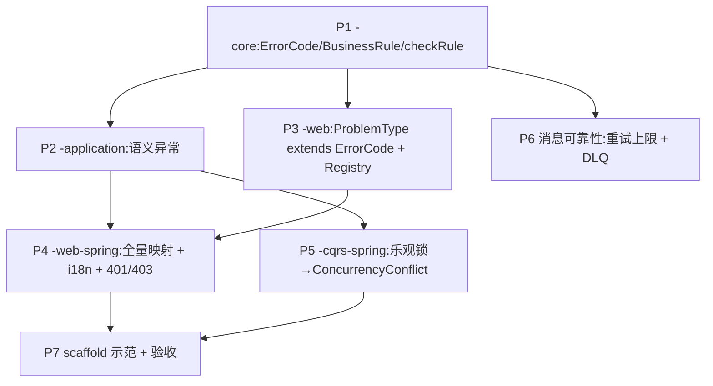

# 异常/错误体系落地计划

把 [[design-00003-exception-model]](决策见 [[decision-00010-exception-model]])落成代码。目标验收锚点:
**对信用超限的下单请求,脚手架原样产出 [[design-00002-web-layer]] §八 的 409 ProblemDetail(带
`code:"ordering.credit-exceeded"` + `type`)**;当前产不出来即未完成。

全为**加法式**改动(旧 message-only 构造保留),不破坏 `-core` 零依赖红线与依赖向内铁律。

## Design

设计细节不在此重复,见 [[design-00003-exception-model]] §四–§十。相位依赖:

P2 与 P3 只依赖 P1,可并行;P6 基本独立;P7 收口验收。

## Tasks

### P1 — `-core` 错误码与规则基元(基础,阻塞多数)
- [ ] 新增 `com.aipersimmon.ddd.core.error`:`ErrorCode`(`code()` + 默认 `category()`)、`ErrorCategory` 枚举。
- [ ] `DomainException` 加 `(ErrorCode, message)` / `(ErrorCode, message, cause)` 构造 + `Optional<ErrorCode> errorCode()`;保留 message-only 构造。
- [ ] 新增 `com.aipersimmon.ddd.core.rule`:`BusinessRule`、`BusinessRuleViolationException extends DomainException`。
- [ ] `AbstractAggregateRoot.checkRule(BusinessRule)`。
- [ ] `IllegalStateTransitionException` 增可选 `ErrorCode` 构造(不改现有行为)。
- [ ] 新 package 补 `package-info.java`;`-core` pom 仍零依赖(仅 test)。
- **验收**:`-core` 单测覆盖 `checkRule`(broken→抛、否则不抛)与 `BusinessRuleViolationException` 携码;`mvn -pl aipersimmon-ddd-core test` 绿;archunit 仍绿。

### P2 — `-application` 语义异常(→ P1)
- [ ] `ApplicationException` 加带码构造 + `errorCode()`。
- [ ] 新增 `EntityNotFoundException`、`ConcurrencyConflictException`(均 extends `ApplicationException`)。
- **验收**:模块 framework-free 编译通过;单测构造/取码。

### P3 — `-web` 契约接通(→ P1)
- [ ] `ProblemType extends ErrorCode`(补继承,保留 `typeUri/status/titleKey`)。
- [ ] 新增 `ProblemTypeRegistry`(`Optional<ProblemType> byCode(String)`)。
- **验收**:`-web` 纯契约编译;既有 `ApiError`/`ApiException` 测试不回归。

### P4 — `-web-spring` 全量映射 + i18n + 401/403(→ P1,P2,P3)
- [ ] advice:`DomainException`/`ApplicationException` 读 `errorCode()` → 经 `ProblemTypeRegistry` 补 `code/type/status/title`,查不到按 `ErrorCategory`/异常类型默认。
- [ ] `EntityNotFoundException`→404、`ConcurrencyConflictException`→409 处理器。
- [ ] **新增 `ConstraintViolationException`→400**,与 `MethodArgumentNotValidException` 共享 `FieldError` 映射(修 analysis-00010 #3/#8)。
- [ ] `ProblemTypeRegistry` 默认 bean(聚合发现所有 `ProblemType` 枚举/bean)。
- [ ] 交付默认英文 `messages` bundle;`ProblemHttpResponseWriter`(filter 路径)接入 `MessageSource`。
- [ ] 401/403 → ProblemDetail,`@ConditionalOnClass` spring-security。
- **验收**:web-spring 测试含 ConstraintViolation→400、带码 DomainException→§八 形态、EntityNotFound→404;i18n 键可解析。

### P5 — `-cqrs-spring` 并发翻译(→ P2)
- [ ] 把 `OptimisticLockingFailureException` 在应用边界翻译为 `ConcurrencyConflictException`。
- **验收**:并发冲突路径映射 409(非裸框架异常)。

### P6 — 消息链路可靠性(→ P1,基本独立)
- [ ] `-outbox`:`RetryPolicy`、`FailureClassifier`(transient/permanent)、`DeadLetterStore` SPI。
- [ ] `-outbox-jdbc` / `-outbox-mybatis-plus`:`dead_letter` 表 + relay 接入 `max-attempts`(默认 8)+ 退避 + 超限转死信。
- [ ] `-messaging-kafka`:`DefaultErrorHandler` + `DeadLetterPublishingRecoverer` → `<topic>.DLT`。
- **验收**:毒丸消息在上限后进死信、停止重投;各存储后端一致。

### P7 — scaffold 示范 + 端到端验收(→ P4,P5)
- [ ] `OrderingProblemType` 枚举 implements `ProblemType`(含 `CREDIT_EXCEEDED` 等)。
- [ ] `CreditExceededException` 携 `OrderingProblemType.CREDIT_EXCEEDED`;信用/状态校验改写为 `checkRule`。
- [ ] "unknown order/customer" 改抛 `EntityNotFoundException`(取代 P0 的 `NoSuchElementException`)。
- [ ] 同步 modulith 与 multi-module 两个脚手架。
- **验收**:见下方 Acceptance Path。

## Detailed Acceptance Path

1. **全部相位任务勾完**,且 `mvn -q -o install`(库)+ 两个脚手架 `mvn -q -o test` 全绿。
2. **贯通验收(核心)**:对信用超限下单,响应为
   `409 application/problem+json`,body 含 `"code":"ordering.credit-exceeded"` 与 `"type":"/problems/credit-exceeded"` —— 与 [[design-00002-web-layer]] §八 逐字段一致。
3. **回归验收**:unknown order → 404;命令 Bean Validation 失败 → 400 带 `errors[]`;领域规则违反 → 409;未预期 → 500 不回显。
4. **可靠性验收**:构造一个永久失败的 outbox/kafka 消息,确认达 `max-attempts` 后进死信、不再无限重投。
5. **架构验收**:`-core`/`-application`/`-web` 仍 framework-free(archunit + pom 零依赖红线);无 `-web → 领域` 的反向依赖。

## 关联

- [[design-00003-exception-model]] —— 实现依据(类型、映射、模块落位)。
- [[decision-00010-exception-model]] —— 策略与取舍。
- [[analysis-00010-exception-model]] —— 缺口编号(#1–#9),与各相位一一对应。
- [[design-00002-web-layer]] §八 —— 端到端验收的线上契约基准。
