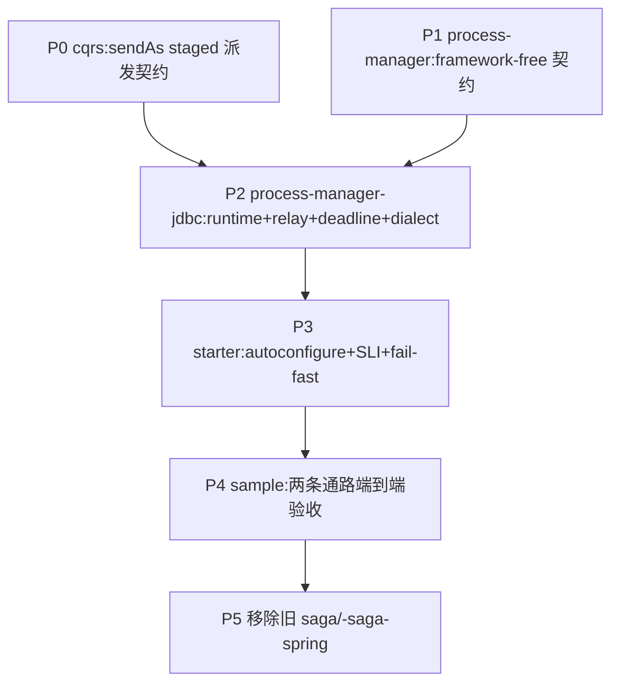

# Durable Process Manager 落地计划

把 [[design-00004-durable-process-manager-runtime]](身份契约增补见
[[decision-00016-durable-runtime-staged-message-identity]])落成代码:三个与业务无关的构件模块
`aipersimmon-ddd-process-manager` / `-process-manager-jdbc` / `-process-manager-jdbc-spring-boot-starter`,
并 clean-slate 移除旧 `aipersimmon-ddd-saga` / `-saga-spring`。

**验收锚点**:§13 sample(订单履约)端到端跑通——支付拒绝 → 释放库存 → 请求取消订单 →(已发货则)启动退货;
其中 Payment 作为独立微服务经集成事件往返、Inventory/Order 同进程经 command 往返;effect 崩溃重投幂等
(`messageId == effectId`);当前跑不出即未完成。

全程 test-first,遵守 `-core` 零依赖红线与依赖向内铁律;三模块不依赖任何 scaffold / bounded-context。

## 进度

- ✅ **P0**（`aipersimmon-ddd-cqrs` + `-cqrs-spring`）:`CommandBus.sendAs(cmd, messageContext)` staged 派发契约——
  接口 default 抛 `UnsupportedOperationException`（opt-in，6 个既有实现不破），`RegistryCommandBus` override 为逐字派发
  （不调 idGenerator、不 deriveChild）。测试:`CqrsContractsTest#sendAsIsUnsupportedByDefault`、
  `RegistryCommandBusSendAsTest`（verbatim / 重投同 id / send 仍自铸）、ArchUnit
  `commandHandlersAndApplicationShouldNotCallSendAs` 负向 fixture 转真（cqrs+cqrs-spring+archunit 全绿）。
- ✅ **P1**（`aipersimmon-ddd-process-manager`）:framework-free 契约全部落地——model（12 VO + `ProcessLifecycle`
  含合法迁移表）、definition（`ProcessInput`/`ProcessContext`/`ProcessDecision` 自校验不变量/`ProcessDefinition`/
  `ProcessDefinitionRegistry` 一活跃版本校验）、effect（sealed + 4 record + kind）、runtime（`ProcessRuntime`/
  `ProcessQuery`/`ProcessAdvanceResult`/`ProcessView`）、codec（`PayloadType`/`EncodedPayload`/两 SPI + 双唯一注册表）、
  exception（`ProcessException` 基类 + 7 个）。每包 package-info。测试 32 绿:lifecycle 迁移、Decision 不变量（含
  SUSPENDED 禁用、终态⟺outcome、deadline 歧义、effects 防御拷贝）、Definition/codec 注册表冲突、VO 校验。已注册进
  reactor + BOM（22 模块 validate 绿）。注:effect-context 派生属 runtime 语义，其测试落 P2。
- 🔄 **P2**（`aipersimmon-ddd-process-manager-jdbc`）:
  - ✅ **P2①**（schema + store + 原子推进 + H2 契约）:四表 H2 schema、四个 JDBC store（instance 乐观更新 / transition
    append+dedup / effect 暂存 / deadline 调度取消）、`JdbcProcessRuntime` 原子推进（REQUIRED 事务、resolve/dedup/
    乐观锁+bounded retry/decode/decision/校验合法迁移/暂存 effect 带持久身份 messageId=effectId=transitionId#idx/
    deadline 持久化）、`JdbcProcessQuery`、`JdbcProcessUnitOfWork`、`DuplicateBusinessKeyPolicy`。11 个 H2 契约测试绿
    （原子提交、rollback 无残行、重复 input no-op、reject/fold、revision 递增、非法迁移拒绝、终态 no-op、deadline 落库、
    effect 确定性 id + correlation/causation 派生）。已注册 reactor+BOM。
  - ✅ **P2②**:`JdbcProcessDialect`（`SkipLockedProcessDialect` PG/MySQL + `AtomicUpdateProcessDialect` H2，共享
    候选 SQL 含 per-instance head-of-line 谓词）、`retry`（`ExponentialBackoffPolicy` 带 jitter/上限）、
    `JdbcProcessEffectRelay`（claim→decode→dispatch→DELIVERED/retry/DEAD+SUSPEND，lease token fencing，per-instance
    串行）、dispatcher SPI（`EffectDispatcherRegistry` + `CommandEffectDispatcher` 走 `sendAs` / `IntegrationEventEffectDispatcher`
    走 `publish`）+ effect/instance store 完成方法。测试:6 H2 relay 契约（逐字身份派发、per-instance 有序一次一条、
    瞬时失败重试、耗尽→DEAD+挂起、token fencing、lease 过期重认领）+ **1 PostgreSQL Testcontainers SKIP LOCKED gate**
    （两 worker 并发认领 40 effect，每条恰好派发一次）。jdbc 模块 18 测试全绿。**注**:MySQL gate 复用 `SkipLockedProcessDialect`
    同 SQL，随 P3 starter 的 dialect 选择补一个等价 Testcontainers 用例。
  - ✅ **P2③**:deadline worker——`JdbcProcessDeadlineWorker` claim（dialect 新增 `claimDueDeadlines`，候选 JOIN 实例
    仅取 active，`FOR UPDATE OF d SKIP LOCKED`）→ 转 `ProcessInput` 重入 `handle` → 同事务标 `FIRED`；superseded
    generation 可审计 no-op；耗尽 → DEAD + 挂起（source=DEADLINE）。deadline store 加 load/markFired/scheduleRetry/
    markDead/cancelClaimed/currentGeneration。3 H2 测试绿（fire 推进流程、superseded no-op、耗尽→DEAD+挂起）。jdbc 模块 21 绿。
  - ⏳ **P2④**:query/operations（`JdbcProcessOperations` redrive effect/deadline、cancelProcess、timeline、卡死扫描）
    + 挂起期 `PARKED` 输入落库与恢复重放 + 整体 `max-lifetime` 兜底 deadline。
- ⏳ **P3**（`-process-manager-jdbc-spring-boot-starter`）:autoconfigure、properties（构造期校验）、worker 生命周期、
  Health/最小 SLI、DDL 样例、启动期 fail-fast。Boot 切片测试。
- ⏳ **P4**（multi-module scaffold sample）:ordering 履约 Definition/codec + Payment 微服务往返 + Inventory/Order
  同进程往返；端到端验收。
- ⏳ **P5**（清理）:移除 `aipersimmon-ddd-saga` / `-saga-spring`，更新 BOM / 父 pom / README / design-00001 指向。

## Design

细节见 [[design-00004-durable-process-manager-runtime]]。相位依赖:

P0 与 P1 无相互依赖,可并行;P2 收敛二者。P5 在验收通过后做,避免中途破坏反应堆。

## 备注

- P0 先落，是因为 P2 的 effect relay 依赖 `sendAs`；它也是评审确认的 P0-1 契约（decision-00016）的最小可测切片。
- P2 是最大相位，必须逐子项 test-first；relay/deadline 的多实例与 crash-window 用 Testcontainers，H2 只做快速契约。
- 旧 saga 的移除（P5）是 design-00004 §一 的 clean-slate 结论，但放到最后，确保新链路验收通过再删。
</content>
