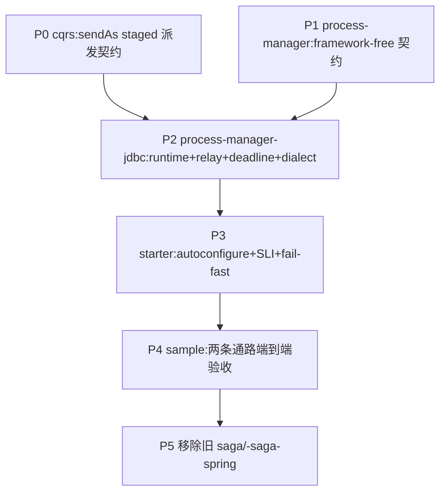

# Durable Process Manager 落地计划

把 [[design-00004-durable-process-manager-runtime]](身份契约增补见
[[decision-00016-durable-runtime-staged-message-identity]])落成代码:三个与业务无关的构件模块
`aipersimmon-ddd-process-manager` / `-process-manager-jdbc` / `-process-manager-jdbc-spring-boot-starter`,
并 clean-slate 移除旧 `aipersimmon-ddd-saga` / `-saga-spring`。

**验收锚点**:§13 sample(订单履约)端到端跑通——支付拒绝 → 释放库存 → 请求取消订单 →(已发货则)启动退货;
其中 Payment 作为独立微服务经集成事件往返、Inventory/Order 同进程经 command 往返;effect 崩溃重投幂等
(`messageId == effectId`);当前跑不出即未完成。

全程 test-first,遵守 `-core` 零依赖红线与依赖向内铁律;三模块不依赖任何 scaffold / bounded-context。

## 进度

- ✅ **P0**（`aipersimmon-ddd-cqrs` + `-cqrs-spring`）:`CommandBus.sendAs(cmd, messageContext)` staged 派发契约——
  接口 default 抛 `UnsupportedOperationException`（opt-in，6 个既有实现不破），`RegistryCommandBus` override 为逐字派发
  （不调 idGenerator、不 deriveChild）。测试:`CqrsContractsTest#sendAsIsUnsupportedByDefault`、
  `RegistryCommandBusSendAsTest`（verbatim / 重投同 id / send 仍自铸）、ArchUnit
  `commandHandlersAndApplicationShouldNotCallSendAs` 负向 fixture 转真（cqrs+cqrs-spring+archunit 全绿）。
- ✅ **P1**（`aipersimmon-ddd-process-manager`）:framework-free 契约全部落地——model（12 VO + `ProcessLifecycle`
  含合法迁移表）、definition（`ProcessInput`/`ProcessContext`/`ProcessDecision` 自校验不变量/`ProcessDefinition`/
  `ProcessDefinitionRegistry` 一活跃版本校验）、effect（sealed + 4 record + kind）、runtime（`ProcessRuntime`/
  `ProcessQuery`/`ProcessAdvanceResult`/`ProcessView`）、codec（`PayloadType`/`EncodedPayload`/两 SPI + 双唯一注册表）、
  exception（`ProcessException` 基类 + 7 个）。每包 package-info。测试 32 绿:lifecycle 迁移、Decision 不变量（含
  SUSPENDED 禁用、终态⟺outcome、deadline 歧义、effects 防御拷贝）、Definition/codec 注册表冲突、VO 校验。已注册进
  reactor + BOM（22 模块 validate 绿）。注:effect-context 派生属 runtime 语义，其测试落 P2。
- 🔄 **P2**（`aipersimmon-ddd-process-manager-jdbc`）:
  - ✅ **P2①**（schema + store + 原子推进 + H2 契约）:四表 H2 schema、四个 JDBC store（instance 乐观更新 / transition
    append+dedup / effect 暂存 / deadline 调度取消）、`JdbcProcessRuntime` 原子推进（REQUIRED 事务、resolve/dedup/
    乐观锁+bounded retry/decode/decision/校验合法迁移/暂存 effect 带持久身份 messageId=effectId=transitionId#idx/
    deadline 持久化）、`JdbcProcessQuery`、`JdbcProcessUnitOfWork`、`DuplicateBusinessKeyPolicy`。11 个 H2 契约测试绿
    （原子提交、rollback 无残行、重复 input no-op、reject/fold、revision 递增、非法迁移拒绝、终态 no-op、deadline 落库、
    effect 确定性 id + correlation/causation 派生）。已注册 reactor+BOM。
  - ✅ **P2②**:`JdbcProcessDialect`（`SkipLockedProcessDialect` PG/MySQL + `AtomicUpdateProcessDialect` H2，共享
    候选 SQL 含 per-instance head-of-line 谓词）、`retry`（`ExponentialBackoffPolicy` 带 jitter/上限）、
    `JdbcProcessEffectRelay`（claim→decode→dispatch→DELIVERED/retry/DEAD+SUSPEND，lease token fencing，per-instance
    串行）、dispatcher SPI（`EffectDispatcherRegistry` + `CommandEffectDispatcher` 走 `sendAs` / `IntegrationEventEffectDispatcher`
    走 `publish`）+ effect/instance store 完成方法。测试:6 H2 relay 契约（逐字身份派发、per-instance 有序一次一条、
    瞬时失败重试、耗尽→DEAD+挂起、token fencing、lease 过期重认领）+ **1 PostgreSQL Testcontainers SKIP LOCKED gate**
    （两 worker 并发认领 40 effect，每条恰好派发一次）。jdbc 模块 18 测试全绿。**注**:MySQL gate 复用 `SkipLockedProcessDialect`
    同 SQL，随 P3 starter 的 dialect 选择补一个等价 Testcontainers 用例。
  - ✅ **P2③**:deadline worker——`JdbcProcessDeadlineWorker` claim（dialect 新增 `claimDueDeadlines`，候选 JOIN 实例
    仅取 active，`FOR UPDATE OF d SKIP LOCKED`）→ 转 `ProcessInput` 重入 `handle` → 同事务标 `FIRED`；superseded
    generation 可审计 no-op；耗尽 → DEAD + 挂起（source=DEADLINE）。deadline store 加 load/markFired/scheduleRetry/
    markDead/cancelClaimed/currentGeneration。3 H2 测试绿（fire 推进流程、superseded no-op、耗尽→DEAD+挂起）。jdbc 模块 21 绿。
  - ✅ **P2④**:挂起期 `PARKED` 输入(runtime SUSPENDED 分支改为落 PARKED transition、按 message id 去重、返回而非抛
    → 不再向消息层无界回弹)+ `JdbcProcessOperations`(`redriveEffect` DEAD→PENDING + 无其他 DEAD 时 resume 到
    resumeLifecycle 并按序重放 parked 输入[派生 `parked:<id>` 保证幂等]、`cancelProcess` 终止协调器+取消 pending
    effect/deadline+审计 operator transition)。store 加 resume/redrive/countDead/cancelPending/appendOperator/
    findParkedInputs。3 H2 测试绿(park 不回弹+去重、redrive 恢复并重放、cancel)。jdbc 模块 24 绿。
    **注**:`redriveDeadline`(与 redriveEffect 对称)、timeline/卡死只读查询、`max-lifetime` 兜底 deadline 随 P3 补。
- ✅ **P3**（`-process-manager-jdbc-spring-boot-starter`）:`AipersimmonDddProcessManagerJdbcAutoConfiguration`（收集
  Definition/Codec/Dispatcher → 注册表，全 bean `@ConditionalOnMissingBean` 可覆盖，不扫描业务包、不建表）、
  `ProcessManagerJdbcProperties`（构造期 `validate()` fail-fast）、`ProcessDialectFactory`（`auto` 探测
  DatabaseMetaData / postgresql / mysql / h2）、`ProcessWorkerScheduler`（relay + deadline 各自独立单线程池、异常不杀线程、
  优雅关停）、`ProcessSchemaValidator`（`@DependsOnDatabaseInitialization` 校验四表存在）、DDL 样例（h2/postgresql/mysql）+
  imports。测试:Boot 切片(上下文装配 + 端到端 start→relay 逐字身份派发)2 绿 + **MySQL 8 Testcontainers SKIP LOCKED
  gate**(跑 shipped mysql-schema.sql,两 worker 并发每 effect 恰一次)1 绿。
  **注**:Actuator/Micrometer Health+最小 SLI、`redriveDeadline`、timeline/卡死只读查询、`max-lifetime` 兜底为 P3② 补强项。
- ✅ **P4**（`aipersimmon-ddd-scaffold/multi-module` —— 核心参考 app,原用 `aipersimmon-ddd-saga`）:把 ordering 履约
  从旧 saga 迁到 durable process-manager。`OrderFulfilmentDefinition/State/Input`(application)+ `OrderFulfilmentCodecs`
  (含 `CancelOrder` 的 `CancellationReason` 证据序列化)+ `OrderFulfilmentProcess` 业务口 + `RuntimeOrderFulfilmentProcess`
  (经 `ProcessRuntime` + `JdbcProcessQuery.findRef` 按 orderId 解析实例);adapter/starter 改接 runtime;删
  `OrderFulfilmentProcessManager`/`OrderFulfilmentSaga`/`InMemoryOrderFulfilmentSagaStore` 及 saga 依赖。start app 加
  **docker-compose Postgres**(`compose.yaml` + `spring-boot-docker-compose`)+ 四表 schema + starter;两个验收测试重写为
  驱动 relay 后断言 `ProcessView` 终态。库侧补 `JdbcProcessQuery.findRef`(businessKey→ref 只读解析)。
  **start 模块 18 测试全绿(真实 PostgreSQL Testcontainers)**,含支付拒绝补偿全链路。范围:只迁 multi-module;
  modulith / scaffold-samples 按指示不迁,故本轮**不删** `aipersimmon-ddd-saga`/`-saga-spring`(它们仍被那些消费方使用)。
- ✅ **P3②**（starter 生产化补强,全 7 项落地,test-first）:
  1. **可观测性**:jdbc 侧 framework-free `observe/`——pull 式 `JdbcProcessBacklog`（dead effects/deadlines、oldest-due dwell、
     suspended-by-source、stuck）+ push 式 `ProcessObserver`（claim/dispatch latency、advance-conflict-retries,经不破坏既有
     ctor 的重载注入,默认 NOOP);stores 补聚合读。starter 条件装配 `MicrometerProcessObserver`+`ProcessManagerJdbcMeterBinder`
     （Micrometer）与 `ProcessManagerJdbcHealthIndicator`（Actuator:DB 不可达→DOWN、积压/卡死/dwell→DEGRADED、否则 UP）。
     测试:backlog 5(H2)、observability slice 4、health 3。
  2. **`redriveDeadline`**:与 `redriveEffect` 对称,generation 守卫,`canResume` 现同时校验 dead effect+deadline 才恢复。测试 2。
  3. **只读运维查询**:`JdbcProcessQuery` 收敛四 store（+clock）——分页 search、timeline、pending/dead effect & deadline 工作队列、
     卡死扫描;新增 4 个 view record + store 查询。测试 5。
  4. **max-lifetime 兜底 + payload.max-bytes**:runtime-level `MaxLifetimeExceeded` input + 内置 codec;`start` 挂兜底 deadline
     到期交 Definition;encode 期强制 `payload.max-bytes`（`ProcessPayloadTooLargeException`）。props 加 `instance.max-lifetime`/
     `payload.max-bytes`。测试 4。
  5. **Jackson codec 便利装配**(可选):`JacksonProcessCodecConfiguration`(先于核心装配)+ `ProcessSerializationCatalog`;
     显式登记、无 classpath 扫描、无类名回退。测试 1(slice)。
  6. **启动期 fail-fast 补齐**:`ProcessManagerStartupValidator`——运行中实例引用的 Definition/StateSchema 版本均在册、
     IntegrationEvent codec 与 `@EventType` 交叉校验、启用 effect kind 有 dispatcher（`schema-validation=none` 也执行）。测试 7。
  7. **测试矩阵补齐**:relay crash-window（丢 ack 后同 id 重投 at-least-once、洁净投递不重投）、state schema upcast（实例固定
     其 schema、旧 codec decode 期 upcast）、parking 多输入按序重放。
  **验收**:process-manager 32 / jdbc 43(+PG gate) / starter 17(+MySQL gate) 全绿;库重装后 scaffold `start` 18 测试全绿
  (真实 PostgreSQL,含支付拒绝补偿全链路),证明生产化补强未回归 P4。
- ⏳ **P5**（清理）:移除 `aipersimmon-ddd-saga` / `-saga-spring`，更新 BOM / 父 pom / README / design-00001 指向。
  **前置**:modulith 与 scaffold-samples(`orchestrate-with-saga`、`saga-commands-and-outbox`、`scaffold/modulith`)仍用 saga,
  删库前必须先迁它们(本轮范围外)。

## P3② 待办（✅ 已全部完成 —— 保留作实现索引）

**状态**:7 项全部落地并提交、验收全绿(见上 P3② 条目)。下一步是 **P5**(清理旧 saga,须先迁 modulith/scaffold-samples)。

**恢复方式**:代码已全部提交、工作树干净;新会话读本节 + `git log` 即可续做,不需要旧对话上下文。

**踩坑点(务必先知道)**:
- scaffold(`aipersimmon-ddd-scaffold/multi-module`)从 `~/.m2` 解析库工件。**改动 `aipersimmon-ddd/` 任何库模块后,必须
  `cd aipersimmon-ddd && mvn -q install -DskipTests` 重装**,否则 scaffold 编到旧版(P4 曾因 `cqrs-spring` 未重装、
  `sendAs` 用到旧的默认实现而全红)。
- scaffold 验收测试用 **Testcontainers(需 Docker)**;跑 scaffold 用 `mvn -pl start -am test`(必须 `-am`,否则 sibling
  模块 payment-*/inventory-* 解析不到)。
- 库多 DB 测试(PG/MySQL Testcontainers gate)也需 Docker。

**待办(按生产价值排序)**:

1. **可观测性 / 最小 SLI + Health**(design §5.3、§5.5)—— starter 现无任何 Health/Meter bean。
   新增(条件装配于 Actuator/Micrometer 在 classpath 时):`ProcessManagerJdbcMeterBinder` 导出
   `oldest_pending_effect_age`、`oldest_pending_deadline_age`、`dead_effects`、`suspended_instances`、`stuck_instances`、
   `claim_latency`、`advance_conflict_retries`;`ProcessManagerJdbcHealthIndicator`(DB 不可用/积压→DOWN/DEGRADED)。
   需给 `JdbcProcessQuery`/store 加聚合读查询支撑这些指标。
2. **`JdbcProcessOperations.redriveDeadline(deadlineId, generation, operator, reason)`**(design §4.10)——
   与 `redriveEffect` 对称:DEAD→PENDING,复用 deadlineStore;补一个 H2 测试。
3. **只读运维查询**(design §4.10)—— 扩 `JdbcProcessQuery` / store:按 type/businessKey/lifecycle/step/definitionVersion
   分页;transition timeline;pending/dead effects + pending deadlines 列表;卡死实例扫描
   (`lifecycle IN (RUNNING,COMPENSATING)` 且无 pending effect/deadline 且 `updated_at` 超阈值)。
4. **`max-lifetime` 兜底 deadline**(design §4.7)—— 完全缺失:①给 `ProcessManagerJdbcProperties` 加 `instance.max-lifetime`
   (默认 none)与 `payload.max-bytes`;②`JdbcProcessRuntime.start` 在配置非 none 时挂一个兜底 deadline(到期转 input 交
   Definition);③`payload.max-bytes` 在编码时强制。
5. **Jackson codec 便利装配**(design §5.2)—— 可选:`JacksonProcessCodecConfiguration` + `ProcessSerializationCatalog`
   (存在 `ObjectMapper` + 显式 catalog bean 时按 catalog 生成 codec)。
6. **启动期 fail-fast 补齐**(design §5.6)—— 已做:四表存在、注册表冲突。补:①运行中实例引用的
   DefinitionVersion/StateSchemaVersion 均有实现(扫 `process_instance`);②IntegrationEvent effect 的 codec type/version
   与 `@EventType` 交叉校验;③每个启用的 effect kind 有且仅有一个 dispatcher 的正向校验。
7. **测试矩阵补齐**(design §10)—— crash-window 完整矩阵(每个"提交前/后 × 外部副作用前/后")、state schema upcast、
   parking 多场景。

关键文件:库 `aipersimmon-ddd/aipersimmon-ddd-process-manager-jdbc/**` 与
`…-jdbc-spring-boot-starter/**`;scaffold `aipersimmon-ddd-scaffold/multi-module/**`。

## Design

细节见 [[design-00004-durable-process-manager-runtime]]。相位依赖:

P0 与 P1 无相互依赖,可并行;P2 收敛二者。P5 在验收通过后做,避免中途破坏反应堆。

## 备注

- P0 先落，是因为 P2 的 effect relay 依赖 `sendAs`；它也是评审确认的 P0-1 契约（decision-00016）的最小可测切片。
- P2 是最大相位，必须逐子项 test-first；relay/deadline 的多实例与 crash-window 用 Testcontainers，H2 只做快速契约。
- 旧 saga 的移除（P5）是 design-00004 §一 的 clean-slate 结论，但放到最后，确保新链路验收通过再删。
</content>
