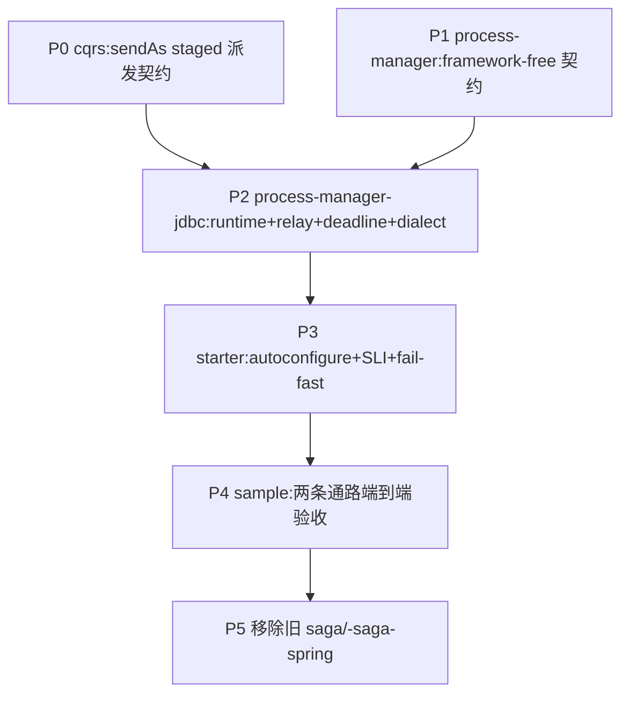

# Durable Process Manager 落地计划

把 [[design-00004-durable-process-manager-runtime]](身份契约增补见
[[decision-00016-durable-runtime-staged-message-identity]])落成代码:三个与业务无关的构件模块
`aipersimmon-ddd-process-manager` / `-process-manager-jdbc` / `-process-manager-jdbc-spring-boot-starter`,
并 clean-slate 移除旧 `aipersimmon-ddd-saga` / `-saga-spring`。

**验收锚点**:§13 sample(订单履约)端到端跑通——支付拒绝 → 释放库存 → 请求取消订单 →(已发货则)启动退货;
其中 Payment 作为独立微服务经集成事件往返、Inventory/Order 同进程经 command 往返;effect 崩溃重投幂等
(`messageId == effectId`);当前跑不出即未完成。

全程 test-first,遵守 `-core` 零依赖红线与依赖向内铁律;三模块不依赖任何 scaffold / bounded-context。

## 进度

- ✅ **P0**（`aipersimmon-ddd-cqrs` + `-cqrs-spring`）:`CommandBus.sendAs(cmd, messageContext)` staged 派发契约——
  接口 default 抛 `UnsupportedOperationException`（opt-in，6 个既有实现不破），`RegistryCommandBus` override 为逐字派发
  （不调 idGenerator、不 deriveChild）。测试:`CqrsContractsTest#sendAsIsUnsupportedByDefault`、
  `RegistryCommandBusSendAsTest`（verbatim / 重投同 id / send 仍自铸）、ArchUnit
  `commandHandlersAndApplicationShouldNotCallSendAs` 负向 fixture 转真（cqrs+cqrs-spring+archunit 全绿）。
- ⏳ **P1**（`aipersimmon-ddd-process-manager`）:framework-free 契约（model/definition/effect/runtime/codec/exception
  + package-info）。测试:Decision 不变量、lifecycle 合法迁移、codec registry 冲突、effect context 派生。
- ⏳ **P2**（`aipersimmon-ddd-process-manager-jdbc`）:四表 store、原子推进、`JdbcProcessDialect`（SKIP LOCKED /
  原子 UPDATE-claim）、effect relay、deadline worker、query/operations、retry。Testcontainers PG/MySQL + H2 契约测试；
  **硬性 gate**:每 dialect claim/lease 的 crash-window 不双投故障注入。
- ⏳ **P3**（`-process-manager-jdbc-spring-boot-starter`）:autoconfigure、properties（构造期校验）、worker 生命周期、
  Health/最小 SLI、DDL 样例、启动期 fail-fast。Boot 切片测试。
- ⏳ **P4**（multi-module scaffold sample）:ordering 履约 Definition/codec + Payment 微服务往返 + Inventory/Order
  同进程往返；端到端验收。
- ⏳ **P5**（清理）:移除 `aipersimmon-ddd-saga` / `-saga-spring`，更新 BOM / 父 pom / README / design-00001 指向。

## Design

细节见 [[design-00004-durable-process-manager-runtime]]。相位依赖:

P0 与 P1 无相互依赖,可并行;P2 收敛二者。P5 在验收通过后做,避免中途破坏反应堆。

## 备注

- P0 先落，是因为 P2 的 effect relay 依赖 `sendAs`；它也是评审确认的 P0-1 契约（decision-00016）的最小可测切片。
- P2 是最大相位，必须逐子项 test-first；relay/deadline 的多实例与 crash-window 用 Testcontainers，H2 只做快速契约。
- 旧 saga 的移除（P5）是 design-00004 §一 的 clean-slate 结论，但放到最后，确保新链路验收通过再删。
</content>
