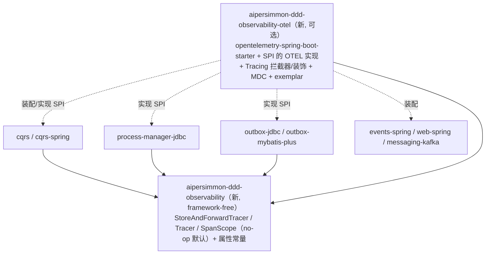

# 可观测性闭环落地计划

把 [[design-00005-observability-and-distributed-tracing]] 落成代码：为 `aipersimmon-ddd` 脚手架建立
Trace / Log / Metric 全链路闭环——同步链路骑 OTEL ambient、两处异步跳（outbox relay、PM relay/deadline）
capture/restore 缝合、领域主干（命令/查询/领域事件/入站 ACL/推进）由脚手架自带 span、并打通三柱互通。

**验收锚点**：`aipersimmon-ddd-scaffold/multi-module` 的订单履约 sample 端到端跑通后，用内存 `SpanExporter`
断言 **一条请求产出一棵连通的 trace**——`command OrderPlaced` → `domain-event ...` → 跨异步跳的 `outbox.publish`
/ `process.advance` / `effect.dispatch` 经 **Span Link** 关联回创建者、下游 command 串上；每条相关日志带
`trace_id`/`span_id`；一个 SLI 指标带 exemplar 指回该 trace。当前跑不出即未完成。

全程 test-first。铁律：`aipersimmon-ddd-observability` framework-free、零 OTEL/Spring 依赖；`core`/`cqrs`/
`integration`/`process-manager`/`outbox` **不得**新增 OTEL 依赖；OTEL 只落 `aipersimmon-ddd-observability-otel`；
**未装配该可选模块时全链路 no-op、行为与今天逐字一致**（每阶段以此为回归红线）。

## 一、Design

详见 [[design-00005-observability-and-distributed-tracing]]。落地关键结构：

新增 durable 列（PM 三表 + 两套 outbox 表，全 DDL 副本）：`traceparent VARCHAR(55)`、`trace_state VARCHAR(512)`，均可空、无索引，紧邻既有 `trace_id`。

## 二、进度

- ✅ **P0**（`aipersimmon-ddd-observability` 契约 + durable 列，**无行为变化**）
  - ✅ 新模块 `aipersimmon-ddd-observability`：`StoreAndForwardTracer`（`captureCurrent()`/`restore()` + `Captured`/`Scope`）、
    领域埋点用抽象 `Tracer`/`SpanScope`、`ObservabilityAttributes` 属性键常量；全部 no-op 默认（`NoOpStoreAndForwardTracer`/`NoOpTracer`）。
    零 OTEL/Spring 依赖；package-info。注册进 reactor + BOM。`NoOpObservabilityTest` 3 绿。
  - ✅ DDL：所有含这些表的 schema 副本加 `traceparent VARCHAR(55)` + `trace_state VARCHAR(512)`（可空、无索引，紧邻 `trace_id`）——
    PM `{h2,mysql,postgresql}` 生产 + PM-jdbc 测试 + PM starter 测试；`outbox-jdbc`/`outbox-mybatis-plus` 主+测试；scaffold
    `multi-module/start`、`microservice/{inventory,ordering}-service`、`scaffold-samples/{integration-events-over-kafka,
    reliable-integration-events,saga-commands-and-outbox}` 共 16 文件。**所有消费方副本一并加**，避免 P2 store 写列时打穿未迁移消费方。
  - ✅ **store 层不改**：INSERT 用显式列名、SELECT 按名映射，加可空列对现有 SQL 零影响 → P0 纯 DDL、真正无行为变化；`traceparent`/`traceState`
    的字段读写与捕获**下沉到 P2 一起做**（此前计划的"写 null"步骤取消，因无必要且会引入死字段）。
  - ✅ 回归验证：PM-jdbc 114 / outbox-jdbc 16 / outbox-mybatis-plus 11 / PM starter 23（含**真实 MySQL Testcontainers SKIP LOCKED gate**）全绿；
    scaffold `multi-module` 18（含 `PaymentCompensationFlowTest`/`OrderingFlowTest` **真实 Postgres**）全绿。H2/MySQL/Postgres 三库均验证。

- 🔄 **P1**（OTEL 实现 + 领域主干 span）
  - **模块拆分决定**：design §十五 原设想单模块 `observability-otel`；落地时按本仓一贯的「impl 模块 + `*-spring-boot-starter`」约定拆为两个——
    `aipersimmon-ddd-observability-otel`（纯 OTEL SPI 实现，仅依赖 `opentelemetry-api`，无 Spring）+ `aipersimmon-ddd-observability-otel-spring-boot-starter`
    （Boot 装配 + `opentelemetry-spring-boot-starter` 边界自动埋点 + 领域 span bean）。OTEL 版本统一由父 pom 的 `opentelemetry-instrumentation-bom` 2.29.0 管理（置于 Spring Boot BOM 之前，解析得 starter 2.29.0 / api 1.63.0）。
  - ✅ **P1①**（`observability-otel`）：`OpenTelemetryTracer`（域 span）、`OpenTelemetryStoreAndForwardTracer`（`captureCurrent`=inject / `restore`=extract+**Span Link**）。
    测试用真实 SDK + `InMemorySpanExporter`：域 span 名/属性、capture 带 traceId + sampled 位、restore 以 link 回创建者为新 trace、无活跃 span→NONE。4 绿。
  - ✅ **P1②**（`observability-otel-spring-boot-starter`）：`TracingCommandInterceptor`（`CommandInterceptor`，`order=-100` 最外层，wrap 整条链；span `command <type>` + 4 属性；异常 `setStatus(ERROR)`+`recordException`）；
    `AipersimmonDddObservabilityOtelAutoConfiguration`（`@ConditionalOnClass`，注入 `OpenTelemetry` bean 构造 `Tracer` + 拦截器，全 `@ConditionalOnMissingBean` 可覆盖）。测试：拦截器单测（成功/失败）2 + 装配 context-runner（present/override）2，共 4 绿。
  - ✅ **P1③**（`process.advance` span——真正的覆盖缺口）：`JdbcProcessRuntime` 经 framework-free `Tracer` SPI 在 `start`/`handle` 外层开
    `process.advance <type>` span（属性 `process.type`/`business_key`/`instance_id`/`lifecycle`，失败 `error`+`recordException`），wrap 重试与事务；
    新增 16-参 canonical ctor（15-参委派 `NoOpTracer.INSTANCE`，既有 ctor/测试不破）；PM starter 经 `ObjectProvider<Tracer>` 注入（缺省 NOOP）。
    `process-manager-jdbc` 仅依赖 framework-free `observability`、**不引入 OTEL**——测试用 recording `Tracer` 断言（无需 OTEL），55 绿；PM starter 23 绿。
    **取舍**：QueryBus / DomainEvents / 入站 ACL 的装饰式子 span **暂缓**——领域事件/投影同步跑在命令 span 内（已覆盖，仅细化）、查询在 HTTP+JDBC span 内、
    且三者需 BeanPostProcessor/AOP 装饰，边际价值低于成本；`process.advance` 才是唯一「不在任何既有 span 下」（relay/deadline 异步驱动）的真缺口。若后续需要，作为 P3 后可选细化项补。

- 🔄 **P2**（durable 跳缝合：capture/restore + Span Link）
  - **SPI 精化**：`StoreAndForwardTracer.restore(traceparent, traceState, spanName)` 第三参改为「调用方给全名」（`outbox.publish <id>` / `effect.dispatch <id>`），
    使**单个** `StoreAndForwardTracer` bean 可服务所有 seam；OTEL 实现去掉 prefix 构造参；observability-otel starter 装配该 bean（`@ConditionalOnMissingBean`）。
  - ✅ **P2①**（outbox-jdbc）：`OutboxWriter` 写行前 `captureCurrent()` → 新增 `traceparent`/`trace_state` 两列写入；`OutboxRelay` SELECT 两列、
    派发前 `restore(...,"outbox.publish "+eventId)` 起 link span（Kafka producer 埋点据此把 header 盖成本 span，link 回写行 span）；autoconfig 经 `ObjectProvider<StoreAndForwardTracer>` 注入（NOOP 默认）。
    新旧 ctor 重载保持兼容。测试：recording tracer 验证「写行存 tp / relay 以 outbox.publish 名 restore」2 绿，outbox-jdbc 共 18 绿；OTEL link 行为已由 observability-otel 覆盖。
  - ⬜ **P2②**（outbox-mybatis-plus）：同构接入 writer/relay/autoconfig。
  - ⬜ **P2③**（PM）：`JdbcProcessRuntime` 持久化 effect/deadline/transition 时 `captureCurrent()` 存列；`JdbcProcessEffectRelay`/`JdbcProcessDeadlineWorker` 捞起 `restore("effect.dispatch"/"deadline.fire" ...)` link 再派发；
    一并回收 [[issue-00025-correlation-propagation-and-scrape-batching]] 第 1 条（deadline/parked 处贯穿 `correlation_id`+`traceparent`）。

- ⬜ **P3**（三柱闭环）
  - trace↔log：OTEL logback MDC 注入 `trace_id`/`span_id`；与既有 `correlationId`/`traceId` MDC 并存；提供 MDC key 约定 + 示例 pattern（不强加 logback 文件）。
  - trace↔metric：[[design-00004-durable-process-manager-runtime]] §5.3 SLI 加 exemplar（优先 `dispatch_latency`/`claim_latency`/`advance_conflict_retries`）。
  - 属性目录：落实 `ObservabilityAttributes`（§10.3 表），对齐 OTEL `messaging.*`；payload 绝不进属性。
  - 错误语义（对齐 [[design-00003-exception-model]]）：handler 异常/codec 失败/DEAD→SUSPENDED/revision 冲突/运维 redrive·cancel 的 span error status + event。
  - 测试：日志含 span_id（capturing appender）、指标带 exemplar、失败路径 span status=ERROR。

- ⬜ **P4**（可选增强 + 端到端验收）
  - 可选：baggage（`business_key`/租户，默认关）、tail-sampling collector 示例、日志/错误体以真 `trace_id` 收敛替换 UUID。
  - `multi-module` sample 接 `observability-otel` + Postgres，跑验收锚点（连通 trace + link + 日志关联 + exemplar）。

## 三、验收路径

1. 全 reactor `mvn -q verify` 绿；`aipersimmon-ddd-observability` 零 OTEL/Spring 依赖（ArchUnit/enforcer 守护）。
2. 未装配 `observability-otel`：无任何 span/MDC-span/exemplar，既有测试逐字全绿（no-op 回归）。
3. 装配后单元/切片：`command`/`query`/`domain-event`/`acl`/`process.advance` span 属性齐；durable 跳的派发 span 经 **Span Link** 关联回创建者、`trace_id` 一致、`sampled` 位透传（outbox jdbc + mybatis-plus + PM 各覆盖）。
4. 失败路径 span `status=ERROR` + `recordException`；DEAD→SUSPENDED 打 `process.suspended` event。
5. 日志行含 `trace_id`/`span_id`；SLI 指标带 exemplar 可回跳 trace。
6. **端到端**：`multi-module` 订单履约（含支付拒绝补偿）跑通，内存 exporter 断言全链路一棵连通 trace（跨同进程 command 往返 + 跨异步 outbox/PM 跳 + Span Link）。

## 四、关联

- [[design-00005-observability-and-distributed-tracing]]（父）
- [[design-00004-durable-process-manager-runtime]]（异步 relay/deadline、SLI）
- [[decision-00013-command-context-and-causation-propagation]]（因果传播、元数据不进 payload）
- [[design-00003-exception-model]]（span 错误语义对齐）
- [[issue-00025-correlation-propagation-and-scrape-batching]]（P2 一并回收）
- [[process-manager-schema-copies]]（DDL 多副本同步）
