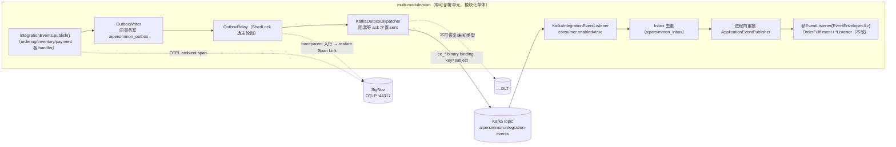

# 多模块参考应用中间件集成落地计划

把 `aipersimmon-ddd-scaffold/multi-module` 从"进程内、内存、无 broker"的最小可跑示例，升级为一个
**接真实中间件的完整应用示例**：集成事件走 **Kafka**（transactional outbox → Kafka → 幂等 inbox → 进程内桥接），
所有可靠消息与编排状态落 **PostgreSQL**（outbox / inbox / process-manager 三套表，单一来源 Flyway 迁移），
全链路 trace 导出到 **SigNoz**（OTLP → otel-collector → ClickHouse）。中间件拓扑由用户提供的 `compose.yaml`
（postgres 18.1 + Kafka KRaft 3.7.1 + kafka-ui + SigNoz 全家桶）承载。

**目标口径**：凡是"骑在这三类中间件之上"的 aipersimmon-ddd 组件都要接进来并跑通——
`messaging-kafka` / `outbox-jdbc` / `inbox-jdbc` / `observability-otel-spring-boot-starter` / `flyway`
（三组件 schema）。与中间件无关的能力（Redis web-store、CQRS 读模型、聚合 JDBC 持久化）**不在本计划**，
见"六、显式不在范围"。

**验收锚点**：`docker compose up -d` 起全套中间件后，向 `POST /orders` 下一单，订单履约全流程
（下单 → 预留库存 → 收款 → 确认；及支付拒绝 → 释放库存补偿）跨上下文事件**全部经 Kafka topic
`aipersimmon.integration-events` 往返**（在 kafka-ui 可见消息、`ce_*` CloudEvents 头齐、key=聚合 subject），
消费端 inbox 去重，进程内 `@EventListener` 处理器不改一行仍被触发；同一笔订单在 SigNoz 里呈现
**一棵连通 trace**（命令 → outbox.publish → Kafka → 消费 → 下游命令，跨异步跳经 Span Link 关联）。
`docker compose down` 后 `mvn -q verify` 仍全绿（测试不依赖真实 SigNoz，用 Testcontainers + 内存 exporter）。

**铁律**：本计划**只动 `multi-module/start` 的装配与配置 + 中间件编排文件**，不改任何业务代码——
发布方只调 `IntegrationEvents.publish()`（[[decision-00006-integration-event-transport-selection]]），
5 处跨上下文 `@EventListener(EventEnvelope<X>)` 消费者不变；集成事件契约（`@EventType` + `subject()`）
已就绪（[[decision-00014-cloudevents-integration-event-contract]]）。传输切换是"换 starter + 属性"，非改代码。

## 一、Design

### 1.1 现状 → 目标

| 维度 | 现状（as-is） | 目标（to-be） |
| --- | --- | --- |
| 集成事件传输 | 方式一：进程内同步（`SpringIntegrationEvents` / events-spring） | 方式三：broker + outbox（`OutboxWriter` + `KafkaOutboxDispatcher`） |
| 可靠性语义 | 无重试、无持久，进程崩溃即丢 | at-least-once（outbox 同事务写 + relay 重投 + inbox 去重） |
| PostgreSQL 用途 | 仅 process-manager 四表 | + outbox 表 + inbox 表（均由 flyway 单一来源迁移） |
| 可观测性 | 未装配，全链路 no-op | OTLP 导出 SigNoz，同步 + 异步跳连通 trace（承 [[plan-00005-observability-implementation]]） |
| 本地中间件 | `start/compose.yaml` 仅 postgres（db=ordering） | 用户提供的 compose：postgres 18.1 + Kafka + kafka-ui + SigNoz |

### 1.2 目标事件流（方式三）

关键机制（均为库既有行为，本计划只装配）：
- **发布方零感知**：outbox 一旦在 classpath，`SpringIntegrationEvents`（`@ConditionalOnMissingClass(OutboxWriter)`）
  自动让位，`IntegrationEvents` port 背后换成 outbox 实现。
- **消费桥回进程内**：`aipersimmon.ddd.messaging.kafka.consumer.enabled=true` 注册
  `KafkaIntegrationEventListener`，经 inbox 去重后用 `ApplicationEventPublisher` **重投为进程内事件**——
  故现有 5 处 `@EventListener` 处理器原样触发（`OrderFulfilment`、payment `PaymentRequestedListener`、
  inventory `OrderPlacedListener` / `StockReleaseRequestedListener`、application `OrderFulfilmentStarter`）。
- **CloudEvents 线格式**：`@EventType(name, version)` → `ce_type`/`ce_dataschemaversion`，`subject()`=orderId → 消息 key，
  同一订单事件保序落同一分区（[[decision-00014-cloudevents-integration-event-contract]]）。
- **trace 缝合**：outbox 行持久化 `traceparent`/`trace_state`，relay 派发前 `restore(...)` 起 `outbox.publish` span 并
  Span Link 回创建者（[[plan-00005-observability-implementation]] P2 已在库侧交付，本计划只需装配 OTEL starter + 配 OTLP 端点）。

### 1.3 中间件拓扑（据用户 compose）

| 服务 | 镜像 | 宿主端口 | 应用侧用途 |
| --- | --- | --- | --- |
| db | postgres:18.1 | 5432 | outbox / inbox / process-manager 表（db=`hancock`, user/pass=`postgres`） |
| kafka | bitnamilegacy/kafka:3.7.1（KRaft） | 9092（PLAINTEXT） | 集成事件 topic；`AUTO_CREATE_TOPICS_ENABLE=true` |
| kafka-ui | provectuslabs/kafka-ui | 8080 | 人工核验消息/头/分区 |
| otel-collector | signoz-otel-collector | 44317(gRPC)/44318(HTTP) | 应用 OTLP 导出目标 |
| signoz | signoz | 48080 | trace/log/metric 可视化 |
| clickhouse / zookeeper / migrator / init | — | 48123 | SigNoz 存储后端（应用不直连） |

> **注意 db 名从 `ordering` 变为 `hancock`**：`application.yml` 的 datasource 需同步（见 P1）。

## 二、Tasks（分阶段，尽量低耦合）

> 全程 test-first；每阶段结束跑 `multi-module` reactor `mvn -q verify` 作回归红线。
> P1/P2/P3 相互独立，可并行；P4 依赖三者，P0 为共同前置。

- **P0 — 中间件编排文件就位（不改应用）**
  - 用用户提供的 compose **替换** `start/compose.yaml`（postgres + kafka + kafka-ui + SigNoz 全套）。
  - 落地 compose 引用的挂载：`start/docker/postgres/`（init SQL，可留空占位）、`start/docker/signoz/`
    （`otel-collector-config.yaml`、`otel-collector-opamp-config.yaml`、`clickhouse/{users,custom-function,cluster,logging}.xml`、
    `clickhouse/user_scripts/`）——取自 SigNoz 官方 local 部署样板。
  - **决定 SigNoz 生命周期**（见"五、开放决策"）：默认建议 `spring.docker.compose.lifecycle-management=start-only`
    且**不**让 Boot 管理 SigNoz（重、启动慢），SigNoz 由 `docker compose up -d` 侧带；或放 compose profile。
  - 验收：`docker compose up -d` 全服务 healthy；kafka-ui / SigNoz UI 可访问。**无代码变化。**

- **P1 — PostgreSQL + outbox/inbox schema（可靠消息底座）**
  - `start/pom.xml` 增依赖：`aipersimmon-ddd-outbox-jdbc`、`aipersimmon-ddd-inbox-jdbc`
    （二者带 ShedLock relay 与幂等 store；不再需要显式挑 bean）。
  - `application.yml`：
    - datasource 指向 `jdbc:postgresql://localhost:5432/hancock`，user/pass=`postgres`。
    - `aipersimmon.ddd.flyway.components: [process-manager, outbox, inbox]`（现仅 `process-manager`；三组件各用独立
      history 表 `flyway_schema_history_aipersimmon_{component}`，SQL 已随组件提供 h2/mysql/postgresql 方言；
      模块须在 classpath 上，migrator 按 `classpath*:aipersimmon/db/migration/{component}/{vendor}` 发现）。
  - **outbox 迁移一并建 `aipersimmon_dead_letter` 与 ShedLock 的 `shedlock` 表**（relay 单实例选主用），无需额外 DDL；
    inbox 表主键为复合 `(consumer, message_key)`（比 samples 内联 schema.sql 的简化版更规范）。
  - 验收：启动后 psql 见 `aipersimmon_outbox` / `aipersimmon_dead_letter` / `shedlock` / `aipersimmon_inbox` / PM 四表；既有 `OrderingFlowTest` /
    `PaymentCompensationFlowTest` 改为**经 outbox 进程内 relay**跑通（此时 dispatch 仍是默认，未上 Kafka）——
    验证 outbox 落库 + relay 重投链路。

- **P2 — Kafka 传输（切方式三）**
  - `start/pom.xml` 增 `aipersimmon-ddd-messaging-kafka`（带 spring-kafka）。
  - `application.yml`（键值可照抄，参 `integration-events-over-kafka` sample）：
    - `spring.kafka.bootstrap-servers: localhost:9092`。
    - `spring.kafka.producer.{key,value}-serializer: ...StringSerializer`；`spring.kafka.consumer.{key,value}-deserializer:
      ...StringDeserializer`（payload 为已序列化 JSON 字符串，元数据走 `ce_*` header）。
    - `spring.kafka.consumer.auto-offset-reset: earliest`（消费组 id 缺省 `${spring.application.name}`，无需显式写）。
    - `aipersimmon.ddd.messaging.kafka.topic: aipersimmon.integration-events`（默认值，可显式写明；**单 topic，无按类型路由**）。
    - `aipersimmon.ddd.messaging.kafka.consumer.enabled: true`（启用消费桥；否则只发不收）。
    - `aipersimmon.ddd.integration.source: ${spring.application.name}`（盖到 `ce_source`）。
    - （可选）`aipersimmon.ddd.outbox.poll-delay-ms`（默认 1000）relay 轮询节奏。
    - DLT 落 `aipersimmon.integration-events.DLT`（有界指数退避后死信）；**不可重试直接死信**：
      `UnknownIntegrationEventException` / `MalformedIntegrationEventException` / `JsonProcessingException`。
  - **消费者组身份**：单进程同时是生产者与消费者，自消费同一 topic——桥接把所有事件重投进程内，各
    `@EventListener` 按 payload 类型各取所需（语义与今天一致，只是多了一跳 broker）。
  - 验收：下单后 kafka-ui 见 topic 有序消息、`ce_*` 头齐、key=orderId；inbox 去重生效（重复投递不产生重复副作用）；
    履约与补偿两条流跑通。

- **P3 — 可观测性导出 SigNoz（承 plan-00005）**
  - `start/pom.xml` 增 `aipersimmon-ddd-observability-otel-spring-boot-starter`（`@ConditionalOnClass` 装配，
    传递带 `opentelemetry-spring-boot-starter` 边界埋点 + logback-mdc + micrometer exemplar）。
  - `application.yml` / 环境变量：`otel.exporter.otlp.endpoint: http://localhost:44317`（gRPC；或 44318 走 http/protobuf，
    与 `otel.exporter.otlp.protocol` 一致）、`otel.service.name: ${spring.application.name}`；logback pattern 引用
    `%mdc{trace_id}`（trace↔log 关联，plan-00005 P3 as-built）。
  - 验收：SigNoz Traces 里一笔下单为**一棵连通 trace**——`command PlaceOrder` → 领域事件 → `outbox.publish` 经
    Span Link 关联 → 消费侧 span → 下游 `command`；日志带 `trace_id`；指标带 exemplar 可回跳。

- **P4 — 端到端验收 + 测试基座**
  - 新增/改造 `start` 验收测试用 **Testcontainers**：postgres（已有）+ **KafkaContainer**（`@ServiceConnection`），
    trace 用**内存 `InMemorySpanExporter`**（**不**连真实 SigNoz），断言事件确经 outbox→Kafka→inbox 往返、一棵连通 trace。
    可参照 `scaffold-samples/integration-events-over-kafka`（EmbeddedKafka 端到端）与 plan-00005 P4 的 `ConnectedTraceEndToEndTest`。
  - 保留一个**纯进程内**回归（不引 Kafka 的 profile 或既有断言），确认装配切换未改业务语义。
  - 清理：`multi-module/pom.xml` 顶部注释仍写"one bounded context (ordering)"，与实际三个 BC（ordering/inventory/payment）
    不符，一并订正。

## 三、验收路径

1. `docker compose up -d` 全中间件 healthy；kafka-ui（:8080）、SigNoz（:48080）可访问。
2. `mvn -q spring-boot:run`（start）启动，Flyway 建出 outbox/inbox/PM 表（三独立 history 表）。
3. `POST /orders` 下一单成功链路：kafka-ui 见 `aipersimmon.integration-events` 有序消息、`ce_*` 头齐、key=orderId；
   订单最终 CONFIRMED；SigNoz 见连通 trace + 带 `trace_id` 的日志 + exemplar。
4. 支付拒绝补偿链路：库存释放事件同样经 Kafka；订单 CANCELLED；补偿 trace 连通。
5. inbox 幂等：重复投递（或 relay 重投）不产生重复副作用。
6. `docker compose down` 后 `mvn -q verify` 全绿：Testcontainers（postgres + Kafka）+ 内存 exporter 断言端到端，
   **不依赖真实 SigNoz**；ArchUnit / package-info 测试不破。
7. 未上本计划的纯进程内回归仍绿（装配切换未改业务语义）。

## 四、关联

- [[design-00001-aipersimmon-ddd-and-scaffold]]（父；§5.6/5.8/5.14 传输与 Kafka）
- [[decision-00006-integration-event-transport-selection]]（方式三装配：deps + `consumer.enabled` + inbox）
- [[decision-00014-cloudevents-integration-event-contract]]（`@EventType`/`subject`/`ce_*`/key=subject）
- [[decision-00016-durable-runtime-staged-message-identity]]（暂存消息身份，outbox/PM 行标识）
- [[plan-00005-observability-implementation]]（trace 缝合与三柱闭环，本计划只装配 OTEL starter + 配 OTLP）
- [[issue-00003-messaging-delivery-reliability]]、[[issue-00010-verify-kafka-dlt-with-embedded-broker]]、
  [[issue-00011-bound-outbox-kafka-send-await]]（Kafka/DLT/outbox 已知遗留项，落地时对照）
- [[process-manager-schema-copies]]（PM DDL 多副本；本计划 start 经 flyway 单一来源，不复制）
- scaffold-samples：`integration-events-over-kafka`、`reliable-integration-events`（装配范本，仅参考不引以为设计权威）

## 五、开放决策（落地前需拍板）

1. **SigNoz 由谁管生命周期？** 全家桶重（clickhouse+zookeeper+migrator），若交给 `spring-boot-docker-compose`
   会拖慢 `spring-boot:run` 且可能超启动超时。**建议**：Boot 只 `start-only` 管 postgres+kafka，SigNoz 由
   `docker compose up -d` 侧带；或将 SigNoz 收进 compose profile（如 `observability`），按需拉起。
2. **compose 命名对齐**：用户 compose 用 `hancock` / `payment_platform_*` volume 前缀。是否统一改成本示例名
   （如 `multi-module` / `ordering`）以免歧义？默认沿用用户提供的命名，仅同步 `application.yml` datasource。
3. **compose/docker 目录落点**：建议随现约定放 `start/`（`start/compose.yaml` + `start/docker/`），保 `spring-boot:run`
   自动发现；SigNoz 官方配置文件需一并纳入版本库。

## 实施记录（as-built，全部已验证）

以用户提供的 compose 为中间件底座，按拍板意见落地：命名改为示例名（`ordering` / `signoz`），SigNoz 走
`observability` compose profile 由 `docker compose --profile observability up -d` 侧带、Boot 只 `start-only`
管 postgres+kafka+kafka-ui，编排文件落 `start/`。

- ✅ **P0 编排**：`start/compose.yaml` 换成用户 compose（`db` postgres:18.1 + KRaft kafka 3.7.1 + kafka-ui + SigNoz 全家桶，
  SigNoz 各服务加 `profiles: ["observability"]`；volume 前缀 `ordering_*`/`signoz_*`）。`start/docker/`：`postgres/`
  init 占位、`signoz/otel-collector-config.yaml`（OTLP→ClickHouse）、`otel-collector-opamp-config.yaml`、
  `clickhouse/{cluster,users,custom-function,logging}.xml` + `user_scripts/`（取自 SigNoz 标准 local 部署，随镜像版本刷新）。
- ✅ **P1 Postgres + outbox/inbox**：`start/pom.xml` 加 `outbox-jdbc` + `inbox-jdbc`；`application.yml`
  `aipersimmon.ddd.flyway.components: [process-manager, outbox, inbox]`。启动实测三组件各自独立 history 表建表
  （`flyway_schema_history_aipersimmon_{outbox,inbox,process-manager}`），outbox 迁移一并建 `aipersimmon_dead_letter` + `shedlock`。
- ✅ **P2 Kafka（方式三）**：加 `messaging-kafka`；`topic=aipersimmon.integration-events`、`consumer.enabled=true`、
  String (de)serializer、`auto-offset-reset=earliest`、`integration.source=${spring.application.name}`。发布方与 5 处
  `@EventListener` **零改动**。
- ✅ **P3 可观测性**：加 `observability-otel-spring-boot-starter`；`application.yml` `otel.exporter.otlp.endpoint=http://localhost:44317`
  `protocol=grpc`、`otel.service.name=${spring.application.name}`。测试经 `start/src/test/resources/application.properties`
  设 `otel.sdk.disabled=true`（无 collector）。
- ✅ **P4 验收**：`TestPostgres`→`TestInfrastructure`（加 `@ServiceConnection` KafkaContainer `apache/kafka:3.7.1`，
  postgres 对齐 `postgres:18.1`）；三支流程/契约测试改为 **Awaitility 异步等待**（`settle()`/`pollOnce()` 退役，因事件已异步）。
  订正根 pom "one bounded context" 陈旧注释【见下】。
  - **单元/切片验收**：`mvn -pl start -am verify` 全绿（18 tests），跑在**真实 Postgres 18.1 + Kafka 容器**上，事件确经 outbox→Kafka→inbox 往返。
  - **端到端验收（真实 compose，非 Testcontainers）**：`docker compose up -d` + `mvn spring-boot:run`，`POST /orders`
    的订单 ~6s 到 `CONFIRMED`；`aipersimmon_outbox` 8 行全 `sent=true`、`aipersimmon_inbox` 8 行去重、topic `aipersimmon.integration-events` 有流量——broker 往返坐实。

### 落地中发现并处理的偏差

1. **`server.port=8090`**（`application.yml`）：kafka-ui 在 compose 占宿主 `8080`，应用 Tomcat 默认 8080 冲突 → 改 8090。
2. **PM-jdbc + inbox-jdbc + outbox-jdbc 的 `Clock` bean 冲突**（库级缺陷，已根治 → [[issue-00026-clock-bean-ambiguity-across-starters]]）：
   多个 starter 各注册一个 `Clock`，`found 2` 报错。**根因两条**：(a) 库刻意不继承 `spring-boot-starter-parent` 故缺
   `-parameters`，按参数名的 bean 消歧失效；(b) outbox/inbox 的 clock 用**按类型** `@ConditionalOnMissingBean`（PM 用**按名**），
   有其他 clock 时整体退避、其自身按名注入落空。**库侧修复**：parent 开 `maven.compiler.parameters=true` + 四个组件 clock 统一
   `@ConditionalOnMissingBean(name=...)`。应用侧曾加的 `@Primary Clock` 兜底**已随之移除**。
3. **inbox 迁移在库内**：`inbox-jdbc` 经 `aipersimmon-ddd-inbox` 提供分方言 SQL，`flyway.components` 列入 `inbox` 即建表，无需应用自带 DDL。
4. **构建口径**：多模块的兄弟模块若解析到 .m2 旧副本会 `NoSuchMethodError`；须整 reactor 构建（`-am`）或先 `mvn install` 刷新 .m2。

## 六、显式不在范围（中间件无关，另立计划）

- **Redis web-store**（`web-store-redis` 幂等/防重放/限流）：用户 compose **未含 Redis**，不在本计划；
  如需，可改用 `web-store-jdbc` 复用 PostgreSQL（另议）。
- **CQRS 读模型 / 投影**（`add-cqrs-read-model` 演示的查询侧）。
- **聚合 JDBC 持久化**：现为 `InMemory*` 仓储，库不提供聚合 ORM，属应用层手写 JDBC，非组件装配——
  建议单独 `plan-00007` 处理"三个聚合落 PostgreSQL"。
