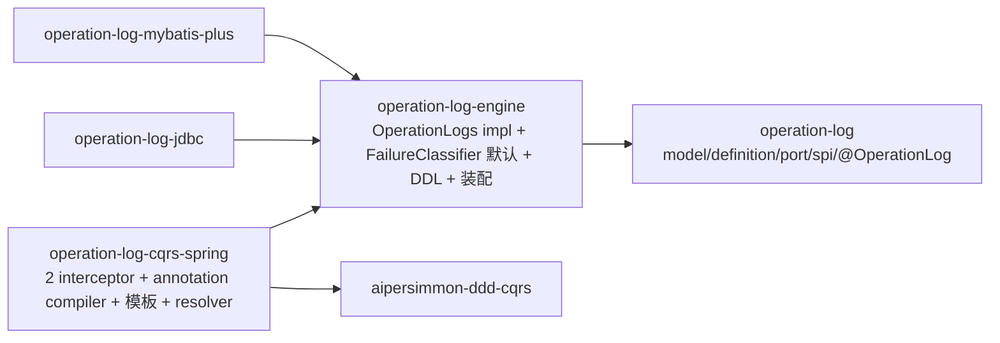

# 通用操作日志组件落地计划

把 [[design-00008-operation-log-component]] / [[spec-00001-operation-log-component]] 落成代码：五模块
（core / engine / cqrs-spring / jdbc / mybatis-plus）的三入口闭环（注解 / Definition / direct-API）+ 双存储后端。

**验收锚点**：一个不依赖业务样例的最小 consumer fixture，能经三种入口在 **`-jdbc`/`-mybatis-plus` × H2/MySQL/PostgreSQL**
六组合下证明 design §十三 / spec §3 的全部场景——`SUCCEEDED+COMMITTED` 同事务、`REJECTED+COMMITTED`（Definition/`rejectedWhen`）、
`REJECTED+NOT_STARTED`、`FAILED+ROLLED_BACK`、成功路径 `ON CONFLICT` 收敛不 abort 事务、失败后重投成功保留两条、
隐私默认拒绝、多租户强制、启动期 fail-fast。当前跑不出即未完成。

全程 test-first。**铁律**：`aipersimmon-ddd-operation-log`（core）framework-free、零 Spring/JDBC/CQRS 依赖（ArchUnit/enforcer 守护）；
未装 `-cqrs-spring` 时 direct-API 仍可用；成功路径重复键必须方言原生收敛（PostgreSQL 不可 catch-异常，见 design §7.3）。

## 一、Design

详见 [[design-00008-operation-log-component]]。落地关键结构：

拦截链（design §6.1，硬约束 Failed<50、200<Completed）：
`Logging0 → Failed25 → Concurrency50 → Validation100 → Transaction200 → Completed250 → handler`。

## 二、任务

> 约定：`[core]` 等标模块；「并行」表示与同批任务无强依赖，可并发推进。每个任务 test-first，含单测；跨库项归 T12。

> **进度**
> - ✅ **T0（core 部分）**：`CONTEXT.md` 增补 Operation Log 术语组；模块 `aipersimmon-ddd-operation-log` 建骨架、入 reactor + BOM。
> - ✅ **T1 + T2**：core 全部 model/definition/port/spi/annotation/exception 落地，17 单测绿，jar 产出，**Spotless/PMD/SpotBugs 全过**（JaCoCo/PIT 90/90/90 gate 尚未接线，留质量收口步）。
>   落地时相对 design §五 的三处**代码级精化**（待回同步 design/us）：① `OperationLogInvocation` 放 `model` 包（非 `definition`），避免 model↔definition 包环；② `FailureClassifier` 返回 `ClassifiedOutcome(outcome, failure)` **不含 completion**——completion（NOT_STARTED vs ROLLED_BACK）依赖事务态，由 interceptor 决定；③ `OperationLogEntry` 把字段并入 `OperationResult`/`EntryTimes`/`TemplateRef` 子记录（16 个组件），以过 PMD `ExcessiveParameterList=18`。
> - ✅ **T3 + T4 + T5**：`aipersimmon-ddd-operation-log-engine` 落地，10 单测绿，Spotless/PMD/SpotBugs 全过，jar + 三方言 DDL + `AutoConfiguration.imports` 打包。`DefaultOperationLogs`（normalize/redact/freeze pipeline，SHA-256 幂等键，UUID id 默认——ULID/UUIDv7 可注入）、`DefaultFailureClassifier`（对齐 design-00003：DomainException→REJECTED、ConcurrencyConflictException→FAILED+CONCURRENCY、其余→FAILED）、`OperationLogProperties`（`aipersimmon.ddd.operation-log.*`）、`AipersimmonDddOperationLogAutoConfiguration`（`OperationLogs`/`FailureClassifier`/clock 全 `@ConditionalOn*`）、三方言 DDL（PG timestamptz / MySQL DATETIME(6)+inline KEY+ascii / H2）。**flyway 迁移集成测试留 T12**（未跨真实库跑）；JaCoCo/PIT gate 仍未接线（留质量收口）。
> - ✅ **T6（jdbc 后端）**：`aipersimmon-ddd-operation-log-jdbc` 落地，5 单测绿（H2 3 + **真实 PostgreSQL Testcontainers 2**），Spotless/PMD/SpotBugs 全过，jar 打包。`JdbcOperationLogSink` + `JdbcOperationLogDialect` 策略（`PostgresOperationLogDialect` 用 `INSERT ... ON CONFLICT DO NOTHING` 不 abort 事务；`DefaultOperationLogDialect`=H2/MySQL 用 plain insert + catch `DuplicateKeyException`，因这些引擎语句级回滚不废整个事务）+ `OperationLogDialectFactory`（按 DataSource product 选，仅 PG 走 ON CONFLICT）+ 自动装配（`before` engine，`@ConditionalOnBean(JdbcTemplate)`/`@ConditionalOnMissingBean(OperationLogSink)`）。**阻断项 spec-00001-XAC-2.1 已在真实 PG 证实**：事务内 append 重复键→converge 不 abort→后续 insert + commit 成功。engine 的三方言 DDL 在 **H2 + PG 真实执行通过**（migration 校验）。
> - ✅ **T7 + T8 + T9（cqrs-spring 捕获）**：`aipersimmon-ddd-operation-log-cqrs-spring` 落地，23 单测绿，Spotless/PMD/SpotBugs 全过，jar + `AutoConfiguration.imports` 打包。**T8** 受限模板引擎（`RestrictedTemplate` + `PropertyAccess` 仅 no-arg accessor + `TemplateFunctions` mask/truncate/defaultValue，启动期编译校验 root/function/arity）；**T9** `@OperationLog` → `AnnotationOperationLogDefinition`（synthesized）、`OperationLogDefinitionRegistry`（按 input type 唯一、冲突 fail-fast）、`OperationLogAnnotationScanner`（AutoConfigurationPackages + ClassPathScanning）、`OperationActorResolver`/`OperationTenantResolver` 契约、`OperationLogInvocationFactory`、auto-config（interceptors `@ConditionalOnBean(OperationLogs)` 才装配，无后端则 inert）；**T7** `CompletedOperationLogInterceptor(250)`（同事务 append）、`FailedOperationLogInterceptor(25)`（root-only、独立事务、重抛原异常、record 错误吞并 log）。用**注入 seam**（`TransactionState` / `IndependentTransactionRunner` / `FailureCompletionPolicy`）使 interceptor 单测化。
>   代码级精化：`OperationLogDraft.withResult(OperationResult)` wither（失败路径由 interceptor 盖 classifier outcome + policy completion）；`DefaultFailureCompletionPolicy` 按 `ConstraintViolationException` simple-name → NOT_STARTED（避 jakarta 硬依赖）；模板 root 对象命令/结果类型**必须 public**（strict 反射不 setAccessible）。
> - ✅ **T12（端到端集成，jdbc × H2/PG）**：`OperationLogEndToEndScenarios` + H2/PG 两个测试类，用**真实** `RegistryCommandBus` + `TransactionCommandInterceptor`(200) + `Failed`(25)/`Completed`(250) + engine `DefaultOperationLogs` + `JdbcOperationLogSink` 跑通四场景并断言落库：①成功业务行与 `SUCCEEDED+COMMITTED` 同事务；②`rejectedWhen` → `REJECTED+COMMITTED` 业务提交；③handler 抛异常 → 业务回滚(0 行) + 独立事务 `FAILED+ROLLED_BACK`；④`sendAs` 同 messageId 重投 → 恰 1 条日志(幂等收敛)。H2(无 Docker) + **真实 PostgreSQL Testcontainers** 各跑一遍（全栈再证 ON CONFLICT 不 abort 事务）。新增 `JdbcOperationLogSink.create(jdbc, DataSource, mapper)` 公有工厂供外部装配。
> - ✅ **T10（MyBatis-Plus 后端）**：`aipersimmon-ddd-operation-log-mybatis-plus` 落地，2 单测绿（H2 + **真实 PostgreSQL**），Spotless/PMD/SpotBugs 全过，jar 打包。`OperationLogRecord`(entity，`@SuppressWarnings("PMD.TooManyMethods")` 因 27 列数据体)、`OperationLogMapper`(BaseMapper + PG 专用 `@Insert ... ON CONFLICT DO NOTHING` + `findExistingRecordId`)、`MybatisPlusOperationLogSink`(方言分支:PG 走 ON CONFLICT、H2/MySQL 走 BaseMapper.insert + catch)、auto-config(MapperFactoryBean + `before` engine + `@ConditionalOnBean(SqlSessionFactory)`)。**与 JDBC 后端行为等价**(同 DDL、同幂等收敛、PG 事务不 abort)，二选一。
> - ✅ **T13（ArchUnit）**：`aipersimmon-ddd-archunit` 增 `OperationLogRules`（两条可复用规则并入 `AiPersimmonDddRules.all()`）：`domainShouldNotDependOnOperationLog()`（domain 不依赖 `com.aipersimmon.ddd.operationlog..`）、`operationLogShouldOnlyAnnotateApplicationCommands()`（`@OperationLog` 仅在 `..application..` 且 implement `Command`）。**按名匹配**注解与包（不 compile 依赖组件，仅 fixtures 走 test scope，同 Spring/Swagger 现有做法）。core-framework-free（第三条）落为**组件自测** `CoreFrameworkFreeTest`（在 `aipersimmon-ddd-operation-log` 内，断言自身字节码零 Spring/JDBC/ORM/JSON/CQRS——可复用规则够不到自家 jar）。archunit 58 单测绿（+4）、core +1，Spotless/PMD/SpotBugs 全过。
> - ✅ **T11（可观测性 metrics）**：引入 framework-free 指标 SPI `OperationLogMetrics`（engine `…engine.observability` 包，`NoOpOperationLogMetrics` 默认，无 Micrometer/OTEL 硬依赖，消费方注 bean 桥接 meter registry）。`DefaultOperationLogs` 发 append attempt/succeeded/duplicate/failed 计数 + redact/append latency（label 仅低基数 `AppendTags{operationCode,outcome,sinkType}`）；`CompletedOperationLogInterceptor` 发 render latency（prepare+complete，排除 handler 时长）；`FailedOperationLogInterceptor` 发 render latency + **failure-record loss**（独立写失败被吞时告警信号，label operationCode）。两 autoconfig 装 `@ConditionalOnMissingBean` 的 no-op bean 并注入。**向后兼容重载构造**（旧构造委托 no-op），33 存量测试零改。新增 engine 3 + cqrs-spring 3 指标发射测试。engine 13 / cqrs-spring 28 绿。
> - ✅ **全 reactor `mvn verify` 整体回归通过**（37 模块全 SUCCESS，含真实 PG Testcontainers；operation-log 六模块 + archunit 均绿）。
> - ✅ **JaCoCo/PIT 90/90/90 质量门收口（按 repo 惯例范围）**：仓库既定惯例只对 **framework-free / Docker-free 契约层模块**（core/application/integration/cqrs）上硬门。据此：
>   - **`aipersimmon-ddd-operation-log`（core）**接同款硬门（JaCoCo line/branch/method ≥90 + PIT mutation/strength/coverage ≥90）——新增 `CoverageClosureTest` 补齐 reader value 类型（Criteria/Cursor/Page）、`OperationLogException`、null-collection 分支、`withResult`；结果 **PIT 95% mutation / 100% strength**，27 测试绿。
>   - **`aipersimmon-ddd-operation-log-engine`**（Docker-free，虽 Spring-aware）扩接硬门——新增 `AipersimmonDddOperationLogAutoConfigurationTest`（`ApplicationContextRunner` 覆盖 autoconfig bean 装配 + `OperationLogProperties` 绑定/条件 back-off）、`RedactorTest`、`NoOpOperationLogMetricsTest`；结果 **PIT 93% mutation / 94% strength、JaCoCo 90/90/90**，22 测试绿。（新增 test-scope 依赖：spring-boot-test / spring-context / assertj-core——`ApplicationContextRunner` 的 `AssertableApplicationContext` 编译期需 AssertJ。）
>   - **`-cqrs-spring` / `-jdbc` / `-mybatis-plus` 保持 report-only（不上硬门）**：与仓库所有 Spring/JDBC/MyBatis adapter 一致（无一上门）。其关键覆盖（拦截器事务语义、PG `ON CONFLICT` 方言分支）需活的 Spring context + Docker，硬门会把构建耦合到 Docker，故不接。
> - ✅ **MySQL 方言真实容器矩阵已补齐**：`JdbcOperationLogSinkMysqlTest`（3）+ `MybatisPlusOperationLogSinkMysqlTest`（1，复用 `MybatisPlusSinkScenarios`）跑真实 **MySQL 8**（Testcontainers `SharedContainers.mysql()`）。证实三件事：① MySQL `V1` DDL（`DATETIME(6)`/inline `KEY`/`CHARACTER SET ascii`/`ROW_FORMAT=DYNAMIC`）真实建表通过；② `DefaultOperationLogDialect` catch-based 收敛在真 MySQL 上成立（撞唯一键 → `DuplicateKeyException` → 收敛为幂等成功）；③ **MySQL 语句级错误不 abort 事务**——事务内撞重复键后，后续 insert + commit 仍成功（对照 decision-00017 命题五：这正是 MySQL 归入 H2 catch 组、而非 PG ON CONFLICT 组的依据；此前仅 H2 类比、未在真 MySQL 证实）。jdbc 现 8 测试（3 H2 + 2 PG + 3 MySQL）、mybatis-plus 现 3（H2/PG/MySQL 各 1）。三方言 × 双后端矩阵闭合。MyBatis-Plus 全栈 E2E 仍由 T12 的 backend-agnostic 拦截器等价性覆盖（未单独重跑）。

### P0 · 骨架与术语（前置）

- **T0** `[repo]` `CONTEXT.md` 增补术语（Operation Log / Audit Log / Operation Outcome / Transaction Completion /
  Actor / Target / OperationChange）；五模块骨架（pom + `package-info` + reactor `<modules>` + `aipersimmon-ddd-bom`
  32→37 条）；空 auto-config + `AutoConfiguration.imports` 占位。**完成标准**：`mvn -q -pl <五模块> validate` 绿、依赖无环。

### P1 · core + engine + jdbc + 捕获（MVP 主体）

**core（framework-free，仅依赖 `aipersimmon-ddd-core`）**
- **T1** `[core]` model：不可变 `OperationLogEntry`/`OperationLogDraft`/`Actor`/`Target`/`OperationChange`/`OperationDetail`/
  `ClassifiedFailure`/`Causality` + 枚举 `Outcome`/`Completion`；封闭 `RecordResult{Appended,Duplicate,Skipped}`、
  `AppendResult{Appended,Duplicate}`。含 `OperationLogDraft` 建造器（`from(invocation)`）。
- **T2** `[core]`（依赖 T1）端口与 SPI：`OperationLogDefinition<I,R>`/`PreparedOperationLog<R>`/`OperationLogInvocation`；
  `OperationLogs`/`OperationLogSink`/`OperationLogReader`（Reader 仅签名，实现留 P3）；`FailureClassifier` + `ClassifiedOutcome`；
  `@OperationLog`（`@Target(TYPE)`）。`Actor.system/user/service` 工厂。

**engine（storage-agnostic，Spring-aware；依赖 core + spring-tx + observability）**
- **T3** `[engine]`（依赖 T2）`OperationLogs` 默认实现：normalize → validate → redact → freeze → append pipeline；
  注入 `OperationLogSink` + `Clock`（name-scoped `operationLogClock`）+ id supplier（UUIDv7/ULID）+ 尺寸/隐私预算；
  `idempotencyKey = SHA-256_hex(messageId|operationCode|outcome|completion)`；CR/LF 清洗、default-deny allowlist、脱敏、size 预算裁剪并计数。
- **T4** `[engine]`（依赖 T2）默认 `FailureClassifier`：对齐 [[design-00003-exception-model]]（预期业务/校验/授权→`REJECTED`；
  `ConcurrencyConflictException`→`FAILED`+`CONCURRENCY`；其余→`FAILED`）；可被消费方 `@Primary` 覆盖。
- **T5** `[engine]` DDL + 装配：`.../db/migration/operation-log/{h2,mysql,postgresql}/V1__aipersimmon_operation_log.sql`
  （design §7.2；PG `timestamptz` / MySQL `DATETIME(6)`+UTC / H2 `TIMESTAMP WITH TIME ZONE`；MySQL inline `KEY`+ASCII 列+DYNAMIC）；
  `OperationLogProperties`（`aipersimmon.ddd.operation-log.*`：source/tenant.enabled/limits.*）；`@AutoConfiguration` 装
  `OperationLogs`/默认 classifier/clock（全 `@ConditionalOnMissingBean`）。Flyway 由既有 `aipersimmon-ddd-flyway` 发现。

**jdbc（依赖 engine）· 并行于 cqrs-spring**
- **T6** `[jdbc]` `JdbcOperationLogSink implements OperationLogSink`：`JdbcTemplate` + SQL 常量 + `RowMapper`；
  **成功路径**方言原生收敛（PG `INSERT ... ON CONFLICT DO NOTHING` + 补 `SELECT` 取既有 id；MySQL `INSERT ... ON DUPLICATE KEY`/`IGNORE`）→ `Duplicate`；
  **genuine 错误**照抛（fail-closed）；`JdbcDialect` 策略按 `DataSource` 选（复用/仿 `ProcessDialectFactory`）；
  `@AutoConfiguration(before = engine)` + `AutoConfiguration.imports`；**不携带 DDL**。

**cqrs-spring（依赖 engine + cqrs）· 并行于 jdbc**
- **T7** `[cqrs-spring]` 两个 interceptor：`CompletedOperationLogInterceptor`(ORDER=250，事务内，`prepare→proceed→complete`，
  同事务 append，fail-closed)；`FailedOperationLogInterceptor`(ORDER=25，外于并发翻译，`FailureClassifier` 归类，root 独立事务
  `TransactionTemplate` 写、重抛原异常；**嵌套子链检测到活动外层事务则不开新事务、上交 root**)。
- **T8** `[cqrs-spring]` 受限模板引擎：property-path 语法（根对象 `input/resultProjection/failure/actor/before/after/context`）+
  纯函数白名单 `{mask,truncate,defaultValue}` + null-safe；**启动期编译校验** + 有界 cache；禁 bean/`T(...)`/构造器/方法/反射/IO。
- **T9** `[cqrs-spring]`（依赖 T7/T8）annotation compiler：`@OperationLog`（含 `rejectedWhen`）→ synthesized `OperationLogDefinition`；
  Definition registry（按 input type 唯一绑定；注解+Definition 双绑/重复/泛型不可判定→启动期 fail-fast）；resolver 契约
  `OperationActorResolver`/`OperationTenantResolver`（缺失且有自动入口→启动失败）；`@AutoConfiguration` 装配 + 启动校验。

### P1b · MyBatis-Plus 后端（并行于 P1 后段，共享 T5 DDL 与 T12 矩阵）
- **T10** `[mybatis-plus]` `MybatisPlusOperationLogSink`：entity + `@TableName` + `BaseMapper`；同样方言原生成功路径收敛、
  失败路径隔离 catch；`@AutoConfiguration(before = engine)`；与 T6 行为等价。

### 横切（贯穿 P1/P1b）
- **T11** `[engine/cqrs-spring]` 可观测性：metric（append attempt/success/failure/duplicate、render/redact/append latency、
  failure-record loss）；label 仅低基数 `operationCode`/`outcome`/`sinkType`；`recordId`/`correlationId` 关联。经既有 observability SPI，无 OTEL 硬依赖。
- **T12** `[test]` consumer fixture + 验收矩阵：不依赖业务样例的最小 consumer；把 spec §3 / design §十三 场景参数化为
  **后端 × 方言**（`-jdbc`/`-mybatis-plus` × H2/MySQL/PostgreSQL，用 `aipersimmon-ddd-test-support` Testcontainers）。
- **T13** `[archunit]` 规则并入 `aipersimmon-ddd-archunit`：domain 不依赖 operation-log；`@OperationLog` 只在 application `Command`；
  core 零 Spring/JDBC/CQRS。

## 三、验收路径

1. 全 reactor `mvn -q verify` 绿；`aipersimmon-ddd-operation-log` 零 Spring/JDBC/CQRS（T13/enforcer 守护）。
2. **注解路径**：`SUCCEEDED+COMMITTED` 恰一条、同事务（us-00001-AC-1.1）；回滚无虚假 `SUCCEEDED`（us-00001-AC-1.2）；
   `recordFailure` 抛异常时 `FAILED+ROLLED_BACK` 且原异常不被替换（us-00001-AC-3.1）；`rejectedWhen` 为真 → `REJECTED+COMMITTED`（us-00001-AC-2.1）。
3. **Definition 路径**：before 每 invocation 只执行一次、`changes` 仅 allowlist 变化、与等价注解走同一 pipeline（us-00002-AC-1.1）；
   `complete/failed` 返回 empty → `SKIPPED` 无行（us-00002-AC-3.1）；注解+Definition 双绑 → 启动失败（us-00002-AC-4.1）。
4. **direct-API**：`@Transactional` batch → `COMMITTED` 同事务，无事务 CLI → `UNKNOWN`（us-00003-AC-1.1）；稳定 key 重跑 → `DUPLICATE`（us-00003-AC-3.1）。
5. **幂等/事务（阻断项）**：PostgreSQL 成功路径重投重复键 → 业务提交成功、变更不丢、无虚假 `FAILED`、日志 `DUPLICATE`
   （spec XAC-2.1）；失败后重投成功保留两条（XAC-1.2）；成功路径 genuine 写错 → 业务回滚（XAC-3.1）。
6. **隐私/租户**：secret/token/stack/完整对象不落库（XAC-5.1）；多租户开启时无 tenant 查询被拒、无跨 tenant 结果（XAC-6.1）；超预算按策略裁剪且可观测。
7. **嵌套 command**：子日志随父事务提交/回滚、失败只由 root 写、无 `REQUIRES_NEW`-while-parent-open。
8. **方言等价**：六组合下唯一约束/幂等收敛/时间序/分页排序一致（XAC-8.1）。
9. **no-op**：仅装 `-cqrs-spring` 之外的 direct-API 路径不因缺失 resolver 而失败；纯 direct-API 应用不触发注解校验。
10. 质量门：覆盖率/静态分析/mutation/集成测试按 `TESTING.md` / [[design-00007-code-quality-gates]] 达标。

## 四、Links
- Spec: [[spec-00001-operation-log-component]] · Design: [[design-00008-operation-log-component]] ·
  Decision: [[decision-00017-operation-log-component-boundaries]] · Analysis: [[analysis-00013-operation-log-component]]
